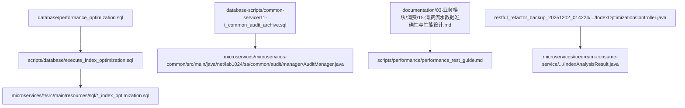
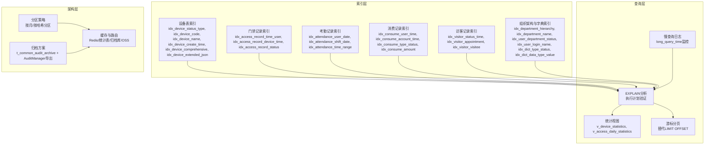
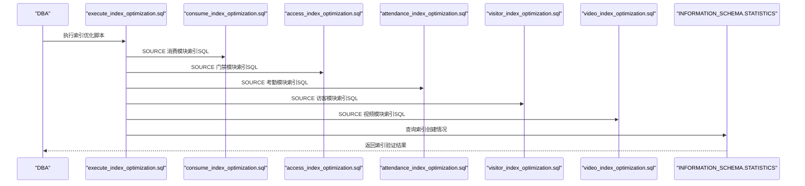
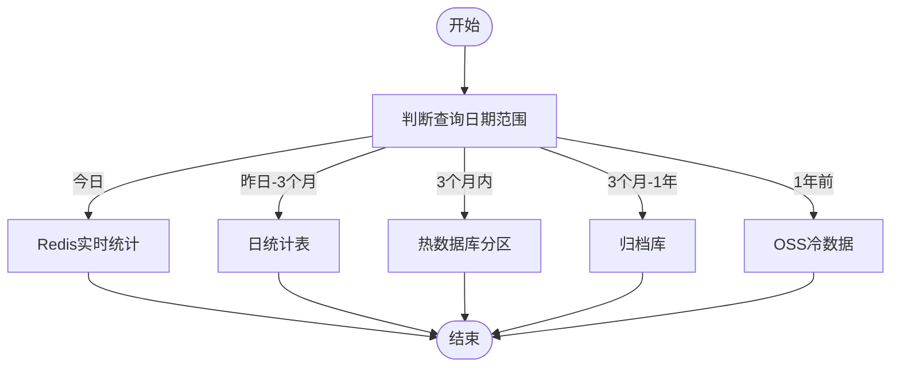
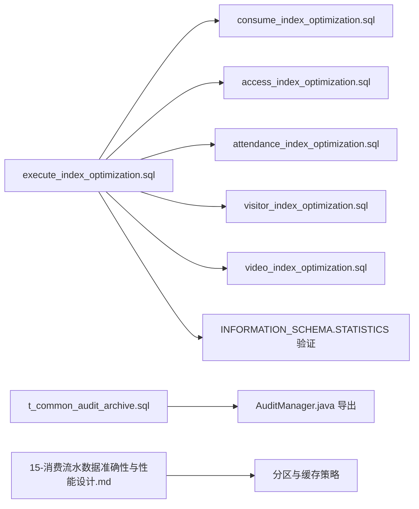

# 数据库性能优化

<cite>
**本文引用的文件**
- [performance_optimization.sql](file://database/performance_optimization.sql)
- [execute_index_optimization.sql](file://scripts/database/execute_index_optimization.sql)
- [execute_index_optimization.ps1](file://scripts/database/execute_index_optimization.ps1)
- [execute_index_optimization.sh](file://scripts/database/execute_index_optimization.sh)
- [INDEX_OPTIMIZATION_EXECUTION_GUIDE.md](file://documentation/deployment/INDEX_OPTIMIZATION_EXECUTION_GUIDE.md)
- [consume_index_optimization.sql](file://microservices/ioedream-consume-service/src/main/resources/sql/consume_index_optimization.sql)
- [access_index_optimization.sql](file://microservices/ioedream-access-service/src/main/resources/sql/access_index_optimization.sql)
- [attendance_index_optimization.sql](file://microservices/ioedream-attendance-service/src/main/resources/sql/attendance_index_optimization.sql)
- [visitor_index_optimization.sql](file://microservices/ioedream-visitor-service/src/main/resources/sql/visitor_index_optimization.sql)
- [video_index_optimization.sql](file://microservices/ioedream-video-service/src/main/resources/sql/video_index_optimization.sql)
- [11-t_common_audit_archive.sql](file://database-scripts/common-service/11-t_common_audit_archive.sql)
- [10-t_audit_log.sql](file://database-scripts/common-service/10-t_audit_log.sql)
- [AuditManager.java](file://microservices/microservices-common/src/main/java/net/lab1024/sa/common/audit/manager/AuditManager.java)
- [AuditArchiveEntity.java](file://microservices/microservices-common/src/main/java/net/lab1024/sa/common/audit/entity/AuditArchiveEntity.java)
- [performance_test_guide.md](file://scripts/performance/performance_test_guide.md)
- [15-消费流水数据准确性与性能设计.md](file://documentation/03-业务模块/消费/15-消费流水数据准确性与性能设计.md)
- [05-数据库设计与ER图.md（智能视频）](file://documentation/03-业务模块/智能视频/05-数据库设计与ER图.md)
- [IndexOptimizationController.java](file://restful_refactor_backup_20251202_014224/microservices_ioedream-consume-service_src_main_java_net_lab1024_sa_consume_controller_IndexOptimizationController.java)
- [IndexAnalysisResult.java](file://microservices/ioedream-consume-service/src/main/java/net/lab1024/sa/consume/util/IndexAnalysisResult.java)
</cite>

## 目录
1. [简介](#简介)
2. [项目结构](#项目结构)
3. [核心组件](#核心组件)
4. [架构总览](#架构总览)
5. [详细组件分析](#详细组件分析)
6. [依赖关系分析](#依赖关系分析)
7. [性能考量](#性能考量)
8. [故障排查指南](#故障排查指南)
9. [结论](#结论)
10. [附录](#附录)

## 简介
本文件围绕数据库性能优化展开，聚焦索引优化、查询优化与架构优化三大方向。通过对仓库中的性能优化脚本、索引执行脚本、审计归档表以及消费模块性能设计文档的深入分析，给出关键查询的索引设计原则（复合索引、覆盖索引）、execute_index_optimization脚本的使用方法与预期效果，并结合消费模块的性能设计文档，提出慢查询诊断、执行计划分析与读写分离的实施建议，以保障系统在高并发下的数据访问效率。

## 项目结构
本项目的数据库性能优化相关文件主要分布在以下位置：
- database/performance_optimization.sql：通用性能优化脚本，包含索引、视图、统计信息更新与执行计划示例。
- scripts/database/execute_index_optimization.*：索引优化执行脚本与指南，覆盖多模块索引SQL。
- database-scripts/common-service/：通用审计归档表定义。
- microservices/*/src/main/resources/sql/：各模块索引优化SQL。
- documentation/03-业务模块/消费/15-消费流水数据准确性与性能设计.md：消费模块性能设计文档，包含分区与缓存策略。
- scripts/performance/performance_test_guide.md：性能测试验证指南。
- restful_refactor_backup_20251202_014224/.../IndexOptimizationController.java：索引优化管理接口（暂禁用）。
- microservices/ioedream-consume-service/.../IndexAnalysisResult.java：索引分析结果模型。

图表来源
- [performance_optimization.sql](file://database/performance_optimization.sql#L1-L270)
- [execute_index_optimization.sql](file://scripts/database/execute_index_optimization.sql#L1-L71)
- [11-t_common_audit_archive.sql](file://database-scripts/common-service/11-t_common_audit_archive.sql#L1-L38)
- [15-消费流水数据准确性与性能设计.md](file://documentation/03-业务模块/消费/15-消费流水数据准确性与性能设计.md#L376-L499)
- [performance_test_guide.md](file://scripts/performance/performance_test_guide.md#L1-L179)
- [IndexOptimizationController.java](file://restful_refactor_backup_20251202_014224/microservices_ioedream-consume-service_src_main_java_net_lab1024_sa_consume_controller_IndexOptimizationController.java#L1-L36)
- [IndexAnalysisResult.java](file://microservices/ioedream-consume-service/src/main/java/net/lab1024/sa/consume/util/IndexAnalysisResult.java#L1-L69)

章节来源
- [performance_optimization.sql](file://database/performance_optimization.sql#L1-L270)
- [execute_index_optimization.sql](file://scripts/database/execute_index_optimization.sql#L1-L71)

## 核心组件
- 通用性能优化脚本：提供索引创建、视图构建、统计信息更新与执行计划示例，覆盖设备、门禁、考勤、消费、访客、组织架构、字典等表。
- 索引优化执行脚本：集中调用各模块索引SQL，提供执行前后验证与EXPLAIN分析示例。
- 审计归档表：提供审计日志归档记录表结构与索引，支撑大表归档与检索。
- 消费模块性能设计文档：明确数据路由、分区剪裁、覆盖索引与缓存策略，指导大表性能设计。
- 性能测试指南：提供测试目标、工具、场景与验证方法，支撑优化效果评估。

章节来源
- [performance_optimization.sql](file://database/performance_optimization.sql#L1-L270)
- [execute_index_optimization.sql](file://scripts/database/execute_index_optimization.sql#L1-L71)
- [11-t_common_audit_archive.sql](file://database-scripts/common-service/11-t_common_audit_archive.sql#L1-L38)
- [15-消费流水数据准确性与性能设计.md](file://documentation/03-业务模块/消费/15-消费流水数据准确性与性能设计.md#L376-L499)
- [performance_test_guide.md](file://scripts/performance/performance_test_guide.md#L1-L179)

## 架构总览
数据库性能优化贯穿“索引层—查询层—架构层”三个层面：
- 索引层：为高频查询字段建立复合索引与覆盖索引，避免全表扫描与回表。
- 查询层：采用游标分页、EXPLAIN分析、慢查询日志与统计视图，提升查询效率。
- 架构层：针对大表采用分区与归档策略，结合缓存与数据路由，实现冷热分离。

图表来源
- [performance_optimization.sql](file://database/performance_optimization.sql#L1-L270)
- [11-t_common_audit_archive.sql](file://database-scripts/common-service/11-t_common_audit_archive.sql#L1-L38)
- [15-消费流水数据准确性与性能设计.md](file://documentation/03-业务模块/消费/15-消费流水数据准确性与性能设计.md#L376-L499)

## 详细组件分析

### 索引优化策略与设计原则
- 复合索引设计原则
  - 前缀匹配：查询条件必须包含索引的第一列，才能有效利用索引。
  - 选择性优先：将区分度高的列放在前面，提高索引选择性。
  - 范围查询顺序：将等值条件放在范围查询之前，避免索引失效。
  - 覆盖索引：将查询所需字段纳入索引，避免回表，显著提升统计查询性能。
- 典型复合索引
  - 设备表：设备状态+类型+删除标记；设备编码+删除标记；设备名称+删除标记；按创建时间倒序索引。
  - 门禁记录：用户ID+访问时间+删除标记；设备ID+访问时间+删除标记；访问状态+访问时间+删除标记。
  - 考勤记录：用户ID+记录日期+记录时间+删除标记；班次ID+记录日期+删除标记；记录日期+记录时间+删除标记。
  - 消费记录：用户ID+消费时间+删除标记；账户ID+消费时间+删除标记；消费类型+消费状态+消费时间+删除标记；金额+消费时间+删除标记。
  - 访客记录：访问状态+访问日期+创建时间+删除标记；预约ID+访问日期+删除标记；被访者ID+访问日期+删除标记。
  - 组织架构与字典：部门层级+状态+删除标记；部门名称+删除标记；用户部门+状态+创建时间+删除标记；用户登录名+状态+删除标记；字典类型+状态+删除标记；字典类型+字典值+状态+排序+删除标记。
- JSON字段查询：通过虚拟列或表达式索引支持JSON字段查询，如设备扩展属性中的区域ID与厂商字段。
- 统计视图：提供设备统计与门禁日统计视图，减少复杂聚合查询的开销。

章节来源
- [performance_optimization.sql](file://database/performance_optimization.sql#L1-L270)

### execute_index_optimization脚本使用方法与预期效果
- 使用方法
  - 执行前准备：确保数据库连接正常、具备执行权限、在非高峰期执行、提前备份数据库。
  - 执行方式：推荐使用Shell脚本，或手动执行SQL文件，或使用MySQL客户端工具逐个执行。
  - 执行后验证：检查INFORMATION_SCHEMA.STATISTICS中索引创建情况；使用EXPLAIN分析典型查询计划，确认索引被使用。
- 预期效果
  - 深度分页性能显著改善（游标分页替代LIMIT OFFSET）。
  - 高频查询（如设备分页、门禁时间范围查询、消费用户查询）响应时间明显下降。
  - 慢查询数量减少，数据库CPU与IO使用率降低。

图表来源
- [execute_index_optimization.sql](file://scripts/database/execute_index_optimization.sql#L1-L71)

章节来源
- [execute_index_optimization.sql](file://scripts/database/execute_index_optimization.sql#L1-L71)
- [INDEX_OPTIMIZATION_EXECUTION_GUIDE.md](file://documentation/deployment/INDEX_OPTIMIZATION_EXECUTION_GUIDE.md#L1-L140)

### 大表分区策略与归档方案
- 分区策略
  - 智能视频模块：按月时间分区，自动创建下月分区函数，删除6个月前旧分区，分区上创建索引以支持快速扫描。
  - 消费模块：消费流水表建议按月分区，查询条件需包含分区键，实现分区剪裁，显著减少扫描范围。
- 归档方案
  - 审计归档记录表：提供归档时间点、状态、耗时、文件路径等字段，支持归档记录查询与追溯。
  - 审计日志导出：AuditManager负责将历史审计日志导出为压缩文件（ZIP），满足合规性与检索需求。
  - 数据路由：消费模块建议根据日期范围路由到Redis（实时统计）、日统计表（历史报表）、热数据库（分区）或归档库/OSS（更早数据）。

图表来源
- [15-消费流水数据准确性与性能设计.md](file://documentation/03-业务模块/消费/15-消费流水数据准确性与性能设计.md#L376-L499)
- [05-数据库设计与ER图.md（智能视频）](file://documentation/03-业务模块/智能视频/05-数据库设计与ER图.md#L1093-L1201)
- [11-t_common_audit_archive.sql](file://database-scripts/common-service/11-t_common_audit_archive.sql#L1-L38)
- [AuditManager.java](file://microservices/microservices-common/src/main/java/net/lab1024/sa/common/audit/manager/AuditManager.java#L460-L488)

章节来源
- [15-消费流水数据准确性与性能设计.md](file://documentation/03-业务模块/消费/15-消费流水数据准确性与性能设计.md#L376-L499)
- [05-数据库设计与ER图.md（智能视频）](file://documentation/03-业务模块/智能视频/05-数据库设计与ER图.md#L1157-L1265)
- [11-t_common_audit_archive.sql](file://database-scripts/common-service/11-t_common_audit_archive.sql#L1-L38)
- [AuditManager.java](file://microservices/microservices-common/src/main/java/net/lab1024/sa/common/audit/manager/AuditManager.java#L460-L488)

### 消费模块性能设计要点
- 数据路由与响应时间目标：实时统计（Redis，约5ms）、历史报表（日统计表，约10ms）、流水明细（热数据库分区，约30ms）、归档库（约200ms）、OSS冷数据（约5s）。
- 分区剪裁原理：查询必须包含分区键，MySQL自动识别扫描分区，仅扫描相关分区，显著提升性能。
- 覆盖索引：创建包含所有查询字段的索引，避免回表，适用于统计类查询。
- 查询缓存策略：根据查询频率与时效性决定是否启用缓存。

章节来源
- [15-消费流水数据准确性与性能设计.md](file://documentation/03-业务模块/消费/15-消费流水数据准确性与性能设计.md#L376-L499)

### 慢查询诊断与执行计划分析
- 慢查询日志配置：通过SHOW VARIABLES检查慢查询日志开关与阈值设置。
- EXPLAIN分析：对关键查询执行EXPLAIN，确认是否使用了合适的索引、是否发生全表扫描或回表。
- 统计信息更新：定期执行ANALYZE TABLE，帮助查询优化器选择最佳执行计划。
- 游标分页：替代传统的LIMIT OFFSET，使用上次时间戳作为游标，避免深度分页带来的性能问题。

章节来源
- [performance_optimization.sql](file://database/performance_optimization.sql#L180-L270)

### 读写分离与架构优化建议
- 读写分离：将读流量导向只读副本，写流量导向主库，结合缓存与分区策略，降低主库压力。
- 分库分表：按业务域垂直拆分与按数据量水平分表，配合分布式ID生成器，实现跨库查询解决方案。
- 缓存与路由：消费模块建议采用Redis实时统计、日统计表历史报表、热数据库分区、归档库/OSS冷数据的多层路由策略，平衡延迟与成本。

章节来源
- [performance_optimization.sql](file://database/performance_optimization.sql#L180-L270)
- [15-消费流水数据准确性与性能设计.md](file://documentation/03-业务模块/消费/15-消费流水数据准确性与性能设计.md#L376-L499)
- [05-数据库设计与ER图.md（智能视频）](file://documentation/03-业务模块/智能视频/05-数据库设计与ER图.md#L1157-L1265)

## 依赖关系分析
- 索引优化脚本依赖各模块的索引SQL文件，集中执行后通过INFORMATION_SCHEMA.STATISTICS进行验证。
- 审计归档表与AuditManager共同构成归档链路，支撑大表历史数据的离线化管理。
- 消费模块性能设计文档为分区与缓存策略提供依据，指导大表的查询与存储优化。

图表来源
- [execute_index_optimization.sql](file://scripts/database/execute_index_optimization.sql#L1-L71)
- [consume_index_optimization.sql](file://microservices/ioedream-consume-service/src/main/resources/sql/consume_index_optimization.sql#L1-L158)
- [access_index_optimization.sql](file://microservices/ioedream-access-service/src/main/resources/sql/access_index_optimization.sql#L1-L200)
- [attendance_index_optimization.sql](file://microservices/ioedream-attendance-service/src/main/resources/sql/attendance_index_optimization.sql#L1-L200)
- [visitor_index_optimization.sql](file://microservices/ioedream-visitor-service/src/main/resources/sql/visitor_index_optimization.sql#L1-L200)
- [video_index_optimization.sql](file://microservices/ioedream-video-service/src/main/resources/sql/video_index_optimization.sql#L1-L200)
- [11-t_common_audit_archive.sql](file://database-scripts/common-service/11-t_common_audit_archive.sql#L1-L38)
- [AuditManager.java](file://microservices/microservices-common/src/main/java/net/lab1024/sa/common/audit/manager/AuditManager.java#L460-L488)
- [15-消费流水数据准确性与性能设计.md](file://documentation/03-业务模块/消费/15-消费流水数据准确性与性能设计.md#L376-L499)

章节来源
- [execute_index_optimization.sql](file://scripts/database/execute_index_optimization.sql#L1-L71)
- [11-t_common_audit_archive.sql](file://database-scripts/common-service/11-t_common_audit_archive.sql#L1-L38)
- [AuditManager.java](file://microservices/microservices-common/src/main/java/net/lab1024/sa/common/audit/manager/AuditManager.java#L460-L488)
- [15-消费流水数据准确性与性能设计.md](file://documentation/03-业务模块/消费/15-消费流水数据准确性与性能设计.md#L376-L499)

## 性能考量
- 索引维护：定期执行ANALYZE TABLE更新统计信息，监控索引使用情况，删除未使用索引。
- 查询优化：避免SELECT *，只查询必要字段；使用LIMIT限制结果集；对时间范围查询使用分区键。
- 性能测试：使用JMeter进行压力测试，结合Spring Boot Actuator与Druid监控，验证缓存命中率、查询响应时间、连接池利用率与系统TPS。

章节来源
- [performance_optimization.sql](file://database/performance_optimization.sql#L180-L270)
- [performance_test_guide.md](file://scripts/performance/performance_test_guide.md#L1-L179)

## 故障排查指南
- 索引已存在：若出现重复索引名错误，先DROP INDEX再重新执行。
- 表不存在：确认表名正确或先创建表结构。
- 权限不足：使用具备CREATE INDEX权限的用户执行。
- 执行时间过长：在非高峰期执行，或分批执行；检查磁盘空间与锁表影响。

章节来源
- [INDEX_OPTIMIZATION_EXECUTION_GUIDE.md](file://documentation/deployment/INDEX_OPTIMIZATION_EXECUTION_GUIDE.md#L95-L139)

## 结论
通过复合索引与覆盖索引的设计、EXPLAIN与慢查询日志的诊断、游标分页与统计视图的应用，以及分区与归档策略的落地，系统可在高并发场景下显著提升数据访问效率。消费模块的性能设计文档为大表优化提供了清晰的路线图，结合缓存与数据路由，能够实现从实时到冷数据的全链路高效访问。

## 附录
- 索引优化执行脚本与指南
  - 脚本位置：scripts/database/execute_index_optimization.*
  - 指南位置：documentation/deployment/INDEX_OPTIMIZATION_EXECUTION_GUIDE.md
- 模块索引SQL
  - 消费模块：microservices/ioedream-consume-service/src/main/resources/sql/consume_index_optimization.sql
  - 门禁模块：microservices/ioedream-access-service/src/main/resources/sql/access_index_optimization.sql
  - 考勤模块：microservices/ioedream-attendance-service/src/main/resources/sql/attendance_index_optimization.sql
  - 访客模块：microservices/ioedream-visitor-service/src/main/resources/sql/visitor_index_optimization.sql
  - 视频模块：microservices/ioedream-video-service/src/main/resources/sql/video_index_optimization.sql
- 审计归档
  - 表定义：database-scripts/common-service/11-t_common_audit_archive.sql
  - 导出实现：microservices/microservices-common/src/main/java/net/lab1024/sa/common/audit/manager/AuditManager.java
  - 实体类：microservices/microservices-common/src/main/java/net/lab1024/sa/common/audit/entity/AuditArchiveEntity.java
- 性能测试
  - 指南：scripts/performance/performance_test_guide.md
- 消费模块性能设计
  - 文档：documentation/03-业务模块/消费/15-消费流水数据准确性与性能设计.md
- 智能视频分区策略
  - ER图文档：documentation/03-业务模块/智能视频/05-数据库设计与ER图.md
- 索引优化接口与分析模型
  - 控制器（暂禁用）：restful_refactor_backup_20251202_014224/.../IndexOptimizationController.java
  - 分析结果模型：microservices/ioedream-consume-service/src/main/java/net/lab1024/sa/consume/util/IndexAnalysisResult.java