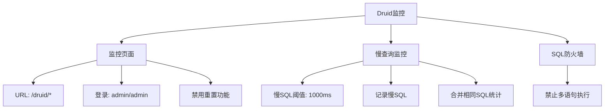
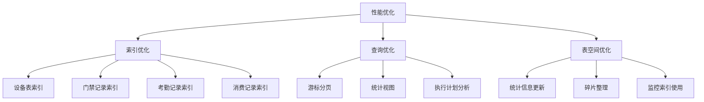

# 数据库架构设计

<cite>
**本文档引用的文件**  
- [00-database-init.sql](file://database-scripts/common-service/00-database-init.sql)
- [02-t_user.sql](file://database-scripts/common-service/02-t_user.sql)
- [03-t_role.sql](file://database-scripts/common-service/03-t_role.sql)
- [04-t_permission.sql](file://database-scripts/common-service/04-t_permission.sql)
- [05-t_user_role.sql](file://database-scripts/common-service/05-t_user_role.sql)
- [06-t_role_permission.sql](file://database-scripts/common-service/06-t_role_permission.sql)
- [07-t_notification_message.sql](file://database-scripts/common-service/07-t_notification_message.sql)
- [08-t_notification_template.sql](file://database-scripts/common-service/08-t_notification_template.sql)
- [09-t_notification_config.sql](file://database-scripts/common-service/09-t_notification_config.sql)
- [10-t_audit_log.sql](file://database-scripts/common-service/10-t_audit_log.sql)
- [16-t_system_config.sql](file://database-scripts/common-service/16-t_system_config.sql)
- [t_user_session_table.sql](file://database-scripts/t_user_session_table.sql)
- [performance_optimization.sql](file://database/performance_optimization.sql)
- [DRUID_CONNECTION_POOL_CONFIGURATION.md](file://documentation/deployment/DRUID_CONNECTION_POOL_CONFIGURATION.md)
- [DRUID_NACOS_CONFIG_TEMPLATE.md](file://documentation/deployment/DRUID_NACOS_CONFIG_TEMPLATE.md)
- [docker-compose-services.yml](file://docker-compose-services.yml)
</cite>

## 目录
1. [引言](#引言)
2. [数据库架构模式](#数据库架构模式)
3. [数据库集群部署拓扑](#数据库集群部署拓扑)
4. [Nacos配置中心与数据库集成](#nacos配置中心与数据库集成)
5. [Druid连接池配置策略](#druid连接池配置策略)
6. [数据库与微服务映射关系](#数据库与微服务映射关系)
7. [数据库初始化流程](#数据库初始化流程)
8. [数据库版本管理策略](#数据库版本管理策略)
9. [数据库性能优化](#数据库性能优化)
10. [结论](#结论)

## 引言
本文档旨在全面阐述IOE-DREAM项目的数据库架构设计，涵盖数据库架构模式、集群部署拓扑、配置管理、连接池策略、微服务映射关系以及初始化和版本管理策略。通过本设计，确保系统具备高可用性、可扩展性和高性能，满足企业级应用的需求。

## 数据库架构模式
### 单库单表架构
本项目采用单库单表架构，所有微服务共享一个数据库实例`ioedream_common_db`。这种架构模式的选择基于以下考虑：

1. **业务耦合度高**：各微服务之间存在紧密的数据交互，如用户、角色、权限等基础数据需要跨服务共享。
2. **数据一致性要求高**：通过单库事务保证跨模块数据的一致性，避免分布式事务的复杂性。
3. **维护成本低**：简化了数据库管理和运维工作，降低了备份、恢复和监控的复杂度。

数据库初始化脚本`00-database-init.sql`创建了`ioedream_common_db`数据库，并定义了统一的字符集和排序规则。

### 技术选型原因
选择单库单表架构而非分库分表或读写分离，主要基于当前业务规模和性能需求：

1. **数据量适中**：预计系统用户规模在百万级别，单库性能足以支撑。
2. **查询复杂度高**：跨表关联查询频繁，分库分表会增加查询复杂度和性能开销。
3. **开发效率优先**：避免引入分布式数据库带来的开发和调试复杂性。

**Section sources**
- [00-database-init.sql](file://database-scripts/common-service/00-database-init.sql)

## 数据库集群部署拓扑
### 主从复制机制
虽然当前采用单库架构，但已为未来扩展预留了主从复制能力。通过MySQL的原生复制功能，可以实现：

1. **读写分离**：写操作在主库执行，读操作可分发到从库，提高读取性能。
2. **数据冗余**：从库作为数据备份，提高数据安全性。
3. **故障转移**：主库故障时，可快速切换到从库继续服务。

### 高可用机制
系统通过以下方式确保数据库高可用：

1. **容器化部署**：数据库服务通过Docker容器部署，结合Kubernetes实现自动故障恢复。
2. **健康检查**：定期执行数据库健康检查，及时发现和处理异常。
3. **连接池管理**：使用Druid连接池，具备连接有效性检测和自动回收功能。

### 灾备方案
灾备方案包括：

1. **定期备份**：每日全量备份，每小时增量备份，备份数据异地存储。
2. **日志归档**：开启binlog日志，支持基于时间点的恢复。
3. **多区域部署**：在不同地理区域部署数据库副本，防止单点故障。

**Section sources**
- [docker-compose-services.yml](file://docker-compose-services.yml)

## Nacos配置中心与数据库集成
### 集成方式
Nacos配置中心与数据库的集成通过以下方式实现：

1. **配置外化**：数据库连接信息（URL、用户名、密码）存储在Nacos中，而非硬编码在应用中。
2. **动态更新**：应用启动时从Nacos获取数据库配置，支持运行时动态更新连接参数。
3. **环境隔离**：不同环境（开发、测试、生产）使用不同的配置集，通过Data ID区分。

Nacos配置中心在`docker-compose-services.yml`中定义，使用独立容器部署，与应用服务解耦。

### 配置管理
数据库相关配置通过Nacos的Data ID进行管理：

- **Data ID命名规则**：`ioedream-{service-name}-dev.yaml`
- **Group**：`IOE-DREAM`
- **配置格式**：YAML

**Section sources**
- [docker-compose-services.yml](file://docker-compose-services.yml)
- [DRUID_NACOS_CONFIG_TEMPLATE.md](file://documentation/deployment/DRUID_NACOS_CONFIG_TEMPLATE.md)

## Druid连接池配置策略
### 核心配置
Druid连接池的核心配置策略如下：

| 配置项 | 值 | 说明 |
|-------|-----|------|
| `initial-size` | 10 | 初始连接数 |
| `min-idle` | 10 | 最小空闲连接数 |
| `max-active` | 50 | 最大活跃连接数 |
| `max-wait` | 60000 | 获取连接最大等待时间（毫秒） |

### 连接有效性检测
为确保连接质量，配置了以下检测机制：

- **空闲检测**：`test-while-idle: true`，空闲时检测连接有效性
- **验证查询**：`validation-query: SELECT 1`，使用简单查询验证连接
- **借用/归还检测**：禁用`test-on-borrow`和`test-on-return`，避免性能开销

### 性能优化配置
性能优化配置包括：

- **预编译语句池**：`pool-prepared-statements: true`，开启预编译语句池
- **最大预编译语句数**：`max-pool-prepared-statement-per-connection-size: 20`

### 监控配置
Druid内置监控功能，配置如下：



**Diagram sources**
- [DRUID_CONNECTION_POOL_CONFIGURATION.md](file://documentation/deployment/DRUID_CONNECTION_POOL_CONFIGURATION.md)

**Section sources**
- [DRUID_CONNECTION_POOL_CONFIGURATION.md](file://documentation/deployment/DRUID_CONNECTION_POOL_CONFIGURATION.md)

## 数据库与微服务映射关系
### common-service
`common-service`是核心服务，管理基础数据和通用功能，其数据库表包括：

- **用户管理**：`t_user`（用户表）、`t_user_role`（用户角色关联表）
- **权限管理**：`t_role`（角色表）、`t_permission`（权限表）、`t_role_permission`（角色权限关联表）
- **通知管理**：`t_notification_message`（通知消息表）、`t_notification_template`（通知模板表）、`t_notification_config`（通知配置表）
- **系统管理**：`t_system_config`（系统配置表）、`t_audit_log`（审计日志表）

### access-service
`access-service`负责门禁管理，其数据表未在当前文件中定义，但会引用`common-service`的用户和权限数据。

### 其他服务
各微服务通过共享数据库访问基础数据，同时维护各自业务数据。这种设计既保证了数据一致性，又保持了服务的相对独立性。

```mermaid
erDiagram
t_user ||--o{ t_user_role : "1:N"
t_role ||--o{ t_user_role : "1:N"
t_role ||--o{ t_role_permission : "1:N"
t_permission ||--o{ t_role_permission : "1:N"
t_user ||--o{ t_audit_log : "1:N"
t_user ||--o{ t_user_session : "1:N"
class t_user "用户表"
class t_role "角色表"
class t_permission "权限表"
class t_user_role "用户角色关联表"
class t_role_permission "角色权限关联表"
class t_notification_message "通知消息表"
class t_notification_template "通知模板表"
class t_notification_config "通知配置表"
class t_audit_log "审计日志表"
class t_system_config "系统配置表"
class t_user_session "用户会话表"
```

**Diagram sources**
- [02-t_user.sql](file://database-scripts/common-service/02-t_user.sql)
- [03-t_role.sql](file://database-scripts/common-service/03-t_role.sql)
- [04-t_permission.sql](file://database-scripts/common-service/04-t_permission.sql)
- [05-t_user_role.sql](file://database-scripts/common-service/05-t_user_role.sql)
- [06-t_role_permission.sql](file://database-scripts/common-service/06-t_role_permission.sql)
- [07-t_notification_message.sql](file://database-scripts/common-service/07-t_notification_message.sql)
- [08-t_notification_template.sql](file://database-scripts/common-service/08-t_notification_template.sql)
- [09-t_notification_config.sql](file://database-scripts/common-service/09-t_notification_config.sql)
- [10-t_audit_log.sql](file://database-scripts/common-service/10-t_audit_log.sql)
- [16-t_system_config.sql](file://database-scripts/common-service/16-t_system_config.sql)
- [t_user_session_table.sql](file://database-scripts/t_user_session_table.sql)

**Section sources**
- [02-t_user.sql](file://database-scripts/common-service/02-t_user.sql)
- [03-t_role.sql](file://database-scripts/common-service/03-t_role.sql)
- [04-t_permission.sql](file://database-scripts/common-service/04-t_permission.sql)
- [05-t_user_role.sql](file://database-scripts/common-service/05-t_user_role.sql)
- [06-t_role_permission.sql](file://database-scripts/common-service/06-t_role_permission.sql)
- [07-t_notification_message.sql](file://database-scripts/common-service/07-t_notification_message.sql)
- [08-t_notification_template.sql](file://database-scripts/common-service/08-t_notification_template.sql)
- [09-t_notification_config.sql](file://database-scripts/common-service/09-t_notification_config.sql)
- [10-t_audit_log.sql](file://database-scripts/common-service/10-t_audit_log.sql)
- [16-t_system_config.sql](file://database-scripts/common-service/16-t_system_config.sql)
- [t_user_session_table.sql](file://database-scripts/t_user_session_table.sql)

## 数据库初始化流程
### 初始化步骤
数据库初始化流程如下：

1. **创建数据库**：执行`00-database-init.sql`创建`ioedream_common_db`数据库。
2. **按序执行脚本**：按照编号顺序执行`01-18`号SQL脚本创建表结构。
3. **导入基础数据**：初始化系统角色、权限、配置等基础数据。
4. **验证初始化**：检查表结构和基础数据是否正确。

### 执行顺序
脚本执行顺序严格按照依赖关系：

1. `00-database-init.sql` - 数据库初始化
2. `01-t_user_session.sql` - 用户会话表
3. `02-t_user.sql` - 用户表
4. `03-t_role.sql` - 角色表
5. `04-t_permission.sql` - 权限表
6. `05-t_user_role.sql` - 用户角色关联表
7. `06-t_role_permission.sql` - 角色权限关联表
8. `07-t_notification_message.sql` - 通知消息表
9. `08-t_notification_template.sql` - 通知模板表
10. `09-t_notification_config.sql` - 通知配置表
11. `10-t_audit_log.sql` - 审计日志表
12. `11-t_alert.sql` - 告警表
13. `12-t_alert_rule.sql` - 告警规则表
14. `13-t_system_monitor.sql` - 系统监控表
15. `14-t_scheduled_job.sql` - 定时任务表
16. `15-t_job_execution_log.sql` - 任务执行日志表
17. `16-t_system_config.sql` - 系统配置表
18. `17-t_system_dict.sql` - 系统字典表
19. `18-t_employee.sql` - 员工表

**Section sources**
- [00-database-init.sql](file://database-scripts/common-service/00-database-init.sql)

## 数据库版本管理策略
### 版本控制
数据库版本管理采用以下策略：

1. **脚本化管理**：所有数据库变更通过SQL脚本管理，存入版本控制系统。
2. **版本号命名**：脚本按版本号命名，如`V1_0_0__initial_schema.sql`。
3. **变更记录**：每次变更记录变更内容、时间和负责人。

### 变更流程
数据库变更流程如下：

1. **开发环境变更**：在开发环境进行数据库变更测试。
2. **生成变更脚本**：使用工具生成差异脚本。
3. **代码审查**：团队成员审查变更脚本。
4. **测试环境验证**：在测试环境验证变更。
5. **生产环境部署**：在维护窗口期部署到生产环境。

### 回滚机制
为确保变更安全，建立回滚机制：

1. **备份**：变更前自动备份数据库。
2. **回滚脚本**：为每个变更脚本提供对应的回滚脚本。
3. **自动化回滚**：通过自动化工具执行回滚操作。

## 数据库性能优化
### 索引优化
通过`performance_optimization.sql`脚本进行索引优化，主要优化点包括：

1. **设备表**：创建`idx_device_status_type`、`idx_device_code`等索引，解决全表扫描问题。
2. **门禁记录表**：创建`idx_access_record_time_user`、`idx_access_record_device_time`等索引，优化分页查询。
3. **考勤记录表**：创建`idx_attendance_user_date`、`idx_attendance_shift_date`等索引，解决日报查询性能问题。
4. **消费记录表**：创建`idx_consume_user_time`、`idx_consume_account_time`等索引，解决高频查询问题。

### 查询优化
查询优化策略包括：

1. **游标分页**：使用游标分页替代LIMIT OFFSET，解决深度分页性能问题。
2. **统计视图**：创建`v_device_statistics`、`v_access_daily_statistics`等视图，优化统计查询。
3. **执行计划分析**：定期分析查询执行计划，优化慢查询。

### 表空间优化
表空间优化措施：

1. **统计信息更新**：定期执行`ANALYZE TABLE`更新表统计信息。
2. **碎片整理**：定期进行表碎片整理，提高存储效率。
3. **监控索引使用**：监控索引使用情况，删除未使用的索引。



**Diagram sources**
- [performance_optimization.sql](file://database/performance_optimization.sql)

**Section sources**
- [performance_optimization.sql](file://database/performance_optimization.sql)

## 结论
本数据库架构设计基于单库单表模式，通过Nacos配置中心实现配置管理，使用Druid连接池优化数据库连接，建立了完善的初始化流程和版本管理策略。设计充分考虑了系统的可扩展性、高可用性和性能需求，为IOE-DREAM项目的稳定运行提供了坚实的数据基础。未来可根据业务发展需要，逐步演进到分库分表或读写分离架构。