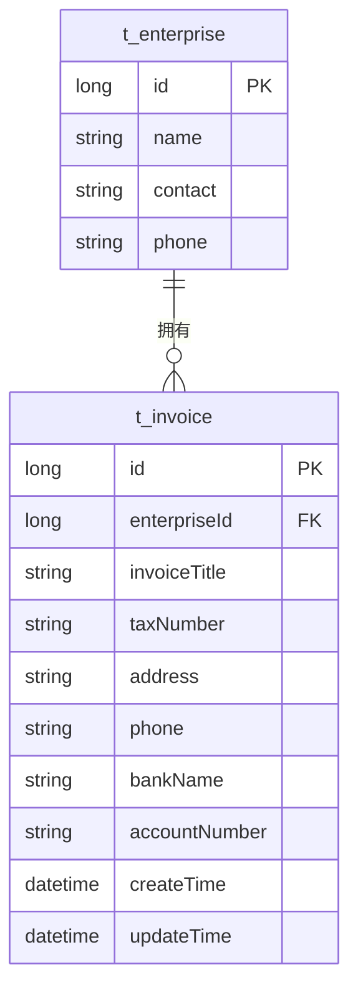
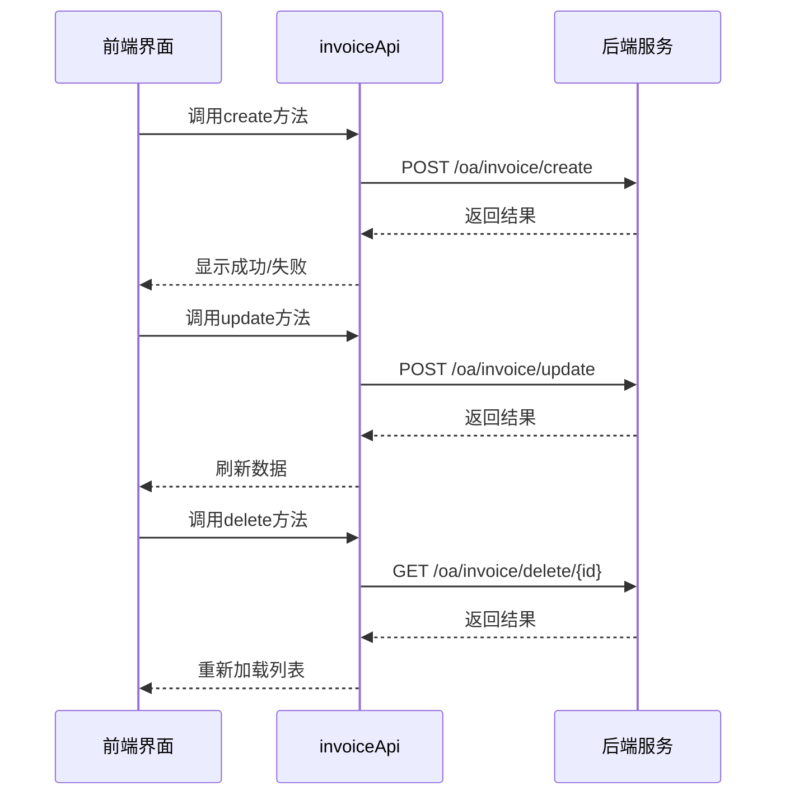

# 发票管理表结构

<cite>
**本文档引用的文件**
- [invoice-api.js](file://smart-admin-web-javascript\src\api\business\oa\invoice-api.js)
- [enterprise-invoice-operate-modal.vue](file://smart-admin-web-javascript\src\views\business\oa\enterprise\components\enterprise-invoice-operate-modal.vue)
- [enterprise-invoice-list.vue](file://smart-admin-web-javascript\src\views\business\oa\enterprise\components\enterprise-invoice-list.vue)
</cite>

## 目录
1. [引言](#引言)
2. [发票表(t_invoice)字段说明](#发票表t_invoice字段说明)
3. [企业与发票的关联关系](#企业与发票的关联关系)
4. [发票信息的增删改查操作](#发票信息的增删改查操作)
5. [发票信息查询优化方案](#发票信息查询优化方案)
6. [审计跟踪机制](#审计跟踪机制)

## 引言
本文档详细描述了发票管理模块中发票表(t_invoice)的数据模型结构，涵盖字段定义、外键关联、数据操作及查询优化策略。通过分析前端代码中的API调用和表单定义，梳理出完整的发票信息管理机制，确保企业与发票信息之间的一致性和完整性。

## 发票表(t_invoice)字段说明
发票表(t_invoice)用于存储企业的开票信息，主要字段包括：

| 字段名 | 数据类型 | 约束条件 | 说明 |
|--------|----------|----------|------|
| id | Long | 主键，自增 | 发票记录的唯一标识 |
| enterpriseId | Long | 外键，非空 | 关联的企业ID，建立与企业表的一对多关系 |
| invoiceTitle | String | 非空，最大长度100 | 开票抬头名称 |
| taxNumber | String | 非空，最大长度50 | 纪税人识别号 |
| address | String | 可为空，最大长度200 | 企业注册地址 |
| phone | String | 可为空，最大长度20 | 企业联系电话 |
| bankName | String | 非空，最大长度100 | 开户银行名称 |
| accountNumber | String | 非空，最大长度50 | 银行账号 |
| createTime | DateTime | 非空 | 记录创建时间 |
| updateTime | DateTime | 可为空 | 记录最后更新时间 |

**字段验证规则：**
- 所有必填字段在前端表单中均有相应验证规则
- 银行账号、纳税人识别号等关键信息不允许为空
- 开票抬头长度限制为100个字符以内

**Section sources**
- [enterprise-invoice-operate-modal.vue](file://smart-admin-web-javascript\src\views\business\oa\enterprise\components\enterprise-invoice-operate-modal.vue#L79-L95)
- [enterprise-invoice-list.vue](file://smart-admin-web-javascript\src\views\business\oa\enterprise\components\enterprise-invoice-list.vue#L104-L156)

## 企业与发票的关联关系
发票信息与企业信息通过`enterpriseId`字段建立外键关联，形成典型的一对多关系模型：

**关联特性说明：**
- 一个企业可拥有多个发票信息记录
- `enterpriseId`作为外键确保数据引用完整性
- 删除企业时，其关联的发票信息应被级联删除或标记为无效
- 通过`enterpriseId`可高效查询某企业下的所有发票信息

**Diagram sources**
- [enterprise-invoice-operate-modal.vue](file://smart-admin-web-javascript\src\views\business\oa\enterprise\components\enterprise-invoice-operate-modal.vue#L42-L46)
- [enterprise-invoice-list.vue](file://smart-admin-web-javascript\src\views\business\oa\enterprise\components\enterprise-invoice-list.vue#L97-L101)

## 发票信息的增删改查操作
发票信息的CRUD操作通过前端API与后端服务交互实现，确保数据一致性。

### 增加操作
通过`invoiceApi.create`接口创建新的发票信息：
- 前端表单验证通过后提交数据
- 后端自动填充`enterpriseId`和创建时间
- 确保同一企业的发票信息不重复

### 修改操作
通过`invoiceApi.update`接口更新发票信息：
- 需要提供完整的发票ID
- 更新时自动更新`updateTime`字段
- 保持`enterpriseId`不变以维护关联关系

### 删除操作
通过`invoiceApi.delete`接口删除发票信息：
- 采用软删除或硬删除策略
- 删除前进行业务规则校验
- 维护数据完整性

### 查询操作
提供多种查询方式：
- 分页查询：`invoiceApi.pageQuery`
- 详情查询：`invoiceApi.detail`
- 列表查询：`invoiceApi.queryList`（按企业ID）

**Diagram sources**
- [invoice-api.js](file://smart-admin-web-javascript\src\api\business\oa\invoice-api.js#L15-L43)
- [enterprise-invoice-operate-modal.vue](file://smart-admin-web-javascript\src\views\business\oa\enterprise\components\enterprise-invoice-operate-modal.vue#L15-L37)

**Section sources**
- [invoice-api.js](file://smart-admin-web-javascript\src\api\business\oa\invoice-api.js#L14-L43)

## 发票信息查询优化方案
为提高发票信息查询性能，建议实施以下优化措施：

### 索引优化
在数据库中为关键查询字段创建索引：
- 在`enterpriseId`字段上创建B树索引，加速按企业查询
- 在`createTime`字段上创建索引，优化时间范围查询
- 考虑创建复合索引`(enterpriseId, createTime)`以支持常见查询模式

### 查询策略
- 使用分页查询避免一次性加载大量数据
- 提供关键词搜索功能，支持按开票抬头模糊查询
- 缓存常用企业的发票信息以减少数据库访问

### 数据完整性
- 在DAO层实现数据验证逻辑
- 确保`enterpriseId`始终指向有效的企业记录
- 在事务中处理关联数据的更新操作

**Section sources**
- [enterprise-invoice-list.vue](file://smart-admin-web-javascript\src\views\business\oa\enterprise\components\enterprise-invoice-list.vue#L158-L166)
- [invoice-api.js](file://smart-admin-web-javascript\src\api\business\oa\invoice-api.js#L30-L31)

## 审计跟踪机制
为确保发票信息变更的可追溯性，建议实现审计跟踪机制：

### 变更记录
- 每次更新操作记录`updateTime`时间戳
- 保留操作日志，包括操作人、操作时间和变更内容
- 对敏感字段的修改进行特别标记

### 数据版本控制
- 考虑实现发票信息的历史版本管理
- 重要变更可采用审批流程
- 提供数据恢复功能以防误操作

该机制可通过系统操作日志模块与发票管理模块集成实现，确保所有变更都有据可查。

**Section sources**
- [enterprise-invoice-operate-modal.vue](file://smart-admin-web-javascript\src\views\business\oa\enterprise\components\enterprise-invoice-operate-modal.vue#L80-L89)
- [enterprise-invoice-list.vue](file://smart-admin-web-javascript\src\views\business\oa\enterprise\components\enterprise-invoice-list.vue#L146-L148)