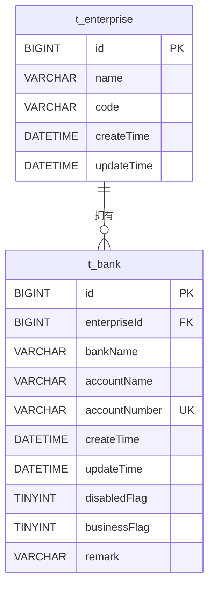
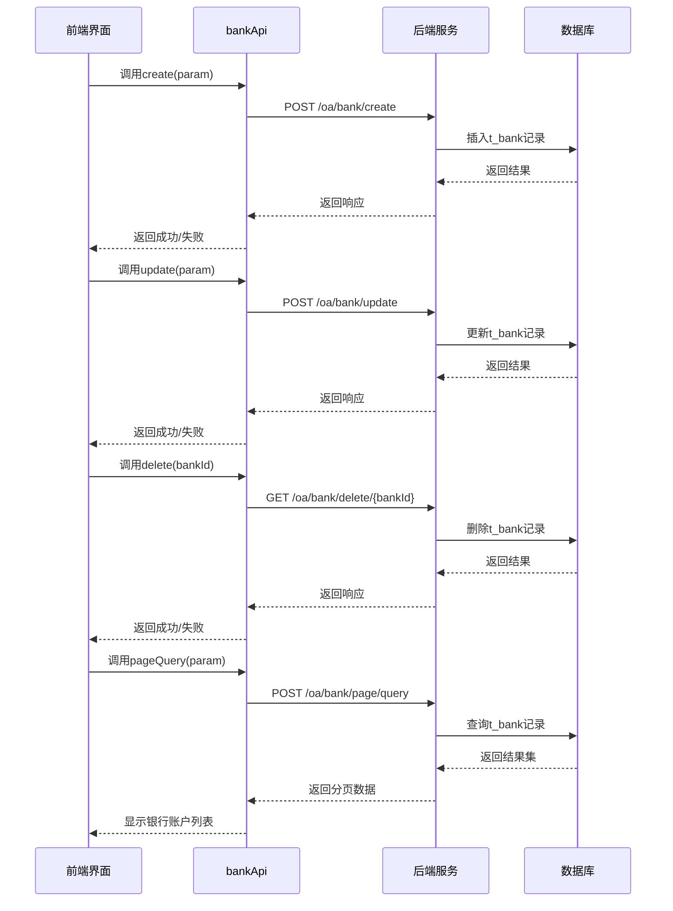
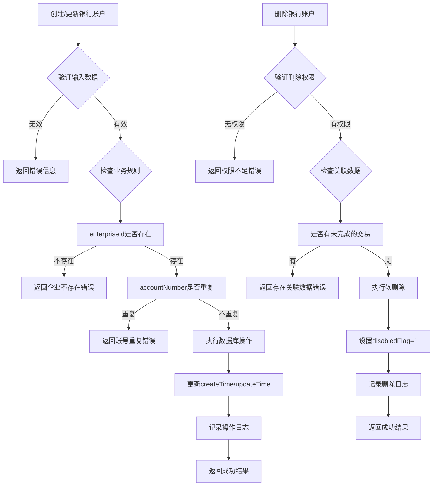
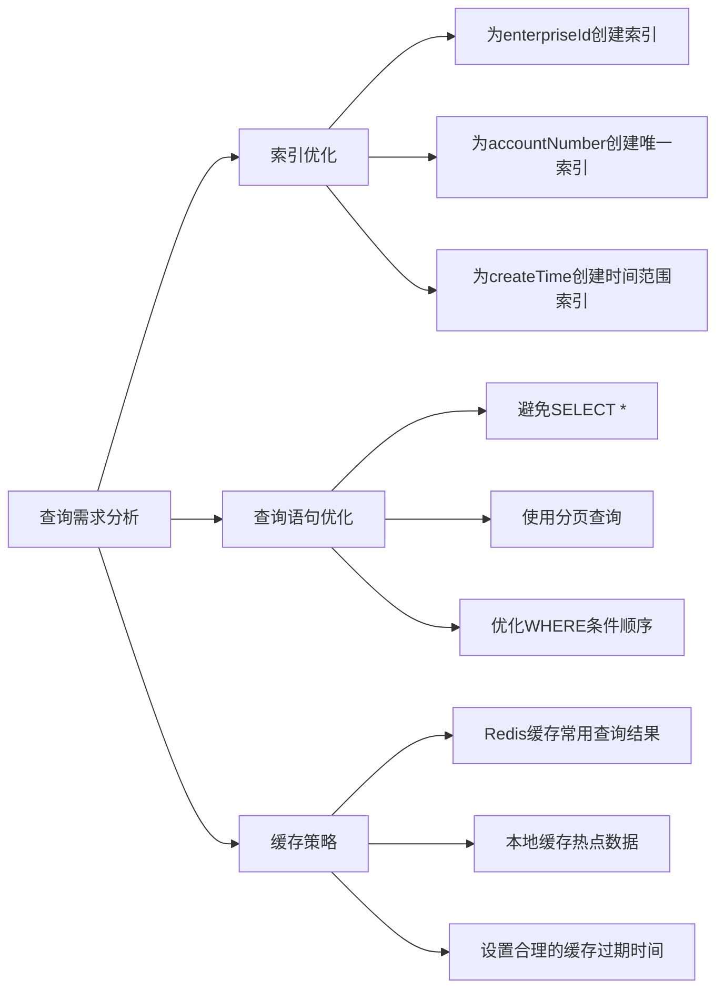
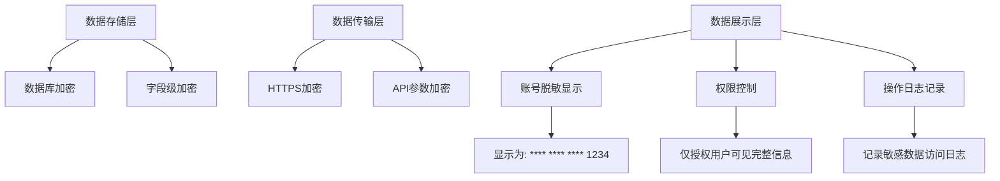

# 银行账户表结构

<cite>
**本文档引用文件**  
- [bank-api.js](file://smart-admin-web-javascript\src\api\business\oa\bank-api.js)
- [enterprise-bank-operate-modal.vue](file://smart-admin-web-javascript\src\views\business\oa\enterprise\components\enterprise-bank-operate-modal.vue)
- [enterprise-bank-list.vue](file://smart-admin-web-javascript\src\views\business\oa\enterprise\components\enterprise-bank-list.vue)
</cite>

## 目录
1. [简介](#简介)
2. [银行账户表(t_bank)字段说明](#银行账户表t_bank字段说明)
3. [企业与银行账户的关联关系](#企业与银行账户的关联关系)
4. [银行账户的增删改查操作实现](#银行账户的增删改查操作实现)
5. [数据一致性与业务逻辑约束](#数据一致性与业务逻辑约束)
6. [查询性能优化建议](#查询性能优化建议)
7. [敏感信息脱敏策略](#敏感信息脱敏策略)

## 简介
本文档详细描述了银行账户表(t_bank)的数据模型结构，包括各字段的含义、数据类型和约束条件。重点阐述了企业表(t_enterprise)与银行账户表之间的一对多关联关系，以及通过BankDao实现的增删改查操作。同时提供了查询性能优化和敏感信息脱敏的建议。

## 银行账户表t_bank字段说明
银行账户表(t_bank)包含以下核心字段：

| 字段名 | 数据类型 | 是否可为空 | 约束条件 | 说明 |
|-------|--------|----------|--------|------|
| id | BIGINT | 否 | 主键，自增 | 银行账户唯一标识 |
| enterpriseId | BIGINT | 否 | 外键，非空 | 关联企业ID，建立与企业表的一对多关系 |
| bankName | VARCHAR(100) | 否 | 非空 | 开户银行名称 |
| accountName | VARCHAR(100) | 否 | 非空 | 账户名称 |
| accountNumber | VARCHAR(50) | 否 | 非空，唯一 | 银行账号 |
| createTime | DATETIME | 否 | 默认CURRENT_TIMESTAMP | 创建时间 |
| updateTime | DATETIME | 否 | 默认CURRENT_TIMESTAMP ON UPDATE CURRENT_TIMESTAMP | 更新时间 |
| disabledFlag | TINYINT | 否 | 默认0 | 状态标志(0:启用, 1:禁用) |
| businessFlag | TINYINT | 否 | 默认0 | 是否对公标志(0:否, 1:是) |
| remark | VARCHAR(200) | 是 | - | 备注信息 |

**字段验证规则：**
- `bankName`、`accountName`、`accountNumber`字段在前端和后端均需进行非空验证
- `accountNumber`需保证在同一企业下唯一
- `enterpriseId`必须引用存在的企业记录

**Section sources**
- [enterprise-bank-operate-modal.vue](file://smart-admin-web-javascript\src\views\business\oa\enterprise\components\enterprise-bank-operate-modal.vue#L86-L89)

## 企业与银行账户的关联关系
银行账户表(t_bank)通过`enterpriseId`外键字段与企业表(t_enterprise)建立关联，实现企业与银行账户的一对多关系。

**Diagram sources**
- [enterprise-bank-operate-modal.vue](file://smart-admin-web-javascript\src\views\business\oa\enterprise\components\enterprise-bank-operate-modal.vue#L41-L60)
- [enterprise-bank-list.vue](file://smart-admin-web-javascript\src\views\business\oa\enterprise\components\enterprise-bank-list.vue#L99-L104)

**关联关系特点：**
1. **一对多关系**：一个企业可以拥有多个银行账户，但一个银行账户只能属于一个企业
2. **外键约束**：`enterpriseId`字段作为外键，确保引用的企业ID必须存在于t_enterprise表中
3. **级联操作**：当企业被删除时，其关联的所有银行账户也应被删除（通过应用层逻辑实现）
4. **查询优化**：基于`enterpriseId`建立索引，提高按企业查询银行账户的效率

## 银行账户的增删改查操作实现
银行账户的增删改查操作通过前端API调用和后端服务协同实现，具体流程如下：

**Diagram sources**
- [bank-api.js](file://smart-admin-web-javascript\src\api\business\oa\bank-api.js#L14-L41)
- [enterprise-bank-list.vue](file://smart-admin-web-javascript\src\views\business\oa\enterprise\components\enterprise-bank-list.vue#L189-L200)

**操作方法说明：**
- **add/create**：创建新的银行账户，需要提供完整的账户信息，包括`enterpriseId`、`bankName`、`accountName`、`accountNumber`等必填字段
- **update**：更新现有银行账户信息，通过`bankId`标识要更新的记录，支持部分字段更新
- **delete**：删除银行账户，通过`bankId`标识要删除的记录，删除前需进行权限验证和业务规则检查

## 数据一致性与业务逻辑约束
为确保数据一致性，系统在多个层面实施了业务逻辑约束：

**Diagram sources**
- [enterprise-bank-operate-modal.vue](file://smart-admin-web-javascript\src\views\business\oa\enterprise\components\enterprise-bank-operate-modal.vue#L86-L90)
- [bank-api.js](file://smart-admin-web-javascript\src\api\business\oa\bank-api.js#L14-L36)

**业务逻辑约束：**
1. **输入验证**：前端和后端双重验证，确保必填字段不为空
2. **外键完整性**：确保`enterpriseId`引用的企业存在
3. **唯一性约束**：同一企业下的银行账号必须唯一
4. **状态管理**：通过`disabledFlag`实现软删除，保留历史数据
5. **时间戳更新**：自动维护`createTime`和`updateTime`字段

## 查询性能优化建议
为提高银行账户查询性能，建议采取以下优化措施：

**Diagram sources**
- [enterprise-bank-list.vue](file://smart-admin-web-javascript\src\views\business\oa\enterprise\components\enterprise-bank-list.vue#L155-L163)
- [bank-api.js](file://smart-admin-web-javascript\src\api\business\oa\bank-api.js#L29-L31)

**具体优化建议：**
1. **索引优化**：
   - 在`enterpriseId`字段上创建索引，提高按企业查询的效率
   - 在`accountNumber`字段上创建唯一索引，既保证数据完整性又提高查询速度
   - 在`createTime`字段上创建索引，优化时间范围查询

2. **查询优化**：
   - 使用分页查询避免一次性加载大量数据
   - 只查询需要的字段，避免使用SELECT *
   - 合理使用WHERE条件，将高选择性的条件放在前面

3. **缓存策略**：
   - 对频繁查询但不常变更的数据使用Redis缓存
   - 设置合理的缓存过期时间，平衡数据新鲜度和性能
   - 实现缓存穿透、缓存雪崩的防护机制

## 敏感信息脱敏策略
为保护银行账户的敏感信息，系统实施了多层次的数据脱敏策略：

**Diagram sources**
- [enterprise-bank-list.vue](file://smart-admin-web-javascript\src\views\business\oa\enterprise\components\enterprise-bank-list.vue#L117-L120)
- [enterprise-bank-operate-modal.vue](file://smart-admin-web-javascript\src\views\business\oa\enterprise\components\enterprise-bank-operate-modal.vue#L19-L21)

**脱敏策略实施：**
1. **存储层**：
   - 银行账号等敏感信息在数据库中加密存储
   - 使用强加密算法保护数据安全

2. **传输层**：
   - 所有API通信使用HTTPS协议加密
   - 敏感数据在传输过程中进行额外加密

3. **展示层**：
   - 在列表页面显示银行账号时进行脱敏处理，如显示为"**** **** **** 1234"
   - 仅在详细信息页面且用户有相应权限时才显示完整信息
   - 记录所有敏感数据的访问日志，便于审计追踪

4. **权限控制**：
   - 实施细粒度的权限管理，确保只有授权人员才能访问敏感信息
   - 不同角色看到的信息详细程度不同