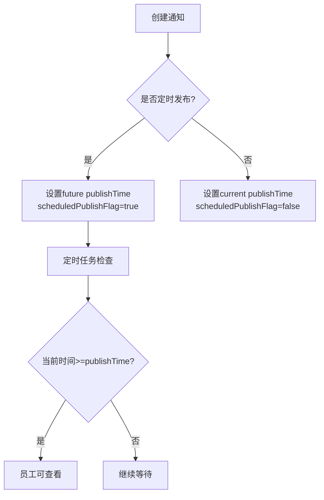
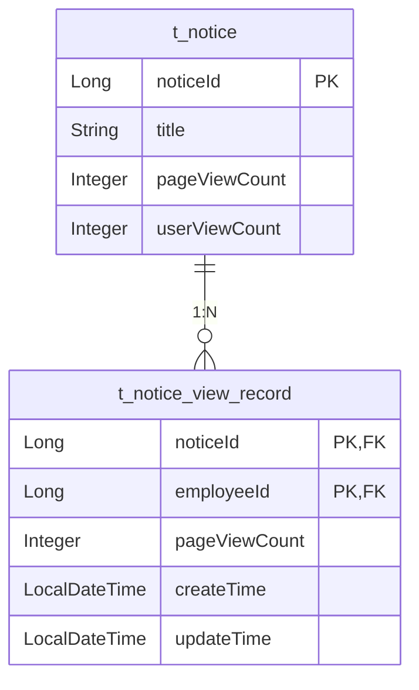

# 通知公告主表设计

<cite>
**本文档引用文件**  
- [NoticeEntity.java](file://smart-admin-api-java17-springboot3\sa-admin\src\main\java\net\lab1024\sa\admin\module\business\oa\notice\domain\entity\NoticeEntity.java)
- [NoticeMapper.xml](file://smart-admin-api-java17-springboot3\sa-admin\src\main\resources\mapper\business\oa\notice\NoticeMapper.xml)
- [NoticeVO.java](file://smart-admin-api-java17-springboot3\sa-admin\src\main\java\net\lab1024\sa\admin\module\business\oa\notice\domain\vo\NoticeVO.java)
- [NoticeDao.java](file://smart-admin-api-java17-springboot3\sa-admin\src\main\java\net\lab1024\sa\admin\module\business\oa\notice\dao\NoticeDao.java)
- [NoticeVisibleRangeDataTypeEnum.java](file://smart-admin-api-java17-springboot3\sa-admin\src\main\java\net\lab1024\sa\admin\module\business\oa\notice\constant\NoticeVisibleRangeDataTypeEnum.java)
- [NoticeViewRecordVO.java](file://smart-admin-api-java17-springboot3\sa-admin\src\main\java\net\lab1024\sa\admin\module\business\oa\notice\domain\vo\NoticeViewRecordVO.java)
</cite>

## 目录
1. [引言](#引言)
2. [核心字段设计](#核心字段设计)
3. [布尔标志位业务逻辑](#布尔标志位业务逻辑)
4. [浏览量计数器分析](#浏览量计数器分析)
5. [审计字段使用方式](#审计字段使用方式)
6. [元数据字段管理规范](#元数据字段管理规范)
7. [约束条件与索引策略](#约束条件与索引策略)
8. [高并发更新优化建议](#高并发更新优化建议)

## 引言
通知公告主表（t_notice）是系统中用于存储企业内部通知、公告等信息的核心数据表。该表设计支持灵活的可见范围控制、定时发布功能以及完整的浏览统计能力，为组织内部信息传播提供了可靠的数据基础。

## 核心字段设计

### noticeId（主键）
作为通知公告的唯一标识符，采用自增长的Long类型主键，确保每条通知都有全局唯一的ID。该字段在系统中作为其他关联表（如可见范围表、浏览记录表）的外键引用。

### title（标题）
存储通知的标题内容，最大长度由数据库配置决定。标题是用户在列表中识别通知的主要依据，在查询和搜索功能中具有重要地位。

### contentText/contentHtml（内容）
提供两种格式的内容存储：
- **contentText**：纯文本内容，用于快速提取摘要、关键词搜索和移动端适配
- **contentHtml**：HTML格式内容，支持富文本编辑器生成的格式化内容展示

这种双格式设计既保证了内容展示的丰富性，又兼顾了搜索效率和性能优化。

### publishTime（发布时间）
记录通知的实际发布时间，类型为LocalDateTime。该时间决定了通知在前端展示的时间顺序，也是判断通知是否可被员工查看的关键依据（仅发布时间早于当前时间的通知才对员工可见）。

**本节来源**  
- [NoticeEntity.java](file://smart-admin-api-java17-springboot3\sa-admin\src\main\java\net\lab1024\sa\admin\module\business\oa\notice\domain\entity\NoticeEntity.java#L23-L49)

## 布尔标志位业务逻辑

### allVisibleFlag（是否全部可见）
该标志位控制通知的可见范围策略：
- **true**：通知对所有员工可见，无需配置具体可见范围
- **false**：需要通过`t_notice_visible_range`子表配置具体的可见员工或部门

当此标志位为true时，即使未在可见范围表中配置任何记录，所有员工也能查看该通知。这适用于全公司范围的公告场景。

### scheduledPublishFlag（是否定时发布）
实现通知的定时发布功能：
- **true**：通知处于"待发布"状态，`publishTime`字段存储未来的发布时间
- **false**：通知已立即发布或已过定时发布时间

系统通过定时任务扫描具有定时发布标志的通知，并在到达发布时间后自动将其对员工开放。这种设计支持预先准备重要通知并在特定时间点统一发布。



**图表来源**  
- [NoticeEntity.java](file://smart-admin-api-java17-springboot3\sa-admin\src\main\java\net\lab1024\sa\admin\module\business\oa\notice\domain\entity\NoticeEntity.java#L39-L44)
- [NoticeMapper.xml](file://smart-admin-api-java17-springboot3\sa-admin\src\main\resources\mapper\business\oa\notice\NoticeMapper.xml#L116-L134)

## 浏览量计数器分析

### pageViewCount（页面浏览量）
记录通知详情页的总访问次数，包括同一用户多次访问的计数。每次用户打开通知详情页都会使该计数器递增。

### userViewCount（用户浏览量）
记录查看过该通知的不同用户数量，即去重后的用户访问数。一个用户无论查看多少次，只计为1。

### 两者区别与应用场景
| 指标 | 统计维度 | 更新频率 | 应用场景 |
|------|----------|----------|----------|
| pageViewCount | 页面访问次数 | 每次访问都增加 | 内容热度分析、用户参与度 |
| userViewCount | 独立用户数 | 每个用户首次查看时增加 | 通知覆盖率、传播效果评估 |

系统通过`t_notice_view_record`表跟踪每个用户对通知的查看记录，实现两个计数器的精确统计。



**图表来源**  
- [NoticeEntity.java](file://smart-admin-api-java17-springboot3\sa-admin\src\main\java\net\lab1024\sa\admin\module\business\oa\notice\domain\entity\NoticeEntity.java#L70-L75)
- [NoticeViewRecordVO.java](file://smart-admin-api-java17-springboot3\sa-admin\src\main\java\net\lab1024\sa\admin\module\business\oa\notice\domain\vo\NoticeViewRecordVO.java)

## 审计字段使用方式
通过`NoticeMapper.xml`中的SQL查询分析，`createTime`和`updateTime`字段的使用方式如下：

### createTime（创建时间）
- 在通知创建时由系统自动设置为当前时间
- 用于按创建时间范围筛选通知
- 在分页查询中作为默认排序依据之一

### updateTime（更新时间）
- 每次通知内容或状态更新时自动刷新为当前时间
- 用于追踪通知的最后修改时间
- 支持按更新时间排序和筛选

相关SQL片段显示了这些字段在查询中的使用：
```xml
<if test="query.createTimeBegin != null">
    AND DATE_FORMAT(t_notice.create_time, '%Y-%m-%d') >= DATE_FORMAT(#{query.createTimeBegin}, '%Y-%m-%d')
</if>
ORDER BY t_notice.publish_time DESC, t_notice.notice_id DESC
```

**本节来源**  
- [NoticeMapper.xml](file://smart-admin-api-java17-springboot3\sa-admin\src\main\resources\mapper\business\oa\notice\NoticeMapper.xml#L85-L87)
- [NoticeEntity.java](file://smart-admin-api-java17-springboot3\sa-admin\src\main\java\net\lab1024\sa\admin\module\business\oa\notice\domain\entity\NoticeEntity.java#L96-L98)

## 元数据字段管理规范

### documentNumber（文号）
遵循企业文档管理规范的唯一编号，通常包含年份、部门代码和序列号（如：LAB-2024-001）。支持模糊搜索，便于通过文号快速定位特定通知。

### source（来源）
记录通知的发布来源，如"人力资源部"、"总经理办公室"等。该字段帮助用户识别信息的权威性和责任部门。

### author（作者）
存储通知的撰写者姓名，用于责任追溯和内容质量评估。与`createUserId`关联，确保作者信息的准确性。

这些元数据字段共同构成了通知的完整上下文信息，支持高效的文档管理和审计追踪。

**本节来源**  
- [NoticeEntity.java](file://smart-admin-api-java17-springboot3\sa-admin\src\main\java\net\lab1024\sa\admin\module\business\oa\notice\domain\entity\NoticeEntity.java#L77-L89)

## 约束条件与索引策略
基于代码分析，表结构的主要约束和索引策略包括：

### 主键约束
- `notice_id`：主键，唯一标识每条记录

### 业务索引
- `publish_time`：按发布时间排序查询，支持定时发布功能
- `notice_type_id`：按通知类型筛选，提升分类查询性能
- `create_user_id`：关联创建人信息，支持按创建者查询

### 查询优化
SQL查询中使用`INSTR`函数实现模糊搜索，对标题、作者、来源等字段进行关键词匹配，提高了搜索的灵活性。

**本节来源**  
- [NoticeMapper.xml](file://smart-admin-api-java17-springboot3\sa-admin\src\main\resources\mapper\business\oa\notice\NoticeMapper.xml#L70-L74)
- [NoticeEntity.java](file://smart-admin-api-java17-springboot3\sa-admin\src\main\java\net\lab1024\sa\admin\module\business\oa\notice\domain\entity\NoticeEntity.java)

## 高并发更新优化建议
针对浏览量计数器的高并发更新场景，系统采用以下优化策略：

### 分离更新操作
将通知主表的浏览量更新与用户查看记录的更新分离：
- 主表更新：批量或异步更新`pageViewCount`和`userViewCount`
- 记录表更新：实时记录每个用户的查看行为

### 原子性更新
使用MyBatis的`updateViewCount`方法实现原子性递增：
```xml
<update id="updateViewCount">
    update t_notice
    set page_view_count = page_view_count + #{pageViewCountIncrement},
        user_view_count = user_view_count + #{userViewCountIncrement}
    where notice_id = #{noticeId}
</update>
```

### 建议优化方案
1. **引入Redis缓存**：将浏览量计数缓存在Redis中，定期同步到数据库
2. **批量更新**：收集一段时间内的浏览量变化，批量更新数据库
3. **读写分离**：高频读取的浏览量数据可从只读副本查询

这些优化可有效降低数据库写入压力，提升系统在高并发场景下的稳定性。

**本节来源**  
- [NoticeDao.java](file://smart-admin-api-java17-springboot3\sa-admin\src\main\java\net\lab1024\sa\admin\module\business\oa\notice\dao\NoticeDao.java#L116-L123)
- [NoticeMapper.xml](file://smart-admin-api-java17-springboot3\sa-admin\src\main\resources\mapper\business\oa\notice\NoticeMapper.xml#L262-L267)