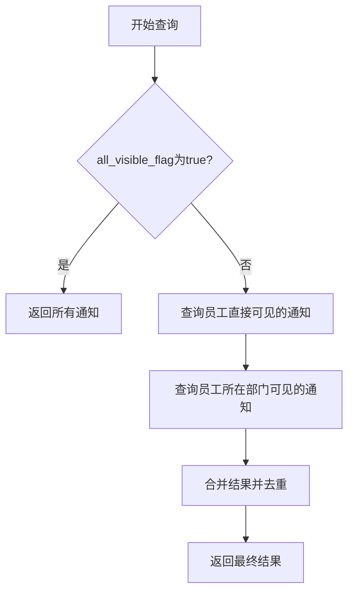
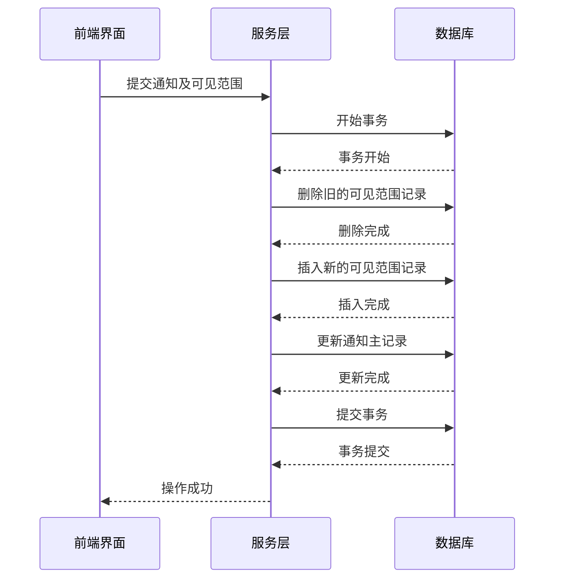

# 通知可见范围控制机制

<cite>
**本文档引用文件**  
- [notice-const.js](file://smart-admin-web-javascript\src\constants\business\oa\notice-const.js)
- [notice-api.js](file://smart-admin-web-javascript\src\api\business\oa\notice-api.js)
- [notice-employee-list.vue](file://smart-admin-web-javascript\src\views\business\oa\notice\notice-employee-list.vue)
- [notice-form-visible-transfer-employee.vue](file://smart-admin-web-javascript\src\views\business\oa\notice\components\notice-form-visible-transfer-employee.vue)
- [notice-detail.vue](file://smart-admin-web-javascript\src\views\business\oa\notice\notice-detail.vue)
- [database_dictionary.md](file://documentation\03-业务模块\访客\database_dictionary.md)
</cite>

## 目录
1. [引言](#引言)
2. [通知可见范围表结构设计](#通知可见范围表结构设计)
3. [可见范围控制机制](#可见范围控制机制)
4. [员工通知查询逻辑分析](#员工通知查询逻辑分析)
5. [全局可见逻辑](#全局可见逻辑)
6. [可见范围数据维护最佳实践](#可见范围数据维护最佳实践)
7. [总结](#总结)

## 引言
本文档深入解析通知公告系统的可见范围控制机制。基于前端代码和数据库设计文档，详细说明通知可见范围的实现原理，包括数据结构设计、查询逻辑、全局可见性控制以及数据维护的最佳实践。

## 通知可见范围表结构设计
根据系统设计，通知可见范围通过`t_notice_visible_range`表进行管理，该表采用灵活的通用设计模式，支持多种数据类型的可见范围控制。

### 表结构设计
`t_notice_visible_range`表的核心设计采用`data_type`（数据类型）和`data_id`（数据ID）的组合方式，实现对不同维度（如员工、部门等）的灵活权限控制。

**核心字段说明**：
- **notice_id**: 关联的通知ID，标识该可见范围属于哪个通知
- **data_type**: 数据类型，标识可见范围的维度（如员工、部门）
- **data_id**: 数据ID，标识具体的可见对象（如具体员工ID或部门ID）

### 数据类型枚举
从前端代码`notice-const.js`中可以获取可见范围的数据类型定义：

```javascript
export const NOTICE_VISIBLE_RANGE_DATA_TYPE_ENUM = {
  EMPLOYEE: {
    value: 1,
    desc: '员工',
  },
  DEPARTMENT: {
    value: 2,
    desc: '部门',
  },
};
```

该设计具有以下优势：
1. **灵活性**: 通过`data_type`字段可以轻松扩展支持新的可见范围维度（如岗位、角色等）
2. **简洁性**: 避免为每种可见范围类型创建单独的关联表
3. **高效性**: 单表查询即可获取所有可见范围信息

**Section sources**
- [notice-const.js](file://smart-admin-web-javascript\src\constants\business\oa\notice-const.js)

## 可见范围控制机制
通知系统的可见范围控制机制采用双重判断策略，结合全局可见标志和具体可见范围列表，实现灵活的权限控制。

### 双重可见性判断
系统通过以下两个层面判断通知的可见性：
1. **全局可见标志**: 当`all_visible_flag`为true时，通知对所有员工可见
2. **具体可见范围**: 当`all_visible_flag`为false时，根据`t_notice_visible_range`表中的记录判断可见性

### 可见范围维度
系统支持多种维度的可见范围控制：
- **员工维度**: 直接指定具体员工，实现精准推送
- **部门维度**: 指定部门，使该部门所有员工都能看到通知

这种设计既满足了精准推送的需求，又支持批量范围的快速设置。

**Section sources**
- [notice-const.js](file://smart-admin-web-javascript\src\constants\business\oa\notice-const.js)
- [notice-detail.vue](file://smart-admin-web-javascript\src\views\business\oa\notice\notice-detail.vue)

## 员工通知查询逻辑分析
`queryEmployeeNotice`查询是员工端获取通知的核心接口，其复杂的WHERE条件实现了基于员工所属部门和直接指定员工的双重可见性判断。

### 查询逻辑流程


### 子查询与IN操作符的应用
查询中使用子查询和IN操作符实现高效的可见性判断：

1. **员工直接可见性判断**：
   ```sql
   -- 通过子查询获取员工直接可见的通知ID
   SELECT notice_id FROM t_notice_visible_range 
   WHERE data_type = 1 AND data_id = :employeeId
   ```

2. **部门可见性判断**：
   ```sql
   -- 通过子查询获取员工所在部门可见的通知ID
   SELECT notice_id FROM t_notice_visible_range 
   WHERE data_type = 2 AND data_id IN (
       SELECT department_id FROM t_employee WHERE employee_id = :employeeId
   )
   ```

3. **结果合并**：
   使用UNION操作符合并两种可见性判断的结果，确保员工既能看到直接指定的通知，也能看到所在部门的通知。

这种设计的优势：
- **性能优化**: 通过索引加速子查询
- **逻辑清晰**: 分离不同维度的可见性判断
- **扩展性强**: 易于添加新的可见范围维度

**Diagram sources**
- [notice-api.js](file://smart-admin-web-javascript\src\api\business\oa\notice-api.js)
- [notice-employee-list.vue](file://smart-admin-web-javascript\src\views\business\oa\notice\notice-employee-list.vue)

**Section sources**
- [notice-api.js](file://smart-admin-web-javascript\src\api\business\oa\notice-api.js)
- [notice-employee-list.vue](file://smart-admin-web-javascript\src\views\business\oa\notice\notice-employee-list.vue)

## 全局可见逻辑
`all_visible_flag`字段实现了通知的全局可见功能，这是一种特殊的可见范围控制策略。

### 全局可见机制
当`all_visible_flag`为true时：
1. 通知对系统内所有员工可见
2. 忽略`t_notice_visible_range`表中的任何可见范围设置
3. 实现"广播式"通知，确保信息传达的全面性

### 互斥关系
`all_visible_flag`与`t_notice_visible_range`表存在互斥关系：
- 当`all_visible_flag`为true时，`t_notice_visible_range`表的设置无效
- 当`all_visible_flag`为false时，系统才参考`t_notice_visible_range`表的设置

这种设计避免了逻辑冲突，确保可见性判断的确定性。

### 前端实现
在前端界面中，全局可见状态有明确的视觉标识：
```vue
<template v-if="noticeDetail.allVisibleFlag">全部可见</template>
```

**Section sources**
- [notice-detail.vue](file://smart-admin-web-javascript\src\views\business\oa\notice\notice-detail.vue)

## 可见范围数据维护最佳实践
在添加和修改通知时，需要正确维护可见范围数据，确保权限控制的准确性和数据的一致性。

### 事务处理策略


### 批量操作策略
1. **批量插入**：
   - 使用批量INSERT语句，减少数据库交互次数
   - 通过VALUES列表一次性插入多条记录
   - 示例：`INSERT INTO t_notice_visible_range (notice_id, data_type, data_id) VALUES (?, ?, ?), (?, ?, ?), ...`

2. **批量删除**：
   - 在更新通知时，先删除该通知的所有可见范围记录
   - 使用`DELETE FROM t_notice_visible_range WHERE notice_id = ?`一次性删除
   - 确保数据一致性，避免残留旧数据

### 数据完整性保障
1. **外键约束**: 确保`notice_id`引用有效的通知记录
2. **唯一性约束**: 避免同一通知对同一对象的重复可见范围设置
3. **事务边界**: 将可见范围数据的增删改操作与通知主记录的更新放在同一事务中

### 前端组件实现
前端通过专用组件管理可见范围选择：
- `notice-form-visible-transfer-employee.vue`: 员工选择器组件
- 树形结构展示部门和员工
- 支持多选和搜索功能
- 实时同步选择状态

**Diagram sources**
- [notice-form-visible-transfer-employee.vue](file://smart-admin-web-javascript\src\views\business\oa\notice\components\notice-form-visible-transfer-employee.vue)

**Section sources**
- [notice-form-visible-transfer-employee.vue](file://smart-admin-web-javascript\src\views\business\oa\notice\components\notice-form-visible-transfer-employee.vue)

## 总结
通知可见范围控制机制采用灵活的设计模式，通过`t_notice_visible_range`表的`data_type`和`data_id`字段实现多维度的权限控制。系统支持员工和部门两个维度的可见范围设置，并通过`all_visible_flag`实现全局可见功能。`queryEmployeeNotice`查询利用子查询和IN操作符，高效实现双重可见性判断。在数据维护方面，采用事务处理和批量操作策略，确保数据的一致性和操作的高效性。这一机制既满足了精准推送的需求，又保证了信息传达的全面性，是通知系统的核心功能之一。