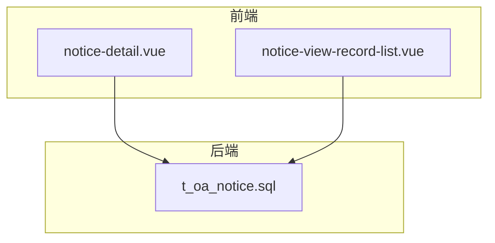
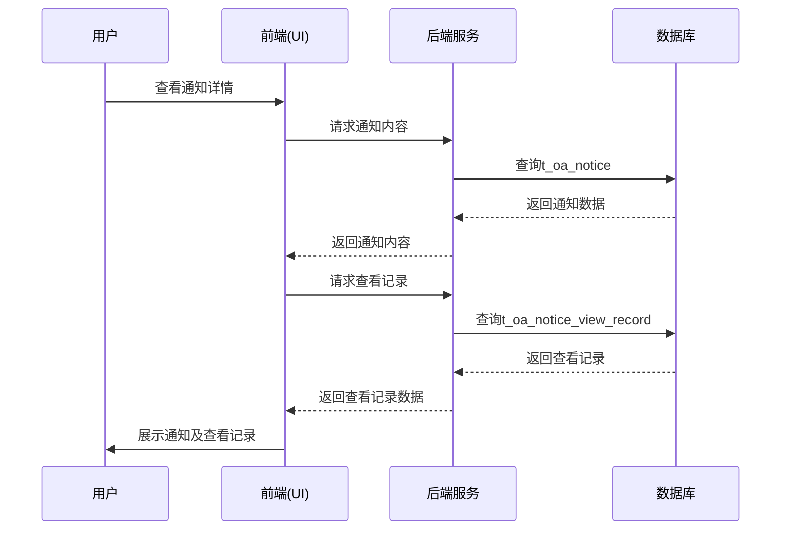
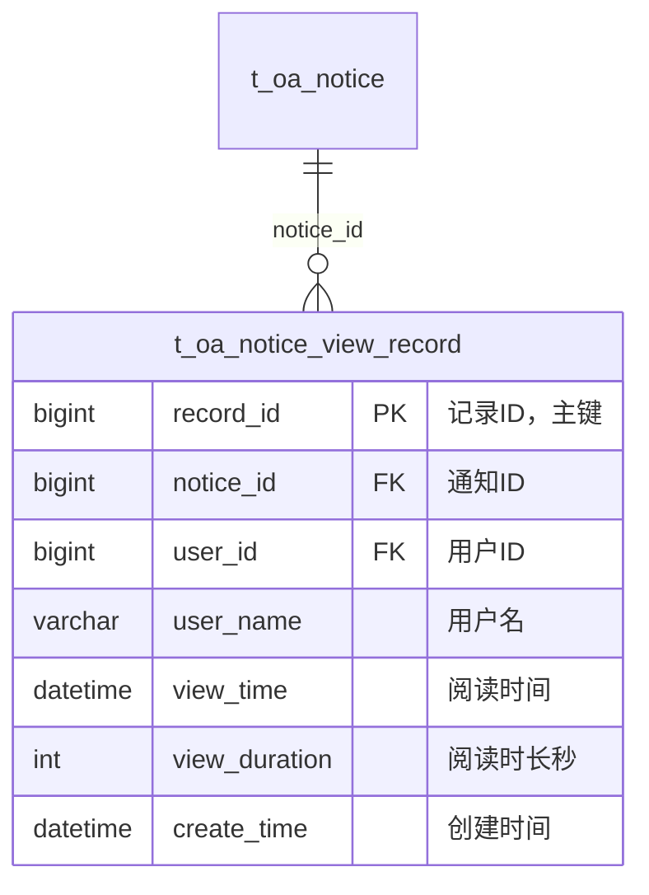
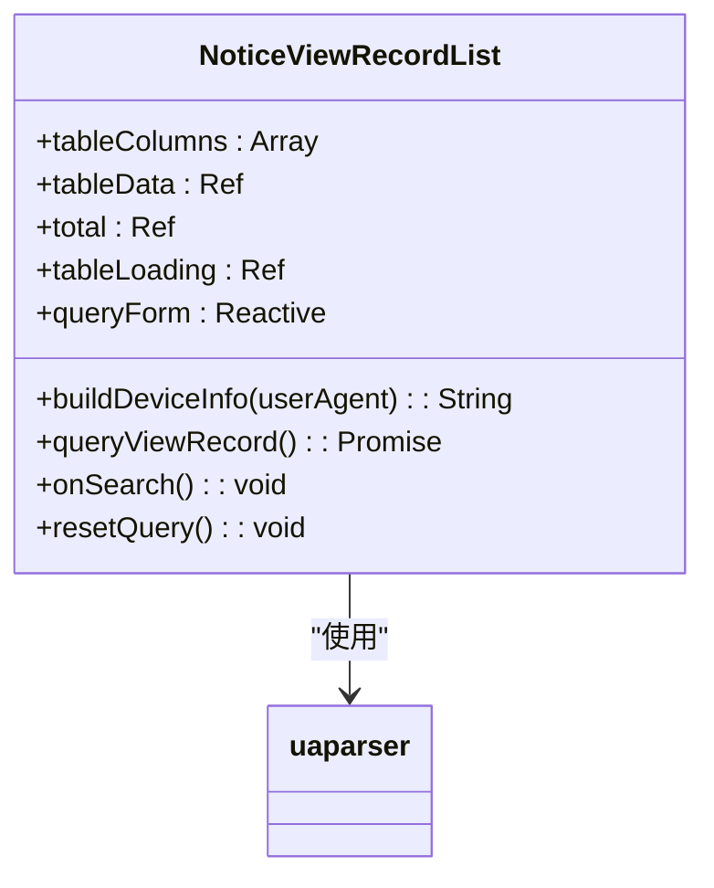
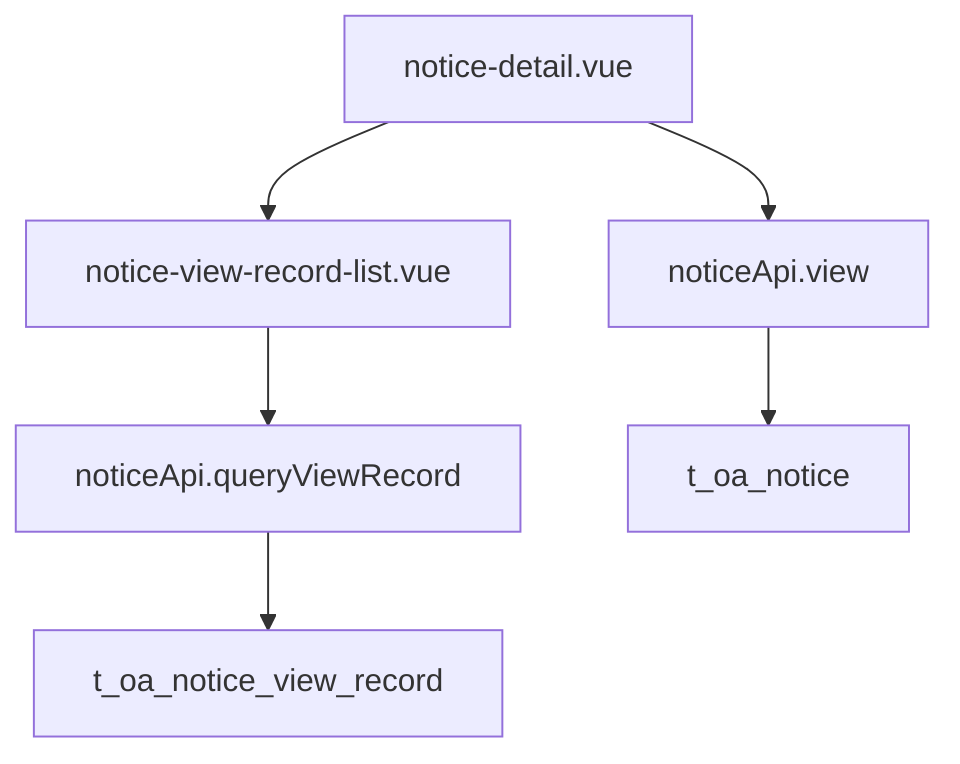

# 通知阅读记录追踪实现

<cite>
**本文档引用文件**  
- [t_oa_notice.sql](file://bak/20251209_151531_cleanup_backup/database_scripts_backup/20251209_022509/database-scripts/oa-service/23-t_oa_notice.sql)
- [notice-view-record-list.vue](file://smart-admin-web-javascript/src/views/business/oa/notice/components/notice-view-record-list.vue)
- [notice-detail.vue](file://smart-admin-web-javascript/src/views/business/oa/notice/notice-detail.vue)
- [notice-employee-detail.vue](file://smart-admin-web-javascript/src/views/business/oa/notice/notice-employee-detail.vue)
- [notice-const.js](file://smart-admin-web-javascript/src/constants/business/oa/notice-const.js)
</cite>

## 目录
1. [引言](#引言)
2. [项目结构](#项目结构)
3. [核心组件](#核心组件)
4. [架构概述](#架构概述)
5. [详细组件分析](#详细组件分析)
6. [依赖分析](#依赖分析)
7. [性能考虑](#性能考虑)
8. [故障排除指南](#故障排除指南)
9. [结论](#结论)

## 引言
本文档详细阐述了通知公告阅读记录的追踪实现方案。基于数据库表 `t_oa_notice_view_record` 和前端组件的实现，说明系统如何记录员工对通知的访问行为，包括首次和最近访问的时间信息。通过分析查看记录查询机制，解释系统如何判断员工是否已读某条通知，从而实现已读/未读状态的精准判断。同时探讨在高并发场景下，可能采用的性能优化策略。

## 项目结构
系统采用前后端分离架构，前端位于 `smart-admin-web-javascript` 项目中，主要包含通知相关的Vue组件；后端数据结构定义在 `database-scripts/oa-service/23-t_oa_notice.sql` 文件中，定义了通知及阅读记录相关的数据库表结构。

**图表来源**  
- [t_oa_notice.sql](file://bak/20251209_151531_cleanup_backup/database_scripts_backup/20251209_022509/database-scripts/oa-service/23-t_oa_notice.sql)
- [notice-detail.vue](file://smart-admin-web-javascript/src/views/business/oa/notice/notice-detail.vue)
- [notice-view-record-list.vue](file://smart-admin-web-javascript/src/views/business/oa/notice/components/notice-view-record-list.vue)

**章节来源**  
- [t_oa_notice.sql](file://bak/20251209_151531_cleanup_backup/database_scripts_backup/20251209_022509/database-scripts/oa-service/23-t_oa_notice.sql)
- [smart-admin-web-javascript](file://smart-admin-web-javascript)

## 核心组件
核心组件包括通知阅读记录数据库表 `t_oa_notice_view_record` 和前端查看记录展示组件 `notice-view-record-list.vue`。前者负责持久化存储用户的阅读行为，后者负责在UI层面展示这些记录。

**章节来源**  
- [t_oa_notice.sql](file://bak/20251209_151531_cleanup_backup/database_scripts_backup/20251209_022509/database-scripts/oa-service/23-t_oa_notice.sql#L53-L67)
- [notice-view-record-list.vue](file://smart-admin-web-javascript/src/views/business/oa/notice/components/notice-view-record-list.vue#L68-L160)

## 架构概述
系统通过前后端协作实现通知阅读记录的追踪。当用户查看通知时，前端触发请求，后端在 `t_oa_notice_view_record` 表中记录该行为。系统通过查询该表来判断用户是否已读通知，并在UI上显示相应的已读/未读状态。

**图表来源**  
- [t_oa_notice.sql](file://bak/20251209_151531_cleanup_backup/database_scripts_backup/20251209_022509/database-scripts/oa-service/23-t_oa_notice.sql)
- [notice-detail.vue](file://smart-admin-web-javascript/src/views/business/oa/notice/notice-detail.vue)
- [notice-view-record-list.vue](file://smart-admin-web-javascript/src/views/business/oa/notice/components/notice-view-record-list.vue)

## 详细组件分析

### 通知阅读记录表分析
`<t_oa_notice_view_record>` 表是通知阅读记录的核心数据存储结构，用于追踪每个用户对每条通知的访问行为。

**图表来源**  
- [t_oa_notice.sql](file://bak/20251209_151531_cleanup_backup/database_scripts_backup/20251209_022509/database-scripts/oa-service/23-t_oa_notice.sql#L53-L67)

**章节来源**  
- [t_oa_notice.sql](file://bak/20251209_151531_cleanup_backup/database_scripts_backup/20251209_022509/database-scripts/oa-service/23-t_oa_notice.sql#L53-L67)

### 前端查看记录组件分析
`<notice-view-record-list.vue>` 组件负责展示通知的查看记录，包括查看次数、首次和最后一次查看的设备信息等。

**图表来源**  
- [notice-view-record-list.vue](file://smart-admin-web-javascript/src/views/business/oa/notice/components/notice-view-record-list.vue)

**章节来源**  
- [notice-view-record-list.vue](file://smart-admin-web-javascript/src/views/business/oa/notice/components/notice-view-record-list.vue#L68-L160)

## 依赖分析
系统各组件之间存在明确的依赖关系。前端组件依赖后端API获取数据，后端服务依赖数据库存储阅读记录。通知详情页面依赖查看记录组件来展示完整的通知信息。

**图表来源**  
- [notice-detail.vue](file://smart-admin-web-javascript/src/views/business/oa/notice/notice-detail.vue)
- [notice-view-record-list.vue](file://smart-admin-web-javascript/src/views/business/oa/notice/components/notice-view-record-list.vue)
- [t_oa_notice.sql](file://bak/20251209_151531_cleanup_backup/database_scripts_backup/20251209_022509/database-scripts/oa-service/23-t_oa_notice.sql)

**章节来源**  
- [notice-detail.vue](file://smart-admin-web-javascript/src/views/business/oa/notice/notice-detail.vue#L47-L48)
- [notice-view-record-list.vue](file://smart-admin-web-javascript/src/views/business/oa/notice/components/notice-view-record-list.vue#L134-L135)

## 性能考虑
虽然当前实现中没有发现明确的缓存或异步更新机制，但在高并发场景下，可以考虑引入应用层缓存来存储热门通知的阅读统计信息，或采用异步方式更新阅读记录，以减轻数据库压力。此外，`t_oa_notice_view_record` 表在 `notice_id` 和 `user_id` 上建立了索引，有助于提高查询性能。

## 故障排除指南
当出现查看记录不准确或无法显示的问题时，应首先检查数据库连接是否正常，确认 `t_oa_notice_view_record` 表中是否存在相应的记录。其次检查前端组件是否正确调用了API接口，以及后端服务是否正确处理了查看记录的查询请求。

**章节来源**  
- [t_oa_notice.sql](file://bak/20251209_151531_cleanup_backup/database_scripts_backup/20251209_022509/database-scripts/oa-service/23-t_oa_notice.sql)
- [notice-view-record-list.vue](file://smart-admin-web-javascript/src/views/business/oa/notice/components/notice-view-record-list.vue)

## 结论
当前系统通过 `t_oa_notice_view_record` 表实现了通知阅读记录的基本追踪功能，能够记录用户对通知的访问行为。前端组件能够正确展示这些记录，为用户提供查看历史。未来可考虑增加IP地址和User-Agent信息的记录，以提供更详细的访问分析，并引入缓存机制以提升高并发场景下的系统性能。