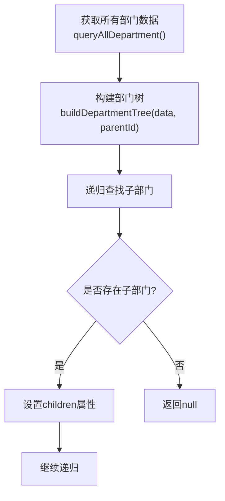
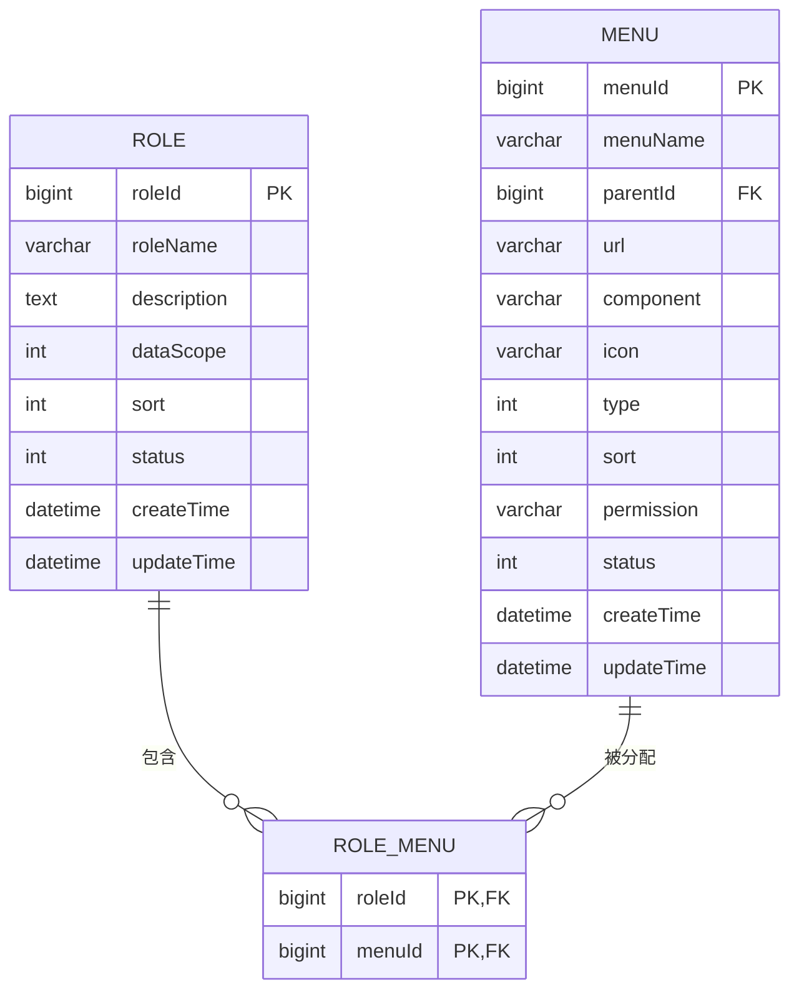
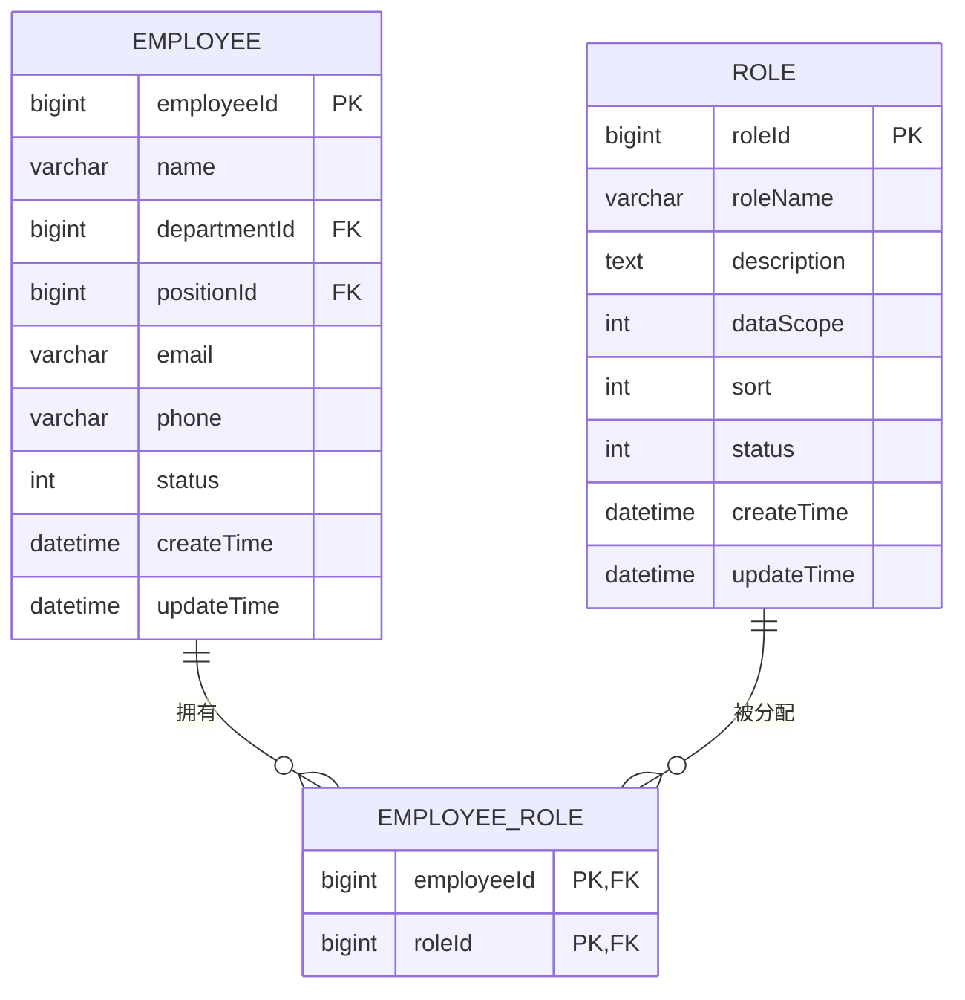
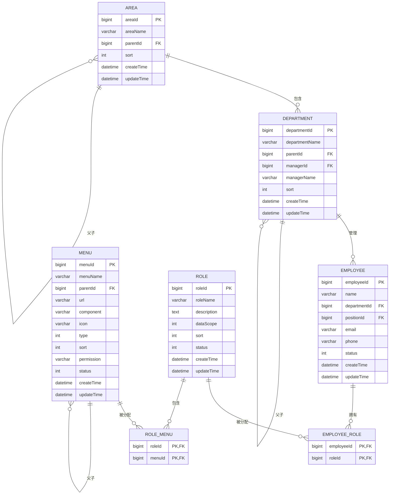

# 系统模块表结构

<cite>
**本文档引用文件**  
- [area-api.js](file://smart-admin-web-javascript/src/api/system/area-api.js)
- [department-api.js](file://smart-admin-web-javascript/src/api/system/department-api.js)
- [employee-api.js](file://smart-admin-web-javascript/src/api/system/employee-api.js)
- [menu-api.js](file://smart-admin-web-javascript/src/api/system/menu-api.js)
- [role-api.js](file://smart-admin-web-javascript/src/api/system/role-api.js)
- [department-list.vue](file://smart-admin-web-javascript/src/views/system/department/department-list.vue)
- [smart_area.sql](file://数据库SQL脚本/mysql/smart_area.sql)
- [fix_area_menu.sql](file://数据库SQL脚本/mysql/fix_area_menu.sql)
- [fix_area_menu_v2.sql](file://数据库SQL脚本/mysql/fix_area_menu_v2.sql)
- [fix_area_menu_final.sql](file://数据库SQL脚本/mysql/fix_area_menu_final.sql)
- [check_menu.sql](file://check_menu.sql)
- [check_parent_menu.sql](file://check_parent_menu.sql)
- [query_menu_structure.sql](file://query_menu_structure.sql)
</cite>

## 目录
1. [引言](#引言)
2. [核心表结构设计](#核心表结构设计)
3. [区域表(Area)设计](#区域表area设计)
4. [部门表(Department)设计](#部门表department设计)
5. [员工表(Employee)设计](#员工表employee设计)
6. [菜单表(Menu)设计](#菜单表menu设计)
7. [角色表(Role)设计](#角色表role设计)
8. [权限控制机制](#权限控制机制)
9. [实体类映射与MyBatis-Plus](#实体类映射与mybatis-plus)
10. [ER图与系统关联](#er图与系统关联)
11. [查询性能优化建议](#查询性能优化建议)
12. [结论](#结论)

## 引言
本系统为智能管理系统，包含区域、部门、员工、菜单、角色等核心模块。这些模块构成了系统的组织架构和权限管理体系。本文档详细说明各核心表的数据库设计、字段定义、约束关系以及在MyBatis-Plus框架下的实体映射，重点分析区域层级结构、部门树形关联、角色-菜单权限控制等关键设计。

## 核心表结构设计
系统核心模块包括区域(area)、部门(department)、员工(employee)、菜单(menu)、角色(role)等五张核心表，通过外键约束和多对多关联表建立完整的关系网络。这些表共同支撑系统的组织架构管理和权限控制体系。

**Section sources**
- [area-api.js](file://smart-admin-web-javascript/src/api/system/area-api.js)
- [department-api.js](file://smart-admin-web-javascript/src/api/system/department-api.js)
- [employee-api.js](file://smart-admin-web-javascript/src/api/system/employee-api.js)
- [menu-api.js](file://smart-admin-web-javascript/src/api/system/menu-api.js)
- [role-api.js](file://smart-admin-web-javascript/src/api/system/role-api.js)

## 区域表(area)设计
区域表采用树形结构设计，支持多级区域管理。通过`parentId`字段建立父子关系，形成层级结构。区域编码规则在系统中通过路径索引优化查询性能。

### 字段定义
- `areaId`: 区域ID，主键，自增
- `areaName`: 区域名称，非空
- `parentId`: 父级区域ID，外键引用自身，顶级区域为0或NULL
- `sort`: 排序字段，用于同级区域排序
- `createTime`: 创建时间
- `updateTime`: 更新时间

### 约束与索引
- 主键约束：`areaId`
- 外键约束：`parentId`引用`area(areaId)`
- 索引策略：在`parentId`字段上建立索引以优化树形查询性能

### 层级结构设计
区域表通过`parentId`实现无限层级的树形结构，支持从国家、省份、城市到区县的多级区域划分。顶级区域的`parentId`为0或NULL。

**Section sources**
- [area-api.js](file://smart-admin-web-javascript/src/api/system/area-api.js)
- [smart_area.sql](file://数据库SQL脚本/mysql/smart_area.sql)
- [fix_area_menu.sql](file://数据库SQL脚本/mysql/fix_area_menu.sql)

## 部门表(department)设计
部门表同样采用树形结构设计，与区域表类似，但专注于组织内部的部门架构管理。部门与员工存在一对多关系。

### 字段定义
- `departmentId`: 部门ID，主键，自增
- `departmentName`: 部门名称，非空
- `parentId`: 父级部门ID，外键引用自身
- `managerId`: 部门负责人ID，外键引用员工表
- `managerName`: 负责人姓名（冗余字段，优化查询）
- `sort`: 排序字段
- `createTime`: 创建时间
- `updateTime`: 更新时间

### 约束与索引
- 主键约束：`departmentId`
- 外键约束：`parentId`引用`department(departmentId)`，`managerId`引用`employee(employeeId)`
- 索引策略：在`parentId`和`managerId`字段上建立索引

### 树形结构关联
部门表通过`parentId`字段实现树形结构，支持公司、部门、小组等多级组织架构。前端通过`queryAllDepartment`接口获取所有部门数据，并在客户端构建树形结构。

**Diagram sources**
- [department-api.js](file://smart-admin-web-javascript/src/api/system/department-api.js)
- [department-list.vue](file://smart-admin-web-javascript/src/views/system/department/department-list.vue)

**Section sources**
- [department-api.js](file://smart-admin-web-javascript/src/api/system/department-api.js)
- [department-list.vue](file://smart-admin-web-javascript/src/views/system/department/department-list.vue)

## 员工表(employee)设计
员工表存储系统用户信息，与部门表建立关联，实现组织架构中的人事管理。

### 字段定义
- `employeeId`: 员工ID，主键
- `name`: 员工姓名
- `departmentId`: 所属部门ID，外键引用部门表
- `positionId`: 职位ID，外键引用职位表
- `email`: 邮箱
- `phone`: 手机号
- `status`: 状态（启用/禁用）
- `createTime`: 创建时间
- `updateTime`: 更新时间

### 约束与索引
- 主键约束：`employeeId`
- 外键约束：`departmentId`引用`department(departmentId)`，`positionId`引用`position(positionId)`
- 索引策略：在`departmentId`字段上建立索引以优化按部门查询员工的性能

**Section sources**
- [employee-api.js](file://smart-admin-web-javascript/src/api/system/employee-api.js)

## 菜单表(menu)设计
菜单表存储系统功能菜单，采用树形结构设计，支持多级菜单导航。

### 字段定义
- `menuId`: 菜单ID，主键
- `menuName`: 菜单名称
- `parentId`: 父级菜单ID，外键引用自身
- `url`: 菜单路径
- `component`: 前端组件路径
- `icon`: 图标
- `type`: 菜单类型（目录、菜单、按钮）
- `sort`: 排序
- `permission`: 权限标识
- `status`: 状态
- `createTime`: 创建时间
- `updateTime`: 更新时间

### 约束与索引
- 主键约束：`menuId`
- 外键约束：`parentId`引用`menu(menuId)`
- 索引策略：在`parentId`和`permission`字段上建立索引

**Section sources**
- [menu-api.js](file://smart-admin-web-javascript/src/api/system/menu-api.js)

## 角色表(role)设计
角色表定义系统中的角色，用于权限分配和用户分组。

### 字段定义
- `roleId`: 角色ID，主键
- `roleName`: 角色名称
- `description`: 角色描述
- `dataScope`: 数据范围（全部、本部门、本部门及子部门等）
- `sort`: 排序
- `status`: 状态
- `createTime`: 创建时间
- `updateTime`: 更新时间

### 约束与索引
- 主键约束：`roleId`
- 唯一约束：`roleName`
- 索引策略：在`dataScope`字段上建立索引以优化数据范围查询

**Section sources**
- [role-api.js](file://smart-admin-web-javascript/src/api/system/role-api.js)

## 权限控制机制
系统采用基于角色的访问控制（RBAC）模型，通过角色-菜单多对多关系实现灵活的权限管理。

### 角色-菜单多对多关系
系统通过中间表`role_menu`实现角色与菜单的多对多关联，一个角色可以拥有多个菜单权限，一个菜单也可以被多个角色拥有。

**Diagram sources**
- [role-api.js](file://smart-admin-web-javascript/src/api/system/role-api.js)
- [menu-api.js](file://smart-admin-web-javascript/src/api/system/menu-api.js)

### 角色-员工关联
员工通过角色获得权限，一个员工可以拥有多个角色，实现灵活的权限分配。

**Diagram sources**
- [employee-api.js](file://smart-admin-web-javascript/src/api/system/employee-api.js)
- [role-api.js](file://smart-admin-web-javascript/src/api/system/role-api.js)

## 实体类映射与MyBatis-Plus
系统使用MyBatis-Plus框架实现数据库操作，各表均有对应的实体类，通过注解实现字段映射。

### 实体类设计特点
- 使用`@TableName`注解指定表名
- 使用`@TableId`注解指定主键字段和生成策略
- 使用`@TableField`注解处理字段映射
- 支持逻辑删除功能
- 集成自动填充功能（创建时间、更新时间）

### 树形结构处理
对于区域、部门、菜单等树形结构表，实体类通常包含`children`属性，用于存储子节点，在查询时通过递归算法构建完整的树形结构。

**Section sources**
- [area-api.js](file://smart-admin-web-javascript/src/api/system/area-api.js)
- [department-api.js](file://smart-admin-web-javascript/src/api/system/department-api.js)
- [menu-api.js](file://smart-admin-web-javascript/src/api/system/menu-api.js)

## ER图与系统关联
以下是系统核心模块的实体关系图，展示了各表之间的关联关系。

**Diagram sources**
- [smart_area.sql](file://数据库SQL脚本/mysql/smart_area.sql)
- [department-list.vue](file://smart-admin-web-javascript/src/views/system/department/department-list.vue)
- [employee-api.js](file://smart-admin-web-javascript/src/api/system/employee-api.js)
- [menu-api.js](file://smart-admin-web-javascript/src/api/system/menu-api.js)
- [role-api.js](file://smart-admin-web-javascript/src/api/system/role-api.js)

## 查询性能优化建议
针对系统中的核心查询场景，提出以下性能优化建议：

### 区域表路径索引
对于区域表的层级查询，建议在`parentId`字段上建立索引，并考虑使用路径枚举（Path Enumeration）模式，在表中增加`path`字段存储从根节点到当前节点的完整路径，如"0-1-5-8"，通过LIKE查询实现快速的层级遍历。

### 部门表层级查询优化
部门表的层级查询可通过以下方式优化：
1. 在`parentId`字段上建立索引
2. 使用闭包表（Closure Table）模式存储所有父子关系
3. 在查询时使用WITH RECURSIVE递归查询（如果数据库支持）

### 菜单权限查询优化
菜单权限查询可通过以下方式优化：
1. 在`role_menu`表的`roleId`和`menuId`字段上建立复合索引
2. 使用缓存机制存储角色的菜单权限，减少数据库查询
3. 在`menu`表的`parentId`字段上建立索引以优化树形结构构建

### 员工查询优化
员工查询可通过以下方式优化：
1. 在`departmentId`字段上建立索引以优化按部门查询
2. 在`status`字段上建立索引以优化状态过滤
3. 使用覆盖索引包含常用查询字段，避免回表查询

**Section sources**
- [smart_area.sql](file://数据库SQL脚本/mysql/smart_area.sql)
- [department-list.vue](file://smart-admin-web-javascript/src/views/system/department/department-list.vue)
- [employee-api.js](file://smart-admin-web-javascript/src/api/system/employee-api.js)
- [menu-api.js](file://smart-admin-web-javascript/src/api/system/menu-api.js)

## 结论
本系统通过精心设计的表结构实现了灵活的组织架构管理和权限控制体系。区域、部门、员工表构成系统的组织架构基础，采用树形结构设计支持多级层级管理。菜单、角色表与多对多关联表共同构建了基于RBAC模型的权限控制系统。通过MyBatis-Plus框架实现高效的数据库操作，并通过合理的索引策略和查询优化确保系统性能。整体设计既满足了功能需求，又考虑了性能和可扩展性。