# 数据库设计

<cite>
**本文档引用的文件**  
- [00-database-init.sql](file://database-scripts/common-service/00-database-init.sql)
- [02-t_user.sql](file://database-scripts/common-service/02-t_user.sql)
- [03-t_role.sql](file://database-scripts/common-service/03-t_role.sql)
- [04-t_permission.sql](file://database-scripts/common-service/04-t_permission.sql)
- [05-t_user_role.sql](file://database-scripts/common-service/05-t_user_role.sql)
- [06-t_role_permission.sql](file://database-scripts/common-service/06-t_role_permission.sql)
- [10-t_audit_log.sql](file://database-scripts/common-service/10-t_audit_log.sql)
- [11-t_alert.sql](file://database-scripts/common-service/11-t_alert.sql)
- [12-t_alert_rule.sql](file://database-scripts/common-service/12-t_alert_rule.sql)
- [13-t_system_monitor.sql](file://database-scripts/common-service/13-t_system_monitor.sql)
- [14-t_scheduled_job.sql](file://database-scripts/common-service/14-t_scheduled_job.sql)
- [15-t_job_execution_log.sql](file://database-scripts/common-service/15-t_job_execution_log.sql)
- [16-t_system_config.sql](file://database-scripts/common-service/16-t_system_config.sql)
- [17-t_system_dict.sql](file://database-scripts/common-service/17-t_system_dict.sql)
- [18-t_employee.sql](file://database-scripts/common-service/18-t_employee.sql)
- [t_user_session_table.sql](file://database-scripts/t_user_session_table.sql)
- [performance_optimization.sql](file://database/performance_optimization.sql)
</cite>

## 目录
1. [引言](#引言)
2. [数据库集群架构](#数据库集群架构)
3. [分库分表策略](#分库分表策略)
4. [核心模块ER图](#核心模块er图)
5. [核心表结构定义](#核心表结构定义)
6. [关键表设计理念](#关键表设计理念)
7. [数据库命名规范](#数据库命名规范)
8. [性能优化措施](#性能优化措施)
9. [数据库初始化脚本使用说明](#数据库初始化脚本使用说明)

## 引言
本文档详细描述了IOE-DREAM系统的数据库设计，涵盖了数据库集群架构、分库分表策略、核心模块的实体关系图（ER图）、详细的表结构定义、关键表的设计理念、命名规范以及性能优化措施。文档还提供了数据库初始化脚本的使用说明，旨在为开发人员、数据库管理员和系统架构师提供全面的数据库设计参考。

## 数据库集群架构
IOE-DREAM系统采用主从复制的数据库集群架构，以提高系统的可用性和读取性能。主数据库负责处理所有的写操作和部分读操作，而一个或多个从数据库则负责处理读操作。这种架构实现了读写分离，有效分散了数据库的负载压力。

数据库集群使用MySQL作为主要的数据库管理系统，配置了高可用性（HA）机制，确保在主数据库发生故障时能够快速切换到备用数据库，最大限度地减少服务中断时间。此外，系统还集成了监控和告警模块，实时监控数据库的健康状况和性能指标，及时发现并处理潜在问题。

**Section sources**
- [00-database-init.sql](file://database-scripts/common-service/00-database-init.sql)
- [13-t_system_monitor.sql](file://database-scripts/common-service/13-t_system_monitor.sql)
- [11-t_alert.sql](file://database-scripts/common-service/11-t_alert.sql)
- [12-t_alert_rule.sql](file://database-scripts/common-service/12-t_alert_rule.sql)

## 分库分表策略
目前，IOE-DREAM系统采用单库设计，所有模块的表都存储在`ioedream_common_db`数据库中。这种设计适用于当前的业务规模和数据量。随着业务的发展和数据量的增长，系统将考虑实施分库分表策略。

未来的分库分表策略将基于业务模块进行垂直分库，例如将用户、角色、权限相关的表放入一个独立的认证库（`auth_db`），将门禁、考勤相关的表放入一个独立的业务库（`business_db`）。对于数据量特别大的表，如审计日志表（`t_audit_log`）和任务执行日志表（`t_job_execution_log`），将采用水平分表策略，根据时间维度（如按月或按年）进行分表，以提高查询性能和管理效率。

**Section sources**
- [00-database-init.sql](file://database-scripts/common-service/00-database-init.sql)
- [10-t_audit_log.sql](file://database-scripts/common-service/10-t_audit_log.sql)
- [15-t_job_execution_log.sql](file://database-scripts/common-service/15-t_job_execution_log.sql)

## 核心模块ER图

```mermaid
erDiagram
t_user {
BIGINT user_id PK
VARCHAR(50) username UK
VARCHAR(255) password
VARCHAR(100) email UK
VARCHAR(20) phone
VARCHAR(100) real_name
VARCHAR(500) avatar
TINYINT status
TINYINT account_locked
VARCHAR(500) lock_reason
DATETIME lock_time
DATETIME unlock_time
INT login_fail_count
DATETIME last_login_time
VARCHAR(50) last_login_ip
DATETIME password_update_time
DATETIME account_expire_time
VARCHAR(500) remark
DATETIME create_time
DATETIME update_time
BIGINT create_user_id
BIGINT update_user_id
TINYINT deleted_flag
}
t_role {
BIGINT role_id PK
VARCHAR(50) role_code UK
VARCHAR(100) role_name
VARCHAR(500) role_desc
TINYINT data_scope
TINYINT status
TINYINT is_system
INT sort_order
VARCHAR(500) remark
DATETIME create_time
DATETIME update_time
BIGINT create_user_id
BIGINT update_user_id
TINYINT deleted_flag
}
t_permission {
BIGINT permission_id PK
VARCHAR(100) permission_code UK
VARCHAR(100) permission_name
TINYINT permission_type
BIGINT parent_id
VARCHAR(200) path
VARCHAR(200) component
VARCHAR(100) icon
VARCHAR(200) api_path
VARCHAR(20) api_method
INT sort_order
TINYINT is_external
TINYINT is_cache
TINYINT is_hidden
TINYINT status
VARCHAR(500) remark
DATETIME create_time
DATETIME update_time
BIGINT create_user_id
BIGINT update_user_id
TINYINT deleted_flag
}
t_user_role {
BIGINT user_role_id PK
BIGINT user_id FK
BIGINT role_id FK
DATETIME create_time
BIGINT create_user_id
}
t_role_permission {
BIGINT role_permission_id PK
BIGINT role_id FK
BIGINT permission_id FK
DATETIME create_time
BIGINT create_user_id
}
t_employee {
BIGINT employee_id PK
VARCHAR(50) employee_code UK
VARCHAR(100) employee_name
VARCHAR(20) phone
VARCHAR(100) email
VARCHAR(50) department
VARCHAR(50) position
TINYINT gender
DATE birth_date
VARCHAR(100) id_card
VARCHAR(200) address
VARCHAR(500) remark
DATETIME create_time
DATETIME update_time
BIGINT create_user_id
BIGINT update_user_id
TINYINT deleted_flag
}
t_system_dict {
BIGINT dict_id PK
VARCHAR(50) dict_type UK
VARCHAR(100) dict_name
VARCHAR(500) remark
DATETIME create_time
DATETIME update_time
BIGINT create_user_id
BIGINT update_user_id
TINYINT deleted_flag
}
t_system_config {
BIGINT config_id PK
VARCHAR(100) config_key UK
TEXT config_value
VARCHAR(100) config_name
VARCHAR(500) config_desc
VARCHAR(50) config_type
VARCHAR(50) config_group
TINYINT is_encrypted
TINYINT is_system
TINYINT status
INT sort_order
VARCHAR(500) remark
DATETIME create_time
DATETIME update_time
BIGINT create_user_id
BIGINT update_user_id
TINYINT deleted_flag
}
t_audit_log {
BIGINT log_id PK
BIGINT user_id FK
VARCHAR(100) user_name
VARCHAR(100) module_name
TINYINT operation_type
VARCHAR(500) operation_desc
VARCHAR(100) resource_type
VARCHAR(100) resource_id
VARCHAR(20) request_method
VARCHAR(500) request_url
TEXT request_params
TEXT response_data
TINYINT result_status
TEXT error_message
TINYINT risk_level
VARCHAR(50) client_ip
VARCHAR(500) user_agent
VARCHAR(100) trace_id
BIGINT execution_time
DATETIME create_time
}
t_scheduled_job {
BIGINT job_id PK
VARCHAR(100) job_name
VARCHAR(50) job_group
VARCHAR(500) job_class
VARCHAR(100) cron_expression
TEXT job_params
VARCHAR(500) job_description
TINYINT status
INT priority
INT max_retry
INT retry_interval
INT timeout
TINYINT concurrent
TINYINT misfire_policy
DATETIME last_execution_time
DATETIME next_execution_time
BIGINT execution_count
BIGINT failure_count
DATETIME create_time
DATETIME update_time
BIGINT create_user_id
BIGINT update_user_id
TINYINT deleted_flag
}
t_job_execution_log {
BIGINT log_id PK
BIGINT job_id FK
VARCHAR(100) job_name
VARCHAR(50) job_group
TINYINT execution_status
DATETIME start_time
DATETIME end_time
BIGINT execution_time
INT retry_count
TEXT error_message
TEXT stack_trace
TEXT execution_result
VARCHAR(50) server_ip
VARCHAR(100) server_hostname
DATETIME create_time
}
t_alert {
BIGINT alert_id PK
VARCHAR(20) alert_level
VARCHAR(200) alert_title
TEXT alert_message
VARCHAR(100) service_name
VARCHAR(100) instance_id
VARCHAR(100) metric_name
DOUBLE metric_value
DOUBLE threshold_value
VARCHAR(20) status
TEXT resolution_notes
DATETIME resolved_time
BIGINT resolved_user_id
BIGINT rule_id FK
VARCHAR(500) tags
DATETIME create_time
DATETIME update_time
TINYINT deleted_flag
}
t_alert_rule {
BIGINT rule_id PK
VARCHAR(100) rule_name
VARCHAR(500) rule_description
VARCHAR(100) metric_name
VARCHAR(50) monitor_type
VARCHAR(20) condition_operator
DOUBLE threshold_value
VARCHAR(20) alert_level
VARCHAR(500) applicable_services
VARCHAR(200) applicable_environments
VARCHAR(20) status
INT duration_minutes
VARCHAR(200) notification_channels
VARCHAR(500) notification_users
INT notification_interval
INT suppression_duration
TEXT rule_expression
INT priority
VARCHAR(500) tags
DATETIME create_time
DATETIME update_time
BIGINT create_user_id
BIGINT update_user_id
TINYINT deleted_flag
}
t_system_monitor {
BIGINT monitor_id PK
VARCHAR(100) service_name
VARCHAR(100) instance_id
VARCHAR(50) monitor_type
VARCHAR(100) metric_name
DOUBLE metric_value
VARCHAR(20) metric_unit
VARCHAR(20) status
DOUBLE alert_threshold
DATETIME monitor_time
DATETIME create_time
DATETIME update_time
BIGINT create_user_id
TINYINT deleted_flag
}
t_user ||--o{ t_user_role : "1:N"
t_role ||--o{ t_user_role : "1:N"
t_role ||--o{ t_role_permission : "1:N"
t_permission ||--o{ t_role_permission : "1:N"
t_user ||--o{ t_audit_log : "1:N"
t_scheduled_job ||--o{ t_job_execution_log : "1:N"
t_alert_rule ||--o{ t_alert : "1:N"
```

**Diagram sources**
- [02-t_user.sql](file://database-scripts/common-service/02-t_user.sql)
- [03-t_role.sql](file://database-scripts/common-service/03-t_role.sql)
- [04-t_permission.sql](file://database-scripts/common-service/04-t_permission.sql)
- [05-t_user_role.sql](file://database-scripts/common-service/05-t_user_role.sql)
- [06-t_role_permission.sql](file://database-scripts/common-service/06-t_role_permission.sql)
- [18-t_employee.sql](file://database-scripts/common-service/18-t_employee.sql)
- [17-t_system_dict.sql](file://database-scripts/common-service/17-t_system_dict.sql)
- [16-t_system_config.sql](file://database-scripts/common-service/16-t_system_config.sql)
- [10-t_audit_log.sql](file://database-scripts/common-service/10-t_audit_log.sql)
- [14-t_scheduled_job.sql](file://database-scripts/common-service/14-t_scheduled_job.sql)
- [15-t_job_execution_log.sql](file://database-scripts/common-service/15-t_job_execution_log.sql)
- [11-t_alert.sql](file://database-scripts/common-service/11-t_alert.sql)
- [12-t_alert_rule.sql](file://database-scripts/common-service/12-t_alert_rule.sql)
- [13-t_system_monitor.sql](file://database-scripts/common-service/13-t_system_monitor.sql)

## 核心表结构定义

### 用户模块
#### t_user (用户表)
| 字段名 | 数据类型 | 约束 | 说明 |
| :--- | :--- | :--- | :--- |
| user_id | BIGINT | PRIMARY KEY, AUTO_INCREMENT | 用户ID |
| username | VARCHAR(50) | NOT NULL, UNIQUE | 用户名（登录用） |
| password | VARCHAR(255) | NOT NULL | 密码（加密存储） |
| email | VARCHAR(100) | NOT NULL, UNIQUE | 邮箱 |
| phone | VARCHAR(20) | | 手机号 |
| real_name | VARCHAR(100) | | 真实姓名 |
| avatar | VARCHAR(500) | | 头像URL |
| status | TINYINT | NOT NULL, DEFAULT 1 | 状态：1-正常 2-禁用 3-锁定 |
| account_locked | TINYINT | NOT NULL, DEFAULT 0 | 账户是否锁定：0-未锁定 1-已锁定 |
| lock_reason | VARCHAR(500) | | 锁定原因 |
| lock_time | DATETIME | | 锁定时间 |
| unlock_time | DATETIME | | 解锁时间 |
| login_fail_count | INT | NOT NULL, DEFAULT 0 | 登录失败次数 |
| last_login_time | DATETIME | | 最后登录时间 |
| last_login_ip | VARCHAR(50) | | 最后登录IP |
| password_update_time | DATETIME | | 密码更新时间 |
| account_expire_time | DATETIME | | 账户过期时间 |
| remark | VARCHAR(500) | | 备注 |
| create_time | DATETIME | NOT NULL, DEFAULT CURRENT_TIMESTAMP | 创建时间 |
| update_time | DATETIME | NOT NULL, DEFAULT CURRENT_TIMESTAMP ON UPDATE CURRENT_TIMESTAMP | 更新时间 |
| create_user_id | BIGINT | | 创建人ID |
| update_user_id | BIGINT | | 更新人ID |
| deleted_flag | TINYINT | NOT NULL, DEFAULT 0 | 删除标记：0-未删除 1-已删除 |

**Section sources**
- [02-t_user.sql](file://database-scripts/common-service/02-t_user.sql)

### 角色模块
#### t_role (角色表)
| 字段名 | 数据类型 | 约束 | 说明 |
| :--- | :--- | :--- | :--- |
| role_id | BIGINT | PRIMARY KEY, AUTO_INCREMENT | 角色ID |
| role_code | VARCHAR(50) | NOT NULL, UNIQUE | 角色编码 |
| role_name | VARCHAR(100) | NOT NULL | 角色名称 |
| role_desc | VARCHAR(500) | | 角色描述 |
| data_scope | TINYINT | NOT NULL, DEFAULT 5 | 数据权限范围：1-全部 2-自定义 3-本部门 4-本部门及子部门 5-仅本人 |
| status | TINYINT | NOT NULL, DEFAULT 1 | 状态：1-启用 2-禁用 |
| is_system | TINYINT | NOT NULL, DEFAULT 0 | 是否系统角色：0-否 1-是 |
| sort_order | INT | NOT NULL, DEFAULT 0 | 排序号 |
| remark | VARCHAR(500) | | 备注 |
| create_time | DATETIME | NOT NULL, DEFAULT CURRENT_TIMESTAMP | 创建时间 |
| update_time | DATETIME | NOT NULL, DEFAULT CURRENT_TIMESTAMP ON UPDATE CURRENT_TIMESTAMP | 更新时间 |
| create_user_id | BIGINT | | 创建人ID |
| update_user_id | BIGINT | | 更新人ID |
| deleted_flag | TINYINT | NOT NULL, DEFAULT 0 | 删除标记：0-未删除 1-已删除 |

**Section sources**
- [03-t_role.sql](file://database-scripts/common-service/03-t_role.sql)

### 权限模块
#### t_permission (权限表)
| 字段名 | 数据类型 | 约束 | 说明 |
| :--- | :--- | :--- | :--- |
| permission_id | BIGINT | PRIMARY KEY, AUTO_INCREMENT | 权限ID |
| permission_code | VARCHAR(100) | NOT NULL, UNIQUE | 权限编码 |
| permission_name | VARCHAR(100) | NOT NULL | 权限名称 |
| permission_type | TINYINT | NOT NULL | 权限类型：1-菜单 2-按钮 3-接口 4-数据 |
| parent_id | BIGINT | NOT NULL, DEFAULT 0 | 父权限ID |
| path | VARCHAR(200) | | 路由路径 |
| component | VARCHAR(200) | | 组件路径 |
| icon | VARCHAR(100) | | 图标 |
| api_path | VARCHAR(200) | | API路径 |
| api_method | VARCHAR(20) | | API方法：GET/POST/PUT/DELETE |
| sort_order | INT | NOT NULL, DEFAULT 0 | 排序号 |
| is_external | TINYINT | NOT NULL, DEFAULT 0 | 是否外链：0-否 1-是 |
| is_cache | TINYINT | NOT NULL, DEFAULT 1 | 是否缓存：0-否 1-是 |
| is_hidden | TINYINT | NOT NULL, DEFAULT 0 | 是否隐藏：0-否 1-是 |
| status | TINYINT | NOT NULL, DEFAULT 1 | 状态：1-启用 2-禁用 |
| remark | VARCHAR(500) | | 备注 |
| create_time | DATETIME | NOT NULL, DEFAULT CURRENT_TIMESTAMP | 创建时间 |
| update_time | DATETIME | NOT NULL, DEFAULT CURRENT_TIMESTAMP ON UPDATE CURRENT_TIMESTAMP | 更新时间 |
| create_user_id | BIGINT | | 创建人ID |
| update_user_id | BIGINT | | 更新人ID |
| deleted_flag | TINYINT | NOT NULL, DEFAULT 0 | 删除标记：0-未删除 1-已删除 |

**Section sources**
- [04-t_permission.sql](file://database-scripts/common-service/04-t_permission.sql)

### 关联表
#### t_user_role (用户角色关联表)
| 字段名 | 数据类型 | 约束 | 说明 |
| :--- | :--- | :--- | :--- |
| user_role_id | BIGINT | PRIMARY KEY, AUTO_INCREMENT | 用户角色ID |
| user_id | BIGINT | NOT NULL | 用户ID |
| role_id | BIGINT | NOT NULL | 角色ID |
| create_time | DATETIME | NOT NULL, DEFAULT CURRENT_TIMESTAMP | 创建时间 |
| create_user_id | BIGINT | | 创建人ID |

**Section sources**
- [05-t_user_role.sql](file://database-scripts/common-service/05-t_user_role.sql)

#### t_role_permission (角色权限关联表)
| 字段名 | 数据类型 | 约束 | 说明 |
| :--- | :--- | :--- | :--- |
| role_permission_id | BIGINT | PRIMARY KEY, AUTO_INCREMENT | 角色权限ID |
| role_id | BIGINT | NOT NULL | 角色ID |
| permission_id | BIGINT | NOT NULL | 权限ID |
| create_time | DATETIME | NOT NULL, DEFAULT CURRENT_TIMESTAMP | 创建时间 |
| create_user_id | BIGINT | | 创建人ID |

**Section sources**
- [06-t_role_permission.sql](file://database-scripts/common-service/06-t_role_permission.sql)

### 门禁与考勤模块
#### t_employee (员工表)
| 字段名 | 数据类型 | 约束 | 说明 |
| :--- | :--- | :--- | :--- |
| employee_id | BIGINT | PRIMARY KEY, AUTO_INCREMENT | 员工ID |
| employee_code | VARCHAR(50) | NOT NULL, UNIQUE | 员工编码 |
| employee_name | VARCHAR(100) | NOT NULL | 员工姓名 |
| phone | VARCHAR(20) | | 手机号 |
| email | VARCHAR(100) | | 邮箱 |
| department | VARCHAR(50) | | 部门 |
| position | VARCHAR(50) | | 职位 |
| gender | TINYINT | | 性别 |
| birth_date | DATE | | 出生日期 |
| id_card | VARCHAR(100) | | 身份证号 |
| address | VARCHAR(200) | | 地址 |
| remark | VARCHAR(500) | | 备注 |
| create_time | DATETIME | NOT NULL, DEFAULT CURRENT_TIMESTAMP | 创建时间 |
| update_time | DATETIME | NOT NULL, DEFAULT CURRENT_TIMESTAMP ON UPDATE CURRENT_TIMESTAMP | 更新时间 |
| create_user_id | BIGINT | | 创建人ID |
| update_user_id | BIGINT | | 更新人ID |
| deleted_flag | TINYINT | NOT NULL, DEFAULT 0 | 删除标记：0-未删除 1-已删除 |

**Section sources**
- [18-t_employee.sql](file://database-scripts/common-service/18-t_employee.sql)

## 关键表设计理念

### t_user 表设计理念
`t_user`表是系统的核心身份认证表，设计时充分考虑了用户账户的全生命周期管理。除了基本的用户名、密码、邮箱等信息外，还包含了账户状态管理（`status`）、账户锁定机制（`account_locked`、`lock_reason`、`lock_time`）、登录安全（`login_fail_count`、`last_login_time`、`last_login_ip`）和密码安全（`password_update_time`）等字段。这些设计确保了系统的安全性和可审计性，能够有效防止暴力破解和异常登录行为。

### t_role 表设计理念
`t_role`表设计了`data_scope`字段，用于实现精细化的数据权限控制。通过不同的数据权限范围设置，可以实现不同角色对数据的访问控制，如系统管理员可以访问所有数据，部门经理只能访问本部门及子部门的数据等。`is_system`字段用于区分系统预定义角色和用户自定义角色，便于系统管理和维护。

### t_permission 表设计理念
`t_permission`表是一个灵活的权限管理表，支持多种权限类型（菜单、按钮、接口、数据）。通过`parent_id`字段实现了权限的树形结构，便于构建复杂的权限体系。`api_path`和`api_method`字段直接关联到具体的API接口，实现了基于接口的权限控制。`is_external`和`is_hidden`字段为前端路由提供了配置支持，增强了系统的灵活性。

### t_access_record 表设计理念
虽然`t_access_record`表的脚本未在提供的文件中，但根据系统功能推测，该表应记录门禁系统的出入记录。其设计理念应包括：记录用户ID、设备ID、出入时间、出入类型（进入/离开）、验证方式（密码、指纹、人脸识别等）、验证结果（成功/失败）等关键信息。该表是门禁系统的核心数据表，为安全审计、考勤统计和行为分析提供数据支持。

**Section sources**
- [02-t_user.sql](file://database-scripts/common-service/02-t_user.sql)
- [03-t_role.sql](file://database-scripts/common-service/03-t_role.sql)
- [04-t_permission.sql](file://database-scripts/common-service/04-t_permission.sql)

## 数据库命名规范

### 表命名规范
1. 所有表名均以`t_`为前缀，表示这是一个表（table）。
2. 表名使用小写字母，单词之间用下划线`_`分隔。
3. 表名应简洁明了，能够准确反映表的用途，如`t_user`表示用户表，`t_role`表示角色表。
4. 关联表的命名格式为`t_主表_从表`，如`t_user_role`表示用户和角色的关联表。

### 字段命名规范
1. 所有字段名均使用小写字母，单词之间用下划线`_`分隔。
2. 字段名应具有描述性，能够清晰地表达字段的含义，如`user_id`、`create_time`。
3. 主键字段统一命名为`xxx_id`，其中`xxx`为表名的单数形式，如`t_user`表的主键为`user_id`。
4. 外键字段命名与所引用的主键字段名一致，如`t_user_role`表中的`user_id`引用`t_user`表的`user_id`。
5. 状态字段统一使用`status`命名，其值用数字表示，通过注释说明每个数字的含义。
6. 布尔类型的字段使用`is_`或`has_`作为前缀，如`is_system`、`has_permission`。
7. 时间字段统一使用`_time`后缀，如`create_time`、`update_time`、`last_login_time`。

### 索引命名规范
1. 主键索引无需特别命名，使用数据库默认的`PRIMARY`。
2. 唯一索引命名格式为`uk_字段名`，如`uk_username`表示用户名的唯一索引。
3. 普通索引命名格式为`idx_字段名`，如`idx_status`表示状态字段的索引。
4. 复合索引命名格式为`idx_字段名1_字段名2`，如`idx_user_id_role_id`表示用户ID和角色ID的复合索引。

**Section sources**
- [02-t_user.sql](file://database-scripts/common-service/02-t_user.sql)
- [03-t_role.sql](file://database-scripts/common-service/03-t_role.sql)
- [04-t_permission.sql](file://database-scripts/common-service/04-t_permission.sql)
- [05-t_user_role.sql](file://database-scripts/common-service/05-t_user_role.sql)

## 性能优化措施

### 索引优化
在关键查询字段上创建了适当的索引，以提高查询性能。例如：
- 在`t_user`表的`username`、`email`、`phone`、`status`字段上创建了索引，支持用户登录、信息查询等操作。
- 在`t_role`表的`role_code`、`status`字段上创建了索引，支持角色查询和权限校验。
- 在`t_permission`表的`permission_code`、`parent_id`、`permission_type`字段上创建了索引，支持权限树的构建和权限校验。
- 在`t_audit_log`、`t_job_execution_log`等日志表的`create_time`字段上创建了索引，支持按时间范围查询日志。

### 查询优化
1. 避免使用`SELECT *`，只查询需要的字段，减少数据传输量。
2. 在查询条件中尽量使用索引字段，避免全表扫描。
3. 对于复杂的查询，使用`EXPLAIN`命令分析执行计划，优化查询语句。
4. 合理使用连接查询，避免笛卡尔积。

### 读写分离
系统采用主从复制架构，实现了读写分离。所有的写操作（INSERT、UPDATE、DELETE）都发送到主数据库，而读操作（SELECT）可以发送到一个或多个从数据库。这有效分散了数据库的负载，提高了系统的并发处理能力。

### 其他优化
1. 使用连接池（如Druid）管理数据库连接，减少连接创建和销毁的开销。
2. 启用查询缓存，对于频繁查询且数据变化不频繁的场景，可以显著提高性能。
3. 定期对数据库进行维护，如分析表、优化表、更新统计信息等。

**Section sources**
- [02-t_user.sql](file://database-scripts/common-service/02-t_user.sql)
- [03-t_role.sql](file://database-scripts/common-service/03-t_role.sql)
- [04-t_permission.sql](file://database-scripts/common-service/04-t_permission.sql)
- [10-t_audit_log.sql](file://database-scripts/common-service/10-t_audit_log.sql)
- [15-t_job_execution_log.sql](file://database-scripts/common-service/15-t_job_execution_log.sql)
- [performance_optimization.sql](file://database/performance_optimization.sql)

## 数据库初始化脚本使用说明
数据库初始化脚本位于`database-scripts/common-service/`目录下，按照数字编号顺序执行。使用说明如下：

1. 首先执行`00-database-init.sql`脚本，创建`ioedream_common_db`数据库并设置字符集。
2. 按照文件名的数字顺序（01-18）依次执行其余的SQL脚本，创建相应的数据表。
3. 每个脚本文件都包含了详细的注释，说明了表的功能和字段含义。
4. 执行脚本时，确保数据库用户具有足够的权限（CREATE, ALTER, INSERT等）。
5. 建议在执行脚本前备份现有数据库，以防数据丢失。
6. 执行完成后，可以通过查询`t_user`表或其他表来验证数据库是否创建成功。

**Section sources**
- [00-database-init.sql](file://database-scripts/common-service/00-database-init.sql)