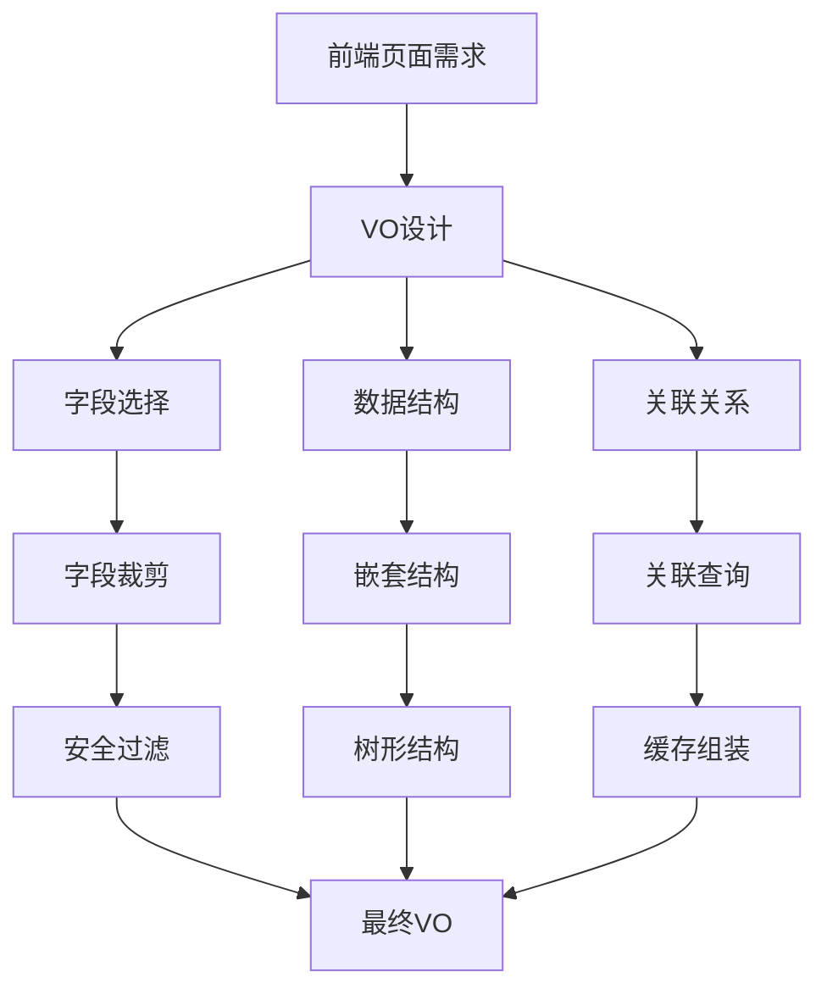
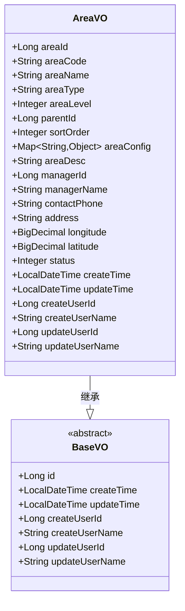
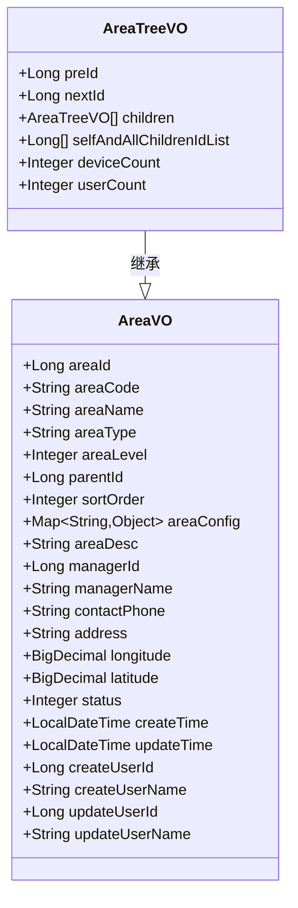
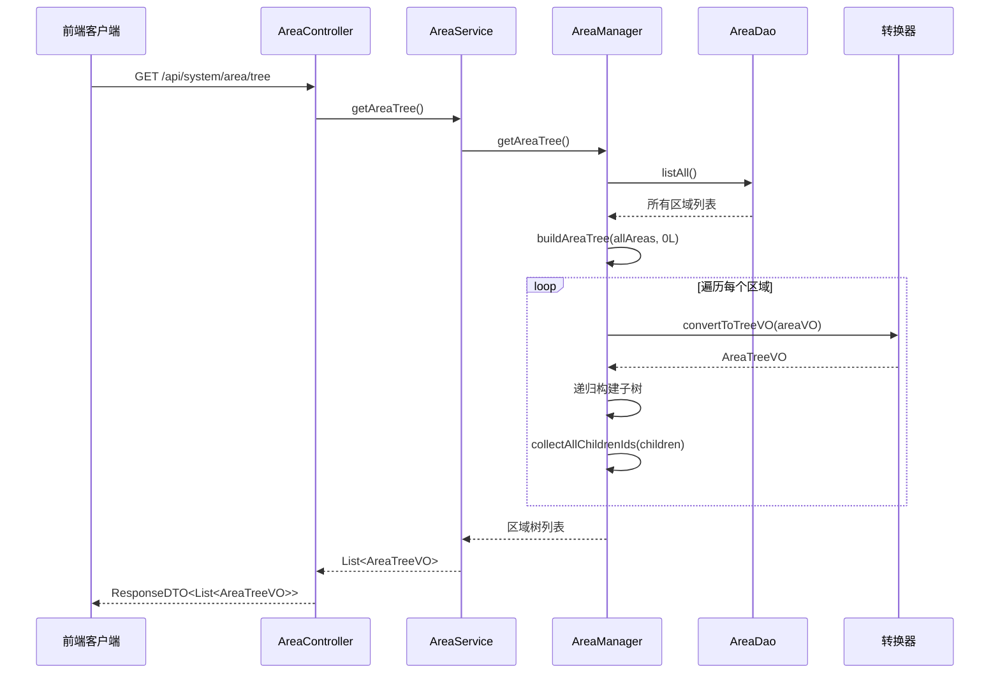
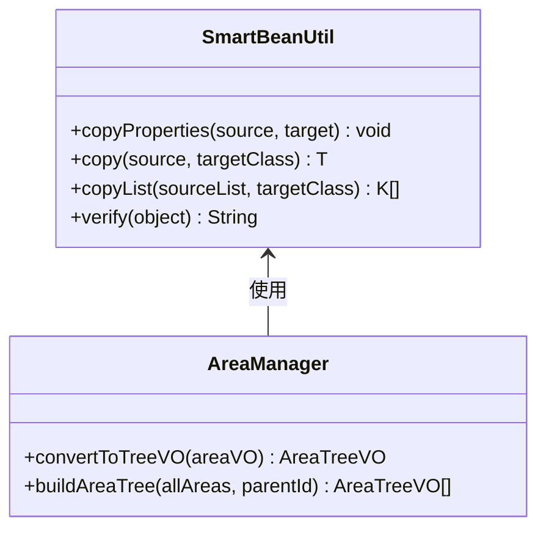
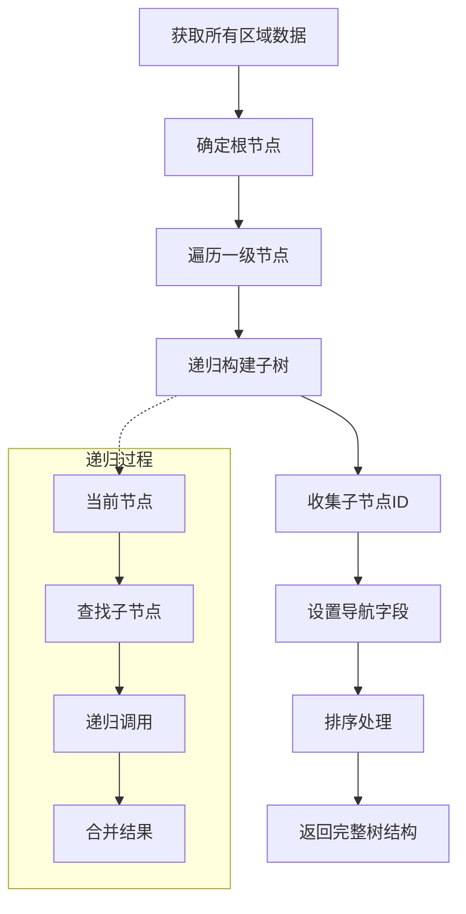

# 视图传输对象（VO）

<cite>
**本文档引用的文件**
- [AreaVO.java](file://smart-admin-api-java17-springboot3\sa-admin\src\main\java\net\lab1024\sa\admin\module\system\area\domain\vo\AreaVO.java)
- [AreaTreeVO.java](file://smart-admin-api-java17-springboot3\sa-admin\src\main\java\net\lab1024\sa\admin\module\system\area\domain\vo\AreaTreeVO.java)
- [AreaManager.java](file://smart-admin-api-java17-springboot3\sa-admin\src\main\java\net\lab1024\sa\admin\module\system\area\manager\AreaManager.java)
- [AreaController.java](file://smart-admin-api-java17-springboot3\sa-admin\src\main\java\net\lab1024\sa\admin\module\system\area\controller\AreaController.java)
- [SmartBeanUtil.java](file://smart-admin-api-java17-springboot3\sa-base\src\main\java\net\lab1024\sa\base\common\util\SmartBeanUtil.java)
- [DepartmentVO.java](file://smart-admin-api-java17-springboot3\sa-admin\src\main\java\net\lab1024\sa\admin\module\system\department\domain\vo\DepartmentVO.java)
- [MenuVO.java](file://smart-admin-api-java17-springboot3\sa-admin\src\main\java\net\lab1024\sa\admin\module\system\menu\domain\vo\MenuVO.java)
- [DepartmentTreeVO.java](file://smart-admin-api-java17-springboot3\sa-admin\src\main\java\net\lab1024\sa\admin\module\system\department\domain\vo\DepartmentTreeVO.java)
- [area-api.js](file://smart-admin-web-javascript\src\api\system\area-api.js)
</cite>

## 目录
1. [概述](#概述)
2. [VO设计原则](#vo设计原则)
3. [AreaVO详细分析](#areavos详细分析)
4. [AreaTreeVO深度解析](#areatreivos深度解析)
5. [VO转换机制](#vo转换机制)
6. [复杂树形结构处理](#复杂树形结构处理)
7. [最佳实践](#最佳实践)
8. [总结](#总结)

## 概述

视图对象（View Object，简称VO）是SmartAdmin系统中Controller层的重要组成部分，专门用于封装返回给前端的展示数据。VO的设计遵循"按需裁剪"的原则，只暴露前端真正需要的数据字段，避免暴露Entity中的敏感信息或无关字段。

在SmartAdmin系统中，VO主要承担以下职责：
- **数据封装**：将复杂的业务数据封装为适合前端展示的结构
- **字段裁剪**：根据前端需求选择性暴露字段，保护敏感信息
- **关联数据整合**：在Service或Manager层通过关联查询或缓存组装关联数据
- **格式标准化**：统一输出格式，便于前端处理

## VO设计原则

### 1. 前端驱动设计

VO的设计完全以前端页面需求为导向，遵循"前端需要什么，就提供什么"的原则：



**图表来源**
- [AreaVO.java](file://smart-admin-api-java17-springboot3\sa-admin\src\main\java\net\lab1024\sa\admin\module\system\area\domain\vo\AreaVO.java#L9-L84)
- [AreaTreeVO.java](file://smart-admin-api-java17-springboot3\sa-admin\src\main\java\net\lab1024\sa\admin\module\system\area\domain\vo\AreaTreeVO.java#L8-L36)

### 2. 安全性原则

VO严格遵循最小权限原则，避免暴露敏感信息：

| 字段类别 | AreaVO字段 | 安全考虑 |
|---------|-----------|----------|
| 敏感字段 | 密码、加密盐值 | 不包含在VO中 |
| 时间戳 | 创建时间、更新时间 | 只暴露必要的时间信息 |
| 用户ID | 创建人ID、更新人ID | 可选择性暴露用户名 |
| 内部字段 | 版本号、删除标记 | 对前端透明 |

### 3. 性能优化原则

VO设计充分考虑性能因素，通过合理的数据结构设计提升系统性能：

- **延迟加载**：关联数据采用延迟加载策略
- **批量查询**：通过一次查询获取多个关联数据
- **缓存利用**：充分利用Redis等缓存机制
- **分页友好**：支持前端分页展示

**章节来源**
- [AreaVO.java](file://smart-admin-api-java17-springboot3\sa-admin\src\main\java\net\lab1024\sa\admin\module\system\area\domain\vo\AreaVO.java#L1-L86)
- [AreaTreeVO.java](file://smart-admin-api-java17-springboot3\sa-admin\src\main\java\net\lab1024\sa\admin\module\system\area\domain\vo\AreaTreeVO.java#L1-L38)

## AreaVO详细分析

### 基础VO结构

AreaVO是区域管理模块的基础视图对象，继承了区域的核心业务字段：



**图表来源**
- [AreaVO.java](file://smart-admin-api-java17-springboot3\sa-admin\src\main\java\net\lab1024\sa\admin\module\system\area\domain\vo\AreaVO.java#L15-L84)

### 字段设计分析

#### 核心业务字段
AreaVO包含了区域管理的所有核心业务字段，这些字段直接来源于数据库表`t_area`：

- **标识字段**：`areaId`、`areaCode` - 区域唯一标识
- **基本信息**：`areaName`、`areaType`、`areaLevel` - 区域基本属性
- **层级关系**：`parentId`、`sortOrder` - 树形结构支撑
- **配置信息**：`areaConfig` - JSON格式的扩展配置
- **联系信息**：`managerId`、`managerName`、`contactPhone` - 负责人信息
- **地理位置**：`address`、`longitude`、`latitude` - 地理坐标

#### 时间管理字段
VO中包含了完整的时间管理字段，体现了SmartAdmin系统对审计跟踪的重视：

- **创建信息**：`createTime`、`createUserId`、`createUserName`
- **更新信息**：`updateTime`、`updateUserId`、`updateUserName`

这种设计确保了数据变更的可追溯性，同时避免了在前端显示过多的技术细节。

**章节来源**
- [AreaVO.java](file://smart-admin-api-java17-springboot3\sa-admin\src\main\java\net\lab1024\sa\admin\module\system\area\domain\vo\AreaVO.java#L18-L84)

## AreaTreeVO深度解析

### 继承与扩展

AreaTreeVO继承自AreaVO，并在其基础上扩展了树形结构相关的字段：



**图表来源**
- [AreaVO.java](file://smart-admin-api-java17-springboot3\sa-admin\src\main\java\net\lab1024\sa\admin\module\system\area\domain\vo\AreaVO.java#L15-L84)
- [AreaTreeVO.java](file://smart-admin-api-java17-springboot3\sa-admin\src\main\java\net\lab1024\sa\admin\module\system\area\domain\vo\AreaTreeVO.java#L15-L36)

### 树形结构增强字段

#### 同级导航字段
- **`preId`**：同级上一个元素ID，用于树形结构的前后导航
- **`nextId`**：同级下一个元素ID，提供完整的导航体验

#### 递归子节点
- **`children`**：子区域列表，支持无限层级的树形结构
- **`selfAndAllChildrenIdList`**：自己和所有递归子区域的ID集合，用于批量操作和权限计算

#### 关联统计数据
- **`deviceCount`**：设备数量，通过关联查询获取
- **`userCount`**：人员数量，体现区域的活跃度

### 树形结构构建流程



**图表来源**
- [AreaController.java](file://smart-admin-api-java17-springboot3\sa-admin\src\main\java\net\lab1024\sa\admin\module\system\area\controller\AreaController.java#L44-L49)
- [AreaManager.java](file://smart-admin-api-java17-springboot3\sa-admin\src\main\java\net\lab1024\sa\admin\module\system\area\manager\AreaManager.java#L48-L77)

**章节来源**
- [AreaTreeVO.java](file://smart-admin-api-java17-springboot3\sa-admin\src\main\java\net\lab1024\sa\admin\module\system\area\domain\vo\AreaTreeVO.java#L15-L36)
- [AreaManager.java](file://smart-admin-api-java17-springboot3\sa-admin\src\main\java\net\lab1024\sa\admin\module\system\area\manager\AreaManager.java#L48-L77)

## VO转换机制

### SmartBeanUtil工具类

SmartAdmin系统提供了强大的VO转换工具类SmartBeanUtil，简化了Entity到VO的转换过程：



**图表来源**
- [SmartBeanUtil.java](file://smart-admin-api-java17-springboot3\sa-base\src\main\java\net\lab1024\sa\base\common\util\SmartBeanUtil.java#L22-L95)
- [AreaManager.java](file://smart-admin-api-java17-springboot3\sa-admin\src\main\java\net\lab1024\sa\admin\module\system\area\manager\AreaManager.java#L80-L111)

### 转换策略对比

#### 手动转换 vs 自动转换

**手动转换（推荐）**：
```java
// AreaManager中的实现
private AreaTreeVO convertToTreeVO(AreaVO areaVO) {
    AreaTreeVO treeVO = new AreaTreeVO();
    treeVO.setAreaId(areaVO.getAreaId());
    treeVO.setAreaCode(areaVO.getAreaCode());
    treeVO.setAreaName(areaVO.getAreaName());
    // ... 其他字段赋值
    return treeVO;
}
```

**自动转换（使用SmartBeanUtil）**：
```java
// 简化的转换方式
AreaTreeVO treeVO = SmartBeanUtil.copy(areaVO, AreaTreeVO.class);
```

### 转换最佳实践

#### 1. 字段映射规则
- **同名字段**：自动映射，无需额外处理
- **类型兼容**：支持基本类型和包装类型的自动转换
- **复杂对象**：需要特殊处理的字段单独赋值

#### 2. 性能考虑
- **批量转换**：使用`copyList`方法处理大量数据
- **懒加载**：关联数据采用延迟加载策略
- **缓存利用**：重复使用的转换结果进行缓存

**章节来源**
- [SmartBeanUtil.java](file://smart-admin-api-java17-springboot3\sa-base\src\main\java\net\lab1024\sa\base\common\util\SmartBeanUtil.java#L35-L74)
- [AreaManager.java](file://smart-admin-api-java17-springboot3\sa-admin\src\main\java\net\lab1024\sa\admin\module\system\area\manager\AreaManager.java#L86-L110)

## 复杂树形结构处理

### 递归组装策略

SmartAdmin系统在处理复杂树形结构时采用了成熟的递归组装策略：



**图表来源**
- [AreaManager.java](file://smart-admin-api-java17-springboot3\sa-admin\src\main\java\net\lab1024\sa\admin\module\system\area\manager\AreaManager.java#L60-L77)

### 关联数据整合

#### 1. 设备数量统计
通过关联查询获取每个区域的设备数量：

```sql
SELECT area_id, COUNT(*) as device_count
FROM t_area_device 
WHERE status = 1 AND deleted_flag = 0
GROUP BY area_id
```

#### 2. 人员数量统计
统计每个区域的人员数量：

```sql
SELECT area_id, COUNT(*) as user_count
FROM t_area_user 
WHERE status = 1 AND deleted_flag = 0
GROUP BY area_id
```

#### 3. 缓存策略
为了提升性能，系统采用多级缓存策略：
- **内存缓存**：热点数据存储在JVM内存中
- **Redis缓存**：分布式环境下的数据共享
- **数据库缓存**：MyBatis二级缓存优化查询

### 导航字段计算

#### 同级导航算法
```java
// 计算同级导航字段的伪代码
List<AreaTreeVO> sortedAreas = areas.stream()
    .filter(a -> a.getParentId().equals(parentId))
    .sorted(Comparator.comparing(AreaTreeVO::getSortOrder))
    .collect(Collectors.toList());

for (int i = 0; i < sortedAreas.size(); i++) {
    AreaTreeVO current = sortedAreas.get(i);
    current.setPreId(i > 0 ? sortedAreas.get(i-1).getAreaId() : null);
    current.setNextId(i < sortedAreas.size()-1 ? sortedAreas.get(i+1).getAreaId() : null);
}
```

**章节来源**
- [AreaManager.java](file://smart-admin-api-java17-springboot3\sa-admin\src\main\java\net\lab1024\sa\admin\module\system\area\manager\AreaManager.java#L60-L77)
- [AreaManager.java](file://smart-admin-api-java17-springboot3\sa-admin\src\main\java\net\lab1024\sa\admin\module\system\area\manager\AreaManager.java#L113-L127)

## 最佳实践

### 1. VO设计规范

#### 字段命名规范
- **语义明确**：字段名称必须清晰表达其含义
- **统一风格**：采用驼峰命名法
- **避免歧义**：避免使用缩写和模糊术语

#### 注解使用规范
```java
@Schema(description = "区域ID")
private Long areaId;

@Schema(description = "区域名称")
private String areaName;
```

### 2. 性能优化策略

#### 分页处理
对于大数据量的查询，必须采用分页策略：

```java
// 分页查询示例
public PageResult<AreaVO> queryPage(AreaQueryForm queryForm) {
    Page<?> page = new Page<>(queryForm.getPageNum(), queryForm.getPageSize());
    List<AreaVO> list = areaDao.queryPage(page, queryForm);
    return SmartPageUtil.convert2PageResult(page, list);
}
```

#### 缓存策略
- **读写分离**：查询操作优先使用缓存
- **失效策略**：采用适当的缓存失效机制
- **容量控制**：合理设置缓存容量和过期时间

### 3. 错误处理机制

#### 空值处理
```java
// 安全的字段访问
public String getManagerName() {
    return Optional.ofNullable(managerName)
        .orElse("未知负责人");
}
```

#### 异常捕获
```java
try {
    // 转换逻辑
    return SmartBeanUtil.copy(source, targetClass);
} catch (Exception e) {
    log.error("VO转换失败: {}", e.getMessage(), e);
    throw new BusinessException("数据转换异常");
}
```

### 4. 前后端协作

#### API设计原则
- **一致性**：保持API接口的一致性
- **版本化**：支持API版本管理
- **文档化**：完善的API文档

#### 数据格式约定
- **时间格式**：统一使用ISO-8601格式
- **数字精度**：明确指定小数位数
- **字符串长度**：设定合理的长度限制

**章节来源**
- [AreaController.java](file://smart-admin-api-java17-springboot3\sa-admin\src\main\java\net\lab1024\sa\admin\module\system\area\controller\AreaController.java#L36-L92)
- [area-api.js](file://smart-admin-web-javascript\src\api\system\area-api.js#L8-L60)

## 总结

SmartAdmin系统的VO设计体现了现代Web应用的最佳实践，通过AreaVO和AreaTreeVO的实现，展示了VO在以下方面的优势：

### 核心价值
1. **安全性**：通过字段裁剪保护敏感信息
2. **灵活性**：支持复杂的数据结构和关联关系
3. **性能**：通过合理的缓存和优化策略提升系统性能
4. **可维护性**：清晰的职责分离和标准化的设计模式

### 设计亮点
- **继承体系**：通过继承实现字段复用和扩展
- **智能转换**：SmartBeanUtil提供便捷的转换工具
- **树形处理**：成熟的递归算法处理复杂树形结构
- **关联整合**：在Service层完成关联数据的组装

### 应用场景
VO模式特别适用于：
- **树形数据展示**：如组织架构、菜单结构、区域管理
- **复杂报表生成**：需要整合多个关联表的数据
- **API接口设计**：为不同前端需求提供定制化数据
- **数据脱敏**：保护敏感信息不暴露给前端

通过AreaVO和AreaTreeVO的实现，SmartAdmin系统为开发者提供了一个完整的VO设计参考，展示了如何在实际项目中应用VO模式来构建高质量的Web应用程序。