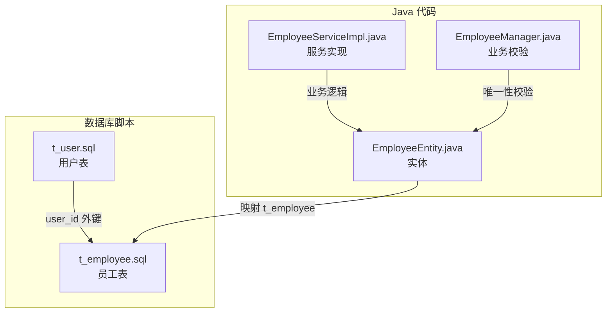
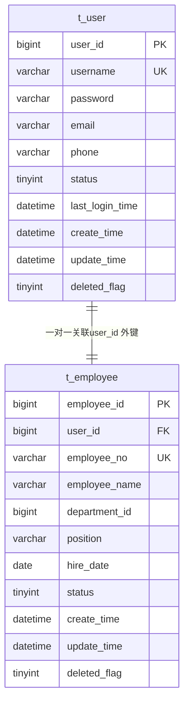
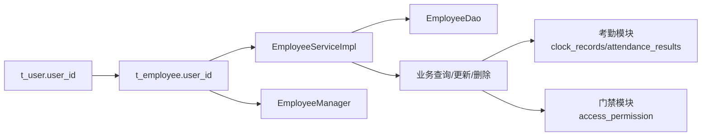

# 员工表(t_employee)设计

<cite>
**本文引用的文件**
- [t_employee.sql](file://database-scripts/common-service/18-t_employee.sql)
- [t_user.sql](file://database-scripts/common-service/02-t_user.sql)
- [EmployeeEntity.java](file://microservices/microservices-common/src/main/java/net/lab1024/sa/common/system/employee/domain/entity/EmployeeEntity.java)
- [EmployeeServiceImpl.java](file://microservices/microservices-common/src/main/java/net/lab1024/sa/common/system/employee/service/impl/EmployeeServiceImpl.java)
- [EmployeeManager.java](file://microservices/microservices-common/src/main/java/net/lab1024/sa/common/system/employee/manager/EmployeeManager.java)
- [考勤系统数据库ER图设计.md](file://documentation/03-业务模块/考勤/考勤系统数据库ER图设计.md)
- [smart-access.md](file://documentation/technical/smart-access.md)
- [EMPLOYEE_VS_USER_COMPARISON.md](file://documentation/archive/reports-2025-12-04/EMPLOYEE_VS_USER_COMPARISON.md)
</cite>

## 目录
1. [引言](#引言)
2. [项目结构](#项目结构)
3. [核心组件](#核心组件)
4. [架构总览](#架构总览)
5. [详细组件分析](#详细组件分析)
6. [依赖关系分析](#依赖关系分析)
7. [性能考虑](#性能考虑)
8. [故障排查指南](#故障排查指南)
9. [结论](#结论)
10. [附录](#附录)

## 引言
本文件围绕员工表 t_employee 的结构设计进行系统化说明，重点阐述：
- 字段定义与业务含义（employee_id、user_id、employee_no、name、department_id、position、hire_date、status 等）
- user_id 外键与 t_user 表的关联设计，实现系统用户与企业员工的身份统一
- employee_no 作为工号的唯一性约束及其在业务中的作用
- t_employee 如何存储与 t_user 分离的员工特有信息
- 提供建表 SQL 及增删改查操作指引
- 在考勤、门禁等业务场景中的应用

## 项目结构
t_employee 与 t_user 是系统身份与组织档案的两个核心表，分别位于公共服务模块的数据库脚本目录中。同时，Java 层面通过实体类与服务实现体现其结构与业务行为。

图表来源
- [t_user.sql](file://database-scripts/common-service/02-t_user.sql#L1-L41)
- [t_employee.sql](file://database-scripts/common-service/18-t_employee.sql#L1-L69)
- [EmployeeEntity.java](file://microservices/microservices-common/src/main/java/net/lab1024/sa/common/system/employee/domain/entity/EmployeeEntity.java#L1-L234)
- [EmployeeServiceImpl.java](file://microservices/microservices-common/src/main/java/net/lab1024/sa/common/system/employee/service/impl/EmployeeServiceImpl.java#L1-L438)
- [EmployeeManager.java](file://microservices/microservices-common/src/main/java/net/lab1024/sa/common/system/employee/manager/EmployeeManager.java#L112-L434)

章节来源
- [t_employee.sql](file://database-scripts/common-service/18-t_employee.sql#L1-L69)
- [t_user.sql](file://database-scripts/common-service/02-t_user.sql#L1-L41)
- [EmployeeEntity.java](file://microservices/microservices-common/src/main/java/net/lab1024/sa/common/system/employee/domain/entity/EmployeeEntity.java#L1-L234)
- [EmployeeServiceImpl.java](file://microservices/microservices-common/src/main/java/net/lab1024/sa/common/system/employee/service/impl/EmployeeServiceImpl.java#L1-L438)
- [EmployeeManager.java](file://microservices/microservices-common/src/main/java/net/lab1024/sa/common/system/employee/manager/EmployeeManager.java#L112-L434)

## 核心组件
- 数据库表 t_employee：承载企业员工档案，提供与 t_user 的一对一关联，确保系统用户与组织档案的统一身份。
- Java 实体 EmployeeEntity：映射 t_employee 的字段，包含员工基本信息、组织关系、状态与扩展信息。
- 服务实现 EmployeeServiceImpl：封装员工的增删改查、分页查询、状态变更等业务逻辑，并进行唯一性校验。
- 业务校验 EmployeeManager：提供工号、手机号、邮箱、身份证号等唯一性校验，以及按部门、按工号、按手机号等查询能力。

章节来源
- [t_employee.sql](file://database-scripts/common-service/18-t_employee.sql#L1-L69)
- [EmployeeEntity.java](file://microservices/microservices-common/src/main/java/net/lab1024/sa/common/system/employee/domain/entity/EmployeeEntity.java#L1-L234)
- [EmployeeServiceImpl.java](file://microservices/microservices-common/src/main/java/net/lab1024/sa/common/system/employee/service/impl/EmployeeServiceImpl.java#L1-L438)
- [EmployeeManager.java](file://microservices/microservices-common/src/main/java/net/lab1024/sa/common/system/employee/manager/EmployeeManager.java#L112-L434)

## 架构总览
t_employee 与 t_user 的关系体现了“身份（用户）+ 组织档案（员工）”的双层模型：
- t_user：系统登录与权限控制的基础，包含登录凭据与账户状态
- t_employee：员工组织档案，包含部门、岗位、入职日期、状态等组织属性
- user_id 外键将两者关联，形成一对一关系，保证系统用户与员工档案一一对应

图表来源
- [t_user.sql](file://database-scripts/common-service/02-t_user.sql#L1-L41)
- [t_employee.sql](file://database-scripts/common-service/18-t_employee.sql#L1-L69)
- [EMPLOYEE_VS_USER_COMPARISON.md](file://documentation/archive/reports-2025-12-04/EMPLOYEE_VS_USER_COMPARISON.md#L1-L216)

章节来源
- [t_user.sql](file://database-scripts/common-service/02-t_user.sql#L1-L41)
- [t_employee.sql](file://database-scripts/common-service/18-t_employee.sql#L1-L69)
- [EMPLOYEE_VS_USER_COMPARISON.md](file://documentation/archive/reports-2025-12-04/EMPLOYEE_VS_USER_COMPARISON.md#L1-L216)

## 详细组件分析

### 字段定义与业务含义
- 主键与标识
  - employee_id：员工记录主键，自增
  - user_id：关联 t_user.user_id，建立与系统用户的关联
  - employee_no：员工工号，唯一约束，作为组织内唯一标识
- 基本信息
  - employee_name：员工姓名
  - gender、birth_date、id_card_no：性别、出生日期、身份证号
  - phone、email：联系方式
- 组织关系
  - department_id：部门 ID
  - department_name：部门名称（冗余字段，便于查询）
  - position：职位/岗位
  - job_level：职级
  - supervisor_id、supervisor_name：直属上级 ID 与姓名（冗余字段）
- 人事信息
  - hire_date、regular_date、resign_date：入职、转正、离职日期
  - status：员工状态（1-在职 2-离职 3-休假 4-停职）
  - employee_type：员工类型（1-正式 2-实习 3-外包 4-兼职）
  - work_location、work_phone、emergency_*、home_address：工作地点、工作电话、紧急联系人与地址、家庭住址
- 其他
  - education、graduate_school、major、work_experience、skills：教育背景、毕业院校、专业、工作经验、技能标签
  - contract_*、social_security_no、housing_fund_no、bank_card_no、bank_name：合同信息、社保公积金账号、银行卡信息
  - avatar、remark、extended_fields：头像、备注、扩展字段（JSON）
  - create_time、update_time、create_user_id、update_user_id、deleted_flag：通用审计字段与软删除标记

章节来源
- [t_employee.sql](file://database-scripts/common-service/18-t_employee.sql#L1-L69)
- [EmployeeEntity.java](file://microservices/microservices-common/src/main/java/net/lab1024/sa/common/system/employee/domain/entity/EmployeeEntity.java#L1-L234)

### 关联设计：user_id 与 t_user 的一对一
- 外键约束：t_employee.user_id 引用 t_user.user_id
- 删除策略：ON DELETE SET NULL，即当 t_user 记录被删除时，t_employee.user_id 置空，保留员工档案但解除身份关联
- 业务意义：系统登录与组织档案分离，先创建用户再创建员工，或先创建员工再绑定用户均可实现

章节来源
- [t_employee.sql](file://database-scripts/common-service/18-t_employee.sql#L1-L69)
- [t_user.sql](file://database-scripts/common-service/02-t_user.sql#L1-L41)
- [EMPLOYEE_VS_USER_COMPARISON.md](file://documentation/archive/reports-2025-12-04/EMPLOYEE_VS_USER_COMPARISON.md#L1-L216)

### 唯一性约束：employee_no 工号
- 唯一索引：uk_employee_no，确保组织内工号唯一
- 业务价值：作为员工在组织内的唯一标识，便于跨系统对接、考勤与门禁识别
- 与 user_id 的唯一性：uk_user_id，保证每个系统用户仅对应一个员工档案（一对一）

章节来源
- [t_employee.sql](file://database-scripts/common-service/18-t_employee.sql#L1-L69)

### 与 t_user 的分离：员工特有信息
- t_user：登录凭据、账户状态、最近登录信息等
- t_employee：部门、岗位、入职日期、状态、合同与财务信息等
- 通过 user_id 关联，既保证身份统一，又实现“身份”与“组织档案”的职责分离

章节来源
- [t_user.sql](file://database-scripts/common-service/02-t_user.sql#L1-L41)
- [EMPLOYEE_VS_USER_COMPARISON.md](file://documentation/archive/reports-2025-12-04/EMPLOYEE_VS_USER_COMPARISON.md#L1-L216)

### 增删改查操作指引
- 新增员工
  - 校验 employee_no、phone、email、id_card_no 唯一性
  - 设置默认状态（如在职）
  - 插入 t_employee
- 更新员工
  - 校验目标记录存在且未删除
  - 更新前再次校验 employee_no、phone、email、id_card_no 的唯一性（排除自身）
  - 更新 t_employee
- 删除员工
  - 采用软删除（deleted_flag=1），保留历史数据
- 查询
  - 支持按姓名、工号、部门、岗位、状态、性别、手机号、邮箱、员工类型等条件分页查询
  - 支持按部门 ID 查询、按工号/手机号/邮箱查询

章节来源
- [EmployeeServiceImpl.java](file://microservices/microservices-common/src/main/java/net/lab1024/sa/common/system/employee/service/impl/EmployeeServiceImpl.java#L1-L438)
- [EmployeeManager.java](file://microservices/microservices-common/src/main/java/net/lab1024/sa/common/system/employee/manager/EmployeeManager.java#L112-L434)

### 在考勤、门禁等业务场景中的应用
- 考勤系统
  - 考勤记录、结果、汇总、预警均通过 employee_id 关联员工
  - 员工工号（employee_no）作为组织内唯一标识，便于与考勤设备、排班、班次等模块交互
- 门禁系统
  - 人员权限与区域访问控制通常以 person_id（员工）为维度
  - 门禁权限实体中包含 person_id、person_name、person_type 等，其中 person_type 包含 employee，体现员工作为人员类型之一参与门禁授权

章节来源
- [考勤系统数据库ER图设计.md](file://documentation/03-业务模块/考勤/考勤系统数据库ER图设计.md#L470-L797)
- [smart-access.md](file://documentation/technical/smart-access.md#L467-L627)

## 依赖关系分析
- 数据库层面
  - t_employee.user_id 外键依赖 t_user.user_id
  - t_employee.employee_no 唯一索引依赖
  - t_employee.user_id 唯一索引依赖
- 代码层面
  - EmployeeEntity 映射 t_employee
  - EmployeeServiceImpl 调用 EmployeeDao 进行持久化操作，并委托 EmployeeManager 进行唯一性校验
  - 考勤与门禁模块通过 employee_id 或 person_id 间接依赖 t_employee

图表来源
- [t_user.sql](file://database-scripts/common-service/02-t_user.sql#L1-L41)
- [t_employee.sql](file://database-scripts/common-service/18-t_employee.sql#L1-L69)
- [EmployeeServiceImpl.java](file://microservices/microservices-common/src/main/java/net/lab1024/sa/common/system/employee/service/impl/EmployeeServiceImpl.java#L1-L438)
- [EmployeeManager.java](file://microservices/microservices-common/src/main/java/net/lab1024/sa/common/system/employee/manager/EmployeeManager.java#L112-L434)
- [考勤系统数据库ER图设计.md](file://documentation/03-业务模块/考勤/考勤系统数据库ER图设计.md#L470-L797)
- [smart-access.md](file://documentation/technical/smart-access.md#L467-L627)

章节来源
- [t_user.sql](file://database-scripts/common-service/02-t_user.sql#L1-L41)
- [t_employee.sql](file://database-scripts/common-service/18-t_employee.sql#L1-L69)
- [EmployeeServiceImpl.java](file://microservices/microservices-common/src/main/java/net/lab1024/sa/common/system/employee/service/impl/EmployeeServiceImpl.java#L1-L438)
- [EmployeeManager.java](file://microservices/microservices-common/src/main/java/net/lab1024/sa/common/system/employee/manager/EmployeeManager.java#L112-L434)
- [考勤系统数据库ER图设计.md](file://documentation/03-业务模块/考勤/考勤系统数据库ER图设计.md#L470-L797)
- [smart-access.md](file://documentation/technical/smart-access.md#L467-L627)

## 性能考虑
- 索引设计
  - 唯一索引：uk_employee_no（工号唯一）、uk_user_id（用户唯一）
  - 常用查询索引：idx_phone、idx_email、idx_id_card_no、idx_department_id、idx_supervisor_id、idx_status、idx_employee_type、idx_hire_date、idx_deleted_flag
- 唯一性校验
  - 新增/更新前进行唯一性校验，避免并发冲突导致的唯一约束异常
- 冗余字段
  - department_name、supervisor_name 等冗余字段提升查询效率，减少关联查询成本

章节来源
- [t_employee.sql](file://database-scripts/common-service/18-t_employee.sql#L1-L69)
- [EmployeeManager.java](file://microservices/microservices-common/src/main/java/net/lab1024/sa/common/system/employee/manager/EmployeeManager.java#L112-L434)

## 故障排查指南
- 唯一性冲突
  - 新增/更新时出现工号、手机号、邮箱、身份证号冲突，检查唯一性校验逻辑与现有数据
- 外键删除
  - 删除 t_user 时，若存在 user_id 关联的员工记录，外键策略会将 user_id 置空，需确认是否仍需保留员工档案
- 软删除
  - 删除员工采用软删除（deleted_flag=1），查询时需过滤 deleted_flag=0

章节来源
- [EmployeeServiceImpl.java](file://microservices/microservices-common/src/main/java/net/lab1024/sa/common/system/employee/service/impl/EmployeeServiceImpl.java#L1-L438)
- [t_employee.sql](file://database-scripts/common-service/18-t_employee.sql#L1-L69)

## 结论
t_employee 通过 user_id 与 t_user 建立一对一关联，实现了“系统用户身份”与“组织员工档案”的清晰分离。employee_no 的唯一性约束确保了组织内员工的唯一标识，配合完善的索引与唯一性校验，支撑考勤、门禁等业务模块对员工身份与权限的高效管理。整体设计兼顾了业务完整性、数据一致性和可扩展性。

## 附录

### 建表 SQL（路径参考）
- [t_employee.sql](file://database-scripts/common-service/18-t_employee.sql#L1-L69)
- [t_user.sql](file://database-scripts/common-service/02-t_user.sql#L1-L41)

### 增删改查操作指引（路径参考）
- 新增：[EmployeeServiceImpl.addEmployee](file://microservices/microservices-common/src/main/java/net/lab1024/sa/common/system/employee/service/impl/EmployeeServiceImpl.java#L135-L184)
- 更新：[EmployeeServiceImpl.updateEmployee](file://microservices/microservices-common/src/main/java/net/lab1024/sa/common/system/employee/service/impl/EmployeeServiceImpl.java#L186-L234)
- 删除：[EmployeeServiceImpl.deleteEmployee](file://microservices/microservices-common/src/main/java/net/lab1024/sa/common/system/employee/service/impl/EmployeeServiceImpl.java#L236-L265)
- 查询（分页/条件）：[EmployeeServiceImpl.queryEmployeePage](file://microservices/microservices-common/src/main/java/net/lab1024/sa/common/system/employee/service/impl/EmployeeServiceImpl.java#L52-L105)

### 业务场景应用（路径参考）
- 考勤：员工与考勤记录、结果、汇总、预警的关联
  - [考勤系统数据库ER图设计.md](file://documentation/03-业务模块/考勤/考勤系统数据库ER图设计.md#L470-L797)
- 门禁：人员权限与区域访问控制
  - [smart-access.md](file://documentation/technical/smart-access.md#L467-L627)