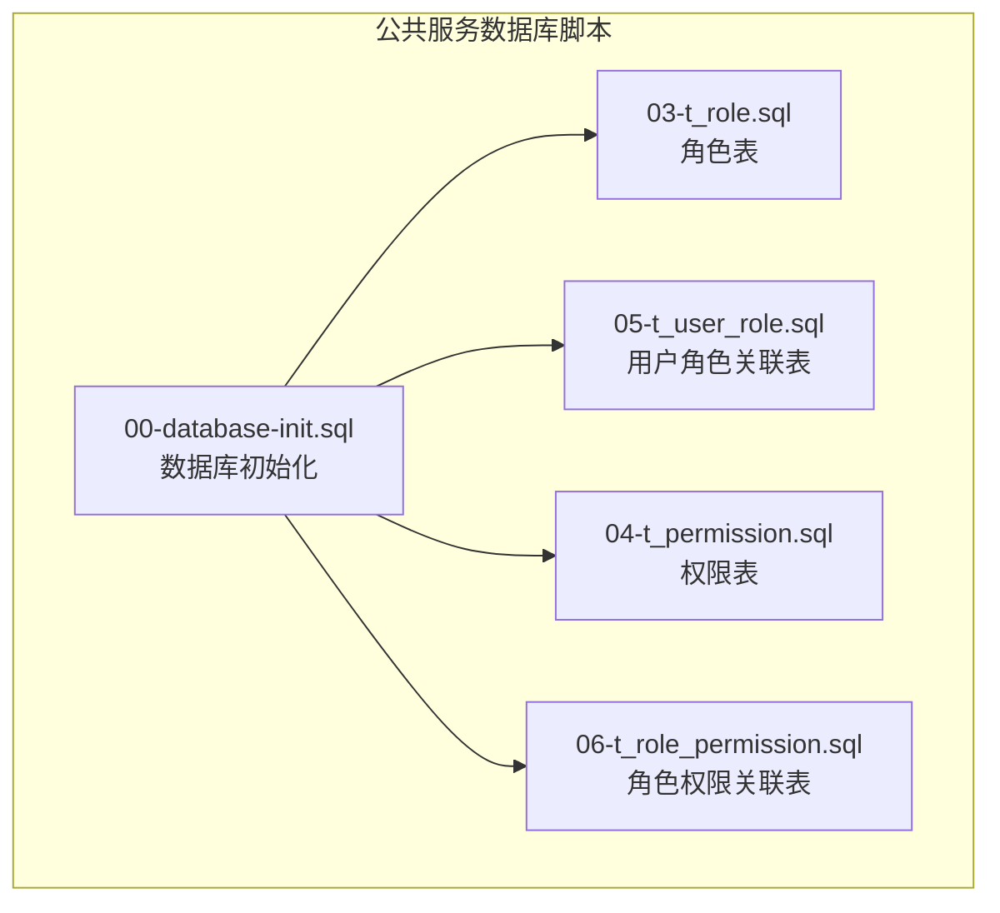
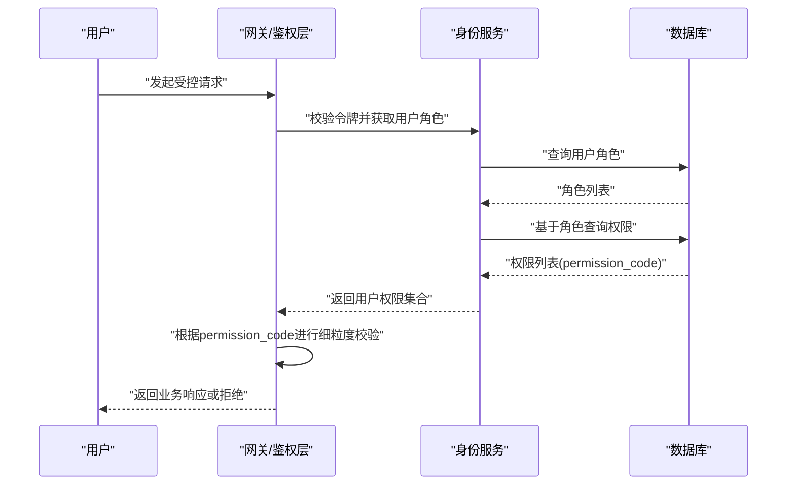
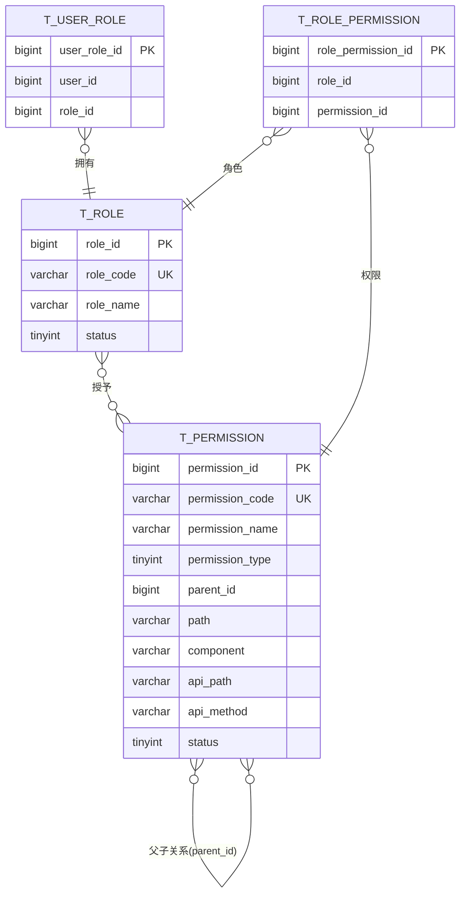

# 权限表(t_permission)设计

<cite>
**本文引用的文件**
- [t_permission.sql](file://database-scripts/common-service/04-t_permission.sql)
- [t_role.sql](file://database-scripts/common-service/03-t_role.sql)
- [t_user_role.sql](file://database-scripts/common-service/05-t_user_role.sql)
- [t_role_permission.sql](file://database-scripts/common-service/06-t_role_permission.sql)
- [权限命名规范.md](file://documentation/01-核心规范/权限命名规范.md)
- [smart-access.md](file://documentation/technical/smart-access.md)
- [smart-business-integration.md](file://documentation/technical/smart-business-integration.md)
- [PermissionController.java](file://restful_refactor_backup_20251202_014224/microservices_ioedream-identity-service_src_main_java_net_lab1024_sa_identity_module_rbac_controller_PermissionController.java)
</cite>

## 目录
1. [简介](#简介)
2. [项目结构](#项目结构)
3. [核心组件](#核心组件)
4. [架构总览](#架构总览)
5. [详细组件分析](#详细组件分析)
6. [依赖分析](#依赖分析)
7. [性能考虑](#性能考虑)
8. [故障排查指南](#故障排查指南)
9. [结论](#结论)
10. [附录](#附录)

## 简介
本文件围绕权限表 t_permission 的结构设计进行深入说明，重点解释：
- permission_code 作为细粒度权限控制标识的设计理念与使用方式
- 通过 parent_id 实现的树形菜单结构
- 与 t_role_permission 的关联关系，以及如何支撑基于角色的访问控制（RBAC）
- 提供完整的建表语句与索引策略
- 结合门禁管理、考勤查询等实际业务场景，展示权限数据的组织方式与落地实践

## 项目结构
权限相关的核心表位于公共服务模块的数据库脚本目录中，采用“身份模块（Identity）”的划分，包含角色、用户角色、权限与角色权限关联等表，形成标准的 RBAC 数据模型。

图表来源
- [00-database-init.sql](file://database-scripts/common-service/00-database-init.sql#L23-L31)
- [03-t_role.sql](file://database-scripts/common-service/03-t_role.sql#L1-L29)
- [05-t_user_role.sql](file://database-scripts/common-service/05-t_user_role.sql#L1-L20)
- [04-t_permission.sql](file://database-scripts/common-service/04-t_permission.sql#L1-L38)
- [06-t_role_permission.sql](file://database-scripts/common-service/06-t_role_permission.sql#L1-L19)

章节来源
- [00-database-init.sql](file://database-scripts/common-service/00-database-init.sql#L23-L31)

## 核心组件
- 权限表 t_permission：存储权限元数据，包含权限标识、类型、父子关系、路由与组件信息、状态与时间戳等字段，permission_code 作为全局唯一且用于细粒度权限控制。
- 角色表 t_role：角色定义与状态管理。
- 用户角色关联表 t_user_role：用户与角色的多对多关系。
- 角色权限关联表 t_role_permission：角色与权限的多对多关系，构成 RBAC 的核心桥接。

章节来源
- [t_permission.sql](file://database-scripts/common-service/04-t_permission.sql#L1-L38)
- [t_role.sql](file://database-scripts/common-service/03-t_role.sql#L1-L29)
- [t_user_role.sql](file://database-scripts/common-service/05-t_user_role.sql#L1-L20)
- [t_role_permission.sql](file://database-scripts/common-service/06-t_role_permission.sql#L1-L19)

## 架构总览
RBAC 权限控制的整体流程如下：
- 用户登录后，系统根据用户角色集合计算其拥有的权限集合（包含 permission_code）。
- 对于每次请求，系统依据 permission_code 进行细粒度校验，结合菜单树与按钮/接口权限，决定是否放行。
- 菜单树由 parent_id 构建，支持前端渲染与导航；接口权限通过 permission_code 与 API 路径、方法绑定。

图表来源
- [PermissionController.java](file://restful_refactor_backup_20251202_014224/microservices_ioedream-identity-service_src_main_java_net_lab1024_sa_identity_module_rbac_controller_PermissionController.java#L34-L92)
- [t_user_role.sql](file://database-scripts/common-service/05-t_user_role.sql#L1-L20)
- [t_role_permission.sql](file://database-scripts/common-service/06-t_role_permission.sql#L1-L19)

## 详细组件分析

### 权限表 t_permission 字段设计与语义
- 主键与标识
  - permission_id：权限主键，自增
  - permission_code：权限编码，全局唯一，作为细粒度权限控制的关键标识
- 权限类型与树形结构
  - permission_type：权限类型（菜单/按钮/接口/数据等），用于区分不同维度的权限
  - parent_id：父权限ID，默认0表示根节点，用于构建树形菜单结构
- 路由与界面
  - path、component：用于前端路由与组件映射
  - icon、sort_order、is_hidden：用于前端菜单渲染与排序
- API与接口
  - api_path、api_method：用于对接口权限的精确控制
- 状态与生命周期
  - status：启用/禁用
  - is_external、is_cache：外链与缓存策略
  - remark、create_time/update_time/create_user_id/update_user_id/deleted_flag：审计与版本追踪
- 索引策略
  - 主键：permission_id
  - 唯一键：uk_permission_code（保证 permission_code 唯一）
  - 辅助索引：idx_parent_id、idx_permission_type、idx_status、idx_deleted_flag

章节来源
- [t_permission.sql](file://database-scripts/common-service/04-t_permission.sql#L1-L38)

### 树形菜单结构与 parent_id
- parent_id 为 0 的记录作为根节点，形成树的顶层
- 子节点通过 parent_id 关联父节点，支持多级嵌套
- 前端通常使用递归或层级遍历渲染菜单树
- 该结构便于：
  - 菜单导航的层级化展示
  - 权限继承与聚合（子菜单/按钮/接口通常继承父级权限）

章节来源
- [t_permission.sql](file://database-scripts/common-service/04-t_permission.sql#L10-L20)

### permission_code 作为细粒度权限控制标识
- 设计理念
  - permission_code 是权限的最小可识别单元，具备全局唯一性
  - 前后端约定统一的命名规范，确保权限标识的一致性与可读性
- 命名规范
  - 标准格式：{domain}:{module}:{action}
  - 全部小写，使用冒号分隔，使用英文单词
  - 示例：system:area:add、system:area:query、business:goods:add、business:order:export
- 使用方式
  - 后端在接口上标注权限注解，值为 permission_code
  - 前端在组件上使用权限指令，值为 permission_code
  - 数据库中菜单配置的 api_perms/web_perms 也应与 permission_code 保持一致

章节来源
- [权限命名规范.md](file://documentation/01-核心规范/权限命名规范.md#L1-L357)

### RBAC 关系与 t_role_permission 关联
- 用户-角色：t_user_role（用户与角色多对多）
- 角色-权限：t_role_permission（角色与权限多对多）
- 权限来源
  - 用户通过角色间接获得权限
  - 可直接赋予用户权限（视业务需求），但推荐通过角色集中管理
- 控制流程
  - 用户登录后，系统查询其角色，再查询角色对应的权限，得到 permission_code 集合
  - 请求到达时，系统根据请求的目标资源与动作，匹配对应的 permission_code，决定是否放行

章节来源
- [t_user_role.sql](file://database-scripts/common-service/05-t_user_role.sql#L1-L20)
- [t_role_permission.sql](file://database-scripts/common-service/06-t_role_permission.sql#L1-L19)

### 完整建表语句与索引
以下为权限表 t_permission 的建表语句与索引策略（摘自脚本文件）：
- 主键：permission_id
- 唯一键：uk_permission_code(permission_code)
- 辅助索引：idx_parent_id(parent_id)、idx_permission_type(permission_type)、idx_status(status)、idx_deleted_flag(deleted_flag)

章节来源
- [t_permission.sql](file://database-scripts/common-service/04-t_permission.sql#L1-L38)

### 实际业务场景：门禁管理与考勤查询的权限组织
- 门禁管理
  - 门禁设备、通行记录、门禁授权等模块均通过菜单与权限进行控制
  - 权限命名遵循统一规范，如 system:access:device:view、system:access:record:export 等
  - 前端通过权限指令控制按钮显隐，后端通过注解进行接口级校验
- 考勤查询
  - 考勤记录、请假申请、报表导出等功能同样以 permission_code 进行细粒度控制
  - 角色配置中可按模块与菜单维度授予相应权限集合

章节来源
- [smart-access.md](file://documentation/technical/smart-access.md#L2484-L2569)
- [smart-business-integration.md](file://documentation/technical/smart-business-integration.md#L1447-L1529)
- [权限命名规范.md](file://documentation/01-核心规范/权限命名规范.md#L1-L357)

## 依赖分析
- 表间依赖
  - t_user_role 与 t_role：用户与角色的多对多
  - t_role_permission 与 t_role、t_permission：角色与权限的多对多
  - t_permission 与自身：通过 parent_id 形成树形结构
- 外部依赖
  - 前端：使用权限指令与 permission_code 控制 UI
  - 后端：使用权限注解与 permission_code 控制接口访问
  - 身份服务：提供权限查询与校验能力

图表来源
- [t_user_role.sql](file://database-scripts/common-service/05-t_user_role.sql#L1-L20)
- [t_role.sql](file://database-scripts/common-service/03-t_role.sql#L1-L29)
- [t_role_permission.sql](file://database-scripts/common-service/06-t_role_permission.sql#L1-L19)
- [t_permission.sql](file://database-scripts/common-service/04-t_permission.sql#L1-L38)

## 性能考虑
- 索引策略
  - uk_permission_code：保证 permission_code 唯一性，用于快速定位权限
  - idx_parent_id：树形查询与菜单渲染常用
  - idx_permission_type：按类型过滤权限
  - idx_status/idx_deleted_flag：快速筛选有效/未删除权限
- 查询优化
  - 用户权限查询：先查用户角色，再查角色权限，最后汇总 permission_code
  - 菜单树构建：按 parent_id 与 sort_order 排序，减少前端重组成本
- 缓存与降级
  - 将常用权限集合与菜单树进行缓存，降低数据库压力
  - 对热点接口增加限流与熔断保护

## 故障排查指南
- permission_code 冲突
  - 现象：插入失败或更新冲突
  - 排查：确认 uk_permission_code 是否重复，遵循命名规范
- 菜单树异常
  - 现象：前端菜单显示错乱或无限循环
  - 排查：检查 parent_id 是否指向有效节点，是否存在环路
- 权限校验失败
  - 现象：接口被拒绝
  - 排查：确认用户角色是否正确分配，角色是否授予对应权限，permission_code 是否与接口注解一致
- 前后端不一致
  - 现象：按钮可见但点击报错
  - 排查：核对前端权限指令与后端注解、数据库菜单配置是否一致

章节来源
- [t_permission.sql](file://database-scripts/common-service/04-t_permission.sql#L1-L38)
- [t_user_role.sql](file://database-scripts/common-service/05-t_user_role.sql#L1-L20)
- [t_role_permission.sql](file://database-scripts/common-service/06-t_role_permission.sql#L1-L19)
- [权限命名规范.md](file://documentation/01-核心规范/权限命名规范.md#L1-L357)

## 结论
t_permission 通过 permission_code 实现细粒度权限控制，配合 parent_id 构建树形菜单结构，与 t_role_permission 协同实现 RBAC。统一的命名规范与严格的表结构设计，确保了权限系统的可维护性与可扩展性。结合门禁管理与考勤查询等业务场景，权限数据能够清晰地组织与落地，满足企业级权限治理需求。

## 附录
- 命名规范要点
  - 格式：{domain}:{module}:{action}
  - 全小写、英文单词、冒号分隔
  - 示例：system:area:add、business:goods:query、support:dict:export
- 常用 action 词汇
  - 查询：query/list/detail/tree/page
  - 写入：add/create/save/insert
  - 更新：update/edit/modify
  - 删除：delete/batchDelete/remove
  - 其他：export/import/upload/download/enable/disable/audit/approve

章节来源
- [权限命名规范.md](file://documentation/01-核心规范/权限命名规范.md#L1-L357)