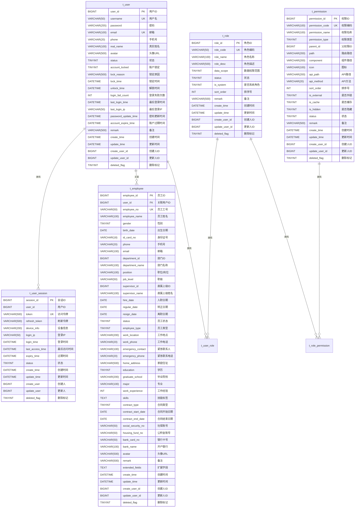

# 核心数据表设计

<cite>
**本文档引用的文件**  
- [02-t_user.sql](file://database-scripts/common-service/02-t_user.sql)
- [03-t_role.sql](file://database-scripts/common-service/03-t_role.sql)
- [04-t_permission.sql](file://database-scripts/common-service/04-t_permission.sql)
- [05-t_user_role.sql](file://database-scripts/common-service/05-t_user_role.sql)
- [06-t_role_permission.sql](file://database-scripts/common-service/06-t_role_permission.sql)
- [18-t_employee.sql](file://database-scripts/common-service/18-t_employee.sql)
- [t_user_session_table.sql](file://database-scripts/t_user_session_table.sql)
- [00-database-init.sql](file://database-scripts/common-service/00-database-init.sql)
</cite>

## 目录
1. [引言](#引言)
2. [核心数据表ER图](#核心数据表er图)
3. [用户表 (t_user)](#用户表-t_user)
4. [角色表 (t_role)](#角色表-t_role)
5. [权限表 (t_permission)](#权限表-t_permission)
6. [员工表 (t_employee)](#员工表-t_employee)
7. [用户角色关联表 (t_user_role)](#用户角色关联表-t_user_role)
8. [角色权限关联表 (t_role_permission)](#角色权限关联表-t_role_permission)
9. [用户会话表 (t_user_session)](#用户会话表-t_user_session)
10. [RBAC权限体系设计原理](#rbac权限体系设计原理)
11. [建表SQL脚本参考](#建表sql脚本参考)

## 引言
本文档详细设计了IOE-DREAM系统中的核心业务数据表，涵盖用户、角色、权限及员工等基础模块。通过实体关系图（ER图）和详细的字段定义，全面阐述了各表的结构、约束和设计原理。重点解释了`t_user`与`t_employee`的关联设计、`t_role`与`t_permission`的权限控制模型，以及多对多关系表的设计原则。这些表共同支撑了系统的RBAC（基于角色的访问控制）权限体系，为系统的安全性和可扩展性提供了坚实的基础。

## 核心数据表ER图


**图例说明**：
- `PK`：主键
- `FK`：外键
- `UK`：唯一键
- 实线箭头表示一对多关系

**Diagram sources**
- [02-t_user.sql](file://database-scripts/common-service/02-t_user.sql)
- [03-t_role.sql](file://database-scripts/common-service/03-t_role.sql)
- [04-t_permission.sql](file://database-scripts/common-service/04-t_permission.sql)
- [05-t_user_role.sql](file://database-scripts/common-service/05-t_user_role.sql)
- [06-t_role_permission.sql](file://database-scripts/common-service/06-t_role_permission.sql)
- [18-t_employee.sql](file://database-scripts/common-service/18-t_employee.sql)
- [t_user_session_table.sql](file://database-scripts/t_user_session_table.sql)

## 用户表 (t_user)
用户表`t_user`是系统用户账户管理的核心表，存储了所有用户的登录信息和账户状态。

### 字段定义
| 字段名 | 数据类型 | 约束 | 默认值 | 注释 |
| :--- | :--- | :--- | :--- | :--- |
| `user_id` | BIGINT | 主键, 自增 | - | 用户ID |
| `username` | VARCHAR(50) | 非空, 唯一 | - | 用户名（登录用） |
| `password` | VARCHAR(255) | 非空 | - | 密码（加密存储） |
| `email` | VARCHAR(100) | 非空, 唯一 | - | 邮箱 |
| `phone` | VARCHAR(20) | 可为空 | - | 手机号 |
| `real_name` | VARCHAR(100) | 可为空 | - | 真实姓名 |
| `avatar` | VARCHAR(500) | 可为空 | - | 头像URL |
| `status` | TINYINT | 非空 | 1 | 状态：1-正常 2-禁用 3-锁定 |
| `account_locked` | TINYINT | 非空 | 0 | 账户是否锁定：0-未锁定 1-已锁定 |
| `lock_reason` | VARCHAR(500) | 可为空 | - | 锁定原因 |
| `lock_time` | DATETIME | 可为空 | - | 锁定时间 |
| `unlock_time` | DATETIME | 可为空 | - | 解锁时间 |
| `login_fail_count` | INT | 非空 | 0 | 登录失败次数 |
| `last_login_time` | DATETIME | 可为空 | - | 最后登录时间 |
| `last_login_ip` | VARCHAR(50) | 可为空 | - | 最后登录IP |
| `password_update_time` | DATETIME | 可为空 | - | 密码更新时间 |
| `account_expire_time` | DATETIME | 可为空 | - | 账户过期时间 |
| `remark` | VARCHAR(500) | 可为空 | - | 备注 |
| `create_time` | DATETIME | 非空 | CURRENT_TIMESTAMP | 创建时间 |
| `update_time` | DATETIME | 非空 | CURRENT_TIMESTAMP ON UPDATE CURRENT_TIMESTAMP | 更新时间 |
| `create_user_id` | BIGINT | 可为空 | - | 创建人ID |
| `update_user_id` | BIGINT | 可为空 | - | 更新人ID |
| `deleted_flag` | TINYINT | 非空 | 0 | 删除标记：0-未删除 1-已删除 |

**Section sources**
- [02-t_user.sql](file://database-scripts/common-service/02-t_user.sql)

## 角色表 (t_role)
角色表`t_role`用于管理系统中的角色，每个角色代表一组权限的集合。

### 字段定义
| 字段名 | 数据类型 | 约束 | 默认值 | 注释 |
| :--- | :--- | :--- | :--- | :--- |
| `role_id` | BIGINT | 主键, 自增 | - | 角色ID |
| `role_code` | VARCHAR(50) | 非空, 唯一 | - | 角色编码 |
| `role_name` | VARCHAR(100) | 非空 | - | 角色名称 |
| `role_desc` | VARCHAR(500) | 可为空 | - | 角色描述 |
| `data_scope` | TINYINT | 非空 | 5 | 数据权限范围：1-全部 2-自定义 3-本部门 4-本部门及子部门 5-仅本人 |
| `status` | TINYINT | 非空 | 1 | 状态：1-启用 2-禁用 |
| `is_system` | TINYINT | 非空 | 0 | 是否系统角色：0-否 1-是 |
| `sort_order` | INT | 非空 | 0 | 排序号 |
| `remark` | VARCHAR(500) | 可为空 | - | 备注 |
| `create_time` | DATETIME | 非空 | CURRENT_TIMESTAMP | 创建时间 |
| `update_time` | DATETIME | 非空 | CURRENT_TIMESTAMP ON UPDATE CURRENT_TIMESTAMP | 更新时间 |
| `create_user_id` | BIGINT | 可为空 | - | 创建人ID |
| `update_user_id` | BIGINT | 可为空 | - | 更新人ID |
| `deleted_flag` | TINYINT | 非空 | 0 | 删除标记：0-未删除 1-已删除 |

**Section sources**
- [03-t_role.sql](file://database-scripts/common-service/03-t_role.sql)

## 权限表 (t_permission)
权限表`t_permission`用于管理系统中的权限，支持菜单、按钮、接口和数据等多种权限类型。

### 字段定义
| 字段名 | 数据类型 | 约束 | 默认值 | 注释 |
| :--- | :--- | :--- | :--- | :--- |
| `permission_id` | BIGINT | 主键, 自增 | - | 权限ID |
| `permission_code` | VARCHAR(100) | 非空, 唯一 | - | 权限编码 |
| `permission_name` | VARCHAR(100) | 非空 | - | 权限名称 |
| `permission_type` | TINYINT | 非空 | - | 权限类型：1-菜单 2-按钮 3-接口 4-数据 |
| `parent_id` | BIGINT | 非空 | 0 | 父权限ID |
| `path` | VARCHAR(200) | 可为空 | - | 路由路径 |
| `component` | VARCHAR(200) | 可为空 | - | 组件路径 |
| `icon` | VARCHAR(100) | 可为空 | - | 图标 |
| `api_path` | VARCHAR(200) | 可为空 | - | API路径 |
| `api_method` | VARCHAR(20) | 可为空 | - | API方法：GET/POST/PUT/DELETE |
| `sort_order` | INT | 非空 | 0 | 排序号 |
| `is_external` | TINYINT | 非空 | 0 | 是否外链：0-否 1-是 |
| `is_cache` | TINYINT | 非空 | 1 | 是否缓存：0-否 1-是 |
| `is_hidden` | TINYINT | 非空 | 0 | 是否隐藏：0-否 1-是 |
| `status` | TINYINT | 非空 | 1 | 状态：1-启用 2-禁用 |
| `remark` | VARCHAR(500) | 可为空 | - | 备注 |
| `create_time` | DATETIME | 非空 | CURRENT_TIMESTAMP | 创建时间 |
| `update_time` | DATETIME | 非空 | CURRENT_TIMESTAMP ON UPDATE CURRENT_TIMESTAMP | 更新时间 |
| `create_user_id` | BIGINT | 可为空 | - | 创建人ID |
| `update_user_id` | BIGINT | 可为空 | - | 更新人ID |
| `deleted_flag` | TINYINT | 非空 | 0 | 删除标记：0-未删除 1-已删除 |

**Section sources**
- [04-t_permission.sql](file://database-scripts/common-service/04-t_permission.sql)

## 员工表 (t_employee)
员工表`t_employee`用于管理企业员工的档案信息，与用户表通过外键关联。

### 字段定义
| 字段名 | 数据类型 | 约束 | 默认值 | 注释 |
| :--- | :--- | :--- | :--- | :--- |
| `employee_id` | BIGINT | 主键, 自增 | - | 员工ID |
| `user_id` | BIGINT | 可为空, 唯一, 外键 | - | 关联用户ID（外键关联t_user表） |
| `employee_no` | VARCHAR(50) | 非空, 唯一 | - | 员工工号（唯一） |
| `employee_name` | VARCHAR(100) | 非空 | - | 员工姓名 |
| `gender` | TINYINT | 可为空 | - | 性别：1-男 2-女 3-未知 |
| `birth_date` | DATE | 可为空 | - | 出生日期 |
| `id_card_no` | VARCHAR(18) | 可为空 | - | 身份证号 |
| `phone` | VARCHAR(20) | 非空 | - | 手机号 |
| `email` | VARCHAR(100) | 非空 | - | 邮箱 |
| `department_id` | BIGINT | 非空 | - | 部门ID |
| `department_name` | VARCHAR(100) | 可为空 | - | 部门名称（冗余字段） |
| `position` | VARCHAR(100) | 非空 | - | 职位/岗位 |
| `job_level` | VARCHAR(50) | 可为空 | - | 职级 |
| `supervisor_id` | BIGINT | 可为空 | - | 直属上级ID |
| `supervisor_name` | VARCHAR(100) | 可为空 | - | 直属上级姓名（冗余字段） |
| `hire_date` | DATE | 非空 | - | 入职日期 |
| `regular_date` | DATE | 可为空 | - | 转正日期 |
| `resign_date` | DATE | 可为空 | - | 离职日期 |
| `status` | TINYINT | 非空 | 1 | 员工状态：1-在职 2-离职 3-休假 4-停职 |
| `employee_type` | TINYINT | 非空 | 1 | 员工类型：1-正式 2-实习 3-外包 4-兼职 |
| `work_location` | VARCHAR(200) | 可为空 | - | 工作地点 |
| `work_phone` | VARCHAR(20) | 可为空 | - | 工作电话 |
| `emergency_contact` | VARCHAR(100) | 可为空 | - | 紧急联系人 |
| `emergency_phone` | VARCHAR(20) | 可为空 | - | 紧急联系电话 |
| `home_address` | VARCHAR(500) | 可为空 | - | 家庭住址 |
| `education` | TINYINT | 可为空 | - | 学历：1-高中 2-大专 3-本科 4-硕士 5-博士 |
| `graduate_school` | VARCHAR(200) | 可为空 | - | 毕业院校 |
| `major` | VARCHAR(100) | 可为空 | - | 专业 |
| `work_experience` | INT | 可为空 | - | 工作经验（年） |
| `skills` | TEXT | 可为空 | - | 技能标签（JSON格式） |
| `contract_type` | TINYINT | 可为空 | - | 合同类型：1-劳动合同 2-劳务合同 3-实习协议 |
| `contract_start_date` | DATE | 可为空 | - | 合同开始日期 |
| `contract_end_date` | DATE | 可为空 | - | 合同结束日期 |
| `social_security_no` | VARCHAR(50) | 可为空 | - | 社保账号 |
| `housing_fund_no` | VARCHAR(50) | 可为空 | - | 公积金账号 |
| `bank_card_no` | VARCHAR(50) | 可为空 | - | 银行卡号 |
| `bank_name` | VARCHAR(100) | 可为空 | - | 开户银行 |
| `avatar` | VARCHAR(500) | 可为空 | - | 头像URL |
| `remark` | VARCHAR(500) | 可为空 | - | 备注 |
| `extended_fields` | TEXT | 可为空 | - | 扩展字段（JSON格式） |
| `create_time` | DATETIME | 非空 | CURRENT_TIMESTAMP | 创建时间 |
| `update_time` | DATETIME | 非空 | CURRENT_TIMESTAMP ON UPDATE CURRENT_TIMESTAMP | 更新时间 |
| `create_user_id` | BIGINT | 可为空 | - | 创建人ID |
| `update_user_id` | BIGINT | 可为空 | - | 更新人ID |
| `deleted_flag` | TINYINT | 非空 | 0 | 删除标记：0-未删除 1-已删除 |

**Section sources**
- [18-t_employee.sql](file://database-scripts/common-service/18-t_employee.sql)

## 用户角色关联表 (t_user_role)
用户角色关联表`t_user_role`用于实现用户和角色的多对多关系。

### 字段定义
| 字段名 | 数据类型 | 约束 | 默认值 | 注释 |
| :--- | :--- | :--- | :--- | :--- |
| `user_role_id` | BIGINT | 主键, 自增 | - | 用户角色ID |
| `user_id` | BIGINT | 非空 | - | 用户ID |
| `role_id` | BIGINT | 非空 | - | 角色ID |
| `create_time` | DATETIME | 非空 | CURRENT_TIMESTAMP | 创建时间 |
| `create_user_id` | BIGINT | 可为空 | - | 创建人ID |

**Section sources**
- [05-t_user_role.sql](file://database-scripts/common-service/05-t_user_role.sql)

## 角色权限关联表 (t_role_permission)
角色权限关联表`t_role_permission`用于实现角色和权限的多对多关系。

### 字段定义
| 字段名 | 数据类型 | 约束 | 默认值 | 注释 |
| :--- | :--- | :--- | :--- | :--- |
| `role_permission_id` | BIGINT | 主键, 自增 | - | 角色权限ID |
| `role_id` | BIGINT | 非空 | - | 角色ID |
| `permission_id` | BIGINT | 非空 | - | 权限ID |
| `create_time` | DATETIME | 非空 | CURRENT_TIMESTAMP | 创建时间 |
| `create_user_id` | BIGINT | 可为空 | - | 创建人ID |

**Section sources**
- [06-t_role_permission.sql](file://database-scripts/common-service/06-t_role_permission.sql)

## 用户会话表 (t_user_session)
用户会话表`t_user_session`用于记录用户的登录会话信息，支持并发登录控制。

### 字段定义
| 字段名 | 数据类型 | 约束 | 默认值 | 注释 |
| :--- | :--- | :--- | :--- | :--- |
| `session_id` | BIGINT | 主键, 自增 | - | 会话ID（主键） |
| `user_id` | BIGINT | 非空 | - | 用户ID |
| `token` | VARCHAR(500) | 非空, 唯一 | - | 访问令牌 |
| `refresh_token` | VARCHAR(500) | 可为空 | - | 刷新令牌 |
| `device_info` | VARCHAR(200) | 可为空 | - | 设备信息 |
| `login_ip` | VARCHAR(50) | 可为空 | - | 登录IP |
| `login_time` | DATETIME | 非空 | - | 登录时间 |
| `last_access_time` | DATETIME | 非空 | - | 最后访问时间 |
| `expiry_time` | DATETIME | 非空 | - | 过期时间 |
| `status` | TINYINT | 非空 | 1 | 状态（1-活跃，0-已登出，2-已过期） |
| `create_time` | DATETIME | 非空 | CURRENT_TIMESTAMP | 创建时间 |
| `update_time` | DATETIME | 非空 | CURRENT_TIMESTAMP ON UPDATE CURRENT_TIMESTAMP | 更新时间 |
| `create_user` | BIGINT | 可为空 | - | 创建人 |
| `update_user` | BIGINT | 可为空 | - | 更新人 |
| `deleted_flag` | TINYINT | 非空 | 0 | 删除标记（0-未删除，1-已删除） |

**Section sources**
- [t_user_session_table.sql](file://database-scripts/t_user_session_table.sql)

## RBAC权限体系设计原理
RBAC（基于角色的访问控制）权限体系通过用户、角色、权限三者之间的关系来实现灵活的权限管理。

### t_user与t_employee的关联设计
`t_user`表与`t_employee`表通过`user_id`字段建立外键关联，实现了用户账户与员工档案的分离。这种设计具有以下优势：
1. **职责分离**：用户账户用于系统登录和权限控制，员工档案用于人力资源管理，两者职责分明。
2. **灵活关联**：一个用户可以关联一个员工，也可以不关联（如外部用户），支持更灵活的用户管理。
3. **数据一致性**：通过外键约束确保数据一致性，当用户被删除时，关联的员工记录的`user_id`会被设置为NULL。

### t_role与t_permission的权限控制模型
`t_role`表与`t_permission`表通过`t_role_permission`关联表建立多对多关系，形成了典型的RBAC权限模型：
1. **权限粒度**：`t_permission`表支持菜单、按钮、接口、数据等多种权限类型，实现了细粒度的权限控制。
2. **角色继承**：通过`parent_id`字段实现权限的层级结构，支持权限的继承和组合。
3. **动态授权**：通过`t_role_permission`表可以动态地为角色分配权限，无需修改代码。

### 多对多关系表的设计原理
`t_user_role`和`t_role_permission`作为多对多关系表，具有以下设计特点：
1. **独立主键**：使用自增的`user_role_id`和`role_permission_id`作为主键，便于管理和查询。
2. **复合唯一键**：在`user_id`和`role_id`、`role_id`和`permission_id`上建立复合唯一键，防止重复关联。
3. **索引优化**：为关联字段建立索引，提高查询性能。

## 建表SQL脚本参考
以下是核心数据表的建表SQL脚本参考，实际使用时请根据数据库版本和具体需求进行调整。

```sql
-- 用户表
CREATE TABLE IF NOT EXISTS `t_user` (
    `user_id` BIGINT NOT NULL AUTO_INCREMENT COMMENT '用户ID',
    `username` VARCHAR(50) NOT NULL COMMENT '用户名（登录用）',
    `password` VARCHAR(255) NOT NULL COMMENT '密码（加密存储）',
    `email` VARCHAR(100) NOT NULL COMMENT '邮箱',
    `phone` VARCHAR(20) COMMENT '手机号',
    `real_name` VARCHAR(100) COMMENT '真实姓名',
    `avatar` VARCHAR(500) COMMENT '头像URL',
    `status` TINYINT NOT NULL DEFAULT 1 COMMENT '状态：1-正常 2-禁用 3-锁定',
    `account_locked` TINYINT NOT NULL DEFAULT 0 COMMENT '账户是否锁定：0-未锁定 1-已锁定',
    `lock_reason` VARCHAR(500) COMMENT '锁定原因',
    `lock_time` DATETIME COMMENT '锁定时间',
    `unlock_time` DATETIME COMMENT '解锁时间',
    `login_fail_count` INT NOT NULL DEFAULT 0 COMMENT '登录失败次数',
    `last_login_time` DATETIME COMMENT '最后登录时间',
    `last_login_ip` VARCHAR(50) COMMENT '最后登录IP',
    `password_update_time` DATETIME COMMENT '密码更新时间',
    `account_expire_time` DATETIME COMMENT '账户过期时间',
    `remark` VARCHAR(500) COMMENT '备注',
    `create_time` DATETIME NOT NULL DEFAULT CURRENT_TIMESTAMP COMMENT '创建时间',
    `update_time` DATETIME NOT NULL DEFAULT CURRENT_TIMESTAMP ON UPDATE CURRENT_TIMESTAMP COMMENT '更新时间',
    `create_user_id` BIGINT COMMENT '创建人ID',
    `update_user_id` BIGINT COMMENT '更新人ID',
    `deleted_flag` TINYINT NOT NULL DEFAULT 0 COMMENT '删除标记：0-未删除 1-已删除',
    PRIMARY KEY (`user_id`),
    UNIQUE KEY `uk_username` (`username`),
    UNIQUE KEY `uk_email` (`email`),
    KEY `idx_phone` (`phone`),
    KEY `idx_status` (`status`),
    KEY `idx_create_time` (`create_time`),
    KEY `idx_deleted_flag` (`deleted_flag`)
) ENGINE=InnoDB DEFAULT CHARSET=utf8mb4 COLLATE=utf8mb4_unicode_ci COMMENT='用户表-系统账户管理';

-- 员工表
CREATE TABLE IF NOT EXISTS `t_employee` (
    `employee_id` BIGINT NOT NULL AUTO_INCREMENT COMMENT '员工ID',
    `user_id` BIGINT COMMENT '关联用户ID（外键关联t_user表）',
    `employee_no` VARCHAR(50) NOT NULL COMMENT '员工工号（唯一）',
    `employee_name` VARCHAR(100) NOT NULL COMMENT '员工姓名',
    `gender` TINYINT COMMENT '性别：1-男 2-女 3-未知',
    `birth_date` DATE COMMENT '出生日期',
    `id_card_no` VARCHAR(18) COMMENT '身份证号',
    `phone` VARCHAR(20) NOT NULL COMMENT '手机号',
    `email` VARCHAR(100) NOT NULL COMMENT '邮箱',
    `department_id` BIGINT NOT NULL COMMENT '部门ID',
    `department_name` VARCHAR(100) COMMENT '部门名称（冗余字段）',
    `position` VARCHAR(100) NOT NULL COMMENT '职位/岗位',
    `job_level` VARCHAR(50) COMMENT '职级',
    `supervisor_id` BIGINT COMMENT '直属上级ID',
    `supervisor_name` VARCHAR(100) COMMENT '直属上级姓名（冗余字段）',
    `hire_date` DATE NOT NULL COMMENT '入职日期',
    `regular_date` DATE COMMENT '转正日期',
    `resign_date` DATE COMMENT '离职日期',
    `status` TINYINT NOT NULL DEFAULT 1 COMMENT '员工状态：1-在职 2-离职 3-休假 4-停职',
    `employee_type` TINYINT NOT NULL DEFAULT 1 COMMENT '员工类型：1-正式 2-实习 3-外包 4-兼职',
    `work_location` VARCHAR(200) COMMENT '工作地点',
    `work_phone` VARCHAR(20) COMMENT '工作电话',
    `emergency_contact` VARCHAR(100) COMMENT '紧急联系人',
    `emergency_phone` VARCHAR(20) COMMENT '紧急联系电话',
    `home_address` VARCHAR(500) COMMENT '家庭住址',
    `education` TINYINT COMMENT '学历：1-高中 2-大专 3-本科 4-硕士 5-博士',
    `graduate_school` VARCHAR(200) COMMENT '毕业院校',
    `major` VARCHAR(100) COMMENT '专业',
    `work_experience` INT COMMENT '工作经验（年）',
    `skills` TEXT COMMENT '技能标签（JSON格式）',
    `contract_type` TINYINT COMMENT '合同类型：1-劳动合同 2-劳务合同 3-实习协议',
    `contract_start_date` DATE COMMENT '合同开始日期',
    `contract_end_date` DATE COMMENT '合同结束日期',
    `social_security_no` VARCHAR(50) COMMENT '社保账号',
    `housing_fund_no` VARCHAR(50) COMMENT '公积金账号',
    `bank_card_no` VARCHAR(50) COMMENT '银行卡号',
    `bank_name` VARCHAR(100) COMMENT '开户银行',
    `avatar` VARCHAR(500) COMMENT '头像URL',
    `remark` VARCHAR(500) COMMENT '备注',
    `extended_fields` TEXT COMMENT '扩展字段（JSON格式）',
    `create_time` DATETIME NOT NULL DEFAULT CURRENT_TIMESTAMP COMMENT '创建时间',
    `update_time` DATETIME NOT NULL DEFAULT CURRENT_TIMESTAMP ON UPDATE CURRENT_TIMESTAMP COMMENT '更新时间',
    `create_user_id` BIGINT COMMENT '创建人ID',
    `update_user_id` BIGINT COMMENT '更新人ID',
    `deleted_flag` TINYINT NOT NULL DEFAULT 0 COMMENT '删除标记：0-未删除 1-已删除',
    PRIMARY KEY (`employee_id`),
    UNIQUE KEY `uk_employee_no` (`employee_no`),
    UNIQUE KEY `uk_user_id` (`user_id`),
    KEY `idx_phone` (`phone`),
    KEY `idx_email` (`email`),
    KEY `idx_id_card_no` (`id_card_no`),
    KEY `idx_department_id` (`department_id`),
    KEY `idx_supervisor_id` (`supervisor_id`),
    KEY `idx_status` (`status`),
    KEY `idx_employee_type` (`employee_type`),
    KEY `idx_hire_date` (`hire_date`),
    KEY `idx_deleted_flag` (`deleted_flag`),
    CONSTRAINT `fk_employee_user` FOREIGN KEY (`user_id`) REFERENCES `t_user` (`user_id`) ON DELETE SET NULL
) ENGINE=InnoDB DEFAULT CHARSET=utf8mb4 COLLATE=utf8mb4_unicode_ci COMMENT='员工表-企业员工档案管理';
```

**Section sources**
- [02-t_user.sql](file://database-scripts/common-service/02-t_user.sql)
- [18-t_employee.sql](file://database-scripts/common-service/18-t_employee.sql)