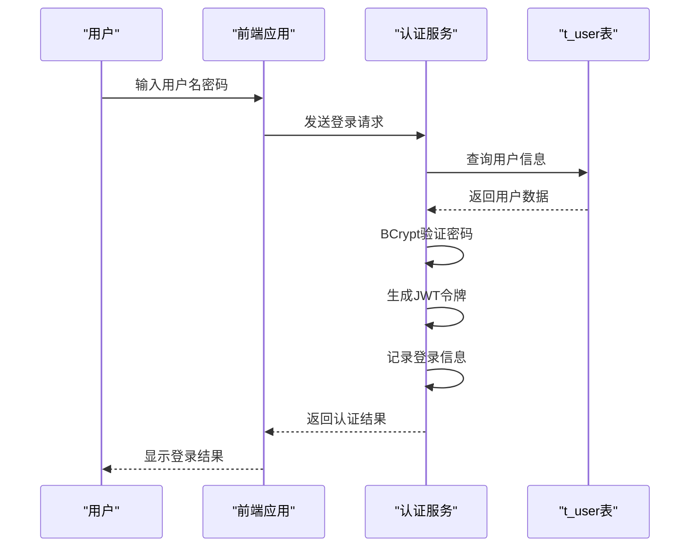
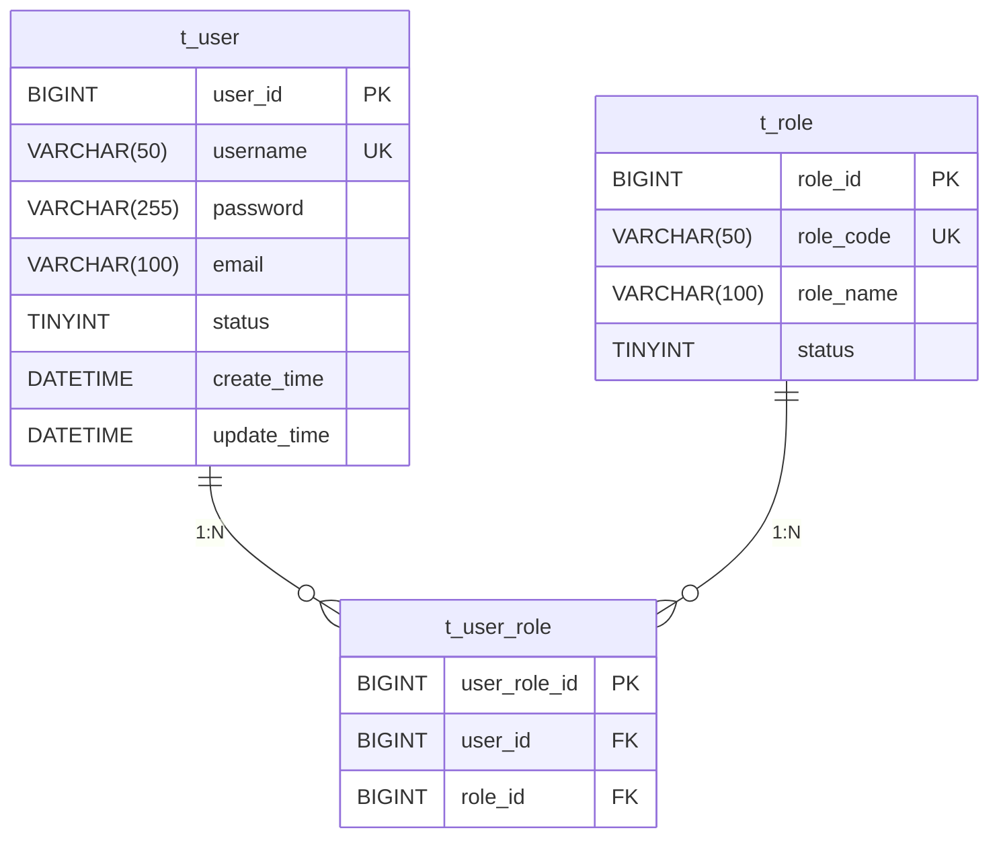
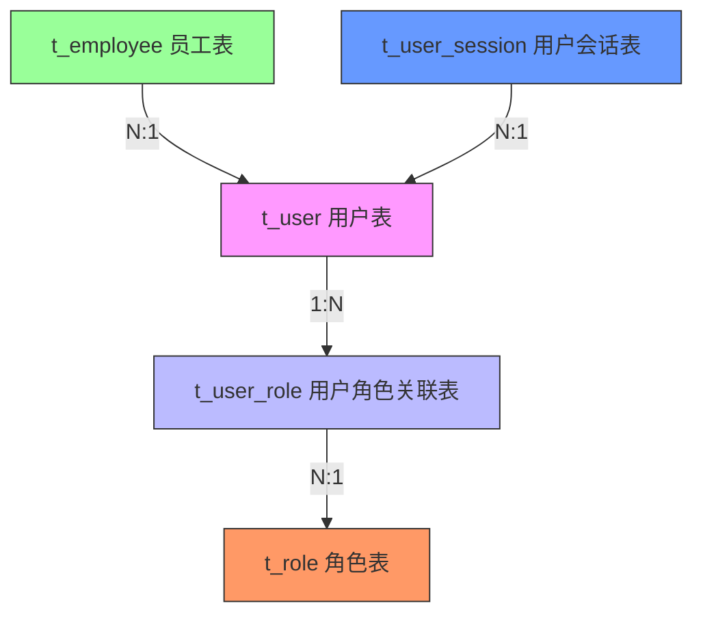

# 用户表(t_user)设计

<cite>
**本文档引用文件**  
- [02-t_user.sql](file://database-scripts/common-service/02-t_user.sql)
- [05-t_user_role.sql](file://database-scripts/common-service/05-t_user_role.sql)
- [18-t_employee.sql](file://database-scripts/common-service/18-t_employee.sql)
- [03-t_role.sql](file://database-scripts/common-service/03-t_role.sql)
- [t_user_session_table.sql](file://database-scripts/t_user_session_table.sql)
- [PRODUCTION_SECURITY_CHECKLIST.md](file://PRODUCTION_SECURITY_CHECKLIST.md)
- [performance_optimization.sql](file://database/performance_optimization.sql)
</cite>

## 目录
1. [用户表结构定义](#用户表结构定义)
2. [字段约束与索引设计](#字段约束与索引设计)
3. [密码加密策略](#密码加密策略)
4. [RBAC权限体系中的核心作用](#rbac权限体系中的核心作用)
5. [外键关联关系](#外键关联关系)
6. [建表SQL语句](#建表sql语句)
7. [典型数据存储与查询场景](#典型数据存储与查询场景)

## 用户表结构定义

用户表(t_user)是系统身份认证模块的核心数据表，用于管理系统用户账户信息。该表包含用户身份、认证、状态和审计等关键字段。

**表基本信息**：
- **表名**：t_user
- **功能**：系统用户账户管理
- **字符集**：utf8mb4
- **排序规则**：utf8mb4_unicode_ci
- **存储引擎**：InnoDB
- **创建时间**：2025-12-02

**字段定义**：

| 字段名 | 数据类型 | 是否为空 | 默认值 | 注释 |
|--------|---------|---------|--------|------|
| user_id | BIGINT | NOT NULL | - | 用户ID（主键） |
| username | VARCHAR(50) | NOT NULL | - | 用户名（登录用） |
| password | VARCHAR(255) | NOT NULL | - | 密码（加密存储） |
| email | VARCHAR(100) | NOT NULL | - | 邮箱 |
| phone | VARCHAR(20) | YES | NULL | 手机号 |
| real_name | VARCHAR(100) | YES | NULL | 真实姓名 |
| avatar | VARCHAR(500) | YES | NULL | 头像URL |
| status | TINYINT | NOT NULL | 1 | 状态：1-正常 2-禁用 3-锁定 |
| account_locked | TINYINT | NOT NULL | 0 | 账户是否锁定：0-未锁定 1-已锁定 |
| lock_reason | VARCHAR(500) | YES | NULL | 锁定原因 |
| lock_time | DATETIME | YES | NULL | 锁定时间 |
| unlock_time | DATETIME | YES | NULL | 解锁时间 |
| login_fail_count | INT | NOT NULL | 0 | 登录失败次数 |
| last_login_time | DATETIME | YES | NULL | 最后登录时间 |
| last_login_ip | VARCHAR(50) | YES | NULL | 最后登录IP |
| password_update_time | DATETIME | YES | NULL | 密码更新时间 |
| account_expire_time | DATETIME | YES | NULL | 账户过期时间 |
| remark | VARCHAR(500) | YES | NULL | 备注 |
| create_time | DATETIME | NOT NULL | CURRENT_TIMESTAMP | 创建时间 |
| update_time | DATETIME | NOT NULL | CURRENT_TIMESTAMP ON UPDATE CURRENT_TIMESTAMP | 更新时间 |
| create_user_id | BIGINT | YES | NULL | 创建人ID |
| update_user_id | BIGINT | YES | NULL | 更新人ID |
| deleted_flag | TINYINT | NOT NULL | 0 | 删除标记：0-未删除 1-已删除 |

**Section sources**
- [02-t_user.sql](file://database-scripts/common-service/02-t_user.sql#L8-L41)

## 字段约束与索引设计

### 主键约束
- `user_id` 字段作为主键，采用自增BIGINT类型，确保每个用户具有唯一标识。

### 唯一性约束
- `username` 字段设置唯一索引 `uk_username`，确保用户名的唯一性，防止重复注册。
- `email` 字段设置唯一索引 `uk_email`，确保邮箱地址的唯一性。

### 索引设计原则
索引设计遵循以下原则：
1. **高频查询优化**：为经常用于查询条件的字段创建索引
2. **复合索引优化**：根据查询模式创建复合索引，提高查询效率
3. **状态过滤优化**：为状态字段创建索引，优化状态过滤查询
4. **时间范围查询**：为时间字段创建索引，优化时间范围查询

**索引列表**：
- `PRIMARY KEY (user_id)`：主键索引
- `UNIQUE KEY uk_username (username)`：用户名唯一索引
- `UNIQUE KEY uk_email (email)`：邮箱唯一索引
- `KEY idx_phone (phone)`：手机号索引
- `KEY idx_status (status)`：状态索引
- `KEY idx_create_time (create_time)`：创建时间索引
- `KEY idx_deleted_flag (deleted_flag)`：删除标记索引

**性能优化考虑**：
在 `performance_optimization.sql` 文件中还定义了额外的优化索引：
- `idx_user_department_status`：用户部门状态复合索引
- `idx_user_login_name`：用户登录名索引，优化登录查询性能

**Section sources**
- [02-t_user.sql](file://database-scripts/common-service/02-t_user.sql#L32-L38)
- [performance_optimization.sql](file://database/performance_optimization.sql#L149-L162)

## 密码加密策略

系统采用多层安全机制保护用户密码，确保用户认证信息的安全性。

### 加密算法
根据 `PRODUCTION_SECURITY_CHECKLIST.md` 文件，系统采用BCrypt算法对密码进行加密存储：
- **加密算法**：BCrypt
- **Salt轮数**：10轮
- **单向加密**：密码不可逆向解密

### 安全特性
系统实现了全面的密码安全策略：
- **密码强度验证**：要求包含大小写字母、数字和特殊字符
- **密码历史记录**：禁止重用最近5次使用过的密码
- **登录失败锁定**：连续5次登录失败后锁定账户30分钟
- **密码更新时间**：记录密码最后更新时间，支持密码定期更换策略

### 认证流程
用户认证流程如下：
1. 用户提交用户名和密码
2. 系统根据用户名查询用户信息
3. 使用BCrypt算法验证密码哈希值
4. 验证通过后生成JWT令牌
5. 记录登录信息和最后登录时间



**Diagram sources**
- [02-t_user.sql](file://database-scripts/common-service/02-t_user.sql#L11)
- [PRODUCTION_SECURITY_CHECKLIST.md](file://PRODUCTION_SECURITY_CHECKLIST.md#L140-L143)

**Section sources**
- [02-t_user.sql](file://database-scripts/common-service/02-t_user.sql#L11)
- [PRODUCTION_SECURITY_CHECKLIST.md](file://PRODUCTION_SECURITY_CHECKLIST.md#L140-L143)

## RBAC权限体系中的核心作用

用户表(t_user)在RBAC（基于角色的访问控制）权限体系中扮演核心角色，是权限管理的基础。

### RBAC架构
系统采用标准的RBAC权限模型，包含以下核心组件：
- **用户(User)**：系统使用者，对应t_user表
- **角色(Role)**：权限集合，对应t_role表
- **权限(Permission)**：具体操作权限
- **用户角色关联**：用户与角色的多对多关系

### 权限管理流程
1. **用户创建**：在t_user表中创建用户账户
2. **角色分配**：通过t_user_role表为用户分配角色
3. **权限继承**：用户继承所分配角色的所有权限
4. **权限验证**：系统根据用户角色进行权限校验

### 权限查询优化
系统采用多级缓存策略优化权限查询性能：
- **L1本地缓存**：用户信息、权限信息（毫秒级）
- **L2 Redis缓存**：配置信息、字典数据（10ms级）
- **L3数据库**：持久化存储（100ms级）

性能指标：
- 认证响应时间：<50ms
- 用户查询：<20ms
- 配置查询：<10ms



**Diagram sources**
- [02-t_user.sql](file://database-scripts/common-service/02-t_user.sql#L8-L41)
- [05-t_user_role.sql](file://database-scripts/common-service/05-t_user_role.sql#L8-L20)
- [03-t_role.sql](file://database-scripts/common-service/03-t_role.sql#L8-L29)

**Section sources**
- [02-t_user.sql](file://database-scripts/common-service/02-t_user.sql#L8-L41)
- [05-t_user_role.sql](file://database-scripts/common-service/05-t_user_role.sql#L8-L20)
- [03-t_role.sql](file://database-scripts/common-service/03-t_role.sql#L8-L29)

## 外键关联关系

用户表与其他核心表存在重要的外键关联关系，形成完整的用户管理体系。

### 与t_user_role表的关联
用户表通过user_id字段与t_user_role表建立关联，实现用户与角色的多对多关系。

**关联特点**：
- **关系类型**：一对多
- **外键字段**：无直接外键，通过关联表实现
- **关联方式**：通过t_user_role表的user_id字段关联

### 与t_employee表的关联
员工表(t_employee)通过user_id字段外键关联到用户表(t_user)，实现员工与用户账户的一体化管理。

**外键约束**：
```sql
CONSTRAINT `fk_employee_user` FOREIGN KEY (`user_id`) REFERENCES `t_user` (`user_id`) ON DELETE SET NULL
```

**关联特点**：
- **关系类型**：一对一（可选）
- **外键字段**：t_employee.user_id
- **删除规则**：SET NULL（员工离职时保留用户账户）
- **业务意义**：员工可以有用户账户，但用户不一定都是员工

### 关联关系图


**Diagram sources**
- [02-t_user.sql](file://database-scripts/common-service/02-t_user.sql#L8-L41)
- [05-t_user_role.sql](file://database-scripts/common-service/05-t_user_role.sql#L8-L20)
- [18-t_employee.sql](file://database-scripts/common-service/18-t_employee.sql#L66-L67)
- [t_user_session_table.sql](file://database-scripts/t_user_session_table.sql#L7-L29)

**Section sources**
- [02-t_user.sql](file://database-scripts/common-service/02-t_user.sql#L8-L41)
- [05-t_user_role.sql](file://database-scripts/common-service/05-t_user_role.sql#L8-L20)
- [18-t_employee.sql](file://database-scripts/common-service/18-t_employee.sql#L66-L67)

## 建表SQL语句

以下是用户表(t_user)的完整建表SQL语句：

```sql
-- ============================================================
-- IOE-DREAM Common Service - Identity模块
-- 表名: t_user (用户表)
-- 功能: 系统用户账户管理
-- 创建时间: 2025-12-02
-- ============================================================

CREATE TABLE IF NOT EXISTS `t_user` (
    `user_id` BIGINT NOT NULL AUTO_INCREMENT COMMENT '用户ID',
    `username` VARCHAR(50) NOT NULL COMMENT '用户名（登录用）',
    `password` VARCHAR(255) NOT NULL COMMENT '密码（加密存储）',
    `email` VARCHAR(100) NOT NULL COMMENT '邮箱',
    `phone` VARCHAR(20) COMMENT '手机号',
    `real_name` VARCHAR(100) COMMENT '真实姓名',
    `avatar` VARCHAR(500) COMMENT '头像URL',
    `status` TINYINT NOT NULL DEFAULT 1 COMMENT '状态：1-正常 2-禁用 3-锁定',
    `account_locked` TINYINT NOT NULL DEFAULT 0 COMMENT '账户是否锁定：0-未锁定 1-已锁定',
    `lock_reason` VARCHAR(500) COMMENT '锁定原因',
    `lock_time` DATETIME COMMENT '锁定时间',
    `unlock_time` DATETIME COMMENT '解锁时间',
    `login_fail_count` INT NOT NULL DEFAULT 0 COMMENT '登录失败次数',
    `last_login_time` DATETIME COMMENT '最后登录时间',
    `last_login_ip` VARCHAR(50) COMMENT '最后登录IP',
    `password_update_time` DATETIME COMMENT '密码更新时间',
    `account_expire_time` DATETIME COMMENT '账户过期时间',
    `remark` VARCHAR(500) COMMENT '备注',
    `create_time` DATETIME NOT NULL DEFAULT CURRENT_TIMESTAMP COMMENT '创建时间',
    `update_time` DATETIME NOT NULL DEFAULT CURRENT_TIMESTAMP ON UPDATE CURRENT_TIMESTAMP COMMENT '更新时间',
    `create_user_id` BIGINT COMMENT '创建人ID',
    `update_user_id` BIGINT COMMENT '更新人ID',
    `deleted_flag` TINYINT NOT NULL DEFAULT 0 COMMENT '删除标记：0-未删除 1-已删除',
    PRIMARY KEY (`user_id`),
    UNIQUE KEY `uk_username` (`username`),
    UNIQUE KEY `uk_email` (`email`),
    KEY `idx_phone` (`phone`),
    KEY `idx_status` (`status`),
    KEY `idx_create_time` (`create_time`),
    KEY `idx_deleted_flag` (`deleted_flag`)
) ENGINE=InnoDB DEFAULT CHARSET=utf8mb4 COLLATE=utf8mb4_unicode_ci COMMENT='用户表-系统账户管理';
```

**Section sources**
- [02-t_user.sql](file://database-scripts/common-service/02-t_user.sql#L8-L41)

## 典型数据存储与查询场景

### 典型用户数据示例

以下是一个典型用户数据的存储示例：

```json
{
  "user_id": 1001,
  "username": "zhangsan",
  "password": "$2a$10$v5t9U1q7X8y3Z6w4V5u6t7u8v9w0x1y2z3A4B5C6D7E8F9G0H1I2J3K",
  "email": "zhangsan@company.com",
  "phone": "13800138000",
  "real_name": "张三",
  "avatar": "https://cdn.company.com/avatar/1001.jpg",
  "status": 1,
  "account_locked": 0,
  "login_fail_count": 0,
  "last_login_time": "2025-12-02 10:30:00",
  "last_login_ip": "192.168.1.100",
  "password_update_time": "2025-12-01 09:00:00",
  "create_time": "2025-11-01 08:00:00",
  "update_time": "2025-12-02 10:30:00",
  "create_user_id": 1,
  "update_user_id": 1001,
  "deleted_flag": 0
}
```

### 常见查询场景

#### 1. 用户登录查询
```sql
SELECT user_id, username, password, status, account_locked, login_fail_count 
FROM t_user 
WHERE username = ? AND deleted_flag = 0;
```

#### 2. 用户信息查询
```sql
SELECT user_id, username, email, phone, real_name, status, 
       last_login_time, last_login_ip, create_time 
FROM t_user 
WHERE user_id = ? AND deleted_flag = 0;
```

#### 3. 用户列表查询（分页）
```sql
SELECT user_id, username, email, phone, real_name, status, 
       last_login_time, create_time 
FROM t_user 
WHERE deleted_flag = 0 
  AND (username LIKE ? OR real_name LIKE ?)
  AND status = ?
ORDER BY create_time DESC 
LIMIT ?, ?;
```

#### 4. 状态统计查询
```sql
SELECT status, COUNT(*) as count 
FROM t_user 
WHERE deleted_flag = 0 
GROUP BY status;
```

#### 5. 最近注册用户查询
```sql
SELECT user_id, username, email, create_time 
FROM t_user 
WHERE deleted_flag = 0 
  AND create_time >= DATE_SUB(NOW(), INTERVAL 7 DAY)
ORDER BY create_time DESC;
```

### 查询性能优化
系统通过以下方式优化查询性能：
1. **索引优化**：为常用查询条件创建索引
2. **逻辑删除**：使用deleted_flag标记删除，避免物理删除
3. **时间分区**：按时间范围查询时使用索引
4. **缓存机制**：高频查询结果缓存到Redis

**Section sources**
- [02-t_user.sql](file://database-scripts/common-service/02-t_user.sql#L8-L41)
- [performance_optimization.sql](file://database/performance_optimization.sql#L149-L162)