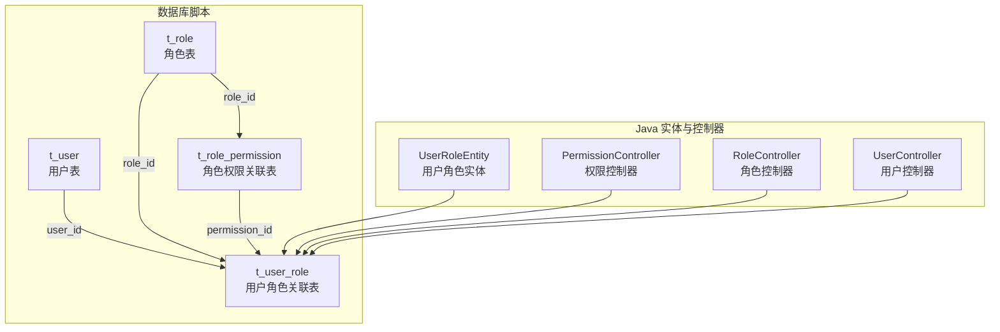
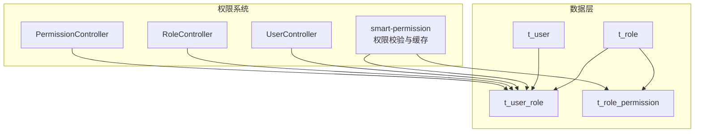
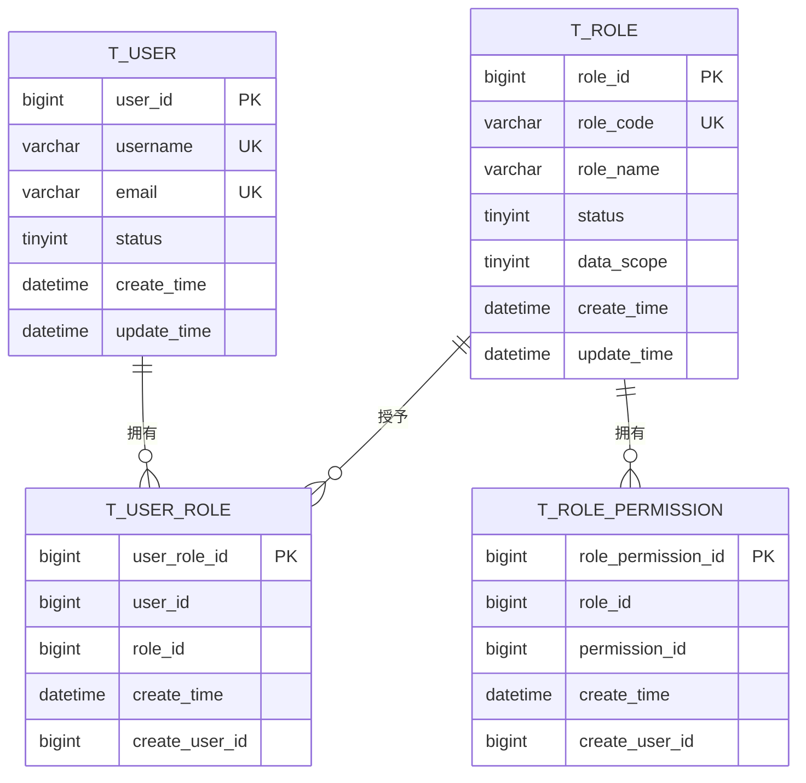
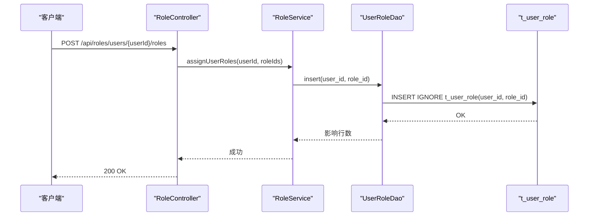
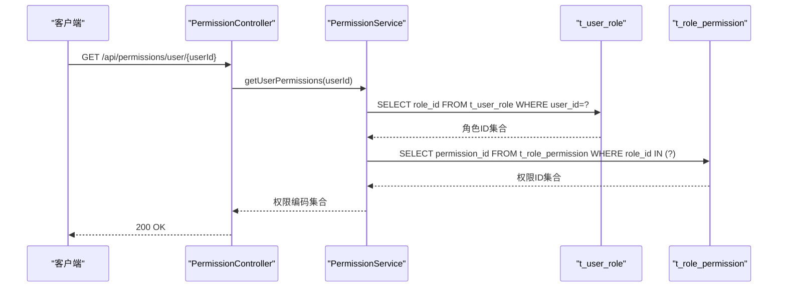
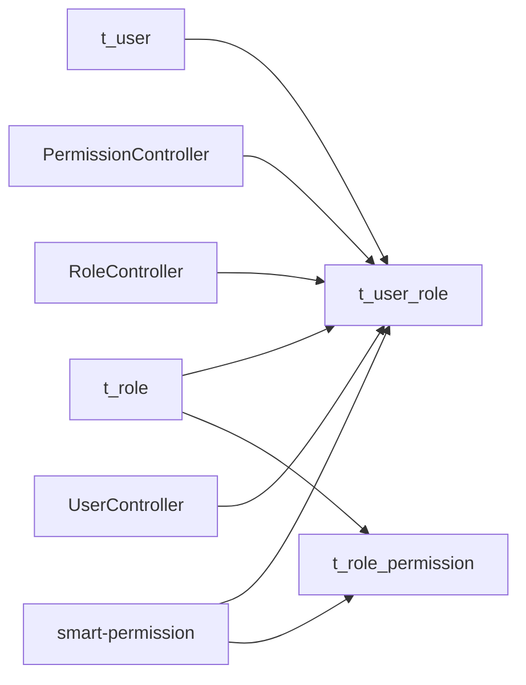

# 用户角色关联(t_user_role)设计

<cite>
**本文引用的文件**
- [05-t_user_role.sql](file://database-scripts/common-service/05-t_user_role.sql)
- [02-t_user.sql](file://database-scripts/common-service/02-t_user.sql)
- [03-t_role.sql](file://database-scripts/common-service/03-t_role.sql)
- [06-t_role_permission.sql](file://database-scripts/common-service/06-t_role_permission.sql)
- [UserRoleEntity.java](file://microservices/microservices-common/src/main/java/net/lab1024/sa/common/rbac/domain/entity/UserRoleEntity.java)
- [PermissionController.java](file://restful_refactor_backup_20251202_014224/microservices_ioedream-identity-service_src_main_java_net_lab1024_sa_identity_module_rbac_controller_PermissionController.java)
- [RoleController.java](file://restful_refactor_backup_20251202_014224/microservices_ioedream-identity-service_src_main_java_net_lab1024_sa_identity_module_rbac_controller_RoleController.java)
- [UserController.java](file://restful_refactor_backup_20251202_014224/microservices_ioedream-identity-service_src_main_java_net_lab1024_sa_identity_controller_UserController.java)
- [smart-permission.md](file://documentation/technical/smart-permission.md)
- [USER_ROLE_SCENARIO_MAPPING_ANALYSIS.md](file://USER_ROLE_SCENARIO_MAPPING_ANALYSIS.md)
</cite>

## 目录
1. [引言](#引言)
2. [项目结构](#项目结构)
3. [核心组件](#核心组件)
4. [架构总览](#架构总览)
5. [详细组件分析](#详细组件分析)
6. [依赖分析](#依赖分析)
7. [性能考虑](#性能考虑)
8. [故障排查指南](#故障排查指南)
9. [结论](#结论)
10. [附录](#附录)

## 引言
本文件围绕用户角色关联表 t_user_role 的结构设计进行深入解析，涵盖字段定义、索引设计、唯一性约束、在权限系统中的关键作用以及典型查询与业务流程。同时结合仓库中的用户表、角色表、角色权限关联表等，说明多对多关系如何支撑灵活的角色分配与权限校验。

## 项目结构
与 t_user_role 直接相关的核心文件分布如下：
- 数据库建表脚本：t_user_role、t_user、t_role、t_role_permission
- 实体类：UserRoleEntity（映射 t_user_role）
- 控制器：权限与角色相关控制器，用于演示用户角色分配与权限校验的典型场景
- 权限模块文档：smart-permission.md 提供权限校验与缓存策略背景

图表来源
- [05-t_user_role.sql](file://database-scripts/common-service/05-t_user_role.sql#L1-L19)
- [02-t_user.sql](file://database-scripts/common-service/02-t_user.sql#L1-L41)
- [03-t_role.sql](file://database-scripts/common-service/03-t_role.sql#L1-L29)
- [06-t_role_permission.sql](file://database-scripts/common-service/06-t_role_permission.sql#L1-L19)
- [UserRoleEntity.java](file://microservices/microservices-common/src/main/java/net/lab1024/sa/common/rbac/domain/entity/UserRoleEntity.java#L1-L35)
- [PermissionController.java](file://restful_refactor_backup_20251202_014224/microservices_ioedream-identity-service_src_main_java_net_lab1024_sa_identity_module_rbac_controller_PermissionController.java#L1-L203)
- [RoleController.java](file://restful_refactor_backup_20251202_014224/microservices_ioedream-identity-service_src_main_java_net_lab1024_sa_identity_module_rbac_controller_RoleController.java#L1-L186)
- [UserController.java](file://restful_refactor_backup_20251202_014224/microservices_ioedream-identity-service_src_main_java_net/lab1024/sa/identity/controller/UserController.java#L110-L136)

章节来源
- [05-t_user_role.sql](file://database-scripts/common-service/05-t_user_role.sql#L1-L19)
- [UserRoleEntity.java](file://microservices/microservices-common/src/main/java/net/lab1024/sa/common/rbac/domain/entity/UserRoleEntity.java#L1-L35)

## 核心组件
- t_user_role 关联表：承载用户与角色的多对多关系，确保同一用户-角色组合唯一，支持快速按用户或角色检索。
- t_user 用户表：提供用户维度的上下文，用于用户角色分配与权限校验。
- t_role 角色表：提供角色维度的上下文，用于角色权限关联与角色管理。
- t_role_permission 角色权限关联表：将角色与权限建立多对多关系，形成完整的 RBAC 权限链路。
- UserRoleEntity 实体：ORM 层映射 t_user_role，便于在服务层进行对象化操作。
- 权限控制器与角色控制器：提供用户角色分配、用户角色查询、权限校验等典型接口，体现 t_user_role 在业务流程中的关键位置。

章节来源
- [05-t_user_role.sql](file://database-scripts/common-service/05-t_user_role.sql#L1-L19)
- [02-t_user.sql](file://database-scripts/common-service/02-t_user.sql#L1-L41)
- [03-t_role.sql](file://database-scripts/common-service/03-t_role.sql#L1-L29)
- [06-t_role_permission.sql](file://database-scripts/common-service/06-t_role_permission.sql#L1-L19)
- [UserRoleEntity.java](file://microservices/microservices-common/src/main/java/net/lab1024/sa/common/rbac/domain/entity/UserRoleEntity.java#L1-L35)

## 架构总览
下图展示 t_user_role 在权限系统中的位置与交互关系，强调其作为“用户-角色”纽带的作用，以及与角色权限关联表共同构成权限链路的关键地位。

图表来源
- [PermissionController.java](file://restful_refactor_backup_20251202_014224/microservices_ioedream-identity-service_src_main_java_net_lab1024_sa_identity_module_rbac_controller_PermissionController.java#L1-L203)
- [RoleController.java](file://restful_refactor_backup_20251202_014224/microservices_ioedream-identity-service_src_main_java_net_lab1024_sa_identity_module_rbac_controller_RoleController.java#L1-L186)
- [UserController.java](file://restful_refactor_backup_20251202_014224/microservices_ioedream-identity-service_src_main_java_net/lab1024/sa/identity/controller/UserController.java#L110-L136)
- [smart-permission.md](file://documentation/technical/smart-permission.md#L1-L200)
- [05-t_user_role.sql](file://database-scripts/common-service/05-t_user_role.sql#L1-L19)
- [06-t_role_permission.sql](file://database-scripts/common-service/06-t_role_permission.sql#L1-L19)
- [02-t_user.sql](file://database-scripts/common-service/02-t_user.sql#L1-L41)
- [03-t_role.sql](file://database-scripts/common-service/03-t_role.sql#L1-L29)

## 详细组件分析

### t_user_role 结构与设计要点
- 字段说明
  - user_role_id：主键，自增，唯一标识一条用户-角色绑定记录。
  - user_id：用户标识，与 t_user.user_id 对应。
  - role_id：角色标识，与 t_role.role_id 对应。
  - create_time：记录创建时间，默认当前时间戳。
  - create_user_id：创建人ID（审计字段）。
- 唯一性约束
  - 组合唯一索引 (user_id, role_id)：保证同一用户不可重复绑定同一角色，避免冗余与歧义。
- 索引设计
  - 主键索引：PRIMARY KEY(user_role_id)
  - 组合唯一索引：UNIQUE KEY(uk_user_role) = (user_id, role_id)
  - 单列索引：KEY(idx_user_id)、KEY(idx_role_id)，分别优化按用户或角色查询的性能。
- 存储引擎与字符集
  - 引擎：InnoDB
  - 字符集：utf8mb4、排序规则：utf8mb4_unicode_ci

图表来源
- [02-t_user.sql](file://database-scripts/common-service/02-t_user.sql#L1-L41)
- [03-t_role.sql](file://database-scripts/common-service/03-t_role.sql#L1-L29)
- [05-t_user_role.sql](file://database-scripts/common-service/05-t_user_role.sql#L1-L19)
- [06-t_role_permission.sql](file://database-scripts/common-service/06-t_role_permission.sql#L1-L19)

章节来源
- [05-t_user_role.sql](file://database-scripts/common-service/05-t_user_role.sql#L1-L19)

### 组合索引(user_id, role_id)的设计原理与收益
- 唯一性保障
  - 通过 UNIQUE KEY(uk_user_role) = (user_id, role_id)，确保同一用户与同一角色只能绑定一次，避免重复绑定导致的权限叠加与歧义。
- 查询性能优化
  - 按用户查询：WHERE user_id = ? 可命中 uk_user_role，避免回表与额外排序。
  - 按角色查询：WHERE role_id = ? 可命中 uk_user_role，提升角色维度的关联查询效率。
  - 交叉查询：当需要判断某用户是否拥有某角色时，联合条件 WHERE user_id = ? AND role_id = ? 可直接定位唯一记录，减少扫描范围。
- 写入一致性
  - 唯一索引在插入时自动去重，防止重复绑定；若尝试重复插入，数据库会拒绝违反唯一性的记录，保证数据一致性。

章节来源
- [05-t_user_role.sql](file://database-scripts/common-service/05-t_user_role.sql#L1-L19)

### 在权限系统中的关键作用
- 用户与角色的灵活绑定
  - t_user_role 使用户可以拥有多个角色，角色之间可叠加，从而实现复杂的权限组合。
- 角色权限链路的起点
  - 用户通过 t_user_role 绑定角色，再由 t_role_permission 将角色与权限关联，最终形成“用户-权限”的完整链路。
- 权限校验的基础
  - 权限控制器与用户控制器通过 t_user_role 查询用户的角色集合，进而推导出用户的权限集合，支撑权限校验与资源访问控制。

章节来源
- [05-t_user_role.sql](file://database-scripts/common-service/05-t_user_role.sql#L1-L19)
- [06-t_role_permission.sql](file://database-scripts/common-service/06-t_role_permission.sql#L1-L19)
- [PermissionController.java](file://restful_refactor_backup_20251202_014224/microservices_ioedream-identity-service_src_main_java_net_lab1024_sa_identity_module_rbac_controller_PermissionController.java#L1-L203)
- [RoleController.java](file://restful_refactor_backup_20251202_014224/microservices_ioedream-identity-service_src_main_java_net_lab1024_sa_identity_module_rbac_controller_RoleController.java#L1-L186)
- [UserController.java](file://restful_refactor_backup_20251202_014224/microservices_ioedream-identity-service_src_main_java_net/lab1024/sa/identity/controller/UserController.java#L110-L136)

### 典型数据示例
- 用户表 t_user 示例
  - user_id、username、email、status 等字段用于标识用户身份与状态。
- 角色表 t_role 示例
  - role_id、role_code、role_name、status、data_scope 等字段用于标识角色与数据权限范围。
- 用户角色关联表 t_user_role 示例
  - user_role_id、user_id、role_id、create_time、create_user_id 等字段用于记录用户与角色的绑定关系。
- 角色权限关联表 t_role_permission 示例
  - role_permission_id、role_id、permission_id、create_time、create_user_id 等字段用于记录角色与权限的绑定关系。

章节来源
- [02-t_user.sql](file://database-scripts/common-service/02-t_user.sql#L1-L41)
- [03-t_role.sql](file://database-scripts/common-service/03-t_role.sql#L1-L29)
- [05-t_user_role.sql](file://database-scripts/common-service/05-t_user_role.sql#L1-L19)
- [06-t_role_permission.sql](file://database-scripts/common-service/06-t_role_permission.sql#L1-L19)

### 典型查询逻辑与业务流程

#### 场景一：用户角色分配
- 典型流程
  1) 调用角色控制器的“用户分配角色”接口，传入用户ID与角色ID列表。
  2) 服务层将角色ID列表与用户ID写入 t_user_role，利用组合唯一索引避免重复绑定。
  3) 写入完成后，权限缓存与审计机制可触发，确保后续权限校验的准确性与时效性。
- 关键点
  - 写入前可先校验角色是否存在与状态有效，避免无效角色绑定。
  - 写入后可触发权限缓存刷新，降低后续权限校验延迟。

图表来源
- [RoleController.java](file://restful_refactor_backup_20251202_014224/microservices_ioedream-identity-service_src_main_java_net_lab1024_sa_identity_module_rbac_controller_RoleController.java#L175-L186)

章节来源
- [RoleController.java](file://restful_refactor_backup_20251202_014224/microservices_ioedream-identity-service_src_main_java_net_lab1024_sa_identity_module_rbac_controller_RoleController.java#L175-L186)

#### 场景二：权限校验
- 典型流程
  1) 调用权限控制器的“获取用户权限列表”接口，传入用户ID。
  2) 服务层通过 t_user_role 查询用户的角色集合，再通过 t_role_permission 查询角色对应的权限集合，最终汇总得到用户权限集合。
  3) 权限校验时，可直接判断用户权限集合是否包含目标权限编码，或进一步结合数据权限范围进行过滤。
- 关键点
  - 利用组合唯一索引与单列索引，按用户查询用户-角色关系时高效。
  - 权限模块文档提供了多级缓存策略与权限验证器模式，有助于在高并发场景下降低数据库压力。

图表来源
- [PermissionController.java](file://restful_refactor_backup_20251202_014224/microservices_ioedream-identity-service_src_main_java_net_lab1024_sa_identity_module_rbac_controller_PermissionController.java#L82-L92)
- [05-t_user_role.sql](file://database-scripts/common-service/05-t_user_role.sql#L1-L19)
- [06-t_role_permission.sql](file://database-scripts/common-service/06-t_role_permission.sql#L1-L19)

章节来源
- [PermissionController.java](file://restful_refactor_backup_20251202_014224/microservices_ioedream-identity-service_src_main_java_net_lab1024_sa_identity_module_rbac_controller_PermissionController.java#L82-L92)
- [smart-permission.md](file://documentation/technical/smart-permission.md#L1-L200)

#### 场景三：用户角色查询
- 典型流程
  - 调用用户控制器的“获取用户角色”接口，传入用户ID。
  - 服务层通过 t_user_role 查询用户的角色编码集合，返回给前端展示。
- 关键点
  - 单列索引 idx_user_id 保障按用户查询的高效性。

章节来源
- [UserController.java](file://restful_refactor_backup_20251202_014224/microservices_ioedream-identity-service_src_main_java_net/lab1024/sa/identity/controller/UserController.java#L110-L136)
- [05-t_user_role.sql](file://database-scripts/common-service/05-t_user_role.sql#L1-L19)

### ORM 实体映射
- UserRoleEntity 映射 t_user_role，包含 userRoleId、userId、roleId、status 等字段，便于在服务层以对象形式操作用户-角色关系。
- 该实体继承基础审计实体，复用 create_time、update_time 等审计字段，保持与数据库一致的审计能力。

章节来源
- [UserRoleEntity.java](file://microservices/microservices-common/src/main/java/net/lab1024/sa/common/rbac/domain/entity/UserRoleEntity.java#L1-L35)

## 依赖分析
- 表间依赖
  - t_user_role 依赖 t_user(user_id) 与 t_role(role_id)，形成用户-角色的多对多关系。
  - t_role_permission 依赖 t_role(role_id) 与 t_permission(permission_id)，形成角色-权限的多对多关系。
- 控制器依赖
  - PermissionController、RoleController、UserController 依赖 t_user_role 进行用户角色分配与权限查询。
- 权限模块依赖
  - smart-permission.md 描述了权限校验与缓存策略，强调 t_user_role 与 t_role_permission 在权限链路中的基础地位。

图表来源
- [02-t_user.sql](file://database-scripts/common-service/02-t_user.sql#L1-L41)
- [03-t_role.sql](file://database-scripts/common-service/03-t_role.sql#L1-L29)
- [05-t_user_role.sql](file://database-scripts/common-service/05-t_user_role.sql#L1-L19)
- [06-t_role_permission.sql](file://database-scripts/common-service/06-t_role_permission.sql#L1-L19)
- [PermissionController.java](file://restful_refactor_backup_20251202_014224/microservices_ioedream-identity-service_src_main_java_net_lab1024_sa_identity_module_rbac_controller_PermissionController.java#L1-L203)
- [RoleController.java](file://restful_refactor_backup_20251202_014224/microservices_ioedream-identity-service_src_main_java_net_lab1024_sa_identity_module_rbac_controller_RoleController.java#L1-L186)
- [UserController.java](file://restful_refactor_backup_20251202_014224/microservices_ioedream-identity-service_src_main_java_net/lab1024/sa/identity/controller/UserController.java#L110-L136)
- [smart-permission.md](file://documentation/technical/smart-permission.md#L1-L200)

章节来源
- [02-t_user.sql](file://database-scripts/common-service/02-t_user.sql#L1-L41)
- [03-t_role.sql](file://database-scripts/common-service/03-t_role.sql#L1-L29)
- [05-t_user_role.sql](file://database-scripts/common-service/05-t_user_role.sql#L1-L19)
- [06-t_role_permission.sql](file://database-scripts/common-service/06-t_role_permission.sql#L1-L19)
- [PermissionController.java](file://restful_refactor_backup_20251202_014224/microservices_ioedream-identity-service_src_main_java_net_lab1024_sa_identity_module_rbac_controller_PermissionController.java#L1-L203)
- [RoleController.java](file://restful_refactor_backup_20251202_014224/microservices_ioedream-identity-service_src_main_java_net_lab1024_sa_identity_module_rbac_controller_RoleController.java#L1-L186)
- [UserController.java](file://restful_refactor_backup_20251202_014224/microservices_ioedream-identity-service_src_main_java_net/lab1024/sa/identity/controller/UserController.java#L110-L136)
- [smart-permission.md](file://documentation/technical/smart-permission.md#L1-L200)

## 性能考虑
- 索引选择
  - 组合唯一索引(uk_user_role)在写入与查询中均能显著降低冲突与扫描成本。
  - 单列索引(idx_user_id, idx_role_id)分别优化按用户与按角色的查询路径。
- 缓存策略
  - 权限模块文档提出多级缓存策略，建议在高并发场景下对用户权限结果进行缓存，减少对 t_user_role 与 t_role_permission 的频繁查询。
- 写入幂等
  - 利用唯一索引实现幂等写入，避免重复绑定带来的脏数据与额外开销。

[本节为通用性能讨论，不直接分析具体文件]

## 故障排查指南
- 重复绑定导致的异常
  - 现象：插入重复的 user_id 与 role_id 组合时报唯一约束冲突。
  - 处理：在业务层先查询是否存在该绑定，再决定是否插入或忽略。
- 查询性能不佳
  - 现象：按用户或角色查询 t_user_role 时慢。
  - 处理：确认是否使用了 user_id 或 role_id 的过滤条件，确保索引被命中；必要时重建索引或调整查询语句。
- 权限校验不准确
  - 现象：用户权限与预期不符。
  - 处理：检查 t_user_role 与 t_role_permission 的绑定是否正确；确认权限缓存是否已刷新；核对角色数据权限范围设置。

章节来源
- [05-t_user_role.sql](file://database-scripts/common-service/05-t_user_role.sql#L1-L19)
- [smart-permission.md](file://documentation/technical/smart-permission.md#L1060-L1118)

## 结论
t_user_role 作为用户与角色的纽带，通过组合唯一索引确保数据唯一性与写入幂等，通过单列索引优化按用户与按角色的查询性能。它与 t_role_permission 共同构成 RBAC 权限链路的基础，支撑用户角色分配与权限校验等关键业务流程。在实际落地中，建议结合权限模块的多级缓存策略与严格的审计字段，确保系统的稳定性与可维护性。

[本节为总结性内容，不直接分析具体文件]

## 附录

### 建表 SQL（路径引用）
- t_user_role 建表 SQL：见 [05-t_user_role.sql](file://database-scripts/common-service/05-t_user_role.sql#L1-L19)
- t_user 建表 SQL：见 [02-t_user.sql](file://database-scripts/common-service/02-t_user.sql#L1-L41)
- t_role 建表 SQL：见 [03-t_role.sql](file://database-scripts/common-service/03-t_role.sql#L1-L29)
- t_role_permission 建表 SQL：见 [06-t_role_permission.sql](file://database-scripts/common-service/06-t_role_permission.sql#L1-L19)

### 典型数据示例（路径引用）
- 用户表 t_user 示例：见 [02-t_user.sql](file://database-scripts/common-service/02-t_user.sql#L1-L41)
- 角色表 t_role 示例：见 [03-t_role.sql](file://database-scripts/common-service/03-t_role.sql#L1-L29)
- 用户角色关联表 t_user_role 示例：见 [05-t_user_role.sql](file://database-scripts/common-service/05-t_user_role.sql#L1-L19)
- 角色权限关联表 t_role_permission 示例：见 [06-t_role_permission.sql](file://database-scripts/common-service/06-t_role_permission.sql#L1-L19)

### 场景映射参考
- 用户角色与功能场景映射：见 [USER_ROLE_SCENARIO_MAPPING_ANALYSIS.md](file://USER_ROLE_SCENARIO_MAPPING_ANALYSIS.md#L1-L63)