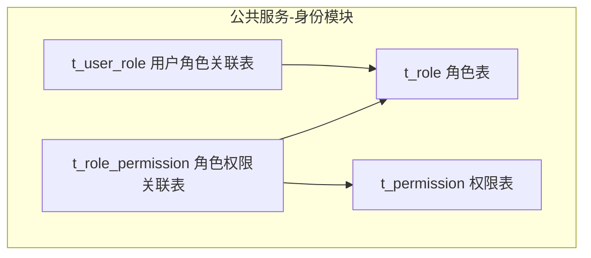
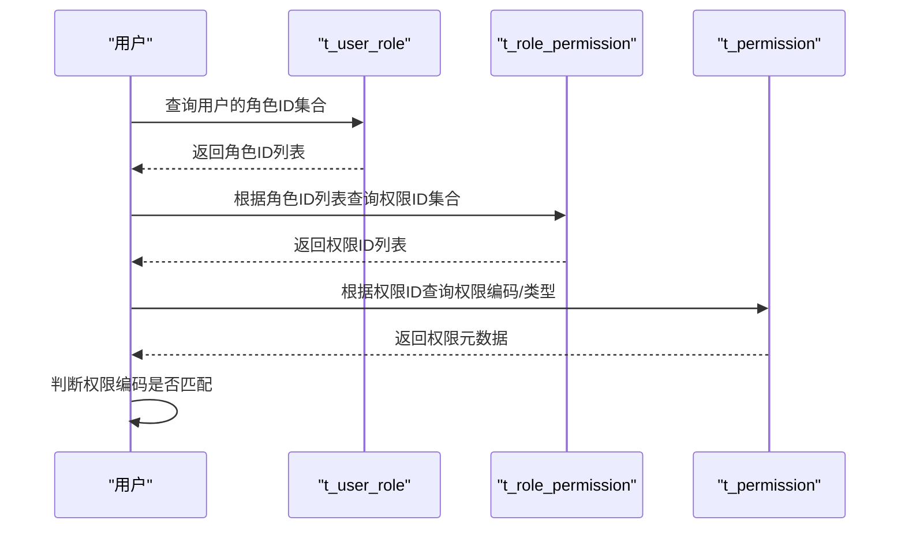
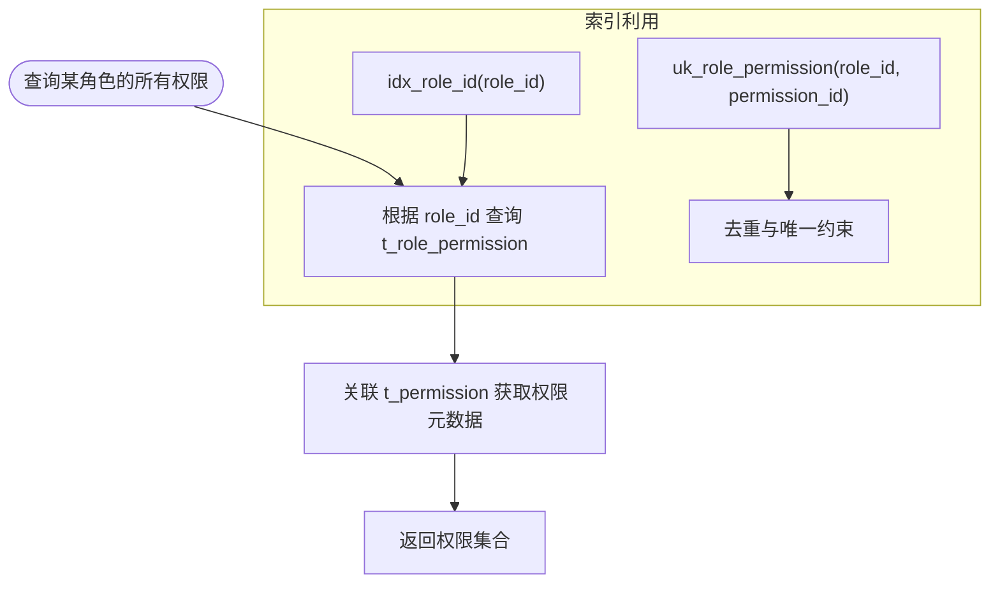
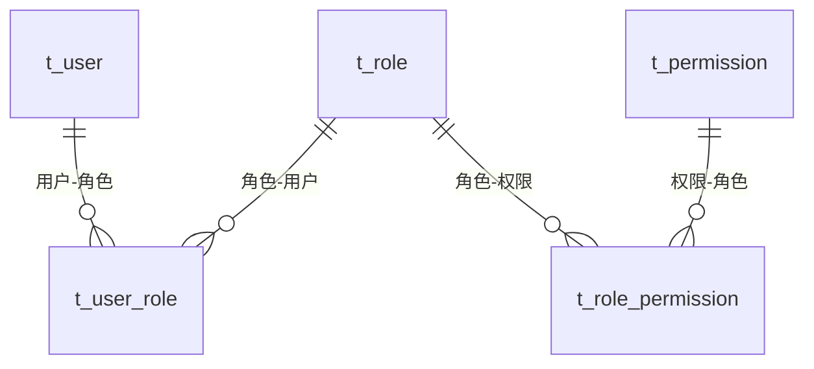
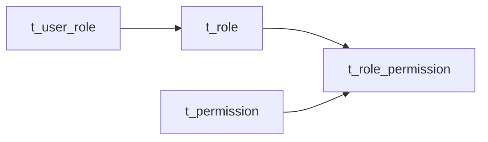

# 角色权限关联(t_role_permission)设计

<cite>
**本文引用的文件**
- [t_role_permission.sql](file://database-scripts/common-service/06-t_role_permission.sql)
- [t_role.sql](file://database-scripts/common-service/03-t_role.sql)
- [t_permission.sql](file://database-scripts/common-service/04-t_permission.sql)
- [t_user_role.sql](file://database-scripts/common-service/05-t_user_role.sql)
- [smart-permission.md](file://docs/COMMON_MODULES/smart-permission.md)
- [07-系统配置模块流程图.md](file://docs/各业务模块文档/门禁/07-系统配置模块流程图.md)
- [考勤汇总报表.md](file://docs/各业务模块文档/考勤/考勤汇总报表.md)
</cite>

## 目录
1. [引言](#引言)
2. [项目结构](#项目结构)
3. [核心组件](#核心组件)
4. [架构总览](#架构总览)
5. [详细组件分析](#详细组件分析)
6. [依赖分析](#依赖分析)
7. [性能考量](#性能考量)
8. [故障排查指南](#故障排查指南)
9. [结论](#结论)
10. [附录](#附录)

## 引言
本文件围绕角色权限关联表 t_role_permission 的结构设计与使用方式进行深入说明，重点解释：
- 字段定义与用途（role_permission_id、role_id、permission_id、create_time 等）
- 如何通过该表实现“角色—权限”的多对多绑定，支撑权限的批量管理
- 组合索引 (role_id, permission_id) 的设计目的与查询优化策略
- 结合系统实际业务（门禁配置、考勤报表查看）给出权限分配的落地示例

## 项目结构
t_role_permission 属于“公共服务”模块的权限管理子系统，与角色表、权限表、用户角色关联表共同构成 RBAC 权限模型的基础数据层。

图表来源
- [t_role_permission.sql](file://database-scripts/common-service/06-t_role_permission.sql#L1-L19)
- [t_role.sql](file://database-scripts/common-service/03-t_role.sql#L1-L28)
- [t_permission.sql](file://database-scripts/common-service/04-t_permission.sql#L1-L38)
- [t_user_role.sql](file://database-scripts/common-service/05-t_user_role.sql#L1-L19)

章节来源
- [t_role_permission.sql](file://database-scripts/common-service/06-t_role_permission.sql#L1-L19)
- [t_role.sql](file://database-scripts/common-service/03-t_role.sql#L1-L28)
- [t_permission.sql](file://database-scripts/common-service/04-t_permission.sql#L1-L38)
- [t_user_role.sql](file://database-scripts/common-service/05-t_user_role.sql#L1-L19)

## 核心组件
- 角色表 t_role：承载角色标识、状态、数据权限范围等元数据
- 权限表 t_permission：承载权限标识、类型、父子关系、接口路径等
- 用户角色关联表 t_user_role：用户与角色的多对多映射
- 角色权限关联表 t_role_permission：角色与权限的多对多映射

章节来源
- [t_role.sql](file://database-scripts/common-service/03-t_role.sql#L1-L28)
- [t_permission.sql](file://database-scripts/common-service/04-t_permission.sql#L1-L38)
- [t_user_role.sql](file://database-scripts/common-service/05-t_user_role.sql#L1-L19)
- [t_role_permission.sql](file://database-scripts/common-service/06-t_role_permission.sql#L1-L19)

## 架构总览
t_role_permission 作为“角色—权限”关系的桥接表，配合 t_user_role（用户—角色）形成“用户→角色→权限”的完整权限链路。权限验证通常按如下流程进行：
- 依据用户获取其角色集合
- 基于角色集合查询 t_role_permission 获取权限集合
- 对比请求的权限编码，判定是否具备相应权限

图表来源
- [t_user_role.sql](file://database-scripts/common-service/05-t_user_role.sql#L1-L19)
- [t_role_permission.sql](file://database-scripts/common-service/06-t_role_permission.sql#L1-L19)
- [t_permission.sql](file://database-scripts/common-service/04-t_permission.sql#L1-L38)

## 详细组件分析

### 表结构与字段说明
- 主键：role_permission_id（自增）
- 关键字段：
  - role_id：角色标识
  - permission_id：权限标识
  - create_time：创建时间
  - create_user_id：创建人ID（可选）
- 约束与索引：
  - 唯一键：uk_role_permission(role_id, permission_id)，避免重复授权
  - 索引：idx_role_id(role_id)、idx_permission_id(permission_id)

章节来源
- [t_role_permission.sql](file://database-scripts/common-service/06-t_role_permission.sql#L1-L19)

### 组合索引设计目的
- uk_role_permission(role_id, permission_id)：确保同一角色对同一权限只授权一次，防止重复授权
- idx_role_id(role_id)：用于“查询某角色拥有哪些权限”的高频场景
- idx_permission_id(permission_id)：用于“查询某权限被哪些角色拥有”的辅助场景

图表来源
- [t_role_permission.sql](file://database-scripts/common-service/06-t_role_permission.sql#L1-L19)
- [t_permission.sql](file://database-scripts/common-service/04-t_permission.sql#L1-L38)

### 权限批量管理与查询
- 批量授权：向 t_role_permission 插入多条记录，即可一次性为角色授予多个权限
- 批量撤销：删除对应 role_id 的记录，即可撤销该角色的多项权限
- 快速查询：通过 idx_role_id(role_id) 可高效列出某角色的全部权限

章节来源
- [t_role_permission.sql](file://database-scripts/common-service/06-t_role_permission.sql#L1-L19)

### 与用户角色关联的关系
- t_user_role 将用户与角色建立多对多关系
- t_role_permission 将角色与权限建立多对多关系
- 通过两表联合查询，可得到“用户→权限”的最终权限集

图表来源
- [t_user_role.sql](file://database-scripts/common-service/05-t_user_role.sql#L1-L19)
- [t_role_permission.sql](file://database-scripts/common-service/06-t_role_permission.sql#L1-L19)
- [t_role.sql](file://database-scripts/common-service/03-t_role.sql#L1-L28)
- [t_permission.sql](file://database-scripts/common-service/04-t_permission.sql#L1-L38)

### 实际业务场景示例

#### 门禁系统-系统配置模块
- 场景目标：为不同角色授予“系统参数配置”“用户权限管理”“许可证管理”“备份恢复”等权限
- 实施思路：
  - 在 t_permission 中定义“系统参数配置”“用户权限管理”等权限项
  - 在 t_role 中定义“系统管理员”“设备管理员”“区域管理员”“监控员”“普通用户”等角色
  - 通过 t_user_role 将用户与角色绑定
  - 通过 t_role_permission 将角色与权限绑定，实现对“系统配置”模块的细粒度权限控制

章节来源
- [07-系统配置模块流程图.md](file://docs/各业务模块文档/门禁/07-系统配置模块流程图.md#L1-L131)

#### 考勤系统-报表查看
- 场景目标：允许特定角色查看“个人考勤汇总”“部门统计”“异常分析”“报表生成”等报表
- 实施思路：
  - 在 t_permission 中定义“报表查看”“报表导出”“统计分析”等权限项
  - 在 t_role 中定义“HR专员”“部门主管”“普通员工”等角色
  - 通过 t_user_role 将用户与角色绑定
  - 通过 t_role_permission 将角色与报表相关权限绑定，实现“按角色开放报表查看权限”的批量管理

章节来源
- [考勤汇总报表.md](file://docs/各业务模块文档/考勤/考勤汇总报表.md#L1-L120)

## 依赖分析
- 外键关系：t_role_permission.role_id 引用 t_role.role_id；t_role_permission.permission_id 引用 t_permission.permission_id
- 业务依赖：
  - t_user_role 为 t_role_permission 提供“用户→角色”的上下文
  - t_permission 为 t_role_permission 提供“权限元数据”，用于权限验证与前端展示

图表来源
- [t_user_role.sql](file://database-scripts/common-service/05-t_user_role.sql#L1-L19)
- [t_role_permission.sql](file://database-scripts/common-service/06-t_role_permission.sql#L1-L19)
- [t_role.sql](file://database-scripts/common-service/03-t_role.sql#L1-L28)
- [t_permission.sql](file://database-scripts/common-service/04-t_permission.sql#L1-L38)

## 性能考量
- 索引策略：
  - idx_role_id(role_id)：加速“查询某角色的全部权限”
  - uk_role_permission(role_id, permission_id)：避免重复授权，同时支持快速存在性检查
- 批量操作：
  - 授权/撤销时建议使用批量插入/删除，减少往返与锁竞争
- 缓存与鉴权：
  - 可结合权限缓存策略（如本地+分布式缓存）降低频繁查询压力
  - 鉴权流程中先查缓存，再回源数据库，命中率高时可显著降低延迟

[本节为通用性能建议，不直接分析具体文件]

## 故障排查指南
- 重复授权导致唯一约束冲突
  - 现象：插入时报唯一键冲突
  - 处理：先检查是否存在相同 (role_id, permission_id) 的记录，再决定插入或跳过
- 查询结果为空
  - 现象：查询某角色权限为空
  - 排查：确认 t_user_role 是否已将用户与角色绑定；确认 t_role_permission 是否已为该角色授权
- 权限不生效
  - 现象：用户具备角色但无法访问
  - 排查：确认 t_permission 中权限编码与请求一致；确认权限状态、删除标记等字段未阻断

章节来源
- [t_role_permission.sql](file://database-scripts/common-service/06-t_role_permission.sql#L1-L19)
- [t_user_role.sql](file://database-scripts/common-service/05-t_user_role.sql#L1-L19)
- [t_permission.sql](file://database-scripts/common-service/04-t_permission.sql#L1-L38)

## 结论
t_role_permission 通过简洁的字段设计与合理的索引策略，实现了“角色—权限”的稳定、高效绑定。配合 t_user_role 与 t_permission，可轻松实现权限的批量授权、撤销与查询，满足门禁配置、考勤报表查看等业务场景的精细化权限控制需求。

## 附录

### 建表SQL脚本（路径引用）
- [t_role_permission.sql](file://database-scripts/common-service/06-t_role_permission.sql#L1-L19)

### 相关文档与流程
- [smart-permission.md](file://docs/COMMON_MODULES/smart-permission.md#L1-L120)
- [07-系统配置模块流程图.md](file://docs/各业务模块文档/门禁/07-系统配置模块流程图.md#L1-L131)
- [考勤汇总报表.md](file://docs/各业务模块文档/考勤/考勤汇总报表.md#L1-L120)