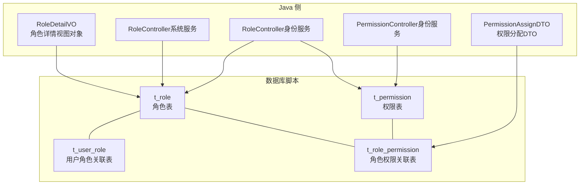
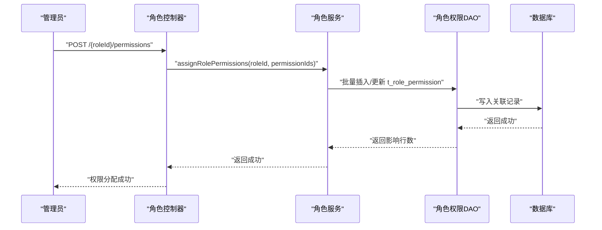
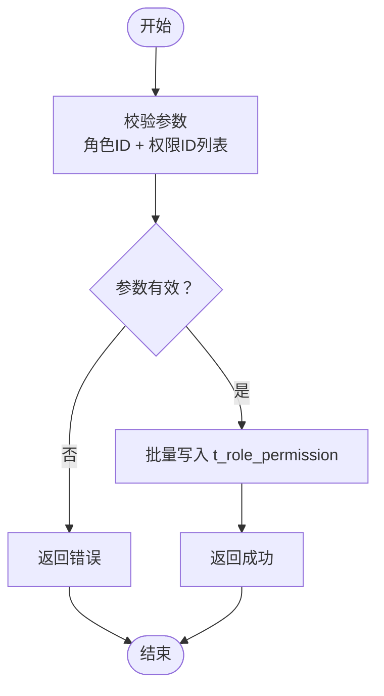
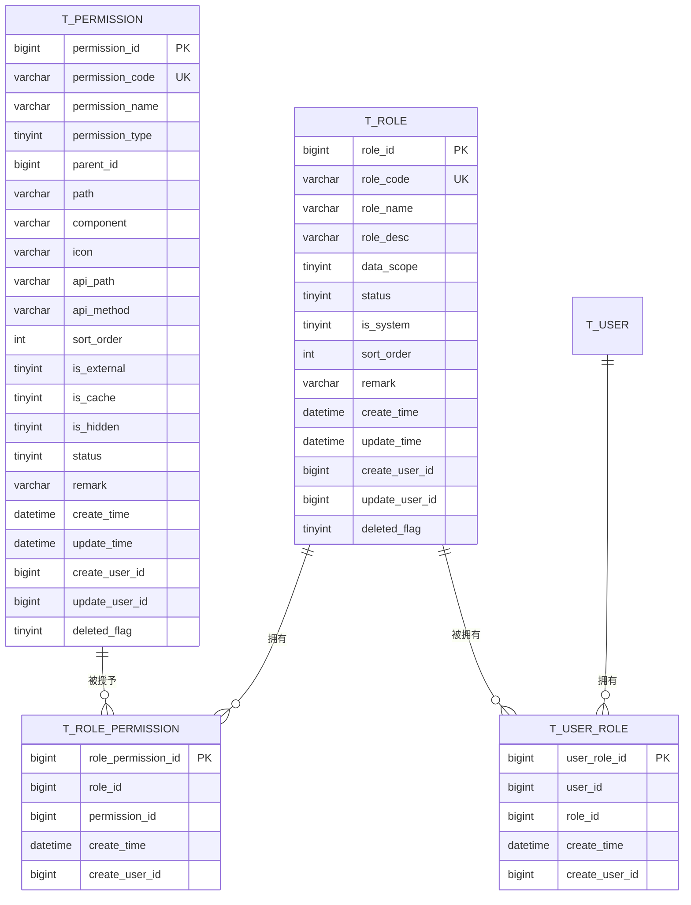

# 角色表(t_role)设计

<cite>
**本文引用的文件**
- [03-t_role.sql](file://database-scripts/common-service/03-t_role.sql)
- [04-t_permission.sql](file://database-scripts/common-service/04-t_permission.sql)
- [05-t_user_role.sql](file://database-scripts/common-service/05-t_user_role.sql)
- [06-t_role_permission.sql](file://database-scripts/common-service/06-t_role_permission.sql)
- [RoleDetailVO.java](file://microservices/microservices-common/src/main/java/net/lab1024/sa/common/identity/domain/vo/RoleDetailVO.java)
- [PermissionAssignDTO.java](file://microservices/microservices-common/src/main/java/net/lab1024/sa/common/identity/domain/dto/PermissionAssignDTO.java)
- [RoleController.java（系统服务）](file://restful_refactor_backup_20251202_014224/microservices_ioedream-system-service_src_main_java_net_lab1024_sa_system_controller_RoleController.java)
- [RoleController.java（身份服务）](file://restful_refactor_backup_20251202_014224/microservices_ioedream-identity-service_src_main_java_net_lab1024_sa_identity_module_rbac_controller_RoleController.java)
- [PermissionController.java（身份服务）](file://restful_refactor_backup_20251202_014224/microservices_ioedream-identity-service_src_main_java_net_lab1024_sa_identity_module_rbac_controller_PermissionController.java)
- [smart-business-integration.md](file://documentation/technical/smart-business-integration.md)
</cite>

## 目录
1. [简介](#简介)
2. [项目结构](#项目结构)
3. [核心组件](#核心组件)
4. [架构总览](#架构总览)
5. [详细组件分析](#详细组件分析)
6. [依赖分析](#依赖分析)
7. [性能考虑](#性能考虑)
8. [故障排查指南](#故障排查指南)
9. [结论](#结论)
10. [附录](#附录)

## 简介
本文件围绕角色表 t_role 的结构设计进行深入解析，涵盖字段语义、索引策略、与权限控制系统的关联关系，以及通过角色实现权限批量分配的流程。同时提供建表 SQL 脚本与系统管理员、普通用户等角色的数据示例，帮助读者快速理解角色在 RBAC（基于角色的访问控制）体系中的定位与使用方式。

## 项目结构
- 数据库脚本位于 database-scripts/common-service 下，包含角色、权限、用户角色、角色权限等表的初始化脚本。
- Java 侧 VO/DTO 定义了角色与权限交互的数据模型。
- 控制器层提供了角色与权限分配、查询等 API 接口，体现 RBAC 的实际落地。

图表来源
- [03-t_role.sql](file://database-scripts/common-service/03-t_role.sql#L8-L29)
- [04-t_permission.sql](file://database-scripts/common-service/04-t_permission.sql#L8-L38)
- [05-t_user_role.sql](file://database-scripts/common-service/05-t_user_role.sql#L8-L19)
- [06-t_role_permission.sql](file://database-scripts/common-service/06-t_role_permission.sql#L8-L19)
- [RoleDetailVO.java](file://microservices/microservices-common/src/main/java/net/lab1024/sa/common/identity/domain/vo/RoleDetailVO.java#L1-L55)
- [PermissionAssignDTO.java](file://microservices/microservices-common/src/main/java/net/lab1024/sa/common/identity/domain/dto/PermissionAssignDTO.java#L1-L28)
- [RoleController.java（系统服务）](file://restful_refactor_backup_20251202_014224/microservices_ioedream-system-service_src_main_java_net/lab1024/sa/system/controller/RoleController.java#L94-L141)
- [RoleController.java（身份服务）](file://restful_refactor_backup_20251202_014224/microservices_ioedream-identity-service_src_main_java_net/lab1024/sa/identity/module/rbac/controller/RoleController.java#L1-L186)
- [PermissionController.java（身份服务）](file://restful_refactor_backup_20251202_014224/microservices_ioedream-identity-service_src_main_java_net/lab1024/sa/identity/module/rbac/controller/PermissionController.java#L1-L166)

章节来源
- [03-t_role.sql](file://database-scripts/common-service/03-t_role.sql#L8-L29)
- [04-t_permission.sql](file://database-scripts/common-service/04-t_permission.sql#L8-L38)
- [05-t_user_role.sql](file://database-scripts/common-service/05-t_user_role.sql#L8-L19)
- [06-t_role_permission.sql](file://database-scripts/common-service/06-t_role_permission.sql#L8-L19)

## 核心组件
- 角色表 t_role：存储角色基本信息、状态、系统标识、数据权限范围、排序与时间戳等。
- 权限表 t_permission：存储权限元数据（编码、名称、类型、父子关系、API 路径等）。
- 用户角色关联表 t_user_role：记录用户与角色的多对多关系。
- 角色权限关联表 t_role_permission：记录角色与权限的多对多关系。

章节来源
- [03-t_role.sql](file://database-scripts/common-service/03-t_role.sql#L8-L29)
- [04-t_permission.sql](file://database-scripts/common-service/04-t_permission.sql#L8-L38)
- [05-t_user_role.sql](file://database-scripts/common-service/05-t_user_role.sql#L8-L19)
- [06-t_role_permission.sql](file://database-scripts/common-service/06-t_role_permission.sql#L8-L19)

## 架构总览
角色在权限控制系统中的作用：
- 角色是权限的聚合者：通过 t_role_permission 将多个权限聚合到角色。
- 用户通过 t_user_role 绑定到一个或多个角色，从而获得角色所拥有的权限集合。
- 权限以 t_permission 为原子单元，支持菜单、按钮、接口、数据等多类型，便于精细化授权。
- role_code 在系统中作为角色的稳定标识符，用于权限分配、日志追踪与跨模块引用。

图表来源
- [RoleController.java（系统服务）](file://restful_refactor_backup_20251202_014224/microservices_ioedream-system-service_src_main_java_net/lab1024/sa/system/controller/RoleController.java#L113-L141)
- [RoleController.java（身份服务）](file://restful_refactor_backup_20251202_014224/microservices_ioedream-identity-service_src_main_java_net/lab1024/sa/identity/module/rbac/controller/RoleController.java#L130-L186)
- [PermissionAssignDTO.java](file://microservices/microservices-common/src/main/java/net/lab1024/sa/common/identity/domain/dto/PermissionAssignDTO.java#L1-L28)
- [06-t_role_permission.sql](file://database-scripts/common-service/06-t_role_permission.sql#L8-L19)

## 详细组件分析

### 角色表 t_role 结构与字段说明
- 主键：role_id（自增）
- 唯一索引：role_code（作为角色标识符）
- 关键字段：
  - role_code：角色编码，唯一且作为权限标识符使用
  - role_name：角色名称
  - role_desc：角色描述
  - data_scope：数据权限范围（1-全部；2-自定义；3-本部门；4-本部门及子部门；5-仅本人）
  - status：状态（1-启用；2-禁用）
  - is_system：是否系统角色（1-是；0-否）
  - sort_order：排序号
  - remark：备注
  - create_time/update_time：创建与更新时间（自动维护）
  - create_user_id/update_user_id：创建与更新人
  - deleted_flag：逻辑删除标记（1-已删除；0-未删除）
- 索引：
  - idx_status：按状态查询
  - idx_deleted_flag：按逻辑删除过滤
  - uk_role_code：按角色编码唯一约束

章节来源
- [03-t_role.sql](file://database-scripts/common-service/03-t_role.sql#L8-L29)
- [RoleDetailVO.java](file://microservices/microservices-common/src/main/java/net/lab1024/sa/common/identity/domain/vo/RoleDetailVO.java#L1-L55)

### 权限表 t_permission 结构与字段说明
- 主键：permission_id（自增）
- 唯一索引：permission_code（作为权限标识符）
- 关键字段：
  - permission_code/name/type：权限编码、名称、类型（菜单/按钮/接口/数据）
  - parent_id/path/component/icon/api_path/api_method：树形结构与前端/接口映射
  - sort_order/is_external/is_cache/is_hidden/status：排序、外链、缓存、隐藏、状态
  - remark/create_time/update_time/create_user_id/update_user_id/deleted_flag：元信息与逻辑删除
- 索引：
  - idx_parent_id、idx_permission_type、idx_status、idx_deleted_flag

章节来源
- [04-t_permission.sql](file://database-scripts/common-service/04-t_permission.sql#L8-L38)

### 用户角色关联表 t_user_role
- 主键：user_role_id（自增）
- 唯一索引：(user_id, role_id)
- 字段：
  - user_id、role_id：用户与角色的多对多关联
  - create_time/create_user_id：创建时间与创建人
- 索引：idx_user_id、idx_role_id

章节来源
- [05-t_user_role.sql](file://database-scripts/common-service/05-t_user_role.sql#L8-L19)

### 角色权限关联表 t_role_permission
- 主键：role_permission_id（自增）
- 唯一索引：(role_id, permission_id)
- 字段：
  - role_id、permission_id：角色与权限的多对多关联
  - create_time/create_user_id：创建时间与创建人
- 索引：idx_role_id、idx_permission_id

章节来源
- [06-t_role_permission.sql](file://database-scripts/common-service/06-t_role_permission.sql#L8-L19)

### 角色在权限控制中的作用与 role_code 的使用
- 角色聚合权限：通过 t_role_permission 将多个 permission_id 绑定到 role_id，形成“角色-权限”集合。
- 用户继承权限：通过 t_user_role 将用户绑定到角色，从而继承角色权限。
- role_code 作为标识符：
  - 在数据库层面保证角色的唯一性与可检索性
  - 在业务层作为角色的稳定标识，便于跨模块引用与日志追踪
  - 在控制器层用于权限校验与资源访问控制（如注解权限码）

章节来源
- [RoleController.java（系统服务）](file://restful_refactor_backup_20251202_014224/microservices_ioedream-system-service_src_main_java_net/lab1024/sa/system/controller/RoleController.java#L94-L141)
- [RoleController.java（身份服务）](file://restful_refactor_backup_20251202_014224/microservices_ioedream-identity-service_src_main_java_net/lab1024/sa/identity/module/rbac/controller/RoleController.java#L1-L186)
- [PermissionController.java（身份服务）](file://restful_refactor_backup_20251202_014224/microservices_ioedream-identity-service_src_main_java_net/lab1024/sa/identity/module/rbac/controller/PermissionController.java#L1-L166)

### 角色与权限的批量分配流程
- 输入：角色ID + 权限ID列表
- 流程：
  1) 控制器接收请求并进行权限校验
  2) 调用服务层进行批量写入 t_role_permission
  3) 返回成功状态
- 输出：批量分配成功

图表来源
- [RoleController.java（系统服务）](file://restful_refactor_backup_20251202_014224/microservices_ioedream-system-service_src_main_java_net/lab1024/sa/system/controller/RoleController.java#L113-L141)
- [RoleController.java（身份服务）](file://restful_refactor_backup_20251202_014224/microservices_ioedream-identity-service_src_main_java_net/lab1024/sa/identity/module/rbac/controller/RoleController.java#L130-L186)
- [PermissionAssignDTO.java](file://microservices/microservices-common/src/main/java/net/lab1024/sa/common/identity/domain/dto/PermissionAssignDTO.java#L1-L28)
- [06-t_role_permission.sql](file://database-scripts/common-service/06-t_role_permission.sql#L8-L19)

### 数据模型关系图

图表来源
- [03-t_role.sql](file://database-scripts/common-service/03-t_role.sql#L8-L29)
- [04-t_permission.sql](file://database-scripts/common-service/04-t_permission.sql#L8-L38)
- [05-t_user_role.sql](file://database-scripts/common-service/05-t_user_role.sql#L8-L19)
- [06-t_role_permission.sql](file://database-scripts/common-service/06-t_role_permission.sql#L8-L19)

## 依赖分析
- 组件耦合：
  - t_role 与 t_role_permission：一对多（角色-权限）
  - t_user 与 t_user_role：一对多（用户-角色）
  - t_role 与 t_user_role：通过中间表建立多对多
- 外键约束：
  - t_role_permission.role_id → t_role.role_id
  - t_role_permission.permission_id → t_permission.permission_id
  - t_user_role.user_id → t_user.user_id
  - t_user_role.role_id → t_role.role_id
- 索引策略：
  - t_role：uk_role_code、idx_status、idx_deleted_flag
  - t_permission：uk_permission_code、idx_parent_id、idx_permission_type、idx_status、idx_deleted_flag
  - t_user_role：uk_user_role、idx_user_id、idx_role_id
  - t_role_permission：uk_role_permission、idx_role_id、idx_permission_id

章节来源
- [03-t_role.sql](file://database-scripts/common-service/03-t_role.sql#L8-L29)
- [04-t_permission.sql](file://database-scripts/common-service/04-t_permission.sql#L8-L38)
- [05-t_user_role.sql](file://database-scripts/common-service/05-t_user_role.sql#L8-L19)
- [06-t_role_permission.sql](file://database-scripts/common-service/06-t_role_permission.sql#L8-L19)

## 性能考虑
- 唯一索引与过滤：
  - role_code 与 permission_code 的唯一索引可显著提升按编码查找的性能
  - idx_status 与 idx_deleted_flag 可加速状态筛选与软删除过滤
- 批量写入：
  - 批量分配权限时建议使用批量插入，减少往返与事务开销
- 查询优化：
  - 角色详情与权限列表查询应结合索引，避免全表扫描
  - 对于高频查询，可考虑缓存角色-权限映射

[本节为通用性能建议，不直接分析具体文件]

## 故障排查指南
- 角色编码冲突：
  - 现象：插入或更新角色时报唯一约束冲突
  - 处理：检查 role_code 是否重复，必要时调整编码规则
- 权限分配失败：
  - 现象：分配权限后查询不到对应权限
  - 处理：确认 t_role_permission 中是否存在对应 (role_id, permission_id) 记录；检查权限状态与逻辑删除标记
- 用户无权限：
  - 现象：用户无法访问某些资源
  - 处理：确认用户是否绑定到相应角色；角色是否正确授予了目标权限；数据权限范围是否限制了可见范围

章节来源
- [03-t_role.sql](file://database-scripts/common-service/03-t_role.sql#L8-L29)
- [06-t_role_permission.sql](file://database-scripts/common-service/06-t_role_permission.sql#L8-L19)
- [05-t_user_role.sql](file://database-scripts/common-service/05-t_user_role.sql#L8-L19)

## 结论
t_role 作为 RBAC 的核心实体，通过 role_code 提供稳定的标识能力，借助 t_role_permission 与 t_user_role 实现“角色-权限-用户”的清晰映射。合理的索引设计与批量分配流程，能够有效支撑大规模权限管理场景。建议在业务层统一约定 role_code 命名规范，并配套完善的权限审计与回收机制。

[本节为总结性内容，不直接分析具体文件]

## 附录

### 建表 SQL 脚本（角色、权限、关联表）
- 角色表：见 [03-t_role.sql](file://database-scripts/common-service/03-t_role.sql#L8-L29)
- 权限表：见 [04-t_permission.sql](file://database-scripts/common-service/04-t_permission.sql#L8-L38)
- 用户角色关联表：见 [05-t_user_role.sql](file://database-scripts/common-service/05-t_user_role.sql#L8-L19)
- 角色权限关联表：见 [06-t_role_permission.sql](file://database-scripts/common-service/06-t_role_permission.sql#L8-L19)

### 角色与权限交互的 Java 模型
- 角色详情视图对象：见 [RoleDetailVO.java](file://microservices/microservices-common/src/main/java/net/lab1024/sa/common/identity/domain/vo/RoleDetailVO.java#L1-L55)
- 权限分配 DTO：见 [PermissionAssignDTO.java](file://microservices/microservices-common/src/main/java/net/lab1024/sa/common/identity/domain/dto/PermissionAssignDTO.java#L1-L28)

### 角色与权限分配的 API 示例
- 分配角色权限（系统服务）：见 [RoleController.java（系统服务）](file://restful_refactor_backup_20251202_014224/microservices_ioedream-system-service_src_main_java_net/lab1024/sa/system/controller/RoleController.java#L113-L141)
- 分配角色权限（身份服务）：见 [RoleController.java（身份服务）](file://restful_refactor_backup_20251202_014224/microservices_ioedream-identity-service_src_main_java_net/lab1024/sa/identity/module/rbac/controller/RoleController.java#L130-L186)
- 获取用户部门权限（身份服务）：见 [PermissionController.java（身份服务）](file://restful_refactor_backup_20251202_014224/microservices_ioedream-identity-service_src_main_java_net/lab1024/sa/identity/module/rbac/controller/PermissionController.java#L130-L166)

### 角色与权限配置示例（来自业务集成文档）
- 系统管理员角色权限配置示例：见 [smart-business-integration.md](file://documentation/technical/smart-business-integration.md#L1447-L1490)
- 普通用户角色权限配置示例：见 [smart-business-integration.md](file://documentation/technical/smart-business-integration.md#L1492-L1528)