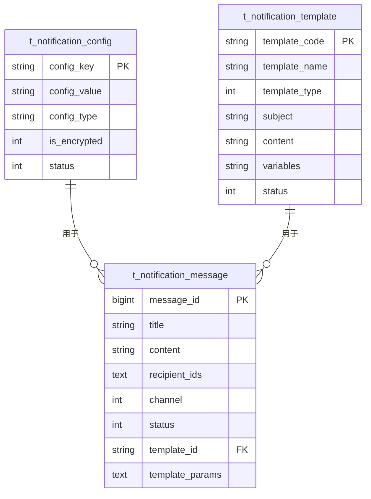

# 系统配置与字典表设计

<cite>
**本文档引用文件**  
- [16-t_system_config.sql](file://database-scripts/common-service/16-t_system_config.sql)
- [17-t_system_dict.sql](file://database-scripts/common-service/17-t_system_dict.sql)
- [07-t_notification_message.sql](file://database-scripts/common-service/07-t_notification_message.sql)
- [08-t_notification_template.sql](file://database-scripts/common-service/08-t_notification_template.sql)
- [09-t_notification_config.sql](file://database-scripts/common-service/09-t_notification_config.sql)
- [README.md](file://docs/COMMON_MODULES/README.md)
- [COMMON_MODULES_ANALYSIS.md](file://docs/COMMON_MODULES_ANALYSIS.md)
- [通知系统README.md](file://documentation/03-业务模块/通知系统README.md)
- [通知系统使用指南.md](file://documentation/03-业务模块/通知系统使用指南.md)
- [通知系统深度分析报告.md](file://documentation/03-业务模块/通知系统深度分析报告.md)
- [NotificationConfigEntity.java](file://microservices/microservices-common/src/main/java/net/lab1024/sa/common/notification/domain/entity/NotificationConfigEntity.java)
- [NotificationTemplateEntity.java](file://microservices/microservices-common/src/main/java/net/lab1024/sa/common/notification/domain/entity/NotificationTemplateEntity.java)
- [NotificationConfigType.java](file://microservices/microservices-common/src/main/java/net/lab1024/sa/common/notification/constant/NotificationConfigType.java)
- [NotificationConfigManager.java](file://microservices/microservices-common/src/main/java/net/lab1024/sa/common/notification/manager/NotificationConfigManager.java)
- [NotificationTemplateManager.java](file://microservices/microservices-common/src/main/java/net/lab1024/sa/common/notification/manager/NotificationTemplateManager.java)
- [t_system_config.sql](file://database-scripts/common-service/16-t_system_config.sql)
- [t_system_dict.sql](file://database-scripts/common-service/17-t_system_dict.sql)
</cite>

## 目录
1. [系统配置表设计](#系统配置表设计)
2. [数据字典表设计](#数据字典表设计)
3. [通知中心表设计](#通知中心表设计)
4. [微服务公共模块复用机制](#微服务公共模块复用机制)
5. [配置项使用示例](#配置项使用示例)

## 系统配置表设计

`t_system_config` 表采用键值对（Key-Value）模式进行设计，用于存储系统运行时的动态参数，支持灵活的配置管理。该表通过 `config_key` 字段作为唯一标识，`config_value` 存储配置值，实现了对系统参数的集中化管理。

表结构包含以下关键字段：
- `config_key`：配置键，作为唯一标识符，用于程序中引用配置项。
- `config_value`：配置值，存储实际的配置内容，支持字符串、数字、布尔值和JSON等多种数据类型。
- `config_type`：配置类型，明确配置值的数据类型，确保类型安全。
- `config_group`：配置分组，用于对配置项进行分类管理，如“邮件设置”、“安全设置”等。
- `is_encrypted`：是否加密，用于标记敏感配置（如密码、密钥）是否已加密存储。
- `is_system`：是否为系统配置，区分系统级配置和用户级配置。
- `status`：状态，控制配置项的启用或禁用。

这种设计模式使得系统可以在不重启服务的情况下动态调整参数，例如修改邮件服务器地址、调整超时时间或启用/禁用特定功能，极大地提高了系统的灵活性和可维护性。

**Section sources**
- [16-t_system_config.sql](file://database-scripts/common-service/16-t_system_config.sql)

## 数据字典表设计

`t_system_dict` 表用于管理系统的数据字典，采用扁平化的单表设计，通过 `dict_type` 字段实现分类，`dict_label` 和 `dict_value` 字段存储字典的标签和值。该设计支持对系统中所有枚举值、状态码、类型码等进行统一管理。

表结构包含以下关键字段：
- `dict_type`：字典类型，用于对字典项进行分类，如“用户状态”、“设备类型”等。
- `dict_label`：字典标签，用于在前端界面显示的可读性文本。
- `dict_value`：字典值，用于程序中处理的实际值。
- `dict_sort`：字典排序，用于控制字典项在列表中的显示顺序。
- `is_default`：是否默认，标记某个字典项是否为默认选项。
- `status`：状态，控制字典项的启用或禁用。

该设计通过 `dict_type` 实现了逻辑上的层级结构，虽然物理上是单表，但逻辑上可以形成“类型-条目”的两级结构。例如，`dict_type` 为 "USER_STATUS" 的所有记录构成“用户状态”字典，其下的 `dict_label` 和 `dict_value` 分别代表“启用”、“禁用”等具体状态。这种设计简化了数据库结构，同时满足了前端下拉框、状态显示等业务需求。

**Section sources**
- [17-t_system_dict.sql](file://database-scripts/common-service/17-t_system_dict.sql)

## 通知中心表设计

通知中心由三张核心表构成：`t_notification_message`（通知消息表）、`t_notification_template`（通知模板表）和 `t_notification_config`（通知配置表）。这三张表通过数据流转协同工作，支持多渠道通知（如站内信、邮件、短信等）。

### 通知消息表 (t_notification_message)
该表存储具体的、已发送或待发送的通知消息实例。关键字段包括：
- `message_type`：消息类型，区分系统通知、业务通知等。
- `title` 和 `content`：消息的标题和内容。
- `recipient_type` 和 `recipient_ids`：定义接收人类型（指定用户、角色等）和接收人ID列表。
- `channel`：发送渠道，明确消息通过站内信、邮件还是其他渠道发送。
- `status`：消息状态，跟踪消息的发送流程（待发送、发送中、已发送、发送失败）。
- `template_id` 和 `template_params`：关联模板ID和模板参数，实现消息内容的动态生成。

### 通知模板表 (t_notification_template)
该表存储可复用的消息模板，实现消息内容的标准化和动态化。关键字段包括：
- `template_code`：模板编码，作为模板的唯一标识，便于程序引用。
- `template_name`：模板名称，用于管理界面显示。
- `template_type`：模板类型，与发送渠道对应（如邮件、短信）。
- `subject`：主题，专用于邮件模板。
- `content`：模板内容，使用 `{{variable}}` 语法定义变量。
- `variables`：变量列表，以JSON格式存储模板中定义的所有变量名。

### 通知配置表 (t_notification_config)
该表存储各通知渠道的连接和认证配置，实现配置的集中化和安全化。关键字段包括：
- `config_key`：配置键，唯一标识一个配置项，如 `EMAIL.SMTP_HOST`。
- `config_value`：配置值，存储实际的配置信息。
- `config_type`：配置类型，对配置进行分类，如 `EMAIL`、`SMS`、`DINGTALK`。
- `is_encrypted`：是否加密，确保敏感信息（如密码、密钥）的安全。

### 数据流转与多渠道支持
三张表的数据流转如下：
1.  **配置管理**：管理员在 `t_notification_config` 表中配置各渠道的参数（如邮件服务器地址、钉钉Webhook URL）。
2.  **模板管理**：管理员在 `t_notification_template` 表中创建消息模板，定义内容和变量。
3.  **消息发送**：当业务需要发送通知时，系统根据业务类型选择模板，填充 `template_params`，并指定 `channel` 和 `recipient_ids`，生成一条 `t_notification_message` 记录。
4.  **消息处理**：通知服务读取 `t_notification_message`，根据 `channel` 获取 `t_notification_config` 中的配置，并使用 `template_params` 渲染 `t_notification_template` 的内容，最终通过指定渠道发送消息。

这种设计实现了配置、模板和消息实例的分离，使得系统可以轻松支持多渠道通知。只需在 `t_notification_config` 中添加新渠道的配置，并在 `t_notification_template` 中创建对应类型的模板，即可扩展新的通知方式。



**Diagram sources**
- [07-t_notification_message.sql](file://database-scripts/common-service/07-t_notification_message.sql)
- [08-t_notification_template.sql](file://database-scripts/common-service/08-t_notification_template.sql)
- [09-t_notification_config.sql](file://database-scripts/common-service/09-t_notification_config.sql)

**Section sources**
- [07-t_notification_message.sql](file://database-scripts/common-service/07-t_notification_message.sql)
- [08-t_notification_template.sql](file://database-scripts/common-service/08-t_notification_template.sql)
- [09-t_notification_config.sql](file://database-scripts/common-service/09-t_notification_config.sql)
- [通知系统使用指南.md](file://documentation/03-业务模块/通知系统使用指南.md)
- [通知系统深度分析报告.md](file://documentation/03-业务模块/通知系统深度分析报告.md)

## 微服务公共模块复用机制

通知中心的三张表通过 `microservices-common` 模块被各业务服务复用。该模块是一个独立的JAR包，封装了与通知功能相关的实体类、数据访问层（DAO）、管理器（Manager）等公共组件。

### 复用实现方式
1.  **依赖引入**：各业务服务（如 `ioedream-access-service`、`ioedream-consume-service`）在 `pom.xml` 中添加对 `microservices-common` 模块的依赖。
2.  **实体类复用**：业务服务直接使用 `microservices-common` 中定义的 `NotificationConfigEntity` 和 `NotificationTemplateEntity` 等实体类，确保了数据模型的一致性。
3.  **服务层调用**：`microservices-common` 模块提供了 `NotificationConfigManager` 和 `NotificationTemplateManager` 等管理器类。这些管理器封装了对 `t_notification_config` 和 `t_notification_template` 表的CRUD操作、缓存管理、加密解密等复杂逻辑。
4.  **统一接口**：业务服务通过调用这些管理器提供的方法来获取配置或渲染模板，而无需关心底层的数据库操作和缓存细节。

例如，`NotificationConfigManager` 提供了 `getConfigValue(String configKey)` 方法，业务服务调用此方法时，管理器会自动处理从数据库查询、从缓存获取、解密（如果 `is_encrypted=1`）等一系列操作，最终返回明文的配置值。

这种设计模式确保了：
- **一致性**：所有服务使用同一套代码访问通知配置和模板，避免了代码重复和逻辑不一致。
- **安全性**：敏感配置的加密解密逻辑在公共模块中统一处理，降低了安全风险。
- **可维护性**：当需要修改配置获取逻辑（如更换缓存策略）时，只需修改 `microservices-common` 模块，所有依赖它的服务都能自动受益。


**Diagram sources**
- [NotificationConfigEntity.java](file://microservices/microservices-common/src/main/java/net/lab1024/sa/common/notification/domain/entity/NotificationConfigEntity.java)
- [NotificationTemplateEntity.java](file://microservices/microservices-common/src/main/java/net/lab1024/sa/common/notification/domain/entity/NotificationTemplateEntity.java)
- [NotificationConfigManager.java](file://microservices/microservices-common/src/main/java/net/lab1024/sa/common/notification/manager/NotificationConfigManager.java)
- [NotificationTemplateManager.java](file://microservices/microservices-common/src/main/java/net/lab1024/sa/common/notification/manager/NotificationTemplateManager.java)

**Section sources**
- [microservices-common](file://microservices/microservices-common)
- [pom.xml](file://microservices/microservices-common/pom.xml)
- [NotificationConfigType.java](file://microservices/microservices-common/src/main/java/net/lab1024/sa/common/notification/constant/NotificationConfigType.java)

## 配置项使用示例

以下是业务服务中使用通知配置和模板的典型代码示例：

### 获取通知配置
```java
// 通过依赖注入获取配置管理器
@Resource
private NotificationConfigManager notificationConfigManager;

// 获取钉钉Webhook URL配置
String webhookUrl = notificationConfigManager.getConfigValue("DINGTALK.WEBHOOK_URL");

// 获取邮件SMTP主机配置
String smtpHost = notificationConfigManager.getConfigValue("EMAIL.SMTP_HOST");
```

### 使用通知模板
```java
// 通过依赖注入获取模板管理器
@Resource
private NotificationTemplateManager notificationTemplateManager;

// 定义模板变量
Map<String, Object> variables = new HashMap<>();
variables.put("userName", "张三");
variables.put("loginTime", LocalDateTime.now().format(DateTimeFormatter.ofPattern("yyyy-MM-dd HH:mm:ss")));

// 渲染模板内容
String content = notificationTemplateManager.renderTemplate("EMAIL_LOGIN_SUCCESS", variables);
// 渲染后的结果: "尊敬的张三，您于2025-12-06 10:00:00成功登录系统。"

// 渲染邮件主题
String subject = notificationTemplateManager.renderSubject("EMAIL_LOGIN_SUCCESS", variables);
```

**Section sources**
- [通知系统使用指南.md](file://documentation/03-业务模块/通知系统使用指南.md)
- [NotificationTemplateManager.java](file://microservices/microservices-common/src/main/java/net/lab1024/sa/common/notification/manager/NotificationTemplateManager.java)
- [NotificationConfigManager.java](file://microservices/microservices-common/src/main/java/net/lab1024/sa/common/notification/manager/NotificationConfigManager.java)