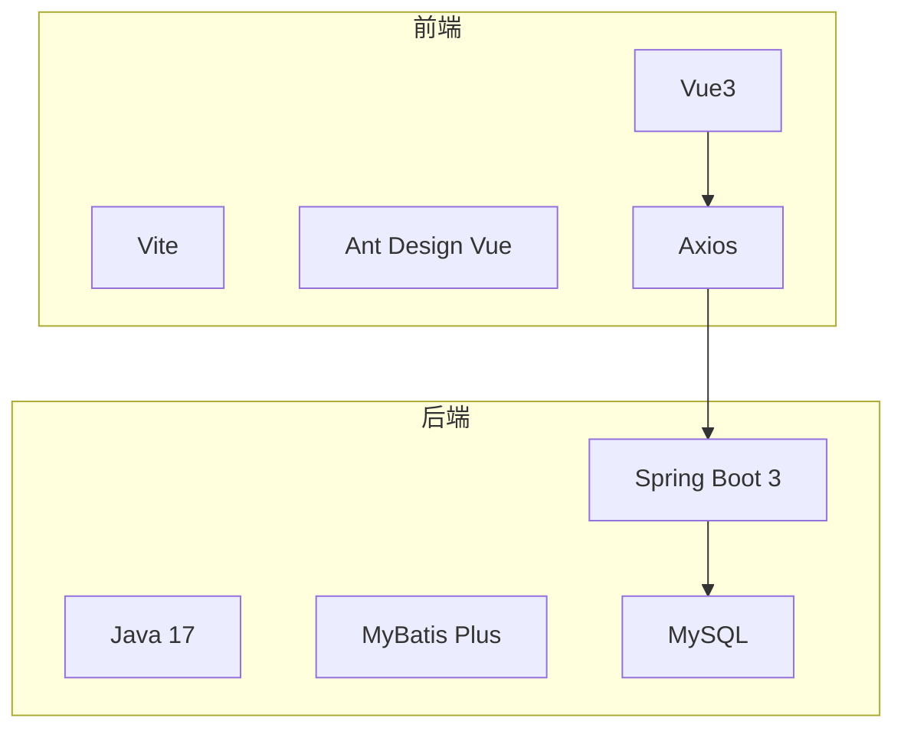
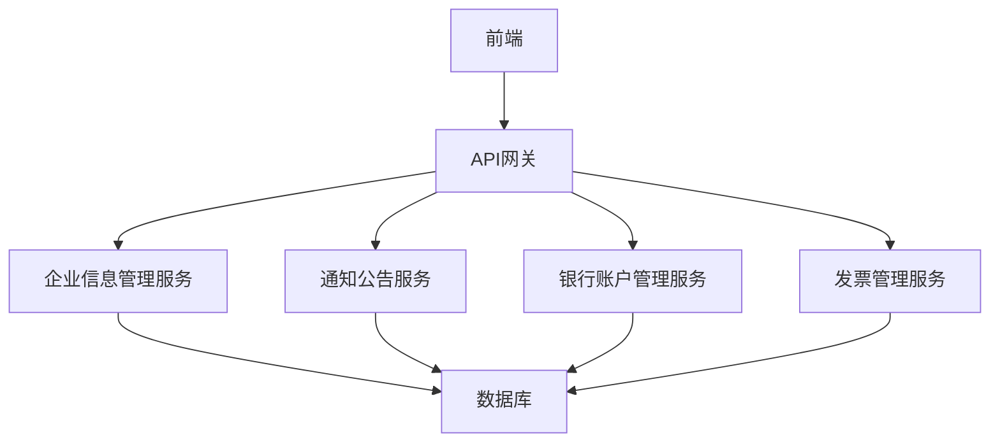
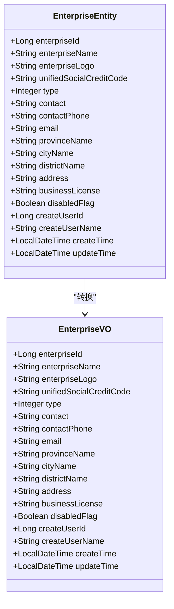
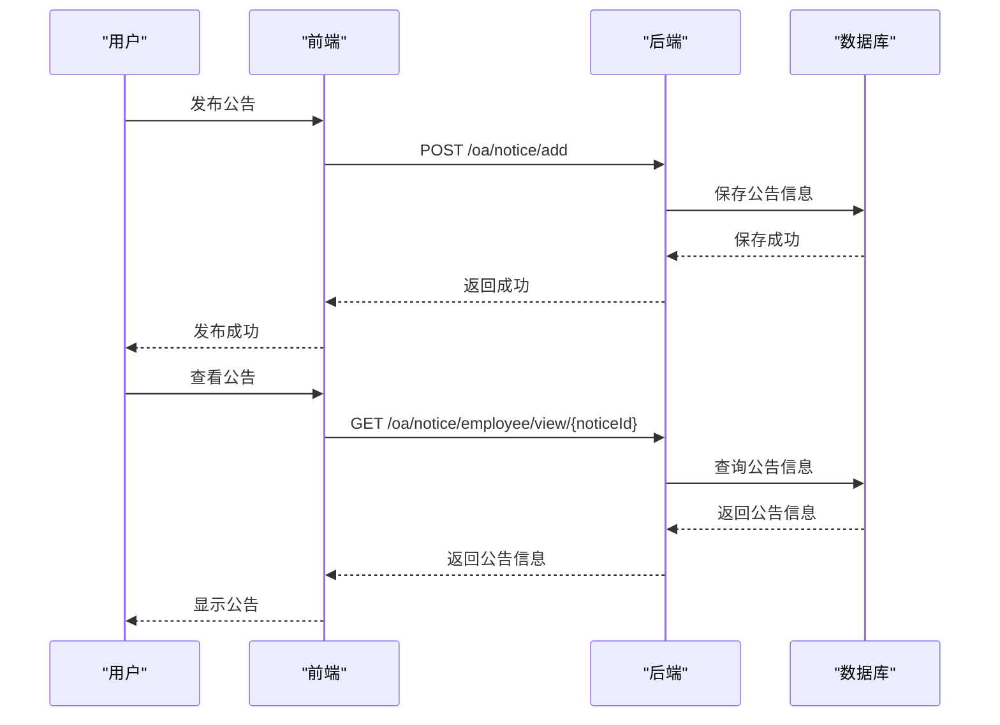
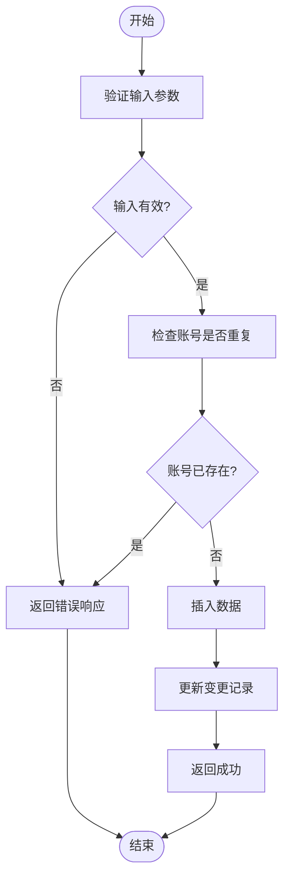
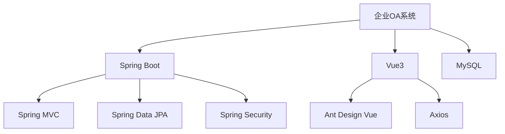

# 企业OA系统

<cite>
**本文档引用的文件**   
- [enterprise-api.js](file://smart-admin-web-javascript/src/api/business/oa/enterprise-api.js)
- [notice-api.js](file://smart-admin-web-javascript/src/api/business/oa/notice-api.js)
- [bank-api.js](file://smart-admin-web-javascript/src/api/business/oa/bank-api.js)
- [invoice-api.js](file://smart-admin-web-javascript/src/api/business/oa/invoice-api.js)
- [EnterpriseEntity.java](file://smart-admin-api-java17-springboot3/sa-admin/src/main/java/net/lab1024/sa/admin/module/business/oa/enterprise/domain/entity/EnterpriseEntity.java)
- [EnterpriseVO.java](file://smart-admin-api-java17-springboot3/sa-admin/src/main/java/net/lab1024/sa/admin/module/business/oa/enterprise/domain/vo/EnterpriseVO.java)
- [NoticeEntity.java](file://smart-admin-api-java17-springboot3/sa-admin/src/main/java/net/lab1024/sa/admin/module/business/oa/notice/domain/entity/NoticeEntity.java)
- [BankEntity.java](file://smart-admin-api-java17-springboot3/sa-admin/src/main/java/net/lab1024/sa/admin/module/business/oa/bank/domain/BankEntity.java)
- [BankVO.java](file://smart-admin-api-java17-springboot3/sa-admin/src/main/java/net/lab1024/sa/admin/module/business/oa/bank/domain/BankVO.java)
- [BankService.java](file://smart-admin-api-java17-springboot3/sa-admin/src/main/java/net/lab1024/sa/admin/module/business/oa/bank/service/BankService.java)
- [enterprise-list.vue](file://smart-admin-web-javascript/src/views/business/oa/enterprise/enterprise-list.vue)
- [enterprise-detail.vue](file://smart-admin-web-javascript/src/views/business/oa/enterprise/enterprise-detail.vue)
- [notice-list.vue](file://smart-admin-web-javascript/src/views/business/oa/notice/notice-list.vue)
- [notice-form-drawer.vue](file://smart-admin-web-javascript/src/views/business/oa/notice/components/notice-form-drawer.vue)
- [enterprise-const.js](file://smart-admin-web-javascript/src/constants/business/oa/enterprise-const.js)
</cite>

## 目录
1. [简介](#简介)
2. [项目结构](#项目结构)
3. [核心组件](#核心组件)
4. [架构概述](#架构概述)
5. [详细组件分析](#详细组件分析)
6. [依赖分析](#依赖分析)
7. [性能考虑](#性能考虑)
8. [故障排除指南](#故障排除指南)
9. [结论](#结论)
10. [附录](#附录)（如有必要）

## 简介
本文档详细说明了企业OA系统的功能模块，包括企业信息管理、通知公告、银行账户管理和发票管理。系统采用前后端分离架构，前端使用Vue3框架，后端基于Spring Boot 3和Java 17构建。系统提供了完整的企业信息管理功能，包括企业信息的增删改查、通知公告的发布与管理、银行账户和发票信息的管理等。通过权限控制机制，确保了数据的安全性和访问的合规性。

## 项目结构
企业OA系统采用模块化设计，分为前端和后端两个主要部分。后端基于Spring Boot 3框架，使用Java 17开发，采用Maven进行依赖管理。前端使用Vue3框架，配合Vite构建工具，实现了现代化的用户界面。系统通过RESTful API进行前后端通信，确保了系统的可扩展性和维护性。

**图源**
- [enterprise-api.js](file://smart-admin-web-javascript/src/api/business/oa/enterprise-api.js)
- [bank-api.js](file://smart-admin-web-javascript/src/api/business/oa/bank-api.js)

**章节源**
- [enterprise-api.js](file://smart-admin-web-javascript/src/api/business/oa/enterprise-api.js)
- [bank-api.js](file://smart-admin-web-javascript/src/api/business/oa/bank-api.js)

## 核心组件
企业OA系统的核心组件包括企业信息管理、通知公告、银行账户管理和发票管理。这些组件通过RESTful API进行交互，实现了企业信息的全面管理。企业信息管理模块负责维护企业基本信息，包括企业名称、统一社会信用代码、联系人等。通知公告模块支持公告的发布、查看和阅读状态跟踪。银行账户和发票管理模块则提供了金融信息的管理功能。

**章节源**
- [EnterpriseEntity.java](file://smart-admin-api-java17-springboot3/sa-admin/src/main/java/net/lab1024/sa/admin/module/business/oa/enterprise/domain/entity/EnterpriseEntity.java)
- [NoticeEntity.java](file://smart-admin-api-java17-springboot3/sa-admin/src/main/java/net/lab1024/sa/admin/module/business/oa/notice/domain/entity/NoticeEntity.java)

## 架构概述
企业OA系统采用分层架构设计，包括表现层、业务逻辑层和数据访问层。表现层负责用户界面的展示和用户交互，业务逻辑层处理核心业务逻辑，数据访问层负责与数据库的交互。系统通过Spring Security实现权限控制，确保了数据的安全性。前后端通过RESTful API进行通信，API设计遵循REST原则，确保了系统的可扩展性和维护性。

**图源**
- [BankService.java](file://smart-admin-api-java17-springboot3/sa-admin/src/main/java/net/lab1024/sa/admin/module/business/oa/bank/service/BankService.java)
- [EnterpriseEntity.java](file://smart-admin-api-java17-springboot3/sa-admin/src/main/java/net/lab1024/sa/admin/module/business/oa/enterprise/domain/entity/EnterpriseEntity.java)

## 详细组件分析
### 企业信息管理分析
企业信息管理模块是系统的核心功能之一，负责维护企业基本信息。模块提供了企业信息的增删改查功能，支持企业信息的分页查询和导出。企业信息包括企业名称、统一社会信用代码、联系人、联系方式等字段。系统通过数据验证确保了信息的准确性和完整性。

**图源**
- [EnterpriseEntity.java](file://smart-admin-api-java17-springboot3/sa-admin/src/main/java/net/lab1024/sa/admin/module/business/oa/enterprise/domain/entity/EnterpriseEntity.java)
- [EnterpriseVO.java](file://smart-admin-api-java17-springboot3/sa-admin/src/main/java/net/lab1024/sa/admin/module/business/oa/enterprise/domain/vo/EnterpriseVO.java)

**章节源**
- [enterprise-list.vue](file://smart-admin-web-javascript/src/views/business/oa/enterprise/enterprise-list.vue)
- [enterprise-detail.vue](file://smart-admin-web-javascript/src/views/business/oa/enterprise/enterprise-detail.vue)

### 通知公告分析
通知公告模块支持公告的发布、查看和阅读状态跟踪。系统提供了公告的分类管理，支持定时发布和全部可见设置。公告内容支持HTML格式，可以包含附件。系统通过阅读记录跟踪机制，确保了公告的传达效果。

**图源**
- [notice-api.js](file://smart-admin-web-javascript/src/api/business/oa/notice-api.js)
- [NoticeEntity.java](file://smart-admin-api-java17-springboot3/sa-admin/src/main/java/net/lab1024/sa/admin/module/business/oa/notice/domain/entity/NoticeEntity.java)

**章节源**
- [notice-list.vue](file://smart-admin-web-javascript/src/views/business/oa/notice/notice-list.vue)
- [notice-form-drawer.vue](file://smart-admin-web-javascript/src/views/business/oa/notice/components/notice-form-drawer.vue)

### 银行账户管理分析
银行账户管理模块提供了银行信息的增删改查功能。系统支持银行信息的分页查询，可以根据企业ID查询银行列表。银行信息包括开户银行、账户名称、账号、是否对公等字段。系统通过数据验证确保了银行信息的准确性和唯一性。

**图源**
- [BankService.java](file://smart-admin-api-java17-springboot3/sa-admin/src/main/java/net/lab1024/sa/admin/module/business/oa/bank/service/BankService.java)
- [BankEntity.java](file://smart-admin-api-java17-springboot3/sa-admin/src/main/java/net/lab1024/sa/admin/module/business/oa/bank/domain/BankEntity.java)

**章节源**
- [bank-api.js](file://smart-admin-web-javascript/src/api/business/oa/bank-api.js)
- [BankService.java](file://smart-admin-api-java17-springboot3/sa-admin/src/main/java/net/lab1024/sa/admin/module/business/oa/bank/service/BankService.java)

### 发票管理分析
发票管理模块提供了发票信息的增删改查功能。系统支持发票信息的分页查询，可以根据企业ID查询发票列表。发票信息包括发票抬头、税号、开户行、账号等字段。系统通过数据验证确保了发票信息的准确性和完整性。

**章节源**
- [invoice-api.js](file://smart-admin-web-javascript/src/api/business/oa/invoice-api.js)

## 依赖分析
企业OA系统采用了模块化设计，各模块之间通过清晰的接口进行交互。系统依赖于Spring Boot框架提供的各种功能，包括Spring MVC、Spring Data JPA、Spring Security等。前端依赖于Vue3框架和Ant Design Vue组件库。系统通过Maven和npm进行依赖管理，确保了依赖的版本一致性和可维护性。

**图源**
- [pom.xml](file://smart-admin-api-java17-springboot3/sa-admin/pom.xml)
- [package.json](file://smart-admin-web-javascript/package.json)

**章节源**
- [pom.xml](file://smart-admin-api-java17-springboot3/sa-admin/pom.xml)
- [package.json](file://smart-admin-web-javascript/package.json)

## 性能考虑
企业OA系统在设计时充分考虑了性能因素。后端采用了MyBatis Plus作为ORM框架，通过分页查询和缓存机制提高了数据访问性能。前端采用了Vue3的响应式系统，通过虚拟DOM和组件化设计提高了界面渲染性能。系统还通过CDN加速静态资源的加载，提高了用户体验。

## 故障排除指南
当系统出现故障时，可以按照以下步骤进行排查：
1. 检查网络连接是否正常
2. 检查后端服务是否正常运行
3. 检查数据库连接是否正常
4. 查看日志文件，定位错误信息
5. 根据错误信息进行相应的修复

**章节源**
- [logback-spring.xml](file://smart-admin-api-java17-springboot3/sa-admin/src/main/resources/logback-spring.xml)

## 结论
企业OA系统提供了一套完整的企业信息管理解决方案，涵盖了企业信息管理、通知公告、银行账户管理和发票管理等功能。系统采用现代化的技术栈，具有良好的可扩展性和维护性。通过权限控制和数据验证机制，确保了数据的安全性和准确性。系统的设计充分考虑了用户体验，提供了友好的用户界面和流畅的操作体验。

## 附录
### API接口规范
| 接口 | 方法 | 描述 |
| --- | --- | --- |
| /oa/enterprise/create | POST | 创建企业 |
| /oa/enterprise/delete/{enterpriseId} | GET | 删除企业 |
| /oa/enterprise/get/{enterpriseId} | GET | 获取企业详情 |
| /oa/enterprise/page/query | POST | 分页查询企业 |
| /oa/enterprise/exportExcel | POST | 导出企业数据 |
| /oa/enterprise/query/list | GET | 查询企业列表 |
| /oa/enterprise/update | POST | 更新企业信息 |

### 数据模型设计
#### 企业信息模型
- **enterpriseId**: 企业ID (Long)
- **enterpriseName**: 企业名称 (String)
- **enterpriseLogo**: 企业logo (String)
- **unifiedSocialCreditCode**: 统一社会信用代码 (String)
- **type**: 类型 (Integer)
- **contact**: 联系人 (String)
- **contactPhone**: 联系人电话 (String)
- **email**: 邮箱 (String)
- **provinceName**: 省份名称 (String)
- **cityName**: 城市名称 (String)
- **districtName**: 区县名称 (String)
- **address**: 详细地址 (String)
- **businessLicense**: 营业执照 (String)
- **disabledFlag**: 禁用状态 (Boolean)
- **createUserId**: 创建人ID (Long)
- **createUserName**: 创建人名称 (String)
- **createTime**: 创建时间 (LocalDateTime)
- **updateTime**: 更新时间 (LocalDateTime)

#### 银行账户模型
- **bankId**: 银行信息ID (Long)
- **bankName**: 开户银行 (String)
- **accountName**: 账户名称 (String)
- **accountNumber**: 账号 (String)
- **remark**: 备注 (String)
- **businessFlag**: 是否对公 (Boolean)
- **enterpriseId**: 企业ID (Long)
- **enterpriseName**: 企业名称 (String)
- **disabledFlag**: 禁用状态 (Boolean)
- **createUserId**: 创建人ID (Long)
- **createUserName**: 创建人名称 (String)
- **createTime**: 创建时间 (LocalDateTime)
- **updateTime**: 更新时间 (LocalDateTime)