# 通知公告系统

<cite>
**本文档引用的文件**  
- [NoticeController.java](file://smart-admin-api-java17-springboot3/sa-admin/src/main/java/net/lab1024/sa/admin/module/business/oa/notice/controller/NoticeController.java)
- [NoticeService.java](file://smart-admin-api-java17-springboot3/sa-admin/src/main/java/net/lab1024/sa/admin/module/business/oa/notice/service/NoticeService.java)
- [NoticeEntity.java](file://smart-admin-api-java17-springboot3/sa-admin/src/main/java/net/lab1024/sa/admin/module/business/oa/notice/domain/entity/NoticeEntity.java)
- [notice-list.vue](file://smart-admin-web-javascript/src/views/business/oa/notice/notice-list.vue)
- [notice-detail.vue](file://smart-admin-web-javascript/src/views/business/oa/notice/notice-detail.vue)
- [notice-form-drawer.vue](file://smart-admin-web-javascript/src/views/business/oa/notice/components/notice-form-drawer.vue)
- [NoticeVisibleRangeForm.java](file://smart-admin-api-java17-springboot3/sa-admin/src/main/java/net/lab1024/sa/admin/module/business/oa/notice/domain/form/NoticeVisibleRangeForm.java)
- [NoticeViewRecordVO.java](file://smart-admin-api-java17-springboot3/sa-admin/src/main/java/net/lab1024/sa/admin/module/business/oa/notice/domain/vo/NoticeViewRecordVO.java)
- [notice-const.js](file://smart-admin-web-javascript/src/constants/business/oa/notice-const.js)
- [NoticeTypeService.java](file://smart-admin-api-java17-springboot3/sa-admin/src/main/java/net/lab1024/sa/admin/module/business/oa/notice/service/NoticeTypeService.java)
</cite>

## 目录
1. [系统概述](#系统概述)
2. [核心组件分析](#核心组件分析)
3. [API端点设计与实现](#api端点设计与实现)
4. [业务逻辑处理](#业务逻辑处理)
5. [数据结构与持久化](#数据结构与持久化)
6. [前端组件分析](#前端组件分析)
7. [可见范围控制机制](#可见范围控制机制)
8. [高级功能说明](#高级功能说明)
9. [阅读记录跟踪](#阅读记录跟踪)
10. [总结](#总结)

## 系统概述

通知公告系统是一个完整的OA功能模块，提供通知的创建、发布、查看和管理功能。系统采用前后端分离架构，后端基于Spring Boot框架实现，前端使用Vue3技术栈。系统支持通知的增删改查、状态变更、可见范围设置、阅读状态跟踪等核心功能，同时提供通知模板管理、批量发送、定时发布等高级功能。

系统主要包含三个核心层次：控制器层（Controller）、服务层（Service）和数据访问层（DAO），以及对应的前端展示组件。通过合理的分层设计，实现了业务逻辑的解耦和代码的可维护性。

## 核心组件分析

通知公告系统由多个核心组件构成，包括控制器、服务、实体、视图对象和前端组件。这些组件协同工作，共同实现通知公告的完整生命周期管理。

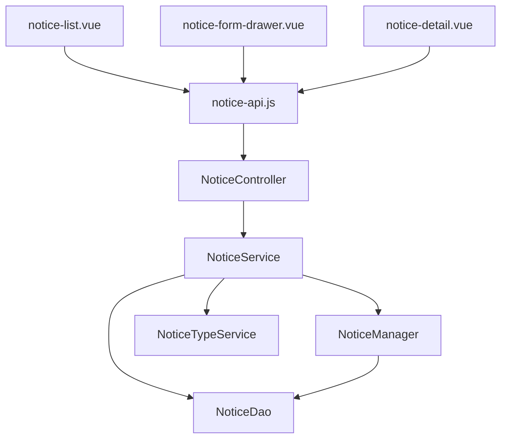

**组件来源**
- [NoticeController.java](file://smart-admin-api-java17-springboot3/sa-admin/src/main/java/net/lab1024/sa/admin/module/business/oa/notice/controller/NoticeController.java)
- [NoticeService.java](file://smart-admin-api-java17-springboot3/sa-admin/src/main/java/net/lab1024/sa/admin/module/business/oa/notice/service/NoticeService.java)
- [notice-list.vue](file://smart-admin-web-javascript/src/views/business/oa/notice/notice-list.vue)
- [notice-form-drawer.vue](file://smart-admin-web-javascript/src/views/business/oa/notice/components/notice-form-drawer.vue)
- [notice-detail.vue](file://smart-admin-web-javascript/src/views/business/oa/notice/notice-detail.vue)

## API端点设计与实现

通知公告系统的API端点设计遵循RESTful规范，通过不同的HTTP方法和路径来实现各种操作。系统提供了管理端和员工端两套API接口，分别满足不同的使用场景。

### 管理端API端点

管理端API主要用于通知的创建、编辑、删除和查询管理，需要相应的权限才能访问。

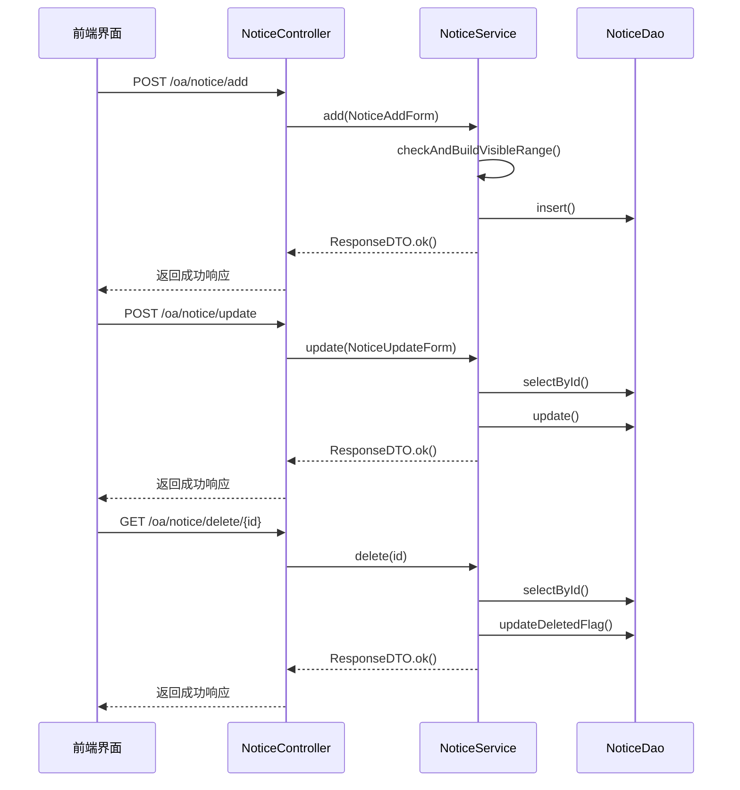

**API来源**
- [NoticeController.java](file://smart-admin-api-java17-springboot3/sa-admin/src/main/java/net/lab1024/sa/admin/module/business/oa/notice/controller/NoticeController.java#L74-L113)
- [NoticeService.java](file://smart-admin-api-java17-springboot3/sa-admin/src/main/java/net/lab1024/sa/admin/module/business/oa/notice/service/NoticeService.java#L86-L198)

### 员工端API端点

员工端API主要用于通知的查看和阅读记录查询，允许员工查看自己有权访问的通知内容。

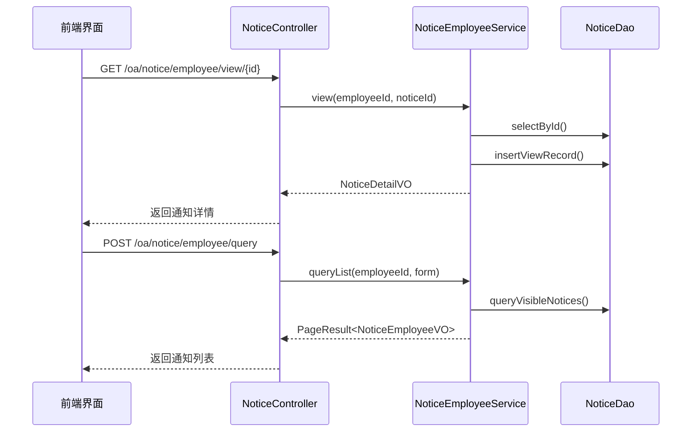

**API来源**
- [NoticeController.java](file://smart-admin-api-java17-springboot3/sa-admin/src/main/java/net/lab1024/sa/admin/module/business/oa/notice/controller/NoticeController.java#L115-L138)
- [NoticeEmployeeService.java](file://smart-admin-api-java17-springboot3/sa-admin/src/main/java/net/lab1024/sa/admin/module/business/oa/notice/service/NoticeEmployeeService.java#L50-L100)

## 业务逻辑处理

通知公告系统的业务逻辑主要集中在NoticeService和NoticeManager类中，处理通知的创建、更新、删除和查询等核心操作。

### 通知发布流程

通知发布流程包括数据验证、可见范围校验、数据保存等步骤，确保通知数据的完整性和正确性。

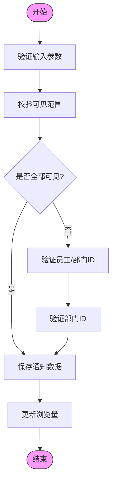

**业务逻辑来源**
- [NoticeService.java](file://smart-admin-api-java17-springboot3/sa-admin/src/main/java/net/lab1024/sa/admin/module/business/oa/notice/service/NoticeService.java#L86-L105)
- [NoticeManager.java](file://smart-admin-api-java17-springboot3/sa-admin/src/main/java/net/lab1024/sa/admin/module/business/oa/notice/manager/NoticeManager.java#L15-L30)

### 阅读状态跟踪

系统通过记录员工的查看行为来跟踪通知的阅读状态，为管理者提供通知传达效果的评估依据。

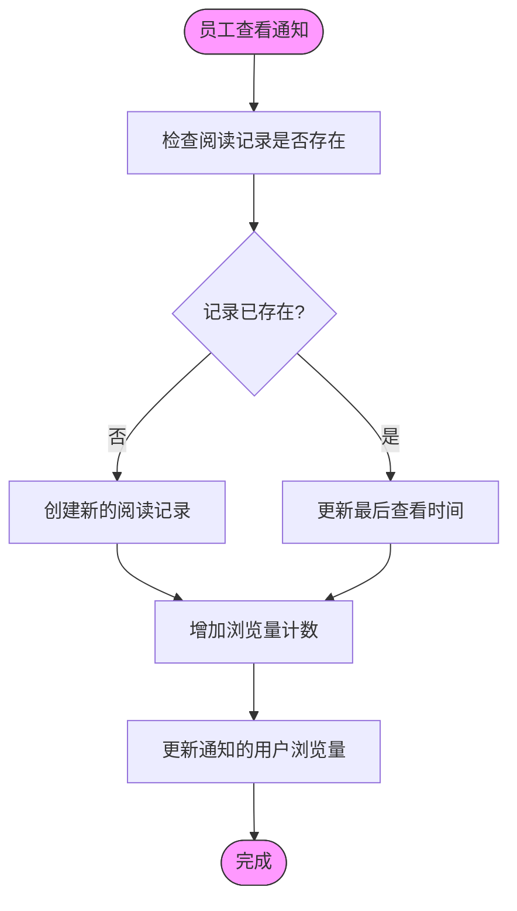

**阅读跟踪来源**
- [NoticeEmployeeService.java](file://smart-admin-api-java17-springboot3/sa-admin/src/main/java/net/lab1024/sa/admin/module/business/oa/notice/service/NoticeEmployeeService.java#L100-L150)
- [NoticeDao.java](file://smart-admin-api-java17-springboot3/sa-admin/src/main/java/net/lab1024/sa/admin/module/business/oa/notice/dao/NoticeDao.java#L50-L80)

### 通知类型管理

系统支持通知类型的管理，允许管理员添加、修改和删除通知类型，为不同类型的公告提供分类支持。

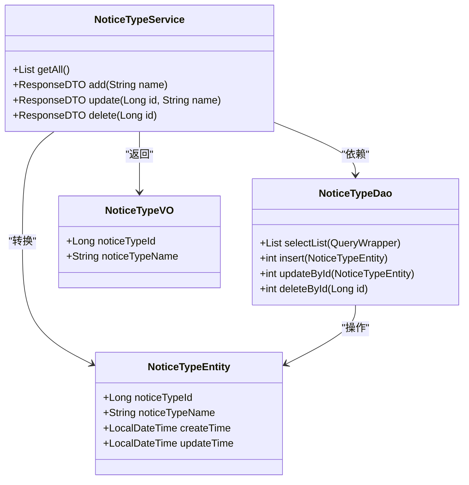

**类型管理来源**
- [NoticeTypeService.java](file://smart-admin-api-java17-springboot3/sa-admin/src/main/java/net/lab1024/sa/admin/module/business/oa/notice/service/NoticeTypeService.java)
- [NoticeTypeDao.java](file://smart-admin-api-java17-springboot3/sa-admin/src/main/java/net/lab1024/sa/admin/module/business/oa/notice/dao/NoticeTypeDao.java)
- [NoticeTypeEntity.java](file://smart-admin-api-java17-springboot3/sa-admin/src/main/java/net/lab1024/sa/admin/module/business/oa/notice/domain/entity/NoticeTypeEntity.java)

## 数据结构与持久化

通知公告系统的数据结构设计合理，通过多个实体类来表示不同的业务对象，并通过MyBatis-Plus框架实现数据的持久化操作。

### NoticeEntity数据结构

NoticeEntity是通知的核心实体类，包含了通知的所有属性信息。

```mermaid
classDiagram
class NoticeEntity {
+Long noticeId
+Long noticeTypeId
+String title
+Boolean allVisibleFlag
+Boolean scheduledPublishFlag
+LocalDateTime publishTime
+String contentText
+String contentHtml
+String attachment
+Integer pageViewCount
+Integer userViewCount
+String source
+String author
+String documentNumber
+Boolean deletedFlag
+Long createUserId
+LocalDateTime updateTime
+LocalDateTime createTime
}
note right of NoticeEntity
数据表 : t_notice
主键 : noticeId (自增)
逻辑删除 : deletedFlag
end note
```

**数据结构来源**
- [NoticeEntity.java](file://smart-admin-api-java17-springboot3/sa-admin/src/main/java/net/lab1024/sa/admin/module/business/oa/notice/domain/entity/NoticeEntity.java)

### 持久化机制

系统使用MyBatis-Plus作为ORM框架，通过DAO接口与数据库进行交互，实现了数据的增删改查操作。

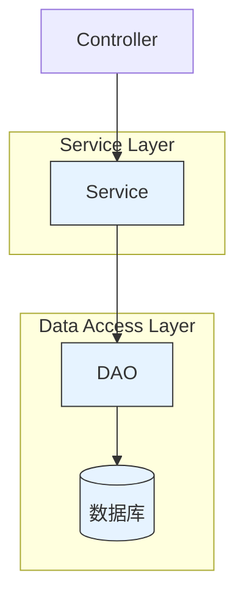

**持久化来源**
- [NoticeDao.java](file://smart-admin-api-java17-springboot3/sa-admin/src/main/java/net/lab1024/sa/admin/module/business/oa/notice/dao/NoticeDao.java)
- [NoticeEntity.java](file://smart-admin-api-java17-springboot3/sa-admin/src/main/java/net/lab1024/sa/admin/module/business/oa/notice/domain/entity/NoticeEntity.java)

## 前端组件分析

通知公告系统的前端组件采用Vue3框架开发，通过组件化的方式实现了界面的模块化和复用。

### 组件结构

系统前端主要由三个核心组件构成：通知列表、通知详情和通知表单抽屉。

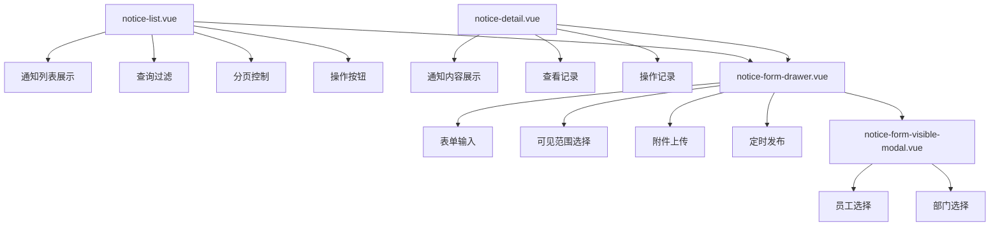

**组件结构来源**
- [notice-list.vue](file://smart-admin-web-javascript/src/views/business/oa/notice/notice-list.vue)
- [notice-detail.vue](file://smart-admin-web-javascript/src/views/business/oa/notice/notice-detail.vue)
- [notice-form-drawer.vue](file://smart-admin-web-javascript/src/views/business/oa/notice/components/notice-form-drawer.vue)
- [notice-form-visible-modal.vue](file://smart-admin-web-javascript/src/views/business/oa/notice/components/notice-form-visible-modal.vue)

### 数据绑定

前端组件通过Vue的响应式系统实现了数据的双向绑定，确保界面与数据的一致性。

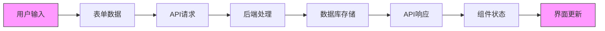

**数据绑定来源**
- [notice-form-drawer.vue](file://smart-admin-web-javascript/src/views/business/oa/notice/components/notice-form-drawer.vue#L147-L164)
- [notice-list.vue](file://smart-admin-web-javascript/src/views/business/oa/notice/notice-list.vue#L159-L160)

### 用户交互流程

系统提供了完整的用户交互流程，从通知创建到查看的各个环节都有清晰的用户指引。

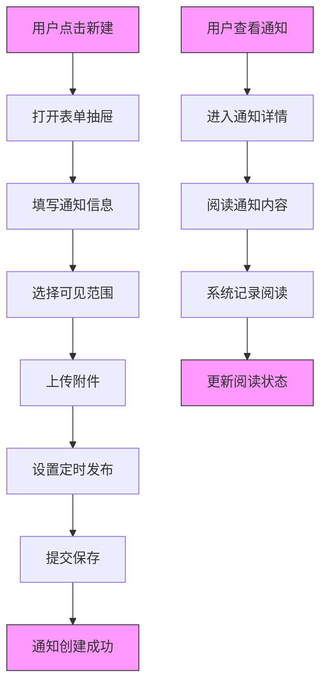

**交互流程来源**
- [notice-list.vue](file://smart-admin-web-javascript/src/views/business/oa/notice/notice-list.vue#L307-L313)
- [notice-form-drawer.vue](file://smart-admin-web-javascript/src/views/business/oa/notice/components/notice-form-drawer.vue#L198-L233)
- [notice-detail.vue](file://smart-admin-web-javascript/src/views/business/oa/notice/notice-detail.vue#L91-L102)

## 可见范围控制机制

通知公告系统提供了灵活的可见范围控制机制，允许管理员精确控制通知的受众范围。

### NoticeVisibleRangeForm设计

NoticeVisibleRangeForm类用于表示通知的可见范围配置，支持员工和部门两种数据类型。

```mermaid
classDiagram
class NoticeVisibleRangeForm {
+Integer dataType
+Long dataId
}
class NoticeVisibleRangeDataTypeEnum {
+EMPLOYEE(1, "员工")
+DEPARTMENT(2, "部门")
}
NoticeVisibleRangeForm --> NoticeVisibleRangeDataTypeEnum : "引用"
note right of NoticeVisibleRangeForm
dataType : 数据类型(1-员工,2-部门)
dataId : 员工ID或部门ID
end note
```

**可见范围来源**
- [NoticeVisibleRangeForm.java](file://smart-admin-api-java17-springboot3/sa-admin/src/main/java/net/lab1024/sa/admin/module/business/oa/notice/domain/form/NoticeVisibleRangeForm.java)
- [NoticeVisibleRangeDataTypeEnum.java](file://smart-admin-api-java17-springboot3/sa-admin/src/main/java/net/lab1024/sa/admin/module/business/oa/notice/constant/NoticeVisibleRangeDataTypeEnum.java)

### 配置方法

系统提供了两种可见范围配置方法：全部可见和部分可见。

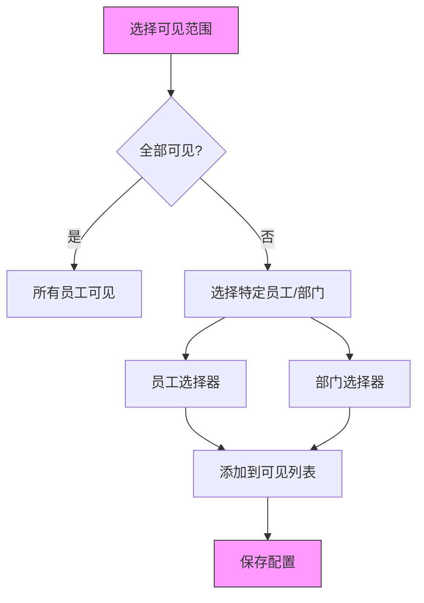

**配置方法来源**
- [notice-const.js](file://smart-admin-web-javascript/src/constants/business/oa/notice-const.js)
- [notice-form-drawer.vue](file://smart-admin-web-javascript/src/views/business/oa/notice/components/notice-form-drawer.vue#L39-L44)

## 高级功能说明

通知公告系统提供了多种高级功能，满足复杂的业务需求。

### 通知模板管理

系统支持通知模板的创建和使用，提高通知发布的效率。

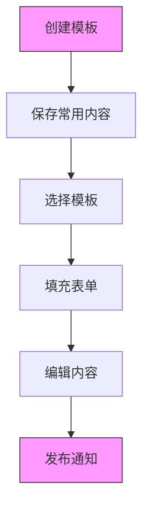

### 批量发送

系统支持批量发送通知，可以同时向多个员工或部门发送相同的通知。

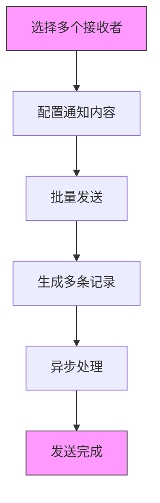

### 定时发布

系统支持定时发布功能，可以在指定时间自动发布通知。

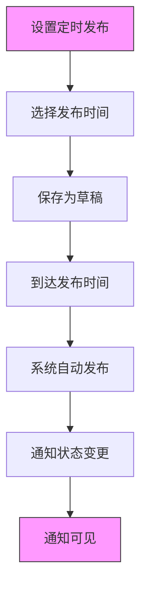

**高级功能来源**
- [NoticeEntity.java](file://smart-admin-api-java17-springboot3/sa-admin/src/main/java/net/lab1024/sa/admin/module/business/oa/notice/domain/entity/NoticeEntity.java#L41-L45)
- [notice-form-drawer.vue](file://smart-admin-web-javascript/src/views/business/oa/notice/components/notice-form-drawer.vue#L56-L74)

## 阅读记录跟踪

系统提供了完善的阅读记录跟踪功能，帮助管理者了解通知的传达效果。

### 数据结构

阅读记录通过NoticeViewRecordVO类来表示，包含详细的查看信息。

```mermaid
classDiagram
class NoticeViewRecordVO {
+Long employeeId
+String employeeName
+String departmentName
+Integer pageViewCount
+String firstIp
+String firstUserAgent
+LocalDateTime createTime
+String lastIp
+String lastUserAgent
+LocalDateTime updateTime
}
note right of NoticeViewRecordVO
记录员工查看通知的详细信息
包括首次和最后一次查看
支持设备信息识别
end note
```

**阅读记录来源**
- [NoticeViewRecordVO.java](file://smart-admin-api-java17-springboot3/sa-admin/src/main/java/net/lab1024/sa/admin/module/business/oa/notice/domain/vo/NoticeViewRecordVO.java)
- [notice-view-record-list.vue](file://smart-admin-web-javascript/src/views/business/oa/notice/components/notice-view-record-list.vue)

### 查询功能

系统提供了灵活的阅读记录查询功能，支持按部门、关键字等条件筛选。

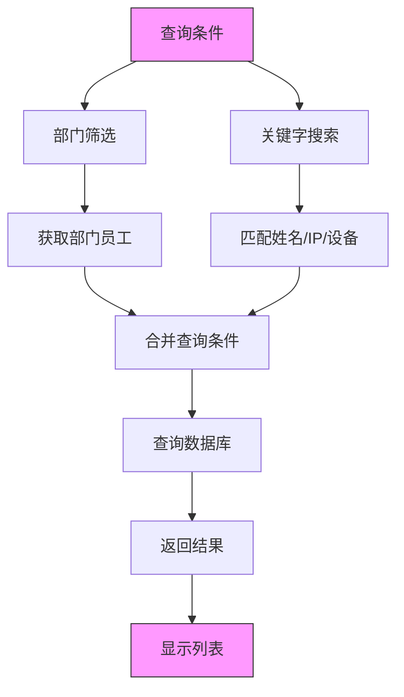

**查询功能来源**
- [NoticeEmployeeService.java](file://smart-admin-api-java17-springboot3/sa-admin/src/main/java/net/lab1024/sa/admin/module/business/oa/notice/service/NoticeEmployeeService.java#L150-L200)
- [notice-view-record-list.vue](file://smart-admin-web-javascript/src/views/business/oa/notice/components/notice-view-record-list.vue#L118-L148)

## 总结

通知公告系统是一个功能完善、架构合理的OA模块，通过清晰的分层设计和组件化开发，实现了通知的全生命周期管理。系统提供了丰富的功能特性，包括通知的创建、发布、查看、管理、可见范围控制、阅读状态跟踪等，满足了企业内部信息传达的各种需求。

系统采用前后端分离架构，后端基于Spring Boot框架，前端使用Vue3技术栈，通过RESTful API进行通信。代码结构清晰，职责分明，具有良好的可维护性和扩展性。通过合理的权限控制和数据验证，确保了系统的安全性和数据的完整性。

未来可以考虑增加更多高级功能，如通知优先级设置、阅读确认机制、移动端适配等，进一步提升系统的实用性和用户体验。