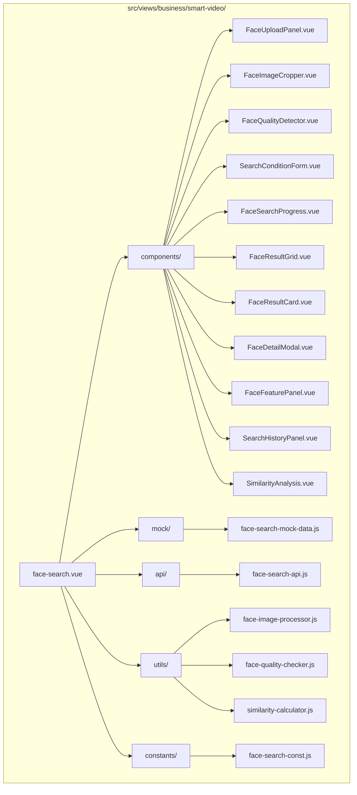
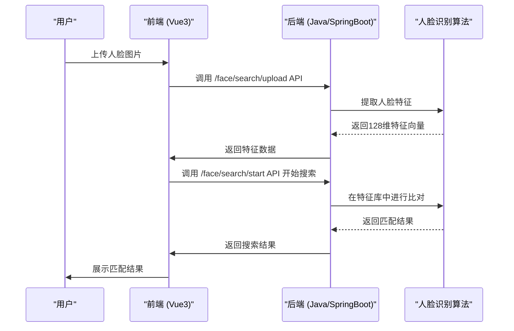
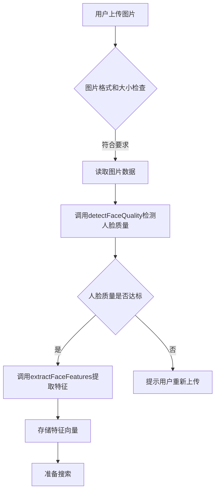
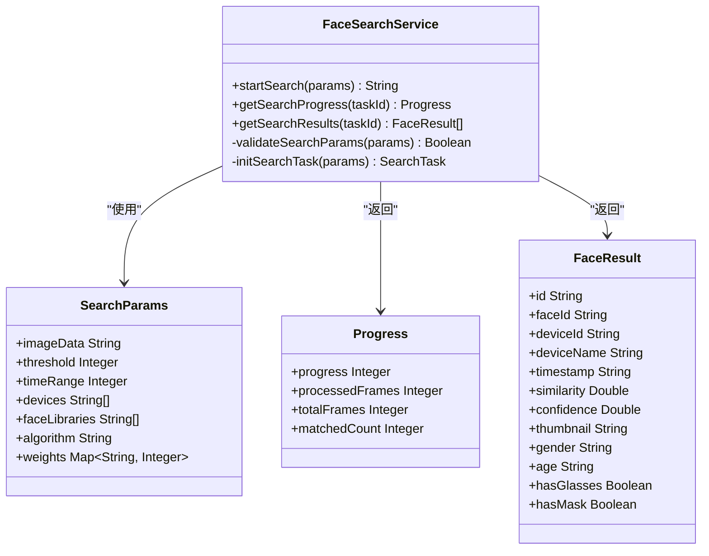
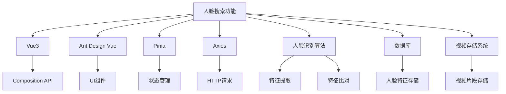

# 人脸搜索

<cite>
**本文档引用文件**   
- [image-search.vue](file://smart-admin-web-javascript\src\views\business\smart-video\image-search.vue)
- [attendance-api.js](file://smart-admin-web-javascript\src\api\business\smart-video\attendance-api.js)
- [face-search-api.js](file://smart-admin-web-javascript\AI开发文档\人脸搜索页面功能布局文档_完善版.md)
- [face-search-store.js](file://smart-admin-web-javascript\AI开发文档\人脸搜索页面功能布局文档_完善版.md)
- [人脸搜索页面功能布局文档_完善版.md](file://smart-admin-web-javascript\AI开发文档\人脸搜索页面功能布局文档_完善版.md)
</cite>

## 目录
1. [引言](#引言)
2. [项目结构](#项目结构)
3. [核心组件](#核心组件)
4. [架构概述](#架构概述)
5. [详细组件分析](#详细组件分析)
6. [依赖分析](#依赖分析)
7. [性能考虑](#性能考虑)
8. [故障排除指南](#故障排除指南)
9. [结论](#结论)

## 引言
人脸搜索功能是智能视频监控系统中的核心AI应用，通过上传的人脸图片在海量视频监控数据中快速检索匹配的人脸记录。该功能基于SmartAdmin前端框架构建，采用Vue3 + Ant Design Vue技术栈，集成人脸识别算法，支持多种图片上传方式、图片质量检测、相似度阈值设置、搜索结果展示、人脸特征分析等完整的以图搜图功能。

## 项目结构
人脸搜索功能的文件组织结构清晰，遵循模块化设计原则，便于维护和扩展。

**图源**
- [人脸搜索页面功能布局文档_完善版.md](file://smart-admin-web-javascript\AI开发文档\人脸搜索页面功能布局文档_完善版.md)

**节源**
- [人脸搜索页面功能布局文档_完善版.md](file://smart-admin-web-javascript\AI开发文档\人脸搜索页面功能布局文档_完善版.md)

## 核心组件
人脸搜索功能的核心组件包括图像上传、特征提取、搜索执行和结果展示等模块。`image-search.vue`作为主页面组件，负责协调各个子组件的工作流程。`face-search-api.js`定义了与后端服务交互的所有API接口，包括人脸质量检测、特征提取、开始搜索、获取搜索进度和结果等。

**节源**
- [image-search.vue](file://smart-admin-web-javascript\src\views\business\smart-video\image-search.vue)
- [face-search-api.js](file://smart-admin-web-javascript\AI开发文档\人脸搜索页面功能布局文档_完善版.md)

## 架构概述
人脸搜索功能采用前后端分离架构，前端通过API与后端服务进行交互。前端使用Vue3 Composition API进行状态管理，通过Pinia进行全局状态管理。后端提供RESTful API接口，处理人脸特征提取、比对和搜索等核心算法。

**图源**
- [face-search-api.js](file://smart-admin-web-javascript\AI开发文档\人脸搜索页面功能布局文档_完善版.md)
- [人脸搜索页面功能布局文档_完善版.md](file://smart-admin-web-javascript\AI开发文档\人脸搜索页面功能布局文档_完善版.md)

**节源**
- [image-search.vue](file://smart-admin-web-javascript\src\views\business\smart-video\image-search.vue)
- [face-search-api.js](file://smart-admin-web-javascript\AI开发文档\人脸搜索页面功能布局文档_完善版.md)

## 详细组件分析
### 图像上传与特征提取
图像上传组件支持拖拽上传和点击上传两种方式，限制文件大小不超过10MB，支持JPG、PNG格式。上传后，系统会自动调用API提取人脸特征向量。

**图源**
- [image-search.vue](file://smart-admin-web-javascript\src\views\business\smart-video\image-search.vue)
- [face-search-api.js](file://smart-admin-web-javascript\AI开发文档\人脸搜索页面功能布局文档_完善版.md)

**节源**
- [image-search.vue](file://smart-admin-web-javascript\src\views\business\smart-video\image-search.vue)

### 搜索执行与结果展示
搜索执行采用异步方式，避免阻塞UI。系统会轮询搜索进度，实时反馈给用户。搜索完成后，结果按相似度排序展示。

**图源**
- [face-search-api.js](file://smart-admin-web-javascript\AI开发文档\人脸搜索页面功能布局文档_完善版.md)
- [人脸搜索页面功能布局文档_完善版.md](file://smart-admin-web-javascript\AI开发文档\人脸搜索页面功能布局文档_完善版.md)

**节源**
- [face-search-api.js](file://smart-admin-web-javascript\AI开发文档\人脸搜索页面功能布局文档_完善版.md)

## 依赖分析
人脸搜索功能依赖于多个前端和后端组件。前端依赖Vue3、Ant Design Vue、Pinia等框架和库。后端依赖人脸识别算法库和数据库存储。

**图源**
- [face-search-api.js](file://smart-admin-web-javascript\AI开发文档\人脸搜索页面功能布局文档_完善版.md)
- [人脸搜索页面功能布局文档_完善版.md](file://smart-admin-web-javascript\AI开发文档\人脸搜索页面功能布局文档_完善版.md)

**节源**
- [face-search-api.js](file://smart-admin-web-javascript\AI开发文档\人脸搜索页面功能布局文档_完善版.md)

## 性能考虑
为确保人脸搜索功能的高性能，系统采用了多项优化措施。特征库使用索引优化，提高搜索效率。对于大规模特征库，采用分布式计算架构，将搜索任务分发到多个计算节点并行处理。前端采用虚拟滚动技术，优化大量搜索结果的渲染性能。

**节源**
- [人脸搜索页面功能布局文档_完善版.md](file://smart-admin-web-javascript\AI开发文档\人脸搜索页面功能布局文档_完善版.md)

## 故障排除指南
### Q1: 图片上传后无法检测到人脸
**解决方案**:
- 检查图片清晰度，确保人脸区域清晰可见
- 确认人脸角度，正面照片效果最好
- 检查光照条件，避免过暗或过曝
- 确保人脸未被遮挡（口罩、墨镜等）

### Q2: 搜索结果相似度较低
**解决方案**:
- 降低相似度阈值
- 使用更清晰的搜索图片
- 检查人脸特征提取是否正常

**节源**
- [人脸搜索页面功能布局文档_完善版.md](file://smart-admin-web-javascript\AI开发文档\人脸搜索页面功能布局文档_完善版.md)

## 结论
人脸搜索功能通过先进的图像识别算法和优化的系统架构，实现了高效、准确的人脸检索。系统支持批量比对、活体检测集成和黑名单预警等高级功能。通过实施人脸数据加密存储、访问权限控制和审计日志记录等隐私保护措施，确保了用户数据的安全性。未来可进一步优化特征库索引和分布式计算架构，提升大规模场景下的搜索性能。