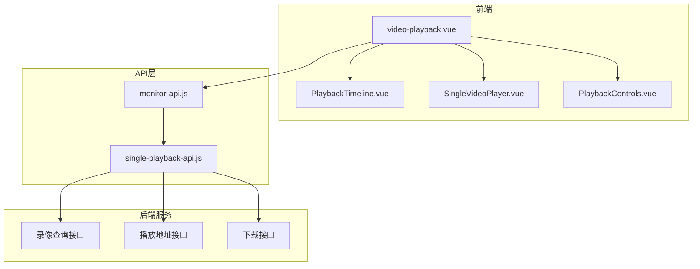
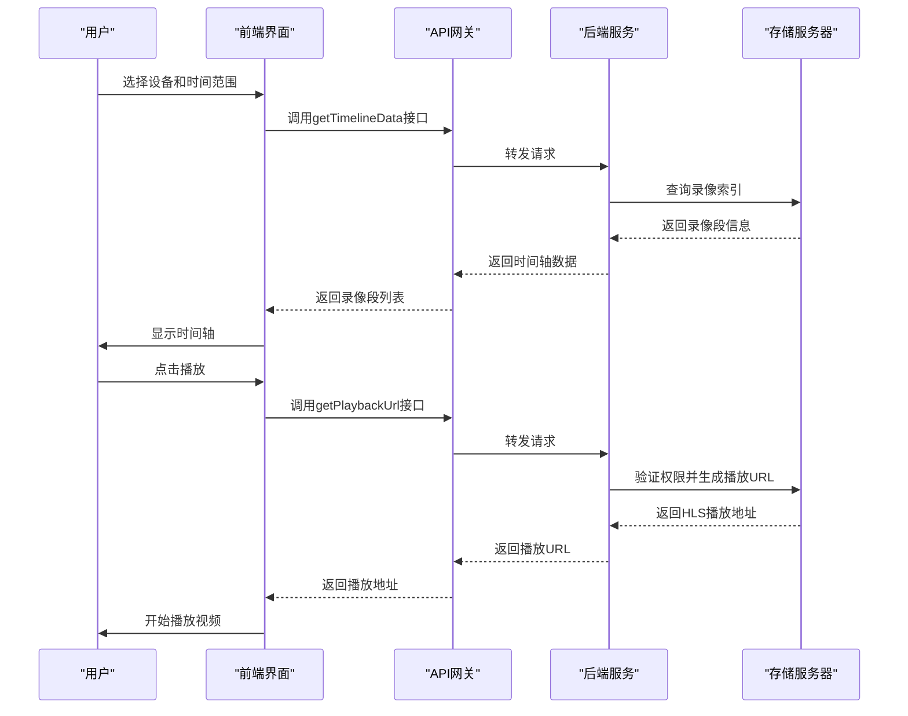
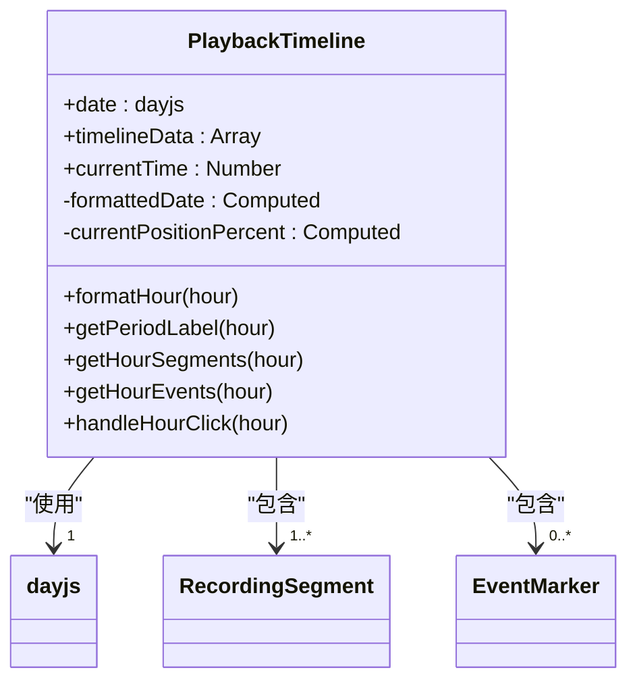
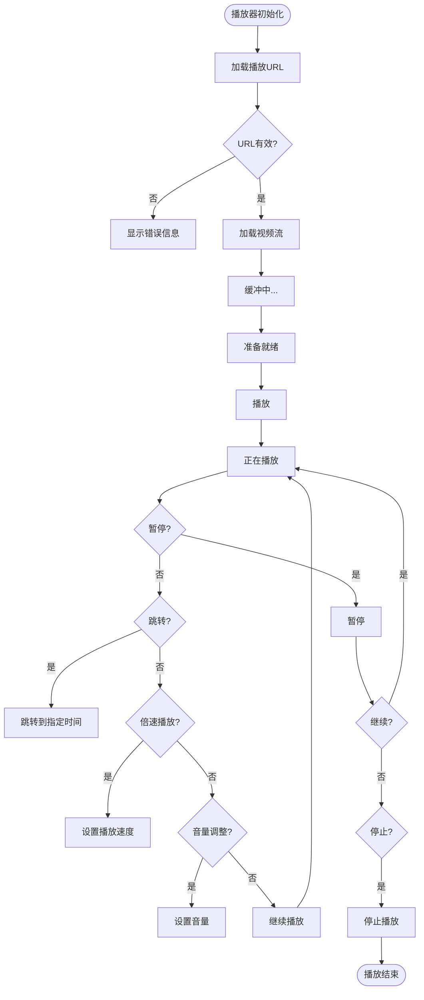
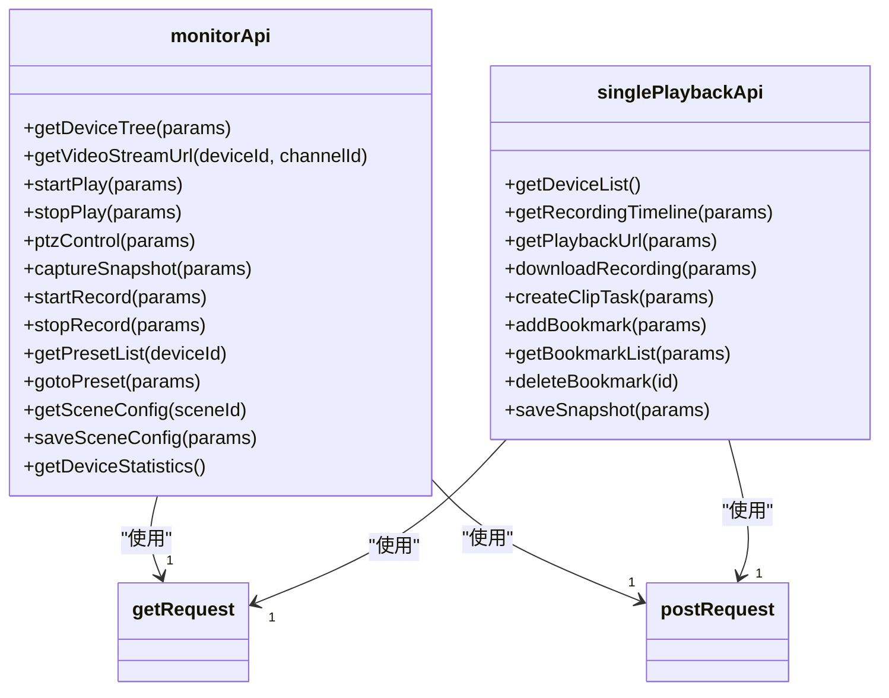
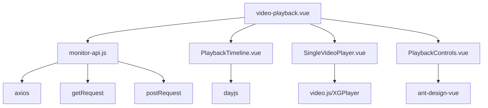

# 视频回放

<cite>
**本文档引用文件**   
- [monitor-api.js](file://smart-admin-web-javascript\src\api\business\smart-video\monitor-api.js)
- [video-playback.vue](file://smart-admin-web-javascript\src\views\business\smart-video\video-playback.vue)
- [playback-mock-data.js](file://smart-admin-web-javascript\src\views\business\smart-video\mock\playback-mock-data.js)
- [playback-api.js](file://smart-admin-web-javascript\AI开发文档\视频回放页面功能布局文档_完善版.md)
- [single-playback-api.js](file://smart-admin-web-javascript\AI开发文档\单路回放页面功能布局文档_完善版.md)
</cite>

## 目录
1. [引言](#引言)
2. [项目结构](#项目结构)
3. [核心组件](#核心组件)
4. [架构概述](#架构概述)
5. [详细组件分析](#详细组件分析)
6. [依赖分析](#依赖分析)
7. [性能考虑](#性能考虑)
8. [故障排除指南](#故障排除指南)
9. [结论](#结论)

## 引言
视频回放功能是智能视频监控系统的核心功能之一，提供基于时间轴的录像检索与播放能力。本技术文档详细说明了视频回放功能的实现机制，包括录像片段查询、时间选择器与视频播放器的联动逻辑、视频索引优化、关键帧定位、倍速播放和下载功能的技术细节。文档还涵盖了回放进度条拖拽、片段剪辑标记等高级交互的实现方案，以及与存储服务器的通信协议、分段加载策略和大文件传输的性能优化措施。

## 项目结构
视频回放功能主要位于`smart-admin-web-javascript`项目的`src/views/business/smart-video`目录下，包含视频播放界面、时间轴组件和相关API调用。前端通过`monitor-api.js`调用后端接口查询录像片段，实现时间选择器与视频播放器的联动。

**图表来源**
- [video-playback.vue](file://smart-admin-web-javascript\src\views\business\smart-video\video-playback.vue)
- [monitor-api.js](file://smart-admin-web-javascript\src\api\business\smart-video\monitor-api.js)

**章节来源**
- [video-playback.vue](file://smart-admin-web-javascript\src\views\business\smart-video\video-playback.vue)

## 核心组件
视频回放功能的核心组件包括录像时间轴、视频播放器、控制面板和API服务。时间轴组件显示24小时内的录像段和事件标记，支持点击跳转；视频播放器支持HLS流播放、倍速播放和全屏显示；控制面板提供播放、暂停、快进、快退等基本控制功能，以及截图、下载、剪辑等高级功能。

**章节来源**
- [video-playback.vue](file://smart-admin-web-javascript\src\views\business\smart-video\video-playback.vue)
- [monitor-api.js](file://smart-admin-web-javascript\src\api\business\smart-video\monitor-api.js)

## 架构概述
视频回放功能采用前后端分离架构，前端通过RESTful API与后端通信。前端组件负责用户界面展示和交互，后端服务负责录像数据查询、播放地址生成和文件下载等核心功能。

**图表来源**
- [monitor-api.js](file://smart-admin-web-javascript\src\api\business\smart-video\monitor-api.js)
- [video-playback.vue](file://smart-admin-web-javascript\src\views\business\smart-video\video-playback.vue)

## 详细组件分析

### 时间轴组件分析
时间轴组件显示24小时内的录像段，不同颜色表示不同类型的录像（定时、移动侦测、告警、手动）。组件支持点击小时区域跳转到相应时间点，当前播放位置通过红色指示器显示。

**图表来源**
- [video-playback.vue](file://smart-admin-web-javascript\src\views\business\smart-video\video-playback.vue)

### 视频播放器分析
视频播放器组件负责视频流的播放控制，支持多种播放操作和状态管理。

**图表来源**
- [video-playback.vue](file://smart-admin-web-javascript\src\views\business\smart-video\video-playback.vue)

### API服务分析
API服务提供录像查询、播放地址获取、下载等核心功能。

**图表来源**
- [monitor-api.js](file://smart-admin-web-javascript\src\api\business\smart-video\monitor-api.js)
- [single-playback-api.js](file://smart-admin-web-javascript\AI开发文档\单路回放页面功能布局文档_完善版.md)

**章节来源**
- [monitor-api.js](file://smart-admin-web-javascript\src\api\business\smart-video\monitor-api.js)

## 依赖分析
视频回放功能依赖多个前端库和后端服务，包括axios用于HTTP请求、dayjs用于日期处理、ant-design-vue用于UI组件，以及后端的录像存储服务和流媒体服务。

**图表来源**
- [monitor-api.js](file://smart-admin-web-javascript\src\api\business\smart-video\monitor-api.js)
- [video-playback.vue](file://smart-admin-web-javascript\src\views\business\smart-video\video-playback.vue)

**章节来源**
- [monitor-api.js](file://smart-admin-web-javascript\src\api\business\smart-video\monitor-api.js)

## 性能考虑
为优化大文件传输性能，系统采用HLS（HTTP Live Streaming）协议进行视频分段传输，支持自适应码率。播放器实现分段加载策略，只加载当前播放和预加载部分，减少内存占用。对于长时间录像，系统建立视频索引，快速定位关键帧，实现秒级跳转。

## 故障排除指南
系统实现了完善的错误处理机制，包括录像文件缺失、时间范围越界等情况的用户提示。当录像文件不存在时，系统显示"录像文件未找到"提示；当查询时间范围越界时，显示"查询时间范围无效"提示；网络连接失败时，显示"网络连接失败，请检查网络设置"提示。

**章节来源**
- [monitor-api.js](file://smart-admin-web-javascript\src\api\business\smart-video\monitor-api.js)
- [video-playback.vue](file://smart-admin-web-javascript\src\views\business\smart-video\video-playback.vue)

## 结论
视频回放功能通过前后端协作，实现了基于时间轴的录像检索与播放。系统采用HLS协议优化大文件传输性能，通过视频索引实现快速定位。功能涵盖了播放控制、倍速播放、截图、下载、剪辑等完整需求，为用户提供流畅的视频回放体验。