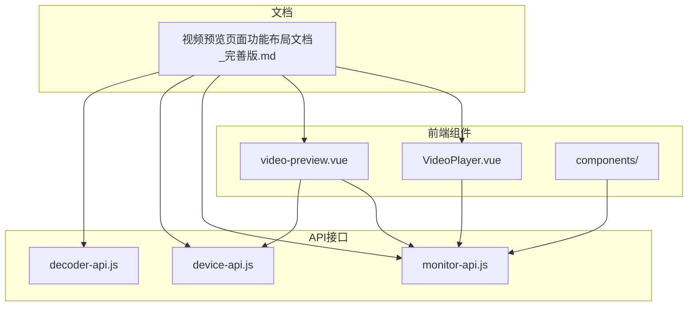
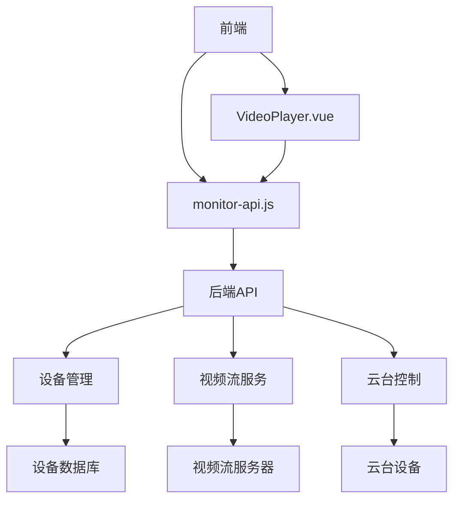
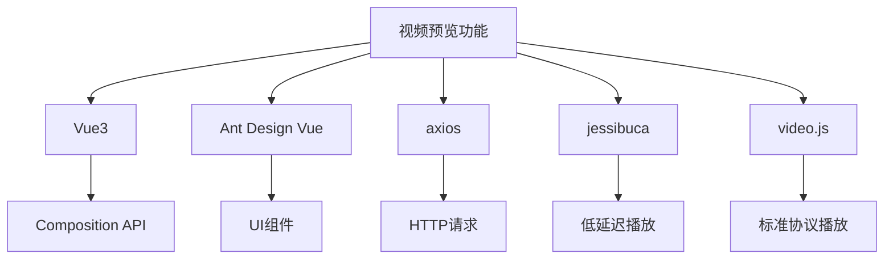

# 视频预览

<cite>
**本文档引用的文件**   
- [VideoPlayer.vue](file://smart-admin-web-javascript\src\views\business\smart-video\components\VideoPlayer.vue)
- [monitor-api.js](file://smart-admin-web-javascript\src\api\business\smart-video\monitor-api.js)
- [device-api.js](file://smart-admin-web-javascript\src\api\business\smart-video\device-api.js)
- [decoder-api.js](file://smart-admin-web-javascript\src\api\business\smart-video\decoder-api.js)
- [视频预览页面功能布局文档_完善版.md](file://smart-admin-web-javascript\AI开发文档\视频预览页面功能布局文档_完善版.md)
</cite>

## 目录
1. [简介](#简介)
2. [项目结构](#项目结构)
3. [核心组件](#核心组件)
4. [架构概述](#架构概述)
5. [详细组件分析](#详细组件分析)
6. [依赖分析](#依赖分析)
7. [性能考虑](#性能考虑)
8. [故障排除指南](#故障排除指南)
9. [结论](#结论)
10. [附录](#附录)（如有必要）

## 简介
视频预览功能是智能视频监控系统的核心模块，提供实时视频流的前端播放和后端监控API集成。该功能支持多路视频实时播放、设备树选择、多画面布局切换（1/4/9/16画面）、云台控制、截图录像等核心功能。基于SmartAdmin框架，采用Vue3 + Ant Design Vue技术栈，集成jessibuca/video.js播放器，支持WebRTC/FLV/HLS多协议流媒体播放。

## 项目结构
视频预览功能的项目结构遵循SmartAdmin框架的模块化设计，主要包含视图组件、API接口和相关配置文件。前端组件位于`src/views/business/smart-video/`目录下，API接口位于`src/api/business/smart-video/`目录下。



**图表来源**
- [VideoPlayer.vue](file://smart-admin-web-javascript\src\views\business\smart-video\components\VideoPlayer.vue)
- [monitor-api.js](file://smart-admin-web-javascript\src\api\business\smart-video\monitor-api.js)
- [device-api.js](file://smart-admin-web-javascript\src\api\business\smart-video\device-api.js)
- [decoder-api.js](file://smart-admin-web-javascript\src\api\business\smart-video\decoder-api.js)
- [视频预览页面功能布局文档_完善版.md](file://smart-admin-web-javascript\AI开发文档\视频预览页面功能布局文档_完善版.md)

**章节来源**
- [VideoPlayer.vue](file://smart-admin-web-javascript\src\views\business\smart-video\components\VideoPlayer.vue)
- [monitor-api.js](file://smart-admin-web-javascript\src\api\business\smart-video\monitor-api.js)
- [device-api.js](file://smart-admin-web-javascript\src\api\business\smart-video\device-api.js)
- [decoder-api.js](file://smart-admin-web-javascript\src\api\business\smart-video\decoder-api.js)
- [视频预览页面功能布局文档_完善版.md](file://smart-admin-web-javascript\AI开发文档\视频预览页面功能布局文档_完善版.md)

## 核心组件
视频预览功能的核心组件包括前端播放组件VideoPlayer.vue和后端监控API的集成。VideoPlayer.vue组件负责视频流的播放、控制和显示，monitor-api.js文件定义了与后端服务通信的API接口。

**章节来源**
- [VideoPlayer.vue](file://smart-admin-web-javascript\src\views\business\smart-video\components\VideoPlayer.vue)
- [monitor-api.js](file://smart-admin-web-javascript\src\api\business\smart-video\monitor-api.js)

## 架构概述
视频预览功能的架构分为前端和后端两部分。前端使用Vue3框架和Ant Design Vue组件库构建用户界面，通过monitor-api.js与后端服务进行通信。后端提供RESTful API接口，处理设备管理、视频流获取、云台控制等请求。



**图表来源**
- [VideoPlayer.vue](file://smart-admin-web-javascript\src\views\business\smart-video\components\VideoPlayer.vue)
- [monitor-api.js](file://smart-admin-web-javascript\src\api\business\smart-video\monitor-api.js)
- [device-api.js](file://smart-admin-web-javascript\src\api\business\smart-video\device-api.js)
- [decoder-api.js](file://smart-admin-web-javascript\src\api\business\smart-video\decoder-api.js)

## 详细组件分析
### VideoPlayer.vue 组件分析
VideoPlayer.vue是视频预览功能的核心前端组件，负责视频流的播放、控制和显示。该组件使用Vue3的Composition API编写，支持响应式数据绑定和生命周期管理。

#### 组件属性（Props）
- **device**: Object，设备信息对象，包含设备ID、名称、状态等。
- **isSelected**: Boolean，是否选中该视频播放器。
- **showControls**: Boolean，是否显示控制栏。

#### 组件事件（Events）
- **play**: 播放视频时触发，传递设备ID。
- **stop**: 停止播放时触发，传递设备ID。
- **error**: 播放失败时触发，传递设备ID和错误信息。
- **click**: 点击播放器时触发。

#### 组件插槽（Slots）
- 默认插槽：可用于自定义播放器内容。

#### 交互细节
- **多画面布局切换**：通过改变布局选择器的值，重新初始化视频网格。
- **全屏播放**：点击全屏按钮，使用浏览器全屏API进入全屏模式。
- **码流切换**：通过改变视频质量选择器的值，重新获取视频流URL。

**章节来源**
- [VideoPlayer.vue](file://smart-admin-web-javascript\src\views\business\smart-video\components\VideoPlayer.vue)

### monitor-api.js API分析
monitor-api.js文件定义了与后端监控服务通信的API接口，包括设备管理、视频流获取、云台控制等功能。

#### API接口列表
- **getDeviceTree**: 获取设备树列表。
- **getVideoStreamUrl**: 获取视频流地址。
- **startPlay**: 开始播放视频。
- **stopPlay**: 停止播放视频。
- **ptzControl**: 云台控制。
- **captureSnapshot**: 截图。
- **startRecord**: 开始录像。
- **stopRecord**: 停止录像。
- **getPresetList**: 获取预置位列表。
- **gotoPreset**: 调用预置位。
- **getSceneConfig**: 获取监控场景配置。
- **saveSceneConfig**: 保存监控场景配置。
- **getDeviceStatistics**: 获取设备统计信息。

#### PTZ控制实现机制
PTZ控制通过`ptzControl` API接口实现，支持方向控制（上、下、左、右、居中）和变焦控制（放大、缩小）。调用预置位功能通过`gotoPreset` API接口实现，允许快速定位到预设的摄像头位置。

**章节来源**
- [monitor-api.js](file://smart-admin-web-javascript\src\api\business\smart-video\monitor-api.js)

## 依赖分析
视频预览功能依赖于多个前端和后端组件，包括Vue3框架、Ant Design Vue组件库、axios HTTP客户端、jessibuca/video.js播放器等。



**图表来源**
- [VideoPlayer.vue](file://smart-admin-web-javascript\src\views\business\smart-video\components\VideoPlayer.vue)
- [monitor-api.js](file://smart-admin-web-javascript\src\api\business\smart-video\monitor-api.js)
- [device-api.js](file://smart-admin-web-javascript\src\api\business\smart-video\device-api.js)
- [decoder-api.js](file://smart-admin-web-javascript\src\api\business\smart-video\decoder-api.js)

**章节来源**
- [VideoPlayer.vue](file://smart-admin-web-javascript\src\views\business\smart-video\components\VideoPlayer.vue)
- [monitor-api.js](file://smart-admin-web-javascript\src\api\business\smart-video\monitor-api.js)
- [device-api.js](file://smart-admin-web-javascript\src\api\business\smart-video\device-api.js)
- [decoder-api.js](file://smart-admin-web-javascript\src\api\business\smart-video\decoder-api.js)

## 性能考虑
### 视频流延迟优化策略
- 使用jessibuca播放器，支持WebSocket-FLV/WebRTC协议，实现低延迟（200-500ms）播放。
- 优化视频缓冲设置，平衡延迟和播放流畅性。
- 支持多种视频流协议（HLS、FLV、WS-FLV、WebRTC），根据网络状况自动选择最佳协议。

### 断线重连机制
- 在播放器组件中实现错误状态检测和重试机制。
- 当检测到播放失败时，自动尝试重新连接。
- 提供手动重试按钮，允许用户主动重新连接。

### 浏览器兼容性处理方案
- 使用现代浏览器API（如Fullscreen API）的同时，提供降级方案。
- 兼容主流浏览器（Chrome、Firefox、Safari、Edge）。
- 针对不同浏览器的视频播放能力进行适配。

**章节来源**
- [VideoPlayer.vue](file://smart-admin-web-javascript\src\views\business\smart-video\components\VideoPlayer.vue)
- [monitor-api.js](file://smart-admin-web-javascript\src\api\business\smart-video\monitor-api.js)

## 故障排除指南
### 常见问题及解决方案
- **视频无法播放**：检查设备是否在线，确认视频流URL是否正确，尝试重新连接。
- **云台控制无响应**：确认设备支持云台功能，检查控制权限，尝试重启设备。
- **截图或录像失败**：检查存储空间是否充足，确认权限设置是否正确。

### 调试工具和方法
- 使用浏览器开发者工具查看网络请求和控制台日志。
- 检查API响应数据，确认参数传递是否正确。
- 使用Mock数据进行功能测试，隔离后端问题。

**章节来源**
- [VideoPlayer.vue](file://smart-admin-web-javascript\src\views\business\smart-video\components\VideoPlayer.vue)
- [monitor-api.js](file://smart-admin-web-javascript\src\api\business\smart-video\monitor-api.js)

## 结论
视频预览功能通过前端播放组件VideoPlayer.vue和后端监控API的集成，实现了实时视频流的播放和控制。该功能支持多画面布局切换、全屏播放、码流切换等交互细节，提供了完善的PTZ控制机制。通过优化视频流延迟、实现断线重连机制和处理浏览器兼容性问题，确保了功能的稳定性和用户体验。与设备管理模块的数据联动关系清晰，便于在新页面中集成视频预览功能。

## 附录
### 代码示例：在新页面中集成视频预览功能
```vue
<template>
  <div class="video-preview-container">
    <VideoPlayer 
      v-for="(device, index) in selectedDevices" 
      :key="index"
      :device="device"
      :show-controls="true"
      @play="onPlay"
      @stop="onStop"
      @error="onError"
    />
  </div>
</template>

<script setup>
import { ref } from 'vue';
import VideoPlayer from '@/views/business/smart-video/components/VideoPlayer.vue';
import { deviceApi } from '@/api/business/smart-video/device-api.js';

const selectedDevices = ref([]);

// 加载设备列表
const loadDevices = async () => {
  try {
    const { data } = await deviceApi.queryDeviceList({ status: 1 });
    selectedDevices.value = data.list.slice(0, 4); // 选择前4个在线设备
  } catch (error) {
    console.error('加载设备列表失败:', error);
  }
};

// 事件处理函数
const onPlay = (deviceId) => {
  console.log(`开始播放设备 ${deviceId}`);
};

const onStop = (deviceId) => {
  console.log(`停止播放设备 ${deviceId}`);
};

const onError = (deviceId, error) => {
  console.error(`设备 ${deviceId} 播放失败:`, error);
};

// 初始化
loadDevices();
</script>
```

**章节来源**
- [VideoPlayer.vue](file://smart-admin-web-javascript\src\views\business\smart-video\components\VideoPlayer.vue)
- [device-api.js](file://smart-admin-web-javascript\src\api\business\smart-video\device-api.js)