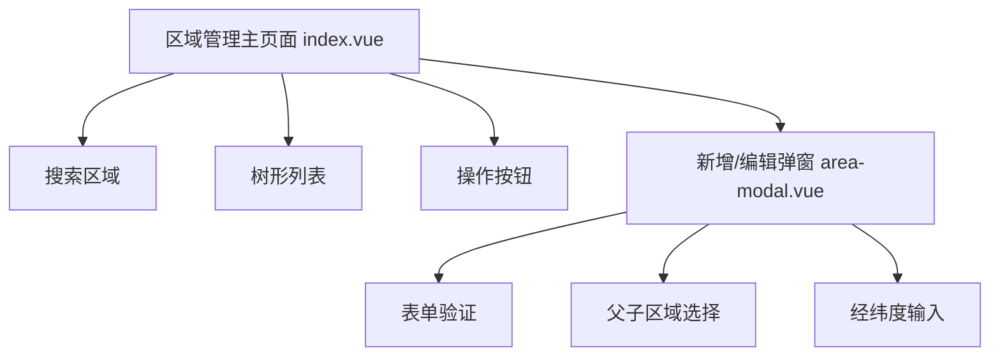
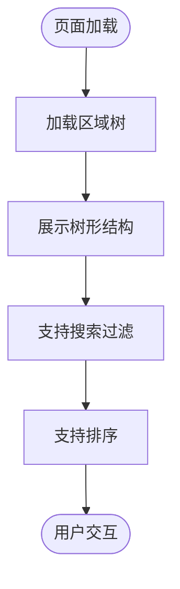
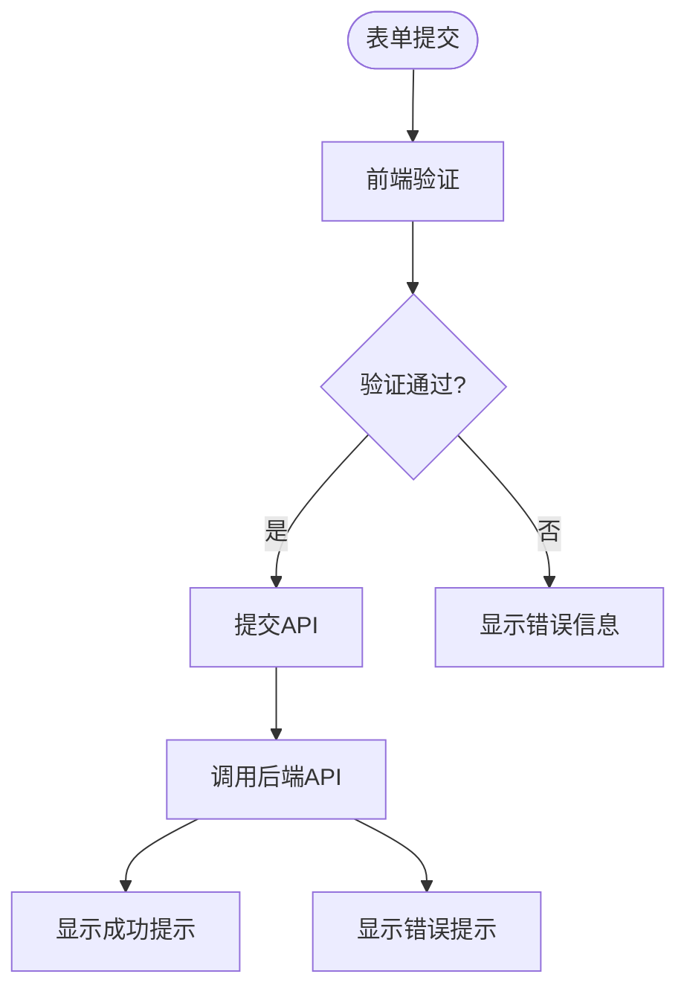
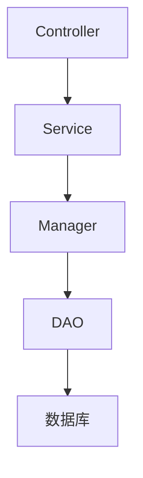
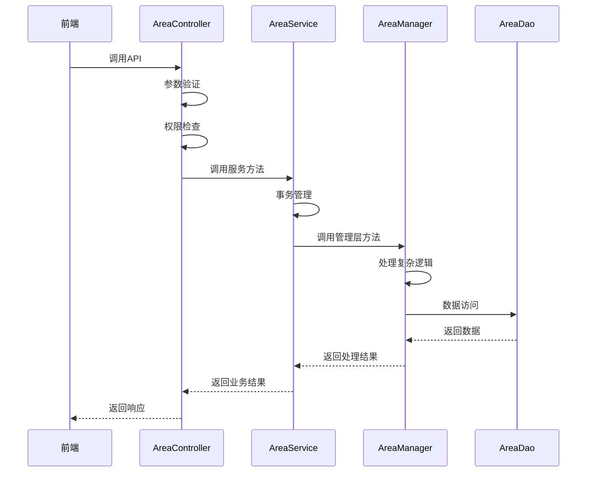
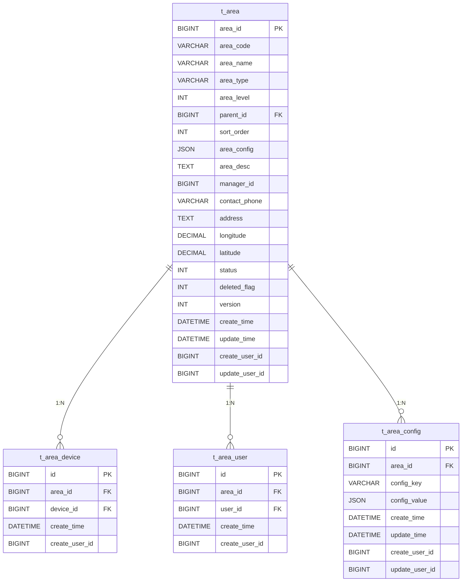
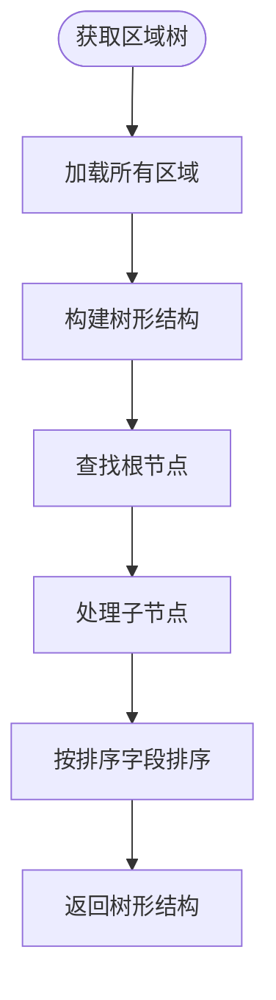

# 区域管理

<cite>
**本文档引用文件**  
- [AreaController.java](file://smart-admin-api-java17-springboot3/sa-admin/src/main/java/net/lab1024/sa/admin/module/system/area/controller/AreaController.java)
- [AreaService.java](file://smart-admin-api-java17-springboot3/sa-admin/src/main/java/net/lab1024/sa/admin/module/system/area/service/AreaService.java)
- [AreaManager.java](file://smart-admin-api-java17-springboot3/sa-admin/src/main/java/net/lab1024/sa/admin/module/system/area/manager/AreaManager.java)
- [AreaDao.java](file://smart-admin-api-java17-springboot3/sa-admin/src/main/java/net/lab1024/sa/admin/module/system/area/dao/AreaDao.java)
- [AreaEntity.java](file://smart-admin-api-java17-springboot3/sa-admin/src/main/java/net/lab1024/sa/admin/module/system/area/domain/entity/AreaEntity.java)
- [AreaAddForm.java](file://smart-admin-api-java17-springboot3/sa-admin/src/main/java/net/lab1024/sa/admin/module/system/area/domain/form/AreaAddForm.java)
- [AreaUpdateForm.java](file://smart-admin-api-java17-springboot3/sa-admin/src/main/java/net/lab1024/sa/admin/module/system/area/domain/form/AreaUpdateForm.java)
- [AreaQueryForm.java](file://smart-admin-api-java17-springboot3/sa-admin/src/main/java/net/lab1024/sa/admin/module/system/area/domain/form/AreaQueryForm.java)
- [AreaVO.java](file://smart-admin-api-java17-springboot3/sa-admin/src/main/java/net/lab1024/sa/admin/module/system/area/domain/vo/AreaVO.java)
- [AreaTreeVO.java](file://smart-admin-api-java17-springboot3/sa-admin/src/main/java/net/lab1024/sa/admin/module/system/area/domain/vo/AreaTreeVO.java)
- [area-api.js](file://smart-admin-web-javascript/src/api/system/area-api.js)
- [index.vue](file://smart-admin-web-javascript/src/views/system/area/index.vue)
- [area-modal.vue](file://smart-admin-web-javascript/src/views/system/area/area-modal.vue)
- [smart_area.sql](file://数据库SQL脚本/mysql/smart_area.sql)
- [区域管理模块部署说明.md](file://区域管理模块部署说明.md)
</cite>

## 目录

1. [概述](#概述)
2. [核心功能](#核心功能)
3. [前端实现](#前端实现)
4. [后端架构](#后端架构)
5. [数据模型](#数据模型)
6. [API接口](#api接口)
7. [树形结构实现](#树形结构实现)
8. [权限控制](#权限控制)
9. [性能优化](#性能优化)
10. [常见问题与解决方案](#常见问题与解决方案)

## 概述

区域管理模块是消费管理系统中的核心基础组件，负责管理物理空间的层级结构。该模块为系统提供统一的区域划分标准，支持无限层级的树形结构，能够精确描述从园区到房间的完整空间关系。区域作为连接设备、账户和业务的枢纽，在消费管理、设备监控和权限控制中发挥着关键作用。

**本模块引用文件**
- [区域管理模块部署说明.md](file://区域管理模块部署说明.md#L1-L308)

## 核心功能

区域管理模块提供完整的CRUD操作和树形结构管理功能，支持复杂的区域层级关系和业务关联。

### 区域树形管理
- 支持无限层级的区域树形结构
- 提供树形展示和折叠功能
- 支持拖拽排序和层级调整
- 实时刷新和缓存机制

### 区域CRUD操作
- **创建**：支持新增根区域和子区域
- **编辑**：允许修改区域基本信息和配置
- **查询**：提供分页查询和树形查询两种模式
- **删除**：实现软删除机制，保留历史数据

### 区域类型
系统定义了多种区域类型以满足不同场景需求：
- 园区(CAMPUS)
- 楼栋(BUILDING)
- 楼层(FLOOR)
- 房间(ROOM)
- 室外(OUTDOOR)
- 停车场(PARKING)
- 出入口(ENTRANCE)

### 扩展功能
- 区域设备绑定/解绑
- 区域人员授权/撤销
- 区域配置管理

**本模块引用文件**
- [区域管理模块部署说明.md](file://区域管理模块部署说明.md#L117-L167)

## 前端实现

前端采用Vue 3 + Ant Design Vue 4.x技术栈，实现了直观的区域管理界面。

### 组件结构


**本模块引用文件**
- [index.vue](file://smart-admin-web-javascript/src/views/system/area/index.vue#L1-L270)
- [area-modal.vue](file://smart-admin-web-javascript/src/views/system/area/area-modal.vue#L1-L285)

### 表格展示
区域列表采用树形表格展示，包含以下列：
- 区域名称
- 区域编码
- 区域类型
- 负责人
- 联系电话
- 状态
- 创建时间
- 操作

支持以下功能：
- 分页显示
- 多条件查询
- 实时刷新
- 权限控制显示



**本模块引用文件**
- [index.vue](file://smart-admin-web-javascript/src/views/system/area/index.vue#L49-L76)

### 表单验证
新增/编辑表单实现了严格的前端验证规则：

| 字段 | 验证规则 |
|------|--------|
| 区域编码 | 必填，最大长度100 |
| 区域名称 | 必填，最大长度200 |
| 区域类型 | 必选 |
| 父区域 | 必选 |
| 联系电话 | 手机号格式验证 |



**本模块引用文件**
- [area-modal.vue](file://smart-admin-web-javascript/src/views/system/area/area-modal.vue#L156-L170)

### 交互反馈机制
系统提供完善的用户交互反馈：
- 成功操作：绿色提示消息
- 失败操作：红色错误提示
- 加载状态：旋转加载指示器
- 删除确认：弹出确认对话框
- 表单验证：实时错误提示

## 后端架构

后端采用标准的四层架构设计，确保代码的可维护性和扩展性。

### 四层架构


各层职责明确：
- **Controller**：处理HTTP请求，参数验证，权限控制
- **Service**：业务逻辑处理，事务管理
- **Manager**：复杂业务逻辑，缓存处理，树形结构构建
- **DAO**：数据访问，MyBatis映射

### 调用流程


**本模块引用文件**
- [AreaController.java](file://smart-admin-api-java17-springboot3/sa-admin/src/main/java/net/lab1024/sa/admin/module/system/area/controller/AreaController.java#L1-L93)
- [AreaService.java](file://smart-admin-api-java17-springboot3/sa-admin/src/main/java/net/lab1024/sa/admin/module/system/area/service/AreaService.java#L1-L85)
- [AreaManager.java](file://smart-admin-api-java17-springboot3/sa-admin/src/main/java/net/lab1024/sa/admin/module/system/area/manager/AreaManager.java#L1-L44)
- [AreaDao.java](file://smart-admin-api-java17-springboot3/sa-admin/src/main/java/net/lab1024/sa/admin/module/system/area/dao/AreaDao.java#L1-L71)

## 数据模型

### 数据库设计
系统包含以下核心表：

| 表名 | 说明 |
|------|------|
| t_area | 区域主表 |
| t_area_device | 区域设备关联表 |
| t_area_user | 区域人员关联表 |
| t_area_config | 区域配置表 |

### 区域主表(t_area)字段
| 字段 | 类型 | 说明 |
|------|------|------|
| area_id | BIGINT | 区域ID，主键 |
| area_code | VARCHAR | 区域编码 |
| area_name | VARCHAR | 区域名称 |
| area_type | VARCHAR | 区域类型 |
| area_level | INT | 区域层级 |
| parent_id | BIGINT | 父区域ID |
| sort_order | INT | 排序 |
| area_config | JSON | 区域配置 |
| area_desc | TEXT | 区域描述 |
| manager_id | BIGINT | 负责人ID |
| contact_phone | VARCHAR | 联系电话 |
| address | TEXT | 详细地址 |
| longitude | DECIMAL | 经度 |
| latitude | DECIMAL | 纬度 |
| status | INT | 状态(1-启用,0-禁用) |
| deleted_flag | INT | 软删除标志 |
| version | INT | 乐观锁版本 |
| create_time | DATETIME | 创建时间 |
| update_time | DATETIME | 更新时间 |
| create_user_id | BIGINT | 创建人ID |
| update_user_id | BIGINT | 更新人ID |



**本模块引用文件**
- [AreaEntity.java](file://smart-admin-api-java17-springboot3/sa-admin/src/main/java/net/lab1024/sa/admin/module/system/area/domain/entity/AreaEntity.java#L1-L66)
- [smart_area.sql](file://数据库SQL脚本/mysql/smart_area.sql)

## API接口

### 接口清单
| 接口 | 方法 | 路径 | 说明 |
|------|------|------|------|
| 分页查询 | POST | /api/system/area/page | 分页查询区域列表 |
| 区域树 | GET | /api/system/area/tree | 获取区域树形结构 |
| 区域详情 | GET | /api/system/area/detail/{id} | 获取区域详细信息 |
| 新增区域 | POST | /api/system/area/add | 新增区域 |
| 更新区域 | POST | /api/system/area/update | 更新区域信息 |
| 删除区域 | POST | /api/system/area/delete/{id} | 删除区域 |
| 批量删除 | POST | /api/system/area/batchDelete | 批量删除区域 |

### 前端API封装
```javascript
export const areaApi = {
  /**
   * 分页查询区域
   */
  queryPage: (param) => {
    return postRequest('/system/area/page', param);
  },

  /**
   * 查询区域树
   */
  getAreaTree: () => {
    return getRequest('/system/area/tree');
  },

  /**
   * 查询区域详情
   */
  getDetail: (areaId) => {
    return getRequest(`/system/area/detail/${areaId}`);
  },

  /**
   * 新增区域
   */
  add: (param) => {
    return postRequest('/system/area/add', param);
  },

  /**
   * 更新区域
   */
  update: (param) => {
    return postRequest('/system/area/update', param);
  },

  /**
   * 删除区域
   */
  delete: (areaId) => {
    return postRequest(`/system/area/delete/${areaId}`);
  },

  /**
   * 批量删除区域
   */
  batchDelete: (areaIds) => {
    return postRequest('/system/area/batchDelete', areaIds);
  },
};
```

**本模块引用文件**
- [area-api.js](file://smart-admin-web-javascript/src/api/system/area-api.js#L1-L60)
- [AreaController.java](file://smart-admin-api-java17-springboot3/sa-admin/src/main/java/net/lab1024/sa/admin/module/system/area/controller/AreaController.java#L36-L92)

## 树形结构实现

### 实现方式
区域树形结构通过递归CTE（Common Table Expression）查询实现，具有良好的性能表现。

```sql
WITH RECURSIVE area_tree AS (
    -- 基础查询：选择指定区域
    SELECT area_id, parent_id
    FROM t_area
    WHERE area_id = #{areaId}
    AND deleted_flag = 0

    UNION ALL

    -- 递归查询：查找子区域
    SELECT a.area_id, a.parent_id
    FROM t_area a
    INNER JOIN area_tree at ON a.parent_id = at.area_id
    WHERE a.deleted_flag = 0
)
SELECT area_id FROM area_tree WHERE area_id != #{areaId}
```

### 后端实现逻辑


**本模块引用文件**
- [AreaManager.java](file://smart-admin-api-java17-springboot3/sa-admin/src/main/java/net/lab1024/sa/admin/module/system/area/manager/AreaManager.java#L46-L107)
- [AreaDao.java](file://smart-admin-api-java17-springboot3/sa-admin/src/main/java/net/lab1024/sa/admin/module/system/area/dao/AreaDao.java#L62-L68)

### 性能优化建议
1. **缓存机制**：对区域树进行缓存，减少数据库查询
2. **层级限制**：建议区域层级不超过5层，避免性能下降
3. **索引优化**：在parent_id、area_code等字段上创建索引
4. **分页查询**：对于大量数据使用分页查询
5. **懒加载**：对于深层级树形结构，采用懒加载方式

## 权限控制

### 权限设计
系统采用基于角色的权限控制（RBAC），为区域管理模块定义了细粒度的权限：

| 权限标识 | 说明 |
|---------|------|
| area:page | 分页查询 |
| area:tree | 查看区域树 |
| area:detail | 查看详情 |
| area:add | 新增区域 |
| area:update | 更新区域 |
| area:delete | 删除区域 |
| area:device:bind | 绑定设备 |
| area:device:unbind | 解绑设备 |
| area:user:grant | 授予权限 |
| area:user:revoke | 撤销权限 |
| area:config:view | 查看配置 |
| area:config:update | 更新配置 |

### 后端权限实现
```java
@Operation(summary = "新增区域")
@PostMapping("/add")
@SaCheckPermission("area:add")
public ResponseDTO<Long> add(@RequestBody @Valid AreaAddForm addForm) {
    Long areaId = areaService.add(addForm);
    return ResponseDTO.ok(areaId);
}
```

### 前端权限控制
```vue
<a-button type="primary" @click="handleAdd" v-privilege="'area:add'">
  <template #icon><PlusOutlined /></template>
  新增区域
</a-button>

<a-popconfirm title="确定删除该区域吗？" @confirm="handleDelete(record.areaId)" v-privilege="'area:delete'">
  <a-button type="link" size="small" danger>删除</a-button>
</a-popconfirm>
```

**本模块引用文件**
- [AreaController.java](file://smart-admin-api-java17-springboot3/sa-admin/src/main/java/net/lab1024/sa/admin/module/system/area/controller/AreaController.java#L61-L63)
- [index.vue](file://smart-admin-web-javascript/src/views/system/area/index.vue#L38-L41)

## 性能优化

### 查询优化
1. **区域树查询**：使用递归CTE查询，性能优良
2. **缓存机制**：支持Redis缓存，减少数据库压力
3. **索引优化**：在关键字段上创建索引
4. **分页查询**：避免一次性加载大量数据

### 数据库优化
- 使用InnoDB存储引擎
- utf8mb4字符集支持
- 软删除机制避免数据丢失
- 乐观锁机制防止并发冲突

### 建议配置
1. 区域层级建议不超过5层
2. 单个区域的子区域数量建议不超过1000个
3. 定期清理无效数据
4. 监控查询性能，及时优化慢查询

**本模块引用文件**
- [区域管理模块部署说明.md](file://区域管理模块部署说明.md#L251-L254)

## 常见问题与解决方案

### Q1: 前端页面没有"区域管理"菜单?
**问题原因**：component路径配置问题
**解决方案**：执行修复脚本 `fix_area_menu.sql`，该脚本会：
- 删除旧的错误菜单数据
- 重新插入正确的菜单配置（component路径为 `system/area/index.vue`，不包含 `views/` 前缀）
- 重新登录系统后菜单即可显示

**技术说明**：前端路由处理会自动在component路径前添加 `../views/`，所以数据库中不应包含 `views/` 前缀。

### Q2: 执行SQL脚本报错?
**解决方案**：
- 检查数据库连接信息是否正确
- 确保数据库版本为MySQL 8.0+
- 确认数据库用户有足够权限

### Q3: 前端页面无法访问?
**解决方案**：
- 检查菜单权限是否已分配
- 确认用户角色拥有相应权限
- 检查后端服务是否正常运行

### Q4: API接口调用失败?
**解决方案**：
- 检查后端服务是否正常启动
- 查看控制台日志
- 确认请求参数格式正确

### Q5: 区域树不显示?
**解决方案**：
- 检查是否有区域数据
- 尝试刷新页面
- 检查网络连接

**本模块引用文件**
- [区域管理模块部署说明.md](file://区域管理模块部署说明.md#L280-L300)