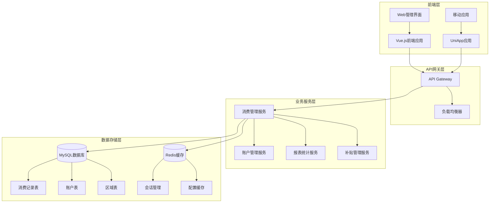
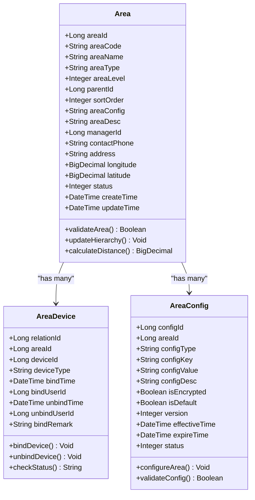
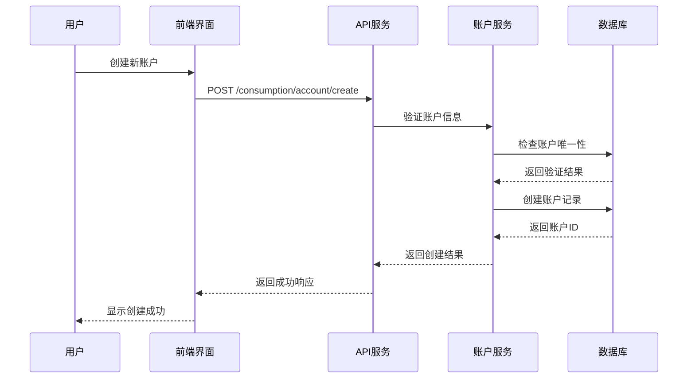
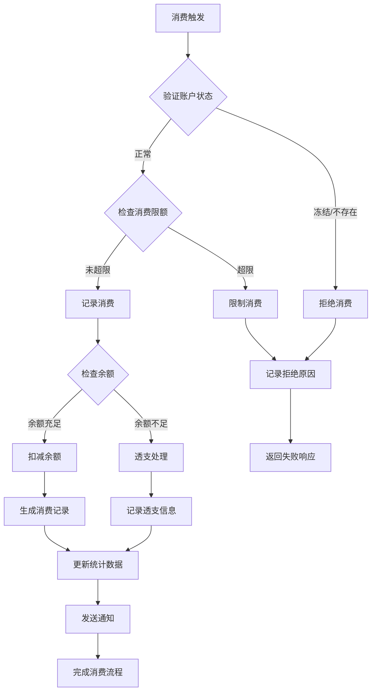
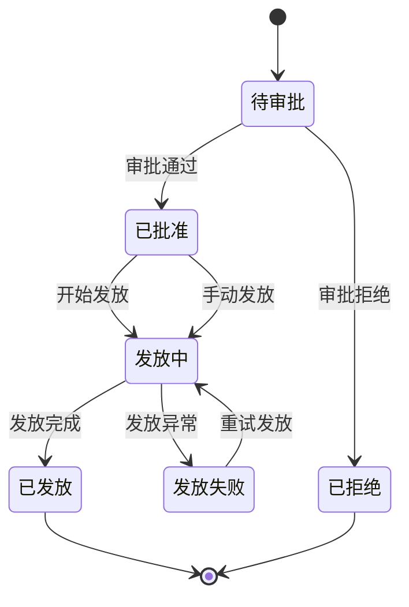
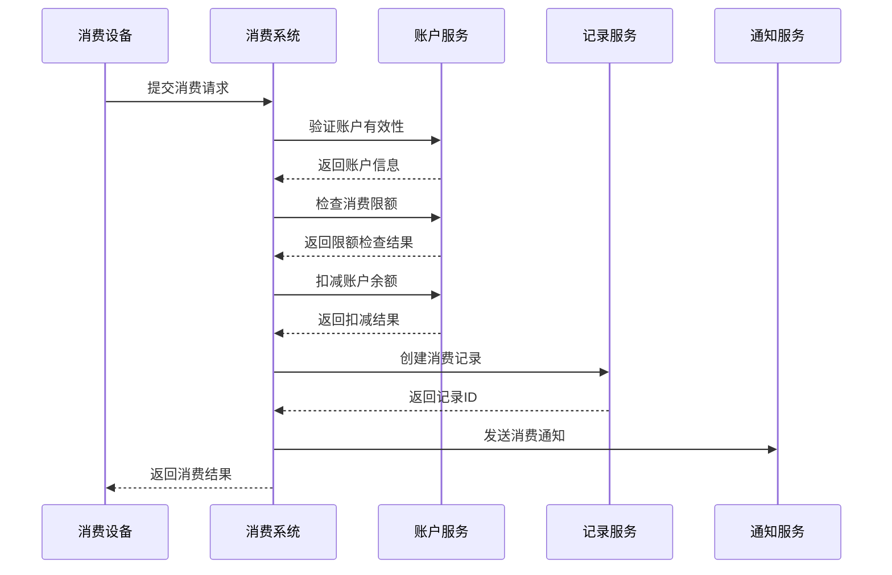
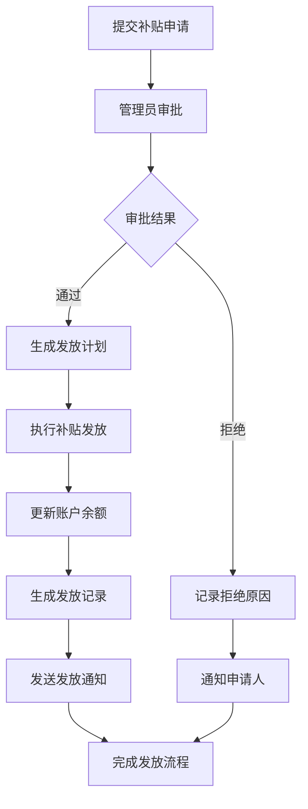
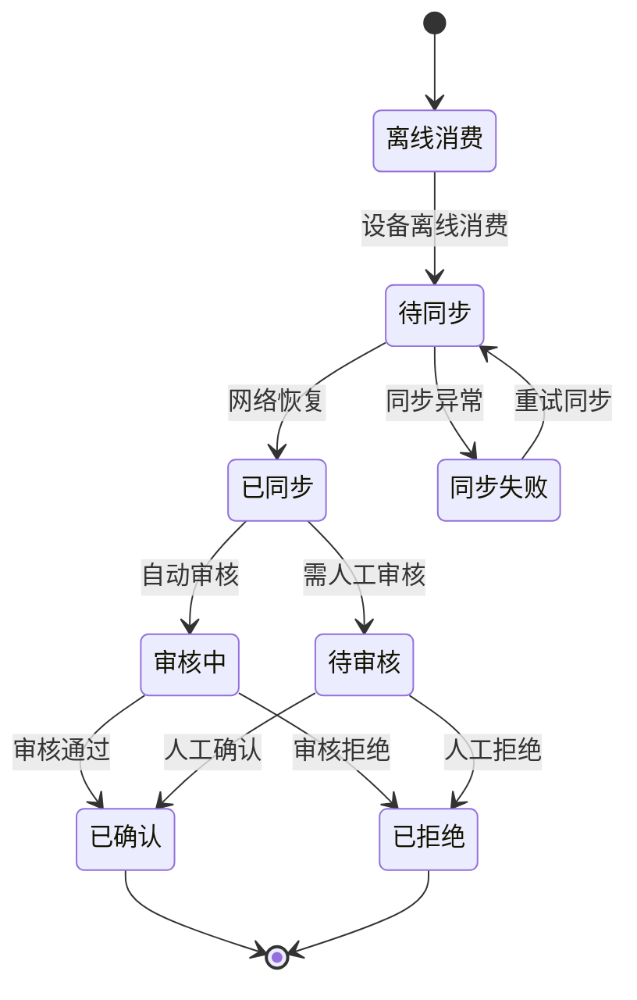

# 消费管理系统

<cite>
**本文档引用的文件**
- [consumption-api.js](file://smart-admin-web-javascript/src/api/business/consumption/consumption-api.js)
- [consumption-const.js](file://smart-admin-web-javascript/src/constants/business/consumption/consumption-const.js)
- [consumption.js](file://smart-admin-web-javascript/src/router/business/consumption.js)
- [consumption-details.html](file://smart-admin-web-javascript/consumption-system-refactored copy/pages/consumption-details.html)
- [balance.html](file://smart-admin-web-javascript/consumption-system-refactored copy/pages/balance.html)
- [subsidy.html](file://smart-admin-web-javascript/consumption-system-refactored copy/pages/subsidy.html)
- [accounts.html](file://smart-admin-web-javascript/consumption-system-refactored copy/pages/accounts.html)
- [regions.html](file://smart-admin-web-javascript/consumption-system-refactored copy/pages/regions.html)
- [reports.html](file://smart-admin-web-javascript/consumption-system-refactored copy/pages/reports.html)
- [transfer.html](file://smart-admin-web-javascript/consumption-system-refactored copy/pages/transfer.html)
- [manual-consumption.html](file://smart-admin-web-javascript/consumption-system-refactored copy/pages/manual-consumption.html)
- [offline-consumption.html](file://smart-admin-web-javascript/consumption-system-refactored copy/pages/offline-consumption.html)
- [smart_area.sql](file://数据库SQL脚本/mysql/smart_area.sql)
- [README.md](file://smart-admin-web-javascript/src/views/business/consumption/README.md)
- [路由配置说明.md](file://smart-admin-web-javascript/src/views/business/consumption/路由配置说明.md)
- [消费管理菜单配置.sql](file://smart-admin-web-javascript/src/views/business/consumption/消费管理菜单配置.sql)
</cite>

## 目录
1. [系统概述](#系统概述)
2. [系统架构](#系统架构)
3. [核心功能模块](#核心功能模块)
4. [数据库设计](#数据库设计)
5. [API接口设计](#api接口设计)
6. [业务流程详解](#业务流程详解)
7. [前端界面设计](#前端界面设计)
8. [权限控制与安全](#权限控制与安全)
9. [系统配置与扩展](#系统配置与扩展)
10. [性能优化建议](#性能优化建议)
11. [故障排除指南](#故障排除指南)

## 系统概述

消费管理系统是一个专业的企业级消费管理解决方案，旨在为企业提供全面的消费数据化管理能力。系统支持账户管理、消费记录追踪、补贴发放、报表统计等核心功能，通过现代化的Web界面和RESTful API架构，实现高效的消费业务管理。

### 主要特性

- **全方位消费管理**：涵盖账户管理、消费记录、补贴发放、转账交易等完整业务流程
- **实时数据统计**：提供实时的营业额、订单数、活跃用户等关键指标统计
- **灵活的报表系统**：支持多种维度的数据分析和导出功能
- **完善的权限控制**：基于角色的细粒度权限管理和审计日志
- **跨平台兼容**：支持PC端和移动端访问，提供一致的用户体验

## 系统架构

消费管理系统采用前后端分离的微服务架构，前端基于Vue.js框架构建，后端使用Spring Boot技术栈。



**架构图来源**
- [consumption.js](file://smart-admin-web-javascript/src/router/business/consumption.js#L1-L62)

### 技术栈组成

- **前端技术**：Vue.js 3.x + Vite + Axios + Element Plus
- **后端技术**：Spring Boot 3.x + MyBatis Plus + Sa-Token
- **数据库**：MySQL 8.0+ + Redis 6.0+
- **部署环境**：Docker + Nginx + JVM

## 核心功能模块

### 1. 区域管理模块

区域管理是消费管理系统的基础功能，负责维护消费区域的层级结构和配置信息。



**类图来源**
- [smart_area.sql](file://数据库SQL脚本/mysql/smart_area.sql#L1-L118)

#### 区域管理功能特性

- **层级结构管理**：支持多级区域层级，如总部、分部、楼层、区域等
- **设备关联**：将消费设备绑定到特定区域，便于管理和监控
- **配置管理**：为不同区域设置独立的消费规则和参数
- **地理定位**：支持经纬度坐标，便于地图展示和距离计算

**章节来源**
- [regions.html](file://smart-admin-web-javascript/consumption-system-refactored copy/pages/regions.html#L1-L45)

### 2. 账户管理模块

账户管理模块负责用户账户的全生命周期管理，包括账户创建、余额管理、权限控制等功能。



**序列图来源**
- [accounts.html](file://smart-admin-web-javascript/consumption-system-refactored copy/pages/accounts.html#L455-L501)

#### 账户管理核心功能

- **账户分类管理**：支持不同类型账户的分类和权限设置
- **余额计算**：实时计算账户余额，支持正负余额
- **消费限制**：设置每日消费限额和消费频率限制
- **账户冻结**：支持账户的临时冻结和解冻操作

### 3. 消费记录管理

消费记录管理是系统的核心功能，负责记录和管理所有的消费交易。



**流程图来源**
- [consumption-details.html](file://smart-admin-web-javascript/consumption-system-refactored copy/pages/consumption-details.html#L1-L200)

#### 消费记录功能特性

- **实时消费**：支持现场刷卡消费和扫码支付
- **离线消费**：支持设备离线时的消费记录，后续同步
- **消费类型**：区分正常消费、退款、补贴等多种类型
- **消费统计**：按时间、区域、账户等维度进行统计分析

### 4. 补贴管理模块

补贴管理模块专门处理各种类型的补贴发放和审批流程。



**状态图来源**
- [subsidy.html](file://smart-admin-web-javascript/consumption-system-refactored copy/pages/subsidy.html#L284-L307)

#### 补贴管理功能特性

- **补贴类型**：支持餐补、交通补、生活补助等多种类型
- **批量审批**：支持批量审批多个补贴申请
- **发放跟踪**：实时跟踪补贴发放进度和状态
- **发放记录**：详细记录每次补贴的发放信息

**章节来源**
- [subsidy.html](file://smart-admin-web-javascript/consumption-system-refactored copy/pages/subsidy.html#L258-L400)

### 5. 报表统计模块

报表统计模块提供丰富的数据分析和可视化功能。

#### 主要报表类型

| 报表名称 | 功能描述 | 数据来源 | 更新频率 |
|---------|---------|---------|---------|
| 消费明细表 | 记录所有消费交易详情 | 消费记录表 | 实时 |
| 账户余额表 | 展示各账户余额状态 | 账户表 | 实时 |
| 充值明细表 | 记录所有充值交易 | 充值记录表 | 实时 |
| 退款明细表 | 记录所有退款交易 | 退款记录表 | 实时 |
| 补贴明细表 | 展示补贴发放记录 | 补贴记录表 | 实时 |
| 离线消费明细表 | 处理离线消费同步 | 离线消费表 | 实时 |

**章节来源**
- [reports.html](file://smart-admin-web-javascript/consumption-system-refactored copy/pages/reports.html#L150-L272)

### 6. 转账管理模块

转账管理模块处理账户间的资金转移操作。

#### 转账类型

- **普通转账**：账户间正常资金转移
- **补贴转账**：特殊补贴资金转移
- **退款转账**：消费退款的资金返还

**章节来源**
- [transfer.html](file://smart-admin-web-javascript/consumption-system-refactored copy/pages/transfer.html#L437-L460)

## 数据库设计

消费管理系统采用关系型数据库设计，主要包含以下核心表结构：

### 消费记录表 (t_consumption_record)

| 字段名 | 类型 | 约束 | 描述 |
|-------|------|------|------|
| record_id | BIGINT | PRIMARY KEY | 消费记录ID |
| account_id | BIGINT | NOT NULL | 账户ID |
| amount | DECIMAL(10,2) | NOT NULL | 消费金额 |
| consume_time | DATETIME | NOT NULL | 消费时间 |
| device_id | BIGINT | NOT NULL | 设备ID |
| location_id | BIGINT | NOT NULL | 地点ID |
| payment_method | VARCHAR(50) | NOT NULL | 支付方式 |
| status | TINYINT | DEFAULT 1 | 状态：1-成功，0-失败 |
| create_time | DATETIME | DEFAULT CURRENT_TIMESTAMP | 创建时间 |
| update_time | DATETIME | DEFAULT CURRENT_TIMESTAMP ON UPDATE CURRENT_TIMESTAMP | 更新时间 |

### 账户表 (t_account)

| 字段名 | 类型 | 约束 | 描述 |
|-------|------|------|------|
| account_id | BIGINT | PRIMARY KEY | 账户ID |
| account_number | VARCHAR(50) | UNIQUE NOT NULL | 账户编号 |
| account_name | VARCHAR(100) | NOT NULL | 账户名称 |
| account_type | VARCHAR(50) | NOT NULL | 账户类型 |
| current_balance | DECIMAL(10,2) | DEFAULT 0.00 | 当前余额 |
| status | TINYINT | DEFAULT 1 | 状态：1-启用，0-禁用 |
| create_time | DATETIME | DEFAULT CURRENT_TIMESTAMP | 创建时间 |
| update_time | DATETIME | DEFAULT CURRENT_TIMESTAMP ON UPDATE CURRENT_TIMESTAMP | 更新时间 |

### 补贴记录表 (t_subsidy_record)

| 字段名 | 类型 | 约束 | 描述 |
|-------|------|------|------|
| subsidy_id | BIGINT | PRIMARY KEY | 补贴ID |
| batch_number | VARCHAR(50) | NOT NULL | 批次编号 |
| subsidy_type | VARCHAR(50) | NOT NULL | 补贴类型 |
| recipient_count | INT | NOT NULL | 受益人数 |
| total_amount | DECIMAL(10,2) | NOT NULL | 总金额 |
| applicant_id | BIGINT | NOT NULL | 申请人ID |
| apply_time | DATETIME | NOT NULL | 申请时间 |
| approval_status | TINYINT | DEFAULT 0 | 审批状态：0-待审批，1-已批准，2-已拒绝 |
| create_time | DATETIME | DEFAULT CURRENT_TIMESTAMP | 创建时间 |

**数据库表结构来源**
- [smart_area.sql](file://数据库SQL脚本/mysql/smart_area.sql#L1-L118)

## API接口设计

消费管理系统提供完整的RESTful API接口，支持前后端分离架构。

### Dashboard统计接口

#### 查询统计数据
- **URL**: `/consumption/dashboard/stats`
- **方法**: GET
- **功能**: 获取实时统计数据
- **响应格式**: JSON

#### 查询最近活动
- **URL**: `/consumption/dashboard/activities`
- **方法**: POST
- **功能**: 获取最近系统活动
- **响应格式**: JSON

#### 查询系统通知
- **URL**: `/consumption/dashboard/notice`
- **方法**: GET
- **功能**: 获取系统通知信息
- **响应格式**: JSON

**API接口来源**
- [consumption-api.js](file://smart-admin-web-javascript/src/api/business/consumption/consumption-api.js#L1-L33)

### 区域管理接口

#### 区域查询
- **URL**: `/consumption/region/query`
- **方法**: GET
- **功能**: 查询区域列表
- **权限**: `business:consumption:region:query`

#### 区域新增
- **URL**: `/consumption/region/add`
- **方法**: POST
- **功能**: 创建新区域
- **权限**: `business:consumption:region:add`

#### 区域编辑
- **URL**: `/consumption/region/update`
- **方法**: PUT
- **功能**: 更新区域信息
- **权限**: `business:consumption:region:update`

### 账户管理接口

#### 账户查询
- **URL**: `/consumption/account/query`
- **方法**: GET
- **功能**: 查询账户列表
- **权限**: `business:consumption:account:query`

#### 账户创建
- **URL**: `/consumption/account/create`
- **方法**: POST
- **功能**: 创建新账户
- **权限**: `business:consumption:account:create`

#### 账户更新
- **URL**: `/consumption/account/update`
- **方法**: PUT
- **功能**: 更新账户信息
- **权限**: `business:consumption:account:update`

### 补贴管理接口

#### 补贴申请
- **URL**: `/consumption/subsidy/apply`
- **方法**: POST
- **功能**: 提交补贴申请
- **权限**: `business:consumption:subsidy:apply`

#### 补贴审批
- **URL**: `/consumption/subsidy/approve`
- **方法**: POST
- **功能**: 审批补贴申请
- **权限**: `business:consumption:subsidy:approve`

#### 补贴发放
- **URL**: `/consumption/subsidy/grant`
- **方法**: POST
- **功能**: 执行补贴发放
- **权限**: `business:consumption:subsidy:grant`

**章节来源**
- [路由配置说明.md](file://smart-admin-web-javascript/src/views/business/consumption/路由配置说明.md#L20-L131)

## 业务流程详解

### 消费交易流程

消费交易是系统的核心业务流程，涉及账户验证、余额计算、记录生成等多个环节。



### 补贴发放流程

补贴发放涉及申请、审批、发放三个主要阶段。



### 离线消费处理流程

对于设备离线时的消费，系统提供特殊的处理机制。



**章节来源**
- [offline-consumption.html](file://smart-admin-web-javascript/consumption-system-refactored copy/pages/offline-consumption.html#L657-L708)

## 前端界面设计

消费管理系统采用现代化的Web界面设计，提供直观易用的操作体验。

### 主要界面布局

#### Dashboard仪表板
- **统计卡片**：显示关键业务指标
- **活动动态**：展示系统最新活动
- **快捷操作**：提供常用功能入口

#### 数据表格
- **响应式设计**：适配不同屏幕尺寸
- **筛选功能**：支持多条件筛选
- **分页导航**：大数据量分页显示
- **导出功能**：支持Excel格式导出

#### 表单界面
- **验证提示**：实时表单验证
- **步骤引导**：复杂表单分步提交
- **数据预填**：智能数据填充

**章节来源**
- [consumption-details.html](file://smart-admin-web-javascript/consumption-system-refactored copy/pages/consumption-details.html#L1-L200)
- [balance.html](file://smart-admin-web-javascript/consumption-system-refactored copy/pages/balance.html#L1-L200)

### 界面交互特性

#### 实时数据更新
- **WebSocket连接**：实时推送最新数据
- **定时刷新**：定期更新统计数据
- **手动刷新**：用户主动刷新页面

#### 操作反馈
- **加载动画**：长时间操作显示加载状态
- **成功提示**：操作成功显示绿色提示
- **错误提示**：操作失败显示红色错误信息

#### 权限控制
- **功能隐藏**：无权限的功能不显示
- **操作限制**：无权限的操作不可点击
- **数据过滤**：只能查看有权限的数据

## 权限控制与安全

### 角色权限体系

消费管理系统采用基于角色的访问控制（RBAC）模型，提供细粒度的权限管理。

#### 角色类型

| 角色名称 | 权限范围 | 功能描述 |
|---------|---------|---------|
| 系统管理员 | 全部功能 | 拥有系统最高权限 |
| 区域管理员 | 所属区域 | 管理指定区域业务 |
| 账户管理员 | 账户管理 | 负责账户相关操作 |
| 报表分析师 | 报表查询 | 查看各类报表数据 |
| 普通用户 | 基础功能 | 仅能查看个人数据 |

### 数据权限控制

#### 区域数据隔离
- **区域维度**：用户只能访问所属区域的数据
- **设备维度**：只能查看绑定设备的数据
- **账户维度**：只能操作授权账户

#### 敏感数据保护
- **字段脱敏**：敏感字段显示部分信息
- **访问日志**：记录所有敏感数据访问
- **操作审计**：跟踪敏感操作行为

### 安全防护措施

#### 输入验证
- **参数校验**：严格验证所有输入参数
- **SQL注入防护**：使用参数化查询
- **XSS防护**：输出内容进行HTML转义

#### 会话管理
- **Token认证**：使用JWT进行身份认证
- **会话超时**：自动处理会话过期
- **并发控制**：限制同一账号同时登录

**章节来源**
- [消费管理菜单配置.sql](file://smart-admin-web-javascript/src/views/business/consumption/消费管理菜单配置.sql#L372-L443)

## 系统配置与扩展

### 系统参数配置

#### 消费参数
- **最大消费金额**：单笔消费金额上限
- **每日消费限额**：每日累计消费上限
- **消费间隔限制**：两次消费最小间隔
- **透支允许额度**：允许的最大透支金额

#### 补贴参数
- **补贴发放周期**：补贴发放的时间周期
- **补贴审批流程**：补贴申请的审批流程
- **补贴发放方式**：补贴发放的具体方式

#### 系统参数
- **数据保留期限**：历史数据保留时间
- **备份策略**：数据备份的频率和方式
- **监控阈值**：系统监控的关键阈值

### 扩展功能

#### 第三方集成
- **支付网关**：集成第三方支付平台
- **短信服务**：集成短信通知服务
- **邮件服务**：集成邮件发送功能

#### 插件机制
- **自定义报表**：支持自定义报表开发
- **业务规则**：支持业务规则插件
- **通知模板**：支持通知模板定制

### 配置管理

#### 配置文件结构
```
config/
├── consumption/
│   ├── system.properties
│   ├── database.properties
│   ├── redis.properties
│   └── logback.xml
└── menus/
    └── consumption-menu.json
```

#### 动态配置
- **配置热更新**：支持运行时修改配置
- **配置版本控制**：记录配置变更历史
- **配置备份恢复**：提供配置备份和恢复功能

## 性能优化建议

### 数据库优化

#### 索引优化
- **主键索引**：为所有表的主键建立索引
- **查询索引**：为常用查询字段建立复合索引
- **分区表**：对大表进行水平分区

#### 查询优化
- **分页查询**：避免全表扫描
- **批量操作**：减少数据库交互次数
- **缓存策略**：合理使用Redis缓存

### 前端优化

#### 资源优化
- **图片压缩**：对图片资源进行压缩
- **代码分割**：按需加载JavaScript代码
- **CDN加速**：使用CDN分发静态资源

#### 交互优化
- **虚拟滚动**：大数据量表格使用虚拟滚动
- **防抖节流**：对频繁触发的操作进行防抖处理
- **懒加载**：延迟加载非关键内容

### 系统监控

#### 性能指标
- **响应时间**：监控各接口的响应时间
- **吞吐量**：监控系统处理能力
- **错误率**：监控系统错误发生率

#### 告警机制
- **阈值告警**：超过设定阈值时发送告警
- **异常检测**：自动检测系统异常情况
- **趋势分析**：分析性能指标的变化趋势

## 故障排除指南

### 常见问题及解决方案

#### 登录问题
**问题描述**：用户无法登录系统
**可能原因**：
- 用户名密码错误
- 账户被锁定
- 系统时间不同步

**解决步骤**：
1. 检查用户名密码是否正确
2. 查看账户状态是否正常
3. 验证服务器时间是否准确
4. 检查网络连接状态

#### 消费失败
**问题描述**：消费操作失败
**可能原因**：
- 账户余额不足
- 设备连接异常
- 系统网络中断

**解决步骤**：
1. 检查账户余额是否充足
2. 验证设备连接状态
3. 检查网络连接情况
4. 查看系统日志信息

#### 数据同步异常
**问题描述**：离线消费数据无法同步
**可能原因**：
- 网络连接不稳定
- 数据格式不匹配
- 系统版本不一致

**解决步骤**：
1. 检查网络连接质量
2. 验证数据格式正确性
3. 确认系统版本兼容性
4. 手动触发数据同步

### 日志分析

#### 日志级别
- **ERROR**：系统错误，需要立即处理
- **WARN**：警告信息，需要关注
- **INFO**：一般信息，记录系统运行状态
- **DEBUG**：调试信息，用于问题排查

#### 日志分析工具
- **ELK Stack**：Elasticsearch + Logstash + Kibana
- **Graylog**：开源日志管理平台
- **Splunk**：商业日志分析工具

### 性能诊断

#### CPU使用率过高
**排查方法**：
1. 使用top命令查看进程CPU使用情况
2. 分析是否有死循环或无限递归
3. 检查是否存在大量垃圾回收

**优化方案**：
1. 优化算法复杂度
2. 减少不必要的对象创建
3. 调整JVM参数

#### 内存泄漏
**排查方法**：
1. 使用jmap生成堆转储文件
2. 使用MAT分析内存使用情况
3. 检查是否存在未释放的资源

**解决方案**：
1. 修复内存泄漏代码
2. 及时释放不再使用的对象
3. 调整堆内存大小

#### 数据库连接池耗尽
**排查方法**：
1. 检查数据库连接池配置
2. 分析慢查询日志
3. 监控连接池使用情况

**优化方案**：
1. 增加连接池大小
2. 优化SQL查询性能
3. 及时关闭数据库连接

通过以上全面的文档说明，开发者和运维人员可以深入理解消费管理系统的架构设计、功能特性和最佳实践，为系统的稳定运行和持续优化提供有力支持。