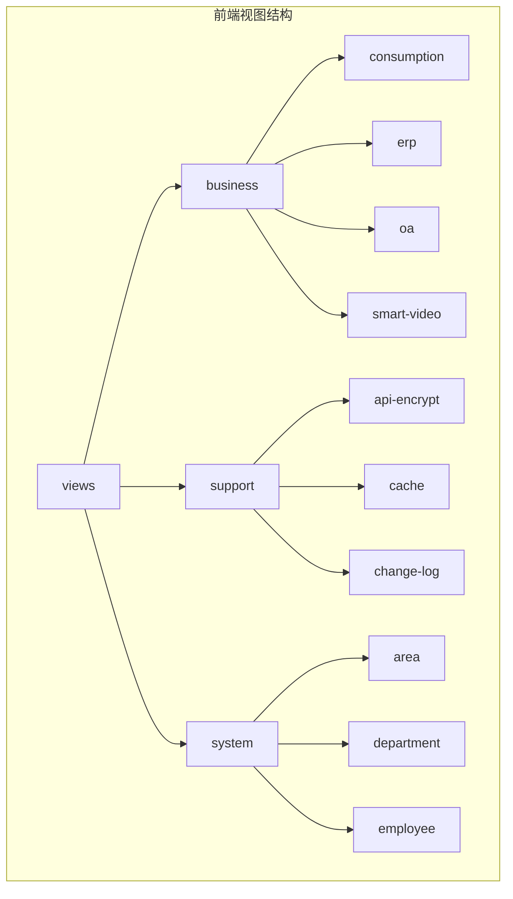
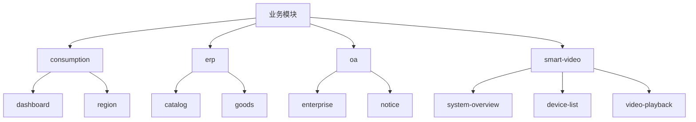
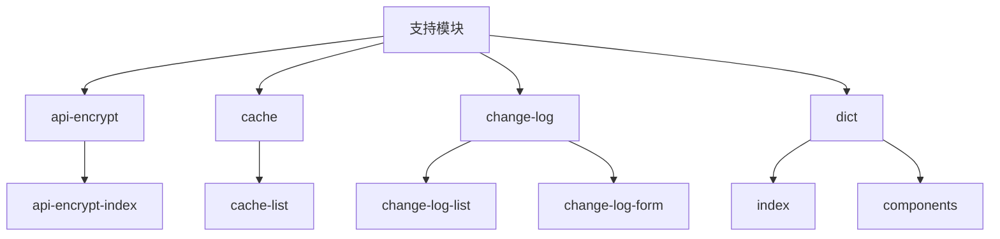
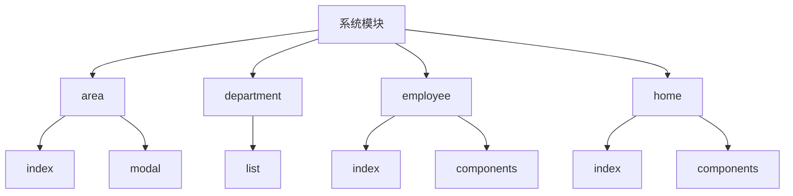
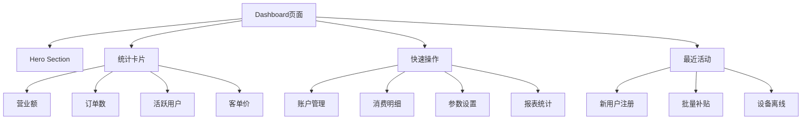
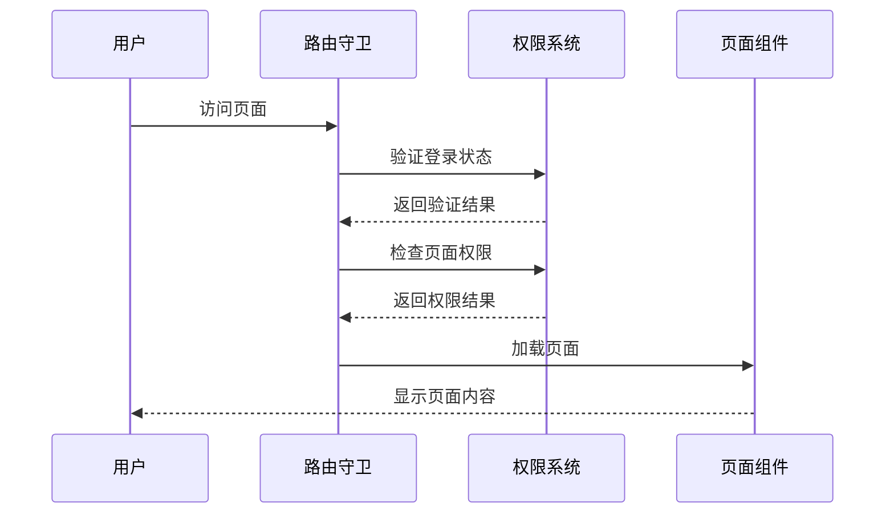
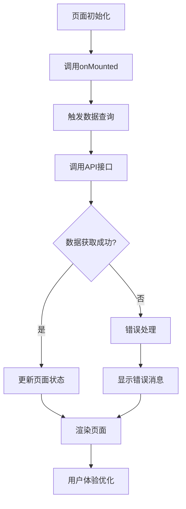
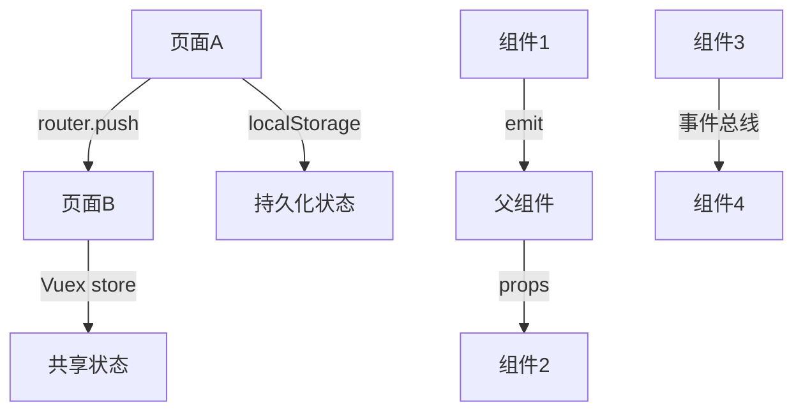

# 前端视图页面结构

<cite>
**本文档引用文件**  
- [index.vue](file://smart-admin-web-javascript/src/views/business/consumption/dashboard/index.vue)
- [system-overview.vue](file://smart-admin-web-javascript/src/views/business/smart-video/system-overview.vue)
- [index.vue](file://smart-admin-web-javascript/src/views/support/dict/index.vue)
- [index.vue](file://smart-admin-web-javascript/src/views/system/home/index.vue)
- [index.vue](file://smart-admin-web-javascript/src/layout/index.vue)
- [device-list.vue](file://smart-admin-web-javascript/src/views/business/smart-video/device-list.vue)
- [employee/index.vue](file://smart-admin-web-javascript/src/views/system/employee/index.vue)
- [router/index.js](file://smart-admin-web-javascript/src/router/index.js)
- [routers.js](file://smart-admin-web-javascript/src/router/routers.js)
- [privilege.js](file://smart-admin-web-javascript/src/directives/privilege.js)
</cite>

## 目录
1. [项目结构概述](#项目结构概述)
2. [业务模块页面实现](#业务模块页面实现)
3. [支持功能模块管理页面](#支持功能模块管理页面)
4. [系统基础功能页面](#系统基础功能页面)
5. [典型页面实现示例](#典型页面实现示例)
6. [页面路由与权限控制](#页面路由与权限控制)
7. [数据加载与用户体验](#数据加载与用户体验)
8. [页面导航与状态传递](#页面导航与状态传递)

## 项目结构概述

前端视图页面结构采用模块化组织方式，主要分为三大模块：业务（business）、支持（support）和系统（system）。views目录下按照功能模块进行分类，每个模块包含相应的页面组件。项目采用Vue 3 + Vite技术栈，结合Ant Design Vue组件库实现现代化的管理界面。

页面结构遵循统一的设计规范，包含查询表单、操作按钮区、数据表格和分页组件等标准元素。通过组件化开发模式，实现了代码的高复用性和可维护性。项目支持多种布局模式，包括侧边菜单、顶部菜单和展开菜单等，满足不同用户的使用习惯。

**Diagram sources**
- [index.vue](file://smart-admin-web-javascript/src/views/business/consumption/dashboard/index.vue)
- [system-overview.vue](file://smart-admin-web-javascript/src/views/business/smart-video/system-overview.vue)
- [index.vue](file://smart-admin-web-javascript/src/views/support/dict/index.vue)

## 业务模块页面实现

业务模块包含consumption、erp、oa和smart-video四个子模块，每个模块针对特定业务场景提供完整的功能页面。consumption模块以dashboard为核心，提供消费管理的概览信息，包含统计卡片、快速操作和最近活动等组件。

erp模块包含商品目录和商品列表页面，采用树形结构展示商品分类，支持商品的增删改查操作。oa模块提供企业信息和通知管理功能，支持企业信息的详细查看和通知的发布管理。

smart-video模块是智能视频监控的核心，包含系统概览、设备管理、视频预览、告警处理等多种功能页面。系统概览页面通过KPI卡片、趋势图表和状态监控等组件，全面展示视频监控系统的运行状态。

**Diagram sources**
- [index.vue](file://smart-admin-web-javascript/src/views/business/consumption/dashboard/index.vue)
- [system-overview.vue](file://smart-admin-web-javascript/src/views/business/smart-video/system-overview.vue)
- [device-list.vue](file://smart-admin-web-javascript/src/views/business/smart-video/device-list.vue)

**Section sources**
- [index.vue](file://smart-admin-web-javascript/src/views/business/consumption/dashboard/index.vue)
- [system-overview.vue](file://smart-admin-web-javascript/src/views/business/smart-video/system-overview.vue)
- [device-list.vue](file://smart-admin-web-javascript/src/views/business/smart-video/device-list.vue)

## 支持功能模块管理页面

支持功能模块提供系统级的管理工具，包括api-encrypt、cache、change-log等功能。这些页面的设计特点是以数据表格为核心，配合查询表单和操作按钮，实现对系统配置的集中管理。

dict（数据字典）页面是支持模块的典型代表，采用查询表单、操作按钮、数据表格和分页组件的标准布局。页面支持关键字搜索、状态筛选、新建、编辑、删除等操作，并通过TableOperator组件实现表格列的动态配置。

change-log模块提供变更日志的记录和查询功能，支持按时间范围、操作类型等条件进行筛选。cache模块用于管理缓存数据，提供缓存清理、刷新等操作功能。这些管理页面都遵循统一的UI规范，确保用户体验的一致性。

**Diagram sources**
- [index.vue](file://smart-admin-web-javascript/src/views/support/dict/index.vue)

**Section sources**
- [index.vue](file://smart-admin-web-javascript/src/views/support/dict/index.vue)

## 系统基础功能页面

系统模块提供基础的组织架构和权限管理功能，包括area（区域）、department（部门）、employee（员工）等页面。这些页面构成了系统的基础数据管理功能，为其他业务模块提供数据支持。

employee页面采用左右布局，左侧显示部门树形结构，右侧显示员工列表。通过部门树的选择，动态加载对应部门的员工数据，实现组织架构的可视化管理。页面支持员工的增删改查操作，并与角色、权限等模块进行关联。

home页面作为系统首页，采用响应式布局，包含用户信息、公告通知、数据图表和快捷入口等组件。页面通过HomeHeader、HomeNotice等子组件实现模块化设计，支持根据用户角色和权限动态显示内容。

**Diagram sources**
- [index.vue](file://smart-admin-web-javascript/src/views/system/employee/index.vue)
- [index.vue](file://smart-admin-web-javascript/src/views/system/home/index.vue)

**Section sources**
- [index.vue](file://smart-admin-web-javascript/src/views/system/employee/index.vue)
- [index.vue](file://smart-admin-web-javascript/src/views/system/home/index.vue)

## 典型页面实现示例

以consumption模块的dashboard页面为例，展示典型的页面布局和组件组合模式。页面采用响应式设计，包含hero section、统计卡片、快速操作和最近活动等组件。

统计卡片组件使用Ant Design Vue的Card和Statistic组件，通过grid布局实现响应式排列。每个卡片包含标题、图标、数值和变化率等元素，通过CSS样式实现悬停效果和渐变背景。

快速操作组件采用卡片式布局，每个操作项包含图标、标题和描述，通过点击事件实现页面跳转或功能调用。最近活动组件使用列表展示，包含活动类型、标题、描述和时间等信息，支持刷新操作。

**Diagram sources**
- [index.vue](file://smart-admin-web-javascript/src/views/business/consumption/dashboard/index.vue)

**Section sources**
- [index.vue](file://smart-admin-web-javascript/src/views/business/consumption/dashboard/index.vue)

## 页面路由与权限控制

页面路由采用动态路由配置方式，通过router/index.js中的buildRoutes方法根据用户权限动态生成路由。路由配置存储在routers.js文件中，通过模块化方式引入不同功能模块的路由配置。

权限控制通过privilege指令实现，该指令在directives/privilege.js中定义。指令根据用户权限列表检查当前操作的权限，如果没有权限则移除对应的DOM元素。权限命名遵循"模块:功能:操作"的规范，如"support:dict:add"表示支持模块字典功能的添加操作。

路由守卫在router/index.js中定义，包含beforeEach和afterEach钩子。beforeEach钩子负责权限验证和登录状态检查，afterEach钩子负责进度条的关闭。通过meta字段配置页面的标题、图标、缓存等属性，实现页面的个性化展示。

**Diagram sources**
- [router/index.js](file://smart-admin-web-javascript/src/router/index.js)
- [routers.js](file://smart-admin-web-javascript/src/router/routers.js)
- [privilege.js](file://smart-admin-web-javascript/src/directives/privilege.js)

**Section sources**
- [router/index.js](file://smart-admin-web-javascript/src/router/index.js)
- [routers.js](file://smart-admin-web-javascript/src/router/routers.js)
- [privilege.js](file://smart-admin-web-javascript/src/directives/privilege.js)

## 数据加载与用户体验

数据加载流程遵循统一的模式：页面初始化时调用onMounted钩子，触发数据查询方法。查询方法通过API模块调用后端接口，获取数据后更新页面状态。对于复杂的页面，采用分步加载策略，优先显示关键信息，再加载次要内容。

用户体验优化策略包括：使用nProgress实现页面加载进度条，提供视觉反馈；通过keep-alive缓存常用页面，提升切换速度；采用虚拟滚动技术处理大数据量表格，保证页面流畅性；实现响应式设计，适配不同屏幕尺寸。

错误处理采用统一的异常捕获机制，通过smartSentry工具捕获并上报错误。对于用户操作的反馈，使用message组件提供成功、警告、错误等不同类型的消息提示，确保用户及时了解操作结果。

**Section sources**
- [index.vue](file://smart-admin-web-javascript/src/views/business/consumption/dashboard/index.vue)
- [system-overview.vue](file://smart-admin-web-javascript/src/views/business/smart-video/system-overview.vue)
- [index.vue](file://smart-admin-web-javascript/src/views/support/dict/index.vue)

## 页面导航与状态传递

页面间导航通过Vue Router实现，支持编程式导航和声明式导航两种方式。编程式导航使用router.push方法，可以在事件处理函数中实现页面跳转；声明式导航使用router-link组件，在模板中定义导航链接。

状态传递主要通过路由参数和Vuex store实现。路由参数适用于传递简单的标识符，如ID值；Vuex store适用于传递复杂的数据对象或跨页面共享的状态。对于需要持久化的状态，使用localStorage进行存储。

页面间通信采用事件总线模式，通过mitt库实现组件间的解耦通信。对于父子组件间的通信，使用props和emit机制；对于非父子组件间的通信，使用全局事件总线或Vuex store。

**Section sources**
- [index.vue](file://smart-admin-web-javascript/src/views/business/consumption/dashboard/index.vue)
- [system-overview.vue](file://smart-admin-web-javascript/src/views/business/smart-video/system-overview.vue)
- [index.vue](file://smart-admin-web-javascript/src/views/system/employee/index.vue)