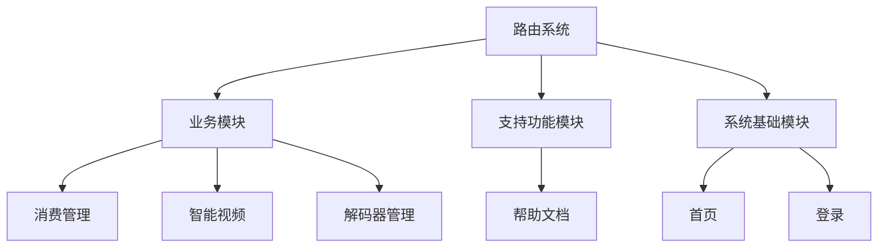
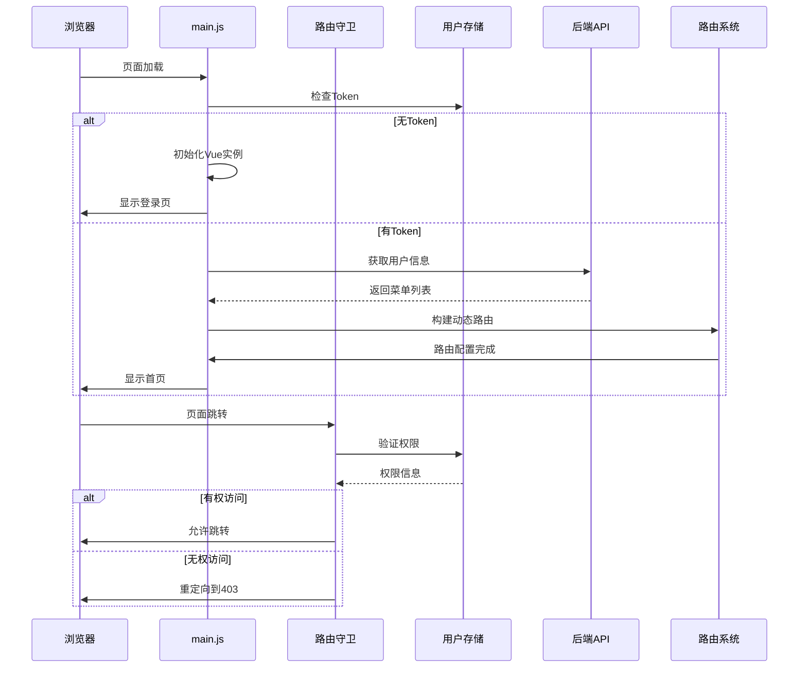
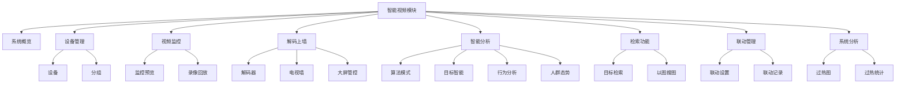
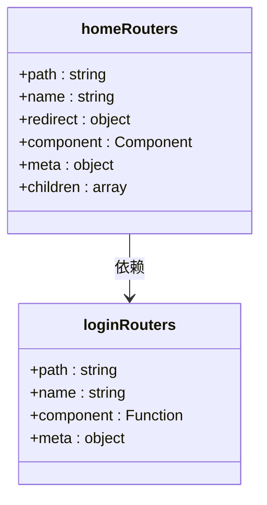
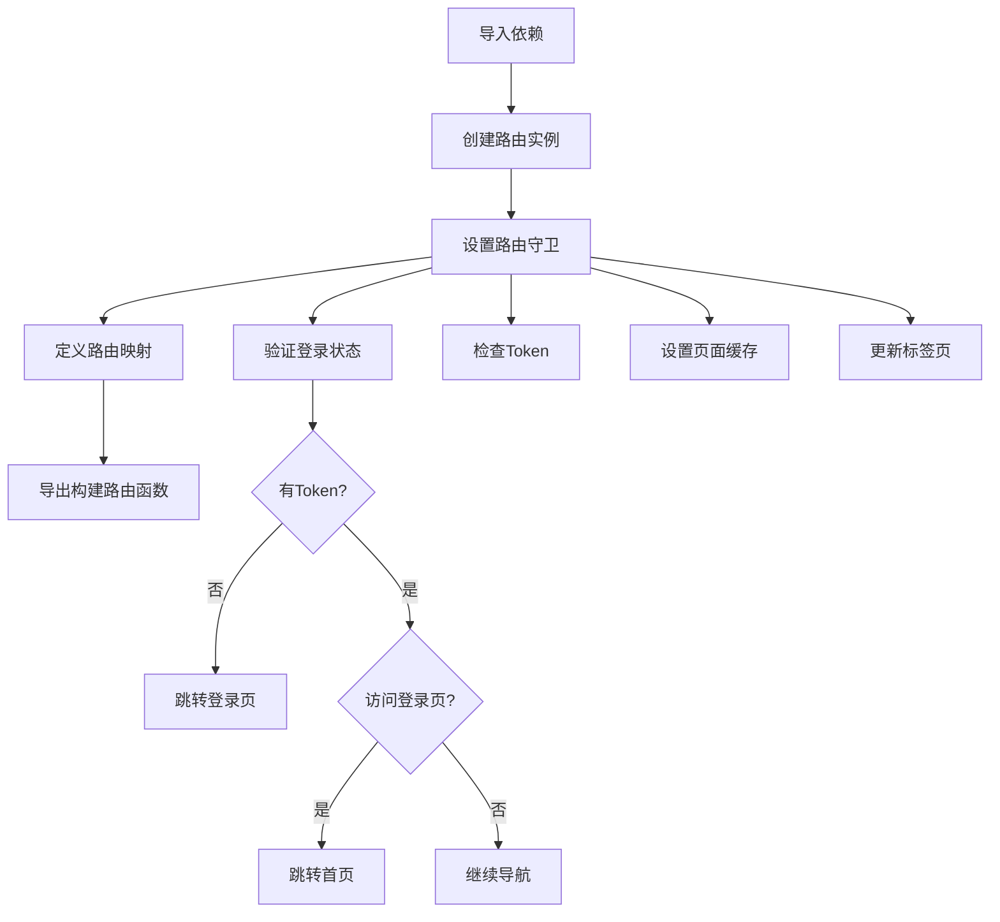
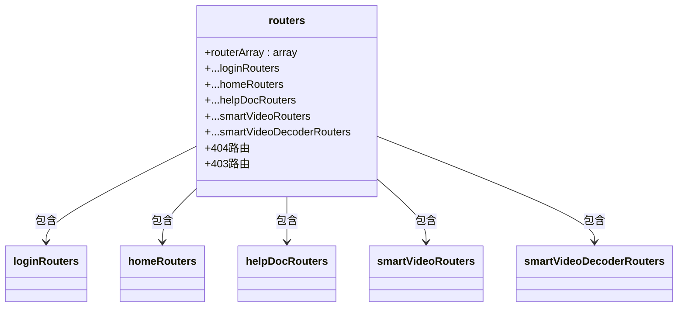
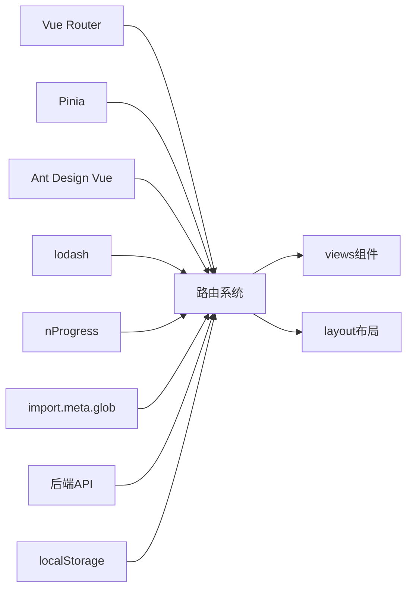
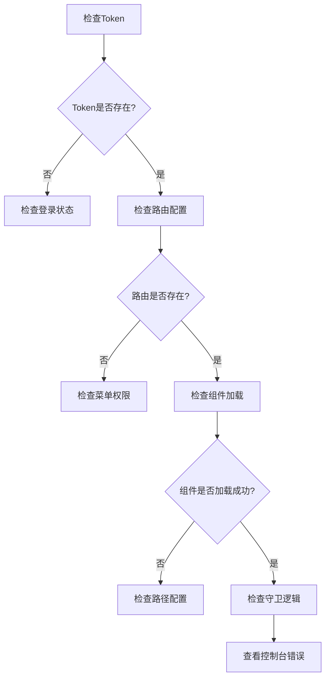

# 前端路由系统

<cite>
**本文档引用文件**  
- [index.js](file://smart-admin-web-javascript/src/router/index.js)
- [routers.js](file://smart-admin-web-javascript/src/router/routers.js)
- [consumption.js](file://smart-admin-web-javascript/src/router/business/consumption.js)
- [smart-video-decoder.js](file://smart-admin-web-javascript/src/router/business/smart-video-decoder.js)
- [smart-video.js](file://smart-admin-web-javascript/src/router/business/smart-video.js)
- [help-doc.js](file://smart-admin-web-javascript/src/router/support/help-doc.js)
- [home.js](file://smart-admin-web-javascript/src/router/system/home.js)
- [login.js](file://smart-admin-web-javascript/src/router/system/login.js)
- [menu-const.js](file://smart-admin-web-javascript/src/constants/system/menu-const.js)
- [common-const.js](file://smart-admin-web-javascript/src/constants/common-const.js)
- [main.js](file://smart-admin-web-javascript/src/main.js)
- [user.js](file://smart-admin-web-javascript/src/store/modules/system/user.js)
</cite>

## 目录
1. [项目结构](#项目结构)
2. [核心组件](#核心组件)
3. [架构概述](#架构概述)
4. [详细组件分析](#详细组件分析)
5. [依赖分析](#依赖分析)
6. [性能考虑](#性能考虑)
7. [故障排除指南](#故障排除指南)
8. [结论](#结论)

## 项目结构

前端路由系统采用模块化设计，将不同业务功能的路由配置分离到独立的文件中，便于维护和扩展。系统主要分为业务模块、支持功能模块和系统基础模块三大类。



**图表来源**  
- [routers.js](file://smart-admin-web-javascript/src/router/routers.js#L10-L23)

**章节来源**  
- [routers.js](file://smart-admin-web-javascript/src/router/routers.js#L1-L27)

## 核心组件

前端路由系统的核心组件包括路由初始化、路由表构建、路由守卫和动态路由加载机制。系统采用Vue Router作为路由管理器，结合Pinia状态管理，实现了灵活的路由控制和权限验证。

**章节来源**  
- [index.js](file://smart-admin-web-javascript/src/router/index.js#L1-L166)
- [main.js](file://smart-admin-web-javascript/src/main.js#L1-L107)

## 架构概述

系统采用动态路由与静态路由相结合的架构模式。静态路由用于定义系统基础页面（如登录、404等），而动态路由则根据用户权限从后端获取菜单配置，实现个性化路由加载。



**图表来源**  
- [main.js](file://smart-admin-web-javascript/src/main.js#L50-L107)
- [index.js](file://smart-admin-web-javascript/src/router/index.js#L30-L88)

## 详细组件分析

### 业务模块路由分析

#### 消费管理模块
消费管理模块路由采用静态配置方式，主要用于开发阶段快速测试。生产环境推荐使用后端动态获取菜单配置的方式。

```mermaid
classDiagram
class consumptionRouters {
+path : string
+name : string
+component : Function
+meta : object
}
consumptionRouters : +title : string
consumptionRouters : +menuType : number
consumptionRouters : +icon : string
consumptionRouters : +hideInMenu : boolean
consumptionRouters : +keepAlive : boolean
```

**图表来源**  
- [consumption.js](file://smart-admin-web-javascript/src/router/business/consumption.js#L14-L60)

**章节来源**  
- [consumption.js](file://smart-admin-web-javascript/src/router/business/consumption.js#L1-L62)

#### 智能视频模块
智能视频模块包含多个子功能，每个功能都有独立的路由配置。路由的name属性与数据库中的menuId保持一致，确保菜单高亮正确。



**图表来源**  
- [smart-video.js](file://smart-admin-web-javascript/src/router/business/smart-video.js#L18-L295)

**章节来源**  
- [smart-video.js](file://smart-admin-web-javascript/src/router/business/smart-video.js#L1-L295)
- [smart-video-decoder.js](file://smart-admin-web-javascript/src/router/business/smart-video-decoder.js#L1-L33)

### 支持功能模块路由分析

#### 帮助文档模块
支持功能模块路由具有特殊的配置特点，如帮助文档采用独立的布局组件，且在菜单中隐藏。

```mermaid
classDiagram
class helpDocRouters {
+path : string
+name : string
+component : Component
+meta : object
+children : array
}
helpDocRouters : +title : string
helpDocRouters : +hideInMenu : boolean
```

**图表来源**  
- [help-doc.js](file://smart-admin-web-javascript/src/router/support/help-doc.js#L12-L28)

**章节来源**  
- [help-doc.js](file://smart-admin-web-javascript/src/router/support/help-doc.js#L1-L29)

### 系统模块路由分析

#### 首页与登录路由
系统模块路由定义了基础的路由结构，包括首页重定向和登录页面。



**图表来源**  
- [home.js](file://smart-admin-web-javascript/src/router/system/home.js#L14-L48)
- [login.js](file://smart-admin-web-javascript/src/router/system/login.js#L11-L21)

**章节来源**  
- [home.js](file://smart-admin-web-javascript/src/router/system/home.js#L1-L49)
- [login.js](file://smart-admin-web-javascript/src/router/system/login.js#L1-L22)

### 路由初始化流程

#### index.js路由初始化
index.js文件负责路由的初始化和路由守卫的设置，是整个路由系统的核心。



**图表来源**  
- [index.js](file://smart-admin-web-javascript/src/router/index.js#L1-L166)

**章节来源**  
- [index.js](file://smart-admin-web-javascript/src/router/index.js#L1-L166)

### 路由表构建机制

#### routers.js路由表构建
routers.js文件是所有路由的入口，通过模块化导入的方式整合各个模块的路由配置。



**图表来源**  
- [routers.js](file://smart-admin-web-javascript/src/router/routers.js#L18-L26)

**章节来源**  
- [routers.js](file://smart-admin-web-javascript/src/router/routers.js#L1-L27)

## 依赖分析

前端路由系统依赖于多个核心模块和第三方库，形成了完整的依赖链。



**图表来源**  
- [index.js](file://smart-admin-web-javascript/src/router/index.js#L10-L20)
- [main.js](file://smart-admin-web-javascript/src/main.js#L11-L36)

**章节来源**  
- [index.js](file://smart-admin-web-javascript/src/router/index.js#L1-L166)
- [main.js](file://smart-admin-web-javascript/src/main.js#L1-L107)

## 性能考虑

路由系统在性能优化方面采取了多项策略，包括路由懒加载、组件缓存和按需加载等。

**章节来源**  
- [index.js](file://smart-admin-web-javascript/src/router/index.js#L65-L75)
- [smart-video.js](file://smart-admin-web-javascript/src/router/business/smart-video.js#L22-L23)

## 故障排除指南

### 路由守卫问题排查
当遇到路由跳转异常时，可按照以下步骤进行排查：



**图表来源**  
- [index.js](file://smart-admin-web-javascript/src/router/index.js#L31-L57)

**章节来源**  
- [index.js](file://smart-admin-web-javascript/src/router/index.js#L30-L88)
- [main.js](file://smart-admin-web-javascript/src/main.js#L101-L106)

## 结论

前端路由系统采用模块化设计，通过静态路由与动态路由相结合的方式，实现了灵活的路由管理和权限控制。系统通过路由守卫实现了登录验证、权限检查和页面缓存等功能，确保了应用的安全性和用户体验。建议在生产环境中使用动态路由方式，通过后端接口获取用户权限对应的菜单配置，实现个性化的路由加载。