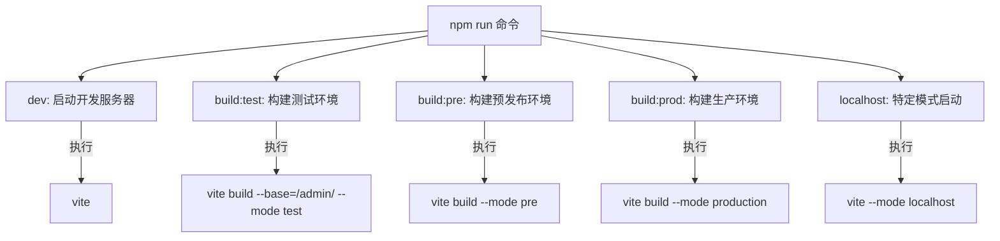
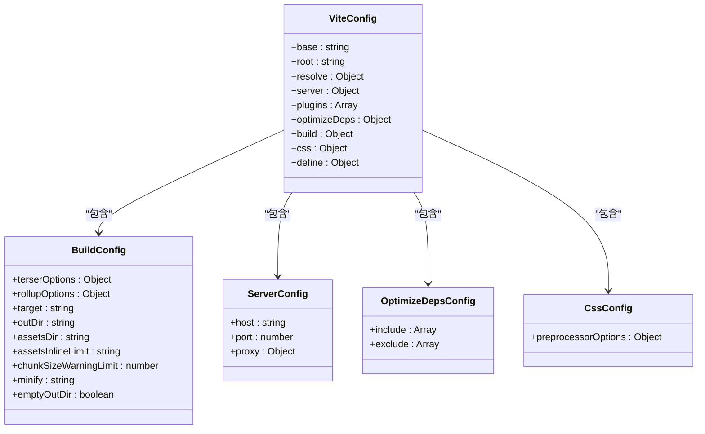
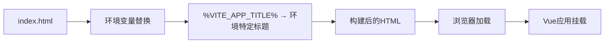

# 前端配置结构

<cite>
**本文档中引用的文件**  
- [.env.development](file://smart-admin-web-javascript/.env.development)
- [.env.production](file://smart-admin-web-javascript/.env.production)
- [.env.test](file://smart-admin-web-javascript/.env.test)
- [package.json](file://smart-admin-web-javascript/package.json)
- [vite.config.js](file://smart-admin-web-javascript/vite.config.js)
- [jsconfig.json](file://smart-admin-web-javascript/jsconfig.json)
- [index.html](file://smart-admin-web-javascript/index.html)
- [src/main.js](file://smart-admin-web-javascript/src/main.js)
- [src/config/app-config.js](file://smart-admin-web-javascript/src/config/app-config.js)
</cite>

## 目录
1. [简介](#简介)
2. [环境变量配置](#环境变量配置)
3. [项目元数据与依赖管理](#项目元数据与依赖管理)
4. [Vite构建配置](#vite构建配置)
5. [JavaScript项目配置](#javascript项目配置)
6. [HTML模板结构](#html模板结构)
7. [配置最佳实践](#配置最佳实践)
8. [结论](#结论)

## 简介
本文档全面分析smart-admin-web-javascript项目的前端配置结构体系。重点解析环境变量文件、package.json、vite.config.js、jsconfig.json和index.html等核心配置文件的作用与配置逻辑，为开发者提供清晰的配置指导和最佳实践建议。

## 环境变量配置

smart-admin-web-javascript项目通过多个环境变量文件实现不同环境下的配置管理，主要包括`.env.development`、`.env.production`和`.env.test`三个文件，每个文件针对特定的运行环境进行配置。

### 开发环境配置 (.env.development)
开发环境配置文件定义了本地开发时的应用参数：
- `NODE_ENV=development`：标识当前为开发环境
- `VITE_APP_TITLE='SmartAdmin 开发环境(Dev)'`：应用标题，显示为"SmartAdmin 开发环境(Dev)"
- `VITE_APP_API_URL='http://127.0.0.1:1024'`：API接口基础URL，指向本地开发服务器

### 生产环境配置 (.env.production)
生产环境配置文件定义了线上部署时的应用参数：
- `NODE_ENV=production`：标识当前为生产环境
- `VITE_APP_TITLE='SmartAdmin V3.X'`：应用标题，显示为"SmartAdmin V3.X"
- `VITE_APP_API_URL='https://preview.smartadmin.vip/smart-admin-api'`：API接口基础URL，指向生产环境服务器

### 测试环境配置 (.env.test)
测试环境配置文件定义了测试部署时的应用参数：
- `NODE_ENV=production`：标识当前为生产环境（测试环境通常使用生产构建）
- `VITE_APP_TITLE='SmartAdmin 测试环境(Test)'`：应用标题，显示为"SmartAdmin 测试环境(Test)"
- `VITE_APP_API_URL='http://127.0.0.1:1024'`：API接口基础URL，指向本地测试服务器

### VITE_前缀环境变量使用规范
项目遵循Vite框架的环境变量命名规范，所有需要在客户端代码中访问的环境变量必须以`VITE_`为前缀。这种设计确保了环境变量的安全性，只有以`VITE_`开头的变量才会被暴露给客户端代码，其他变量仅在构建时可用。在代码中通过`import.meta.env.VITE_APP_API_URL`等方式访问这些变量，如在`src/lib/axios.js`中用于配置API基础URL。

**Section sources**
- [.env.development](file://smart-admin-web-javascript/.env.development)
- [.env.production](file://smart-admin-web-javascript/.env.production)
- [.env.test](file://smart-admin-web-javascript/.env.test)
- [src/lib/axios.js](file://smart-admin-web-javascript/src/lib/axios.js#L23)

## 项目元数据与依赖管理

### 项目元数据
package.json文件中的元数据定义了项目的基本信息：
- `name`: "smartadmin" - 项目名称
- `version`: "3.0.0" - 项目版本号
- `author`: 包含作者名称、邮箱和网站信息
- `license`: "MIT" - 开源许可证类型
- `homepage`: 项目主页URL
- `repository`: Git仓库信息

### 依赖管理
项目采用标准的npm依赖管理机制，将依赖分为生产依赖和开发依赖。

#### 生产依赖 (dependencies)
生产依赖包含项目运行所必需的库：
- 前端框架：vue@3.4.27, vue-router@4.3.2, pinia@2.1.7
- UI组件库：ant-design-vue@4.2.5, @ant-design/icons-vue@7.0.1
- 状态管理：pinia@2.1.7
- 国际化：vue-i18n@9.13.1
- HTTP客户端：axios@1.6.8
- 工具库：lodash@4.17.21, dayjs@1.11.13, crypto-js@4.1.1
- 可视化：echarts@5.4.3
- 富文本编辑器：@wangeditor-next/editor@5.6.34

#### 开发依赖 (devDependencies)
开发依赖包含构建和开发工具：
- 构建工具：vite@5.2.12
- Vite插件：@vitejs/plugin-vue@5.0.4
- 代码校验：eslint, prettier, stylelint及相关插件
- 编译器：@vue/compiler-sfc@3.4.27
- CSS预处理器：less@4.2.0, less-loader@11.1.3
- 代码压缩：terser@5.29.2

### 脚本命令配置
package.json中的scripts字段定义了项目的执行命令：

**Diagram sources**
- [package.json](file://smart-admin-web-javascript/package.json#L11-L17)

**Section sources**
- [package.json](file://smart-admin-web-javascript/package.json#L1-L75)

## Vite构建配置

vite.config.js文件是Vite构建工具的核心配置文件，定义了项目的构建行为和开发服务器设置。

### 基础配置
- `base`: 根据NODE_ENV决定基础路径，生产环境为'/'，其他环境为'/'
- `root`: 项目根目录，使用process.cwd()获取当前工作目录

### 路径别名配置
通过resolve.alias配置路径别名，简化模块导入：
- `/@/` 别名指向 `src/` 目录，允许使用`/@/components/xxx`方式导入src目录下的模块
- vue-i18n别名指向其cjs版本，解决特定环境下的兼容性问题
- `~/` 前缀被移除，便于处理某些库的导入

### 服务器配置 (server)
开发服务器配置定义了本地开发时的服务行为：
- `host`: '0.0.0.0'，允许外部设备访问
- `port`: 8081，指定开发服务器端口
- 代理配置：将所有请求代理到`http://127.0.0.1:1024/`，解决开发环境下的跨域问题

### 插件配置
- `vue()`: Vite的Vue插件，支持Vue单文件组件

### 预加载配置 (optimizeDeps)
优化依赖预构建，提升开发服务器启动速度：
- `include`: 明确包含需要预构建的模块，如ant-design-vue和dayjs的国际化文件
- `exclude`: 排除vue-demi，避免不必要的预构建

### 构建配置 (build)
生产构建配置定义了打包输出的行为：
- 代码压缩：使用terserOptions清除console和debugger语句
- 输出目录：dist
- 静态资源目录：assets
- 分块策略：node_modules中的依赖按包名拆分，优化加载性能
- 文件命名：使用hash确保缓存失效
- 目标环境：esnext，充分利用现代浏览器特性
- 警告阈值：chunk大小超过500kb时发出警告

### CSS配置
- Less预处理器配置：使用自定义变量文件`/@/theme/custom-variables.js`，支持JavaScript表达式

**Diagram sources**
- [vite.config.js](file://smart-admin-web-javascript/vite.config.js#L17-L100)

**Section sources**
- [vite.config.js](file://smart-admin-web-javascript/vite.config.js#L1-L100)

## JavaScript项目配置

jsconfig.json文件为JavaScript项目提供编辑器和编译器配置，增强开发体验。

### 编译器选项
- `target`: "ES6" - 指定编译目标为ES6
- `jsx`: "preserve" - 保留JSX语法，由后续工具处理
- `module`: "commonjs" - 模块系统使用CommonJS
- `allowSyntheticDefaultImports`: true - 允许合成默认导入，兼容不同模块系统

### 路径映射
通过paths配置实现模块路径映射：
- `/@/*` 映射到 `src/*`，这是项目中最常用的路径别名
- 这种配置与vite.config.js中的别名配置相辅相成，确保编辑器和构建工具使用相同的路径解析规则

### 排除配置
- `exclude`: ["node_modules"] - 排除node_modules目录，避免类型检查性能问题

**Section sources**
- [jsconfig.json](file://smart-admin-web-javascript/jsconfig.json#L1-L17)

## HTML模板结构

index.html是应用的主HTML模板文件，定义了页面的基本结构和元信息。

### 文档结构
- DOCTYPE声明和html标签定义了文档类型和语言
- head部分包含字符编码、兼容性设置、视口配置和页面标题
- body部分包含应用挂载点和脚本引用

### 关键配置
- 视口设置：`width=device-width,initial-scale=1.0,...` 确保移动端适配
- 页面标题：使用`%VITE_APP_TITLE%`占位符，由Vite在构建时替换为环境变量VITE_APP_TITLE的值
- 应用挂载点：`

`，Vue应用将挂载到此元素
- 脚本引入：使用`type="module"`引入/src/main.js作为ES模块

### 环境变量注入
HTML模板支持环境变量注入，`%VITE_APP_TITLE%`会被替换为对应环境下的应用标题，实现不同环境显示不同标题的功能。

**Diagram sources**
- [index.html](file://smart-admin-web-javascript/index.html#L1-L25)
- [vite.config.js](file://smart-admin-web-javascript/vite.config.js#L17)

**Section sources**
- [index.html](file://smart-admin-web-javascript/index.html#L1-L25)
- [src/main.js](file://smart-admin-web-javascript/src/main.js#L1-L107)

## 配置最佳实践

### 添加新的环境变量
1. 在对应的环境文件(.env.development/.env.production/.env.test)中添加以`VITE_`为前缀的变量
2. 在代码中通过`import.meta.env.VITE_变量名`访问
3. 确保敏感信息不以`VITE_`开头，避免暴露给客户端

### 配置新的Vite插件
1. 通过npm安装插件包
2. 在vite.config.js中import插件
3. 将插件实例添加到plugins数组中
4. 根据需要配置插件选项

### 优化构建性能
1. 合理配置optimizeDeps.include，预构建常用但构建慢的依赖
2. 使用manualChunks进行代码分割，将第三方库拆分为独立chunk
3. 调整chunkSizeWarningLimit，根据实际需求设置合理的chunk大小警告阈值
4. 确保assetsInlineLimit设置合理，平衡HTTP请求数和文件大小

### 路径别名使用
1. 在vite.config.js中配置resolve.alias
2. 在jsconfig.json中配置paths，确保编辑器支持
3. 统一使用`/@/`前缀导入src目录下的模块，提高代码可读性和可维护性

### 应用配置管理
项目还包含src/config/app-config.js文件，定义了应用的默认配置，如布局、主题、颜色等。这些配置与环境变量配置相辅相成，环境变量主要用于环境相关的配置，而app-config.js用于应用内部的功能和样式配置。

**Section sources**
- [vite.config.js](file://smart-admin-web-javascript/vite.config.js#L53-L56)
- [jsconfig.json](file://smart-admin-web-javascript/jsconfig.json#L8-L12)
- [src/config/app-config.js](file://smart-admin-web-javascript/src/config/app-config.js#L1-L52)

## 结论
smart-admin-web-javascript项目的配置体系结构清晰，遵循现代前端开发的最佳实践。通过环境变量文件实现多环境配置，利用Vite的强大功能进行高效构建，配合合理的依赖管理和路径配置，为开发者提供了良好的开发体验。理解这些配置文件的作用和相互关系，有助于更高效地进行项目开发和维护。