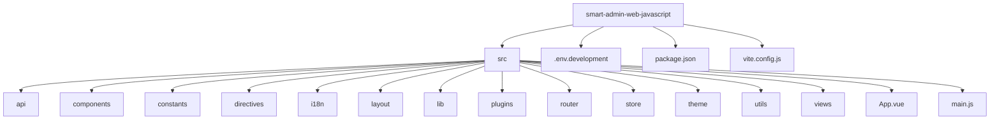
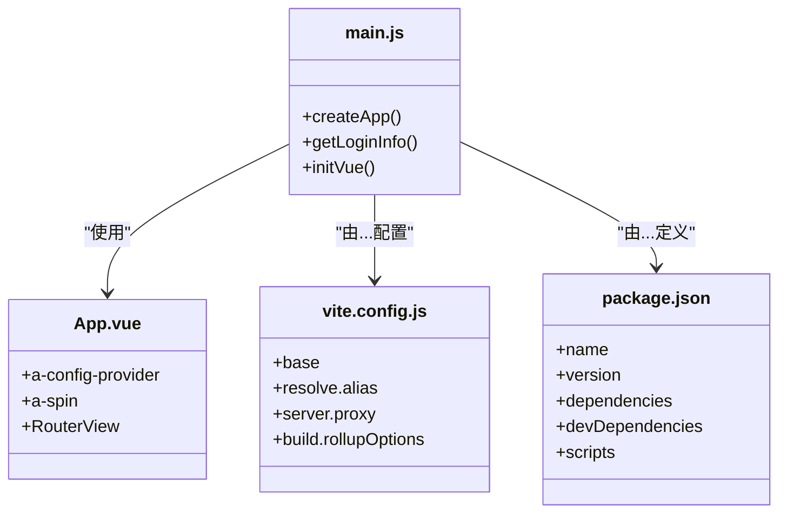
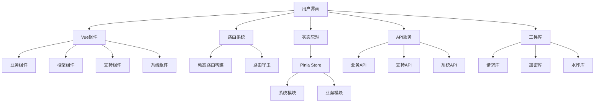
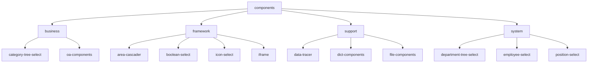
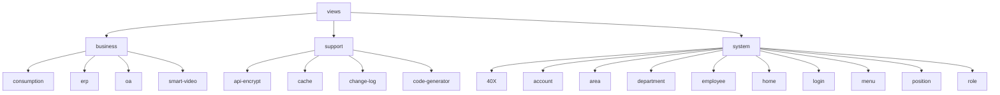
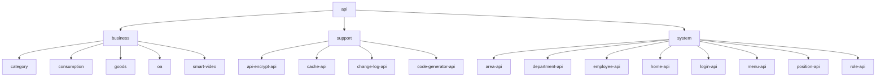
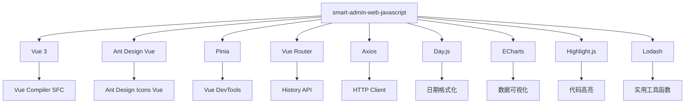

# 前端项目结构

<cite>
**本文档引用的文件**  
- [main.js](file://smart-admin-web-javascript/src/main.js)
- [App.vue](file://smart-admin-web-javascript/src/App.vue)
- [vite.config.js](file://smart-admin-web-javascript/vite.config.js)
- [package.json](file://smart-admin-web-javascript/package.json)
- [.env.development](file://smart-admin-web-javascript/.env.development)
- [router/index.js](file://smart-admin-web-javascript/src/router/index.js)
- [store/index.js](file://smart-admin-web-javascript/src/store/index.js)
- [layout/index.vue](file://smart-admin-web-javascript/src/layout/index.vue)
- [constants/index.js](file://smart-admin-web-javascript/src/constants/index.js)
- [i18n/index.js](file://smart-admin-web-javascript/src/i18n/index.js)
- [api/system/login-api.js](file://smart-admin-web-javascript/src/api/system/login-api.js)
- [components/business/category-tree-select/index.vue](file://smart-admin-web-javascript/src/components/business/category-tree-select/index.vue)
- [views/business/consumption/dashboard/index.vue](file://smart-admin-web-javascript/src/views/business/consumption/dashboard/index.vue)
- [plugins/privilege-plugin.js](file://smart-admin-web-javascript/src/plugins/privilege-plugin.js)
- [theme/color.js](file://smart-admin-web-javascript/src/theme/color.js)
</cite>

## 目录
1. [项目结构](#项目结构)
2. [核心组件](#核心组件)
3. [架构概述](#架构概述)
4. [详细组件分析](#详细组件分析)
5. [依赖分析](#依赖分析)
6. [性能考虑](#性能考虑)
7. [故障排除指南](#故障排除指南)
8. [结论](#结论)

## 项目结构

smart-admin-web-javascript项目采用基于Vue 3的现代化前端架构，使用Vite作为构建工具。项目结构清晰地分为src目录下的多个功能区域，包括api接口定义、components组件库、constants常量定义、directives指令、i18n国际化、layout布局组件、lib基础库、plugins插件、router路由配置、store状态管理、theme主题和views视图页面。

**图示来源**
- [main.js](file://smart-admin-web-javascript/src/main.js#L1-L107)
- [App.vue](file://smart-admin-web-javascript/src/App.vue#L1-L128)
- [vite.config.js](file://smart-admin-web-javascript/vite.config.js#L1-L100)

**本节来源**
- [main.js](file://smart-admin-web-javascript/src/main.js#L1-L107)
- [App.vue](file://smart-admin-web-javascript/src/App.vue#L1-L128)
- [vite.config.js](file://smart-admin-web-javascript/vite.config.js#L1-L100)

## 核心组件

项目的核心组件包括main.js作为项目启动入口，App.vue作为主应用页面，vite.config.js作为构建配置，package.json作为依赖管理文件。这些文件共同构成了项目的基础设施。

main.js文件负责项目的初始化逻辑，包括获取用户登录信息、构建动态路由、创建Vue应用实例等。App.vue文件作为应用的根组件，包含了全局配置、主题设置和路由视图。vite.config.js文件配置了Vite构建工具的各种选项，包括别名配置、服务器代理、构建优化等。

**图示来源**
- [main.js](file://smart-admin-web-javascript/src/main.js#L1-L107)
- [App.vue](file://smart-admin-web-javascript/src/App.vue#L1-L128)
- [vite.config.js](file://smart-admin-web-javascript/vite.config.js#L1-L100)
- [package.json](file://smart-admin-web-javascript/package.json#L1-L75)

**本节来源**
- [main.js](file://smart-admin-web-javascript/src/main.js#L1-L107)
- [App.vue](file://smart-admin-web-javascript/src/App.vue#L1-L128)
- [vite.config.js](file://smart-admin-web-javascript/vite.config.js#L1-L100)
- [package.json](file://smart-admin-web-javascript/package.json#L1-L75)

## 架构概述

项目采用现代化的前端架构，基于Vue 3和Pinia状态管理，使用Vite作为构建工具。架构设计遵循模块化原则，将不同功能分离到独立的目录中，便于维护和扩展。

**图示来源**
- [main.js](file://smart-admin-web-javascript/src/main.js#L1-L107)
- [router/index.js](file://smart-admin-web-javascript/src/router/index.js#L1-L166)
- [store/index.js](file://smart-admin-web-javascript/src/store/index.js#L1-L13)
- [api/system/login-api.js](file://smart-admin-web-javascript/src/api/system/login-api.js#L1-L55)

**本节来源**
- [main.js](file://smart-admin-web-javascript/src/main.js#L1-L107)
- [router/index.js](file://smart-admin-web-javascript/src/router/index.js#L1-L166)
- [store/index.js](file://smart-admin-web-javascript/src/store/index.js#L1-L13)

## 详细组件分析

### 组件库分类

项目中的组件库按照功能分为business业务组件、framework框架组件、support支持组件和system系统组件。这种分类方式有助于团队协作和代码维护。

**图示来源**
- [components/business/category-tree-select/index.vue](file://smart-admin-web-javascript/src/components/business/category-tree-select/index.vue#L1-L87)
- [components/framework/area-cascader/index.vue](file://smart-admin-web-javascript/src/components/framework/area-cascader/index.vue)
- [components/support/data-tracer/index.vue](file://smart-admin-web-javascript/src/components/support/data-tracer/index.vue)
- [components/system/department-tree-select/index.vue](file://smart-admin-web-javascript/src/components/system/department-tree-select/index.vue)

**本节来源**
- [components/business/category-tree-select/index.vue](file://smart-admin-web-javascript/src/components/business/category-tree-select/index.vue#L1-L87)
- [components/framework/area-cascader/index.vue](file://smart-admin-web-javascript/src/components/framework/area-cascader/index.vue)
- [components/support/data-tracer/index.vue](file://smart-admin-web-javascript/src/components/support/data-tracer/index.vue)
- [components/system/department-tree-select/index.vue](file://smart-admin-web-javascript/src/components/system/department-tree-select/index.vue)

### 视图页面组织

views目录中的页面按照business、support和system三大功能区域进行组织。每个区域包含相应的功能模块，如business区域包含consumption、erp、oa和smart-video等子模块。

**图示来源**
- [views/business/consumption/dashboard/index.vue](file://smart-admin-web-javascript/src/views/business/consumption/dashboard/index.vue#L1-L492)
- [views/support/change-log/index.vue](file://smart-admin-web-javascript/src/views/support/change-log/index.vue)
- [views/system/home/index.vue](file://smart-admin-web-javascript/src/views/system/home/index.vue)

**本节来源**
- [views/business/consumption/dashboard/index.vue](file://smart-admin-web-javascript/src/views/business/consumption/dashboard/index.vue#L1-L492)
- [views/support/change-log/index.vue](file://smart-admin-web-javascript/src/views/support/change-log/index.vue)
- [views/system/home/index.vue](file://smart-admin-web-javascript/src/views/system/home/index.vue)

### API接口定义

api目录中的接口定义按照business、support和system进行分类，每个分类下又有具体的模块。这种组织方式使得API调用更加清晰和易于维护。

**图示来源**
- [api/business/category/category-api.js](file://smart-admin-web-javascript/src/api/business/category/category-api.js)
- [api/support/change-log-api.js](file://smart-admin-web-javascript/src/api/support/change-log-api.js)
- [api/system/login-api.js](file://smart-admin-web-javascript/src/api/system/login-api.js#L1-L55)

**本节来源**
- [api/business/category/category-api.js](file://smart-admin-web-javascript/src/api/business/category/category-api.js)
- [api/support/change-log-api.js](file://smart-admin-web-javascript/src/api/support/change-log-api.js)
- [api/system/login-api.js](file://smart-admin-web-javascript/src/api/system/login-api.js#L1-L55)

## 依赖分析

项目依赖关系清晰，通过package.json文件管理所有依赖项。主要依赖包括Vue 3框架、Ant Design Vue组件库、Pinia状态管理、Vue Router路由等。

**图示来源**
- [package.json](file://smart-admin-web-javascript/package.json#L1-L75)
- [main.js](file://smart-admin-web-javascript/src/main.js#L1-L107)

**本节来源**
- [package.json](file://smart-admin-web-javascript/package.json#L1-L75)
- [main.js](file://smart-admin-web-javascript/src/main.js#L1-L107)

## 性能考虑

项目在性能方面做了多项优化，包括代码分割、懒加载、构建优化等。vite.config.js中的配置显示了对构建输出的精细控制，如chunk分拆、静态资源目录配置等。

最佳实践建议：
1. 新功能页面应在views目录下对应的功能区域创建，如业务功能在business目录下，系统功能在system目录下
2. 新的业务组件应组织在components/business目录下，按业务模块进一步分类
3. 共享组件可放在components/framework目录下供多个模块使用
4. 状态管理应使用Pinia store，按功能模块组织在store/modules目录下
5. API调用应通过api目录下的接口定义进行，保持接口调用的一致性

## 故障排除指南

常见问题及解决方案：
1. 路由无法加载：检查main.js中的路由初始化逻辑，确保在获取用户信息后正确构建路由
2. 组件样式冲突：使用scoped CSS或CSS模块化避免样式污染
3. API调用失败：检查vite.config.js中的代理配置，确保开发环境下的API请求正确转发
4. 国际化失效：检查i18n/index.js中的语言包加载和配置
5. 权限控制问题：检查plugins/privilege-plugin.js中的权限判断逻辑

**本节来源**
- [main.js](file://smart-admin-web-javascript/src/main.js#L1-L107)
- [vite.config.js](file://smart-admin-web-javascript/vite.config.js#L1-L100)
- [i18n/index.js](file://smart-admin-web-javascript/src/i18n/index.js#L1-L42)
- [plugins/privilege-plugin.js](file://smart-admin-web-javascript/src/plugins/privilege-plugin.js#L1-L31)

## 结论

smart-admin-web-javascript项目具有清晰的目录结构和良好的架构设计。通过将功能模块化组织，项目实现了高内聚低耦合的设计原则。建议在开发新功能时遵循现有的目录结构和编码规范，以保持项目的一致性和可维护性。