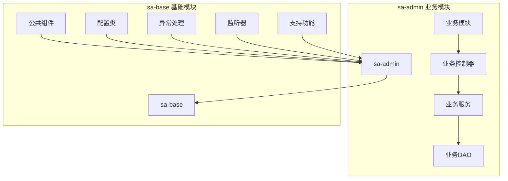
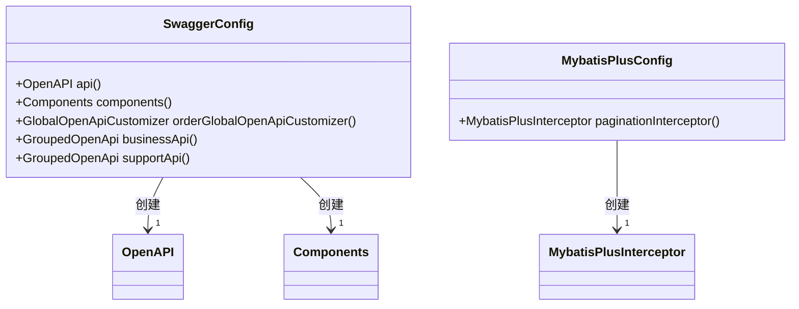
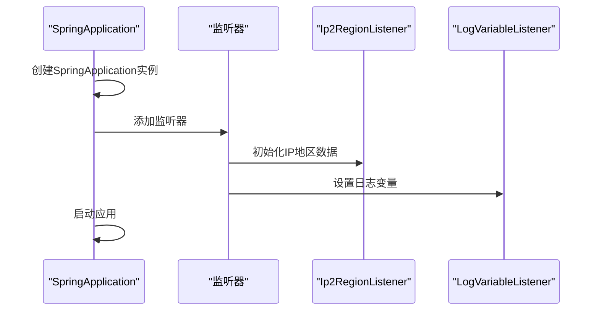
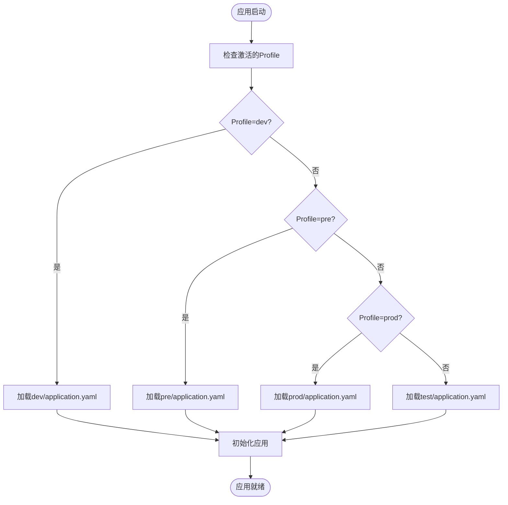
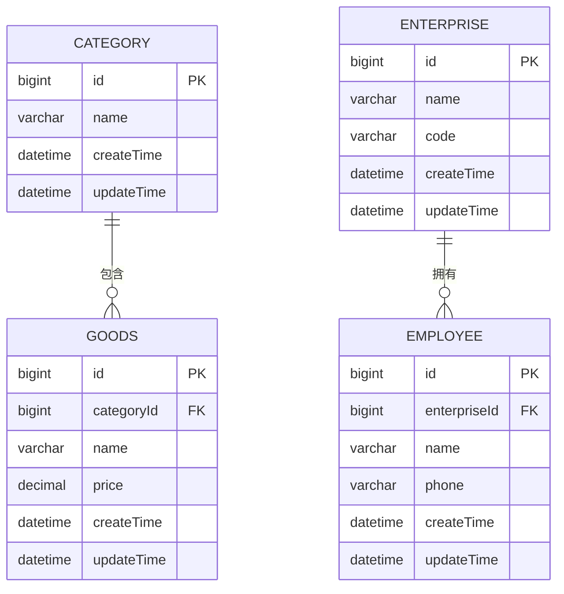

# 后端项目结构

<cite>
**本文档引用的文件**
- [AdminApplication.java](file://smart-admin-api-java17-springboot3/sa-admin/src/main/java/net/lab1024/sa/admin/AdminApplication.java)
- [sa-base/pom.xml](file://smart-admin-api-java17-springboot3/sa-base/pom.xml)
- [sa-admin/pom.xml](file://smart-admin-api-java17-springboot3/sa-admin/pom.xml)
- [SwaggerConfig.java](file://smart-admin-api-java17-springboot3/sa-base/src/main/java/net/lab1024/sa/base/config/SwaggerConfig.java)
- [MybatisPlusConfig.java](file://smart-admin-api-java17-springboot3/sa-base/src/main/java/net/lab1024/sa/base/config/MybatisPlusConfig.java)
- [GlobalExceptionHandler.java](file://smart-admin-api-java17-springboot3/sa-base/src/main/java/net/lab1024/sa/base/handler/GlobalExceptionHandler.java)
- [Ip2RegionListener.java](file://smart-admin-api-java17-springboot3/sa-base/src/main/java/net/lab1024/sa/base/listener/Ip2RegionListener.java)
- [application.yaml](file://smart-admin-api-java17-springboot3/sa-admin/src/main/resources/dev/application.yaml)
- [CategoryMapper.xml](file://smart-admin-api-java17-springboot3/sa-admin/src/main/resources/mapper/business/category/CategoryMapper.xml)
</cite>

## 目录

1. [项目结构概述](#项目结构概述)
2. [sa-base基础模块](#sa-base基础模块)
   - [common公共组件](#common公共组件)
   - [config配置类](#config配置类)
   - [handler异常处理](#handler异常处理)
   - [listener监听器](#listener监听器)
   - [module/support支持功能模块](#modulesupport支持功能模块)
3. [sa-admin业务模块](#sa-admin业务模块)
   - [config配置](#config配置)
   - [constant常量](#constant常量)
   - [interceptor拦截器](#interceptor拦截器)
   - [module业务模块](#module业务模块)
   - [util工具类](#util工具类)
4. [资源目录结构](#资源目录结构)
   - [环境配置文件](#环境配置文件)
   - [MyBatis映射文件](#mybatis映射文件)
5. [最佳实践建议](#最佳实践建议)

## 项目结构概述

本项目采用模块化设计，主要分为`sa-base`基础模块和`sa-admin`业务模块。`sa-base`提供系统级的基础功能和通用组件，而`sa-admin`则专注于业务逻辑的实现。这种分层架构有助于代码的复用和维护。

**图示来源**
- [sa-admin/pom.xml](file://smart-admin-api-java17-springboot3/sa-admin/pom.xml#L1-L47)
- [sa-base/pom.xml](file://smart-admin-api-java17-springboot3/sa-base/pom.xml#L1-L276)

**本节来源**
- [sa-admin/pom.xml](file://smart-admin-api-java17-springboot3/sa-admin/pom.xml#L1-L47)
- [sa-base/pom.xml](file://smart-admin-api-java17-springboot3/sa-base/pom.xml#L1-L276)

## sa-base基础模块

`sa-base`模块是整个系统的基础，提供了通用的功能组件和系统级服务，为上层业务模块提供支持。

### common公共组件

`common`包包含系统中通用的组件和工具类，主要包括：

- **annotation**: 自定义注解，如`NoNeedLogin`用于标记无需登录验证的接口
- **code**: 错误码管理，包含系统错误码、用户错误码等
- **constant**: 通用常量定义
- **controller**: 基础控制器类`SupportBaseController`
- **domain**: 通用数据模型，如分页参数、响应数据结构等
- **enumeration**: 枚举基类和常用枚举类型
- **exception**: 业务异常类`BusinessException`
- **json**: JSON序列化和反序列化相关的工具类
- **swagger**: Swagger文档相关的自定义配置
- **util**: 各种工具类，如Bean操作、日期处理、字符串处理等
- **validator/enumeration**: 枚举值验证相关的类

这些组件为整个系统提供了统一的基础支持，确保代码风格和处理逻辑的一致性。

**本节来源**
- [smart-admin-api-java17-springboot3/sa-base/src/main/java/net/lab1024/sa/base/common](file://smart-admin-api-java17-springboot3/sa-base/src/main/java/net/lab1024/sa/base/common)

### config配置类

`config`包包含系统各种功能的配置类，采用Spring Boot的自动配置机制：

- **AsyncConfig**: 异步任务配置
- **CacheConfig**: 缓存配置，集成Redis和Caffeine
- **CorsFilterConfig**: 跨域请求配置
- **DataSourceConfig**: 数据源配置，集成Druid连接池
- **FileConfig**: 文件上传下载配置
- **HeartBeatConfig**: 心跳检测配置
- **JsonConfig**: JSON序列化配置
- **MybatisPlusConfig**: MyBatis-Plus配置，包含分页插件
- **RedisConfig**: Redis配置
- **RepeatSubmitConfig**: 重复提交防护配置
- **RestClientConfig**: REST客户端配置
- **ScheduleConfig**: 定时任务配置
- **SwaggerConfig**: API文档配置，集成Knife4j
- **SystemEnvironmentConfig**: 系统环境配置
- **TokenConfig**: 令牌认证配置，集成Sa-Token
- **UrlConfig**: URL配置
- **YamlProcessor**: YAML文件处理器

这些配置类通过Spring的`@Configuration`注解实现，为系统提供了完整的功能配置支持。

**图示来源**
- [SwaggerConfig.java](file://smart-admin-api-java17-springboot3/sa-base/src/main/java/net/lab1024/sa/base/config/SwaggerConfig.java#L1-L154)
- [MybatisPlusConfig.java](file://smart-admin-api-java17-springboot3/sa-base/src/main/java/net/lab1024/sa/base/config/MybatisPlusConfig.java#L1-L34)

**本节来源**
- [smart-admin-api-java17-springboot3/sa-base/src/main/java/net/lab1024/sa/base/config](file://smart-admin-api-java17-springboot3/sa-base/src/main/java/net/lab1024/sa/base/config)

### handler异常处理

`handler`包负责系统的全局异常处理和MyBatis-Plus的自动填充功能：

- **GlobalExceptionHandler**: 全局异常处理器，统一处理系统中抛出的各种异常，返回标准化的错误响应
- **MybatisPlusFillHandler**: MyBatis-Plus自动填充处理器，用于在插入和更新数据时自动填充创建时间、更新时间等字段

这种设计实现了异常处理的集中化管理，确保了API响应格式的一致性。

**本节来源**
- [smart-admin-api-java17-springboot3/sa-base/src/main/java/net/lab1024/sa/base/handler](file://smart-admin-api-java17-springboot3/sa-base/src/main/java/net/lab1024/sa/base/handler)

### listener监听器

`listener`包包含系统启动时的监听器，用于在应用启动过程中执行特定的初始化任务：

- **Ip2RegionListener**: IP地址解析监听器，用于初始化IP地址到地区映射数据
- **LogVariableListener**: 日志变量监听器，使log4j2配置文件可以读取到系统配置属性
- **WebServerListener**: Web服务器监听器，用于监听Web服务器的启动和停止事件

这些监听器在`AdminApplication`启动类中被注册，确保在应用启动时能够正确初始化相关功能。

**图示来源**
- [AdminApplication.java](file://smart-admin-api-java17-springboot3/sa-admin/src/main/java/net/lab1024/sa/admin/AdminApplication.java#L34-L38)
- [Ip2RegionListener.java](file://smart-admin-api-java17-springboot3/sa-base/src/main/java/net/lab1024/sa/base/listener/Ip2RegionListener.java)
- [LogVariableListener.java](file://smart-admin-api-java17-springboot3/sa-base/src/main/java/net/lab1024/sa/base/listener/LogVariableListener.java)

**本节来源**
- [smart-admin-api-java17-springboot3/sa-base/src/main/java/net/lab1024/sa/base/listener](file://smart-admin-api-java17-springboot3/sa-base/src/main/java/net/lab1024/sa/base/listener)
- [AdminApplication.java](file://smart-admin-api-java17-springboot3/sa-admin/src/main/java/net/lab1024/sa/admin/AdminApplication.java#L34-L38)

### module/support支持功能模块

`module/support`包包含一系列可插拔的系统级支持功能模块，每个模块都是独立的，可以根据需要启用或禁用：

- **apiencrypt**: API接口加解密功能，支持AES和国密SM算法
- **cache**: 缓存服务，支持Redis和Caffeine两种缓存实现
- **captcha**: 验证码功能，支持图形验证码
- **changelog**: 变更日志功能，记录数据变更历史
- **codegenerator**: 代码生成器，支持前后端代码一键生成
- **config**: 系统配置管理，支持动态配置
- **datamasking**: 数据脱敏功能，保护敏感数据
- **datatracer**: 数据追踪功能，记录数据访问历史
- **dict**: 数据字典功能，统一管理系统字典
- **feedback**: 用户反馈功能
- **file**: 文件上传下载功能，支持多种存储方式
- **heartbeat**: 心跳检测功能，监控系统运行状态
- **helpdoc**: 帮助文档功能
- **job**: 定时任务功能，基于Sa-Job
- **loginlog**: 登录日志功能，记录用户登录信息
- **mail**: 邮件发送功能
- **message**: 消息通知功能
- **operatelog**: 操作日志功能，记录用户操作
- **redis**: Redis高级功能封装
- **reload**: 配置热加载功能
- **repeatsubmit**: 重复提交防护功能
- **securityprotect**: 安全防护功能
- **serialnumber**: 流水号生成功能
- **table**: 数据表管理功能

这些模块通过清晰的包结构组织，每个模块都有完整的MVC结构，便于维护和扩展。

**本节来源**
- [smart-admin-api-java17-springboot3/sa-base/src/main/java/net/lab1024/sa/base/module/support](file://smart-admin-api-java17-springboot3/sa-base/src/main/java/net/lab1024/sa/base/module/support)

## sa-admin业务模块

`sa-admin`模块是系统的业务核心，实现了具体的业务功能。

### config配置

`sa-admin`模块的配置类主要包含：

- **MvcConfig**: MVC配置，用于自定义Spring MVC的行为
- **OperateLogAspectConfig**: 操作日志切面配置，用于启用操作日志功能

这些配置类在`sa-admin`模块中定义，用于覆盖或补充`sa-base`中的基础配置，以满足特定业务需求。

**本节来源**
- [smart-admin-api-java17-springboot3/sa-admin/src/main/java/net/lab1024/sa/admin/config](file://smart-admin-api-java17-springboot3/sa-admin/src/main/java/net/lab1024/sa/admin/config)

### constant常量

`constant`包包含业务相关的常量定义，如：

- **LoginDeviceEnum**: 登录设备类型枚举
- **ReloadConst**: 热加载相关常量
- **SwaggerTagConst**: Swagger标签常量

这些常量为业务逻辑提供了统一的值定义，避免了魔法值的使用。

**本节来源**
- [smart-admin-api-java17-springboot3/sa-admin/src/main/java/net/lab1024/sa/admin/constant](file://smart-admin-api-java17-springboot3/sa-admin/src/main/java/net/lab1024/sa/admin/constant)

### interceptor拦截器

`interceptor`包包含业务特定的拦截器，用于在请求处理过程中插入特定的逻辑，如权限验证、日志记录等。

**本节来源**
- [smart-admin-api-java17-springboot3/sa-admin/src/main/java/net/lab1024/sa/admin/interceptor](file://smart-admin-api-java17-springboot3/sa-admin/src/main/java/net/lab1024/sa/admin/interceptor)

### module业务模块

`module`包是`sa-admin`的核心，包含所有业务功能模块，如用户管理、角色管理、部门管理等。每个业务模块都有独立的包结构，包含controller、service、dao等组件。

**本节来源**
- [smart-admin-api-java17-springboot3/sa-admin/src/main/java/net/lab1024/sa/admin/module](file://smart-admin-api-java17-springboot3/sa-admin/src/main/java/net/lab1024/sa/admin/module)

### util工具类

`util`包包含业务相关的工具类，提供特定业务场景下的工具方法。

**本节来源**
- [smart-admin-api-java17-springboot3/sa-admin/src/main/java/net/lab1024/sa/admin/util](file://smart-admin-api-java17-springboot3/sa-admin/src/main/java/net/lab1024/sa/admin/util)

## 资源目录结构

### 环境配置文件

资源目录下按环境划分了不同的配置文件目录：

- **dev**: 开发环境配置
- **pre**: 预发布环境配置
- **prod**: 生产环境配置
- **test**: 测试环境配置

每个环境目录都包含`application.yaml`主配置文件和`log4j2-spring.xml`日志配置文件。这种组织方式便于在不同环境中使用不同的配置，通过Spring Boot的profile机制实现环境切换。

**图示来源**
- [application.yaml](file://smart-admin-api-java17-springboot3/sa-admin/src/main/resources/dev/application.yaml)

**本节来源**
- [smart-admin-api-java17-springboot3/sa-admin/src/main/resources/dev](file://smart-admin-api-java17-springboot3/sa-admin/src/main/resources/dev)
- [smart-admin-api-java17-springboot3/sa-admin/src/main/resources/pre](file://smart-admin-api-java17-springboot3/sa-admin/src/main/resources/pre)
- [smart-admin-api-java17-springboot3/sa-admin/src/main/resources/prod](file://smart-admin-api-java17-springboot3/sa-admin/src/main/resources/prod)
- [smart-admin-api-java17-springboot3/sa-admin/src/main/resources/test](file://smart-admin-api-java17-springboot3/sa-admin/src/main/resources/test)

### MyBatis映射文件

`mapper`目录下的MyBatis映射文件按业务领域组织：

- **business**: 业务相关的Mapper文件，进一步按业务模块划分，如category、goods、oa等
- **system**: 系统管理相关的Mapper文件，如用户、角色、部门等

这种分类方式使得Mapper文件的组织清晰，便于查找和维护。每个Mapper文件对应一个数据访问对象(DAO)，定义了数据库操作的SQL语句。

**图示来源**
- [CategoryMapper.xml](file://smart-admin-api-java17-springboot3/sa-admin/src/main/resources/mapper/business/category/CategoryMapper.xml)
- [GoodsMapper.xml](file://smart-admin-api-java17-springboot3/sa-admin/src/main/resources/mapper/business/goods/GoodsMapper.xml)
- [EnterpriseMapper.xml](file://smart-admin-api-java17-springboot3/sa-admin/src/main/resources/mapper/business/oa/enterprise/EnterpriseMapper.xml)
- [EnterpriseEmployeeMapper.xml](file://smart-admin-api-java17-springboot3/sa-admin/src/main/resources/mapper/business/oa/enterprise/EnterpriseEmployeeMapper.xml)

**本节来源**
- [smart-admin-api-java17-springboot3/sa-admin/src/main/resources/mapper](file://smart-admin-api-java17-springboot3/sa-admin/src/main/resources/mapper)

## 最佳实践建议

### 新业务模块创建

在`module`目录下创建新业务模块时，建议遵循以下步骤：

1. 在`sa-admin/src/main/java/net/lab1024/sa/admin/module`下创建新的业务模块包
2. 在新包下创建`controller`、`service`、`dao`子包
3. 创建对应的实体类(PO/VO/DTO等)
4. 创建DAO接口和对应的Mapper XML文件
5. 创建Service接口和实现类
6. 创建Controller类
7. 在`sa-admin`的启动类中确保包扫描范围包含新模块

### 添加新的系统级支持功能

在`sa-base`中添加新的系统级支持功能时，建议：

1. 在`sa-base/src/main/java/net/lab1024/sa/base/module/support`下创建新的功能模块包
2. 遵循标准的MVC结构组织代码
3. 提供清晰的接口定义
4. 编写必要的配置类
5. 在`sa-base`的pom.xml中添加必要的依赖
6. 确保新功能可以独立启用或禁用

这种模块化的设计使得系统具有良好的扩展性，新功能的添加不会影响现有功能的稳定性。

**本节来源**
- [smart-admin-api-java17-springboot3/sa-admin/src/main/java/net/lab1024/sa/admin/module](file://smart-admin-api-java17-springboot3/sa-admin/src/main/java/net/lab1024/sa/admin/module)
- [smart-admin-api-java17-springboot3/sa-base/src/main/java/net/lab1024/sa/base/module/support](file://smart-admin-api-java17-springboot3/sa-base/src/main/java/net/lab1024/sa/base/module/support)