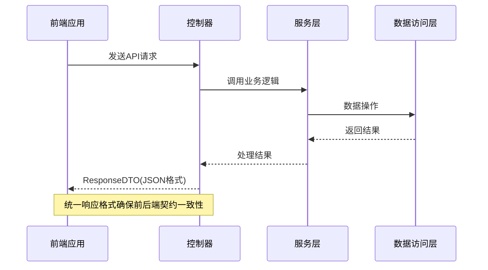
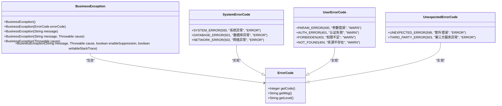
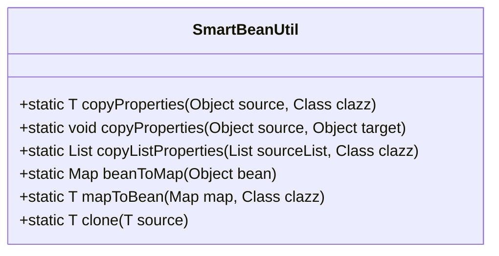
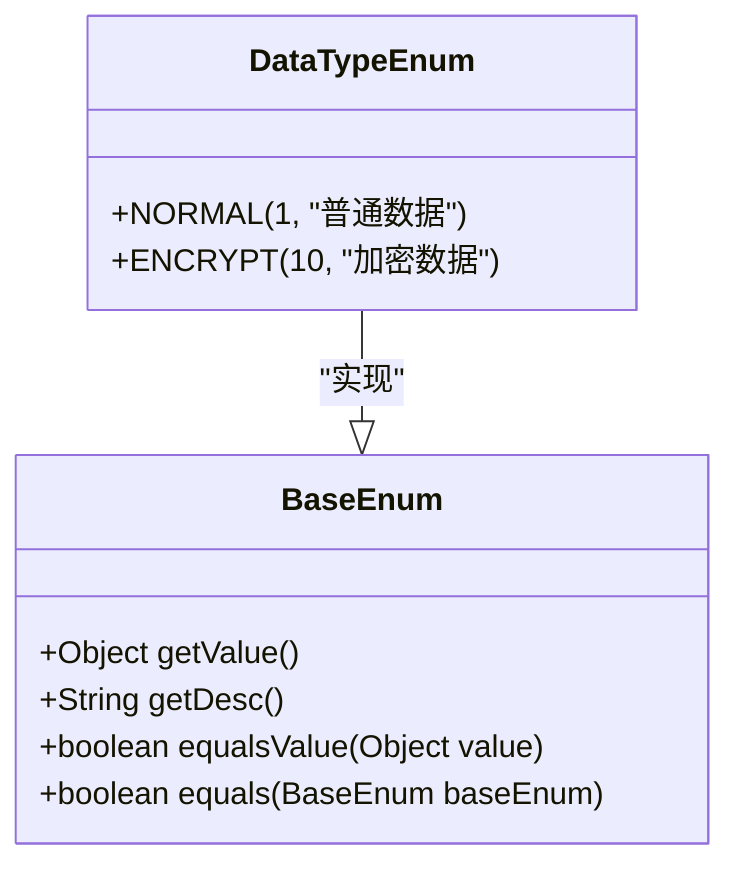
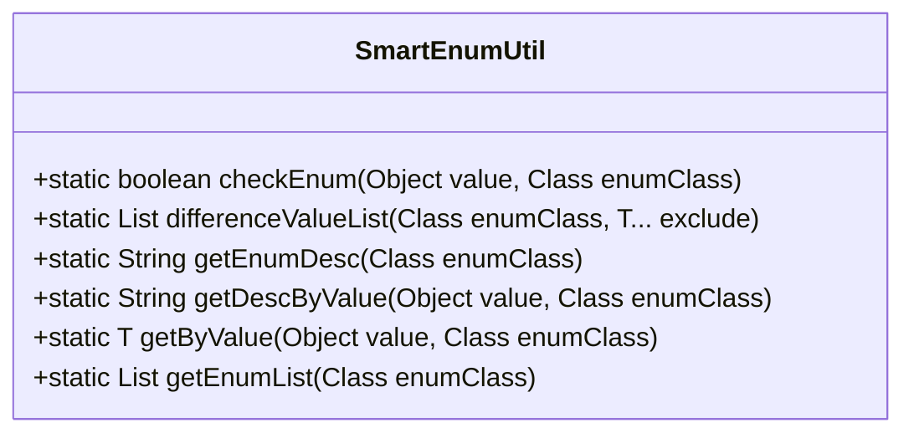
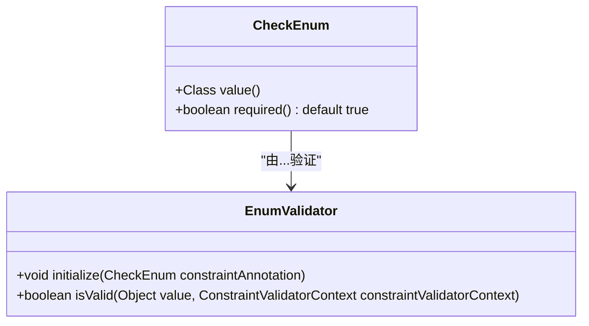
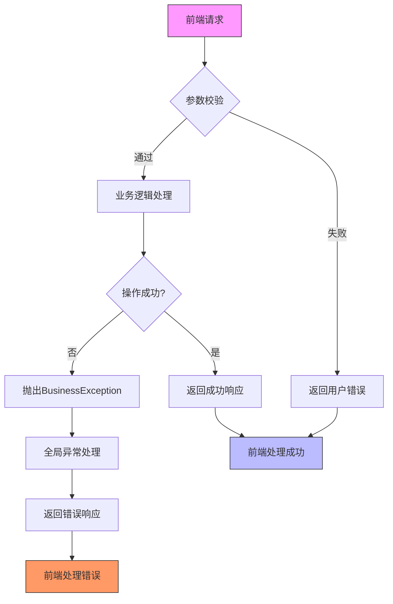

# 公共组件

<cite>
**本文档引用文件**  
- [ResponseDTO.java](file://smart-admin-api-java17-springboot3\sa-base\src\main\java\net\lab1024\sa\base\common\domain\ResponseDTO.java)
- [BusinessException.java](file://smart-admin-api-java17-springboot3\sa-base\src\main\java\net\lab1024\sa\base\common\exception\BusinessException.java)
- [BaseEnum.java](file://smart-admin-api-java17-springboot3\sa-base\src\main\java\net\lab1024\sa\base\common\enumeration\BaseEnum.java)
- [SmartEnumUtil.java](file://smart-admin-api-java17-springboot3\sa-base\src\main\java\net\lab1024\sa\base\common\util\SmartEnumUtil.java)
- [EnumValidator.java](file://smart-admin-api-java17-springboot3\sa-base\src\main\java\net\lab1024\sa\base\common\validator\enumeration\EnumValidator.java)
- [CheckEnum.java](file://smart-admin-api-java17-springboot3\sa-base\src\main\java\net\lab1024\sa\base\common\annoation\CheckEnum.java)
- [DataTypeEnum.java](file://smart-admin-api-java17-springboot3\sa-base\src\main\java\net\lab1024\sa\base\common\enumeration\DataTypeEnum.java)
- [SmartBeanUtil.java](file://smart-admin-api-java17-springboot3\sa-base\src\main\java\net\lab1024\sa\base\common\util\SmartBeanUtil.java)
- [SmartPageUtil.java](file://smart-admin-api-java17-springboot3\sa-base\src\main\java\net\lab1024\sa\base\common\util\SmartPageUtil.java)
</cite>

## 目录
1. [引言](#引言)
2. [统一响应结构设计](#统一响应结构设计)
3. [业务异常体系](#业务异常体系)
4. [工具类详解](#工具类详解)
5. [枚举支持体系](#枚举支持体系)
6. [实际应用示例](#实际应用示例)
7. [总结](#总结)

## 引言
本文档旨在全面解析smart-admin项目中的公共组件设计与实现。重点分析common包中核心类的设计原理与最佳实践，为开发人员提供清晰的使用指导。文档涵盖统一响应结构、异常处理体系、实用工具类和枚举支持体系等关键组件，帮助开发者高效、规范地进行业务开发。

## 统一响应结构设计

### ResponseDTO设计原理
ResponseDTO是系统中统一的API响应数据传输对象，采用泛型设计以支持不同类型的数据返回。该类遵循RESTful API设计规范，确保前后端交互的一致性和可预测性。

```mermaid
classDiagram
class ResponseDTO<T> {
+static final int OK_CODE = 0
+static final String OK_MSG = "操作成功"
-Integer code
-String level
-String msg
-Boolean ok
-T data
-Integer dataType
+ResponseDTO(Integer code, String level, boolean ok, String msg, T data)
+ResponseDTO(ErrorCode errorCode, boolean ok, String msg, T data)
+static <T> ResponseDTO<T> ok()
+static <T> ResponseDTO<T> ok(T data)
+static <T> ResponseDTO<T> okMsg(String msg)
+static <T> ResponseDTO<T> userErrorParam()
+static <T> ResponseDTO<T> userErrorParam(String msg)
+static <T> ResponseDTO<T> error(ErrorCode errorCode)
+static <T> ResponseDTO<T> error(ErrorCode errorCode, String msg)
}
class ErrorCode {
+Integer getCode()
+String getMsg()
+String getLevel()
}
ResponseDTO --> ErrorCode : "使用"
```

**图示来源**
- [ResponseDTO.java](file://smart-admin-api-java17-springboot3\sa-base\src\main\java\net\lab1024\sa\base\common\domain\ResponseDTO.java#L1-L121)

### 泛型使用方式
ResponseDTO采用Java泛型设计，允许在编译时指定返回数据的具体类型，提供类型安全保证。通过静态工厂方法模式，提供了多种便捷的创建方式：

- `ok()`：创建成功响应，无数据
- `ok(T data)`：创建成功响应，包含数据
- `okMsg(String msg)`：创建成功响应，自定义消息
- `userErrorParam()`：创建用户参数错误响应
- `error(ErrorCode errorCode)`：创建指定错误码的错误响应

### API接口标准化应用
在API接口中，ResponseDTO作为统一的返回类型，确保了接口响应格式的一致性。控制器方法直接返回ResponseDTO实例，由Spring框架自动序列化为JSON格式。



**图示来源**
- [ResponseDTO.java](file://smart-admin-api-java17-springboot3\sa-base\src\main\java\net\lab1024\sa\base\common\domain\ResponseDTO.java#L1-L121)

**本节来源**
- [ResponseDTO.java](file://smart-admin-api-java17-springboot3\sa-base\src\main\java\net\lab1024\sa\base\common\domain\ResponseDTO.java#L1-L121)

## 业务异常体系

### 分层设计原理
系统采用分层异常处理机制，通过BusinessException作为业务逻辑异常的基类，实现了异常的统一管理和处理。全局异常处理器捕获所有未处理的异常，并将其转换为标准化的响应格式。



**图示来源**
- [BusinessException.java](file://smart-admin-api-java17-springboot3\sa-base\src\main\java\net\lab1024\sa\base\common\exception\BusinessException.java#L1-L38)
- [ResponseDTO.java](file://smart-admin-api-java17-springboot3\sa-base\src\main\java\net\lab1024\sa\base\common\domain\ResponseDTO.java#L1-L121)

### 错误码注册与管理
系统定义了三种主要的错误码类型，通过枚举方式实现集中管理：

1. **系统错误码（SystemErrorCode）**：表示系统级异常，如数据库连接失败、网络异常等
2. **用户错误码（UserErrorCode）**：表示用户操作相关的错误，如参数校验失败、权限不足等
3. **意外错误码（UnexpectedErrorCode）**：表示未预期的异常情况

错误码采用三位数字编码规则，第一位表示错误类别，后两位表示具体错误类型，便于快速识别和处理。

**本节来源**
- [BusinessException.java](file://smart-admin-api-java17-springboot3\sa-base\src\main\java\net\lab1024\sa\base\common\exception\BusinessException.java#L1-L38)
- [ResponseDTO.java](file://smart-admin-api-java17-springboot3\sa-base\src\main\java\net\lab1024\sa\base\common\domain\ResponseDTO.java#L1-L121)

## 工具类详解

### SmartBeanUtil工具类
SmartBeanUtil提供了丰富的Bean操作工具方法，简化了对象之间的属性复制和转换操作。



**主要功能：**
- 对象属性复制：支持源对象到目标对象的属性值复制
- 列表批量转换：将源对象列表批量转换为目标类型列表
- Bean与Map互转：实现Java Bean与Map结构的相互转换
- 对象克隆：创建对象的深拷贝

**本节来源**
- [SmartBeanUtil.java](file://smart-admin-api-java17-springboot3\sa-base\src\main\java\net\lab1024\sa\base\common\util\SmartBeanUtil.java)

### SmartPageUtil工具类
SmartPageUtil专门用于处理分页查询相关的转换操作，简化了分页逻辑的实现。

```mermaid
classDiagram
class SmartPageUtil {
+static Page convert2PageQuery(PageQuery pageQuery)
+static <T> PageResult<T> convert2PageResult(Page page, List<T> list)
+static <T> PageResult<T> convert2PageResult(PageQuery pageQuery, List<T> list)
}
class PageQuery {
+Integer pageNum
+Integer pageSize
}
class PageResult<T> {
+Long total
+List<T> list
+Integer pageNum
+Integer pageSize
+Integer pages
}
```

**典型应用场景：**
在服务层实现分页查询时，可直接使用SmartPageUtil进行参数转换和结果封装，减少模板代码。

**本节来源**
- [SmartPageUtil.java](file://smart-admin-api-java17-springboot3\sa-base\src\main\java\net\lab1024\sa\base\common\util\SmartPageUtil.java)

## 枚举支持体系

### BaseEnum接口设计
BaseEnum是所有枚举类必须实现的基础接口，定义了枚举类的标准结构和行为。



**接口方法说明：**
- `getValue()`：获取枚举值，通常为数字或字符串
- `getDesc()`：获取枚举描述，用于前端展示
- `equalsValue(Object value)`：判断给定值是否与当前枚举值相等
- `equals(BaseEnum baseEnum)`：判断两个枚举实例是否完全相同

**本节来源**
- [BaseEnum.java](file://smart-admin-api-java17-springboot3\sa-base\src\main\java\net\lab1024\sa\base\common\enumeration\BaseEnum.java)
- [DataTypeEnum.java](file://smart-admin-api-java17-springboot3\sa-base\src\main\java\net\lab1024\sa\base\common\enumeration\DataTypeEnum.java)

### SmartEnumUtil工具类
SmartEnumUtil提供了枚举操作的实用方法，增强了枚举的使用灵活性。



**核心功能：**
- 枚举值校验：检查给定值是否为合法的枚举值
- 枚举差异计算：获取排除指定枚举后的剩余枚举值列表
- 描述信息获取：根据枚举值获取对应的描述信息
- 枚举实例获取：根据值获取对应的枚举实例

**本节来源**
- [SmartEnumUtil.java](file://smart-admin-api-java17-springboot3\sa-base\src\main\java\net\lab1024\sa\base\common\util\SmartEnumUtil.java)

### 枚举验证机制
系统通过@CheckEnum注解和EnumValidator验证器实现了枚举值的自动校验功能。



**集成验证流程：**
1. 在DTO字段上使用@CheckEnum注解指定允许的枚举类型
2. Spring Validation框架在参数校验阶段调用EnumValidator
3. EnumValidator检查传入值是否为指定枚举的有效值
4. 校验失败时返回标准化的错误响应

**本节来源**
- [CheckEnum.java](file://smart-admin-api-java17-springboot3\sa-base\src\main\java\net\lab1024\sa\base\common\annoation\CheckEnum.java)
- [EnumValidator.java](file://smart-admin-api-java17-springboot3\sa-base\src\main\java\net\lab1024\sa\base\common\validator\enumeration\EnumValidator.java)
- [SmartEnumUtil.java](file://smart-admin-api-java17-springboot3\sa-base\src\main\java\net\lab1024\sa\base\common\util\SmartEnumUtil.java)

## 实际应用示例

### 前后端交互示例
以下是一个完整的API调用示例，展示了公共组件的实际应用：



**典型代码调用：**
- 服务层使用SmartBeanUtil进行DTO到Entity的转换
- 使用ResponseDTO.ok()返回成功结果
- 参数校验失败时抛出BusinessException(UserErrorCode.PARAM_ERROR)
- 使用@CheckEnum注解确保枚举参数的合法性

**本节来源**
- 所有引用文件

## 总结
本文档详细介绍了smart-admin项目中公共组件的设计与实现。通过统一响应结构、分层异常体系、实用工具类和完善的枚举支持，构建了一个高效、可靠的开发基础。这些公共组件不仅提高了开发效率，还确保了代码的一致性和可维护性。建议在业务开发中充分利用这些组件，遵循既定的设计模式和最佳实践，以构建高质量的应用系统。