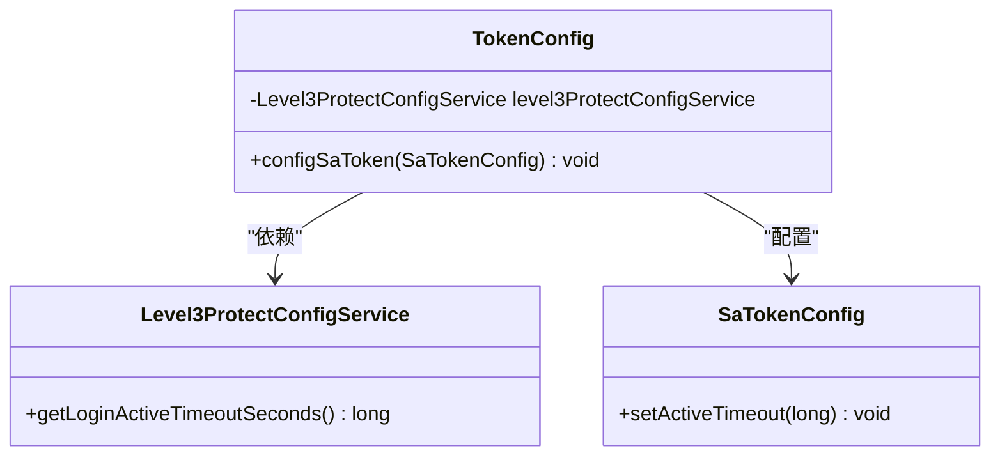
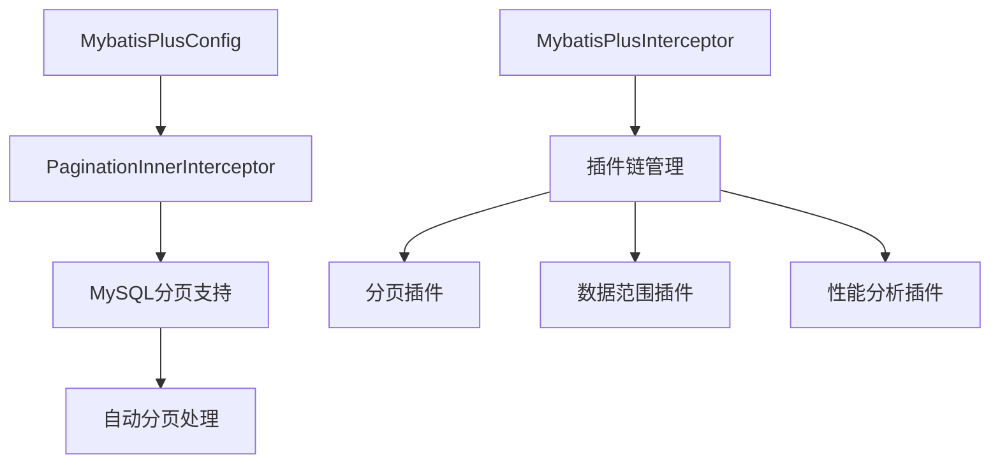
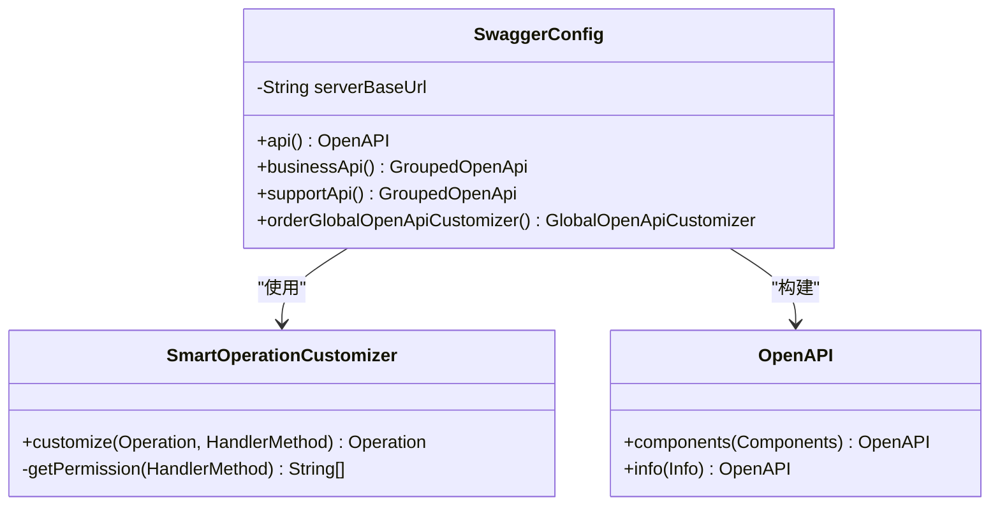
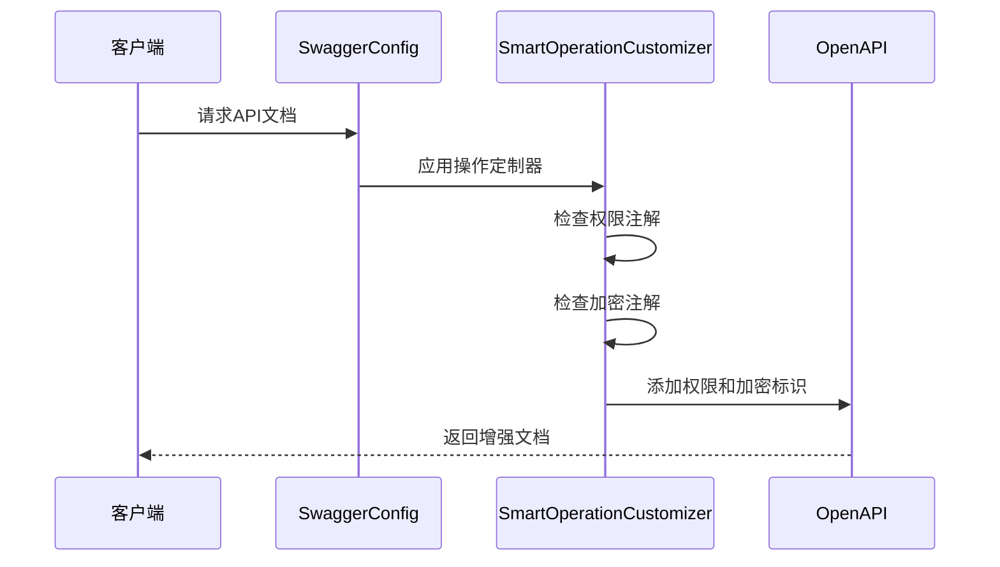
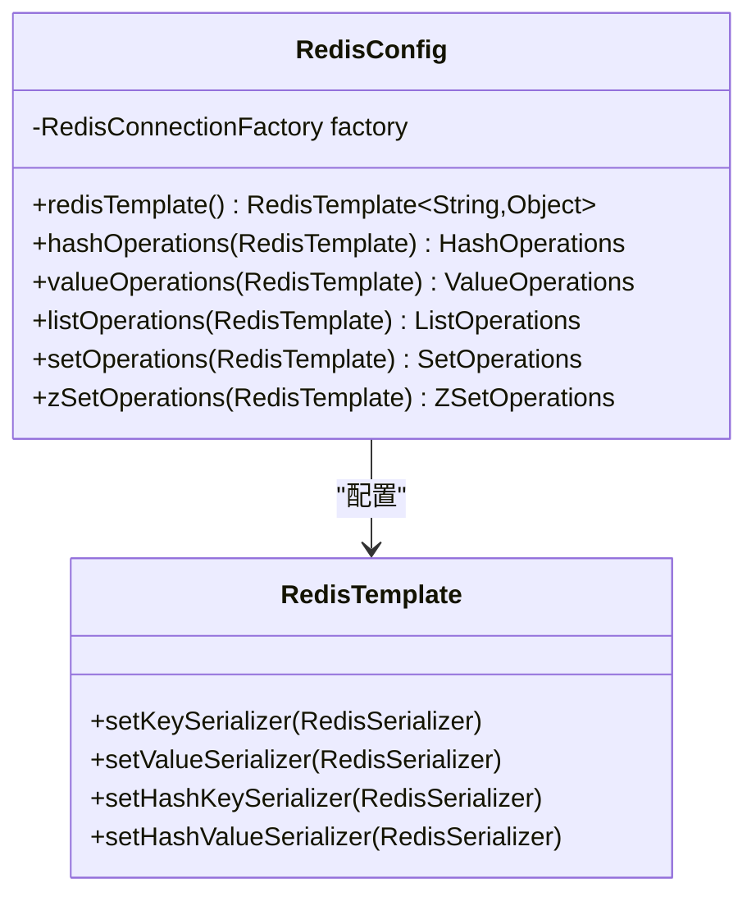
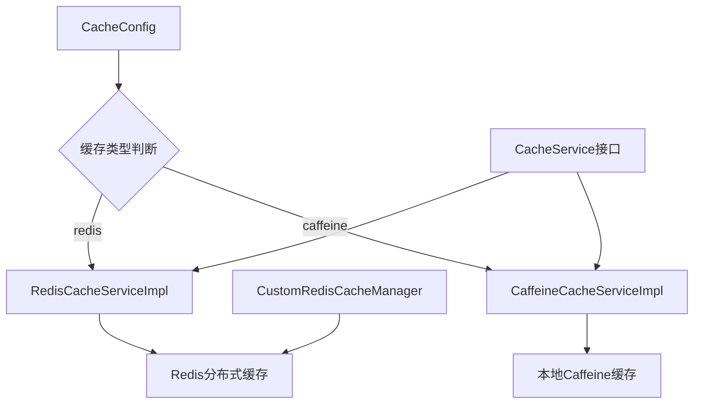
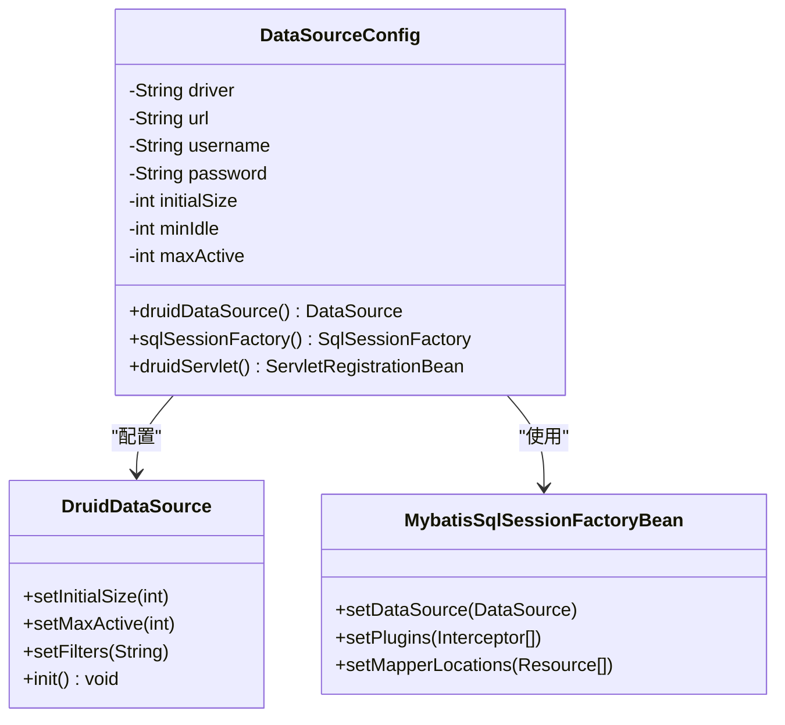
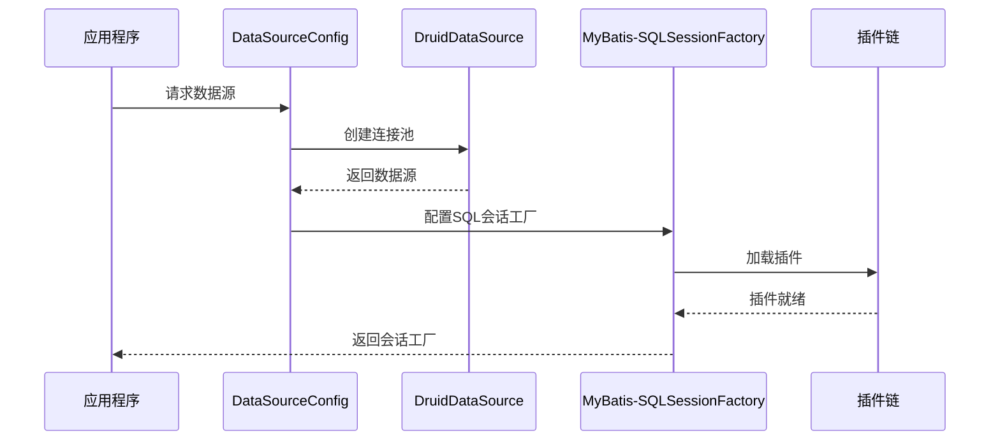

# 配置管理

<cite>
**本文档引用的文件**
- [TokenConfig.java](file://smart-admin-api-java17-springboot3/sa-base/src/main/java/net/lab1024/sa/base/config/TokenConfig.java)
- [MybatisPlusConfig.java](file://smart-admin-api-java17-springboot3/sa-base/src/main/java/net/lab1024/sa/base/config/MybatisPlusConfig.java)
- [SwaggerConfig.java](file://smart-admin-api-java17-springboot3/sa-base/src/main/java/net/lab1024/sa/base/config/SwaggerConfig.java)
- [RedisConfig.java](file://smart-admin-api-java17-springboot3/sa-base/src/main/java/net/lab1024/sa/base/config/RedisConfig.java)
- [DataSourceConfig.java](file://smart-admin-api-java17-springboot3/sa-base/src/main/java/net/lab1024/sa/base/config/DataSourceConfig.java)
- [CacheConfig.java](file://smart-admin-api-java17-springboot3/sa-base/src/main/java/net/lab1024/sa/base/config/CacheConfig.java)
- [JsonConfig.java](file://smart-admin-api-java17-springboot3/sa-base/src/main/java/net/lab1024/sa/base/config/JsonConfig.java)
- [CorsFilterConfig.java](file://smart-admin-api-java17-springboot3/sa-base/src/main/java/net/lab1024/sa/base/config/CorsFilterConfig.java)
- [SystemEnvironmentConfig.java](file://smart-admin-api-java17-springboot3/sa-base/src/main/java/net/lab1024/sa/base/config/SystemEnvironmentConfig.java)
- [sa-base.yaml](file://smart-admin-api-java17-springboot3/sa-base/src/main/resources/dev/sa-base.yaml)
</cite>

## 目录
1. [概述](#概述)
2. [认证配置 - TokenConfig](#认证配置---tokenconfig)
3. [持久层配置 - MybatisPlusConfig](#持久层配置---mybatisplusconfig)
4. [API文档配置 - SwaggerConfig](#api文档配置---swaggerconfig)
5. [缓存配置 - RedisConfig & CacheConfig](#缓存配置---redisconfig--cacheconfig)
6. [数据源配置 - DataSourceConfig](#数据源配置---datasourceconfig)
7. [通用配置](#通用配置)
8. [生产环境推荐配置](#生产环境推荐配置)
9. [配置最佳实践](#配置最佳实践)

## 概述

SmartAdmin sa-base模块提供了全面的Spring Boot配置解决方案，涵盖了认证授权、数据持久化、API文档、缓存管理、数据源连接等多个核心领域。本文档详细介绍了各个配置类的实现原理、参数设置和生产环境推荐配置。

## 认证配置 - TokenConfig

### 功能概述

TokenConfig基于Sa-Token框架实现统一的认证配置管理，主要负责Token的有效期、活跃超时时间等关键参数的动态配置。

### 核心特性

- **动态配置支持**：通过Level3ProtectConfigService实现三级等保配置的动态加载
- **会话管理**：灵活控制用户会话的活跃时间和有效期
- **安全集成**：与系统安全保护机制深度集成

### 配置参数详解

| 参数名称 | 类型 | 默认值 | 说明 |
|---------|------|--------|------|
| activeTimeout | long | 从Level3ProtectConfigService获取 | 用户会话最低活跃频率（秒），超过该时间未访问将被冻结 |

### 实现架构



**图表来源**
- [TokenConfig.java](file://smart-admin-api-java17-springboot3/sa-base/src/main/java/net/lab1024/sa/base/config/TokenConfig.java#L19-L33)

### 生产环境配置示例

```yaml
# sa-base.yaml 生产环境配置
sa-token:
  timeout: 2592000  # 30天有效期
  active-timeout: 1800  # 30分钟最低活跃频率
  auto-renew: true  # 自动续签
```

**章节来源**
- [TokenConfig.java](file://smart-admin-api-java17-springboot3/sa-base/src/main/java/net/lab1024/sa/base/config/TokenConfig.java#L1-L34)

## 持久层配置 - MybatisPlusConfig

### 功能概述

MybatisPlusConfig为MyBatis-Plus框架提供基础配置，包含分页插件、性能分析插件和数据范围插件的集成。

### 核心组件

#### 分页插件配置

- **数据库类型**：MySQL专用分页拦截器
- **配置方式**：通过MybatisPlusInterceptor链式配置
- **性能优化**：内置分页查询优化机制

### 配置架构



**图表来源**
- [MybatisPlusConfig.java](file://smart-admin-api-java17-springboot3/sa-base/src/main/java/net/lab1024/sa/base/config/MybatisPlusConfig.java#L26-L31)

### 配置参数表

| 组件 | 配置项 | 默认值 | 说明 |
|------|--------|--------|------|
| 分页插件 | DbType | MYSQL | 数据库类型标识 |
| 性能分析 | 开启状态 | 可配置 | SQL性能监控 |
| 数据范围 | 插件类型 | DataScopePlugin | 数据权限控制 |

### 生产环境推荐配置

```yaml
# MyBatis-Plus生产环境配置
mybatis-plus:
  configuration:
    map-underscore-to-camel-case: true
    log-impl: org.apache.ibatis.logging.stdout.StdOutImpl
  global-config:
    db-config:
      logic-delete-value: 1
      logic-not-delete-value: 0
```

**章节来源**
- [MybatisPlusConfig.java](file://smart-admin-api-java17-springboot3/sa-base/src/main/java/net/lab1024/sa/base/config/MybatisPlusConfig.java#L1-L34)

## API文档配置 - SwaggerConfig

### 功能概述

SwaggerConfig基于springdoc-openapi框架实现API文档的自动化生成和增强展示，集成了SmartOperationCustomizer提供智能的API文档增强功能。

### 核心特性

#### 智能文档增强

- **权限信息展示**：自动识别并展示API的权限要求
- **加密标识**：标记需要加密传输的接口
- **分类管理**：业务接口与支撑接口的清晰分离

#### 安全配置

- **认证方案**：Bearer Token认证机制
- **全局安全**：为所有接口自动添加认证要求
- **访问控制**：基于环境的条件加载

### 配置架构



**图表来源**
- [SwaggerConfig.java](file://smart-admin-api-java17-springboot3/sa-base/src/main/java/net/lab1024/sa/base/config/SwaggerConfig.java#L48-L153)

### API分类配置

| 分类 | 路径匹配规则 | 特殊配置 |
|------|-------------|----------|
| 业务接口 | /** | 排除支撑接口路径 |
| 支撑接口 | /support/** | 包含支撑功能接口 |

### 安全配置详情



**图表来源**
- [SwaggerConfig.java](file://smart-admin-api-java17-springboot3/sa-base/src/main/java/net/lab1024/sa/base/config/SwaggerConfig.java#L87-L98)

### 生产环境配置

```yaml
# Swagger生产环境配置
springdoc:
  swagger-ui:
    enabled: false  # 生产环境禁用
  api-docs:
    enabled: false  # 生产环境禁用

# knife4j配置
knife4j:
  enable: true
  basic:
    enable: false
```

**章节来源**
- [SwaggerConfig.java](file://smart-admin-api-java17-springboot3/sa-base/src/main/java/net/lab1024/sa/base/config/SwaggerConfig.java#L1-L154)

## 缓存配置 - RedisConfig & CacheConfig

### 功能概述

SmartAdmin提供了多层次的缓存解决方案，包括Redis分布式缓存和本地Caffeine缓存的整合配置。

### Redis配置架构

#### 序列化配置

- **键序列化**：StringRedisSerializer
- **值序列化**：Jackson2JsonRedisSerializer
- **哈希序列化**：Jackson2JsonRedisSerializer
- **时间模块**：JavaTimeModule支持

#### RedisTemplate配置



**图表来源**
- [RedisConfig.java](file://smart-admin-api-java17-springboot3/sa-base/src/main/java/net/lab1024/sa/base/config/RedisConfig.java#L34-L85)

### 缓存管理器配置

#### 多级缓存策略

- **Redis缓存**：分布式缓存，支持集群部署
- **Caffeine缓存**：本地缓存，适合热点数据
- **条件加载**：基于配置的缓存类型选择

#### 缓存配置参数

| 缓存类型 | 序列化器 | TTL支持 | 适用场景 |
|----------|----------|---------|----------|
| Redis | GenericFastJsonRedisSerializer | 支持 | 分布式共享缓存 |
| Caffeine | 内置序列化 | 支持 | 本地热点数据 |

### 生产环境Redis配置

```yaml
# Redis生产环境配置
spring:
  data:
    redis:
      database: 1
      host: 127.0.0.1
      port: 6389
      password: zkteco3100
      timeout: 10000ms
      lettuce:
        pool:
          max-active: 5
          min-idle: 1
          max-idle: 3
          max-wait: 30000ms
```

### 缓存服务实现



**图表来源**
- [CacheConfig.java](file://smart-admin-api-java17-springboot3/sa-base/src/main/java/net/lab1024/sa/base/config/CacheConfig.java#L58-L68)

**章节来源**
- [RedisConfig.java](file://smart-admin-api-java17-springboot3/sa-base/src/main/java/net/lab1024/sa/base/config/RedisConfig.java#L1-L86)
- [CacheConfig.java](file://smart-admin-api-java17-springboot3/sa-base/src/main/java/net/lab1024/sa/base/config/CacheConfig.java#L1-L70)

## 数据源配置 - DataSourceConfig

### 功能概述

DataSourceConfig实现了基于Druid连接池的多数据源配置，支持性能监控、SQL分析和数据范围控制。

### 核心组件

#### Druid连接池配置

- **连接参数**：初始连接数、最小空闲数、最大活跃数
- **超时设置**：连接等待时间、空闲连接回收时间
- **验证机制**：连接有效性验证

#### 插件集成

- **分页插件**：MyBatis-Plus分页支持
- **数据范围插件**：数据权限控制
- **性能分析**：SQL执行监控

### 配置架构



**图表来源**
- [DataSourceConfig.java](file://smart-admin-api-java17-springboot3/sa-base/src/main/java/net/lab1024/sa/base/config/DataSourceConfig.java#L101-L132)

### Druid监控配置

#### 控制台访问

- **URL映射**：/druid/*
- **访问控制**：可配置用户名密码
- **功能特性**：连接池监控、SQL监控、URI监控

#### 性能分析配置

| 参数 | 默认值 | 说明 |
|------|--------|------|
| mergeSql | true | 合并相似SQL |
| slowSqlMillis | 1000 | 慢SQL阈值（毫秒） |
| logSlowSql | true | 记录慢SQL日志 |

### 生产环境配置

```yaml
# 数据源生产环境配置
spring:
  datasource:
    url: jdbc:mysql://localhost:3306/smart_admin?useUnicode=true&characterEncoding=utf8&serverTimezone=Asia/Shanghai
    username: prod_user
    password: prod_password
    driver-class-name: com.mysql.cj.jdbc.Driver
    initial-size: 5
    min-idle: 5
    max-active: 20
    max-wait: 60000
    time-between-eviction-runs-millis: 60000
    min-evictable-idle-time-millis: 300000
    filters: stat,wall,slf4j
    druid:
      username: druid_admin
      password: admin_password
      login:
        enabled: false
      method:
        pointcut: net.lab1024.sa..*Service.*
```

### 多数据源支持



**图表来源**
- [DataSourceConfig.java](file://smart-admin-api-java17-springboot3/sa-base/src/main/java/net/lab1024/sa/base/config/DataSourceConfig.java#L134-L153)

**章节来源**
- [DataSourceConfig.java](file://smart-admin-api-java17-springboot3/sa-base/src/main/java/net/lab1024/sa/base/config/DataSourceConfig.java#L1-L202)

## 通用配置

### JSON序列化配置 - JsonConfig

#### 核心特性

- **日期格式化**：统一的日期时间格式处理
- **数值序列化**：Long类型特殊处理，避免精度丢失
- **枚举处理**：字符串化枚举值
- **空值处理**：智能的空值过滤

#### 配置参数

| 类型 | 序列化器 | 格式 | 说明 |
|------|----------|------|------|
| LocalDateTime | LocalDateTimeSerializer | yyyy-MM-dd HH:mm:ss | 日期时间格式 |
| LocalDate | LocalDateSerializer | yyyy-MM-dd | 日期格式 |
| Long | LongJsonSerializer | 字符串 | 避免精度丢失 |
| BigDecimal | ToStringSerializer | 字符串 | 精度保留 |

### 跨域配置 - CorsFilterConfig

#### 安全配置

- **凭据支持**：允许携带Cookie和认证信息
- **通配符支持**：支持任意域名访问
- **方法通配**：支持所有HTTP方法

### 环境配置 - SystemEnvironmentConfig

#### 条件加载机制

- **环境判断**：开发环境和测试环境自动启用
- **配置验证**：确保必要的配置参数存在
- **环境信息**：提供系统运行环境信息

**章节来源**
- [JsonConfig.java](file://smart-admin-api-java17-springboot3/sa-base/src/main/java/net/lab1024/sa/base/config/JsonConfig.java#L1-L96)
- [CorsFilterConfig.java](file://smart-admin-api-java17-springboot3/sa-base/src/main/java/net/lab1024/sa/base/config/CorsFilterConfig.java#L1-L45)
- [SystemEnvironmentConfig.java](file://smart-admin-api-java17-springboot3/sa-base/src/main/java/net/lab1024/sa/base/config/SystemEnvironmentConfig.java#L1-L60)

## 生产环境推荐配置

### 安全配置

```yaml
# 生产环境安全配置
sa-token:
  timeout: 2592000  # 30天
  active-timeout: 1800  # 30分钟
  is-concurrent: false  # 禁止多地点登录
  is-share: false  # 不共用Token
  auto-renew: true  # 自动续签
  is-log: true  # 启用日志
  log-level: info  # 日志级别

# JWT配置（如使用）
jwt:
  secret: your-secret-key
  expiration: 2592000
```

### 性能优化配置

```yaml
# 生产环境性能配置
spring:
  datasource:
    filters: stat,wall,slf4j
    max-wait: 30000
    time-between-eviction-runs-millis: 30000
    min-evictable-idle-time-millis: 180000
    
  cache:
    type: redis
    cache-null-values: false
    
  jackson:
    serialization:
      write-dates-as-timestamps: false
    date-format: yyyy-MM-dd HH:mm:ss
    time-zone: GMT+8
```

### 监控配置

```yaml
# 生产环境监控配置
management:
  endpoints:
    web:
      exposure:
        include: health,info,metrics,prometheus
  endpoint:
    health:
      show-details: when-authorized
  metrics:
    export:
      prometheus:
        enabled: true
```

### 日志配置

```yaml
# 生产环境日志配置
logging:
  level:
    root: INFO
    net.lab1024.sa: DEBUG
    org.springframework: WARN
    com.alibaba.druid: WARN
  pattern:
    console: "%d{yyyy-MM-dd HH:mm:ss} [%thread] %-5level %logger{36} - %msg%n"
    file: "%d{yyyy-MM-dd HH:mm:ss} [%thread] %-5level %logger{36} - %msg%n"
```

## 配置最佳实践

### 1. 环境隔离

- **开发环境**：启用Swagger、调试日志、详细异常信息
- **测试环境**：部分启用监控功能，模拟生产环境
- **生产环境**：禁用调试工具，启用安全配置

### 2. 性能调优

- **连接池配置**：根据并发量调整连接池参数
- **缓存策略**：合理设置TTL，避免缓存雪崩
- **SQL优化**：启用慢SQL监控，定期优化

### 3. 安全加固

- **认证配置**：严格控制Token有效期和活跃时间
- **数据加密**：敏感数据传输必须加密
- **访问控制**：严格的权限验证机制

### 4. 监控告警

- **健康检查**：定期检查系统健康状态
- **性能监控**：实时监控系统性能指标
- **异常告警**：及时发现和处理异常情况

### 5. 配置管理

- **版本控制**：配置文件纳入版本控制系统
- **变更审批**：重要配置变更需要审批流程
- **备份恢复**：定期备份配置文件，建立恢复机制

通过以上配置管理和最佳实践，可以确保SmartAdmin系统的稳定性、安全性和高性能运行。建议在实际部署时根据具体业务需求和硬件环境进行适当的调整和优化。