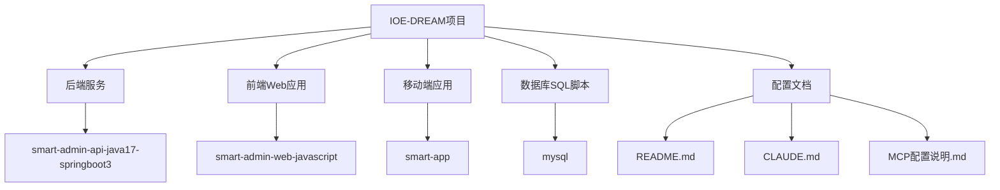
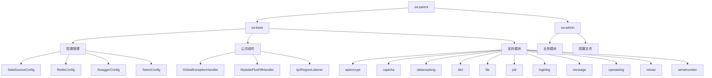
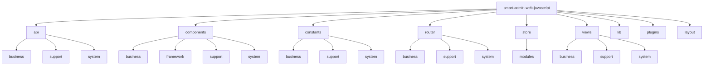
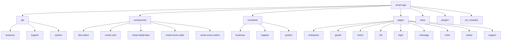
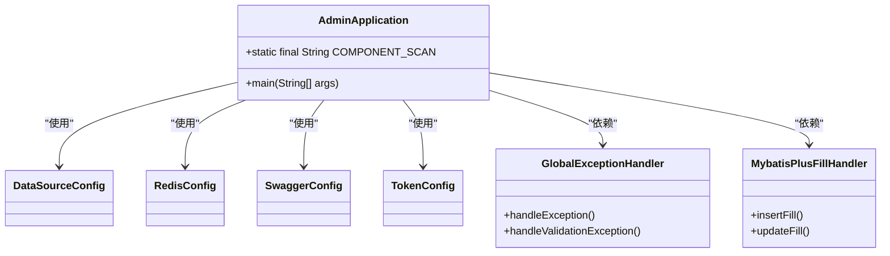

# 目录结构详解

<cite>
**本文档引用的文件**
- [README.md](file://README.md)
- [pom.xml](file://smart-admin-api-java17-springboot3/pom.xml)
- [sa-base/pom.xml](file://smart-admin-api-java17-springboot3/sa-base/pom.xml)
- [sa-admin/pom.xml](file://smart-admin-api-java17-springboot3/sa-admin/pom.xml)
- [AdminApplication.java](file://smart-admin-api-java17-springboot3/sa-admin/src/main/java/net/lab1024/sa/admin/AdminApplication.java)
- [main.js](file://smart-admin-web-javascript/src/main.js)
- [main.js](file://smart-app/src/main.js)
- [vite.config.js](file://smart-admin-web-javascript/vite.config.js)
- [vite.config.js](file://smart-app/vite.config.js)
- [sa-base.yaml](file://smart-admin-api-java17-springboot3/sa-base/src/main/resources/dev/sa-base.yaml)
- [.env.development](file://smart-admin-web-javascript/.env.development)
- [.env.development](file://smart-app/.env.development)
- [smart_area.sql](file://数据库SQL脚本/mysql/smart_area.sql)
- [package.json](file://smart-admin-web-javascript/package.json)
- [package.json](file://smart-app/package.json)
</cite>

## 目录结构

### IOE-DREAM项目总体结构
IOE-DREAM项目是一个完整的全栈开发解决方案，包含后端Java服务、前端Web应用和移动端应用三大核心部分，以及数据库脚本和配置文件等辅助组件。

**Diagram sources**
- [README.md](file://README.md)
- [pom.xml](file://smart-admin-api-java17-springboot3/pom.xml)

### 后端项目结构分析
后端项目采用Maven多模块架构，分为基础模块(sa-base)和业务模块(sa-admin)两个核心部分，通过父子POM进行依赖管理。

**Diagram sources**
- [pom.xml](file://smart-admin-api-java17-springboot3/pom.xml)
- [sa-base/pom.xml](file://smart-admin-api-java17-springboot3/sa-base/pom.xml)
- [sa-admin/pom.xml](file://smart-admin-api-java17-springboot3/sa-admin/pom.xml)

### 前端项目结构分析
前端项目采用Vue3 + Vite5 + Pinia + Ant Design Vue 4.X技术栈，具有清晰的目录结构和模块化设计。

**Diagram sources**
- [package.json](file://smart-admin-web-javascript/package.json)
- [main.js](file://smart-admin-web-javascript/src/main.js)

### 移动端项目结构分析
移动端项目基于uniapp框架开发，支持APP、小程序、H5多端运行，具有与Web前端相似但针对移动端优化的结构。

**Diagram sources**
- [package.json](file://smart-app/package.json)
- [main.js](file://smart-app/src/main.js)

## 后端项目结构详解

### sa-base基础模块
sa-base模块是整个后端项目的基础支撑模块，提供了通用的配置、组件和工具类。

**核心功能：**
- **配置管理**：包含AsyncConfig、CacheConfig、CorsFilterConfig、DataSourceConfig、FileConfig、HeartBeatConfig、JsonConfig、MybatisPlusConfig、RedisConfig、RepeatSubmitConfig、RestClientConfig、ScheduleConfig、SwaggerConfig、SystemEnvironmentConfig、TokenConfig、UrlConfig、YamlProcessor等各类配置类
- **常量定义**：包含CacheKeyConst、LoginDeviceEnum、RedisKeyConst、ReloadConst、SwaggerTagConst等系统常量
- **异常处理**：GlobalExceptionHandler全局异常处理器
- **监听器**：Ip2RegionListener、LogVariableListener、WebServerListener等系统监听器
- **支持模块**：包含apiencrypt、cache、captcha、changelog、codegenerator、config、datamasking、datatracer、dict、feedback、file、heartbeat、helpdoc、job、loginlog、mail、message、operatelog、redis、reload、repeatsubmit、securityprotect、serialnumber、table等丰富的支持功能模块

**Section sources**
- [sa-base/pom.xml](file://smart-admin-api-java17-springboot3/sa-base/pom.xml)
- [sa-base/src/main/java/net/lab1024/sa/base/config](file://smart-admin-api-java17-springboot3/sa-base/src/main/java/net/lab1024/sa/base/config)
- [sa-base/src/main/java/net/lab1024/sa/base/constant](file://smart-admin-api-java17-springboot3/sa-base/src/main/java/net/lab1024/sa/base/constant)
- [sa-base/src/main/java/net/lab1024/sa/base/handler](file://smart-admin-api-java17-springboot3/sa-base/src/main/java/net/lab1024/sa/base/handler)
- [sa-base/src/main/java/net/lab1024/sa/base/listener](file://smart-admin-api-java17-springboot3/sa-base/src/main/java/net/lab1024/sa/base/listener)
- [sa-base/src/main/java/net/lab1024/sa/base/module/support](file://smart-admin-api-java17-springboot3/sa-base/src/main/java/net/lab1024/sa/base/module/support)

### sa-admin业务模块
sa-admin模块是具体的业务实现模块，依赖于sa-base基础模块。

**核心特点：**
- 通过pom.xml依赖sa-base模块
- 包含具体的业务实现代码
- 配置了Spring Boot应用的启动类
- 使用四层架构（controller, service, manager, dao）

**Diagram sources**
- [sa-admin/pom.xml](file://smart-admin-api-java17-springboot3/sa-admin/pom.xml)
- [AdminApplication.java](file://smart-admin-api-java17-springboot3/sa-admin/src/main/java/net/lab1024/sa/admin/AdminApplication.java)
- [sa-base/src/main/java/net/lab1024/sa/base/config](file://smart-admin-api-java17-springboot3/sa-base/src/main/java/net/lab1024/sa/base/config)
- [sa-base/src/main/java/net/lab1024/sa/base/handler](file://smart-admin-api-java17-springboot3/sa-base/src/main/java/net/lab1024/sa/base/handler)
- [sa-base/src/main/java/net/lab1024/sa/base/listener](file://smart-admin-api-java17-springboot3/sa-base/src/main/java/net/lab1024/sa/base/listener)

## 前端项目结构详解

### src/api目录
API目录负责管理所有与后端服务的接口调用。

**结构特点：**
- **business**：业务相关的API接口，如category、consumption、goods、oa、smart-video等
- **support**：系统支持功能的API接口，如api-encrypt、cache、change-log、code-generator、config、data-masking、data-tracer、dict、feedback、file、heart-beat、help-doc、job、login-fail、login-log、message、operate-log、reload、serial-number、table-column等
- **system**：系统管理相关的API接口，如area、department、employee、home、login、menu、position、role、role-menu等

**最佳实践：**
- 按业务领域划分API模块
- 支持模块与业务模块分离
- 系统管理模块独立维护

**Section sources**
- [src/api](file://smart-admin-web-javascript/src/api)

### src/components目录
组件目录包含可复用的UI组件。

**结构特点：**
- **business**：业务相关的组件，如category-tree-select、enterprise-bank-select、enterprise-invoice-select、enterprise-select等
- **framework**：框架级组件，如area-cascader、boolean-select、icon-select、iframe、smart-copy-icon、smart-enum-checkbox、smart-enum-radio、smart-enum-select、smart-loading、text-ellipsis、wangeditor等
- **support**：支持功能组件，如data-tracer-table、data-tracer-timeline、dict-code-select、dict-label、dict-select、file-preview、file-preview-modal、file-upload、table-header-cell、table-operator等
- **system**：系统管理组件，如department-tree-select、employee-select、employee-table-select-modal、menu-tree-select、position-select等

**最佳实践：**
- 组件按功能领域分类
- 通用组件与业务组件分离
- 支持功能组件独立维护

**Section sources**
- [src/components](file://smart-admin-web-javascript/src/components)

### src/constants目录
常量目录管理项目中使用的所有常量。

**结构特点：**
- **business**：业务相关的常量，如consumption、erp、message、oa、smart-video等
- **support**：支持功能的常量，如change-log、code-generator、data-tracer、dict、file、job、login-log、table-id等
- **system**：系统管理相关的常量，如employee、home、login-device、menu等
- **根目录**：包含common-const、index、layout-const、local-storage-key-const、regular-const等全局常量

**最佳实践：**
- 避免魔法数字，使用有意义的常量名
- 按业务领域组织常量
- 全局常量集中管理

**Section sources**
- [src/constants](file://smart-admin-web-javascript/src/constants)

### src/router目录
路由目录管理前端应用的路由配置。

**结构特点：**
- **business**：业务相关的路由配置，如consumption、smart-video-decoder、smart-video等
- **support**：支持功能的路由配置，如help-doc
- **system**：系统管理相关的路由配置，如home、login
- **index.js**：路由主配置文件
- **routers.js**：路由定义文件

**最佳实践：**
- 路由按功能模块划分
- 动态路由与静态路由分离
- 路由权限控制

**Section sources**
- [src/router](file://smart-admin-web-javascript/src/router)

### src/store目录
状态管理目录使用Pinia进行状态管理。

**结构特点：**
- **modules**：状态模块，分为business和system两类
- **business**：业务相关的状态，如decoder、device等
- **system**：系统管理相关的状态，如app-config、dict、role、spin、user等
- **index.js**：状态管理主文件

**最佳实践：**
- 按功能领域划分状态模块
- 业务状态与系统状态分离
- 状态变更通过actions进行

**Section sources**
- [src/store](file://smart-admin-web-javascript/src/store)

## 移动端项目结构详解

### 特殊结构说明
移动端项目基于uniapp框架，具有以下特殊结构：

**uni_modules目录：**
- 包含uni-data-picker、uni-icons、uni-load-more、uni-mescroll、uni-scss、y-tabs等uniapp官方和第三方组件
- 提供了移动端特有的UI组件和功能

**pages目录：**
- 采用uniapp标准的页面结构
- 包含enterprise、form、goods、home、list、login、message、mine、notice、order-detail、select-people、support等业务页面
- 每个页面包含.vue文件和可能的子组件

**特殊配置文件：**
- manifest.json：应用配置文件
- pages.json：页面路由配置
- shime-uni.d.ts：TypeScript声明文件
- uni.scss：全局样式文件

**Section sources**
- [src/pages](file://smart-app/src/pages)
- [src/uni_modules](file://smart-app/src/uni_modules)
- [manifest.json](file://smart-app/manifest.json)
- [pages.json](file://smart-app/pages.json)
- [shime-uni.d.ts](file://smart-app/shime-uni.d.ts)
- [uni.scss](file://smart-app/uni.scss)

## 数据库脚本组织方式

### SQL脚本目录结构
数据库脚本位于"数据库SQL脚本/mysql/"目录下，包含以下文件：

- fix_area_menu.sql：区域菜单修复脚本
- fix_area_menu_final.sql：区域菜单修复最终脚本
- fix_area_menu_v2.sql：区域菜单修复v2版本脚本
- smart_area.sql：区域管理模块主数据库脚本

### smart_area.sql脚本详解
该脚本创建了区域管理模块的数据库结构，包含以下主要表：

**核心表结构：**
- **t_area**：区域表，存储区域的基本信息、层级关系和配置
- **t_area_device**：区域设备关联表，管理区域与设备的绑定关系
- **t_area_user**：区域人员关联表，管理区域与人员的权限关系
- **t_area_config**：区域配置表，存储区域的特定配置

**初始化数据：**
- 区域类型字典数据（园区、楼栋、楼层、房间等）
- 用户类型字典数据（员工、访客、承包商、安保等）
- 关联类型字典数据（访问权限、管理权限、监控权限等）
- 默认区域配置数据

**菜单配置：**
- 在系统设置菜单下添加"区域管理"主菜单
- 配置了查询、详情、新增、修改、删除、区域树、绑定设备、解绑设备、授予权限、撤销权限、查看配置、更新配置等子菜单权限

**Section sources**
- [数据库SQL脚本/mysql/smart_area.sql](file://数据库SQL脚本/mysql/smart_area.sql)

## 配置文件分布

### 后端配置文件
后端配置文件主要位于sa-base模块的resources目录下，按环境划分：

**环境配置：**
- dev：开发环境配置
- test：测试环境配置
- pre：预发布环境配置
- prod：生产环境配置

**核心配置文件：**
- sa-base.yaml：主配置文件，包含数据库、Redis、邮件、JSON序列化、文件上传、缓存、健康检查、Tomcat、文件存储、OpenAPI、HTTP连接池、跨域、心跳、热加载、sa-token、SmartJob等配置

**其他配置：**
- code-generator-template：代码生成器模板
- mapper/support：MyBatis映射文件
- banner.txt：启动横幅

**Section sources**
- [sa-base/src/main/resources/dev/sa-base.yaml](file://smart-admin-api-java17-springboot3/sa-base/src/main/resources/dev/sa-base.yaml)
- [sa-base/src/main/resources/test/sa-base.yaml](file://smart-admin-api-java17-springboot3/sa-base/src/main/resources/test/sa-base.yaml)
- [sa-base/src/main/resources/pre/sa-base.yaml](file://smart-admin-api-java17-springboot3/sa-base/src/main/resources/pre/sa-base.yaml)
- [sa-base/src/main/resources/prod/sa-base.yaml](file://smart-admin-api-java17-springboot3/sa-base/src/main/resources/prod/sa-base.yaml)

### 前端配置文件
前端配置文件主要位于项目根目录和src/config目录下：

**环境变量文件：**
- .env.development：开发环境变量
- .env.production：生产环境变量
- .env.test：测试环境变量

**核心配置：**
- vite.config.js：Vite构建配置，包含别名配置、服务器代理、构建优化等
- package.json：项目依赖和脚本配置
- jsconfig.json：JavaScript配置

**应用配置：**
- src/config/app-config.js：应用级配置

**Section sources**
- [.env.development](file://smart-admin-web-javascript/.env.development)
- [.env.production](file://smart-admin-web-javascript/.env.production)
- [.env.test](file://smart-admin-web-javascript/.env.test)
- [vite.config.js](file://smart-admin-web-javascript/vite.config.js)
- [package.json](file://smart-admin-web-javascript/package.json)
- [jsconfig.json](file://smart-admin-web-javascript/jsconfig.json)
- [src/config/app-config.js](file://smart-admin-web-javascript/src/config/app-config.js)

### 移动端配置文件
移动端配置文件与Web前端类似，但针对uniapp进行了优化：

**环境变量文件：**
- .env.development：开发环境变量
- .env.production：生产环境变量
- .env.test：测试环境变量

**核心配置：**
- vite.config.js：Vite构建配置，针对uniapp进行了特殊配置
- package.json：项目依赖和脚本配置

**uniapp特定配置：**
- manifest.json：应用基本信息、权限、SDK配置等
- pages.json：页面路由、窗口样式、原生插件配置等

**Section sources**
- [.env.development](file://smart-app/.env.development)
- [.env.production](file://smart-app/.env.production)
- [.env.test](file://smart-app/.env.test)
- [vite.config.js](file://smart-app/vite.config.js)
- [package.json](file://smart-app/package.json)
- [manifest.json](file://smart-app/manifest.json)
- [pages.json](file://smart-app/pages.json)

## 最佳实践建议

### 新功能目录组织
当添加新功能时，应遵循以下目录组织原则：

**后端项目：**
- 业务功能：在sa-admin模块的src/main/java/net/lab1024/sa/admin/module下创建新的业务包
- 通用功能：如果功能具有通用性，考虑在sa-base模块的module/support下添加新模块
- 配置类：在sa-base模块的config包下添加新的配置类
- 常量：在sa-base模块的constant包下添加新的常量类

**前端项目：**
- API接口：在src/api下按业务领域创建新的API文件
- UI组件：在src/components下按类型（business、framework、support、system）创建新的组件
- 常量：在src/constants下按业务领域创建新的常量文件
- 路由：在src/router下创建新的路由配置文件
- 状态管理：在src/store/modules下创建新的状态模块
- 视图页面：在src/views下按业务领域创建新的页面

**移动端项目：**
- 页面：在src/pages下创建新的页面目录
- 组件：在src/components下创建新的组件
- API接口：在src/api下创建新的API文件
- 常量：在src/constants下创建新的常量文件

### 模块组织原则
**高内聚低耦合：**
- 将相关的功能组织在一起
- 减少模块间的依赖
- 通过清晰的接口进行模块间通信

**单一职责原则：**
- 每个模块只负责一个明确的功能领域
- 避免功能混杂
- 便于维护和测试

**可扩展性：**
- 设计时考虑未来的扩展需求
- 使用配置而非硬编码
- 提供插件机制

**可维护性：**
- 保持目录结构清晰
- 使用一致的命名规范
- 添加必要的文档注释

### 目录结构维护
**定期审查：**
- 定期检查目录结构是否仍然合理
- 重构过于复杂的目录
- 合并功能相似的模块

**文档同步：**
- 更新目录结构时同步更新文档
- 保持文档与实际代码的一致性
- 为新成员提供清晰的指引

**团队共识：**
- 建立团队内部的目录组织规范
- 通过代码审查确保规范执行
- 定期分享最佳实践

**Section sources**
- [README.md](file://README.md)
- [pom.xml](file://smart-admin-api-java17-springboot3/pom.xml)
- [package.json](file://smart-admin-web-javascript/package.json)
- [package.json](file://smart-app/package.json)