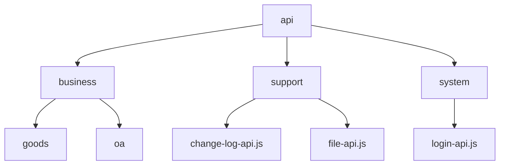
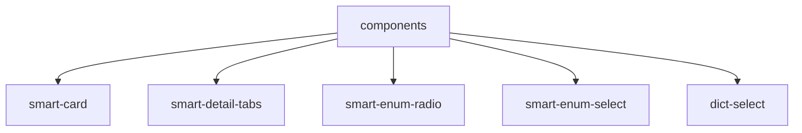
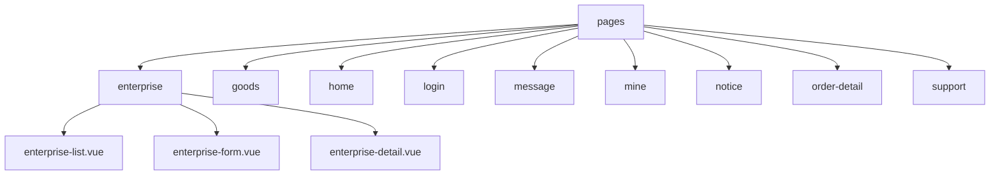
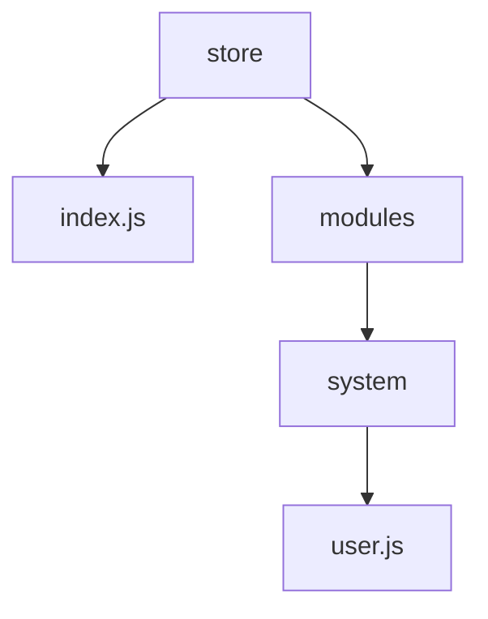
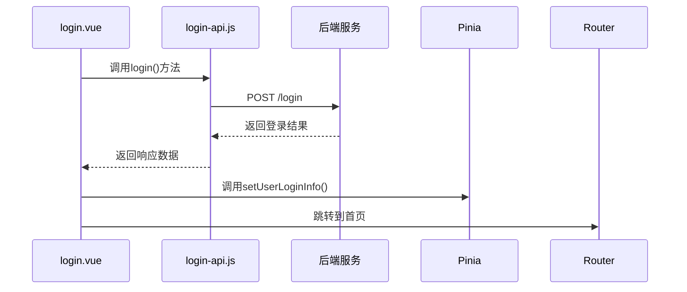
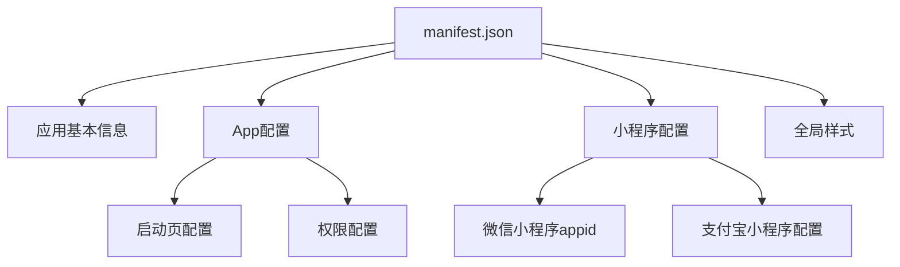
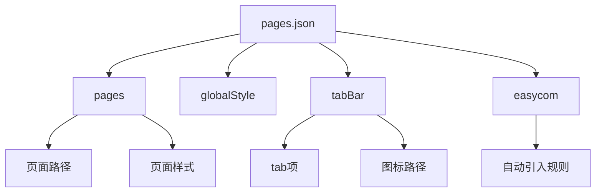

# 移动端项目结构

<cite>
**本文档引用文件**  
- [main.js](file://smart-app/src/main.js)
- [App.vue](file://smart-app/src/App.vue)
- [pages.json](file://smart-app/src/pages.json)
- [manifest.json](file://smart-app/src/manifest.json)
- [package.json](file://smart-app/package.json)
- [store/index.js](file://smart-app/src/store/index.js)
- [plugins/smart-enums-plugin.js](file://smart-app/src/plugins/smart-enums-plugin.js)
- [constants/index.js](file://smart-app/src/constants/index.js)
- [pages/home/index.vue](file://smart-app/src/pages/home/index.vue)
- [pages/login/login.vue](file://smart-app/src/pages/login/login.vue)
- [components/smart-card/index.vue](file://smart-app/src/components/smart-card/index.vue)
- [api/system/login-api.js](file://smart-app/src/api/system/login-api.js)
- [utils/str-util.js](file://smart-app/src/utils/str-util.js)
</cite>

## 目录

1. [项目结构概述](#项目结构概述)
2. [src目录结构详解](#src目录结构详解)
3. [核心模块分析](#核心模块分析)
4. [uni_modules第三方组件集成](#uni_modules第三方组件集成)
5. [配置文件说明](#配置文件说明)
6. [最佳实践建议](#最佳实践建议)

## 项目结构概述

本项目为基于uni-app框架开发的移动端应用，采用Vue 3 + Pinia + Vite技术栈，支持多端发布（H5、小程序、App等）。项目结构清晰，遵循模块化设计原则，便于维护和扩展。

项目根目录包含环境配置文件（.env.*）、构建配置（vite.config.js）、包管理文件（package.json）等。核心源码位于`smart-app/src`目录下，按照功能模块进行组织。

**Section sources**
- [package.json](file://smart-app/package.json#L1-L90)

## src目录结构详解

### api接口定义

`src/api`目录存放所有接口请求定义，按业务模块进行分类组织：
- `business`：业务相关接口（如商品、客户等）
- `support`：系统支持功能接口（如日志、反馈等）
- `system`：系统级接口（如登录、用户信息等）

每个接口文件导出一个对象，包含多个请求方法，使用`smart-request`封装的`getRequest`和`postRequest`方法进行HTTP请求。



**Diagram sources**
- [api/system/login-api.js](file://smart-app/src/api/system/login-api.js#L1-L54)

**Section sources**
- [api/system/login-api.js](file://smart-app/src/api/system/login-api.js#L1-L54)

### components组件库

`src/components`目录存放可复用的UI组件，采用原子化设计理念：
- `smart-card`：卡片容器组件
- `smart-detail-tabs`：详情页标签组件
- `smart-enum-radio/select`：枚举选择组件
- `dict-select`：字典选择组件

组件采用Vue 3的Composition API编写，支持通过slot进行内容分发，具有良好的可定制性。



**Diagram sources**
- [components/smart-card/index.vue](file://smart-app/src/components/smart-card/index.vue#L1-L70)

**Section sources**
- [components/smart-card/index.vue](file://smart-app/src/components/smart-card/index.vue#L1-L70)

### constants常量定义

`src/constants`目录集中管理项目中使用的所有常量，包括：
- `common-const.js`：通用常量（如标志位、性别等）
- `system`：系统相关常量（如登录设备类型）
- `business`：业务相关常量（如企业、商品等）
- `support`：支持功能常量（如变更日志、文件等）

通过`index.js`统一导出所有常量，便于在插件中全局使用。

**Section sources**
- [constants/index.js](file://smart-app/src/constants/index.js#L1-L29)

### lib基础库

`src/lib`目录存放项目基础工具库：
- `encrypt.js`：数据加密工具
- `smart-request.js`：请求封装工具
- `smart-sentry.js`：错误监控工具
- `smart-support.js`：通用支持工具

这些工具库为项目提供基础功能支持，提高代码复用率。

**Section sources**
- [lib/encrypt.js](file://smart-app/src/lib/encrypt.js)
- [lib/smart-request.js](file://smart-app/src/lib/smart-request.js)

### pages页面

`src/pages`目录存放所有页面组件，按功能模块组织：
- `enterprise`：企业客户相关页面
- `goods`：商品相关页面
- `home`：首页
- `login`：登录页面
- `message`：消息页面
- `mine`：个人中心
- `notice`：通知公告
- `order-detail`：订单详情
- `support`：支持功能页面

每个功能模块包含多个相关页面，如`enterprise`模块包含客户列表、客户详情、客户表单等页面。



**Diagram sources**
- [pages.json](file://smart-app/src/pages.json#L1-L213)

**Section sources**
- [pages.json](file://smart-app/src/pages.json#L1-L213)
- [pages/home/index.vue](file://smart-app/src/pages/home/index.vue#L1-L81)
- [pages/login/login.vue](file://smart-app/src/pages/login/login.vue#L1-L367)

### plugins插件

`src/plugins`目录存放项目自定义插件：
- `smart-enums-plugin.js`：枚举管理插件，提供根据枚举值获取描述、对象等功能

插件在`main.js`中通过`app.use()`方法注册，可在全局使用。

**Section sources**
- [plugins/smart-enums-plugin.js](file://smart-app/src/plugins/smart-enums-plugin.js#L1-L98)

### store状态管理

`src/store`目录使用Pinia进行状态管理：
- `index.js`：创建Pinia实例
- `modules/system/user.js`：用户模块状态管理

状态管理模块化设计，便于维护和扩展。



**Diagram sources**
- [store/index.js](file://smart-app/src/store/index.js#L1-L13)

**Section sources**
- [store/index.js](file://smart-app/src/store/index.js#L1-L13)

### uni_modules第三方组件库

`src/uni_modules`目录存放uni-app官方和第三方组件：
- `uni-data-picker`：数据选择器
- `uni-icons`：图标组件
- `uni-load-more`：加载更多组件
- `uni-mescroll`：滚动加载组件
- `uni-scss`：SCSS样式库
- `y-tabs`：标签页组件

这些组件通过easycom方式自动引入，无需手动import。

**Section sources**
- [uni_modules/uni-data-picker](file://smart-app/src/uni_modules/uni-data-picker)
- [uni_modules/uni-icons](file://smart-app/src/uni_modules/uni-icons)
- [uni_modules/uni-load-more](file://smart-app/src/uni_modules/uni-load-more)

## 核心模块分析

### 企业客户模块

企业客户模块位于`pages/enterprise`目录，包含三个主要页面：
- `enterprise-list.vue`：客户线索列表
- `enterprise-form.vue`：添加客户表单
- `enterprise-detail.vue`：客户详情

该模块通过`pages.json`配置页面路径和导航栏样式，实现页面间的跳转和数据传递。

**Section sources**
- [pages.json](file://smart-app/src/pages.json#L34-L60)

### 商品模块

商品模块位于`pages/goods`目录，包含：
- `goods-index.vue`：商品页面
- `components/goods-list.vue`：商品列表组件
- `components/goods-query-form-popup.vue`：商品查询表单弹窗

采用组件化设计，将可复用的部分提取为独立组件。

**Section sources**
- [pages.json](file://smart-app/src/pages.json#L80-L87)

### 首页模块

首页模块位于`pages/home`目录，采用组件化设计：
- `index.vue`：首页主页面
- `components/banner.vue`：轮播图组件
- `components/menu.vue`：功能菜单组件
- `components/statistics.vue`：统计数据组件
- `components/notice.vue`：通知公告组件
- `components/goods.vue`：商品组件

通过`v-if`控制不同布局的切换，提升用户体验。

**Section sources**
- [pages/home/index.vue](file://smart-app/src/pages/home/index.vue#L1-L81)

### 登录模块

登录模块位于`pages/login`目录，包含：
- `login.vue`：登录页面
- `components/login-check-box.vue`：登录协议勾选组件
- `components/other-way-box.vue`：其他登录方式组件

实现用户名密码登录、验证码登录、双因子认证等功能，通过`login-api.js`与后端交互。



**Diagram sources**
- [pages/login/login.vue](file://smart-app/src/pages/login/login.vue#L1-L367)
- [api/system/login-api.js](file://smart-app/src/api/system/login-api.js#L1-L54)

**Section sources**
- [pages/login/login.vue](file://smart-app/src/pages/login/login.vue#L1-L367)

## uni_modules第三方组件集成

### uni-data-picker集成

`uni-data-picker`是uni-app官方提供的数据选择器组件，用于实现级联选择功能。通过easycom方式自动引入，无需手动import。

在`pages.json`中配置easycom规则：
```json
"easycom": {
  "autoscan": true,
  "custom": {
    "^uni-(.*)": "@dcloudio/uni-ui/lib/uni-$1/uni-$1.vue"
  }
}
```

**Section sources**
- [pages.json](file://smart-app/src/pages.json#L2-L8)

### uni-icons集成

`uni-icons`是uni-app官方提供的图标组件库，包含大量常用图标。通过easycom方式自动引入，使用时直接通过`<uni-icons>`标签调用。

**Section sources**
- [pages.json](file://smart-app/src/pages.json#L2-L8)

### uni-load-more集成

`uni-load-more`是uni-app官方提供的加载更多组件，用于实现列表滚动加载功能。支持多种加载状态（加载前、加载中、没有更多数据等）。

**Section sources**
- [pages.json](file://smart-app/src/pages.json#L2-L8)

## 配置文件说明

### manifest.json

`manifest.json`是uni-app的全局配置文件，包含：
- 应用基本信息（名称、版本等）
- App特有配置（启动页、权限等）
- 小程序特有配置（appid等）
- 全局样式配置



**Diagram sources**
- [manifest.json](file://smart-app/src/manifest.json#L1-L73)

**Section sources**
- [manifest.json](file://smart-app/src/manifest.json#L1-L73)

### pages.json

`pages.json`是uni-app的页面配置文件，包含：
- 页面路径配置
- 全局样式配置
- tabBar配置
- easycom配置

通过该文件统一管理所有页面的路由和样式。



**Diagram sources**
- [pages.json](file://smart-app/src/pages.json#L1-L213)

**Section sources**
- [pages.json](file://smart-app/src/pages.json#L1-L213)

## 最佳实践建议

### 新页面创建规范

1. **目录结构**：在`pages`目录下创建功能模块目录
2. **命名规范**：采用小写中划线命名法（如`enterprise-list.vue`）
3. **页面配置**：在`pages.json`中添加页面路径和样式配置
4. **组件复用**：优先使用现有组件，避免重复开发

### 组件复用策略

1. **原子化设计**：将UI拆分为原子组件，提高复用性
2. **参数化配置**：通过props接收参数，增强组件灵活性
3. **slot机制**：使用slot实现内容分发，提高组件可定制性
4. **样式隔离**：使用scoped样式，避免样式污染

### 状态管理最佳实践

1. **模块化设计**：按功能模块划分store
2. **单一状态树**：确保状态的唯一性
3. **actions封装**：将业务逻辑封装在actions中
4. **持久化存储**：重要状态考虑持久化

### 接口调用规范

1. **统一管理**：所有接口定义在`api`目录下
2. **错误处理**：统一处理网络异常和业务异常
3. **请求拦截**：在`smart-request.js`中实现请求拦截
4. **类型安全**：为接口参数和返回值定义类型

**Section sources**
- [main.js](file://smart-app/src/main.js#L1-L23)
- [App.vue](file://smart-app/src/App.vue#L1-L23)
- [utils/str-util.js](file://smart-app/src/utils/str-util.js#L1-L47)