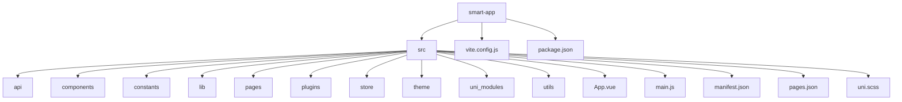

# 多端适配方案

<cite>
**本文档引用的文件**   
- [vite.config.js](file://smart-app/vite.config.js)
- [manifest.json](file://smart-app/src/manifest.json)
- [pages.json](file://smart-app/src/pages.json)
- [uni.scss](file://smart-app/src/uni.scss)
- [main.js](file://smart-app/src/main.js)
- [App.vue](file://smart-app/src/App.vue)
- [index.scss](file://smart-app/src/theme/index.scss)
- [package.json](file://smart-app/package.json)
- [home/index.vue](file://smart-app/src/pages/home/index.vue)
- [login/login.vue](file://smart-app/src/pages/login/login.vue)
- [index.js](file://smart-app/src/store/index.js)
- [smart-enums-plugin.js](file://smart-app/src/plugins/smart-enums-plugin.js)
</cite>

## 目录
1. [项目结构](#项目结构)
2. [核心配置文件分析](#核心配置文件分析)
3. [全局样式适配机制](#全局样式适配机制)
4. [多端适配差异与解决方案](#多端适配差异与解决方案)
5. [平台特定API使用示例](#平台特定api使用示例)
6. [多端调试技巧](#多端调试技巧)
7. [常见问题解决方案](#常见问题解决方案)

## 项目结构



**图示来源**
- [vite.config.js](file://smart-app/vite.config.js)
- [package.json](file://smart-app/package.json)
- [src目录结构](file://smart-app/src)

## 核心配置文件分析

### vite.config.js构建配置

`vite.config.js`文件定义了项目的构建配置，支持多端编译。配置中包含了路径别名、插件配置和构建优化等关键设置。

```javascript
export default defineConfig({
  transpileDependencies:['@dcloudio/uni-ui'],
  plugins: [
    uni(),
  ],
  resolve: {
    alias: [
      {
        find: /\/@\//,
        replacement: pathResolve('src') + '/',
      },
      {
        find: /^~/,
        replacement: '',
      },
    ],
  },
  build: {
    minify: 'terser',
    terserOptions: {
      compress: {
        drop_console: true,
      },
    },
  },
})
```

该配置实现了以下功能：
- 使用`@dcloudio/vite-plugin-uni`插件支持uni-app开发
- 配置路径别名，`/@/`指向`src`目录，简化模块导入
- 构建时自动删除`console`语句，优化生产环境代码
- 对指定依赖进行转译，确保兼容性

**本节来源**
- [vite.config.js](file://smart-app/vite.config.js#L1-L38)

### manifest.json跨平台应用配置

`manifest.json`是uni-app的跨平台应用配置文件，定义了应用的基本信息、权限配置和各平台特有设置。

```json
{
    "name": "smart-app",
    "appid": "",
    "description": "",
    "versionName": "1.0.0",
    "versionCode": "100",
    "app-plus": {
        "usingComponents": true,
        "nvueStyleCompiler": "uni-app",
        "compilerVersion": 3,
        "splashscreen": {
            "alwaysShowBeforeRender": true,
            "waiting": true,
            "autoclose": true,
            "delay": 0
        },
        "modules": {},
        "distribute": {
            "android": {
                "permissions": [
                    "<uses-permission android:name=\"android.permission.CHANGE_NETWORK_STATE\"/>",
                    "<uses-permission android:name=\"android.permission.MOUNT_UNMOUNT_FILESYSTEMS\"/>",
                    "<uses-permission android:name=\"android.permission.VIBRATE\"/>",
                    "<uses-permission android:name=\"android.permission.READ_LOGS\"/>",
                    "<uses-permission android:name=\"android.permission.ACCESS_WIFI_STATE\"/>",
                    "<uses-feature android:name=\"android.hardware.camera.autofocus\"/>",
                    "<uses-permission android:name=\"android.permission.ACCESS_NETWORK_STATE\"/>",
                    "<uses-permission android:name=\"android.permission.CAMERA\"/>",
                    "<uses-permission android:name=\"android.permission.GET_ACCOUNTS\"/>",
                    "<uses-permission android:name=\"android.permission.READ_PHONE_STATE\"/>",
                    "<uses-permission android:name=\"android.permission.CHANGE_WIFI_STATE\"/>",
                    "<uses-permission android:name=\"android.permission.WAKE_LOCK\"/>",
                    "<uses-permission android:name=\"android.permission.FLASHLIGHT\"/>",
                    "<uses-feature android:name=\"android.hardware.camera\"/>",
                    "<uses-permission android:name=\"android.permission.WRITE_SETTINGS\"/>"
                ]
            },
            "ios": {},
            "sdkConfigs": {}
        }
    },
    "mp-weixin": {
        "appid": "wx2f5032ef5c4adae4",
        "setting": {
            "urlCheck": false
        },
        "usingComponents": true
    },
    "mp-alipay": {
        "usingComponents": true
    },
    "uniStatistics": {  
        "enable": false
    },
    "vueVersion": "3"
}
```

配置文件的关键特性包括：
- **多平台配置**：为App、微信小程序、支付宝小程序等不同平台提供独立配置
- **Android权限管理**：声明应用所需的系统权限，如相机、网络状态、振动等
- **微信小程序配置**：指定小程序的appid和开发设置
- **Vue版本指定**：使用Vue 3版本进行开发

**本节来源**
- [manifest.json](file://smart-app/src/manifest.json#L1-L73)

### pages.json页面路由配置

`pages.json`文件定义了应用的页面路由、导航栏样式和标签栏配置。

```json
{
	"easycom": {
		"autoscan": true,
		"custom": {
			"^uni-(.*)": "@dcloudio/uni-ui/lib/uni-$1/uni-$1.vue",
			"^y-(.*)": "@/uni_modules/y-$1/components/y-$1.vue"
		}
	},
	"pages": [
		{
			"path": "pages/home/index",
			"style": {
				"navigationStyle":"custom",
				"navigationBarTitleText": "首页"
			}
		},
		{
			"path": "pages/login/login",
			"style": {
				"navigationBarTitleText": "登录",
				"navigationBarTextStyle": "white",
				"navigationStyle": "custom"
			}
		}
	],
	"globalStyle": {
		"navigationBarTextStyle": "black",
		"navigationBarTitleText": "uni-app",
		"navigationBarBackgroundColor": "#F8F8F8",
		"backgroundColor": "#F8F8F8"
	},
	"tabBar": {
		"color": "#858585",
		"selectedColor": "#1A9AFF",
		"borderStyle": "black",
		"backgroundColor": "#ffffff",
		"list": [{
			"pagePath": "pages/home/index",
			"iconPath": "static/images/tabbar/home-icon.png",
			"selectedIconPath": "static/images/tabbar/home-icon-h.png",
			"text": "首页"
		}]
	}
}
```

该配置文件的主要功能：
- **页面路由管理**：定义所有页面的路径和导航栏样式
- **全局样式配置**：设置应用的全局导航栏和背景颜色
- **标签栏配置**：定义底部标签栏的样式和页面映射
- **组件自动导入**：通过`easycom`配置实现uni-ui组件和自定义组件的自动导入

**本节来源**
- [pages.json](file://smart-app/src/pages.json#L1-L213)

## 全局样式适配机制

### uni.scss全局样式文件

`uni.scss`是uni-app的全局样式变量文件，定义了应用的统一设计系统。

```scss
/* 颜色变量 */
$uni-color-primary: #007aff;
$uni-color-success: #4cd964;
$uni-color-warning: #f0ad4e;
$uni-color-error: #dd524d;

/* 文字基本颜色 */
$uni-text-color: #333;
$uni-text-color-inverse: #fff;
$uni-text-color-grey: #999;

/* 背景颜色 */
$uni-bg-color: #fff;
$uni-bg-color-grey: #f8f8f8;

/* 尺寸变量 */
$uni-font-size-sm: 12px;
$uni-font-size-base: 14px;
$uni-font-size-lg: 16px;

/* 自定义颜色 */
$main-color: #1A9AFF;
$main-background: #F4F4F4;
$main-font-color: #444444;
$second-font-color: #777777;
```

该文件的作用包括：
- **设计系统统一**：定义应用的主色调、辅助色、文字颜色等设计规范
- **响应式适配**：通过SCSS变量实现样式的统一管理和修改
- **插件兼容**：uni-ui等第三方组件库使用这些变量，确保样式一致性
- **主题定制**：开发者可以通过修改变量值来快速定制应用主题

**本节来源**
- [uni.scss](file://smart-app/src/uni.scss#L1-L132)

### 主题样式文件

`theme/index.scss`文件包含了项目特有的样式定义和布局规范。

```scss
.smart-margin-top10 {
  margin-top: 10px;
}

.smart-margin-top20 {
  margin-top: 20px;
}

.smart-form {
  :deep(.uni-forms-item__label) {
    font-size: 32rpx;
    color: #000000;
  }
}

.smart-detail-card {
  &::before {
    background-color: $uni-color-primary;
  }
}
```

该文件的特点：
- **间距类样式**：定义了统一的margin和padding类，如`smart-margin-top10`
- **表单样式**：通过`:deep`选择器修改uni-ui组件的内部样式
- **卡片样式**：定义了详情页卡片的统一外观
- **rpx单位使用**：使用rpx响应式单位确保在不同屏幕尺寸下的适配

**本节来源**
- [index.scss](file://smart-app/src/theme/index.scss#L1-L255)

## 多端适配差异与解决方案

### H5端适配

H5端作为Web应用，具有以下特点和适配方案：

```javascript
// H5端特有的构建脚本
"scripts": {
  "dev:h5": "uni",
  "build:h5": "uni build"
}
```

适配要点：
- **浏览器兼容性**：使用Vite的构建优化确保在主流浏览器中的兼容性
- **SEO优化**：可通过SSR（服务端渲染）提升搜索引擎可见性
- **URL路由**：支持传统的URL路由模式，便于分享和书签
- **调试便利**：可使用浏览器开发者工具进行调试

### 小程序端适配

小程序端适配主要通过`manifest.json`中的平台特定配置实现：

```json
"mp-weixin": {
  "appid": "wx2f5032ef5c4adae4",
  "setting": {
    "urlCheck": false
  },
  "usingComponents": true
},
"mp-alipay": {
  "usingComponents": true
}
```

适配要点：
- **平台特有配置**：为不同小程序平台（微信、支付宝等）提供独立配置
- **组件系统**：启用自定义组件支持，使用uni-ui等组件库
- **性能优化**：关闭URL检查等设置以提升性能
- **发布流程**：通过uni-app的构建命令生成对应平台的小程序包

### 原生App端适配

原生App端适配通过`app-plus`配置实现：

```json
"app-plus": {
  "usingComponents": true,
  "nvueStyleCompiler": "uni-app",
  "compilerVersion": 3,
  "splashscreen": {
    "alwaysShowBeforeRender": true,
    "waiting": true,
    "autoclose": true,
    "delay": 0
  },
  "distribute": {
    "android": {
      "permissions": [
        "<uses-permission android:name=\"android.permission.CAMERA\"/>",
        "<uses-permission android:name=\"android.permission.ACCESS_NETWORK_STATE\"/>"
      ]
    }
  }
}
```

适配要点：
- **启动屏配置**：定义启动屏的显示行为和持续时间
- **Android权限**：声明应用所需的系统权限
- **原生渲染**：使用nvue渲染模式提升性能
- **包名和证书**：在构建时配置应用包名和签名证书

**本节来源**
- [manifest.json](file://smart-app/src/manifest.json#L9-L48)
- [package.json](file://smart-app/package.json#L11-L48)

## 平台特定API使用示例

### 跨平台API调用

uni-app提供了统一的API接口，可在多端使用：

```javascript
// 页面生命周期钩子
onShow(() => {
  uni.pageScrollTo({
    scrollTop: 0,
    duration: 300,
  });
});

// 消息提示
uni.showToast({
  icon: 'none',
  title: '请阅读并同意《用户协议》、《隐私政策》',
});

// 页面跳转
uni.switchTab({ url: '/pages/home/index' });
```

这些API在不同平台上的实现：
- **H5端**：转换为相应的Web API调用
- **小程序端**：调用对应小程序平台的原生API
- **App端**：通过WebView与原生代码桥接调用

### 存储API使用

```javascript
// 使用uni.setStorageSync进行本地存储
const loginCheckBoxRef = ref();
async function login() {
  if (!loginCheckBoxRef.value.agreeFlag) {
    uni.showToast({
      icon: 'none',
      title: '请阅读并同意《用户协议》、《隐私政策》',
    });
    return;
  }
}
```

### 网络请求API

```javascript
// 登录API调用
const res = await loginApi.login(encryptPasswordForm);
```

平台限制说明：
- **H5端**：受同源策略限制，需要配置CORS
- **小程序端**：需要在管理后台配置request合法域名
- **App端**：无域名限制，但需要处理HTTPS证书问题

**本节来源**
- [login/login.vue](file://smart-app/src/pages/login/login.vue#L76-L221)
- [home/index.vue](file://smart-app/src/pages/home/index.vue#L33-L53)

## 多端调试技巧

### 开发环境配置

```json
// package.json中的多端开发脚本
"scripts": {
  "dev:app": "uni -p app",
  "dev:app-android": "uni -p app-android",
  "dev:app-ios": "uni -p app-ios",
  "dev:h5": "uni",
  "dev:mp-weixin": "uni -p mp-weixin"
}
```

调试命令使用：
- `npm run dev:h5`：启动H5端开发服务器
- `npm run dev:mp-weixin`：启动微信小程序开发工具
- `npm run dev:app-android`：启动Android模拟器调试

### 条件编译

使用条件编译处理平台特定代码：

```javascript
// #ifdef H5
console.log('这是H5端特有代码');
// #endif

// #ifdef MP-WEIXIN
console.log('这是微信小程序特有代码');
// #endif

// #ifdef APP-PLUS
console.log('这是App端特有代码');
// #endif
```

### 调试工具

- **H5端**：使用浏览器开发者工具进行DOM、网络和性能分析
- **小程序端**：使用微信/支付宝开发者工具的调试功能
- **App端**：使用ADB工具和原生调试器进行调试

**本节来源**
- [package.json](file://smart-app/package.json#L11-L48)
- [main.js](file://smart-app/src/main.js#L1-L23)

## 常见问题解决方案

### 样式兼容性问题

问题：不同平台的样式渲染差异

解决方案：
1. 使用rpx单位而非px，确保响应式适配
2. 通过`:deep`选择器修改第三方组件样式
3. 使用SCSS变量统一管理颜色和尺寸

```scss
// 使用:deep修改组件内部样式
:deep(.uni-forms-item__label) {
  font-size: 32rpx;
  color: #000000;
}
```

### 构建性能优化

问题：构建速度慢，包体积大

解决方案：
1. 在`vite.config.js`中配置terser压缩
2. 移除生产环境的console输出
3. 按需引入组件而非全局引入

```javascript
// vite.config.js中的构建优化
build: {
  minify: 'terser',
  terserOptions: {
    compress: {
      drop_console: true,
    },
  },
}
```

### 多端行为差异

问题：同一API在不同平台的行为不一致

解决方案：
1. 使用条件编译处理平台特定逻辑
2. 封装统一的API适配层
3. 充分测试各平台的行为

```javascript
// 封装统一的存储API
function setStorage(key, value) {
  // #ifdef H5
  localStorage.setItem(key, JSON.stringify(value));
  // #endif
  // #ifdef MP-WEIXIN || APP-PLUS
  uni.setStorageSync(key, value);
  // #endif
}
```

**本节来源**
- [vite.config.js](file://smart-app/vite.config.js#L28-L37)
- [theme/index.scss](file://smart-app/src/theme/index.scss#L113-L131)
- [login/login.vue](file://smart-app/src/pages/login/login.vue#L96-L140)