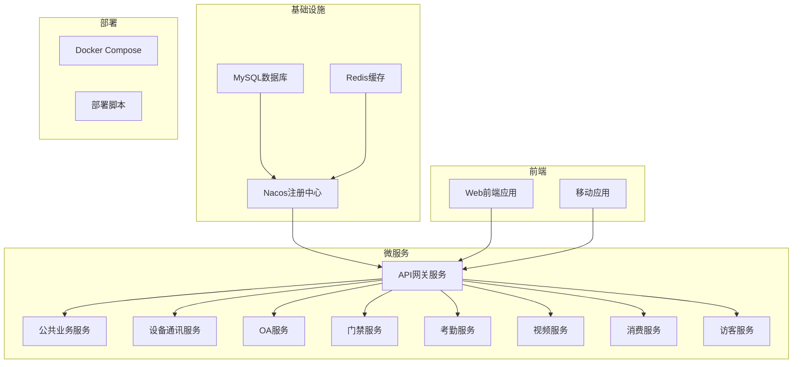

# 应用部署

<cite>
**本文档引用的文件**
- [docker-compose-all.yml](file://docker-compose-all.yml)
- [docker-compose-services.yml](file://docker-compose-services.yml)
- [templates\secure-application.yml](file://templates/secure-application.yml)
- [microservices\ioedream-gateway-service\src\main\resources\application.yml](file://microservices/ioedream-gateway-service/src/main/resources/application.yml)
- [microservices\ioedream-access-service\src\main\resources\application.yml](file://microservices/ioedream-access-service/src/main/resources/application.yml)
- [microservices\ioedream-consume-service\src\main\resources\application.yml](file://microservices/ioedream-consume-service/src/main/resources/application.yml)
- [smart-admin-web-javascript\package.json](file://smart-admin-web-javascript/package.json)
- [scripts\start-all-services.ps1](file://scripts/start-all-services.ps1)
- [scripts\deploy-monitoring.ps1](file://scripts/deploy-monitoring.ps1)
- [microservices\ioedream-gateway-service\Dockerfile](file://microservices/ioedream-gateway-service/Dockerfile)
</cite>

## 目录
1. [简介](#简介)
2. [项目结构](#项目结构)
3. [后端微服务构建](#后端微服务构建)
4. [前端应用构建](#前端应用构建)
5. [微服务配置管理](#微服务配置管理)
6. [Docker Compose 一键部署](#docker-compose-一键部署)
7. [生产环境独立部署](#生产环境独立部署)
8. [服务启动顺序与健康检查](#服务启动顺序与健康检查)
9. [常见启动问题解决方案](#常见启动问题解决方案)

## 简介
本文档详细说明了IOE-DREAM智慧园区一卡通管理平台的完整部署流程。文档涵盖了后端微服务的Maven构建、前端应用的npm构建、各微服务的application.yml配置文件设置、使用Docker Compose进行一键部署，以及在生产环境中独立部署每个服务的方法。同时提供了服务启动顺序、健康检查验证和常见启动问题的解决方案。

## 项目结构
IOE-DREAM项目采用微服务架构，包含多个独立的微服务和前端应用。项目主要结构包括微服务模块、前端应用、部署配置和脚本等。



**Diagram sources**
- [docker-compose-all.yml](file://docker-compose-all.yml)
- [microservices\ioedream-gateway-service\src\main\resources\application.yml](file://microservices/ioedream-gateway-service/src/main/resources/application.yml)

**Section sources**
- [docker-compose-all.yml](file://docker-compose-all.yml)
- [project_structure](file://project_structure)

## 后端微服务构建
后端微服务采用Spring Boot框架，通过Maven进行构建和打包。每个微服务都有独立的pom.xml文件，使用Maven进行依赖管理和构建。

### 构建步骤
1. 确保已安装JDK 17或更高版本
2. 确保已安装Maven 3.8或更高版本
3. 进入每个微服务目录，执行Maven构建命令

```bash
# 进入微服务目录
cd microservices/ioedream-gateway-service

# 清理并构建项目
mvn clean package

# 或者直接运行（开发环境）
mvn spring-boot:run
```

### 批量构建脚本
项目提供了PowerShell脚本用于批量构建和启动所有微服务：

```powershell
# 执行所有服务的构建和启动
.\scripts\start-all-services.ps1
```

**Section sources**
- [scripts\start-all-services.ps1](file://scripts/start-all-services.ps1)
- [microservices\ioedream-gateway-service\pom.xml](file://microservices/ioedream-gateway-service/pom.xml)

## 前端应用构建
前端应用采用Vue3框架，通过npm进行依赖管理和构建。

### 构建步骤
1. 确保已安装Node.js 18或更高版本
2. 安装项目依赖
3. 根据不同环境进行构建

```bash
# 进入前端项目目录
cd smart-admin-web-javascript

# 安装依赖
npm install

# 开发环境构建
npm run dev

# 测试环境构建
npm run build:test

# 预发布环境构建
npm run build:pre

# 生产环境构建
npm run build:prod
```

### 构建配置
前端构建配置在package.json中定义，支持多种构建模式：

```json
"scripts": {
  "localhost": "vite --mode localhost",
  "dev": "vite",
  "build:test": "vite build  --base=/admin/ --mode test",
  "build:pre": "vite build  --mode pre",
  "build:prod": "vite build  --mode production"
}
```

**Section sources**
- [smart-admin-web-javascript\package.json](file://smart-admin-web-javascript/package.json)
- [smart-admin-web-javascript\vite.config.js](file://smart-admin-web-javascript/vite.config.js)

## 微服务配置管理
微服务的配置通过application.yml文件进行管理，同时集成Nacos作为配置中心，实现配置的集中管理和动态刷新。

### 配置文件结构
每个微服务都有一个application.yml配置文件，包含以下主要配置：

```yaml
# 服务基本信息
spring:
  application:
    name: ioedream-gateway-service
  profiles:
    active: ${SPRING_PROFILES_ACTIVE:dev}

# Nacos服务发现配置
  cloud:
    nacos:
      discovery:
        server-addr: ${NACOS_SERVER_ADDR:127.0.0.1:8848}
        namespace: ${NACOS_NAMESPACE:dev}
        group: ${NACOS_GROUP:IOE-DREAM}
        username: ${NACOS_USERNAME:nacos}
        password: ${NACOS_PASSWORD:nacos}
      config:
        server-addr: ${NACOS_SERVER_ADDR:127.0.0.1:8848}
        namespace: ${NACOS_NAMESPACE:dev}
        group: ${NACOS_GROUP:IOE-DREAM}
        file-extension: yaml

# 服务器配置
server:
  port: 8080
  servlet:
    context-path: /
    encoding:
      charset: UTF-8
      enabled: true
      force: true
```

### 安全配置模板
项目提供了安全配置模板，支持配置加密和安全访问：

```yaml
# IOE-DREAM 安全配置模板
# 基于Nacos加密配置的企业级安全标准

spring:
  # Nacos配置中心
  cloud:
    nacos:
      discovery:
        server-addr: ${NACOS_SERVER_ADDR:127.0.0.1:8848}
        namespace: ${NACOS_NAMESPACE:dev}
        group: ${NACOS_GROUP:IOE-DREAM}
        username: ${NACOS_USERNAME:nacos}
        password: ${NACOS_PASSWORD}  # 必须使用加密配置
      config:
        server-addr: ${NACOS_SERVER_ADDR:127.0.0.1:8848}
        namespace: ${NACOS_NAMESPACE:dev}
        group: ${NACOS_GROUP:IOE-DREAM}
        username: ${NACOS_USERNAME:nacos}
        password: ${NACOS_PASSWORD}  # 必须使用加密配置
        shared-configs:
          - data-id: common-security-config.yaml
            group: SHARED_CONFIG
            refresh: true
          - data-id: common-database-config.yaml
            group: SHARED_CONFIG
            refresh: true
          - data-id: common-cache-config.yaml
            group: SHARED_CONFIG
            refresh: true

  # 数据源安全配置
  datasource:
    type: com.alibaba.druid.pool.DruidDataSource
    driver-class-name: com.mysql.cj.jdbc.Driver
    url: ${DB_URL:jdbc:mysql://localhost:3306/ioedream?useUnicode=true&characterEncoding=utf8&serverTimezone=Asia/Shanghai}
    username: ${DB_USERNAME:root}
    password: ${DB_PASSWORD}  # 必须使用Nacos加密配置
    druid:
      filters:
        config:
          enabled: true
          connection-properties: |
            config.decrypt=true;
            config.decrypt.key=${nacos.config.key};
            config.decrypt.error=false
```

### 数据库连接配置
数据库连接配置通过环境变量和Nacos配置中心进行管理：

```yaml
# 数据库连接配置
spring:
  datasource:
    url: ${DB_URL:jdbc:mysql://localhost:3306/ioedream?useUnicode=true&characterEncoding=utf8&serverTimezone=Asia/Shanghai}
    username: ${DB_USERNAME:root}
    password: ${DB_PASSWORD}
    driver-class-name: com.mysql.cj.jdbc.Driver
```

### 缓存连接配置
Redis缓存连接配置：

```yaml
# Redis安全配置
spring:
  redis:
    host: ${REDIS_HOST:127.0.0.1}
    port: ${REDIS_PORT:6379}
    password: ${REDIS_PASSWORD}
    database: ${REDIS_DATABASE:0}
    timeout: 3000
```

### 注册中心配置
Nacos注册中心配置：

```yaml
# Nacos服务发现配置
spring:
  cloud:
    nacos:
      discovery:
        server-addr: ${NACOS_SERVER_ADDR:127.0.0.1:8848}
        namespace: ${NACOS_NAMESPACE:dev}
        group: ${NACOS_GROUP:IOE-DREAM}
        username: ${NACOS_USERNAME:nacos}
        password: ${NACOS_PASSWORD:nacos}
```

**Section sources**
- [templates\secure-application.yml](file://templates/secure-application.yml)
- [microservices\ioedream-gateway-service\src\main\resources\application.yml](file://microservices/ioedream-gateway-service/src/main/resources/application.yml)
- [microservices\ioedream-access-service\src\main\resources\application.yml](file://microservices/ioedream-access-service/src/main/resources/application.yml)
- [microservices\ioedream-consume-service\src\main\resources\application.yml](file://microservices/ioedream-consume-service/src/main/resources/application.yml)

## Docker Compose 一键部署
项目提供了完整的Docker Compose配置文件，可以一键部署所有服务。

### 部署文件
docker-compose-all.yml文件定义了所有服务的部署配置：

```yaml
# IOE-DREAM 完整项目 Docker Compose 配置
# 包含所有基础设施服务和微服务
version: '3.8'

services:
  # MySQL数据库
  mysql:
    image: mysql:8.0
    container_name: ioedream-mysql
    environment:
      MYSQL_ROOT_PASSWORD: ${MYSQL_ROOT_PASSWORD:-root}
      MYSQL_DATABASE: ioedream
      TZ: Asia/Shanghai
    ports:
      - "3306:3306"
    volumes:
      - mysql_data:/var/lib/mysql
      - ./deployment/mysql/init:/docker-entrypoint-initdb.d
    command: --default-authentication-plugin=mysql_native_password --character-set-server=utf8mb4 --collation-server=utf8mb4_unicode_ci
    healthcheck:
      test: ["CMD", "mysqladmin", "ping", "-h", "localhost", "-u", "root", "-proot"]
      interval: 10s
      timeout: 5s
      retries: 5
      start_period: 30s
    restart: unless-stopped
    networks:
      - ioedream-network

  # Redis缓存
  redis:
    image: redis:7-alpine
    container_name: ioedream-redis
    command: redis-server --appendonly yes --requirepass ${REDIS_PASSWORD:-redis123}
    ports:
      - "6379:6379"
    volumes:
      - redis_data:/data
    healthcheck:
      test: ["CMD", "redis-cli", "ping"]
      interval: 10s
      timeout: 3s
      retries: 3
      start_period: 10s
    restart: unless-stopped
    networks:
      - ioedream-network

  # Nacos注册中心
  nacos:
    image: nacos/nacos-server:v2.3.0
    container_name: ioedream-nacos
    environment:
      - MODE=standalone
      - SPRING_DATASOURCE_PLATFORM=mysql
      - MYSQL_SERVICE_HOST=mysql
      - MYSQL_SERVICE_PORT=3306
      - MYSQL_SERVICE_DB_NAME=nacos
      - MYSQL_SERVICE_USER=root
      - MYSQL_SERVICE_PASSWORD=${MYSQL_ROOT_PASSWORD:-root}
      - NACOS_AUTH_ENABLE=true
      - NACOS_AUTH_TOKEN=${NACOS_AUTH_TOKEN:-SecretKey012345678901234567890123456789012345678901234567890123456789}
      - NACOS_AUTH_IDENTITY_KEY=nacos
      - NACOS_AUTH_IDENTITY_VALUE=nacos
      - TZ=Asia/Shanghai
    ports:
      - "8848:8848"
      - "9848:9848"
    volumes:
      - nacos_data:/home/nacos/data
      - nacos_logs:/home/nacos/logs
    healthcheck:
      test: ["CMD", "curl", "-f", "http://localhost:8848/nacos/v1/console/health/readiness"]
      interval: 15s
      timeout: 5s
      retries: 5
      start_period: 60s
    depends_on:
      mysql:
        condition: service_healthy
    restart: unless-stopped
    networks:
      - ioedream-network

  # API网关服务
  gateway-service:
    build:
      context: .
      dockerfile: microservices/ioedream-gateway-service/Dockerfile
    image: ioedream/gateway-service:latest
    container_name: ioedream-gateway-service
    environment:
      - SERVER_PORT=8080
      - SPRING_PROFILES_ACTIVE=docker
      - NACOS_SERVER_ADDR=nacos:8848
      - NACOS_NAMESPACE=public
      - REDIS_HOST=redis
      - REDIS_PORT=6379
      - REDIS_PASSWORD=${REDIS_PASSWORD:-redis123}
      - MYSQL_HOST=mysql
      - MYSQL_PORT=3306
      - MYSQL_DATABASE=ioedream
      - MYSQL_USERNAME=root
      - MYSQL_PASSWORD=${MYSQL_ROOT_PASSWORD:-root}
      - TZ=Asia/Shanghai
    ports:
      - "8080:8080"
    depends_on:
      nacos:
        condition: service_healthy
      redis:
        condition: service_healthy
      mysql:
        condition: service_healthy
    restart: unless-stopped
    networks:
      - ioedream-network
    healthcheck:
      test: ["CMD", "curl", "-f", "http://localhost:8080/actuator/health"]
      interval: 30s
      timeout: 5s
      retries: 3
      start_period: 90s

  # 其他微服务配置...
```

### 一键部署步骤
1. 确保已安装Docker和Docker Compose
2. 在项目根目录创建.env文件，配置环境变量
3. 执行Docker Compose命令启动所有服务

```bash
# 创建环境变量文件
cat > .env << EOF
MYSQL_ROOT_PASSWORD=root
REDIS_PASSWORD=redis123
NACOS_AUTH_TOKEN=SecretKey012345678901234567890123456789012345678901234567890123456789
EOF

# 启动所有服务
docker-compose -f docker-compose-all.yml up -d

# 查看服务状态
docker-compose -f docker-compose-all.yml ps

# 查看服务日志
docker-compose -f docker-compose-all.yml logs -f
```

### 部署网络配置
Docker Compose定义了专用的网络和数据卷：

```yaml
# 数据卷
volumes:
  mysql_data:
    driver: local
  redis_data:
    driver: local
  nacos_data:
    driver: local
  nacos_logs:
    driver: local

# 网络
networks:
  ioedream-network:
    driver: bridge
    name: ioedream-network
```

**Section sources**
- [docker-compose-all.yml](file://docker-compose-all.yml)
- [docker-compose-services.yml](file://docker-compose-services.yml)

## 生产环境独立部署
在生产环境中，可以独立部署每个服务，以实现更灵活的资源管理和故障隔离。

### 独立部署步骤
1. 分别构建每个微服务的Docker镜像
2. 将镜像推送到私有镜像仓库
3. 在生产服务器上拉取镜像并运行

```bash
# 构建网关服务镜像
docker build -f microservices/ioedream-gateway-service/Dockerfile -t registry.example.com/ioedream/gateway-service:latest .

# 推送镜像到私有仓库
docker push registry.example.com/ioedream/gateway-service:latest

# 在生产服务器上运行服务
docker run -d \
  --name ioedream-gateway-service \
  -p 8080:8080 \
  -e SPRING_PROFILES_ACTIVE=prod \
  -e NACOS_SERVER_ADDR=nacos.example.com:8848 \
  -e REDIS_HOST=redis.example.com \
  -e MYSQL_HOST=mysql.example.com \
  registry.example.com/ioedream/gateway-service:latest
```

### Dockerfile示例
微服务的Dockerfile示例：

```dockerfile
# 基础镜像
FROM openjdk:17-jdk-alpine

# 维护者信息
LABEL maintainer="IOE-DREAM Team"

# 设置时区
ENV TZ=Asia/Shanghai
RUN ln -snf /usr/share/zoneinfo/$TZ /etc/localtime && echo $TZ > /etc/timezone

# 创建应用目录
WORKDIR /app

# 复制jar包
COPY microservices/ioedream-gateway-service/target/ioedream-gateway-service.jar app.jar

# 暴露端口
EXPOSE 8080

# 启动命令
ENTRYPOINT ["java", "-jar", "/app/app.jar"]
```

**Section sources**
- [microservices\ioedream-gateway-service\Dockerfile](file://microservices/ioedream-gateway-service/Dockerfile)
- [docker-compose-all.yml](file://docker-compose-all.yml)

## 服务启动顺序与健康检查
为了确保服务的正常启动和依赖关系，需要按照正确的顺序启动服务，并进行健康检查。

### 服务启动顺序
根据服务依赖关系，启动顺序如下：

1. 基础设施服务
   - MySQL数据库
   - Redis缓存
   - Nacos注册中心

2. 基础微服务
   - API网关服务
   - 公共业务服务

3. 业务微服务
   - 设备通讯服务
   - 认证服务
   - 身份服务

4. 业务应用服务
   - OA服务
   - 门禁服务
   - 考勤服务
   - 视频服务
   - 消费服务
   - 访客服务

### 健康检查配置
每个服务都配置了健康检查，确保服务正常运行：

```yaml
# 健康检查配置示例
healthcheck:
  test: ["CMD", "curl", "-f", "http://localhost:8080/actuator/health"]
  interval: 30s
  timeout: 5s
  retries: 3
  start_period: 90s
```

### 服务依赖配置
通过depends_on和condition配置服务依赖：

```yaml
depends_on:
  nacos:
    condition: service_healthy
  redis:
    condition: service_healthy
  mysql:
    condition: service_healthy
```

### 启动脚本
项目提供了PowerShell脚本用于按顺序启动服务：

```powershell
# 定义服务启动顺序
$services = @(
    @{Name="ioedream-config-service"; Port=8888; Order=1; Type="基础设施"},
    @{Name="ioedream-gateway-service"; Port=8080; Order=2; Type="基础设施"},
    @{Name="ioedream-common-service"; Port=8088; Order=3; Type="公共模块"},
    # ... 其他服务
)

# 按Order分组启动
for ($order = 1; $order -le $maxOrder; $order++) {
    $groupServices = $services | Where-Object { $_.Order -eq $order }
    
    # 启动该批次的服务
    foreach ($service in $groupServices) {
        # 在新窗口启动服务
        $startCmd = "cd '$servicePath'; mvn spring-boot:run"
        Start-Process powershell -ArgumentList "-NoExit", "-Command", $startCmd
        
        # 等待该批次服务启动
        Start-Sleep -Seconds 30
    }
}
```

**Section sources**
- [scripts\start-all-services.ps1](file://scripts/start-all-services.ps1)
- [docker-compose-all.yml](file://docker-compose-all.yml)

## 常见启动问题解决方案
在部署过程中可能会遇到各种问题，以下是常见问题及其解决方案。

### 数据库连接问题
**问题描述**: 服务无法连接到MySQL数据库
**解决方案**:
1. 检查MySQL服务是否正常运行
2. 检查数据库连接配置是否正确
3. 检查网络连接是否正常

```bash
# 检查MySQL服务状态
docker-compose -f docker-compose-all.yml ps mysql

# 检查数据库连接
mysql -h localhost -P 3306 -u root -p
```

### Nacos注册中心问题
**问题描述**: 服务无法注册到Nacos
**解决方案**:
1. 检查Nacos服务是否正常运行
2. 检查Nacos配置是否正确
3. 检查网络连接是否正常

```bash
# 检查Nacos服务状态
docker-compose -f docker-compose-all.yml ps nacos

# 访问Nacos控制台
http://localhost:8848/nacos
```

### Redis连接问题
**问题描述**: 服务无法连接到Redis
**解决方案**:
1. 检查Redis服务是否正常运行
2. 检查Redis连接配置是否正确
3. 检查Redis密码是否正确

```bash
# 检查Redis服务状态
docker-compose -f docker-compose-all.yml ps redis

# 连接Redis
redis-cli -h localhost -p 6379 -a redis123
```

### 端口冲突问题
**问题描述**: 端口被占用，服务无法启动
**解决方案**:
1. 检查端口占用情况
2. 修改服务端口配置
3. 停止占用端口的进程

```bash
# 检查端口占用
netstat -ano | findstr :8080

# 在Windows上查找进程
tasklist | findstr <PID>
```

### 环境变量问题
**问题描述**: 环境变量未正确设置
**解决方案**:
1. 检查.env文件是否存在
2. 检查环境变量名称是否正确
3. 检查环境变量值是否正确

```bash
# 检查环境变量
echo $MYSQL_ROOT_PASSWORD
```

### 构建问题
**问题描述**: Maven构建失败
**解决方案**:
1. 检查Maven配置是否正确
2. 检查网络连接是否正常
3. 清理本地仓库并重新构建

```bash
# 清理并重新构建
mvn clean package -U
```

**Section sources**
- [docker-compose-all.yml](file://docker-compose-all.yml)
- [scripts\start-all-services.ps1](file://scripts/start-all-services.ps1)