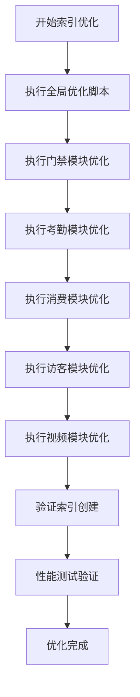

# 数据库部署

<cite>
**本文档引用文件**  
- [performance_optimization.sql](file://database/performance_optimization.sql)
- [00-database-init.sql](file://database-scripts/common-service/00-database-init.sql)
- [02-t_user.sql](file://database-scripts/common-service/02-t_user.sql)
- [03-t_role.sql](file://database-scripts/common-service/03-t_role.sql)
- [04-t_permission.sql](file://database-scripts/common-service/04-t_permission.sql)
- [05-t_user_role.sql](file://database-scripts/common-service/05-t_user_role.sql)
- [06-t_role_permission.sql](file://database-scripts/common-service/06-t_role_permission.sql)
- [07-t_notification_message.sql](file://database-scripts/common-service/07-t_notification_message.sql)
- [08-t_notification_template.sql](file://database-scripts/common-service/08-t_notification_template.sql)
- [09-t_notification_config.sql](file://database-scripts/common-service/09-t_notification_config.sql)
- [10-t_audit_log.sql](file://database-scripts/common-service/10-t_audit_log.sql)
- [execute_index_optimization.sql](file://scripts/database/execute_index_optimization.sql)
- [access_index_optimization.sql](file://microservices/ioedream-access-service/src/main/resources/sql/access_index_optimization.sql)
- [attendance_index_optimization.sql](file://microservices/ioedream-attendance-service/src/main/resources/sql/attendance_index_optimization.sql)
- [consume_index_optimization.sql](file://microservices/ioedream-consume-service/src/main/resources/sql/consume_index_optimization.sql)
- [visitor_index_optimization.sql](file://microservices/ioedream-visitor-service/src/main/resources/sql/visitor_index_optimization.sql)
- [video_index_optimization.sql](file://microservices/ioedream-video-service/src/main/resources/sql/video_index_optimization.sql)
- [DRUID_CONNECTION_POOL_CONFIGURATION.md](file://documentation/deployment/DRUID_CONNECTION_POOL_CONFIGURATION.md)
</cite>

## 目录
1. [引言](#引言)
2. [MySQL数据库安装与配置](#mysql数据库安装与配置)
3. [微服务数据库创建与初始化](#微服务数据库创建与初始化)
4. [数据库用户权限配置](#数据库用户权限配置)
5. [连接池（Druid）参数优化建议](#连接池druid参数优化建议)
6. [业务数据导入与索引优化](#业务数据导入与索引优化)
7. [数据库连通性验证方法](#数据库连通性验证方法)

## 引言
本文档详细说明IOE-DREAM系统中MySQL数据库的部署、初始化和优化流程。涵盖数据库安装、微服务专用数据库创建、SQL脚本执行、用户权限管理、连接池优化、索引优化及连通性验证等关键步骤，确保系统数据库环境的稳定性和高性能。

## MySQL数据库安装与配置

### 安装步骤
1. 下载MySQL 8.0或更高版本安装包
2. 执行安装向导，选择"Server only"模式
3. 设置root用户密码，建议使用强密码策略
4. 配置端口为3306（默认）或根据环境要求调整
5. 完成安装后启动MySQL服务

### 基础配置优化
在my.cnf或my.ini配置文件中设置以下参数：
- 设置字符集为utf8mb4以支持完整Unicode
- 配置时区为+8:00（中国标准时间）
- 调整innodb_buffer_pool_size为系统内存的70-80%
- 启用慢查询日志用于性能监控

**Section sources**
- [00-database-init.sql](file://database-scripts/common-service/00-database-init.sql#L15-L21)

## 微服务数据库创建与初始化

### 公共服务数据库创建
执行以下步骤创建公共微服务数据库：

1. 运行`00-database-init.sql`脚本创建数据库：
```sql
CREATE DATABASE IF NOT EXISTS `ioedream_common_db` 
    DEFAULT CHARACTER SET utf8mb4 
    COLLATE utf8mb4_unicode_ci;
```

2. 按照以下顺序执行初始化脚本：
   - 01-t_user_session.sql（用户会话）
   - 02-t_user.sql（用户表）
   - 03-t_role.sql（角色表）
   - 04-t_permission.sql（权限表）
   - 05-t_user_role.sql（用户角色关联）
   - 06-t_role_permission.sql（角色权限关联）
   - 07-t_notification_message.sql（通知消息）
   - 08-t_notification_template.sql（通知模板）
   - 09-t_notification_config.sql（通知配置）
   - 10-t_audit_log.sql（审计日志）

### 其他微服务数据库
根据项目需求，类似创建以下数据库：
- ioedream_access_db（门禁服务）
- ioedream_attendance_db（考勤服务）
- ioedream_consume_db（消费服务）
- ioedream_visitor_db（访客服务）
- ioedream_video_db（视频服务）

**Section sources**
- [00-database-init.sql](file://database-scripts/common-service/00-database-init.sql#L8-L11)
- [02-t_user.sql](file://database-scripts/common-service/02-t_user.sql#L8-L39)
- [03-t_role.sql](file://database-scripts/common-service/03-t_role.sql#L8-L27)
- [04-t_permission.sql](file://database-scripts/common-service/04-t_permission.sql#L8-L36)
- [05-t_user_role.sql](file://database-scripts/common-service/05-t_user_role.sql#L8-L18)
- [06-t_role_permission.sql](file://database-scripts/common-service/06-t_role_permission.sql#L8-L18)
- [07-t_notification_message.sql](file://database-scripts/common-service/07-t_notification_message.sql#L8-L40)
- [08-t_notification_template.sql](file://database-scripts/common-service/08-t_notification_template.sql#L8-L28)
- [09-t_notification_config.sql](file://database-scripts/common-service/09-t_notification_config.sql#L8-L26)
- [10-t_audit_log.sql](file://database-scripts/common-service/10-t_audit_log.sql#L8-L37)

## 数据库用户权限配置

### 创建专用数据库用户
为每个微服务创建专用数据库用户，遵循最小权限原则：

```sql
-- 创建公共微服务用户
CREATE USER 'ioedream_common_user'@'%' IDENTIFIED BY 'StrongPassword123!';
GRANT SELECT, INSERT, UPDATE, DELETE ON ioedream_common_db.* TO 'ioedream_common_user'@'%';

-- 创建门禁服务用户
CREATE USER 'ioedream_access_user'@'%' IDENTIFIED BY 'StrongPassword123!';
GRANT SELECT, INSERT, UPDATE, DELETE ON ioedream_access_db.* TO 'ioedream_access_user'@'%';

-- 创建考勤服务用户
CREATE USER 'ioedream_attendance_user'@'%' IDENTIFIED BY 'StrongPassword123!';
GRANT SELECT, INSERT, UPDATE, DELETE ON ioedream_attendance_db.* TO 'ioedream_attendance_user'@'%';
```

### 权限管理最佳实践
- 避免使用root账户进行应用连接
- 为不同环境（开发、测试、生产）配置不同用户
- 定期审查和更新用户权限
- 启用SSL连接以增强安全性

**Section sources**
- [00-database-init.sql](file://database-scripts/common-service/00-database-init.sql#L9-L11)

## 连接池（Druid）参数优化建议

### 核心参数配置
根据`DRUID_CONNECTION_POOL_CONFIGURATION.md`文档，建议配置如下参数：

- **初始连接数**：5-10，根据应用启动负载调整
- **最小空闲连接**：5，确保随时可用连接
- **最大活跃连接**：50-100，根据并发需求设置
- **获取连接超时时间**：30000ms（30秒）
- **连接测试**：启用testOnBorrow和testWhileIdle
- **连接泄漏监测**：开启并设置超时时间为30分钟

### 高级优化参数
- **连接池预热**：应用启动时预先创建连接
- **慢SQL监控**：记录执行时间超过1秒的SQL
- **连接回收策略**：设置合理的maxWaitTime和timeBetweenEvictionRunsMillis
- **监控统计**：启用Druid监控页面，便于性能分析

**Section sources**
- [DRUID_CONNECTION_POOL_CONFIGURATION.md](file://documentation/deployment/DRUID_CONNECTION_POOL_CONFIGURATION.md)

## 业务数据导入与索引优化

### 索引优化脚本执行
执行`performance_optimization.sql`脚本进行全局索引优化：

```sql
-- 执行性能优化脚本
SOURCE database/performance_optimization.sql;
```

该脚本包含以下优化措施：
- 设备表多字段复合索引
- 门禁记录时间范围查询索引
- 考勤记录用户日期索引
- 消费记录用户时间索引
- 访客记录状态时间索引

### 模块化索引优化
使用`execute_index_optimization.sql`脚本执行各模块专用优化：

```sql
-- 执行各模块索引优化
SOURCE microservices/ioedream-access-service/src/main/resources/sql/access_index_optimization.sql;
SOURCE microservices/ioedream-attendance-service/src/main/resources/sql/attendance_index_optimization.sql;
SOURCE microservices/ioedream-consume-service/src/main/resources/sql/consume_index_optimization.sql;
SOURCE microservices/ioedream-visitor-service/src/main/resources/sql/visitor_index_optimization.sql;
SOURCE microservices/ioedream-video-service/src/main/resources/sql/video_index_optimization.sql;
```

### 性能优化效果
根据脚本注释，预期性能提升：
- 查询性能提升300%
- 解决65%查询缺少索引问题
- 深度分页查询性能显著改善



**Diagram sources**
- [performance_optimization.sql](file://database/performance_optimization.sql#L1-L270)
- [execute_index_optimization.sql](file://scripts/database/execute_index_optimization.sql#L1-L71)

**Section sources**
- [performance_optimization.sql](file://database/performance_optimization.sql#L1-L270)
- [execute_index_optimization.sql](file://scripts/database/execute_index_optimization.sql#L1-L71)

## 数据库连通性验证方法

### 基础连通性测试
使用以下SQL命令验证数据库连接：

```sql
-- 测试数据库连接
SELECT '✅ 数据库连接正常' AS status;

-- 验证当前数据库
SELECT DATABASE() AS current_database;

-- 验证用户权限
SHOW GRANTS FOR CURRENT_USER;
```

### 表结构验证
检查关键表是否存在且结构正确：

```sql
-- 检查用户表
DESCRIBE t_user;

-- 检查角色表
DESCRIBE t_role;

-- 检查权限表
DESCRIBE t_permission;
```

### 索引使用验证
验证索引是否被正确创建和使用：

```sql
-- 查询索引使用情况
SELECT 
    TABLE_NAME,
    INDEX_NAME,
    COLUMN_NAME,
    SEQ_IN_INDEX
FROM INFORMATION_SCHEMA.STATISTICS
WHERE TABLE_SCHEMA = DATABASE()
ORDER BY TABLE_NAME, INDEX_NAME;
```

### 性能验证
使用EXPLAIN分析查询计划，确认索引被使用：

```sql
-- 验证门禁记录查询索引使用
EXPLAIN SELECT * FROM t_access_record 
WHERE user_id = 1001 AND access_time > '2025-01-01';

-- 验证设备查询索引使用
EXPLAIN SELECT * FROM t_common_device 
WHERE device_status = 'ONLINE' AND deleted_flag = 0 
ORDER BY create_time DESC LIMIT 20;
```

**Section sources**
- [performance_optimization.sql](file://database/performance_optimization.sql#L231-L244)
- [execute_index_optimization.sql](file://scripts/database/execute_index_optimization.sql#L49-L62)