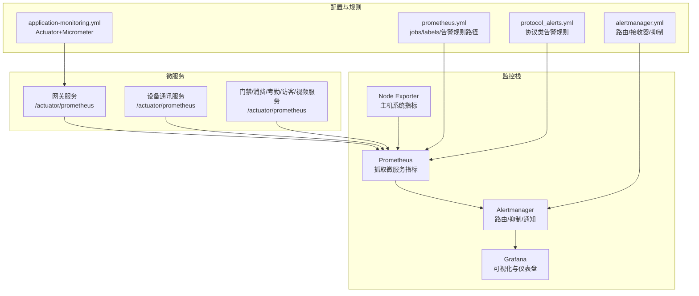
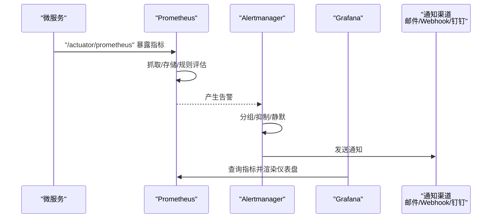
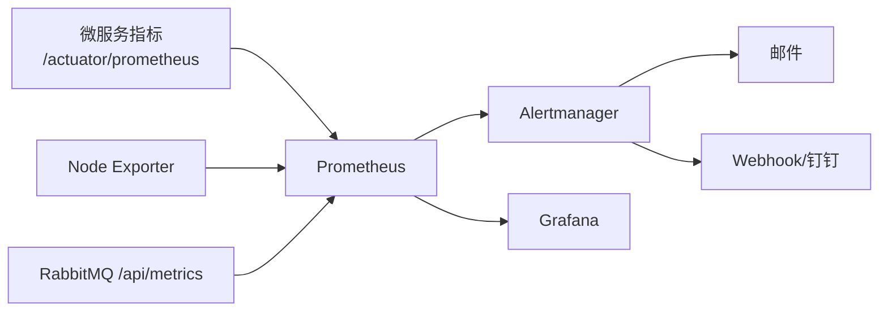
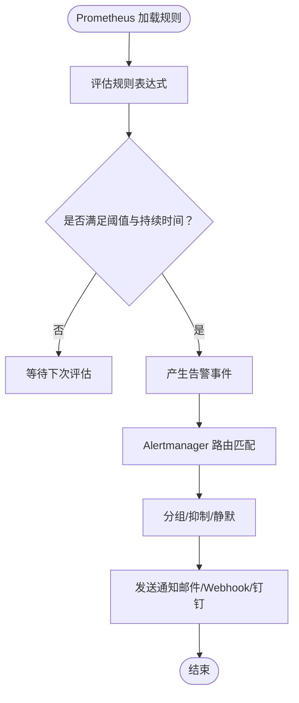

# 监控与告警

<cite>
**本文引用的文件**
- [docker-compose-monitoring.yml](file://deployment/monitoring/docker-compose-monitoring.yml)
- [prometheus.yml](file://deployment/monitoring/prometheus/prometheus.yml)
- [alertmanager.yml](file://deployment/monitoring/alertmanager/alertmanager.yml)
- [protocol_alerts.yml](file://deployment/monitoring/prometheus/rules/protocol_alerts.yml)
- [application-monitoring.yml](file://microservices/ioedream-gateway-service/src/main/resources/application-monitoring.yml)
- [门禁服务监控告警机制.md](file://documentation/04-部署运维/门禁服务监控告警机制.md)
- [AlertController.java](file://restful_refactor_backup_20251202_014224/microservices_ioedream-monitor-service_src_main_java_net_lab1024_sa_monitor_controller_AlertController.java)
- [AlertAggregationService.java](file://documentation/04-部署运维/门禁服务监控告警机制.md)
- [MetricsCollectorManager.java](file://microservices/microservices-common/src/main/java/net/lab1024/sa/common/monitor/manager/MetricsCollectorManager.java)
- [MonitorServiceImpl.java](file://microservices/microservices-common/src/main/java/net/lab1024/sa/common/monitor/service/impl/MonitorServiceImpl.java)
- [NotificationManager.java](file://microservices/microservices-common/src/main/java/net/lab1024/sa/common/monitor/manager/NotificationManager.java)
- [NotificationManagerImpl.java](file://microservices/ioedream-common-service/src/main/java/net/lab1024/sa/common/monitor/manager/NotificationManagerImpl.java)
- [AlertEntity.java](file://microservices/microservices-common/src/main/java/net/lab1024/sa/common/monitor/domain/entity/AlertEntity.java)
- [AlertRule_add_form.md](file://database-scripts/common-service/12-t_alert_rule.sql)
</cite>

## 目录
1. [简介](#简介)
2. [项目结构](#项目结构)
3. [核心组件](#核心组件)
4. [架构总览](#架构总览)
5. [详细组件分析](#详细组件分析)
6. [依赖关系分析](#依赖关系分析)
7. [性能考量](#性能考量)
8. [故障排查指南](#故障排查指南)
9. [结论](#结论)
10. [附录](#附录)

## 简介
本文件面向运维与开发团队，提供一套可落地的监控与告警系统部署与使用指南。内容覆盖：
- Prometheus 与 Alertmanager 的安装与配置
- prometheus.yml 中各 job 如何抓取微服务指标（JVM、HTTP 请求等）
- 告警规则（protocol_alerts.yml）的定义与触发条件
- Grafana 的部署与仪表盘导入
- 告警通知渠道（邮件、Webhook、钉钉等）配置与测试
- 告警聚合与抑制策略，以及验证方法

## 项目结构
监控与告警相关的核心文件集中在 deployment/monitoring 与微服务侧的 application-monitoring.yml 中，并配套有门禁服务的监控告警机制文档与后端告警规则管理能力。

图表来源
- [docker-compose-monitoring.yml](file://deployment/monitoring/docker-compose-monitoring.yml#L1-L109)
- [prometheus.yml](file://deployment/monitoring/prometheus/prometheus.yml#L1-L99)
- [alertmanager.yml](file://deployment/monitoring/alertmanager/alertmanager.yml#L1-L127)
- [protocol_alerts.yml](file://deployment/monitoring/prometheus/rules/protocol_alerts.yml#L1-L141)
- [application-monitoring.yml](file://microservices/ioedream-gateway-service/src/main/resources/application-monitoring.yml#L1-L306)

章节来源
- [docker-compose-monitoring.yml](file://deployment/monitoring/docker-compose-monitoring.yml#L1-L109)
- [prometheus.yml](file://deployment/monitoring/prometheus/prometheus.yml#L1-L99)
- [alertmanager.yml](file://deployment/monitoring/alertmanager/alertmanager.yml#L1-L127)
- [protocol_alerts.yml](file://deployment/monitoring/prometheus/rules/protocol_alerts.yml#L1-L141)
- [application-monitoring.yml](file://microservices/ioedream-gateway-service/src/main/resources/application-monitoring.yml#L1-L306)

## 核心组件
- Prometheus：负责拉取各微服务暴露的指标端点，存储时序数据，并执行规则匹配与告警产生。
- Alertmanager：负责对告警进行去重、分组、抑制、静默与通知路由，支持邮件、Webhook、钉钉等渠道。
- Grafana：作为可视化界面，连接 Prometheus 数据源，导入仪表盘以展示 JVM、HTTP 请求、业务指标等。
- Node Exporter：采集主机系统指标（CPU、内存、磁盘、网络等），便于整体系统健康观测。
- 微服务应用配置：通过 Actuator + Micrometer 暴露 Prometheus 可抓取指标，同时可配置本地告警规则与 Grafana 仪表盘。

章节来源
- [docker-compose-monitoring.yml](file://deployment/monitoring/docker-compose-monitoring.yml#L1-L109)
- [prometheus.yml](file://deployment/monitoring/prometheus/prometheus.yml#L1-L99)
- [alertmanager.yml](file://deployment/monitoring/alertmanager/alertmanager.yml#L1-L127)
- [application-monitoring.yml](file://microservices/ioedream-gateway-service/src/main/resources/application-monitoring.yml#L1-L306)

## 架构总览
下图展示了监控链路：微服务暴露指标 → Prometheus 抓取 → 规则评估 → 告警 → Alertmanager 路由与通知 → Grafana 可视化。

图表来源
- [prometheus.yml](file://deployment/monitoring/prometheus/prometheus.yml#L1-L99)
- [alertmanager.yml](file://deployment/monitoring/alertmanager/alertmanager.yml#L1-L127)
- [application-monitoring.yml](file://microservices/ioedream-gateway-service/src/main/resources/application-monitoring.yml#L1-L306)

## 详细组件分析

### Prometheus 配置与抓取作业（prometheus.yml）
- 全局配置：抓取间隔、规则评估间隔、外部标签（cluster、environment）。
- 告警路由：指向 Alertmanager 地址与端口。
- 规则文件：加载 /etc/prometheus/rules 下的所有 yml 文件。
- 抓取作业（jobs）：
  - 设备通讯服务、网关服务、消费服务、门禁服务、考勤服务、访客服务、视频服务：均通过 /actuator/prometheus 暴露指标，目标为对应服务容器的 8080 端口。
  - RabbitMQ：通过 /api/metrics 抓取，目标为 rabbitmq:15692。
  - Node Exporter：抓取主机系统指标，目标为 node-exporter:9100。
- 标签：每个 job 会附加 service 与 application 标签，便于后续筛选与告警路由。

章节来源
- [prometheus.yml](file://deployment/monitoring/prometheus/prometheus.yml#L1-L99)

### 告警规则（protocol_alerts.yml）
该规则文件聚焦“协议服务”相关告警，包含以下类别与触发条件（基于表达式与持续时间）：
- 协议消息处理失败率高/严重：基于计数器指标计算失败率，超过阈值后按持续时间触发。
- 协议消息处理延迟高/严重：基于直方图 P99 计算延迟阈值，超过阈值后按持续时间触发。
- 消息队列积压高/严重：基于队列消息数阈值触发。
- 服务熔断器打开：基于熔断器状态指标触发。
- 限流频繁触发：基于限流错误计数器触发。
- 缓存命中率低：基于命中/请求比值触发。

规则还包含：
- labels：severity、service、alert_type，用于路由与分类。
- annotations：summary、description、runbook_url，便于通知与排障指引。
- for：定义告警持续时间，避免瞬时抖动误报。

章节来源
- [protocol_alerts.yml](file://deployment/monitoring/prometheus/rules/protocol_alerts.yml#L1-L141)

### Alertmanager 配置与通知路由
- 全局：超时、SMTP 配置（邮件）、TLS 要求。
- 路由：
  - 默认接收器：邮件。
  - 严重告警（critical）：单独路由至“严重接收器”，包含邮件与 Webhook（钉钉）。
  - 协议服务（device-comm-service）：单独路由至“协议接收器”，包含邮件与 Webhook。
  - 系统告警（alert_type: system）：单独路由至“系统接收器”，邮件。
- 抑制规则：当出现严重告警时，抑制同一 alertname 与 service 的警告告警，减少噪声。
- 接收器：每类接收器包含邮件与 Webhook 配置，支持 HTML 模板与自定义主题。

章节来源
- [alertmanager.yml](file://deployment/monitoring/alertmanager/alertmanager.yml#L1-L127)

### 微服务指标暴露与本地告警（application-monitoring.yml）
- Actuator：暴露 /actuator/* 端点，启用 prometheus 端点。
- Micrometer：导出 Prometheus 指标，设置采集步长、百分位与 SLA 边界，打上全局标签（应用、环境、实例、区域）。
- 自定义业务指标：门禁、考勤、消费、访客等关键指标，支持 counter/gauge/timer。
- 本地告警规则：CPU、内存、GC、成功率、失败率、慢查询、数据库连接池、Redis 连接等。
- Grafana 仪表盘：系统与业务两类仪表盘，包含 CPU、内存、GC、业务指标与 API 响应时间分布等。
- 日志结构化：控制台 JSON 模式，便于日志聚合与检索。
- 链路追踪：可选 Zipkin 集成（生产环境按需开启）。

章节来源
- [application-monitoring.yml](file://microservices/ioedream-gateway-service/src/main/resources/application-monitoring.yml#L1-L306)

### Grafana 部署与仪表盘导入
- Docker Compose：映射 3000 端口，挂载 dashboards 与 datasources 目录，预置管理员密码。
- 数据源：Prometheus 数据源自动挂载。
- 仪表盘：通过 provisioning 导入，包含系统与业务两类仪表盘；也可手动导入官方 ID（如 JVM Micrometer、Spring Boot）。

章节来源
- [docker-compose-monitoring.yml](file://deployment/monitoring/docker-compose-monitoring.yml#L54-L79)

### 告警聚合与抑制（后端聚合）
- 告警聚合：对相似告警进行聚合，避免告警风暴；当数量阈值或时间阈值满足时，合并发送一次聚合告警。
- 抑制策略：严重告警触发时，抑制同服务的警告告警，降低噪音。

章节来源
- [AlertAggregationService.java](file://documentation/04-部署运维/门禁服务监控告警机制.md#L619-L713)

### 后端告警规则管理与通知渠道
- 规则管理：提供告警规则增删改查接口，支持参数校验、默认值设置、状态与优先级管理。
- 通知渠道：支持邮件、短信、Webhook、微信等渠道枚举与查询。
- 通知落库：通知创建与状态更新，便于审计与重试。

章节来源
- [AlertController.java](file://restful_refactor_backup_20251202_014224/microservices_ioedream-monitor-service_src_main_java_net_lab1024_sa_monitor_controller_AlertController.java#L29-L62)
- [NotificationManager.java](file://microservices/microservices-common/src/main/java/net/lab1024/sa/common/monitor/manager/NotificationManager.java#L137-L291)
- [NotificationManagerImpl.java](file://microservices/ioedream-common-service/src/main/java/net/lab1024/sa/common/monitor/manager/NotificationManagerImpl.java#L46-L68)
- [AlertRule_add_form.md](file://database-scripts/common-service/12-t_alert_rule.sql#L1-L23)

## 依赖关系分析
- Prometheus 依赖：
  - 微服务 Actuator + Micrometer 指标端点
  - Node Exporter 主机指标
  - RabbitMQ /api/metrics
- Alertmanager 依赖：
  - Prometheus 告警推送
  - SMTP/Webhook/钉钉等外部通知通道
- Grafana 依赖：
  - Prometheus 数据源
  - 预置/导入仪表盘

图表来源
- [prometheus.yml](file://deployment/monitoring/prometheus/prometheus.yml#L1-L99)
- [alertmanager.yml](file://deployment/monitoring/alertmanager/alertmanager.yml#L1-L127)
- [docker-compose-monitoring.yml](file://deployment/monitoring/docker-compose-monitoring.yml#L1-L109)

## 性能考量
- 抓取与评估间隔：全局 scrape_interval 与 evaluation_interval 建议与业务规模匹配，避免过密导致资源压力。
- 规则复杂度：复杂表达式与高基数标签会增加 TSDB 压力，建议使用稳定标签与合理分桶。
- 存储保留：Prometheus TSDB 保留策略建议结合磁盘容量与合规要求设定。
- Grafana 查询：避免一次性查询过多 series 或过长时间窗口，必要时使用 PromQL 优化与仪表盘缓存。
- 通知队列：Alertmanager 队列容量与重复间隔需结合告警量与通知通道吞吐调整。

[本节为通用建议，无需列出具体文件来源]

## 故障排查指南
- Prometheus 健康检查
  - 访问 http://localhost:9090/-/healthy 验证健康状态。
  - 检查抓取目标可达性与端口映射。
- Alertmanager 健康检查
  - 访问 http://localhost:9093/-/healthy 验证健康状态。
  - 检查 SMTP/Webhook 配置与网络连通性。
- Grafana 健康检查
  - 访问 http://localhost:3000/api/health 验证健康状态。
  - 确认数据源连接与仪表盘导入。
- 告警验证
  - 在 Prometheus 中执行规则表达式，确认告警是否能触发。
  - 在 Alertmanager 中查看告警分组与抑制效果。
- 通知验证
  - 使用 Webhook/钉钉测试发送，检查模板与字段。
  - 对比后端通知管理器的状态更新与重试逻辑。

章节来源
- [docker-compose-monitoring.yml](file://deployment/monitoring/docker-compose-monitoring.yml#L23-L52)
- [门禁服务监控告警机制.md](file://documentation/04-部署运维/门禁服务监控告警机制.md#L720-L881)

## 结论
本监控与告警体系以 Prometheus 为核心，结合 Alertmanager 的路由与抑制能力，配合 Grafana 的可视化，形成从指标采集、规则评估、告警通知到可视化的完整闭环。通过微服务侧的 Actuator + Micrometer 指标暴露与本地告警规则，既保证了系统可观测性，也提供了灵活的通知与治理能力。建议在生产环境中进一步完善存储策略、查询优化与通知通道的稳定性，并持续迭代仪表盘与规则集。

[本节为总结性内容，无需列出具体文件来源]

## 附录

### 部署步骤（概要）
- 启动监控栈
  - 使用 docker-compose 启动 prometheus、alertmanager、grafana、node-exporter。
  - 确认端口映射与网络连通。
- 配置 Prometheus
  - 挂载 prometheus.yml 与 rules 目录，确保抓取作业与规则路径正确。
- 配置 Alertmanager
  - 修改 SMTP/钉钉 Webhook 等通知配置，按需调整路由与抑制规则。
- 配置微服务
  - 确保 Actuator 与 Micrometer 已启用，暴露 /actuator/prometheus。
  - 按需启用本地告警规则与 Grafana 仪表盘。
- 验证
  - 访问 Prometheus/Grafana/Alertmanager 健康端点，执行规则验证与通知测试。

章节来源
- [docker-compose-monitoring.yml](file://deployment/monitoring/docker-compose-monitoring.yml#L1-L109)
- [prometheus.yml](file://deployment/monitoring/prometheus/prometheus.yml#L1-L99)
- [alertmanager.yml](file://deployment/monitoring/alertmanager/alertmanager.yml#L1-L127)
- [application-monitoring.yml](file://microservices/ioedream-gateway-service/src/main/resources/application-monitoring.yml#L1-L306)

### 关键流程图：告警规则触发与通知

图表来源
- [protocol_alerts.yml](file://deployment/monitoring/prometheus/rules/protocol_alerts.yml#L1-L141)
- [alertmanager.yml](file://deployment/monitoring/alertmanager/alertmanager.yml#L1-L127)