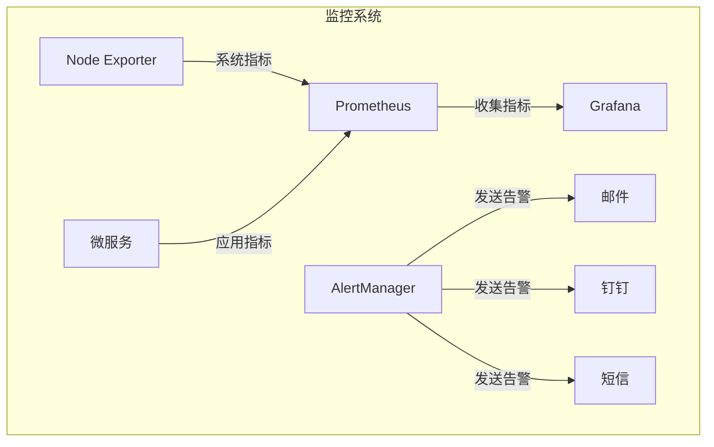

# 部署与运维

<cite>
**本文档引用的文件**   
- [REAL_ENV_SETUP.md](file://documentation/04-部署运维/REAL_ENV_SETUP.md)
- [DEVICE_MANAGEMENT_DEPLOYMENT.md](file://documentation/04-部署运维/DEVICE_MANAGEMENT_DEPLOYMENT.md)
- [门禁服务监控告警机制.md](file://documentation/04-部署运维/门禁服务监控告警机制.md)
- [docker-compose-monitoring.yml](file://deployment/monitoring/docker-compose-monitoring.yml)
- [prometheus.yml](file://deployment/monitoring/prometheus/prometheus.yml)
- [alertmanager.yml](file://deployment/monitoring/alertmanager/alertmanager.yml)
- [deploy-monitoring.ps1](file://scripts/deploy-monitoring.ps1)
- [start-all-services.ps1](file://scripts/start-all-services.ps1)
- [00-database-init.sql](file://database-scripts/common-service/00-database-init.sql)
- [12-t_alert_rule.sql](file://database-scripts/common-service/12-t_alert_rule.sql)
- [README_BUILD.md](file://scripts/README_BUILD.md)
- [docker-compose-services.yml](file://docker-compose-services.yml)
</cite>

## 目录

1. [环境准备](#环境准备)
2. [后端微服务部署](#后端微服务部署)
3. [前端应用部署](#前端应用部署)
4. [数据库部署与初始化](#数据库部署与初始化)
5. [监控系统部署](#监控系统部署)
6. [运维操作指南](#运维操作指南)
7. [故障排查](#故障排查)

## 环境准备

### 操作系统要求
本系统支持以下操作系统环境：
- **Windows**: Windows 10/11 专业版，PowerShell 5.1+
- **Linux**: CentOS 7+ 或 Ubuntu 18+

### 基础软件安装
部署前需确保以下基础软件已正确安装并配置：

**Java环境**
- JDK 17+ (推荐使用Temurin OpenJDK)
- 设置 `JAVA_HOME` 环境变量

**构建工具**
- Maven 3.9+，建议配置公司仓库镜像以提高下载速度
- Node.js 18 LTS 版本
- npm 9+

**数据库与缓存**
- MySQL 8.0+ 数据库服务
- Redis 7.0+ 缓存服务
- Nacos 2.3.0 服务注册与配置中心

**其他工具**
- Git 2.40+
- 7-Zip 压缩工具
- Visual C++ 运行库
- Docker Desktop (用于监控系统部署)

**目录结构约定**
建议在部署服务器上创建统一的项目目录结构：
```
D:\IOE-DREAM\
  ├── microservices\           # 微服务代码
  ├── smart-admin-web-javascript\  # 前端代码
  ├── database-scripts\        # 数据库脚本
  ├── deployment\              # 部署配置
  ├── scripts\                 # 脚本文件
  └── docs\                    # 文档
```

**网络与端口规划**
确保以下端口未被占用并可正常访问：
- 80/443: Nginx Web服务器
- 1024: 后端应用服务
- 3306: MySQL数据库
- 6379: Redis缓存
- 8848: Nacos服务
- 9090: Prometheus监控
- 9093: AlertManager告警
- 3000: Grafana可视化

**Section sources**
- [REAL_ENV_SETUP.md](file://documentation/04-部署运维/REAL_ENV_SETUP.md#L1-L144)
- [DEVICE_MANAGEMENT_DEPLOYMENT.md](file://documentation/04-部署运维/DEVICE_MANAGEMENT_DEPLOYMENT.md#L1-L556)

## 后端微服务部署

### 打包流程
后端微服务采用Maven进行构建和打包，遵循严格的构建顺序。

**构建前检查**
在构建前，建议运行预构建检查脚本：
```powershell
.\scripts\pre-build-check.ps1
```

**统一构建脚本**
使用统一构建脚本确保正确的构建顺序：
```powershell
# 构建所有服务
.\scripts\build-all.ps1

# 构建指定服务（自动先构建common）
.\scripts\build-all.ps1 -Service ioedream-access-service

# 清理并构建
.\scripts\build-all.ps1 -Clean

# 跳过测试构建
.\scripts\build-all.ps1 -SkipTests
```

**构建顺序说明**
微服务构建必须遵循以下顺序：
1. `microservices-common`: 公共模块，所有服务依赖
2. 基础服务: `ioedream-gateway-service`, `ioedream-config-service`
3. 业务服务: `ioedream-access-service`, `ioedream-attendance-service`等

**Section sources**
- [README_BUILD.md](file://scripts/README_BUILD.md#L1-L98)
- [start-all-services.ps1](file://scripts/start-all-services.ps1#L1-L99)

### 配置文件管理
后端服务的配置文件采用Nacos进行集中管理。

**关键配置项**
- **数据库配置**: 包括JDBC连接URL、用户名、密码
- **Redis配置**: 主机地址、端口、密码、数据库编号
- **Nacos配置**: 服务注册地址、命名空间
- **文件上传**: 上传路径、域名配置

**配置文件示例**
```yaml
# 数据库配置
spring:
  datasource:
    druid:
      url: jdbc:mysql://192.168.10.110:33060/smart_admin_v3?useUnicode=true&characterEncoding=UTF-8&serverTimezone=Asia/Shanghai
      username: root
      password: your-password

  # Redis配置
  data:
    redis:
      host: 127.0.0.1
      port: 6389
      password: zkteco3100
      database: 1
```

### 服务启动
使用启动脚本按依赖顺序启动所有微服务。

**启动脚本功能**
- 按照服务依赖关系分批次启动
- 在新窗口中启动每个服务，便于监控日志
- 提供服务状态检查功能

**启动命令**
```powershell
# 启动所有服务
.\scripts\start-all-services.ps1

# 检查服务状态
.\scripts\start-all-services.ps1 -CheckOnly
```

**服务端口映射**
| 服务名称 | 端口 | 服务类型 |
|---------|------|---------|
| ioedream-gateway-service | 8080 | API网关 |
| ioedream-common-service | 8088 | 公共模块 |
| ioedream-device-comm-service | 8087 | 设备通讯 |
| ioedream-access-service | 8090 | 门禁服务 |
| ioedream-attendance-service | 8091 | 考勤服务 |
| ioedream-video-service | 8092 | 视频服务 |
| ioedream-consume-service | 8094 | 消费服务 |
| ioedream-visitor-service | 8095 | 访客服务 |

**Section sources**
- [start-all-services.ps1](file://scripts/start-all-services.ps1#L1-L99)
- [DEVICE_MANAGEMENT_DEPLOYMENT.md](file://documentation/04-部署运维/DEVICE_MANAGEMENT_DEPLOYMENT.md#L149-L215)

## 前端应用部署

### 构建流程
前端应用使用Vite进行构建，基于Vue 3框架。

**依赖安装**
```bash
# 进入前端项目目录
cd smart-admin-web-javascript

# 安装依赖（使用国内镜像）
npm install --registry=https://registry.npmmirror.com
```

**环境配置**
前端应用支持多环境配置，通过`.env`文件区分：
- `.env.development`: 开发环境
- `.env.production`: 生产环境
- `.env.test`: 测试环境

**关键环境变量**
```env
# API基础地址
VITE_API_BASE_URL=http://your-domain.com:1024

# 应用标题
VITE_APP_TITLE=SmartAdmin 统一管理平台

# 是否开启Mock数据
VITE_USE_MOCK=false
```

**生产构建**
```bash
# 构建生产版本
npm run build:prod

# 构建完成后，dist目录包含所有静态文件
ls -la dist/
```

### Nginx部署
使用Nginx作为前端静态文件服务器和反向代理。

**Nginx配置文件**
创建 `/etc/nginx/conf.d/smart-admin.conf` 配置文件：

```nginx
server {
    listen 80;
    server_name your-domain.com;

    # 前端静态文件
    location / {
        root /data/smart-admin/web;
        index index.html;
        try_files $uri $uri/ /index.html;

        # 静态资源缓存
        location ~* \.(js|css|png|jpg|jpeg|gif|ico|svg)$ {
            expires 1y;
            add_header Cache-Control "public, immutable";
        }
    }

    # API代理
    location /api/ {
        proxy_pass http://localhost:1024;
        proxy_set_header Host $host;
        proxy_set_header X-Real-IP $remote_addr;
        proxy_set_header X-Forwarded-For $proxy_add_x_forwarded_for;
        proxy_set_header X-Forwarded-Proto $scheme;

        # WebSocket支持
        proxy_http_version 1.1;
        proxy_set_header Upgrade $http_upgrade;
        proxy_set_header Connection "upgrade";
    }

    # 文件上传
    location /uploads/ {
        alias /data/smart-admin/uploads/;
        expires 30d;
    }
}
```

**部署步骤**
```bash
# 创建Web目录
mkdir -p /data/smart-admin/web

# 复制构建文件
cp -r dist/* /data/smart-admin/web/

# 设置权限
chown -R nginx:nginx /data/smart-admin/web
chmod -R 755 /data/smart-admin/web

# 重启Nginx
systemctl restart nginx
systemctl enable nginx
```

**Section sources**
- [DEVICE_MANAGEMENT_DEPLOYMENT.md](file://documentation/04-部署运维/DEVICE_MANAGEMENT_DEPLOYMENT.md#L230-L318)

## 数据库部署与初始化

### 数据库初始化
按照指定顺序执行数据库脚本完成初始化。

**创建数据库**
```sql
CREATE DATABASE smart_admin_v3 
    CHARACTER SET utf8mb4 
    COLLATE utf8mb4_unicode_ci;
```

**执行脚本顺序**
1. `00-database-init.sql`: 数据库初始化
2. `01-t_user_session.sql`: 用户会话表
3. `02-t_user.sql`: 用户表
4. `03-t_role.sql`: 角色表
5. `04-t_permission.sql`: 权限表
6. `05-t_user_role.sql`: 用户角色关联表
7. `06-t_role_permission.sql`: 角色权限关联表
8. `07-t_notification_message.sql`: 通知消息表
9. `08-t_notification_template.sql`: 通知模板表
10. `09-t_notification_config.sql`: 通知配置表
11. `10-t_audit_log.sql`: 审计日志表
12. `11-t_alert.sql`: 告警记录表
13. `12-t_alert_rule.sql`: 告警规则表
14. `13-t_system_monitor.sql`: 系统监控表
15. `14-t_scheduled_job.sql`: 定时任务表
16. `15-t_job_execution_log.sql`: 任务执行日志表
17. `16-t_system_config.sql`: 系统配置表
18. `17-t_system_dict.sql`: 系统字典表
19. `18-t_employee.sql`: 员工表

**执行命令**
```bash
# 导入基础数据库结构
mysql -h192.168.10.110 -P33060 -uroot -p smart_admin_v3 < smart_admin_v3.sql

# 导入设备管理模块表结构
mysql -h192.168.10.110 -P33060 -uroot -p smart_admin_v3 < ../../smart_device_tables.sql
```

### 告警规则表结构
`t_alert_rule` 表用于存储监控告警规则配置。

**表结构说明**
```sql
CREATE TABLE `t_alert_rule` (
    `rule_id` BIGINT NOT NULL AUTO_INCREMENT COMMENT '规则ID',
    `rule_name` VARCHAR(100) NOT NULL COMMENT '规则名称',
    `rule_description` VARCHAR(500) COMMENT '规则描述',
    `metric_name` VARCHAR(100) NOT NULL COMMENT '监控指标',
    `monitor_type` VARCHAR(50) COMMENT '监控类型',
    `condition_operator` VARCHAR(20) NOT NULL COMMENT '告警条件：GT/GTE/LT/LTE/EQ/NEQ',
    `threshold_value` DOUBLE NOT NULL COMMENT '告警阈值',
    `alert_level` VARCHAR(20) NOT NULL COMMENT '告警级别：INFO/WARNING/ERROR/CRITICAL',
    `applicable_services` VARCHAR(500) COMMENT '适用服务（逗号分隔）',
    `applicable_environments` VARCHAR(200) COMMENT '适用环境（逗号分隔）',
    `status` VARCHAR(20) NOT NULL DEFAULT 'ENABLED' COMMENT '规则状态：ENABLED/DISABLED',
    `duration_minutes` INT COMMENT '持续时间（分钟）',
    `notification_channels` VARCHAR(200) COMMENT '通知方式（逗号分隔）',
    `notification_users` VARCHAR(500) COMMENT '通知人员（逗号分隔）',
    `notification_interval` INT COMMENT '通知频率（分钟）',
    `suppression_duration` INT COMMENT '抑制时间（分钟）',
    `rule_expression` TEXT COMMENT '规则表达式',
    `priority` INT NOT NULL DEFAULT 0 COMMENT '规则优先级',
    `tags` VARCHAR(500) COMMENT '标签',
    `create_time` DATETIME NOT NULL DEFAULT CURRENT_TIMESTAMP COMMENT '创建时间',
    `update_time` DATETIME NOT NULL DEFAULT CURRENT_TIMESTAMP ON UPDATE CURRENT_TIMESTAMP COMMENT '更新时间',
    `create_user_id` BIGINT COMMENT '创建人ID',
    `update_user_id` BIGINT COMMENT '更新人ID',
    `deleted_flag` TINYINT NOT NULL DEFAULT 0 COMMENT '删除标记：0-未删除 1-已删除',
    PRIMARY KEY (`rule_id`),
    KEY `idx_metric_name` (`metric_name`),
    KEY `idx_status` (`status`),
    KEY `idx_alert_level` (`alert_level`),
    KEY `idx_deleted_flag` (`deleted_flag`)
) ENGINE=InnoDB DEFAULT CHARSET=utf8mb4 COLLATE=utf8mb4_unicode_ci COMMENT='告警规则表';
```

**Section sources**
- [00-database-init.sql](file://database-scripts/common-service/00-database-init.sql#L1-L51)
- [12-t_alert_rule.sql](file://database-scripts/common-service/12-t_alert_rule.sql#L1-L40)

## 监控系统部署

### Prometheus配置
Prometheus用于收集和存储监控指标数据。

**核心配置**
```yaml
global:
  scrape_interval: 15s
  evaluation_interval: 15s
  external_labels:
    cluster: 'ioedream'
    environment: 'production'

# Alertmanager配置
alerting:
  alertmanagers:
    - static_configs:
        - targets:
          - alertmanager:9093

# 告警规则文件
rule_files:
  - "/etc/prometheus/rules/*.yml"

# 服务发现配置
scrape_configs:
  # 设备通讯服务
  - job_name: 'device-comm-service'
    metrics_path: '/actuator/prometheus'
    static_configs:
      - targets: ['device-comm-service:8080']
        labels:
          service: 'device-comm-service'
          application: 'ioedream-device-comm-service'

  # 网关服务
  - job_name: 'gateway-service'
    metrics_path: '/actuator/prometheus'
    static_configs:
      - targets: ['gateway-service:8080']
        labels:
          service: 'gateway-service'
          application: 'ioedream-gateway-service'

  # Node Exporter（系统监控）
  - job_name: 'node-exporter'
    static_configs:
      - targets: ['node-exporter:9100']
        labels:
          service: 'node-exporter'
```

### Alertmanager配置
Alertmanager负责处理和分发告警通知。

**路由配置**
```yaml
route:
  group_by: ['alertname', 'cluster', 'service']
  group_wait: 10s
  group_interval: 10s
  repeat_interval: 12h
  receiver: 'default-receiver'
  routes:
    # 严重告警立即通知
    - match:
        severity: critical
      receiver: 'critical-receiver'
      continue: true
    # 协议相关告警
    - match:
        service: device-comm-service
      receiver: 'protocol-receiver'
      continue: true
    # 系统告警
    - match:
        alert_type: system
      receiver: 'system-receiver'
      continue: true
```

**接收器配置**
```yaml
receivers:
  # 默认接收器（邮件）
  - name: 'default-receiver'
    email_configs:
      - to: 'devops@ioedream.com'
        headers:
          Subject: '{{ .GroupLabels.alertname }} - {{ .GroupLabels.service }}'
        html: |
          <h2>告警通知</h2>
          <p><strong>告警名称:</strong> {{ .GroupLabels.alertname }}</p>
          <p><strong>服务:</strong> {{ .GroupLabels.service }}</p>
          <p><strong>严重程度:</strong> {{ .GroupLabels.severity }}</p>

  # 严重告警接收器（邮件 + 钉钉）
  - name: 'critical-receiver'
    email_configs:
      - to: 'devops@ioedream.com,oncall@ioedream.com'
        headers:
          Subject: '[CRITICAL] {{ .GroupLabels.alertname }}'
    # 钉钉通知
    webhook_configs:
      - url: 'https://oapi.dingtalk.com/robot/send?access_token=your-dingtalk-token'
        send_resolved: true
```

### Docker Compose部署
使用Docker Compose一键部署监控系统。

**docker-compose-monitoring.yml**
```yaml
version: '3.8'

services:
  # Prometheus监控
  prometheus:
    image: prom/prometheus:latest
    container_name: prometheus
    ports:
      - "9090:9090"
    volumes:
      - ./monitoring/prometheus/prometheus.yml:/etc/prometheus/prometheus.yml
      - ./monitoring/prometheus/rules:/etc/prometheus/rules
      - prometheus_data:/prometheus
    networks:
      - ioedream-network
    restart: unless-stopped

  # AlertManager告警管理
  alertmanager:
    image: prom/alertmanager:latest
    container_name: alertmanager
    ports:
      - "9093:9093"
    volumes:
      - ./monitoring/alertmanager/alertmanager.yml:/etc/alertmanager/alertmanager.yml
      - alertmanager_data:/alertmanager
    networks:
      - ioedream-network
    restart: unless-stopped

  # Grafana可视化
  grafana:
    image: grafana/grafana:latest
    container_name: grafana
    ports:
      - "3000:3000"
    environment:
      - GF_SECURITY_ADMIN_PASSWORD=admin123
    volumes:
      - grafana_data:/var/lib/grafana
      - ./monitoring/grafana/dashboards:/etc/grafana/provisioning/dashboards
      - ./monitoring/grafana/datasources:/etc/grafana/provisioning/datasources
    networks:
      - ioedream-network
    restart: unless-stopped
    depends_on:
      - prometheus

  # Node Exporter系统监控
  node-exporter:
    image: prom/node-exporter:latest
    container_name: node-exporter
    ports:
      - "9100:9100"
    volumes:
      - /proc:/host/proc:ro
      - /sys:/host/sys:ro
      - /:/rootfs:ro
    networks:
      - ioedream-network
    restart: unless-stopped

volumes:
  prometheus_data:
  alertmanager_data:
  grafana_data:

networks:
  ioedream-network:
    external: true
```

### 监控部署脚本
使用PowerShell脚本简化监控系统的部署和管理。

**deploy-monitoring.ps1功能**
- 启动、停止、重启监控系统
- 查看服务状态和日志
- 自动检查Docker运行状态

**使用示例**
```powershell
# 启动监控系统
.\scripts\deploy-monitoring.ps1

# 停止监控系统
.\scripts\deploy-monitoring.ps1 -Stop

# 查看服务状态
.\scripts\deploy-monitoring.ps1 -Status

# 查看日志
.\scripts\deploy-monitoring.ps1 -Logs
```

**访问地址**
- Prometheus: http://localhost:9090
- AlertManager: http://localhost:9093
- Grafana: http://localhost:3000 (默认账号: admin/admin)



**Diagram sources**
- [docker-compose-monitoring.yml](file://deployment/monitoring/docker-compose-monitoring.yml#L1-L109)
- [prometheus.yml](file://deployment/monitoring/prometheus/prometheus.yml#L1-L99)
- [alertmanager.yml](file://deployment/monitoring/alertmanager/alertmanager.yml#L1-L127)

**Section sources**
- [docker-compose-monitoring.yml](file://deployment/monitoring/docker-compose-monitoring.yml#L1-L109)
- [prometheus.yml](file://deployment/monitoring/prometheus/prometheus.yml#L1-L99)
- [alertmanager.yml](file://deployment/monitoring/alertmanager/alertmanager.yml#L1-L127)
- [deploy-monitoring.ps1](file://scripts/deploy-monitoring.ps1#L1-L193)

## 运维操作指南

### 日志查看
系统日志是故障排查的重要依据。

**后端日志**
- 日志文件位置: `/data/smart-admin/logs/application.log`
- 查看实时日志:
  ```bash
  tail -f /data/smart-admin/logs/application.log
  ```
- 按级别过滤日志:
  ```bash
  # 查看错误日志
  grep "ERROR" /data/smart-admin/logs/application.log
  
  # 查看特定服务日志
  grep "access-service" /data/smart-admin/logs/application.log
  ```

**前端日志**
- 浏览器控制台日志
- Nginx访问日志: `/var/log/nginx/access.log`
- Nginx错误日志: `/var/log/nginx/error.log`

### 服务启停
使用脚本进行服务的启动、停止和重启操作。

**启动所有服务**
```powershell
.\scripts\start-all-services.ps1
```

**检查服务状态**
```powershell
.\scripts\start-all-services.ps1 -CheckOnly
```

**停止服务**
目前没有统一的停止脚本，需要手动关闭各个服务窗口或使用任务管理器。

### 备份恢复
建立定期备份机制确保数据安全。

**数据库备份脚本**
```bash
#!/bin/bash
BACKUP_DIR="/data/backup/mysql"
DATE=$(date +%Y%m%d_%H%M%S)
mysqldump -h192.168.10.110 -P33060 -uroot -p123456 smart_admin_v3 > $BACKUP_DIR/smart_admin_v3_$DATE.sql
# 保留最近7天的备份
find $BACKUP_DIR -name "*.sql" -mtime +7 -delete
```

**应用备份**
```bash
# 备份应用文件和配置
tar -czf /data/backup/app/smart-admin_$(date +%Y%m%d).tar.gz \
  /data/smart-admin/web \
  /data/smart-admin/mobile \
  /data/smart-admin/scripts
```

**恢复流程**
1. 停止所有服务
2. 恢复数据库备份
3. 恢复应用文件
4. 重新启动服务
5. 验证系统功能

### 性能监控
定期监控系统性能指标，及时发现潜在问题。

**JVM参数优化**
```bash
-Xms2g -Xmx4g
-XX:+UseG1GC
-XX:MaxGCPauseMillis=200
-XX:+HeapDumpOnOutOfMemoryError
-XX:HeapDumpPath=/data/smart-admin/logs/heapdump.hprof
```

**系统资源监控**
- 使用 `htop` 查看CPU和内存使用情况
- 使用 `jstat` 监控JVM垃圾回收
- 使用 `netstat` 查看网络连接状态

**Section sources**
- [DEVICE_MANAGEMENT_DEPLOYMENT.md](file://documentation/04-部署运维/DEVICE_MANAGEMENT_DEPLOYMENT.md#L394-L429)
- [REAL_ENV_SETUP.md](file://documentation/04-部署运维/REAL_ENV_SETUP.md#L135-L138)

## 故障排查

### 常见问题及解决方案

**端口冲突**
- **症状**: 服务启动失败，提示端口已被占用
- **排查**: 
  ```bash
  # Windows
  netstat -ano | findstr :1024
  
  # Linux
  netstat -tlnp | grep 1024
  ```
- **解决**: 终止占用端口的进程或修改服务端口

**数据库连接失败**
- **症状**: 启动时抛出数据库连接异常
- **排查**:
  - 检查数据库服务是否运行
  - 验证数据库连接配置
  - 检查防火墙设置
- **解决**: 修正配置或开放网络访问

**Redis连接失败**
- **症状**: 缓存操作失败，日志显示连接异常
- **排查**:
  - 检查Redis服务状态
  - 验证Redis密码配置
  - 测试Redis连接
- **解决**: 重启Redis服务或修正密码配置

**前端访问失败**
- **症状**: 页面无法加载，API调用失败
- **排查**:
  - 检查Nginx服务状态
  - 验证Nginx配置
  - 检查文件权限
- **解决**: 重启Nginx或修正配置

### 监控告警响应流程
建立标准化的告警响应流程，确保问题及时处理。

**响应级别**
- **P0级**: 5分钟内响应，30分钟内处理
- **P1级**: 15分钟内响应，1小时内处理
- **P2级**: 1小时内响应，4小时内处理

**责任团队**
- 运维团队: 基础设施相关告警
- 安全团队: 安全相关告警
- 开发团队: 应用业务相关告警

**处理手册**
所有告警都应关联处理手册，提供详细的排查步骤和解决方案。

**Section sources**
- [REAL_ENV_SETUP.md](file://documentation/04-部署运维/REAL_ENV_SETUP.md#L135-L138)
- [DEVICE_MANAGEMENT_DEPLOYMENT.md](file://documentation/04-部署运维/DEVICE_MANAGEMENT_DEPLOYMENT.md#L455-L474)