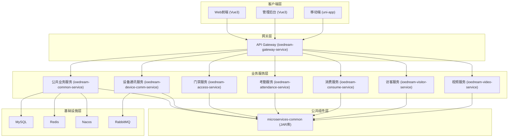
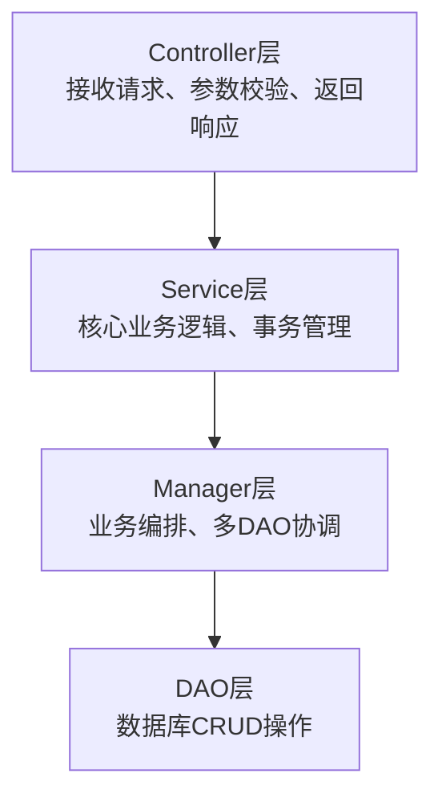
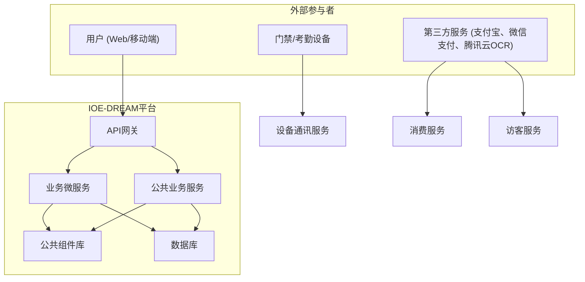
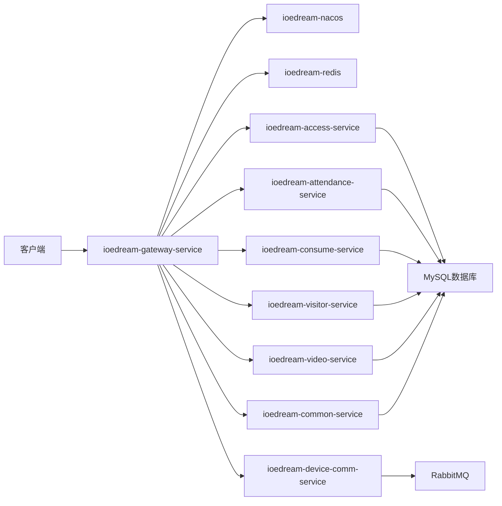

# 项目概述

<cite>
**本文档引用文件**  
- [README.md](file://README.md)
- [README_PROJECT_STATUS.md](file://README_PROJECT_STATUS.md)
- [docker-compose-services.yml](file://docker-compose-services.yml)
- [microservices/pom.xml](file://microservices/pom.xml)
- [microservices/ioedream-access-service/pom.xml](file://microservices/ioedream-access-service/pom.xml)
- [microservices/ioedream-attendance-service/pom.xml](file://microservices/ioedream-attendance-service/pom.xml)
- [microservices/ioedream-consume-service/pom.xml](file://microservices/ioedream-consume-service/pom.xml)
- [microservices/ioedream-visitor-service/pom.xml](file://microservices/ioedream-visitor-service/pom.xml)
- [microservices/ioedream-video-service/pom.xml](file://microservices/ioedream-video-service/pom.xml)
- [microservices/ioedream-oa-service/pom.xml](file://microservices/ioedream-oa-service/pom.xml)
- [microservices/ioedream-gateway-service/pom.xml](file://microservices/ioedream-gateway-service/pom.xml)
- [documentation/architecture/OPTIMAL_ARCHITECTURE_DESIGN.md](file://documentation/architecture/OPTIMAL_ARCHITECTURE_DESIGN.md)
- [documentation/technical/ARCHITECTURE_COMPLIANCE_VERIFICATION_REPORT.md](file://documentation/technical/ARCHITECTURE_COMPLIANCE_VERIFICATION_REPORT.md)
- [smart-admin-web-javascript/package.json](file://smart-admin-web-javascript/package.json)
</cite>

## 目录
1. [系统定位与核心价值](#系统定位与核心价值)
2. [系统架构设计](#系统架构设计)
3. [核心模块功能与协同](#核心模块功能与协同)
4. [技术选型与优势](#技术选型与优势)
5. [系统上下文与部署](#系统上下文与部署)
6. [典型用户工作流](#典型用户工作流)

## 系统定位与核心价值

IOE-DREAM项目是一个企业级智能安防与数字化管理平台，旨在为智慧园区、企业办公等场景提供一体化的解决方案。该平台以“高质量代码”为核心，遵循“简洁、高效、安全”的开发理念，满足国家网络安全等级保护三级和数据安全要求。

平台支持国产数据库（如达梦、金仓、OceanBase等）和主流数据库（MySQL、PostgreSQL），并提供前端JavaScript/TypeScript双版本和后端Java8/17双版本支持，确保了技术栈的灵活性和广泛适用性。作为经过千余家企业验证的成熟平台，IOE-DREAM不仅提供门禁、考勤、消费、访客、视频监控等核心功能，还集成了OA工作流、系统监控、数据脱敏等企业级特性，致力于打造一个安全、可靠、可扩展的数字化管理生态。

**Section sources**
- [README.md](file://README.md#L1-L84)
- [README_PROJECT_STATUS.md](file://README_PROJECT_STATUS.md#L1-L110)

## 系统架构设计

### 微服务架构

IOE-DREAM采用微服务架构，将复杂的单体应用拆分为多个独立、可独立部署的服务。这种架构提高了系统的可维护性、可扩展性和容错能力。整个系统由一个API网关和多个业务微服务组成，通过Nacos进行服务注册与发现，实现了服务的动态管理和负载均衡。

**Diagram sources**
- [documentation/architecture/OPTIMAL_ARCHITECTURE_DESIGN.md](file://documentation/architecture/OPTIMAL_ARCHITECTURE_DESIGN.md#L105-L177)
- [docker-compose-services.yml](file://docker-compose-services.yml#L1-L41)

### 前后端分离模式

系统采用前后端分离的开发模式。前端基于Vue3、Vite5和Ant Design Vue构建，提供现代化的用户界面和交互体验。后端提供RESTful API接口，前端通过Axios等HTTP客户端与后端进行数据交互。这种模式使得前端和后端可以并行开发，互不影响，提高了开发效率。

### 四层架构

在微服务内部，采用Controller→Service→Manager→DAO的四层架构设计，确保了代码的清晰分层和职责分离。

- **Controller层**：负责接收HTTP请求，进行参数校验，并调用Service层处理业务逻辑，最后返回统一格式的响应。
- **Service层**：实现核心业务逻辑，管理事务，并调用Manager层进行复杂的业务编排。
- **Manager层**：负责复杂的业务编排、多DAO协调、缓存管理以及外部服务调用，是业务逻辑的核心。
- **DAO层**：负责与数据库进行交互，执行CRUD操作，使用MyBatis-Plus简化数据访问。

这种分层架构使得代码结构清晰，易于维护和测试。

**Diagram sources**
- [documentation/architecture/OPTIMAL_ARCHITECTURE_DESIGN.md](file://documentation/architecture/OPTIMAL_ARCHITECTURE_DESIGN.md#L310-L332)

**Section sources**
- [documentation/architecture/OPTIMAL_ARCHITECTURE_DESIGN.md](file://documentation/architecture/OPTIMAL_ARCHITECTURE_DESIGN.md#L306-L432)
- [documentation/technical/ARCHITECTURE_COMPLIANCE_VERIFICATION_REPORT.md](file://documentation/technical/ARCHITECTURE_COMPLIANCE_VERIFICATION_REPORT.md#L1-L262)

## 核心模块功能与协同

### 门禁模块

门禁模块负责管理园区或建筑的出入权限。它通过与物理门禁设备（如读卡器、生物识别设备）的通讯，控制人员的通行。该模块与设备通讯服务紧密协作，接收设备的通行记录，并与考勤模块同步数据，实现无感考勤。

### 考勤模块

考勤模块提供灵活的考勤规则配置，支持多种打卡方式（如门禁打卡、移动端打卡）。它能够处理考勤异常申请、生成考勤报表，并与OA工作流模块集成，实现请假、出差等流程的自动化审批。

### 消费模块

消费模块管理园区内的消费场景，如食堂、便利店等。它支持账户管理、消费记录查询、报表导出（支持Excel和PDF格式），并集成了支付宝和微信支付SDK，方便用户进行充值。

### 访客模块

访客模块提供线上访客预约、线下自助登记、二维码通行等功能。它与门禁模块协同工作，为访客临时生成通行权限，并在访问结束后自动失效。该模块还集成了腾讯云OCR SDK，用于快速识别访客身份证信息。

### 视频监控模块

视频监控模块提供实时视频监控、录像回放和智能分析功能。它与门禁模块联动，当发生非法闯入等事件时，可自动调取相关区域的视频画面，为安全事件提供证据支持。

### OA工作流模块

OA工作流模块提供企业级的审批流程管理，支持自定义工作流。它与考勤、访客等模块深度集成，例如，访客预约可以触发审批流程，考勤异常申请需要经过主管审批。

这些模块通过API网关对外提供服务，并通过公共业务服务（ioedream-common-service）共享用户、权限、组织架构等基础数据，确保了数据的一致性和系统的整体性。

**Section sources**
- [documentation/architecture/OPTIMAL_ARCHITECTURE_DESIGN.md](file://documentation/architecture/OPTIMAL_ARCHITECTURE_DESIGN.md#L180-L254)
- [microservices/ioedream-access-service/pom.xml](file://microservices/ioedream-access-service/pom.xml#L1-L86)
- [microservices/ioedream-attendance-service/pom.xml](file://microservices/ioedream-attendance-service/pom.xml#L1-L86)
- [microservices/ioedream-consume-service/pom.xml](file://microservices/ioedream-consume-service/pom.xml#L1-L158)
- [microservices/ioedream-visitor-service/pom.xml](file://microservices/ioedream-visitor-service/pom.xml#L1-L110)
- [microservices/ioedream-video-service/pom.xml](file://microservices/ioedream-video-service/pom.xml#L1-L79)
- [microservices/ioedream-oa-service/pom.xml](file://microservices/ioedream-oa-service/pom.xml#L1-L106)

## 技术选型与优势

### 后端技术栈

| 类别 | 技术选型 | 版本 | 优势 |
| :--- | :--- | :--- | :--- |
| **语言** | Java | 17 | 长期支持版本，性能稳定，生态系统成熟 |
| **框架** | Spring Boot | 3.5.8 | 快速开发，自动配置，内嵌服务器 |
| **微服务** | Spring Cloud Alibaba | 2022.0.0.0 | 阿里巴巴开源，与Nacos、Sentinel等组件无缝集成 |
| **ORM** | MyBatis-Plus | 3.5.15 | 在MyBatis基础上增强，简化CRUD操作 |
| **认证** | Sa-Token | 1.44.0 | 轻量级Java权限认证框架，简单易用 |
| **数据库** | MySQL | 8.0+ | 主流关系型数据库，性能优秀，社区活跃 |
| **缓存** | Redis | 7+ | 高性能内存数据库，用于会话管理和数据缓存 |
| **注册中心** | Nacos | 2.3.0 | 阿里巴巴开源，集服务发现、配置管理于一体 |

### 前端技术栈

| 类别 | 技术选型 | 版本 | 优势 |
| :--- | :--- | :--- | :--- |
| **框架** | Vue | 3.4.x | 响应式、组件化，学习曲线平缓 |
| **构建** | Vite | 5.x | 极速的冷启动和热更新 |
| **状态管理** | Pinia | 2.1.x | Vue官方推荐，API简洁 |
| **UI组件** | Ant Design Vue | 4.x | 企业级UI设计语言，组件丰富 |

**Section sources**
- [documentation/architecture/OPTIMAL_ARCHITECTURE_DESIGN.md](file://documentation/architecture/OPTIMAL_ARCHITECTURE_DESIGN.md#L259-L303)
- [microservices/pom.xml](file://microservices/pom.xml#L1-L170)
- [smart-admin-web-javascript/package.json](file://smart-admin-web-javascript/package.json#L1-L76)

## 系统上下文与部署

### 系统上下文图

系统上下文图展示了IOE-DREAM平台与外部参与者（用户、设备、第三方服务）之间的交互关系。

**Diagram sources**
- [documentation/architecture/OPTIMAL_ARCHITECTURE_DESIGN.md](file://documentation/architecture/OPTIMAL_ARCHITECTURE_DESIGN.md#L105-L177)

### 部署拓扑图

系统采用Docker容器化部署，通过docker-compose管理服务。Nacos作为服务注册中心和配置中心，Redis作为缓存和会话存储，MySQL作为持久化数据库。

**Diagram sources**
- [docker-compose-services.yml](file://docker-compose-services.yml#L1-L41)

## 典型用户工作流

### 访客预约与通行工作流

1.  **预约发起**：访客通过移动端H5页面填写预约信息（姓名、身份证、访问事由、访问时间等）。
2.  **审批流程**：预约信息提交后，触发OA工作流，由被访人进行审批。
3.  **生成凭证**：审批通过后，系统自动生成一个包含访客信息和通行权限的二维码，并通过短信或微信发送给访客。
4.  **现场通行**：访客到达现场，通过门禁设备扫描二维码，设备通讯服务验证二维码有效性后，向门禁服务发送开门指令，门禁设备执行开门动作。
5.  **记录归档**：通行记录被门禁服务记录，并同步到访客服务和审计日志中。

此工作流展示了访客模块、OA工作流模块、门禁模块和设备通讯服务之间的协同工作。

**Section sources**
- [microservices/ioedream-visitor-service/pom.xml](file://microservices/ioedream-visitor-service/pom.xml#L1-L110)
- [microservices/ioedream-oa-service/pom.xml](file://microservices/ioedream-oa-service/pom.xml#L1-L106)
- [microservices/ioedream-access-service/pom.xml](file://microservices/ioedream-access-service/pom.xml#L1-L86)
- [microservices/ioedream-device-comm-service/pom.xml](file://microservices/ioedream-device-comm-service/pom.xml#L1-L78)