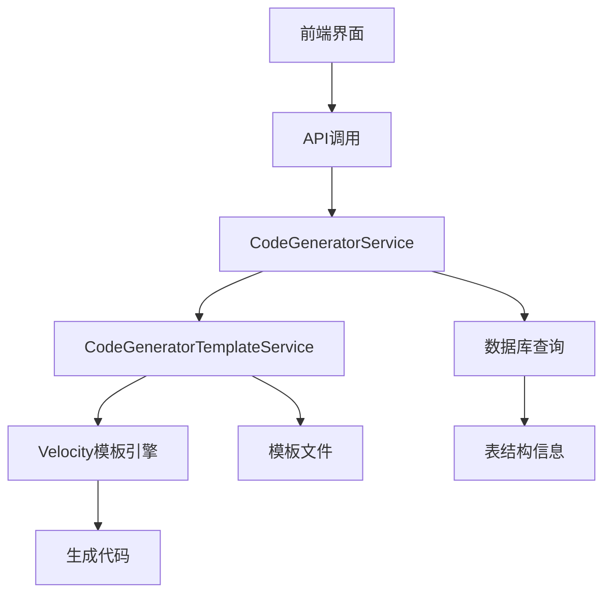
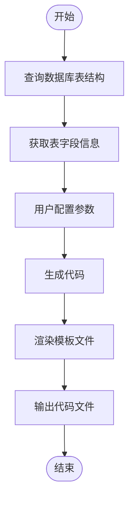
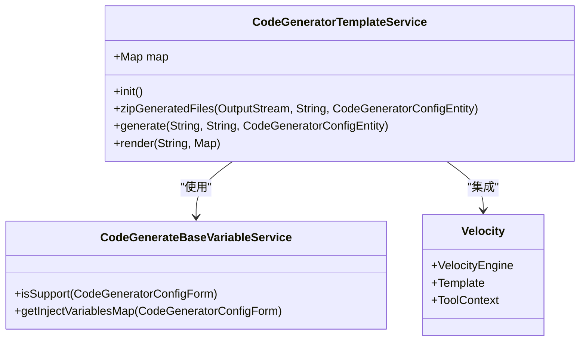
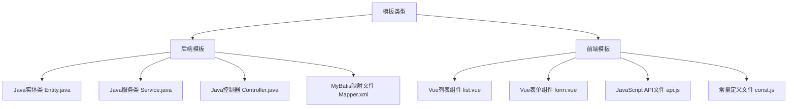
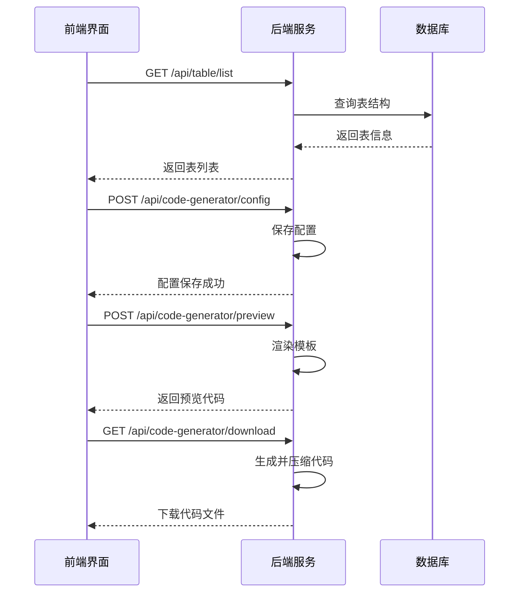
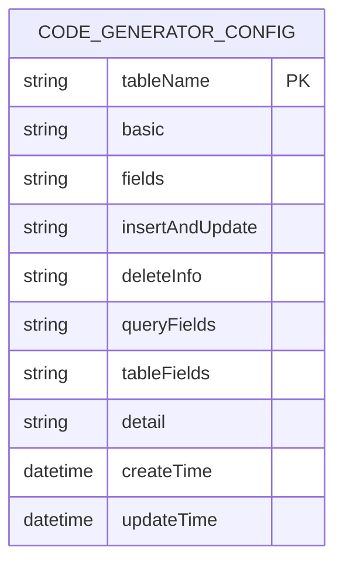
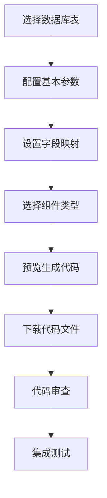
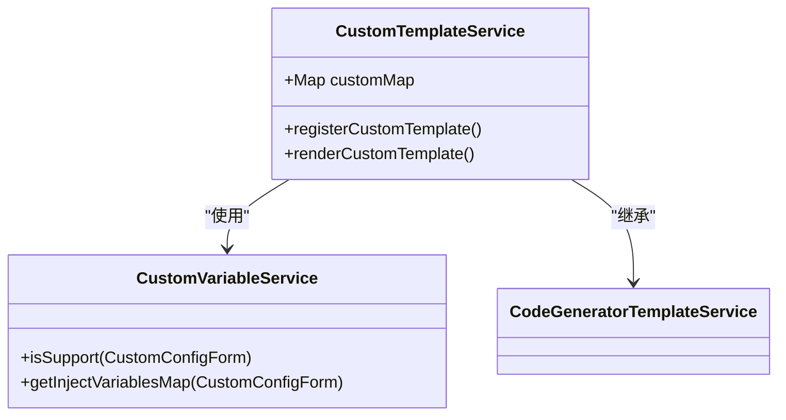
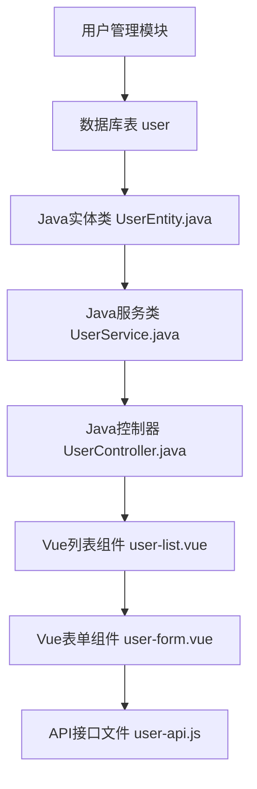

# 代码生成器

<cite>
**本文档引用的文件**   
- [CodeGeneratorService.java](file://smart-admin-api-java17-springboot3\sa-base\src\main\java\net\lab1024\sa\base\module\support\codegenerator\service\CodeGeneratorService.java)
- [CodeGeneratorTemplateService.java](file://smart-admin-api-java17-springboot3\sa-base\src\main\java\net\lab1024\sa\base\module\support\codegenerator\service\CodeGeneratorTemplateService.java)
- [code-generator-util.js](file://smart-admin-web-javascript\src\views\support\code-generator\code-generator-util.js)
- [code-generator-const.js](file://smart-admin-web-javascript\src\constants\support\code-generator-const.js)
- [code-generator-table-config-form-basic.vue](file://smart-admin-web-javascript\src\views\support\code-generator\components\form\code-generator-table-config-form-basic.vue)
- [code-generator-preview-modal.vue](file://smart-admin-web-javascript\src\views\support\code-generator\components\preview\code-generator-preview-modal.vue)
- [Entity.java.vm](file://smart-admin-api-java17-springboot3\sa-base\src\main\resources\code-generator-template\java\domain\entity\Entity.java.vm)
- [Controller.java.vm](file://smart-admin-api-java17-springboot3\sa-base\src\main\resources\code-generator-template\java\controller\Controller.java.vm)
- [CodeFrontComponentEnum.java](file://smart-admin-api-java17-springboot3\sa-base\src\main\java\net\lab1024\sa\base\module\support\codegenerator\constant\CodeFrontComponentEnum.java)
- [CodeGeneratorConfigEntity.java](file://smart-admin-api-java17-springboot3\sa-base\src\main\java\net\lab1024\sa\base\module\support\codegenerator\domain\entity\CodeGeneratorConfigEntity.java)
</cite>

## 目录
1. [简介](#简介)
2. [核心组件分析](#核心组件分析)
3. [代码生成流程](#代码生成流程)
4. [模板引擎与变量替换机制](#模板引擎与变量替换机制)
5. [支持的模板类型](#支持的模板类型)
6. [前后端交互机制](#前后端交互机制)
7. [配置选项与可定制性](#配置选项与可定制性)
8. [使用步骤与最佳实践](#使用步骤与最佳实践)
9. [自定义模板扩展](#自定义模板扩展)
10. [实际应用示例](#实际应用示例)

## 简介
IOE-DREAM项目的代码生成器是一个强大的自动化工具，旨在提高开发效率并确保代码一致性。该系统通过分析数据库表结构，结合预定义的模板和配置，能够自动生成完整的前后端代码。代码生成器支持多种编程语言和技术栈，包括Java、JavaScript、TypeScript和Vue等，为新业务模块的快速开发提供了坚实的基础。

代码生成器的核心优势在于其灵活性和可扩展性。开发者可以通过图形化界面配置各种参数，如模块命名、包路径、作者信息等，并选择生成不同类型的代码文件。系统采用Velocity模板引擎实现代码生成，通过变量替换机制将配置信息注入到模板中，从而生成符合项目规范的代码。

## 核心组件分析

代码生成器由多个核心组件构成，这些组件协同工作以实现完整的代码生成功能。后端服务主要由`CodeGeneratorService`和`CodeGeneratorTemplateService`两个核心类组成，分别负责业务逻辑处理和模板渲染。前端部分则通过Vue组件实现用户界面，提供表结构查询、配置设置、代码预览等功能。

**代码生成器核心组件关系图**

**组件来源**
- [CodeGeneratorService.java](file://smart-admin-api-java17-springboot3\sa-base\src\main\java\net\lab1024\sa\base\module\support\codegenerator\service\CodeGeneratorService.java)
- [CodeGeneratorTemplateService.java](file://smart-admin-api-java17-springboot3\sa-base\src\main\java\net\lab1024\sa\base\module\support\codegenerator\service\CodeGeneratorTemplateService.java)

## 代码生成流程

代码生成器的工作流程分为几个关键步骤：首先从数据库获取表结构信息，然后根据用户配置生成相应的代码模板，最后通过模板引擎渲染生成最终的代码文件。整个流程高度自动化，开发者只需进行简单的配置即可获得完整的业务代码。

**代码生成流程图**

**流程来源**
- [CodeGeneratorService.java](file://smart-admin-api-java17-springboot3\sa-base\src\main\java\net\lab1024\sa\base\module\support\codegenerator\service\CodeGeneratorService.java)
- [CodeGeneratorTemplateService.java](file://smart-admin-api-java17-springboot3\sa-base\src\main\java\net\lab1024\sa\base\module\support\codegenerator\service\CodeGeneratorTemplateService.java)

## 模板引擎与变量替换机制

代码生成器采用Apache Velocity作为模板引擎，通过变量替换机制实现动态代码生成。Velocity模板文件（.vm）包含特殊的占位符语法，如`${variable}`和`#if(condition)`，这些占位符在渲染时会被实际的配置值替换。系统通过`CodeGeneratorTemplateService`类管理模板的加载和渲染过程。

**模板引擎核心类图**

**模板引擎来源**
- [CodeGeneratorTemplateService.java](file://smart-admin-api-java17-springboot3\sa-base\src\main\java\net\lab1024\sa\base\module\support\codegenerator\service\CodeGeneratorTemplateService.java)
- [Entity.java.vm](file://smart-admin-api-java17-springboot3\sa-base\src\main\resources\code-generator-template\java\domain\entity\Entity.java.vm)

## 支持的模板类型

代码生成器支持多种模板类型，涵盖前后端各个层面的代码生成需求。后端模板包括Java实体类、服务类、控制器等，前端模板则包含Vue组件、API接口文件和常量定义。系统通过配置文件灵活管理这些模板，开发者可以根据项目需求选择合适的模板组合。

**模板类型分类图**

**模板类型来源**
- [code-generator-util.js](file://smart-admin-web-javascript\src\views\support\code-generator\code-generator-util.js)
- [JAVA_FILE_LIST](file://smart-admin-web-javascript\src\views\support\code-generator\code-generator-util.js#L149-L157)
- [JS_FILE_LIST](file://smart-admin-web-javascript\src\views\support\code-generator\code-generator-util.js#L125-L130)

## 前后端交互机制

代码生成器的前后端交互通过RESTful API实现，前端通过调用后端接口完成表结构查询、配置保存、代码预览和下载等操作。系统采用标准的HTTP协议进行通信，确保了良好的兼容性和可维护性。前端界面提供了直观的配置面板，用户可以实时预览生成的代码效果。

**前后端交互序列图**

**交互机制来源**
- [code-generator-preview-modal.vue](file://smart-admin-web-javascript\src\views\support\code-generator\components\preview\code-generator-preview-modal.vue)
- [CodeGeneratorService.java](file://smart-admin-api-java17-springboot3\sa-base\src\main\java\net\lab1024\sa\base\module\support\codegenerator\service\CodeGeneratorService.java)

## 配置选项与可定制性

代码生成器提供了丰富的配置选项，允许开发者根据项目需求进行个性化定制。配置内容包括模块命名、包路径、作者信息、版权说明等基本信息，以及前后端代码生成的具体参数。系统通过`CodeGeneratorConfigEntity`实体类存储这些配置，确保配置信息的持久化和可追溯性。

**配置实体数据模型**

**配置选项来源**
- [CodeGeneratorConfigEntity.java](file://smart-admin-api-java17-springboot3\sa-base\src\main\java\net\lab1024\sa\base\module\support\codegenerator\domain\entity\CodeGeneratorConfigEntity.java)
- [code-generator-table-config-form-basic.vue](file://smart-admin-web-javascript\src\views\support\code-generator\components\form\code-generator-table-config-form-basic.vue)

## 使用步骤与最佳实践

使用代码生成器的最佳实践包括：首先选择目标数据库表，然后配置基本的模块信息，如命名、包路径和作者信息；接着设置前后端代码生成的具体参数，包括字段映射、组件类型等；最后通过预览功能检查生成的代码效果，确认无误后下载代码文件。建议在生成代码后进行必要的代码审查和测试。

**使用步骤流程图**

**使用步骤来源**
- [code-generator-table-config-form-basic.vue](file://smart-admin-web-javascript\src\views\support\code-generator\components\form\code-generator-table-config-form-basic.vue)
- [code-generator-preview-modal.vue](file://smart-admin-web-javascript\src\views\support\code-generator\components\preview\code-generator-preview-modal.vue)

## 自定义模板扩展

代码生成器支持模板的自定义扩展，开发者可以根据项目特殊需求创建新的模板文件。扩展模板需要遵循特定的目录结构和命名规范，并在`CodeGeneratorTemplateService`中注册相应的变量服务。通过这种方式，系统可以灵活适应不同项目的技术栈和编码规范要求。

**自定义模板扩展类图**

**扩展机制来源**
- [CodeGeneratorTemplateService.java](file://smart-admin-api-java17-springboot3\sa-base\src\main\java\net\lab1024\sa\base\module\support\codegenerator\service\CodeGeneratorTemplateService.java)
- [code-generator-util.js](file://smart-admin-web-javascript\src\views\support\code-generator\code-generator-util.js)

## 实际应用示例

以生成一个用户管理模块为例，首先在数据库中创建`user`表，包含id、name、email等字段；然后在代码生成器中选择该表，配置模块命名为"User"，包路径为"com.example.user"；设置前后端作者信息和版权说明；选择合适的字段映射和组件类型；最后预览并下载生成的代码文件。生成的代码将包含完整的CRUD操作，可以直接集成到项目中使用。

**用户管理模块生成示例**

**应用示例来源**
- [code-generator-util.js](file://smart-admin-web-javascript\src\views\support\code-generator\code-generator-util.js)
- [CodeGeneratorTemplateService.java](file://smart-admin-api-java17-springboot3\sa-base\src\main\java\net\lab1024\sa\base\module\support\codegenerator\service\CodeGeneratorTemplateService.java)