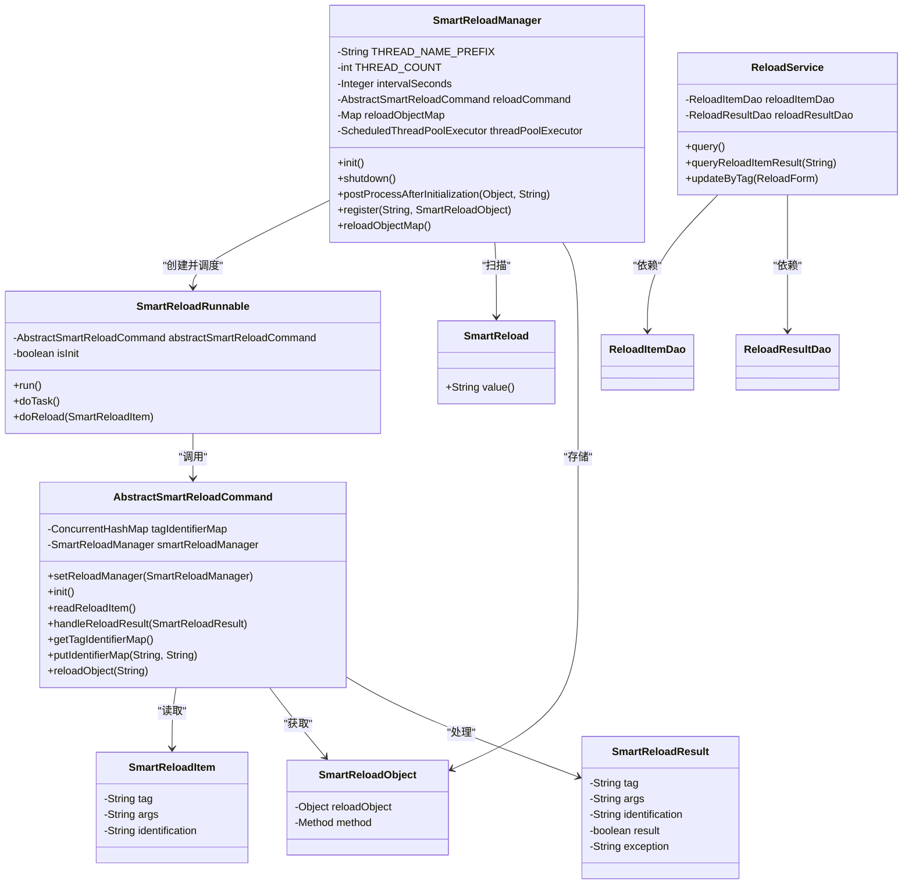
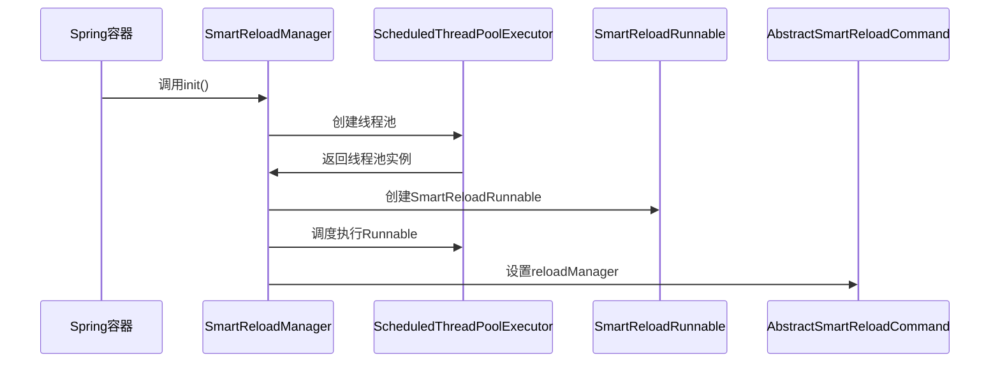
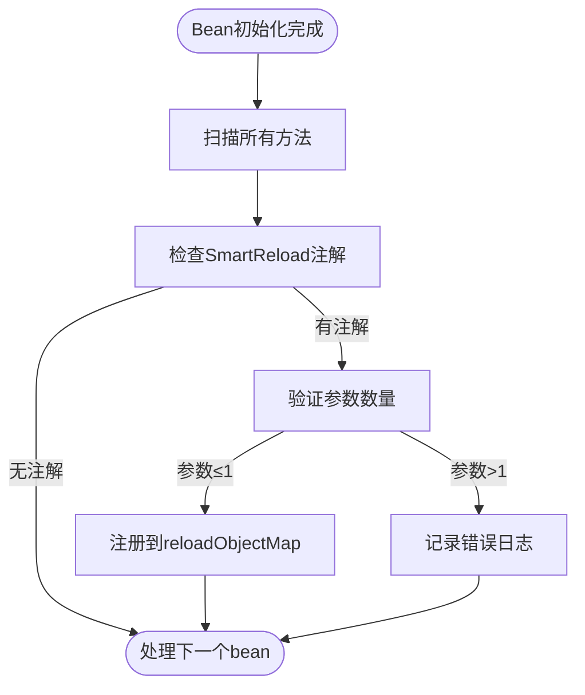
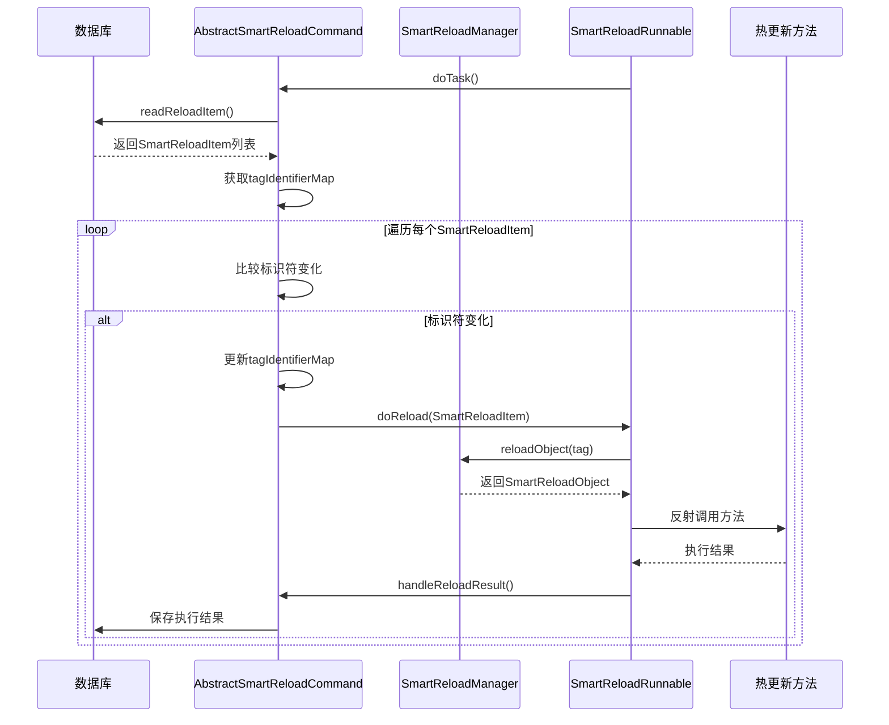
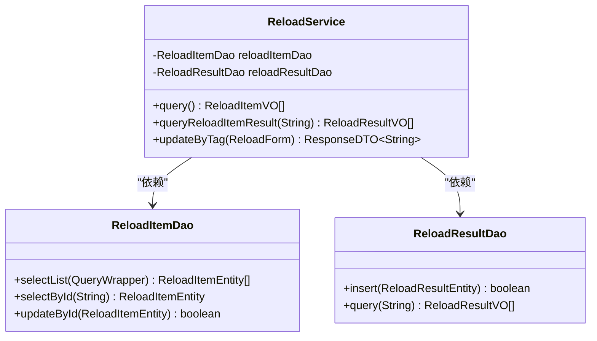

# 系统钩子(SmartReload)

<cite>
**本文档引用的文件**
- [SmartReload.java](file://smart-admin-api-java17-springboot3/sa-base/src/main/java/net/lab1024/sa/base/module/support/reload/core/annoation/SmartReload.java)
- [SmartReloadManager.java](file://smart-admin-api-java17-springboot3/sa-base/src/main/java/net/lab1024/sa/base/module/support/reload/core/SmartReloadManager.java)
- [AbstractSmartReloadCommand.java](file://smart-admin-api-java17-springboot3/sa-base/src/main/java/net/lab1024/sa/base/module/support/reload/core/AbstractSmartReloadCommand.java)
- [ReloadCommand.java](file://smart-admin-api-java17-springboot3/sa-base/src/main/java/net/lab1024/sa/base/module/support/reload/ReloadCommand.java)
- [SmartReloadRunnable.java](file://smart-admin-api-java17-springboot3/sa-base/src/main/java/net/lab1024/sa/base/module/support/reload/core/thread/SmartReloadRunnable.java)
- [SmartReloadItem.java](file://smart-admin-api-java17-springboot3/sa-base/src/main/java/net/lab1024/sa/base/module/support/reload/core/domain/SmartReloadItem.java)
- [SmartReloadObject.java](file://smart-admin-api-java17-springboot3/sa-base/src/main/java/net/lab1024/sa/base/module/support/reload/core/domain/SmartReloadObject.java)
- [SmartReloadResult.java](file://smart-admin-api-java17-springboot3/sa-base/src/main/java/net/lab1024/sa/base/module/support/reload/core/domain/SmartReloadResult.java)
- [ReloadService.java](file://smart-admin-api-java17-springboot3/sa-base/src/main/java/net/lab1024/sa/base/module/support/reload/ReloadService.java)
- [ReloadConst.java](file://smart-admin-api-java17-springboot3/sa-base/src/main/java/net/lab1024/sa/base/constant/ReloadConst.java)
- [RedisCacheServiceImpl.java](file://smart-admin-api-java17-springboot3/sa-base/src/main/java/net/lab1024/sa/base/module/support/cache/RedisCacheServiceImpl.java)
- [CaffeineCacheServiceImpl.java](file://smart-admin-api-java17-springboot3/sa-base/src/main/java/net/lab1024/sa/base/module/support/cache/CaffeineCacheServiceImpl.java)
- [reload-list.vue](file://smart-admin-web-javascript/src/views/support/reload/reload-list.vue)
- [reload-api.js](file://smart-admin-web-javascript/src/api/support/reload-api.js)
</cite>

## 目录
1. [简介](#简介)
2. [核心组件](#核心组件)
3. [SmartReload注解详解](#smartreload注解详解)
4. [SmartReloadManager实现原理](#smartreloadmanager实现原理)
5. [系统钩子工作流程](#系统钩子工作流程)
6. [ReloadService任务管理](#reloadservice任务管理)
7. [使用场景与配置](#使用场景与配置)
8. [自定义热更新命令](#自定义热更新命令)
9. [最佳实践](#最佳实践)

## 简介

SmartReload是IOE-DREAM项目中的热更新机制，允许在不重启服务的情况下动态重新加载配置或执行预设代码。该机制通过注解扫描、任务注册、异步执行和结果记录等技术实现，为系统提供了灵活的热更新能力。

**系统钩子**机制主要用于：
- 刷新内存中的缓存
- 执行特定的后门代码
- 实现Java热加载（前提是类结构不发生变化）
- 其他不能重启服务的应用场景

该机制通过后台Daemon线程定期轮询数据库中的状态标识，当发现状态变化时自动触发相应的热更新操作。

## 核心组件

SmartReload机制由多个核心组件构成，包括注解、管理器、命令抽象类、运行线程和数据模型等。



**图示来源**
- [SmartReload.java](file://smart-admin-api-java17-springboot3/sa-base/src/main/java/net/lab1024/sa/base/module/support/reload/core/annoation/SmartReload.java)
- [SmartReloadManager.java](file://smart-admin-api-java17-springboot3/sa-base/src/main/java/net/lab1024/sa/base/module/support/reload/core/SmartReloadManager.java)
- [AbstractSmartReloadCommand.java](file://smart-admin-api-java17-springboot3/sa-base/src/main/java/net/lab1024/sa/base/module/support/reload/core/AbstractSmartReloadCommand.java)
- [SmartReloadRunnable.java](file://smart-admin-api-java17-springboot3/sa-base/src/main/java/net/lab1024/sa/base/module/support/reload/core/thread/SmartReloadRunnable.java)
- [SmartReloadItem.java](file://smart-admin-api-java17-springboot3/sa-base/src/main/java/net/lab1024/sa/base/module/support/reload/core/domain/SmartReloadItem.java)
- [SmartReloadObject.java](file://smart-admin-api-java17-springboot3/sa-base/src/main/java/net/lab1024/sa/base/module/support/reload/core/domain/SmartReloadObject.java)
- [SmartReloadResult.java](file://smart-admin-api-java17-springboot3/sa-base/src/main/java/net/lab1024/sa/base/module/support/reload/core/domain/SmartReloadResult.java)
- [ReloadService.java](file://smart-admin-api-java17-springboot3/sa-base/src/main/java/net/lab1024/sa/base/module/support/reload/ReloadService.java)

## SmartReload注解详解

`@SmartReload`注解是SmartReload机制的核心，用于标记需要热更新的方法。

```java
@Target(ElementType.METHOD)
@Retention(RetentionPolicy.RUNTIME)
public @interface SmartReload {
    String value();
}
```

### 注解参数

| 参数 | 说明 | 示例 |
|------|------|------|
| value | 标识符，用于唯一标识热更新任务 | `@SmartReload("system_config")` |

### 使用方法

1. 在需要热更新的方法上添加`@SmartReload`注解
2. 注解的value值作为该热更新任务的唯一标识
3. 被注解的方法最多只能有一个参数

### 使用示例

```java
@Service
public class CacheService {
    
    @SmartReload("cache_service")
    public void clearAllCache() {
        // 清除所有缓存的逻辑
        log.info("清除所有缓存");
    }
    
    @SmartReload("system_config")
    public void configReload(String args) {
        // 根据参数重新加载配置
        log.info("重新加载配置，参数：{}", args);
    }
}
```

**代码来源**
- [SmartReload.java](file://smart-admin-api-java17-springboot3/sa-base/src/main/java/net/lab1024/sa/base/module/support/reload/core/annoation/SmartReload.java)
- [RedisCacheServiceImpl.java](file://smart-admin-api-java17-springboot3/sa-base/src/main/java/net/lab1024/sa/base/module/support/cache/RedisCacheServiceImpl.java)
- [CaffeineCacheServiceImpl.java](file://smart-admin-api-java17-springboot3/sa-base/src/main/java/net/lab1024/sa/base/module/support/cache/CaffeineCacheServiceImpl.java)

## SmartReloadManager实现原理

SmartReloadManager是SmartReload机制的核心管理器，负责注解扫描、任务注册和调度执行。

### 初始化流程



**序列图来源**
- [SmartReloadManager.java](file://smart-admin-api-java17-springboot3/sa-base/src/main/java/net/lab1024/sa/base/module/support/reload/core/SmartReloadManager.java)
- [SmartReloadRunnable.java](file://smart-admin-api-java17-springboot3/sa-base/src/main/java/net/lab1024/sa/base/module/support/reload/core/thread/SmartReloadRunnable.java)

### 注解扫描与注册

SmartReloadManager实现了Spring的BeanPostProcessor接口，在bean初始化后扫描`@SmartReload`注解：



**流程图来源**
- [SmartReloadManager.java](file://smart-admin-api-java17-springboot3/sa-base/src/main/java/net/lab1024/sa/base/module/support/reload/core/SmartReloadManager.java)

### 核心功能

1. **定时调度**：通过ScheduledThreadPoolExecutor创建后台线程，按照配置的间隔时间定期执行热更新检查
2. **注解扫描**：实现BeanPostProcessor接口，在Spring容器初始化bean后扫描`@SmartReload`注解
3. **任务注册**：将带有`@SmartReload`注解的方法注册到内部的reloadObjectMap中
4. **异常处理**：对热更新执行过程中的异常进行捕获和记录

## 系统钩子工作流程

SmartReload机制的工作流程包括配置热更新、缓存刷新、服务重启等场景的实现机制。

### 整体工作流程



**序列图来源**
- [SmartReloadRunnable.java](file://smart-admin-api-java17-springboot3/sa-base/src/main/java/net/lab1024/sa/base/module/support/reload/core/thread/SmartReloadRunnable.java)
- [AbstractSmartReloadCommand.java](file://smart-admin-api-java17-springboot3/sa-base/src/main/java/net/lab1024/sa/base/module/support/reload/core/AbstractSmartReloadCommand.java)

### 详细执行步骤

1. **初始化阶段**：
   - SmartReloadManager启动时创建ScheduledThreadPoolExecutor
   - 调度SmartReloadRunnable以固定延迟执行
   - AbstractSmartReloadCommand初始化，读取数据库中的热更新项

2. **检测阶段**：
   - SmartReloadRunnable定期执行doTask方法
   - 从数据库读取最新的SmartReloadItem列表
   - 与内存中的tagIdentifierMap进行比较

3. **执行阶段**：
   - 当发现标识符变化时，通过反射调用对应的热更新方法
   - 方法可以无参数或有一个String类型的参数
   - 执行结果被封装为SmartReloadResult对象

4. **结果处理**：
   - 将执行结果通过handleReloadResult方法处理
   - 保存到数据库中的reload_result表
   - 更新内存中的标识符缓存

## ReloadService任务管理

ReloadService负责管理热更新任务的执行状态和结果记录。

### 服务功能



**类图来源**
- [ReloadService.java](file://smart-admin-api-java17-springboot3/sa-base/src/main/java/net/lab1024/sa/base/module/support/reload/ReloadService.java)
- [ReloadCommand.java](file://smart-admin-api-java17-springboot3/sa-base/src/main/java/net/lab1024/sa/base/module/support/reload/ReloadCommand.java)

### 核心方法

| 方法 | 功能 | 参数 | 返回值 |
|------|------|------|--------|
| query() | 查询所有热更新项 | 无 | ResponseDTO<List<ReloadItemVO>> |
| queryReloadItemResult(String tag) | 查询指定标签的执行结果 | tag: 热更新项标识 | ResponseDTO<List<ReloadResultVO>> |
| updateByTag(ReloadForm reloadForm) | 更新热更新项的标识符 | reloadForm: 包含tag、identification和args的表单 | ResponseDTO<String> |

### 状态管理

ReloadService通过以下方式管理热更新任务的状态：

1. **查询状态**：从数据库读取当前所有热更新项的配置
2. **更新状态**：修改特定热更新项的标识符，触发热更新执行
3. **查询结果**：获取历史执行结果，用于监控和调试

## 使用场景与配置

### 常见使用场景

#### 缓存刷新

```java
@Service
public class CacheService {
    
    @Resource
    private RedisCacheManager redisCacheManager;
    
    @Resource
    private CaffeineCacheManager caffeineCacheManager;
    
    @SmartReload(ReloadConst.CACHE_SERVICE)
    public void clearAllCache() {
        // 清除Redis缓存
        redisCacheManager.getCacheNames().forEach(name -> {
            RedisCache cache = (RedisCache) redisCacheManager.getCache(name);
            if (cache != null) {
                cache.clear();
            }
        });
        
        // 清除Caffeine缓存
        caffeineCacheManager.getCacheNames().forEach(name -> {
            CaffeineCache cache = (CaffeineCache) caffeineCacheManager.getCache(name);
            if (cache != null) {
                cache.clear();
            }
        });
        
        log.info("已清除所有缓存");
    }
}
```

#### 配置热加载

```java
@Service
public class ConfigService {
    
    @Value("${app.config.reload.enabled:true}")
    private boolean reloadEnabled;
    
    @SmartReload(ReloadConst.CONFIG_RELOAD)
    public void configReload(String args) {
        if (!reloadEnabled) {
            log.warn("配置热加载已禁用");
            return;
        }
        
        // 根据参数重新加载配置
        if ("full".equals(args)) {
            reloadAllConfig();
        } else if ("basic".equals(args)) {
            reloadBasicConfig();
        } else {
            reloadConfig(args);
        }
        
        log.info("配置热加载完成，参数：{}", args);
    }
    
    private void reloadAllConfig() {
        // 重新加载所有配置
    }
    
    private void reloadBasicConfig() {
        // 重新加载基础配置
    }
    
    private void reloadConfig(String configName) {
        // 重新加载指定配置
    }
}
```

### 系统配置

在application.yml中配置SmartReload相关参数：

```yaml
# SmartReload配置
reload:
  # 检查间隔时间（秒）
  interval-seconds: 30
  # 是否启用SmartReload
  enabled: true
```

### 前端交互

前端通过API与SmartReload机制交互：

```javascript
// reload-api.js
export const reloadApi = {
  // 查询reload列表
  queryList: () => {
    return getRequest('/support/reload/query');
  },
  // 获取reload结果
  queryReloadResult: (tag) => {
    return getRequest(`/support/reload/result/${tag}`);
  },
  // 执行reload
  reload: (reloadForm) => {
    return postRequest('/support/reload/update', reloadForm);
  },
};
```

**代码来源**
- [reload-api.js](file://smart-admin-web-javascript/src/api/support/reload-api.js)
- [reload-list.vue](file://smart-admin-web-javascript/src/views/support/reload/reload-list.vue)

## 自定义热更新命令

### 创建自定义命令

要创建自定义的热更新命令，需要继承AbstractSmartReloadCommand抽象类：

```java
@Component
public class CustomReloadCommand extends AbstractSmartReloadCommand {
    
    @Resource
    private CustomConfigDao customConfigDao;
    
    @Resource
    private CustomLogDao customLogDao;
    
    /**
     * 读取自定义热更新项
     */
    @Override
    public List<SmartReloadItem> readReloadItem() {
        List<CustomConfigEntity> configList = customConfigDao.selectList(null);
        return configList.stream().map(entity -> {
            SmartReloadItem item = new SmartReloadItem();
            item.setTag(entity.getConfigKey());
            item.setArgs(entity.getConfigValue());
            item.setIdentification(entity.getLastModifiedTime().toString());
            return item;
        }).collect(Collectors.toList());
    }
    
    /**
     * 处理热更新结果
     */
    @Override
    public void handleReloadResult(SmartReloadResult smartReloadResult) {
        CustomLogEntity logEntity = new CustomLogEntity();
        logEntity.setTag(smartReloadResult.getTag());
        logEntity.setArgs(smartReloadResult.getArgs());
        logEntity.setIdentification(smartReloadResult.getIdentification());
        logEntity.setResult(smartReloadResult.isResult());
        logEntity.setException(smartReloadResult.getException());
        logEntity.setExecuteTime(LocalDateTime.now());
        
        customLogDao.insert(logEntity);
    }
}
```

### 配置使用

在Spring配置中指定使用自定义命令：

```java
@Configuration
public class ReloadConfig {
    
    @Bean
    @Primary
    public AbstractSmartReloadCommand customReloadCommand() {
        return new CustomReloadCommand();
    }
}
```

### 多数据源支持

自定义命令可以支持从不同数据源读取热更新项：

```java
@Component
public class MultiSourceReloadCommand extends AbstractSmartReloadCommand {
    
    @Resource
    private DatabaseConfigDao dbConfigDao;
    
    @Resource
    private RedisTemplate<String, String> redisTemplate;
    
    @Value("${zookeeper.connection-string}")
    private String zkConnectionString;
    
    @Override
    public List<SmartReloadItem> readReloadItem() {
        List<SmartReloadItem> items = new ArrayList<>();
        
        // 从数据库读取
        items.addAll(readFromDatabase());
        
        // 从Redis读取
        items.addAll(readFromRedis());
        
        // 从ZooKeeper读取
        items.addAll(readFromZookeeper());
        
        return items;
    }
    
    private List<SmartReloadItem> readFromDatabase() {
        // 数据库读取逻辑
    }
    
    private List<SmartReloadItem> readFromRedis() {
        // Redis读取逻辑
    }
    
    private List<SmartReloadItem> readFromZookeeper() {
        // ZooKeeper读取逻辑
    }
}
```

## 最佳实践

### 1. 命名规范

使用统一的命名规范来管理热更新标识：

```java
public class ReloadTagConst {
    // 系统配置相关
    public static final String SYSTEM_CONFIG = "system_config";
    public static final String SECURITY_CONFIG = "security_config";
    public static final String DATABASE_CONFIG = "database_config";
    
    // 缓存相关
    public static final String REDIS_CACHE = "redis_cache";
    public static final String CAFFEINE_CACHE = "caffeine_cache";
    public static final String ALL_CACHE = "all_cache";
    
    // 业务相关
    public static final String USER_PERMISSION = "user_permission";
    public static final String ROLE_PERMISSION = "role_permission";
    public static final String MENU_CONFIG = "menu_config";
}
```

### 2. 异常处理

在热更新方法中添加完善的异常处理：

```java
@SmartReload("user_permission")
public void refreshUserPermission(String userId) {
    try {
        if (StringUtils.isBlank(userId)) {
            // 全量刷新
            permissionService.refreshAllUserPermission();
        } else {
            // 增量刷新
            permissionService.refreshUserPermission(Long.valueOf(userId));
        }
        log.info("用户权限刷新完成，用户ID：{}", userId);
    } catch (Exception e) {
        log.error("用户权限刷新失败", e);
        throw new RuntimeException("用户权限刷新失败", e);
    }
}
```

### 3. 性能优化

对于耗时较长的热更新操作，考虑异步执行：

```java
@Service
public class AsyncReloadService {
    
    @Resource
    private TaskExecutor taskExecutor;
    
    @SmartReload("large_data_reload")
    public void reloadLargeData(String args) {
        // 提交到线程池异步执行
        taskExecutor.execute(() -> {
            try {
                // 执行耗时的数据加载操作
                loadDataFromExternalSystem();
                log.info("大数据集加载完成");
            } catch (Exception e) {
                log.error("大数据集加载失败", e);
            }
        });
        
        log.info("大数据集加载任务已提交");
    }
}
```

### 4. 安全控制

添加安全验证机制，防止未授权的热更新操作：

```java
@SmartReload("sensitive_operation")
public void executeSensitiveOperation(String token) {
    // 验证token
    if (!isValidToken(token)) {
        log.warn("敏感操作执行被拒绝，无效token");
        throw new SecurityException("无效的访问令牌");
    }
    
    // 执行敏感操作
    performSensitiveOperation();
    
    log.info("敏感操作执行完成");
}

private boolean isValidToken(String token) {
    // 实现token验证逻辑
    return token != null && token.equals(securityConfig.getReloadToken());
}
```

### 5. 监控与日志

添加详细的监控和日志记录：

```java
@SmartReload("monitoring_config")
public void updateMonitoringConfig(String configJson) {
    // 记录执行开始时间
    long startTime = System.currentTimeMillis();
    log.info("开始更新监控配置，配置：{}", configJson);
    
    try {
        // 解析配置
        MonitoringConfig config = parseConfig(configJson);
        
        // 更新配置
        monitoringService.updateConfig(config);
        
        // 记录执行时间
        long executionTime = System.currentTimeMillis() - startTime;
        log.info("监控配置更新完成，耗时：{}ms", executionTime);
        
        // 发送监控指标
        metricsService.recordReloadSuccess("monitoring_config", executionTime);
        
    } catch (Exception e) {
        long executionTime = System.currentTimeMillis() - startTime;
        log.error("监控配置更新失败，耗时：{}ms", executionTime, e);
        
        // 发送错误指标
        metricsService.recordReloadFailure("monitoring_config", executionTime, e.getClass().getSimpleName());
        
        throw e;
    }
}
```

### 6. 测试策略

为热更新功能编写全面的测试用例：

```java
@SpringBootTest
class SmartReloadTest {
    
    @Autowired
    private SmartReloadManager smartReloadManager;
    
    @Autowired
    private ReloadService reloadService;
    
    @MockBean
    private ExternalService externalService;
    
    @Test
    void testCacheClearReload() {
        // 准备测试数据
        ReloadForm form = new ReloadForm();
        form.setTag(ReloadConst.CACHE_SERVICE);
        form.setIdentification("new-identifier-1");
        
        // 执行热更新
        ResponseDTO<String> result = reloadService.updateByTag(form);
        
        // 验证结果
        assertThat(result.isSuccess()).isTrue();
        
        // 等待热更新执行
        Thread.sleep(1000);
        
        // 验证缓存是否被清除
        verify(externalService, times(1)).clearCache();
    }
    
    @Test
    void testConfigReloadWithArgs() {
        // 准备测试数据
        ReloadForm form = new ReloadForm();
        form.setTag("system_config");
        form.setIdentification("new-identifier-2");
        form.setArgs("full");
        
        // 执行热更新
        ResponseDTO<String> result = reloadService.updateByTag(form);
        
        // 验证结果
        assertThat(result.isSuccess()).isTrue();
        
        // 验证配置是否被正确加载
        assertThat(configService.isFullReloadExecuted()).isTrue();
    }
}
```