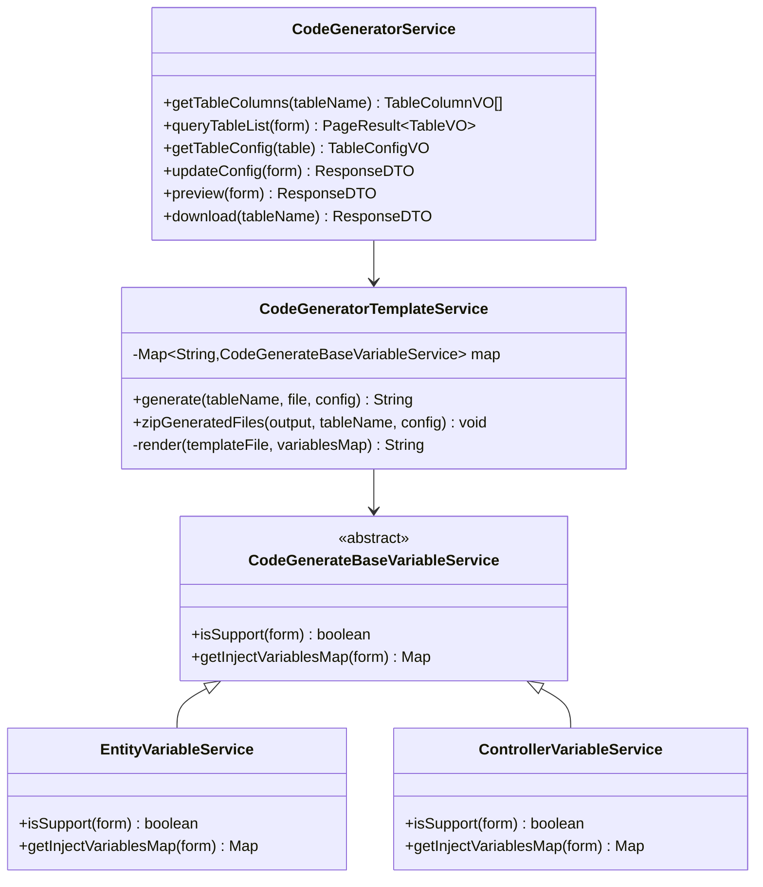
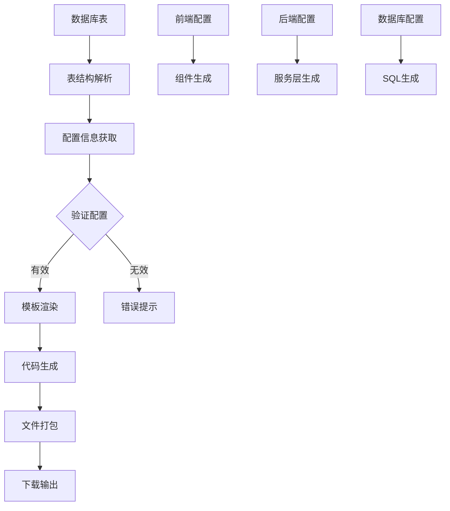
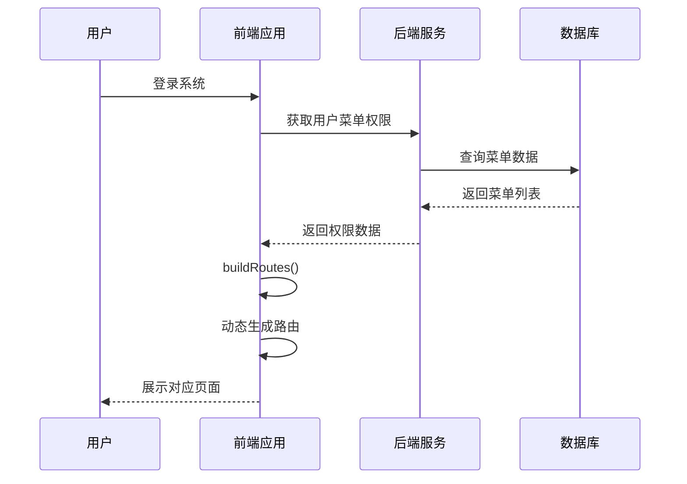
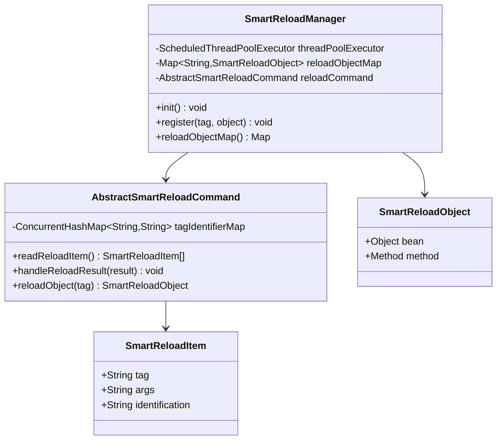
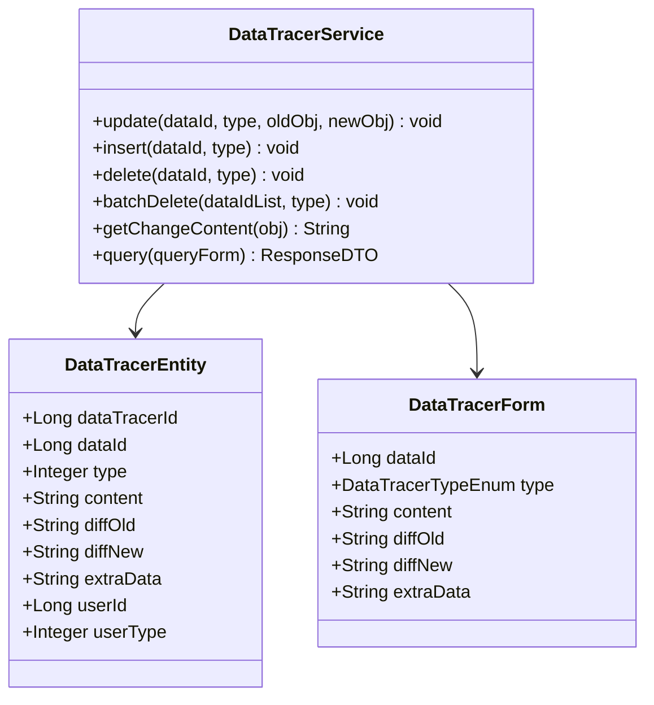
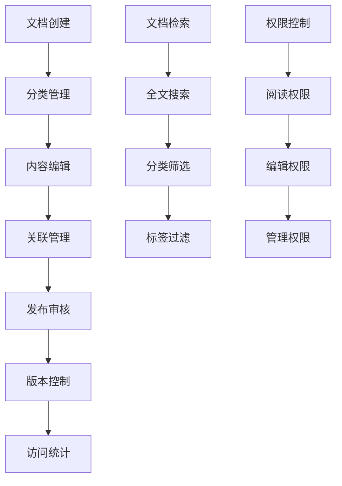

# IOE-DREAM高级特性文档

<cite>
**本文档引用的文件**
- [CodeGeneratorService.java](file://smart-admin-api-java17-springboot3/sa-base/src/main/java/net/lab1024/sa/base/module/support/codegenerator/service/CodeGeneratorService.java)
- [CodeGeneratorTemplateService.java](file://smart-admin-api-java17-springboot3/sa-base/src/main/java/net/lab1024/sa/base/module/support/codegenerator/service/CodeGeneratorTemplateService.java)
- [SmartReloadManager.java](file://smart-admin-api-java17-springboot3/sa-base/src/main/java/net/lab1024/sa/base/module/support/reload/core/SmartReloadManager.java)
- [AbstractSmartReloadCommand.java](file://smart-admin-api-java17-springboot3/sa-base/src/main/java/net/lab1024/sa/base/module/support/reload/core/AbstractSmartReloadCommand.java)
- [DataTracerService.java](file://smart-admin-api-java17-springboot3/sa-base/src/main/java/net/lab1024/sa/base/module/support/datatracer/service/DataTracerService.java)
- [HelpDocService.java](file://smart-admin-api-java17-springboot3/sa-base/src/main/java/net/lab1024/sa/base/module/support/helpdoc/service/HelpDocService.java)
- [index.js](file://smart-admin-web-javascript/src/router/index.js)
- [privilege-plugin.js](file://smart-admin-web-javascript/src/plugins/privilege-plugin.js)
- [code-generator-api.js](file://smart-admin-web-javascript/src/api/support/code-generator-api.js)
- [reload-api.js](file://smart-admin-web-javascript/src/api/support/reload-api.js)
- [data-tracer-api.js](file://smart-admin-web-javascript/src/api/support/data-tracer-api.js)
- [help-doc-api.js](file://smart-admin-web-javascript/src/api/support/help-doc-api.js)
</cite>

## 目录
1. [概述](#概述)
2. [代码生成器](#代码生成器)
3. [动态路由系统](#动态路由系统)
4. [智能热重载系统](#智能热重载系统)
5. [数据变更追踪](#数据变更追踪)
6. [在线文档系统](#在线文档系统)
7. [最佳实践与配置指南](#最佳实践与配置指南)
8. [总结](#总结)

## 概述

IOE-DREAM项目包含了一系列强大的高级特性，这些特性显著提升了开发效率和系统管理能力。本文档将深入分析五个核心高级特性：代码生成器、动态路由系统、智能热重载系统、数据变更追踪和在线文档系统。

这些特性共同构成了一个完整的现代化开发平台，为开发者提供了从代码生成到系统运维的全方位支持。

## 代码生成器

### 核心架构

代码生成器采用模板驱动的架构设计，支持前后端代码的自动化生成。

**图表来源**
- [CodeGeneratorService.java](file://smart-admin-api-java17-springboot3/sa-base/src/main/java/net/lab1024/sa/base/module/support/codegenerator/service/CodeGeneratorService.java#L41-L241)
- [CodeGeneratorTemplateService.java](file://smart-admin-api-java17-springboot3/sa-base/src/main/java/net/lab1024/sa/base/module/support/codegenerator/service/CodeGeneratorTemplateService.java#L56-L248)

### 数据库表结构解析

代码生成器能够自动解析数据库表结构，提取字段信息、约束条件和注释。

**核心功能特性：**
- **字段识别**：自动识别主键、可空性、自增字段
- **类型映射**：数据库类型到Java类型的智能映射
- **注释提取**：从数据库表和字段提取注释信息
- **约束处理**：识别唯一约束、外键关系等

### 模板引擎使用

基于Apache Velocity模板引擎，支持多种编程语言的代码生成。

**支持的模板类型：**
- **后端代码**：Java实体类、控制器、服务层、DAO层
- **前端代码**：Vue组件、API接口、常量定义
- **配置文件**：菜单SQL、MyBatis映射文件
- **TypeScript支持**：现代前端开发需求

### 前后端代码生成流程

**图表来源**
- [CodeGeneratorService.java](file://smart-admin-api-java17-springboot3/sa-base/src/main/java/net/lab1024/sa/base/module/support/codegenerator/service/CodeGeneratorService.java#L191-L240)

**章节来源**
- [CodeGeneratorService.java](file://smart-admin-api-java17-springboot3/sa-base/src/main/java/net/lab1024/sa/base/module/support/codegenerator/service/CodeGeneratorService.java#L1-L241)
- [CodeGeneratorTemplateService.java](file://smart-admin-api-java17-springboot3/sa-base/src/main/java/net/lab1024/sa/base/module/support/codegenerator/service/CodeGeneratorTemplateService.java#L1-L248)

## 动态路由系统

### 路由数据获取机制

动态路由系统通过后端数据库维护的菜单结构，自动生成前端路由配置。

**图表来源**
- [index.js](file://smart-admin-web-javascript/src/router/index.js#L98-L166)

### 权限控制实现

基于角色的访问控制（RBAC）机制，确保用户只能访问授权的页面和功能。

**权限层次结构：**
- **菜单权限**：控制页面访问
- **功能权限**：控制按钮和操作
- **数据权限**：控制数据范围

### 菜单生成规则

系统支持三种菜单类型，每种类型具有不同的行为特征：

| 菜单类型 | 描述 | 路由路径 | 组件路径 | 权限控制 |
|---------|------|----------|----------|----------|
| 目录（1） | 导航容器 | 可为空 | 可为空 | 无权限要求 |
| 菜单（2） | 页面入口 | 必须 | 必须 | 前端+后端权限 |
| 功能点（3） | 操作权限 | 无 | 无 | 仅后端权限 |

**章节来源**
- [index.js](file://smart-admin-web-javascript/src/router/index.js#L1-L166)
- [privilege-plugin.js](file://smart-admin-web-javascript/src/plugins/privilege-plugin.js#L1-L31)

## 智能热重载系统

### 工作原理

SmartReload系统通过后台守护线程定期检查配置变化，实现零停机的服务更新。

**图表来源**
- [SmartReloadManager.java](file://smart-admin-api-java17-springboot3/sa-base/src/main/java/net/lab1024/sa/base/module/support/reload/core/SmartReloadManager.java#L36-L122)
- [AbstractSmartReloadCommand.java](file://smart-admin-api-java17-springboot3/sa-base/src/main/java/net/lab1024/sa/base/module/support/reload/core/AbstractSmartReloadCommand.java#L1-L96)

### 配置热更新机制

系统通过比较配置标识符的变化来触发重载操作，避免不必要的服务重启。

**工作流程：**
1. **定时扫描**：守护线程定期检查配置状态
2. **标识比较**：比较当前标识与缓存标识
3. **条件触发**：标识变化时执行重载
4. **结果处理**：处理重载结果并更新缓存

### 缓存刷新策略

支持多种缓存刷新场景：
- **配置缓存**：系统配置参数的实时更新
- **字典缓存**：业务字典数据的动态刷新
- **权限缓存**：用户权限信息的即时生效

### 服务重启优化

通过细粒度的重载机制，实现部分功能的热更新，减少系统停机时间。

**章节来源**
- [SmartReloadManager.java](file://smart-admin-api-java17-springboot3/sa-base/src/main/java/net/lab1024/sa/base/module/support/reload/core/SmartReloadManager.java#L1-L122)
- [AbstractSmartReloadCommand.java](file://smart-admin-api-java17-springboot3/sa-base/src/main/java/net/lab1024/sa/base/module/support/reload/core/AbstractSmartReloadCommand.java#L1-L96)

## 数据变更追踪

### 实现机制

数据变更追踪系统通过AOP切面和事件监听，自动记录数据的修改历史。

**图表来源**
- [DataTracerService.java](file://smart-admin-api-java17-springboot3/sa-base/src/main/java/net/lab1024/sa/base/module/support/datatracer/service/DataTracerService.java#L39-L228)

### 数据变更记录

系统自动记录以下类型的变更操作：

**变更类型：**
- **新增记录**：INSERT操作的完整记录
- **修改记录**：UPDATE操作的前后对比
- **删除记录**：DELETE操作的原始数据
- **批量操作**：批量删除的汇总记录

### 对比功能实现

基于Diff算法的数据对比功能，提供直观的变更可视化。

**对比特性：**
- **文本对比**：支持复杂对象的深度对比
- **格式化输出**：HTML格式的对比结果
- **时间轴展示**：按时间顺序排列的变更历史
- **详细对比**：支持查看具体的字段变更

### 业务类型支持

系统预定义了多个业务类型的变更追踪：

| 业务类型 | 描述 | 应用场景 |
|---------|------|----------|
| 商品管理 | 商品信息变更 | 电商系统 |
| OA公告 | 通知公告更新 | 办公自动化 |
| 企业管理 | 企业信息变更 | 企业资源管理 |

**章节来源**
- [DataTracerService.java](file://smart-admin-api-java17-springboot3/sa-base/src/main/java/net/lab1024/sa/base/module/support/datatracer/service/DataTracerService.java#L1-L228)

## 在线文档系统

### 管理方式

帮助文档系统提供完整的文档生命周期管理功能。

### 文档分类体系

支持多层次的文档分类结构，便于组织和管理大量文档内容。

**分类特性：**
- **层级结构**：支持无限层级的分类嵌套
- **灵活配置**：可动态调整分类结构
- **关联管理**：文档与分类的一对多关系

### 内容管理功能

提供富文本编辑器和多媒体内容支持：

**编辑器特性：**
- **所见即所得**：直观的内容编辑体验
- **多媒体支持**：图片、视频、附件上传
- **版本控制**：文档的历史版本管理
- **协作编辑**：多人同时编辑支持

### 访问统计分析

系统自动记录文档的访问情况，为内容优化提供数据支持。

**统计维度：**
- **阅读次数**：文档被访问的总次数
- **用户分布**：不同用户的访问情况
- **访问时段**：文档的访问时间分布
- **关联分析**：相关文档的访问关系

**章节来源**
- [HelpDocService.java](file://smart-admin-api-java17-springboot3/sa-base/src/main/java/net/lab1024/sa/base/module/support/helpdoc/service/HelpDocService.java#L1-L121)

## 最佳实践与配置指南

### 代码生成器使用指南

**配置最佳实践：**
1. **命名规范**：遵循统一的命名约定
2. **字段映射**：合理配置字段映射关系
3. **模板定制**：根据项目需求定制模板
4. **权限配置**：设置适当的代码生成权限

**使用场景：**
- **快速原型**：新功能开发的初始阶段
- **重复性工作**：标准CRUD操作的批量生成
- **团队协作**：统一代码风格和结构

### 动态路由配置指南

**权限设计原则：**
1. **最小权限**：只授予必要的访问权限
2. **职责分离**：不同角色拥有不同的权限集合
3. **定期审查**：定期检查和调整权限分配
4. **审计跟踪**：记录权限变更的历史记录

**性能优化建议：**
- **懒加载**：按需加载路由组件
- **缓存策略**：合理设置路由缓存
- **权限预取**：提前获取用户权限信息

### 智能热重载配置

**重载策略：**
1. **渐进式重载**：优先重载非关键功能
2. **回滚机制**：失败时自动回滚到之前状态
3. **监控告警**：重载过程中的异常监控
4. **灰度发布**：小范围验证后再全面推广

### 数据变更追踪配置

**追踪策略：**
- **关键业务**：对重要业务数据进行全量追踪
- **敏感操作**：对敏感操作进行详细记录
- **批量操作**：对批量操作进行汇总追踪
- **性能平衡**：在功能性和性能间找到平衡

### 在线文档管理

**内容管理策略：**
1. **结构化组织**：建立清晰的文档分类体系
2. **质量控制**：建立文档审核和质量检查机制
3. **更新维护**：定期更新和维护文档内容
4. **用户反馈**：收集用户对文档的反馈意见

## 总结

IOE-DREAM项目的高级特性系统为现代软件开发提供了完整的解决方案。这些特性不仅提高了开发效率，还增强了系统的可维护性和用户体验。

**核心价值：**
- **开发效率**：代码生成器大幅减少了重复性工作
- **系统稳定性**：智能热重载实现了零停机更新
- **数据安全**：数据变更追踪提供了完整的审计能力
- **用户体验**：动态路由和在线文档提升了系统的易用性

通过合理配置和使用这些高级特性，开发团队可以构建更加高效、稳定和易于维护的现代化应用系统。