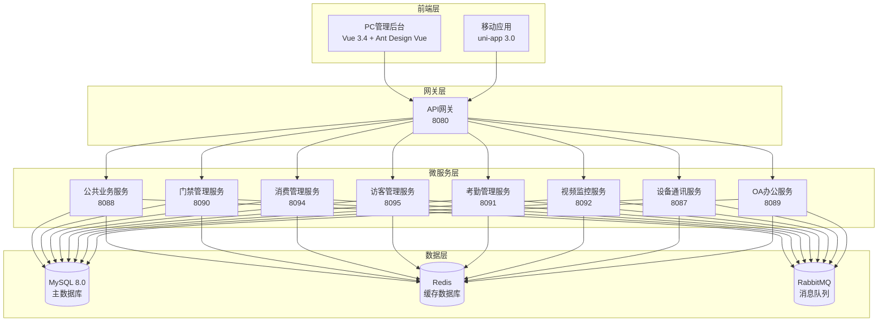

# IOE-DREAM 智慧园区一卡通管理平台 - API开发完整指南

> **版本**: v1.0.0
> **创建日期**: 2025-12-15
> **技术栈**: Spring Boot 3.5.8 + Vue 3.4 + uni-app 3.0
> **项目**: IOE-DREAM智慧园区一卡通管理平台

---

## 📋 目录

1. [项目概述](#1-项目概述)
2. [技术架构](#2-技术架构)
3. [API设计原则](#3-api设计原则)
4. [URL设计规范](#4-url设计规范)
5. [HTTP方法规范](#5-http方法规范)
6. [请求响应规范](#6-请求响应规范)
7. [数据模型规范](#7-数据模型规范)
8. [错误处理规范](#8-错误处理规范)
9. [版本控制规范](#9-版本控制规范)
10. [安全规范](#10-安全规范)
11. [移动端开发规范](#11-移动端开发规范)
12. [前端开发规范](#12-前端开发规范)
13. [开发模板](#13-开发模板)
14. [最佳实践](#14-最佳实践)
15. [检查清单](#15-检查清单)

---

## 1. 项目概述

### 1.1 项目介绍

IOE-DREAM（Intelligent Operations & Enterprise - Digital Resource & Enterprise Application Management）是基于Spring Boot 3.5.8 + Spring Cloud 2025.0.0 + Vue3 + uni-app构建的新一代**智慧园区一卡通管理平台**。

### 1.2 核心功能模块

| 模块 | 功能描述 | 微服务端口 | 前端路由 |
|------|---------|-----------|----------|
| **门禁管理** | 门禁控制、通行记录、权限验证 | 8090 | /access |
| **消费管理** | 消费交易、账户管理、退款处理 | 8094 | /consume |
| **访客管理** | 访客预约、访客登记、访问记录 | 8095 | /visitor |
| **考勤管理** | 考勤打卡、排班管理、加班统计 | 8091 | /attendance |
| **视频监控** | 视频设备、录像回放、AI分析 | 8092 | /video |
| **设备管理** | 设备信息、协议适配、状态监控 | 8087 | /device |
| **用户管理** | 用户信息、权限管理、组织架构 | 8088 | /system |
| **OA办公** | 工作流、审批、OA办公 | 8089 | /oa |

### 1.3 技术架构图



---

## 2. 技术架构

### 2.1 后端技术栈

| 组件 | 技术选型 | 版本 | 说明 |
|------|----------|------|------|
| **框架** | Spring Boot | 3.5.8 | 主框架 |
| **微服务** | Spring Cloud | 2025.0.0 | 微服务治理 |
| **数据库** | MySQL | 8.0 | 主数据库 |
| **ORM** | MyBatis-Plus | 3.5.15 | 数据访问层 |
| **缓存** | Redis | 7.x | 分布式缓存 |
| **消息队列** | RabbitMQ | 3.12 | 异步消息 |
| **注册中心** | Nacos | 2.3.0 | 服务注册发现 |
| **配置中心** | Nacos | 2.3.0 | 配置管理 |
| **API文档** | Swagger | 3.0 | 接口文档 |
| **监控** | Micrometer + Prometheus | - | 性能监控 |

### 2.2 前端技术栈

| 组件 | PC端技术 | 移动端技术 | 说明 |
|------|----------|------------|------|
| **框架** | Vue 3.4 | uni-app 3.0 | 前端框架 |
| **构建工具** | Vite 5 | Vite 4 | 构建工具 |
| **UI组件** | Ant Design Vue 4 | uni-ui | UI组件库 |
| **状态管理** | Pinia 2.x | Pinia 2.0.x | 状态管理 |
| **HTTP客户端** | Axios 1.6 | uni.request | 网络请求 |
| **路由管理** | Vue Router 4.x | uni-app内置 | 路由管理 |
| **TypeScript** | TypeScript 5.x | - | 类型系统 |
| **国际化** | Vue I18n 9.x | - | 国际化 |

### 2.3 开发环境

| 环境 | 说明 |
|------|------|
| **开发工具** | IntelliJ IDEA + VS Code |
| **版本控制** | Git |
| **依赖管理** | Maven 3.9.x |
| **容器化** | Docker + Docker Compose |
| **CI/CD** | GitHub Actions / GitLab CI |
| **监控** | Prometheus + Grafana |
| **日志** | ELK Stack |

---

## 3. API设计原则

### 3.1 核心原则

**RESTful设计**：严格遵循REST架构风格，使用统一的资源定位符

**统一性**：所有API遵循统一的设计规范和响应格式

**向后兼容**：API变更必须保证向后兼容，新增字段不影响老版本

**幂等性**：GET、PUT、DELETE操作必须是幂等的

**可预测性**：API行为应该是可预测的，一致的命名和行为

### 3.2 设计目标

```yaml
性能目标:
  - 响应时间: < 200ms (P95)
  - 并发支持: 1000+ TPS
  - 可用性: 99.9%

质量目标:
  - 接口一致性: 100%
  - 文档完整性: 100%
  - 测试覆盖率: ≥ 80%
```

---

## 4. URL设计规范

### 4.1 基础URL结构

```yaml
# 标准URL格式
{base_url}/api/v{version}/{module}/{entity}[/{action}][?{query_params}]

# 示例
https://api.ioedream.com/api/v1/access/record/query
https://api.ioedream.com/api/v1/consume/transaction/execute
https://api.ioedream.com/api/v1/mobile/access/check
```

### 4.2 URL命名规范

| 组件 | 规范 | 示例 |
|------|------|------|
| **base_url** | 域名或IP | `https://api.ioedream.com` |
| **api** | 固定前缀 | `/api` |
| **version** | 版本号 | `/v1`, `/v2` |
| **module** | 业务模块 | `/access`, `/consume`, `/visitor` |
| **entity** | 资源实体 | `/record`, `/device`, `/transaction` |
| **action** | 操作动作 | `/query`, `/create`, `/update` |

### 4.3 模块划分标准

| 模块 | 路径前缀 | 说明 |
|------|---------|------|
| **门禁管理** | `/api/v1/access` | 门禁设备、通行记录、权限验证 |
| **消费管理** | `/api/v1/consume` | 消费交易、账户管理、退款处理 |
| **访客管理** | `/api/v1/visitor` | 访客预约、访客登记、访问记录 |
| **考勤管理** | `/api/v1/attendance` | 考勤打卡、排班管理、加班统计 |
| **视频监控** | `/api/v1/video` | 视频设备、录像回放、AI分析 |
| **设备管理** | `/api/v1/device` | 设备信息、协议适配、状态监控 |
| **用户管理** | `/api/v1/system/user` | 用户信息、权限管理、组织架构 |
| **公共接口** | `/api/v1/support` | 字典管理、文件上传、系统配置 |

### 4.4 移动端专用路径

```yaml
# 移动端专用前缀
/api/v1/mobile/{module}/{action}

# 示例
/api/v1/mobile/access/check          # 移动端门禁检查
/api/v1/mobile/consume/quick          # 移动端快速消费
/api/v1/mobile/attendance/clock       # 移动端考勤打卡
/api/v1/mobile/visitor/checkin        # 移动端访客签到
```

---

## 5. HTTP方法规范

### 5.1 方法语义

| HTTP方法 | 操作类型 | 幂等性 | 安全性 | 使用场景 |
|---------|---------|--------|--------|----------|
| **GET** | 查询 | ✅ | ✅ | 获取资源、列表查询、详情查询 |
| **POST** | 创建 | ❌ | ❌ | 创建资源、执行业务操作、批量处理 |
| **PUT** | 更新 | ✅ | ❌ | 全量更新资源、替换资源 |
| **PATCH** | 部分更新 | ❌ | ❌ | 部分更新字段、状态修改 |
| **DELETE** | 删除 | ✅ | ❌ | 删除资源、批量删除 |

### 5.2 使用规范

#### 5.2.1 GET操作
```java
// 查询列表
@GetMapping("/records")
public ResponseDTO<PageResult<AccessRecordVO>> queryRecords(
        @Valid AccessRecordQueryDTO queryDTO) {}

// 查询详情
@GetMapping("/records/{id}")
public ResponseDTO<AccessRecordDetailVO> getRecordDetail(
        @PathVariable Long id) {}

// 条件查询
@GetMapping("/devices")
public ResponseDTO<List<DeviceVO>> getDevices(
        @RequestParam(required = false) String type,
        @RequestParam(required = false) String status) {}
```

#### 5.2.2 POST操作
```java
// 创建资源
@PostMapping("/records")
@PreAuthorize("hasPermission('access:record:create')")
public ResponseDTO<AccessRecordVO> createRecord(
        @Valid @RequestBody AccessRecordCreateDTO createDTO) {}

// 执行业务操作
@PostMapping("/transaction/execute")
@PreAuthorize("hasPermission('consume:transaction:execute')")
public ResponseDTO<ConsumeResultVO> executeTransaction(
        @Valid @RequestBody ConsumeTransactionRequestDTO requestDTO) {}

// 批量操作
@PostMapping("/batch/create")
@PreAuthorize("hasPermission('user:batch:create')")
public ResponseDTO<List<UserVO>> batchCreateUsers(
        @Valid @RequestBody List<UserCreateDTO> createDTOs) {}
```

#### 5.2.3 PUT操作
```java
// 更新资源
@PutMapping("/records/{id}")
@PreAuthorize("hasPermission('access:record:update')")
public ResponseDTO<AccessRecordVO> updateRecord(
        @PathVariable Long id,
        @Valid @RequestBody AccessRecordUpdateDTO updateDTO) {}

// 状态更新
@PutMapping("/records/{id}/status")
@PreAuthorize("hasPermission('access:record:status')")
public ResponseDTO<Void> updateRecordStatus(
        @PathVariable Long id,
        @RequestParam String status) {}
```

#### 5.2.4 DELETE操作
```java
// 删除资源
@DeleteMapping("/records/{id}")
@PreAuthorize("hasPermission('access:record:delete')")
public ResponseDTO<Void> deleteRecord(@PathVariable Long id) {}

// 批量删除
@DeleteMapping("/records")
@PreAuthorize("hasPermission('access:record:batch-delete')")
public ResponseDTO<Void> batchDeleteRecords(
        @RequestParam List<Long> ids) {}
```

---

## 6. 请求响应规范

### 6.1 请求格式规范

#### 6.1.1 请求头规范

```yaml
# 标准请求头
Content-Type: application/json;charset=UTF-8
Accept: application/json
Authorization: Bearer {access_token}
X-Request-ID: {unique_request_id}
X-Timestamp: {unix_timestamp}
X-Client-Version: {client_version}

# 移动端特有
X-Platform: ios|android|web
X-Device-ID: {unique_device_id}
X-App-Version: {app_version}
```

#### 6.1.2 请求体格式

```java
// 标准请求DTO
@Data
@Schema(description = "消费交易创建请求")
public class ConsumeTransactionRequestDTO {

    @NotNull(message = "用户ID不能为空")
    @Schema(description = "用户ID", example = "1001")
    private Long userId;

    @NotNull(message = "消费金额不能为空")
    @DecimalMin(value = "0.01", message = "消费金额必须大于0")
    @Schema(description = "消费金额", example = "15.50")
    private BigDecimal amount;

    @Schema(description = "消费方式", example = "FACE",
             allowableValues = {"CARD", "FACE", "NFC", "QR"})
    private String consumeMode;

    @Schema(description = "设备信息")
    @Valid
    private DeviceInfoDTO deviceInfo;

    @Schema(description = "扩展属性")
    private Map<String, Object> extendedAttributes;
}
```

### 6.2 响应格式规范

#### 6.2.1 统一响应格式

```java
// 标准响应DTO
@Data
@JsonInclude(JsonInclude.Include.NON_NULL)
public class ResponseDTO<T> {

    @Schema(description = "业务状态码", example = "200")
    private Integer code;

    @Schema(description = "响应消息", example = "操作成功")
    private String message;

    @Schema(description = "响应数据")
    private T data;

    @Schema(description = "时间戳", example = "1703847600000")
    private Long timestamp;

    @Schema(description = "请求追踪ID", example = "req_123456789")
    private String traceId;

    // 成功响应
    public static <T> ResponseDTO<T> ok(T data) {
        ResponseDTO<T> response = new ResponseDTO<>();
        response.setCode(200);
        response.setMessage("success");
        response.setData(data);
        response.setTimestamp(System.currentTimeMillis());
        return response;
    }

    // 错误响应
    public static <T> ResponseDTO<T> error(Integer code, String message) {
        ResponseDTO<T> response = new ResponseDTO<>();
        response.setCode(code);
        response.setMessage(message);
        response.setTimestamp(System.currentTimeMillis());
        return response;
    }
}
```

#### 6.2.2 分页响应格式

```java
// 分页结果DTO
@Data
@JsonInclude(JsonInclude.Include.NON_NULL)
public class PageResult<T> {

    @Schema(description = "数据列表")
    private List<T> list;

    @Schema(description = "总记录数", example = "1000")
    private Long total;

    @Schema(description = "当前页码", example = "1")
    private Integer pageNum;

    @Schema(description = "每页大小", example = "20")
    private Integer pageSize;

    @Schema(description = "总页数", example = "50")
    private Integer pages;

    @Schema(description = "是否有下一页", example = "true")
    private Boolean hasNext;

    @Schema(description = "是否有上一页", example = "false")
    private Boolean hasPrev;

    // 计算分页信息
    public static <T> PageResult<T> of(List<T> list, Long total, Integer pageNum, Integer pageSize) {
        PageResult<T> result = new PageResult<>();
        result.setList(list);
        result.setTotal(total);
        result.setPageNum(pageNum);
        result.setPageSize(pageSize);
        result.setPages((int) Math.ceil((double) total / pageSize));
        result.setHasNext(pageNum < result.getPages());
        result.setHasPrev(pageNum > 1);
        return result;
    }
}
```

### 6.3 响应示例

```yaml
# 成功响应
{
  "code": 200,
  "message": "操作成功",
  "data": {
    "id": 1001,
    "name": "张三",
    "email": "zhangsan@company.com"
  },
  "timestamp": 1703847600000,
  "traceId": "req_123456789"
}

# 分页响应
{
  "code": 200,
  "message": "查询成功",
  "data": {
    "list": [...],
    "total": 1000,
    "pageNum": 1,
    "pageSize": 20,
    "pages": 50,
    "hasNext": true,
    "hasPrev": false
  },
  "timestamp": 1703847600000,
  "traceId": "req_123456789"
}

# 错误响应
{
  "code": 400,
  "message": "参数验证失败",
  "data": null,
  "timestamp": 1703847600000,
  "traceId": "req_123456789"
}
```

---

## 7. 数据模型规范

### 7.1 实体设计规范

#### 7.1.1 基础实体

```java
// 基础实体 - 所有业务实体继承
@Data
@EqualsAndHashCode(callSuper = true)
@TableName("t_{$table_name}")
public class BaseEntity {

    @TableId(type = IdType.ASSIGN_ID)
    @Schema(description = "主键ID", example = "1001")
    private Long id;

    @TableField(fill = FieldFill.INSERT)
    @Schema(description = "创建时间", example = "1703847600")
    private Long createTime;

    @TableField(fill = FieldFill.INSERT_UPDATE)
    @Schema(description = "更新时间", example = "1703847600")
    private Long updateTime;

    @TableField(fill = FieldFill.INSERT)
    @Schema(description = "创建人ID", example = "1001")
    private Long createUserId;

    @TableField(fill = FieldFill.INSERT_UPDATE)
    @Schema(description = "更新人ID", example = "1001")
    private Long updateUserId;

    @TableLogic
    @TableField("deleted_flag")
    @Schema(description = "删除标记", example = "0")
    private Integer deletedFlag;

    @Version
    @Schema(description = "乐观锁版本号", example = "1")
    private Integer version;
}
```

#### 7.1.2 业务实体示例

```java
// 消费交易实体
@Data
@EqualsAndHashCode(callSuper = true)
@TableName("t_consume_transaction")
@Schema(description = "消费交易记录")
public class ConsumeTransactionEntity extends BaseEntity {

    @NotNull
    @Schema(description = "交易流水号", example = "TXN2025121500001")
    @TableField("transaction_no")
    private String transactionNo;

    @NotNull
    @Schema(description = "用户ID", example = "1001")
    @TableField("user_id")
    private Long userId;

    @NotNull
    @DecimalMin(value = "0.01")
    @Schema(description = "交易金额", example = "15.50")
    @TableField("amount")
    private BigDecimal amount;

    @Schema(description = "消费方式", example = "FACE")
    @TableField("consume_mode")
    private String consumeMode;

    @Schema(description = "设备ID", example = "DEV001")
    @TableField("device_id")
    private String deviceId;

    @Schema(description = "交易状态", example = "SUCCESS")
    @TableField("status")
    private String status;

    @Schema(description = "交易时间")
    @TableField("transaction_time")
    private LocalDateTime transactionTime;

    @Schema(description = "扩展属性")
    @TableField("extended_attributes")
    private String extendedAttributes; // JSON格式
}
```

### 7.2 DTO设计规范

#### 7.2.1 请求DTO

```java
// 创建请求DTO
@Data
@Schema(description = "消费交易创建请求")
public class ConsumeTransactionCreateDTO {

    @NotNull(message = "用户ID不能为空")
    @Schema(description = "用户ID", example = "1001")
    private Long userId;

    @NotNull(message = "消费金额不能为空")
    @DecimalMin(value = "0.01", message = "消费金额必须大于0")
    @DecimalMax(value = "10000.00", message = "消费金额不能超过10000")
    @Schema(description = "消费金额", example = "15.50")
    private BigDecimal amount;

    @NotBlank(message = "消费方式不能为空")
    @Pattern(regexp = "^(CARD|FACE|NFC|QR)$", message = "消费方式必须是CARD、FACE、NFC、QR之一")
    @Schema(description = "消费方式", example = "FACE", allowableValues = {"CARD", "FACE", "NFC", "QR"})
    private String consumeMode;

    @Schema(description = "设备信息")
    @Valid
    private DeviceInfoDTO deviceInfo;

    @Schema(description = "备注信息")
    @Size(max = 500, message = "备注信息不能超过500字符")
    private String remark;
}

// 查询请求DTO
@Data
@Schema(description = "消费交易查询请求")
public class ConsumeTransactionQueryDTO {

    @Schema(description = "用户ID", example = "1001")
    private Long userId;

    @Schema(description = "交易流水号", example = "TXN2025121500001")
    private String transactionNo;

    @Schema(description = "消费方式", example = "FACE")
    private String consumeMode;

    @Schema(description = "交易状态", example = "SUCCESS")
    private String status;

    @Schema(description = "开始时间", example = "2025-12-01T00:00:00")
    @JsonFormat(pattern = "yyyy-MM-dd HH:mm:ss")
    private LocalDateTime startTime;

    @Schema(description = "结束时间", example = "2025-12-31T23:59:59")
    @JsonFormat(pattern = "yyyy-MM-dd HH:mm:ss")
    private LocalDateTime endTime;

    @Min(value = 1, message = "页码必须大于0")
    @Schema(description = "页码", example = "1", defaultValue = "1")
    private Integer pageNum = 1;

    @Min(value = 1, message = "每页大小必须大于0")
    @Max(value = 100, message = "每页大小不能超过100")
    @Schema(description = "每页大小", example = "20", defaultValue = "20")
    private Integer pageSize = 20;

    @Schema(description = "排序字段", example = "transactionTime")
    private String orderBy = "transactionTime";

    @Schema(description = "排序方向", example = "desc", allowableValues = {"asc", "desc"})
    private String orderDirection = "desc";
}
```

#### 7.2.2 响应VO

```java
// 详情响应VO
@Data
@Schema(description = "消费交易详情")
public class ConsumeTransactionDetailVO {

    @Schema(description = "交易ID", example = "1001")
    private Long id;

    @Schema(description = "交易流水号", example = "TXN2025121500001")
    private String transactionNo;

    @Schema(description = "用户信息")
    private UserBasicInfoVO userInfo;

    @Schema(description = "交易金额", example = "15.50")
    private BigDecimal amount;

    @Schema(description = "消费方式", example = "FACE")
    private String consumeMode;

    @Schema(description = "消费方式名称", example = "人脸识别")
    private String consumeModeName;

    @Schema(description = "设备信息")
    private DeviceBasicInfoVO deviceInfo;

    @Schema(description = "交易状态", example = "SUCCESS")
    private String status;

    @Schema(description = "交易状态名称", example = "交易成功")
    private String statusName;

    @Schema(description = "交易时间", example = "2025-12-15T10:30:00")
    @JsonFormat(pattern = "yyyy-MM-dd HH:mm:ss")
    private LocalDateTime transactionTime;

    @Schema(description = "备注信息")
    private String remark;

    @Schema(description = "创建时间", example = "2025-12-15T10:30:00")
    @JsonFormat(pattern = "yyyy-MM-dd HH:mm:ss")
    private LocalDateTime createTime;
}

// 列表响应VO
@Data
@Schema(description = "消费交易列表项")
public class ConsumeTransactionListItemVO {

    @Schema(description = "交易ID", example = "1001")
    private Long id;

    @Schema(description = "交易流水号", example = "TXN2025121500001")
    private String transactionNo;

    @Schema(description = "用户姓名", example = "张三")
    private String userName;

    @Schema(description = "用户编号", example = "EMP001")
    private String userNo;

    @Schema(description = "交易金额", example = "15.50")
    private BigDecimal amount;

    @Schema(description = "消费方式", example = "FACE")
    private String consumeMode;

    @Schema(description = "消费方式名称", example = "人脸识别")
    private String consumeModeName;

    @Schema(description = "设备位置", example = "A栋1楼餐厅")
    private String deviceLocation;

    @Schema(description = "交易状态", example = "SUCCESS")
    private String status;

    @Schema(description = "交易状态名称", example = "交易成功")
    private String statusName;

    @Schema(description = "交易时间", example = "2025-12-15T10:30:00")
    @JsonFormat(pattern = "yyyy-MM-dd HH:mm:ss")
    private LocalDateTime transactionTime;
}
```

### 7.3 数据转换规范

```java
// DTO转换器
@Component
public class ConsumeTransactionConverter {

    @Resource
    private UserConverter userConverter;

    @Resource
    private DeviceConverter deviceConverter;

    // Entity -> DetailVO
    public ConsumeTransactionDetailVO toDetailVO(ConsumeTransactionEntity entity) {
        if (entity == null) {
            return null;
        }

        ConsumeTransactionDetailVO vo = new ConsumeTransactionDetailVO();
        BeanUtils.copyProperties(entity, vo);

        // 设置用户信息
        vo.setUserInfo(userConverter.toBasicInfo(entity.getUser()));

        // 设置设备信息
        vo.setDeviceInfo(deviceConverter.toBasicInfo(entity.getDevice()));

        // 设置枚举名称
        vo.setConsumeModeName(ConsumeModeEnum.getNameByCode(entity.getConsumeMode()));
        vo.setStatusName(TransactionStatusEnum.getNameByCode(entity.getStatus()));

        return vo;
    }

    // Entity -> ListItemVO
    public ConsumeTransactionListItemVO toListItemVO(ConsumeTransactionEntity entity) {
        if (entity == null) {
            return null;
        }

        ConsumeTransactionListItemVO vo = new ConsumeTransactionListItemVO();
        BeanUtils.copyProperties(entity, vo);

        // 设置用户基本信息
        vo.setUserName(entity.getUser().getUserName());
        vo.setUserNo(entity.getUser().getUserNo());

        // 设置设备位置
        vo.setDeviceLocation(entity.getDevice().getLocation());

        // 设置枚举名称
        vo.setConsumeModeName(ConsumeModeEnum.getNameByCode(entity.getConsumeMode()));
        vo.setStatusName(TransactionStatusEnum.getNameByCode(entity.getStatus()));

        return vo;
    }
}
```

---

## 8. 错误处理规范

### 8.1 错误码设计

#### 8.1.1 错误码结构

```
错误码格式: {模块码}{错误类型码}{具体错误码}
- 模块码: 2位数字 (01-99)
- 错误类型码: 1位数字 (1-9)
- 具体错误码: 2位数字 (01-99)

示例:
- 1001: 系统通用错误
- 1101: 用户模块参数错误
- 1201: 门禁模块业务错误
- 1301: 消费模块业务错误
```

#### 8.1.2 错误码分类

| 模块码 | 模块名称 | 说明 |
|--------|---------|------|
| **10** | **系统通用** | 系统级错误、认证授权、网络等 |
| **11** | **用户管理** | 用户、权限、组织架构等 |
| **12** | **门禁管理** | 门禁设备、通行记录、权限验证等 |
| **13** | **消费管理** | 消费交易、账户管理、退款等 |
| **14** | **访客管理** | 访客预约、访客登记等 |
| **15** | **考勤管理** | 考勤打卡、排班管理等 |
| **16** | **视频监控** | 视频设备、录像回放等 |
| **17** | **设备管理** | 设备信息、协议适配等 |
| **18** | **OA办公** | 工作流、审批等 |

| 错误类型码 | 类型说明 | HTTP状态码 |
|------------|---------|-----------|
| **1** | 参数错误 | 400 |
| **2** | 认证错误 | 401 |
| **3** | 授权错误 | 403 |
| **4** | 资源不存在 | 404 |
| **5** | 业务错误 | 422 |
| **9** | 系统错误 | 500 |

### 8.2 异常处理实现

#### 8.2.1 自定义异常

```java
// 业务异常基类
@Data
@EqualsAndHashCode(callSuper = true)
public class BusinessException extends RuntimeException {

    private final Integer code;
    private final String message;

    public BusinessException(Integer code, String message) {
        super(message);
        this.code = code;
        this.message = message;
    }

    public BusinessException(String message) {
        this(500, message);
    }
}

// 参数验证异常
public class ParamException extends BusinessException {
    public ParamException(String message) {
        super(400, message);
    }
}

// 认证异常
public class AuthenticationException extends BusinessException {
    public AuthenticationException(String message) {
        super(401, message);
    }
}

// 授权异常
public class AuthorizationException extends BusinessException {
    public AuthorizationException(String message) {
        super(403, message);
    }
}

// 资源不存在异常
public class ResourceNotFoundException extends BusinessException {
    public ResourceNotFoundException(String message) {
        super(404, message);
    }
}
```

#### 8.2.2 全局异常处理器

```java
@RestControllerAdvice
@Slf4j
public class GlobalExceptionHandler {

    // 业务异常处理
    @ExceptionHandler(BusinessException.class)
    @ResponseStatus(HttpStatus.OK)
    public ResponseDTO<Void> handleBusinessException(BusinessException e) {
        log.warn("[业务异常] code={}, message={}", e.getCode(), e.getMessage());
        return ResponseDTO.error(e.getCode(), e.getMessage());
    }

    // 参数验证异常处理
    @ExceptionHandler(MethodArgumentNotValidException.class)
    @ResponseStatus(HttpStatus.BAD_REQUEST)
    public ResponseDTO<Map<String, String>> handleValidationException(
            MethodArgumentNotValidException e) {

        Map<String, String> errors = e.getBindingResult().getFieldErrors().stream()
                .collect(Collectors.toMap(
                    FieldError::getField,
                    FieldError::getDefaultMessage,
                    (existing, replacement) -> existing
                ));

        log.warn("[参数验证异常] errors={}", errors);
        return ResponseDTO.error(1001, "参数验证失败", errors);
    }

    // 约束违反异常处理
    @ExceptionHandler(ConstraintViolationException.class)
    @ResponseStatus(HttpStatus.BAD_REQUEST)
    public ResponseDTO<Map<String, String>> handleConstraintViolationException(
            ConstraintViolationException e) {

        Map<String, String> errors = e.getConstraintViolations().stream()
                .collect(Collectors.toMap(
                    violation -> {
                        String propertyPath = violation.getPropertyPath().toString();
                        return propertyPath.substring(propertyPath.lastIndexOf('.') + 1);
                    },
                    violation -> {
                        String message = violation.getMessage();
                        return message.replaceAll("\\{[^}]*\\}", "");
                    },
                    (existing, replacement) -> existing
                ));

        log.warn("[约束违反异常] errors={}", errors);
        return ResponseDTO.error(1001, "参数验证失败", errors);
    }

    // 系统异常处理
    @ExceptionHandler(Exception.class)
    @ResponseStatus(HttpStatus.INTERNAL_SERVER_ERROR)
    public ResponseDTO<Void> handleException(Exception e) {
        String traceId = MDC.get("traceId");
        log.error("[系统异常] traceId={}, error={}", traceId, e.getMessage(), e);
        return ResponseDTO.error(5000, "系统内部错误，请稍后重试");
    }
}
```

---

## 9. 版本控制规范

### 9.1 API版本策略

#### 9.1.1 版本控制方式

```yaml
# URL路径版本控制（推荐）
/api/v1/users
/api/v2/users

# 请求头版本控制（备选）
Accept: application/vnd.ioedream.v1+json
Accept: application/vnd.ioedream.v2+json

# 查询参数版本控制（不推荐）
/users?version=v1
```

#### 9.1.2 版本兼容性

```yaml
# 版本兼容性矩阵
v1: 基础版本，核心功能
v2: 增强版本，新增字段，向后兼容v1
v3: 重大更新，可能不兼容v1，但兼容v2

# 版本生命周期
- 发布后至少维护2年
- 新版本发布后，旧版本维持1年支持
- 废弃版本提前6个月通知
```

### 9.2 版本演进策略

```java
// v1版本Controller
@RestController
@RequestMapping("/api/v1/users")
@Api(tags = "用户管理v1")
public class UserV1Controller {

    @GetMapping("/{id}")
    public ResponseDTO<UserV1VO> getUser(@PathVariable Long id) {
        // v1版本实现
    }
}

// v2版本Controller - 向后兼容
@RestController
@RequestMapping("/api/v2/users")
@Api(tags = "用户管理v2")
public class UserV2Controller {

    @GetMapping("/{id}")
    public ResponseDTO<UserV2VO> getUser(@PathVariable Long id) {
        // v2版本实现，包含更多字段
        // 同时支持v1客户端访问时降级返回
    }

    @GetMapping("/v1-compat/{id}")
    public ResponseDTO<UserV1VO> getUserV1Compat(@PathVariable Long id) {
        // v1兼容接口，支持v1客户端无缝升级
    }
}
```

---

## 10. 安全规范

### 10.1 认证授权

#### 10.1.1 Token规范

```yaml
# JWT Token结构
Header: {
  "alg": "HS256",
  "typ": "JWT"
}

Payload: {
  "sub": "1001",              # 用户ID
  "username": "zhangsan",     # 用户名
  "roles": ["USER", "EMPLOYEE"], # 角色列表
  "permissions": ["access:read", "consume:create"], # 权限列表
  "iat": 1703847600,          # 签发时间
  "exp": 1703851200,          # 过期时间
  "iss": "ioedream-api",      # 签发者
  "aud": "ioedream-client"    # 受众
}

Signature: HMACSHA256(base64UrlEncode(header) + "." + base64UrlEncode(payload), secret)
```

#### 10.1.2 权限控制

```java
// 方法级权限控制
@RestController
@RequestMapping("/api/v1/consume")
@PreAuthorize("hasRole('CONSUME_USER') or hasRole('CONSUME_MANAGER')")
public class ConsumeController {

    @PostMapping("/transaction/execute")
    @PreAuthorize("hasPermission('consume:transaction:execute')")
    public ResponseDTO<ConsumeResultVO> executeTransaction(
            @Valid @RequestBody ConsumeTransactionCreateDTO request) {
        // 执行消费交易
    }

    @GetMapping("/account/balance")
    @PreAuthorize("hasPermission('consume:account:read')")
    public ResponseDTO<AccountBalanceVO> getAccountBalance(
            @RequestParam Long userId) {
        // 查询账户余额
    }

    // 数据级权限控制
    @GetMapping("/transaction/query")
    @PreAuthorize("@dataPermissionService.hasPermission(authentication, #queryDTO.userId)")
    public ResponseDTO<PageResult<ConsumeTransactionListItemVO>> queryTransactions(
            @Valid ConsumeTransactionQueryDTO queryDTO) {
        // 查询交易记录（只能查询有权限的数据）
    }
}
```

### 10.2 数据安全

#### 10.2.1 数据加密

```java
// 请求加密
@Component
public class RequestEncryptor {

    @Value("${app.api.encrypt.key}")
    private String encryptKey;

    @Value("${app.api.encrypt.enabled:false}")
    private Boolean encryptEnabled;

    public String encrypt(String data) {
        if (!encryptEnabled || StringUtils.isEmpty(data)) {
            return data;
        }

        try {
            // AES加密实现
            Cipher cipher = Cipher.getInstance("AES/GCM/NoPadding");
            SecretKeySpec keySpec = new SecretKeySpec(encryptKey.getBytes(), "AES");
            GCMParameterSpec gcmSpec = new GCMParameterSpec(128, new byte[12]);
            cipher.init(Cipher.ENCRYPT_MODE, keySpec, gcmSpec);
            byte[] encrypted = cipher.doFinal(data.getBytes());
            return Base64.getEncoder().encodeToString(encrypted);
        } catch (Exception e) {
            log.error("数据加密失败", e);
            return data;
        }
    }
}

// 响应解密
@Component
public class ResponseDecryptor {

    public String decrypt(String encryptedData) {
        if (StringUtils.isEmpty(encryptedData)) {
            return encryptedData;
        }

        try {
            // AES解密实现
            Cipher cipher = Cipher.getInstance("AES/GCM/NoPadding");
            SecretKeySpec keySpec = new SecretKeySpec(encryptKey.getBytes(), "AES");
            GCMParameterSpec gcmSpec = new GCMParameterSpec(128, new byte[12]);
            cipher.init(Cipher.DECRYPT_MODE, keySpec, gcmSpec);
            byte[] decrypted = cipher.doFinal(Base64.getDecoder().decode(encryptedData));
            return new String(decrypted);
        } catch (Exception e) {
            log.error("数据解密失败", e);
            return encryptedData;
        }
    }
}
```

#### 10.2.2 敏感数据处理

```java
// 敏感数据脱敏
@Component
public class DataMasking {

    // 手机号脱敏
    public String maskPhone(String phone) {
        if (StringUtils.isEmpty(phone) || phone.length() < 11) {
            return phone;
        }
        return phone.replaceAll("(\\d{3})\\d{4}(\\d{4})", "$1****$2");
    }

    // 身份证脱敏
    public String maskIdCard(String idCard) {
        if (StringUtils.isEmpty(idCard) || idCard.length() < 18) {
            return idCard;
        }
        return idCard.replaceAll("(\\d{6})\\d{8}(\\d{4})", "$1********$2");
    }

    // 银行卡号脱敏
    public String maskBankCard(String bankCard) {
        if (StringUtils.isEmpty(bankCard) || bankCard.length() < 16) {
            return bankCard;
        }
        return bankCard.replaceAll("(\\d{4})\\d+(\\d{4})", "$1 **** **** $2");
    }
}

// 在VO中使用脱敏
@Data
public class UserDetailVO {

    @Schema(description = "用户ID")
    private Long id;

    @Schema(description = "用户姓名")
    private String name;

    @Schema(description = "手机号（脱敏）")
    private String maskedPhone;

    @Schema(description = "身份证号（脱敏）")
    private String maskedIdCard;

    @Schema(description = "邮箱地址")
    private String email;
}
```

---

## 11. 移动端开发规范

### 11.1 移动端API路径

```yaml
# 移动端专用前缀
/api/v1/mobile/{module}/{action}

# 核心移动端接口
/api/v1/mobile/access/check          # 移动端门禁检查
/api/v1/mobile/consume/quick          # 移动端快速消费
/api/v1/mobile/attendance/clock       # 移动端考勤打卡
/api/v1/mobile/visitor/checkin        # 移动端访客签到
/api/v1/mobile/user/profile           # 移动端用户信息
```

### 11.2 移动端请求封装

```javascript
// src/lib/request.js
import { getToken, removeToken } from '@/lib/auth';

const BASE_URL = process.env.VUE_APP_API_BASE_URL + '/api/v1';

class MobileRequest {
  constructor() {
    this.baseURL = BASE_URL;
    this.timeout = 30000;
  }

  // 生成请求头
  getHeaders() {
    return {
      'Content-Type': 'application/json',
      'Authorization': `Bearer ${getToken()}`,
      'X-Platform': uni.getSystemInfoSync().platform,
      'X-Device-ID': this.getDeviceId(),
      'X-App-Version': process.env.VUE_APP_VERSION,
      'X-Request-ID': this.generateRequestId(),
      'X-Timestamp': Date.now()
    };
  }

  // 获取设备ID
  getDeviceId() {
    let deviceId = uni.getStorageSync('device_id');
    if (!deviceId) {
      deviceId = this.generateDeviceId();
      uni.setStorageSync('device_id', deviceId);
    }
    return deviceId;
  }

  // 核心请求方法
  request(options) {
    return new Promise((resolve, reject) => {
      const config = {
        url: this.baseURL + options.url,
        method: options.method || 'GET',
        data: options.data || {},
        header: { ...this.getHeaders(), ...options.header },
        timeout: options.timeout || this.timeout
      };

      // 数据加密
      if (options.encrypt) {
        config.data = this.encryptData(config.data);
        config.header['X-Encrypted'] = 'true';
      }

      uni.request({
        ...config,
        success: (response) => {
          this.handleResponse(response, resolve, reject);
        },
        fail: (error) => {
          this.handleError(error, reject);
        }
      });
    });
  }

  // 便捷方法
  get(url, params = {}, options = {}) {
    return this.request({
      url,
      method: 'GET',
      data: params,
      ...options
    });
  }

  post(url, data = {}, options = {}) {
    return this.request({
      url,
      method: 'POST',
      data,
      ...options
    });
  }

  put(url, data = {}, options = {}) {
    return this.request({
      url,
      method: 'PUT',
      data,
      ...options
    });
  }
}

export default new MobileRequest();
```

### 11.3 移动端API封装

```javascript
// src/api/mobile-access.js
import request from '@/lib/request';

export const mobileAccessApi = {
  // 门禁检查
  checkAccess: (data) => {
    return request.post('/mobile/access/check', data, {
      encrypt: true
    });
  },

  // 二维码验证
  verifyQR: (qrCode) => {
    return request.post('/mobile/access/qr/verify', {
      qrCode,
      timestamp: Date.now()
    });
  },

  // NFC验证
  verifyNFC: (nfcData) => {
    return request.post('/mobile/access/nfc/verify', {
      nfcData,
      timestamp: Date.now()
    });
  },

  // 人脸识别验证
  verifyFace: (faceData) => {
    return request.post('/mobile/access/biometric/verify', {
      biometricType: 'FACE',
      biometricData: faceData,
      timestamp: Date.now()
    }, {
      encrypt: true // 生物识别数据必须加密
    });
  },

  // 获取附近设备
  getNearbyDevices: (latitude, longitude, radius = 500) => {
    return request.get('/mobile/access/devices/nearby', {
      latitude,
      longitude,
      radius
    });
  },

  // 获取用户权限
  getUserPermissions: () => {
    return request.get('/mobile/access/permissions');
  }
};
```

### 11.4 移动端生物识别

```javascript
// 生物识别API
export const biometricApi = {
  // 人脸识别
  faceRecognize: (imageData) => {
    return request.post('/mobile/biometric/face/recognize', {
      imageData,
      timestamp: Date.now()
    }, {
      encrypt: true // 生物识别数据必须加密
    });
  },

  // 指纹识别
  fingerprintRecognize: (fingerprintData) => {
    return request.post('/mobile/biometric/fingerprint/recognize', {
      fingerprintData,
      timestamp: Date.now()
    }, {
      encrypt: true
    });
  },

  // 虹膜识别
  irisRecognize: (irisData) => {
    return request.post('/mobile/biometric/iris/recognize', {
      irisData,
      timestamp: Date.now()
    }, {
      encrypt: true
    });
  }
};

// 生物识别处理
export const processBiometricData = (imageData) => {
  // 1. 图像预处理
  const processedImage = preprocessImage(imageData);

  // 2. 特征提取
  const features = extractFeatures(processedImage);

  // 3. 数据加密
  return encryptSensitiveData({
    features,
    timestamp: Date.now(),
    deviceId: getDeviceId()
  });
};
```

### 11.5 移动端离线同步

```javascript
// 离线数据存储
export const storeOfflineData = (type, data) => {
  const offlineData = {
    type,
    data,
    timestamp: Date.now(),
    synced: false
  };

  const existingData = uni.getStorageSync('offline_data') || [];
  existingData.push(offlineData);
  uni.setStorageSync('offline_data', existingData);
};

// 同步离线数据
export const syncOfflineData = async () => {
  const offlineData = uni.getStorageSync('offline_data') || [];
  const unsyncedData = offlineData.filter(item => !item.synced);

  for (const item of unsyncedData) {
    try {
      await request.post(`/mobile/sync/${item.type}`, item.data);
      item.synced = true;
      item.syncTime = Date.now();
    } catch (error) {
      console.error('同步失败:', error);
    }
  }

  uni.setStorageSync('offline_data', offlineData);
};

// 设备认证
export const deviceAuth = () => {
  const deviceInfo = {
    deviceId: getDeviceId(),
    platform: uni.getSystemInfoSync().platform,
    appVersion: process.env.VUE_APP_VERSION,
    timestamp: Date.now()
  };

  return request.post('/mobile/device/auth', deviceInfo);
};

// 设备心跳
export const deviceHeartbeat = () => {
  return request.post('/mobile/device/heartbeat', {
    deviceId: getDeviceId(),
    status: 'ONLINE',
    batteryLevel: getBatteryLevel(),
    timestamp: Date.now()
  });
};
```

---

## 12. 前端开发规范

### 12.1 前端技术栈

| 组件 | 技术选型 | 版本 | 说明 |
|------|----------|------|------|
| **框架** | Vue 3.4 | Composition API | 主框架 |
| **构建工具** | Vite 5 | - | 构建工具 |
| **UI组件** | Ant Design Vue 4 | 4.x | UI组件库 |
| **状态管理** | Pinia 2.x | - | 状态管理 |
| **HTTP客户端** | Axios | 1.6 | 网络请求 |
| **路由管理** | Vue Router 4.x | - | 路由管理 |
| **TypeScript** | TypeScript 5.x | - | 类型系统 |
| **国际化** | Vue I18n 9.x | - | 国际化 |

### 12.2 前端项目结构

```
src/
├── api/                    # API接口定义
│   ├── access.js            # 门禁管理API
│   ├── consume.js           # 消费管理API
│   ├── visitor.js            # 访客管理API
│   ├── attendance.js        # 考勤管理API
│   ├── system.js             # 系统管理API
│   └── request.js            # 网络请求封装
│   └── auth.js              # 认证相关API
├── components/             # 公共组件
│   ├── form/                # 表单组件
│   ├── table/               # 表格组件
│   ├── upload/              # 上传组件
│   ├── dict/                # 字典组件
│   └── layout/              # 布局组件
├── views/                  # 页面组件
│   ├── system/              # 系统管理
│   │   ├── user/           # 用户管理
│   │   ├── role/           # 角色管理
│   │   └── menu/           # 菜单管理
│   ├── access/              # 门禁管理
│   │   ├── record/         # 通行记录
│   │   ├── device/         # 设备管理
│   │   └── permission/    # 权限管理
│   ├── consume/             # 消费管理
│   │   ├── transaction/    # 交易记录
│   │   ├── account/        # 账户管理
│   │   └── refund/         # 退款管理
│   └── visitor/             # 访客管理
│       ├── appointment/     # 访客预约
│       ├── registration/  # 访客登记
│       └── record/          # 访问记录
│   ├── attendance/          # 考勤管理
│   │   ├── record/         # 考勤记录
│   │   ├── schedule/       # 排班管理
│   │   └── overtime/       # 加班管理
│   └── video/               # 视频监控
│       ├── device/         # 设备管理
│       ├── record/         # 录像管理
│       └── ai/             # AI分析
├── stores/                # 状态管理
│   ├── user.js              # 用户状态
│   ├── app.js               # 应用状态
│   └── permission.js        # 权限状态
├── utils/                 # 工具函数
│   ├── auth.js              # 认证工具
│   ├── permission.js        # 权限工具
│   ├── format.js            # 格式化工具
│   └── validate.js          # 验证工具
└── styles/                # 样式文件
    ├── variables.scss        # SCSS变量
    ├── mixins.scss           # 混入样式
    └── components.scss       # 组件样式
```

### 12.3 前端API封装

#### 12.3.1 基础配置

```javascript
// src/lib/api.js
import axios from 'axios';
import { getToken, removeToken } from '@/lib/auth';
import { message, Modal } from 'ant-design-vue';
import router from '@/router';

// 创建axios实例
const api = axios.create({
  baseURL: import.meta.env.VITE_APP_API_BASE_URL + '/api/v1',
  timeout: 30000,
  headers: {
    'Content-Type': 'application/json;charset=UTF-8',
  }
});

// 请求拦截器
api.interceptors.request.use(
  (config) => {
    // 添加token
    const token = getToken();
    if (token) {
      config.headers.Authorization = `Bearer ${token}`;
    }

    // 添加请求ID
    config.headers['X-Request-ID'] = generateRequestId();

    // 添加时间戳
    config.headers['X-Timestamp'] = Date.now();

    // 数据加密
    if (config.encrypt) {
      config.data = encryptData(config.data);
      config.headers['X-Encrypted'] = 'true';
    }

    return config;
  },
  (error) => {
    return Promise.reject(error);
  }
);

// 响应拦截器
api.interceptors.response.use(
  (response) => {
    const res = response.data;

    // 数据解密
    if (response.config.headers['x-encrypted'] === 'true' && res.encryptData) {
      res.data = decryptData(res.encryptData);
    }

    // 处理成功响应
    if (res.code === 200 || res.success === true) {
      return res;
    }

    // 处理业务错误
    handleBusinessError(res);

    return Promise.reject(new Error(res.message));
  },
  (error) => {
    // 网络错误处理
    handleNetworkError(error);

    return Promise.reject(error);
  }
);

export default api;
```

#### 12.3.2 API服务封装

```javascript
// src/api/base.js
import api from '@/lib/api';

export class BaseApiService {
  constructor(module) {
    this.module = module;
  }

  // 通用查询方法
  query(params) {
    return api.post(`/${this.module}/query`, params);
  }

  // 通用详情方法
  getDetail(id) {
    return api.get(`/${this.module}/${id}`);
  }

  // 通用创建方法
  create(data, options = {}) {
    return api.post(`/${this.module}/create`, data, options);
  }

  // 通用更新方法
  update(id, data, options = {}) {
    return api.put(`/${this.module}/${id}`, data, options);
  }

  // 通用删除方法
  delete(id) {
    return api.delete(`/${this.module}/${id}`);
  }

  // 通用批量删除方法
  batchDelete(ids) {
    return api.post(`/${this.module}/batch-delete`, { ids });
  }

  // 通用状态修改方法
  updateStatus(id, status) {
    return api.put(`/${this.module}/${id}/status`, { status });
  }
}

// 用户服务
class UserService extends BaseApiService {
  constructor() {
    super('system/user');
  }

  // 用户登录
  login(credentials) {
    return api.post('/auth/login', credentials, {
      encrypt: true
    });
  }

  // 获取用户信息
  getProfile() {
    return api.get('/system/user/profile');
  }

  // 修改密码
  changePassword(data) {
    return api.put('/system/user/password', data, {
      encrypt: true
    });
  }
}

export const userService = new UserService();
```

#### 12.3.3 Vue组件中使用

```vue
<template>
  <div class="user-management">
    <!-- 搜索表单 -->
    <a-form
      :model="searchForm"
      layout="inline"
      @finish="handleSearch"
    >
      <a-form-item label="用户名">
        <a-input
          v-model:value="searchForm.username"
          placeholder="请输入用户名"
          allow-clear
        />
      </a-form-item>
      <a-form-item>
        <a-space>
          <a-button type="primary" html-type="submit">
            搜索
          </a-button>
          <a-button @click="handleReset">重置</a-button>
          <a-button type="primary" @click="showCreateModal">
            新增用户
          </a-button>
        </a-space>
      </a-form-item>
    </a-form>

    <!-- 数据表格 -->
    <a-table
      :columns="columns"
      :data-source="tableData"
      :pagination="pagination"
      :loading="loading"
      row-key="id"
      @change="handleTableChange"
    >
      <template #bodyCell="{ column, record }">
        <template v-if="column.key === 'status'">
          <a-tag :color="record.status === 1 ? 'green' : 'red'">
            {{ record.status === 1 ? '启用' : '禁用' }}
          </a-tag>
        </template>
        <template v-else-if="column.key === 'action'">
          <a-space>
            <a-button type="link" size="small" @click="handleEdit(record)">
              编辑
            </a-button>
            <a-popconfirm
              title="确定要删除这个用户吗？"
              @confirm="handleDelete(record)"
            >
              <a-button type="link" size="small" danger>
                删除
              </a-button>
            </a-popconfirm>
          </a-space>
        </template>
      </template>
    </a-table>

    <!-- 创建/编辑弹窗 -->
    <a-modal
      v-model:open="modalVisible"
      :title="modalTitle"
      :confirm-loading="modalLoading"
      @ok="handleModalOk"
      @cancel="handleModalCancel"
    >
      <a-form
        ref="formRef"
        :model="form"
        :rules="formRules"
        layout="vertical"
      >
        <a-form-item label="用户名" name="username">
          <a-input
            v-model:value="form.username"
            placeholder="请输入用户名"
          />
        </a-form-item>
        <a-form-item label="邮箱" name="email">
          <a-input
            v-model:value="form.email"
            placeholder="请输入邮箱"
          />
        </a-form-item>
        <a-form-item label="状态" name="status">
          <a-radio-group v-model:value="form.status">
            <a-radio :value="1">启用</a-radio>
            <a-radio :value="0">禁用</a-radio>
          </a-radio-group>
        </a-form-item>
      </a-form>
    </a-modal>
  </div>
</template>

<script setup>
import { ref, reactive, onMounted } from 'vue';
import { message } from 'ant-design-vue';
import { userService } from '@/api/user';

// 响应式数据
const searchForm = reactive({
  username: '',
  status: undefined
});

const tableData = ref([]);
const loading = ref(false);
const modalVisible = ref(false);
const modalLoading = ref(false);
const modalTitle = ref('');
const editId = ref(null);

const form = reactive({
  username: '',
  email: '',
  status: 1
});

const formRef = ref();

// 分页配置
const pagination = reactive({
  current: 1,
  pageSize: 20,
  total: 0,
  showSizeChanger: true,
  showQuickJumper: true,
  showTotal: (total) => `共 ${total} 条数据`
});

// 表格列配置
const columns = [
  {
    title: 'ID',
    dataIndex: 'id',
    key: 'id',
    width: 80
  },
  {
    title: '用户名',
    dataIndex: 'username',
    key: 'username'
  },
  {
    title: '邮箱',
    dataIndex: 'email',
    key: 'email'
  },
  {
    title: '状态',
    dataIndex: 'status',
    key: 'status',
    width: 100
  },
  {
    title: '创建时间',
    dataIndex: 'createTime',
    key: 'createTime',
    width: 180
  },
  {
    title: '操作',
    key: 'action',
    width: 200
  }
];

// 表单验证规则
const formRules = {
  username: [
    { required: true, message: '请输入用户名', trigger: 'blur' },
    { min: 3, max: 50, message: '用户名长度为3-50个字符', trigger: 'blur' }
  ],
  email: [
    { required: true, message: '请输入邮箱', trigger: 'blur' },
    { type: 'email', message: '请输入正确的邮箱格式', trigger: 'blur' }
  ],
  status: [
    { required: true, message: '请选择状态', trigger: 'change' }
  ]
};

// 生命周期
onMounted(() => {
  loadData();
});

// 方法
const loadData = async () => {
  loading.value = true;
  try {
    const params = {
      pageNum: pagination.current,
      pageSize: pagination.pageSize,
      ...searchForm
    };

    const response = await userService.query(params);
    if (response.code === 200) {
      tableData.value = response.data.list;
      pagination.total = response.data.total;
    }
  } catch (error) {
    console.error('加载数据失败:', error);
  } finally {
    loading.value = false;
  }
};

const handleSearch = () => {
  pagination.current = 1;
  loadData();
};

const handleReset = () => {
  Object.assign(searchForm, {
    username: '',
    status: undefined
  });
  handleSearch();
};

const handleTableChange = (pag) => {
  pagination.current = pag.current;
  pagination.pageSize = pag.pageSize;
  loadData();
};

const showCreateModal = () => {
  modalTitle.value = '新增用户';
  modalVisible.value = true;
  editId.value = null;
  resetForm();
};

const handleEdit = (record) => {
  modalTitle.value = '编辑用户';
  modalVisible.value = true;
  editId.value = record.id;
  Object.assign(form, {
    username: record.username,
    email: record.email,
    status: record.status
  });
};

const handleDelete = async (record) => {
  try {
    const response = await userService.delete(record.id);
    if (response.code === 200) {
      message.success('删除成功');
      loadData();
    }
  } catch (error) {
    console.error('删除失败:', error);
  }
};

const handleModalOk = async () => {
  try {
    await formRef.value.validate();
    modalLoading.value = true;

    let response;
    if (editId.value) {
      response = await userService.update(editId.value, form);
    } else {
      response = await userService.create(form);
    }

    if (response.code === 200) {
      message.success(editId.value ? '更新成功' : '创建成功');
      modalVisible.value = false;
      loadData();
    }
  } catch (error) {
    console.error('操作失败:', error);
  } finally {
    modalLoading.value = false;
  }
};

const handleModalCancel = () => {
  modalVisible.value = false;
  resetForm();
};

const resetForm = () => {
  Object.assign(form, {
    username: '',
    email: '',
    status: 1
  });
  if (formRef.value) {
    formRef.value.resetFields();
  }
};
</script>

<style scoped>
.user-management {
  padding: 20px;
}

.ant-form {
  margin-bottom: 20px;
}
</style>
```

---

## 13. 开发模板

### 13.1 Controller模板

```java
@RestController
@RequestMapping("/api/v1/{module}/{entity}")
@Tag(name = "{业务模块}管理", description = "{业务模块}相关的API接口")
@Slf4j
public class {Entity}Controller {

    @Resource
    private {Entity}Service {entity}Service;

    @Operation(summary = "查询{entity}", description = "分页查询{entity}列表")
    @GetMapping("/query")
    @PreAuthorize("hasPermission('{module}:{entity}:read')")
    public ResponseDTO<PageResult<{Entity}VO>> query{Entity}(
            @Valid {Entity}QueryDTO queryDTO) {
        PageResult<{Entity}VO> result = {entity}Service.query{Entity}(queryDTO);
        return ResponseDTO.ok(result);
    }

    @Operation(summary = "获取{entity}详情", description = "根据ID获取{entity}详细信息")
    @GetMapping("/{id}")
    @PreAuthorize("hasPermission('{module}:{entity}:read')")
    public ResponseDTO<{Entity}DetailVO> get{Entity}(@PathVariable Long id) {
        {Entity}DetailVO result = {entity}Service.get{Entity}Detail(id);
        return ResponseDTO.ok(result);
    }

    @Operation(summary = "创建{entity}", description = "创建新的{entity}")
    @PostMapping("/create")
    @PreAuthorize("hasPermission('{module}:{entity}:create')")
    public ResponseDTO<{Entity}VO> create{Entity}(
            @Valid @RequestBody {Entity}CreateDTO createDTO) {
        {Entity}VO result = {entity}Service.create{Entity}(createDTO);
        return ResponseDTO.ok(result);
    }

    @Operation(summary = "更新{entity}", description = "更新{entity}信息")
    @PutMapping("/{id}")
    @PreAuthorize("hasPermission('{module}:{entity}:update')")
    public ResponseDTO<{Entity}VO> update{Entity}(
            @PathVariable Long id,
            @Valid @RequestBody {Entity}UpdateDTO updateDTO) {
        {Entity}VO result = {entity}Service.update{Entity}(id, updateDTO);
        return ResponseDTO.ok(result);
    }

    @Operation(summary = "删除{entity}", description = "根据ID删除{entity}")
    @DeleteMapping("/{id}")
    @PreAuthorize("hasPermission('{module}:{entity}:delete')")
    public ResponseDTO<Void> delete{Entity}(@PathVariable Long id) {
        {entity}Service.delete{Entity}(id);
        return ResponseDTO.ok();
    }
}
```

### 13.2 Service模板

```java
@Service
@Transactional(rollbackFor = Exception.class)
public class {Entity}ServiceImpl implements {Entity}Service {

    @Resource
    private {Entity}Dao {entity}Dao;

    @Resource
    private {Entity}Manager {entity}Manager;

    @Resource
    private {Entity}Converter {entity}Converter;

    @Override
    @Transactional(readOnly = true)
    public PageResult<{Entity}VO> query{Entity}({Entity}QueryDTO queryDTO) {
        log.info("[{entity}查询] 查询条件: {}", queryDTO);

        // 1. 参数验证
        validateQueryParams(queryDTO);

        // 2. 构建查询条件
        LambdaQueryWrapper<{Entity}Entity> queryWrapper = buildQueryWrapper(queryDTO);

        // 3. 执行分页查询
        Page<{Entity}Entity> page = new Page<>(queryDTO.getPageNum(), queryDTO.getPageSize());
        IPage<{Entity}Entity> pageResult = {entity}Dao.selectPage(page, queryWrapper);

        // 4. 转换为VO
        List<{Entity}VO> voList = pageResult.getRecords().stream()
                .map({entity}Converter::toListItemVO)
                .collect(Collectors.toList());

        // 5. 构建分页结果
        PageResult<{Entity}VO> pageResult = PageResult.of(voList, pageResult.getTotal(),
                pageResult.getCurrent(), pageResult.getSize());

        log.info("[{entity}查询] 查询完成，总数: {}", pageResult.getTotal());
        return pageResult;
    }

    @Override
    @Transactional(rollbackFor = Exception.class)
    public {Entity}DetailVO get{Entity}Detail(Long id) {
        log.info("[{entity}详情] 查询ID: {}", id);

        // 1. 参数验证
        if (id == null) {
            throw new ParamException("ID不能为空");
        }

        // 2. 查询实体
        {Entity}Entity entity = {entity}Dao.selectById(id);
        if (entity == null) {
            throw new ResourceNotFoundException("{entity}不存在，ID: " + id);
        }

        // 3. 转换为详情VO
        {Entity}DetailVO vo = {entity}Converter.toDetailVO(entity);

        log.info("[{entity}详情] 查询完成: {}", vo);
        return vo;
    }

    @Override
    @Transactional(rollbackFor = Exception.class)
    public {Entity}VO create{Entity}({Entity}CreateDTO createDTO) {
        log.info("[{entity}创建] 创建请求: {}", createDTO);

        // 1. 参数验证
        validateCreateParams(createDTO);

        // 2. 业务规则验证
        validateBusinessRules(createDTO);

        // 3. 转换为实体
        {Entity}Entity entity = {entity}Converter.toEntity(createDTO);

        // 4. 保存实体
        {entity}Dao.insert(entity);

        // 5. 转换为VO
        {Entity}VO vo = {entity}Converter.toVO(entity);

        log.info("[{entity}创建] 创建完成: {}", vo);
        return vo;
    }

    @Override
    @Transactional(rollbackFor = Exception.class)
    public {Entity}VO update{Entity}(Long id, {Entity}UpdateDTO updateDTO) {
        log.info("[{entity}更新] 更新请求: ID={}, 更新数据={}", id, updateDTO);

        // 1. 参数验证
        if (id == null) {
            throw new ParamException("ID不能为空");
        }

        validateUpdateParams(updateDTO);

        // 2. 查询现有实体
        {Entity}Entity entity = {entity}Dao.selectById(id);
        if (entity == null) {
            throw new ResourceNotFoundException("{entity}不存在，ID: " + id);
        }

        // 3. 更新实体
        BeanUtils.copyProperties(updateDTO, entity, getNullPropertyNames(updateDTO));

        // 4. 保存实体
        {entity}Dao.updateById(entity);

        // 5. 转换为VO
        {Entity}VO vo = {entity}Converter.toVO(entity);

        log.info("[{entity}更新] 更新完成: {}", vo);
        return vo;
    }

    @Override
    @Transactional(rollbackFor = Exception.class)
    public void delete{Entity}(Long id) {
        log.info("[{entity}删除] 删除ID: {}", id);

        // 1. 参数验证
        if (id == null) {
            throw new ParamException("ID不能为空");
        }

        // 2. 查询实体
        {Entity}Entity entity = {entity}Dao.selectById(id);
        if (entity == null) {
            throw new ResourceNotFoundException("{entity}不存在，ID: " + id);
        }

        // 3. 逻辑删除
        entity.setDeletedFlag(1);
        {entity}Dao.updateById(entity);

        log.info("[{entity}删除] 删除完成: ID={}", id);
    }

    private void validateQueryParams({Entity}QueryDTO queryDTO) {
        // 参数验证逻辑
    }

    private void validateCreateParams({Entity}CreateDTO createDTO) {
        // 创建参数验证逻辑
    }

    private void validateUpdateParams({Entity}UpdateDTO updateDTO) {
        // 更新参数验证逻辑
    }

    private void validateBusinessRules({Entity}CreateDTO createDTO) {
        // 业务规则验证逻辑
    }

    private LambdaQueryWrapper<{Entity}Entity> buildQueryWrapper({Entity}QueryDTO queryDTO) {
        LambdaQueryWrapper<{Entity}Entity> queryWrapper = new LambdaQueryWrapper<>();

        // 基础查询条件
        queryWrapper.eq({Entity}Entity::getDeletedFlag, 0);

        // 动态查询条件
        if (StringUtils.isNotBlank(queryDTO.getName())) {
            queryWrapper.like({Entity}Entity::getName, queryDTO.getName());
        }

        if (queryDTO.getStatus() != null) {
            queryWrapper.eq({Entity}Entity::getStatus, queryDTO.getStatus());
        }

        if (queryDTO.getStartTime() != null) {
            queryWrapper.ge({Entity}Entity::getCreateTime, queryDTO.getStartTime());
        }

        if (queryDTO.getEndTime() != null) {
            queryWrapper.le({Entity}Entity::getCreateTime, queryDTO.getEndTime());
        }

        // 排序
        if (StringUtils.isNotBlank(queryDTO.getOrderBy())) {
            if ("desc".equalsIgnoreCase(queryDTO.getOrderDirection())) {
                queryWrapper.orderByDesc(StrUtil.camelToUnderline(queryDTO.getOrderBy()));
            } else {
                queryWrapper.orderByAsc(StrUtil.camelToUnderline(queryDTO.getOrderBy()));
            }
        }

        return queryWrapper;
    }
}
```

### 13.3 前端组件模板

```vue
<template>
  <div class="base-table-container">
    <!-- 搜索区域 -->
    <div class="search-area" v-if="showSearch">
      <a-form
        :model="searchForm"
        layout="inline"
        @finish="handleSearch"
        class="search-form"
      >
        <slot name="search-form">
          <!-- 搜索表单插槽 -->
        </slot>

        <a-form-item>
          <a-space>
            <a-button type="primary" html-type="submit">
              <SearchOutlined />
              搜索
            </a-button>
            <a-button @click="handleReset">
              <ReloadOutlined />
              重置
            </a-button>
            <a-button type="primary" @click="handleCreate">
              <PlusOutlined />
              新增
            </a-button>
          </a-space>
        </a-form-item>
      </a-form>
    </div>

    <!-- 操作区域 -->
    <div class="action-area" v-if="showActions">
      <slot name="actions"></slot>
    </div>

    <!-- 表格区域 -->
    <div class="table-area">
      <a-table
        :columns="columns"
        :data-source="tableData"
        :pagination="pagination"
        :loading="loading"
        :row-key="rowKey"
        :row-selection="rowSelection"
        :expanded-row-keys="expandedRowKeys"
        @change="handleTableChange"
        @expand="handleExpand"
        :scroll="{ x: 1200 }"
        bordered
      >
        <!-- 列插槽 -->
        <template #bodyCell="{ column, record }">
          <slot :name="column-${column.key}" :record="record">
            {{ record[column.dataIndex] }}
          </slot>
        </template>

        <!-- 展开行插槽 -->
        <template #expandedRowRender="record">
          <slot name="expanded-row" :record="record"></slot>
        </template>
      </a-table>
    </div>

    <!-- 分页区域 -->
    <div class="pagination-area" v-if="showPagination">
      <a-pagination
        v-model:current="pagination.current"
        v-model:pageSize="pagination.pageSize"
        :total="pagination.total"
        :show-size-changer="pagination.showSizeChanger"
        :show-quick-jumper="pagination.showQuickJumper"
        :show-total="pagination.showTotal"
        :page-size-options="pagination.pageSizeOptions"
        @change="handlePaginationChange"
        @show-size-change="handlePageSizeChange"
      />
    </div>
  </div>
</template>

<script setup>
import { ref, reactive, onMounted, computed } from 'vue';
import { message } from 'ant-design-vue';
import { TablePaginationMixin } from '@/mixins/TablePaginationMixin';

// Props定义
const props = defineProps({
  // 是否显示搜索区域
  showSearch: {
    type: Boolean,
    default: true
  },
  // 是否显示操作区域
  showActions: {
    type: Boolean,
    default: true
  },
  // 是否显示分页
  showPagination: {
    type: Boolean,
    default: true
  },
  // 表格列配置
  columns: {
    type: Array,
    required: true
  },
  // 行Key
  rowKey: {
    type: String,
    default: 'id'
  },
  // 是否显示展开行
  expandable: {
    type: Boolean,
    default: false
  },
  // 是否支持行选择
  rowSelection: {
    type: Boolean,
    default: false
  },
  // API服务
  apiService: {
    type: Object,
    required: true
  }
});

// 使用TablePaginationMixin
const { tableData, pagination, loading, loadData, handleTableChange } = TablePaginationMixin(
  props.columns,
  props.apiService
);

// 搜索表单
const searchForm = reactive({});

// 行选择
const selectedRowKeys = ref([]);
const expandedRowKeys = ref([]);

// 计算属性
const hasSelected = computed(() => selectedRowKeys.value.length > 0);

// 生命周期
onMounted(() => {
  if (props.showSearch) {
    // 加载搜索选项
    loadSearchOptions();
  }

  // 加载数据
  loadData();
});

// 方法
const handleSearch = () => {
  pagination.current = 1;
  loadData();
};

const handleReset = () => {
  Object.assign(searchForm, getDefaultSearchForm());
  loadData();
};

const handleCreate = () => {
  // 触发创建事件
  emit('create');
};

const handleExpand = (expanded, record) => {
  expandedRowKeys.value = expanded;
};

const loadSearchOptions = async () => {
  try {
    // 加载搜索选项
    const options = await props.apiService.getSearchOptions();
    // 设置搜索选项到表单
    Object.assign(searchForm, getDefaultSearchForm(), options);
  } catch (error) {
    console.error('加载搜索选项失败:', error);
  }
};

const getDefaultSearchForm = () => {
  // 返回默认搜索表单
  return {};
};

// 暴露方法供父组件调用
defineExpose({
  refresh: loadData,
  getSearchForm: () => searchForm,
  getSelectedRows: () => selectedRowKeys.value,
  clearSelection: () => {
    selectedRowKeys.value = [];
}
});
</script>

<style scoped>
.base-table-container {
  padding: 16px;
  background: #fff;
  border-radius: 6px;
  box-shadow: 0 2px 8px rgba(0, 0, 0.1);
}

.search-area {
  margin-bottom: 16px;
  padding: 16px;
  background: #fafafa;
  border-radius: 4px;
}

.search-form {
  margin-bottom: 0;
}

.action-area {
  margin-bottom: 16px;
  text-align: right;
}

.table-area {
  margin-bottom: 16px;
}

.pagination-area {
  text-align: right;
  margin-top: 16px;
}
</style>
```

---

## 14. 最佳实践

### 14.1 后端最佳实践

#### 14.1.1 异常处理最佳实践

```java
// 1. 统一异常处理
@RestControllerAdvice
public class GlobalExceptionHandler {

    // 业务异常处理
    @ExceptionHandler(BusinessException.class)
    public ResponseDTO<Void> handleBusinessException(BusinessException e) {
        // 记录详细日志
        log.error("[业务异常] traceId={}, userId={}, code={}, message={}",
            MDC.get("traceId"),
            getCurrentUserId(),
            e.getCode(),
            e.getMessage(),
            e);

        // 返回标准错误响应
        return ResponseDTO.error(e.getCode(), e.getMessage());
    }

    // 参数验证异常处理
    @ExceptionHandler(MethodArgumentNotValidException.class)
    public ResponseDTO<Object> handleValidationException(MethodArgumentNotValidException e) {
        Map<String, String> errors = e.getBindingResult().getFieldErrors().stream()
                .collect(Collectors.toMap(
                    FieldError::getField,
                    FieldError::getDefaultMessage,
                    (existing, replacement) -> existing
                ));

        return ResponseDTO.error(400, "参数验证失败", errors);
    }
}

// 2. 日志记录最佳实践
@Slf4j
public class ConsumeServiceImpl implements ConsumeService {

    @Override
    public ConsumeResultVO executeTransaction(ConsumeTransactionRequestDTO request) {
        String traceId = MDC.get("traceId");
        Long userId = request.getUserId();
        BigDecimal amount = request.getAmount();

        log.info("[消费交易] traceId={}, userId={}, amount={} 开始执行", traceId, userId, amount);

        try {
            // 业务逻辑
            ConsumeResultVO result = doConsumeTransaction(request);

            log.info("[消费交易] traceId={}, userId={}, result={} 执行成功", traceId, userId, result);
            return result;
        } catch (Exception e) {
            log.error("[消费交易] traceId={}, userId={}, amount={}, 错误", traceId, userId, amount, e);
            throw new BusinessException(1301, "消费交易执行失败");
        }
    }
}
```

#### 14.1.2 缓存最佳实践

```java
// 1. 多级缓存配置
@Configuration
@EnableCaching
public class CacheConfig {

    @Bean
    @Primary
    public CacheManager cacheManager(RedisConnectionFactory connectionFactory) {
        // Redis分布式缓存
        RedisCacheManager redisCacheManager = new RedisCacheManager();
        redisCacheManager.setCacheDefaults(redisCacheConfiguration());

        // Caffeine本地缓存
        CaffeineCacheManager localCacheManager = new CaffeineCacheManager();
        localCacheManager.setCacheDefaults(localCacheConfiguration());

        // 组合缓存管理器
        return new CompositeCacheManager(localCacheManager, redisCacheManager);
    }

    @Bean
    @CacheConfig(cacheNames = "users", cacheManager = "redisCacheManager")
    public CacheManager usersCache(RedisCacheManager cacheManager) {
        return cacheManager;
    }

    @Bean
    @CacheConfig(cacheNames = "devices", cacheManager = "localCacheManager")
    public CacheManager devicesCache(CaffeineCacheManager cacheManager) {
        return cacheManager;
    }
}

// 2. 缓存使用最佳实践
@Service
public class UserServiceImpl implements UserService {

    @Cacheable(value = "users", key = "#userId", unless = "#result == null")
    public UserVO getUserById(Long userId) {
        return userMapper.selectById(userId);
    }

    @CacheEvict(value = "users", key = "#userId")
    public void updateUser(UserEntity user) {
        userMapper.updateById(user);
    }

    @Cacheable(value = "user-list", key = "#pageNum-#pageSize-#orderBy-#orderDirection")
    public PageResult<UserVO> queryUsers(UserQueryDTO queryDTO) {
        // 分页查询结果缓存
        return userMapper.selectPage(
            new Page<>(queryDTO.getPageNum(), queryDTO.getPageSize()),
            buildQueryWrapper(queryDTO)
        );
    }
}
```

#### 14.1.3 事务管理最佳实践

```java
// 1. 分布式事务配置
@Configuration
@EnableTransactionManagement
public class TransactionConfig {

    @Bean
    public PlatformTransactionManager transactionManager(
            DataSource dataSource) {
        DataSourceTransactionManager txManager = new DataSourceTransactionManager();
        txManager.setDataSource(dataSource);
        txManager.setTransactionManager(transactionManager);
        return txManager;
    }

    @Bean
    public TransactionTemplate transactionTemplate(DataSource dataSource) {
        return new TransactionTemplate(transactionManager);
    }
}

// 2. 事务传播最佳实践
@Service
public class ConsumeServiceImpl implements ConsumeService {

    @Transactional(rollbackFor = Exception.class)
    @Transactional(propagation = Propagation.REQUIRES_NEW)
    public ConsumeResultVO executeConsume(ConsumeTransactionRequestDTO request) {
        // 创建交易记录
        ConsumeTransactionEntity transaction = createTransaction(request);

        // 执行扣款操作
        deductBalance(transaction.getAmount());

        // 发送通知
        sendNotification(transaction);

        return buildResult(transaction);
    }

    @Transactional(rollbackFor = Exception.class)
    @Transactional(propagation = Propagation.REQUIRES_NEW)
    public void processBatchTransactions(List<ConsumeTransactionRequestDTO> requests) {
        for (ConsumeTransactionRequestDTO request : requests) {
            executeConsume(request);
        }
    }

    // 事务内私有方法
    private void deductBalance(BigDecimal amount) {
        // 余额扣减逻辑
    }

    private void sendNotification(ConsumeTransactionEntity transaction) {
        // 异步发送通知
        notificationService.sendAsync(transaction);
    }
}
```

### 14.2 前端最佳实践

#### 14.2.1 状态管理最佳实践

```javascript
// 1. Pinia状态管理
// stores/user.js
import { defineStore } from 'pinia';

export const useUserStore = defineStore('user', {
  state: () => ({
    userInfo: null,
    token: '',
    permissions: [],
    roles: []
  }),

  getters: {
    isLoggedIn: (state) => !!state.token,
    hasPermission: (state) => (permission) => state.permissions.includes(permission),
    hasRole: (state) => (role) => state.roles.includes(role),
    userName: (state) => state.userInfo?.name || ''
  },

  actions: {
    // 设置用户信息
    setUserInfo(userInfo, token) {
      this.userInfo = userInfo;
      this.token = token;

      // 解析权限信息
      this.permissions = userInfo.permissions || [];
      this.roles = userInfo.roles || [];

      // 存储到localStorage
      localStorage.setItem('user', JSON.stringify({
        userInfo,
        token,
        permissions: this.permissions,
        roles: this.roles,
        timestamp: Date.now()
      }));
    },

    // 清除用户信息
    clearUserInfo() {
      this.userInfo = null;
      this.token = '';
      this.permissions = [];
      this.roles = [];
      localStorage.removeItem('user');
    },

    // 从localStorage恢复用户信息
    restoreUserInfo() {
      const userStr = localStorage.getItem('user');
      if (userStr) {
        const userData = JSON.parse(userStr);
        this.userInfo = userData.userInfo;
        this.token = userData.token;
        this.permissions = userData.permissions || [];
        this.roles = userData.roles || [];
      }
    }
  },

  persist: {
    // 持久化状态到localStorage
    restore: true
  }
});
```

#### 14.2.2 权限控制最佳实践

```javascript
// 1. 权限指令
// directives/permission.js
import { useUserStore } from '@/stores/user';

export const permission = {
  mounted(el, binding) {
    const { value } = binding;
    if (!hasPermission(value)) {
      // 无权限则移除元素
      el.parentNode && el.parentNode.removeChild(el);
    }
  }
};

// 2. 权限检查函数
// utils/permission.js
export const hasPermission = (permission) => {
  const userStore = useUserStore();
  return userStore.permissions.includes(permission);
};

export const hasRole = (role) => {
  const userStore = useUserStore();
  return userStore.roles.includes(role);
};

// 3. 组合权限检查
export const hasAnyPermission = (permissions) => {
  const userStore = useUserStore();
  return permissions.some(permission =>
    userStore.permissions.includes(permission)
  );
};

// 4. Vue组合式API
// composables/permission.js
export const usePermission = () => {
  const userStore = useUserStore();

  return {
    hasPermission,
    hasRole,
    hasAnyPermission
  };
};
```

#### 14.2.3 API调用最佳实践

```javascript
// 1. 请求拦截器配置
// lib/api.js
api.interceptors.request.use(
  (config) => {
    // 添加请求ID
    config.headers['X-Request-ID'] = generateRequestId();

    // 添加时间戳
    config.headers['X-Timestamp'] = Date.now();

    // Token验证
    const token = getToken();
    if (token) {
      config.headers.Authorization = `Bearer ${token}`;
    }

    // 敏感数据加密
    if (config.encrypt) {
      config.data = encryptData(config.data);
      config.headers['X-Encrypted'] = 'true';
    }

    return config;
  },
  (error) => {
    handleRequestError(error);
    return Promise.reject(error);
  }
);

// 2. 响应拦截器配置
api.interceptors.response.use(
  (response) => {
    const res = response.data;

    // 数据解密
    if (response.config.headers['x-encrypted'] === 'true') {
      res.data = decryptData(res.data);
    }

    // 成功响应处理
    if (res.code === 200) {
      return res;
    }

    // 错误处理
    handleBusinessError(res);
    return Promise.reject(new Error(res.message));
  }
);

// 3. 错误处理机制
const handleBusinessError = (res) => {
  // Token过期处理
  if ([30007, 30008, 30012].includes(res.code)) {
    Modal.confirm({
      title: '登录过期',
      content: '您的登录已过期，请重新登录',
      okText: '重新登录',
      onOk() {
        removeToken();
        router.push('/login');
      }
    });
    return;
  }

  // 业务错误
  message.error(res.message || '操作失败');
};

// 4. 网络错误处理
const handleNetworkError = (error) => {
  console.error('请求错误:', error);

  let message = '网络错误，请稍后重试';

  if (error.code === 'ECONNABORTED') {
    message = '请求超时，请稍后重试';
  } else if (error.response) {
    const status = error.response.status;
    switch (status) {
      case 401:
        message = '未认证，请登录'; break;
      case 403:
        message = '无权限访问'; break;
      case 404:
        message = '请求的资源不存在'; break;
      case 500:
        message = '服务器内部错误'; break;
      case 502:
        message = '网关错误'; break;
      case 503:
        message = '服务暂时不可用'; break;
      default:
        message = `网络错误 (${status})`;
    }
  }

  message.error(message);
};
```

### 14.3 移动端最佳实践

#### 14.3.1 离线处理最佳实践

```javascript
// 1. 离线数据管理
// lib/offline-manager.js
class OfflineManager {
  constructor() {
    this.storageKey = 'offline_data';
  }

  // 存储离线数据
  store(type, data) {
    const offlineData = {
      type,
      data,
      timestamp: Date.now(),
      synced: false,
      retryCount: 0
    };

    const existingData = this.getOfflineData();
    existingData.push(offlineData);
    this.saveOfflineData(existingData);
  }

  // 获取离线数据
  getOfflineData() {
    try {
      return uni.getStorageSync(this.storageKey) || [];
    } catch (error) {
      console.error('获取离线数据失败:', error);
      return [];
    }
  }

  // 保存离线数据
  saveOfflineData(data) {
    try {
      uni.setStorageSync(this.storageKey, data);
    } catch (error) {
      console.error('保存离线数据失败:', error);
    }
  }

  // 同步离线数据
  async syncOfflineData() {
    const offlineData = this.getOfflineData();
    const unsyncedData = offlineData.filter(item => !item.synced);

    for (const item of unsyncedData) {
      try {
        const response = await request.post(`/mobile/sync/${item.type}`, item.data);

        item.synced = true;
        item.syncTime = Date.now();
        item.retryCount = 0;

        log.info('离线数据同步成功:', item.type, item.syncTime);
      } catch (error) {
        item.retryCount++;
        item.lastError = error.message;
        log.error('离线数据同步失败:', item.type, error);

        // 重试逻辑
        if (item.retryCount < 3) {
          // 自动重试
          setTimeout(() => {
            this.syncOfflineData();
          }, 5000);
        }
      }
    }

    this.saveOfflineData(offlineData);
  }

  // 清理过期数据
  cleanExpiredData() {
    const offlineData = this.getOfflineData();
    const thirtyDaysAgo = Date.now() - (30 * 24 * 60 * 60 * 1000);

    const validData = offlineData.filter(item =>
      item.timestamp > thirtyDaysAgo &&
      item.synced
    );

    this.saveOfflineData(validData);
    log.info(`清理过期离线数据，清理条数: ${offlineData.length - validData.length}`);
  }
}

// 2. 离线策略
const offlineStrategies = {
  // 智通优先级
  NORMAL: {
    priority: 1,
    ttl: 300000, // 5分钟
    maxRetries: 3
  },

  // 高优先级
  HIGH: {
    priority: 2,
    ttl: 60000, // 10分钟
    maxRetries: 5
  },

  // 紧急优先级
  URGENT: {
    priority: 3,
    ttl: 10000, // 2分钟
    maxRetries: 10
  }
};
```

#### 14.3.2 生物识别最佳实践

```javascript
// 1. 生物识别数据处理
// lib/biometric.js
class BiometricProcessor {
  // 图像预处理
  preprocessImage(imageData) {
    // 1. 图像格式转换
    const base64Data = this.base64ToImage(imageData);

    // 2. 图像增强
    const enhancedImage = this.enhanceImage(base64Data);

    // 3. 特征提取
    const features = this.extractFeatures(enhancedImage);

    return features;
  }

  // 特征提取
  extractFeatures(imageData) {
    // 使用OpenCV.js进行特征提取
    // 这里简化为示例
    return {
      faceFeatures: [],
      fingerprintFeatures: [],
      irisFeatures: []
    };
  }

  // 生物识别请求
  async authenticateBiometric(biometricType, biometricData) {
    try {
      const response = await request.post('/mobile/biometric/authenticate', {
        biometricType,
        biometricData: this.encryptBiometricData(biometricData),
        timestamp: Date.now()
      }, {
        encrypt: true
      });

      return response.data;
    } catch (error) {
      throw new Error('生物识别失败: ' + error.message);
    }
  }

  // 生物识别数据加密
  encryptBiometricData(data) {
    // 1. 数据序列化
    const serializedData = JSON.stringify(data);

    // 2. AES加密
    const encryptedData = CryptoJS.AES.encrypt(serializedData, SECRET_KEY).toString();

    // 3. Base64编码
    return Base64.getEncoder().encode(encryptedData);
  }
}

// 2. 生物识别组件使用
// components/biometric-auth.vue
<template>
  <div class="biometric-auth">
    <div class="auth-tabs">
      <a-tabs v-model:activeTab="activeTab" @change="handleTabChange">
        <a-tab-pane key="face" tab="face">
          <template #title><IdcardOutlined /> 人脸识别</template>
        </a-tab-pane>
        <a-tab-pane key="fingerprint" tab="fingerprint">
          <template #title><FingerprintOutlined /> 指纹识别</template>
        </a-tab-pane>
        <a-tab-pane key="iris" tab="iris">
          <template #title><EyeOutlined /> 虹膜识别</template>
        </a-tab-pane>
      </a-tabs>
    </div>

    <div class="auth-content">
      <!-- 人脸识别 -->
      <div v-if="activeTab === 'face'" class="face-auth">
        <div class="camera-container">
          <video
            ref="videoRef"
            @loadedmetadata="onVideoLoaded"
            @error="onVideoError"
            autoplay
            muted
            playsinline
            object-fit="cover"
          />
        </div>

        <div class="controls">
          <a-button
            type="primary"
            size="large"
            @click="startFaceRecognition"
            :loading="faceLoading"
          >
            <ScanOutlined />
            开始识别
          </a-button>
        </div>

      <!-- 指纹识别 -->
      <div v-else-if="activeTab === 'fingerprint'" class="fingerprint-auth">
        <div class="fingerprint-device">
          <div class="device-icon">
            <FingerprintOutlined />
          </div>
        </div>

        <div class="controls">
          <a-button
            type="primary"
            size="large"
            @click="startFingerprintAuth"
            :loading="fingerprintLoading"
          >
            <ScanOutlined />
            开始验证
          </a-button>
        </div>

      <!-- 虹膜识别 -->
      <div v-else-if="activeTab === 'iris'" class="iris-auth">
        <div class="iris-scanner">
          <div class="scanner-preview">
            <EyeOutlined />
          </div>
        </div>

        <div class="controls">
          <a-button
            type="primary"
            size="large"
            @click="startIrisScan"
            :loading="irisLoading"
          >
            <ScanOutlined />
            开始扫描
          </a-button>
        </div>
      </div>
    </div>
  </div>
</template>

<script setup>
import { ref, reactive } from 'vue';
import { message } from 'ant-design-vue';
import { BiometricProcessor } from '@/lib/biometric';

const activeTab = ref('face');
const videoRef = ref();
const faceLoading = ref(false);
const fingerprintLoading = ref(false);
const irisLoading = ref(false);

const handleTabChange = (activeKey) => {
  activeTab.value = activeKey;
};

// 人脸识别
const startFaceRecognition = async () => {
  faceLoading.value = true;
  try {
    // 获取视频帧
    const imageData = captureVideoFrame();

    // 生物识别
    const result = await BiometricProcessor.authenticateBiometric('FACE', imageData);

    if (result.authenticated) {
      message.success('人脸识别成功');
    } else {
      message.error('人脸识别失败');
    }
  } catch (error) {
    message.error('人脸识别错误: ' + error.message);
  } finally {
    faceLoading.value = false;
  }
};

// 指纹识别
const startFingerprintAuth = async () => {
  fingerprintLoading.value = true;
  try {
    // 读取指纹数据
    const fingerprintData = readFingerprintData();

    // 生物识别
    const result = await BiometricProcessor.authenticateBiometric('FINGERPRINT', fingerprintData);

    if (result.authenticated) {
      message.success('指纹验证成功');
    } else {
      message.error('指纹验证失败');
    }
  } catch (error) {
    message.error('指纹识别错误: ' + error.message);
  } finally {
    fingerprintLoading.value = false;
  }
};

// 虹膜识别
const startIrisScan = async () => {
  irisLoading.value = true;
  try {
    // 虹膜数据
    const irisData = readIrisData();

    // 生物识别
    const result = await BiometricProcessor.authenticateBiometric('IRIS', irisData);

    if (result.authenticated) {
      message.success('虹膜识别成功');
    } else {
      message.error('虹膜识别失败');
    }
  } catch (error) {
    message.error('虹膜识别错误: ' + error.message);
  } finally {
    irisLoading.value = false;
  }
};

// 视频帧捕获
const captureVideoFrame = () => {
  return new Promise((resolve, reject) => {
    const video = videoRef.value;

    // 创建画布
    const canvas = document.createElement('canvas');
    canvas.width = video.videoWidth;
    canvas.height = video.videoHeight;

    // 绘制当前帧
    const ctx = canvas.getContext('2d');
    ctx.drawImage(video, 0, 0, canvas.width, canvas.height);

    // 转换为base64
    const imageData = canvas.toDataURL('image/jpeg', 0.8);

    resolve(imageData);
  });
};

// 读取指纹数据
const readFingerprintData = () => {
  return new Promise((resolve, reject) => {
    // 调用原生指纹读取
    plus.fingerprint.scan(
      (data) => {
        resolve(data.id);
      },
      (error) => {
        reject(error);
      },
      {
        quality: 'high',
        cancel: () => false,
        allowDuplicates: false
      }
    );
  });
};

// 读取虹膜数据
const readIrisData = () => {
  return new Promise((resolve, reject) => {
    // 调用原生虹膜读取
    plus.iris.scan(
      (data) => {
        resolve(data);
      },
      (error) => {
        reject(error);
      }
    );
  });
};
</script>

<style scoped>
.biometric-auth {
  padding: 20px;
}

.auth-tabs {
  margin-bottom: 20px;
}

.auth-content {
  text-align: center;
  padding: 20px;
}

.camera-container {
  width: 300px;
  height: 300px;
  background: #f5f5f5;
  border-radius: 8px;
  margin: 0 auto 20px;
  overflow: hidden;
}

.controls {
  margin-top: 20px;
}

.fingerprint-device {
  width: 100px;
  height: 100px;
  background: #1890ff;
  border-radius: 8px;
  margin: 0 auto 20px;
  display: flex;
  align-items: center;
  justify-content: center;
}

.device-icon {
  font-size: 48px;
  color: #fff;
}
</style>
```

---

## 15. 检查清单

### 15.1 开发前检查

#### 后端检查

- [ ] URL设计符合RESTful规范
- [ ] HTTP方法使用正确
- [ ] 请求参数验证完整
- [ ] 响应格式统一
- [ ] 错误处理完善
- [ ] 权限控制配置正确
- [ ] 数据加密传输
- [ ] 日志记录完善
- [ ] 单元测试覆盖

#### 前端检查

- [ ] API路径符合规范
- [ ] 错误处理统一
- [ ] 加载状态处理
- [ ] 分页组件使用正确
- [ ] 数据验证表单
- [ ] 权限指令使用
- [ ] TypeScript类型安全

#### 移动端检查

- [ ] 移动端API路径正确
- [ ] 设备认证实现
- [ ] 生物识别安全
- [ ] 离线功能支持
- [ ] 错误处理友好
- [ ] 网络异常处理
- [ ] 数据同步机制

### 15.2 代码质量检查

#### 通用检查

- [ ] 代码注释完整清晰
- [ ] 变量命名规范
- [ ] 常量命名规范
- [ ] 异常处理完善
- [ ] 日志级别正确
- [ ] 测试覆盖充分

#### 架构检查

- [ ] 四层架构边界清晰
- [ ] 依赖注入规范
- [ ] 事务边界正确
- [ ] 缓存策略合理
- [ ] 监控指标完善

### 15.3 安全检查

#### 认证授权

- [ ] Token验证机制
- [ ] 权限控制完善
- [ ] 数据加密传输
- [ ] API访问控制
- [ ] 审计日志记录

#### 数据安全

- [ ] 敏感数据脱敏
- [ ] 加密算法强度
- [ ] 密钥管理安全
- [ ] 数据备份策略
- [] 安全审计完善

#### 15.4 性能检查

#### 响应性能

- [ ] 响应时间 < 200ms
- [ ] 并发支持 1000+ TPS
- [ ] 数据库查询优化
- [ ] 缓存命中率 > 80%

#### 系统稳定性

- [ ] 服务可用性 99.9%
- [ ] 错误恢复机制
- [ ] 降级熔断完善
- [ ] 监控告警准确

### 15.5 文档检查

#### API文档

- [ ] Swagger注解完整
- [ ] 接口文档更新
- [ ] 错误码文档
- [ ] 使用示例正确

#### 开发文档

- [ ] 规范文档完整
- [ ] 最佳实践指南
- [ ] 检查清单清晰
- - 版本更新及时

---

## 📞 相关文档和链接

### 📚 文档链接

- [详细API开发规范](./documentation/technical/API_DEVELOPMENT_STANDARDS.md)
- [数据库设计规范](./documentation/technical/DATABASE_DEVELOPMENT_STANDARDS.md)
- [安全开发规范](./documentation/technical/SECURITY_DEVELOPMENT_STANDARDS.md)
- [微服务开发指南](./documentation/technical/MICROSERVICES_DEVELOPMENT_GUIDE.md)

### 🔧 技术文档链接

- [Spring Boot 3.5.8 文档](https://spring.io/projects/spring-boot/)
- [Vue 3.4 文档](https://vuejs.org/)
- [uni-app 3.0 文档](https://uniapp.dcloud.net.cn/)
- [Ant Design Vue 4 文档](https://www.antdv.com/components/)

### 🌐 开发工具

- [Spring Boot DevTools](https://spring.io/projects/spring-boot/)
- [Vue DevTools](https://dev.vuejs.org/)
- [HBuilderX](https://plugins.jetbrains.com/idea/)
- [Postman](https://www.postman.com/)

### 🎯 版本管理

- [Git版本控制](https://git-scm.com/)
- [Maven依赖管理](https://maven.apache.org/)
- [Docker容器化](https://www.docker.com/)

---

## 🎯 更新日志

| 版本 | 更新时间 | 更新内容 | 更新人 |
|------|---------|----------|--------|
| v1.0.0 | 2025-12-15 | 初始版本，包含完整的API开发规范 | 架构团队 |
|      | |      |      |  |

---

**📞 维护团队**: IOE-DREAM架构团队
**🔄 更新频率**: 版本迭代时更新
**📧 联系方式**: 项目Issue或开发团队

---

**🚀 总结**

这套完整的API开发规范将确保IOE-DREAM项目的前后端接口一致性，提升开发效率，降低沟通成本，为智慧园区一卡通管理平台提供坚实的技术基础！

通过遵循这些规范，团队可以：

1. ✅ **提高开发效率** - 统一规范减少沟通成本
2. ✅ **降低错误率** - 标准化减少接口不一致问题
3. ✅ **提升代码质量** - 最佳实践确保代码可维护性
4. ✅ **增强系统稳定性** - 完善的错误处理和监控机制
5. ✅ **改善用户体验** - 统一的响应格式和错误提示

🎉 **开始使用统一的API开发规范，让前后端协作更高效！** 🚀