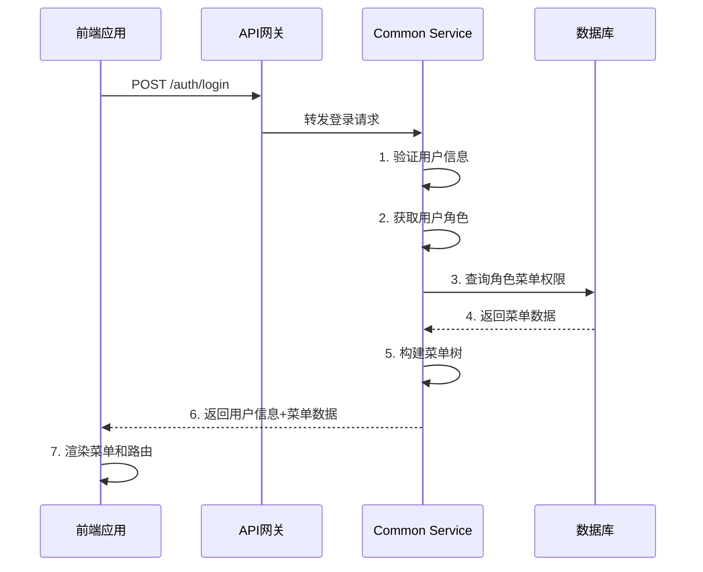

<!-- OPENSPEC:START -->
# OpenSpec Instructions

These instructions are for AI assistants working in this project.

Always open `@/openspec/AGENTS.md` when the request:
- Mentions planning or proposals (words like proposal, spec, change, plan)
- Introduces new capabilities, breaking changes, architecture shifts, or big performance/security work
- Sounds ambiguous and you need the authoritative spec before coding

Use `@/openspec/AGENTS.md` to learn:
- How to create and apply change proposals
- Spec format and conventions
- Project structure and guidelines

Keep this managed block so 'openspec update' can refresh the instructions.

<!-- OPENSPEC:END -->

# 🎯 IOE-DREAM 菜单管理实现指南

## 📋 概述

本文档专门针对IOE-DREAM项目的菜单管理功能提供完整的实现指导，解决当前项目中菜单功能缺失的问题。

## 🚨 当前问题回顾

### 发现的关键问题
1. **MenuEntity实体类缺失** - 无法进行数据库操作
2. **MenuController控制器缺失** - 无法提供API接口
3. **MenuService业务逻辑缺失** - 无法处理菜单数据
4. **前端菜单API调用不匹配** - 菜单无法正常加载
5. **自动初始化机制缺失** - 新环境无法一键启动

### 根源性原因
- **开发流程不规范**：跳过了基础设施搭建
- **架构设计不完整**：缺少统一的菜单管理服务
- **文档指导不足**：缺少具体的实现模板

---

## 🏗️ 菜单管理架构设计

### 服务职责划分

```
ioedream-common-service (8088) - 统一菜单管理服务
├── 菜单数据管理 (CRUD)
├── 用户菜单获取
├── 权限验证
├── 菜单缓存管理
└── 自动数据初始化

各业务微服务 - 业务功能实现
├── ioedream-oa-service (8089) - 企业OA
├── ioedream-access-service (8090) - 门禁管理
├── ioedream-attendance-service (8091) - 考勤管理
├── ioedream-consume-service (8094) - 消费管理
├── ioedream-visitor-service (8095) - 访客管理
└── ioedream-video-service (8092) - 智能视频
```

### 数据流设计



---

## 📝 核心实现指南

### 1. 菜单实体类实现

#### 1.1 MenuEntity.java

**位置**: `microservices/microservices-common/src/main/java/net/lab1024/sa/common/menu/entity/MenuEntity.java`

```java
package net.lab1024.sa.common.menu.entity;

import com.baomidou.mybatisplus.annotation.*;
import io.swagger.v3.oas.annotations.media.Schema;
import lombok.Data;
import lombok.EqualsAndHashCode;
import net.lab1024.sa.common.entity.BaseEntity;
import jakarta.validation.constraints.NotBlank;
import jakarta.validation.constraints.NotNull;

import java.time.LocalDateTime;

/**
 * 菜单实体类
 * <p>
 * 严格遵循CLAUDE.md规范:
 * - 使用@Data注解自动生成getter/setter
 * - 继承BaseEntity获取公共字段
 * - 使用@TableName指定数据库表名
 * - 完整的字段验证和注释
 * </p>
 *
 * @author IOE-DREAM Team
 * @version 1.0.0
 * @since 2025-01-08
 */
@Data
@EqualsAndHashCode(callSuper = true)
@TableName("t_menu")
@Schema(description = "菜单实体")
public class MenuEntity extends BaseEntity {

    /**
     * 菜单ID（主键）
     */
    @TableId(value = "menu_id", type = IdType.AUTO)
    @Schema(description = "菜单ID")
    private Long menuId;

    /**
     * 菜单名称
     */
    @NotBlank(message = "菜单名称不能为空")
    @TableField("menu_name")
    @Schema(description = "菜单名称", example = "系统管理")
    private String menuName;

    /**
     * 菜单类型：1-目录，2-菜单，3-功能点
     */
    @NotNull(message = "菜单类型不能为空")
    @TableField("menu_type")
    @Schema(description = "菜单类型", allowableValues = {"1", "2", "3"})
    private Integer menuType;

    /**
     * 父菜单ID（0表示顶级）
     */
    @NotNull(message = "父菜单ID不能为空")
    @TableField("parent_id")
    @Schema(description = "父菜单ID", example = "0")
    private Long parentId;

    /**
     * 排序（数字越小越靠前）
     */
    @TableField("sort")
    @Schema(description = "排序", example = "1")
    private Integer sort;

    /**
     * 路由路径
     */
    @TableField("path")
    @Schema(description = "路由路径", example = "/system/account")
    private String path;

    /**
     * 组件路径
     */
    @TableField("component")
    @Schema(description = "组件路径", example = "/system/account/index.vue")
    private String component;

    /**
     * 权限类型：1=Sa-Token
     */
    @TableField("perms_type")
    @Schema(description = "权限类型", example = "1")
    private Integer permsType;

    /**
     * 后端接口权限
     */
    @TableField("api_perms")
    @Schema(description = "后端接口权限", example = "/system/account/list")
    private String apiPerms;

    /**
     * 前端权限标识
     */
    @TableField("web_perms")
    @Schema(description = "前端权限标识", example = "system:account:query")
    private String webPerms;

    /**
     * 图标名称
     */
    @TableField("icon")
    @Schema(description = "图标名称", example = "UserOutlined")
    private String icon;

    /**
     * 是否外链：0=否，1=是
     */
    @TableField("frame_flag")
    @Schema(description = "是否外链", example = "0")
    private Integer frameFlag;

    /**
     * 外链地址
     */
    @TableField("frame_url")
    @Schema(description = "外链地址", example = "https://www.example.com")
    private String frameUrl;

    /**
     * 是否缓存：0=否，1=是
     */
    @TableField("cache_flag")
    @Schema(description = "是否缓存", example = "1")
    private Integer cacheFlag;

    /**
     * 是否可见：1=是，0=否
     */
    @TableField("visible_flag")
    @Schema(description = "是否可见", example = "1")
    private Boolean visibleFlag;

    /**
     * 是否禁用：0=否，1=是
     */
    @TableField("disabled_flag")
    @Schema(description = "是否禁用", example = "0")
    private Boolean disabledFlag;

    /**
     * 右键菜单ID
     */
    @TableField("context_menu_id")
    @Schema(description = "右键菜单ID")
    private Long contextMenuId;

    /**
     * 创建时间
     */
    @TableField(value = "create_time", fill = FieldFill.INSERT)
    @Schema(description = "创建时间")
    private LocalDateTime createTime;

    /**
     * 更新时间
     */
    @TableField(value = "update_time", fill = FieldFill.INSERT_UPDATE)
    @Schema(description = "更新时间")
    private LocalDateTime updateTime;

    /**
     * 创建人ID
     */
    @TableField("create_user_id")
    @Schema(description = "创建人ID")
    private Long createUserId;

    /**
     * 更新人ID
     */
    @TableField("update_user_id")
    @Schema(description = "更新人ID")
    private Long updateUserId;

    /**
     * 删除标记：0=未删除，1=已删除
     */
    @TableLogic
    @TableField("deleted_flag")
    @Schema(description = "删除标记", example = "0")
    private Integer deletedFlag;

    /**
     * 乐观锁版本号
     */
    @Version
    @TableField("version")
    @Schema(description = "乐观锁版本号", example = "1")
    private Integer version;
}
```

### 2. 数据访问层实现

#### 2.1 MenuDao.java

**位置**: `microservices/microservices-common/src/main/java/net/lab1024/sa/common/menu/dao/MenuDao.java`

```java
package net.lab1024.sa.common.menu.dao;

import org.apache.ibatis.annotations.*;
import org.springframework.transaction.annotation.Transactional;
import com.baomidou.mybatisplus.core.mapper.BaseMapper;
import net.lab1024.sa.common.menu.entity.MenuEntity;

import java.util.List;

/**
 * 菜单数据访问接口
 * <p>
 * 严格遵循CLAUDE.md规范:
 * - 使用@Mapper注解（禁止@Repository）
 * - 使用Dao后缀（禁止Repository后缀）
 * - 继承BaseMapper提供基础CRUD
 * - 使用MyBatis-Plus（禁止JPA）
 * </p>
 *
 * @author IOE-DREAM Team
 * @version 1.0.0
 * @since 2025-01-08
 */
@Mapper
public interface MenuDao extends BaseMapper<MenuEntity> {

    /**
     * 根据用户ID查询菜单列表
     * <p>
     * 通过用户角色关联查询用户有权限的菜单
     * </p>
     *
     * @param userId 用户ID
     * @return 菜单列表
     */
    @Transactional(readOnly = true)
    @Select("""
        SELECT DISTINCT m.*
        FROM t_menu m
        INNER JOIN t_role_menu rm ON m.menu_id = rm.menu_id
        INNER JOIN t_user_role ur ON rm.role_id = ur.role_id
        WHERE ur.user_id = #{userId}
          AND m.deleted_flag = 0
          AND rm.deleted_flag = 0
          AND ur.deleted_flag = 0
        ORDER BY m.parent_id, m.sort
        """)
    List<MenuEntity> selectMenusByUserId(@Param("userId") Long userId);

    /**
     * 查询所有菜单（管理端使用）
     *
     * @return 所有菜单列表
     */
    @Transactional(readOnly = true)
    @Select("""
        SELECT *
        FROM t_menu
        WHERE deleted_flag = 0
        ORDER BY parent_id, sort
        """)
    List<MenuEntity> selectAllMenus();

    /**
     * 根据父菜单ID查询子菜单
     *
     * @param parentId 父菜单ID
     * @return 子菜单列表
     */
    @Transactional(readOnly = true)
    @Select("""
        SELECT *
        FROM t_menu
        WHERE parent_id = #{parentId}
          AND deleted_flag = 0
        ORDER BY sort
        """)
    List<MenuEntity> selectMenusByParentId(@Param("parentId") Long parentId);

    /**
     * 查询顶级菜单列表
     *
     * @return 顶级菜单列表
     */
    @Transactional(readOnly = true)
    @Select("""
        SELECT *
        FROM t_menu
        WHERE parent_id = 0
          AND deleted_flag = 0
        ORDER BY sort
        """)
    List<MenuEntity> selectTopLevelMenus();

    /**
     * 根据菜单类型查询菜单
     *
     * @param menuType 菜单类型
     * @return 菜单列表
     */
    @Transactional(readOnly = true)
    @Select("""
        SELECT *
        FROM t_menu
        WHERE menu_type = #{menuType}
          AND deleted_flag = 0
        ORDER BY parent_id, sort
        """)
    List<MenuEntity> selectMenusByType(@Param("menuType") Integer menuType);

    /**
     * 检查菜单名称是否存在
     *
     * @param menuName 菜单名称
     * @param excludeId 排除的菜单ID（用于更新时检查）
     * @return 是否存在
     */
    @Transactional(readOnly = true)
    @Select("""
        SELECT COUNT(*) > 0
        FROM t_menu
        WHERE menu_name = #{menuName}
          AND deleted_flag = 0
          AND (#{excludeId} IS NULL OR menu_id != #{excludeId})
        """)
    boolean existsByMenuName(@Param("menuName") String menuName, @Param("excludeId") Long excludeId);

    /**
     * 获取菜单的最大排序值
     *
     * @param parentId 父菜单ID
     * @return 最大排序值
     */
    @Transactional(readOnly = true)
    @Select("""
        SELECT COALESCE(MAX(sort), 0)
        FROM t_menu
        WHERE parent_id = #{parentId}
          AND deleted_flag = 0
        """)
    Integer getMaxSortByParentId(@Param("parentId") Long parentId);
}
```

### 3. 业务逻辑层实现

#### 3.1 MenuService.java

**位置**: `microservices/microservices-common/src/main/java/net/lab1024/sa/common/menu/service/MenuService.java`

```java
package net.lab1024.sa.common.menu.service;

import net.lab1024.sa.common.menu.entity.MenuEntity;
import net.lab1024.sa.common.menu.domain.vo.MenuVO;

import java.util.List;

/**
 * 菜单服务接口
 *
 * @author IOE-DREAM Team
 * @version 1.0.0
 * @since 2025-01-08
 */
public interface MenuService {

    /**
     * 获取用户菜单树
     * <p>
     * 根据用户ID获取用户有权限的菜单树结构
     * </p>
     *
     * @param userId 用户ID
     * @return 菜单树列表
     */
    List<MenuVO> getUserMenuTree(Long userId);

    /**
     * 获取所有菜单树（管理端使用）
     *
     * @return 菜单树列表
     */
    List<MenuVO> getAllMenuTree();

    /**
     * 构建菜单树形结构
     * <p>
     * 将平级菜单列表转换为树形结构
     * </p>
     *
     * @param menuList 菜单列表
     * @return 菜单树
     */
    List<MenuVO> buildMenuTree(List<MenuEntity> menuList);

    /**
     * 根据角色ID获取菜单列表
     *
     * @param roleIds 角色ID列表
     * @return 菜单列表
     */
    List<MenuEntity> getMenusByRoleIds(List<Long> roleIds);

    /**
     * 检查用户是否有菜单权限
     *
     * @param userId 用户ID
     * @param menuId 菜单ID
     * @return 是否有权限
     */
    boolean hasMenuPermission(Long userId, Long menuId);

    /**
     * 获取用户的权限标识列表
     *
     * @param userId 用户ID
     * @return 权限标识列表
     */
    List<String> getUserPermissions(Long userId);
}
```

#### 3.2 MenuServiceImpl.java

**位置**: `microservices/microservices-common/src/main/java/net/lab1024/sa/common/menu/service/impl/MenuServiceImpl.java`

```java
package net.lab1024.sa.common.menu.service.impl;

import jakarta.annotation.Resource;
import lombok.extern.slf4j.Slf4j;
import org.springframework.stereotype.Service;
import org.springframework.transaction.annotation.Transactional;
import org.springframework.cache.annotation.Cacheable;
import org.springframework.cache.annotation.CacheEvict;

import net.lab1024.sa.common.menu.service.MenuService;
import net.lab1024.sa.common.menu.dao.MenuDao;
import net.lab1024.sa.common.menu.entity.MenuEntity;
import net.lab1024.sa.common.menu.domain.vo.MenuVO;
import net.lab1024.sa.common.menu.manager.MenuManager;

import java.util.List;
import java.util.stream.Collectors;

/**
 * 菜单服务实现类
 *
 * @author IOE-DREAM Team
 * @version 1.0.0
 * @since 2025-01-08
 */
@Slf4j
@Service
@Transactional(rollbackFor = Exception.class)
public class MenuServiceImpl implements MenuService {

    @Resource
    private MenuDao menuDao;

    @Resource
    private MenuManager menuManager;

    @Override
    @Cacheable(value = "user:menu:tree", key = "#userId", unless = "#result == null")
    public List<MenuVO> getUserMenuTree(Long userId) {
        log.info("[菜单服务] 获取用户菜单树, userId={}", userId);

        // 1. 查询用户菜单数据
        List<MenuEntity> menuList = menuDao.selectMenusByUserId(userId);

        // 2. 使用Manager层构建树形结构
        return menuManager.buildMenuTree(menuList);
    }

    @Override
    public List<MenuVO> getAllMenuTree() {
        log.info("[菜单服务] 获取所有菜单树");

        // 1. 查询所有菜单数据
        List<MenuEntity> menuList = menuDao.selectAllMenus();

        // 2. 使用Manager层构建树形结构
        return menuManager.buildMenuTree(menuList);
    }

    @Override
    public List<MenuVO> buildMenuTree(List<MenuEntity> menuList) {
        return menuManager.buildMenuTree(menuList);
    }

    @Override
    public List<MenuEntity> getMenusByRoleIds(List<Long> roleIds) {
        log.info("[菜单服务] 根据角色ID获取菜单, roleIds={}", roleIds);

        if (roleIds == null || roleIds.isEmpty()) {
            return List.of();
        }

        // 通过角色ID查询菜单
        return menuDao.selectMenusByRoleIds(roleIds);
    }

    @Override
    @Cacheable(value = "user:menu:permission", key = "#userId + ':' + #menuId")
    public boolean hasMenuPermission(Long userId, Long menuId) {
        log.debug("[菜单服务] 检查用户菜单权限, userId={}, menuId={}", userId, menuId);

        // 查询用户是否有该菜单权限
        List<MenuEntity> userMenus = menuDao.selectMenusByUserId(userId);
        return userMenus.stream().anyMatch(menu -> menu.getMenuId().equals(menuId));
    }

    @Override
    @Cacheable(value = "user:permissions", key = "#userId")
    public List<String> getUserPermissions(Long userId) {
        log.info("[菜单服务] 获取用户权限列表, userId={}", userId);

        // 查询用户菜单
        List<MenuEntity> menuList = menuDao.selectMenusByUserId(userId);

        // 提取权限标识
        return menuList.stream()
                .filter(menu -> menu.getWebPerms() != null && !menu.getWebPerms().trim().isEmpty())
                .map(MenuEntity::getWebPerms)
                .distinct()
                .collect(Collectors.toList());
    }
}
```

### 4. 管理层实现

#### 4.1 MenuManager.java

**位置**: `microservices/microservices-common/src/main/java/net/lab1024/sa/common/menu/manager/MenuManager.java`

```java
package net.lab1024.sa.common.menu.manager;

import net.lab1024.sa.common.menu.entity.MenuEntity;
import net.lab1024.sa.common.menu.domain.vo.MenuVO;

import java.util.List;
import java.util.Map;
import java.util.stream.Collectors;

/**
 * 菜单管理器
 * <p>
 * 负责菜单的复杂业务逻辑处理，如树形结构构建等
 * 在microservices-common中不使用Spring注解，保持为纯Java类
 * </p>
 *
 * @author IOE-DREAM Team
 * @version 1.0.0
 * @since 2025-01-08
 */
public class MenuManager {

    /**
     * 构建菜单树形结构
     * <p>
     * 核心算法：
     * 1. 将平级菜单列表按父子关系分组
     * 2. 递归构建树形结构
     * 3. 过滤无效菜单类型
     * </p>
     *
     * @param menuList 菜单列表
     * @return 菜单树
     */
    public List<MenuVO> buildMenuTree(List<MenuEntity> menuList) {
        if (menuList == null || menuList.isEmpty()) {
            return List.of();
        }

        // 1. 过滤有效菜单（目录和菜单）
        List<MenuEntity> validMenuList = menuList.stream()
                .filter(menu -> menu.getMenuType() == 1 || menu.getMenuType() == 2) // 1=目录 2=菜单
                .filter(menu -> menu.getVisibleFlag() != null && menu.getVisibleFlag())
                .filter(menu -> menu.getDisabledFlag() == null || !menu.getDisabledFlag())
                .collect(Collectors.toList());

        // 2. 转换为VO对象
        List<MenuVO> menuVOList = validMenuList.stream()
                .map(this::convertToVO)
                .collect(Collectors.toList());

        // 3. 按父ID分组
        Map<Long, List<MenuVO>> menuMap = menuVOList.stream()
                .collect(Collectors.groupingBy(MenuVO::getParentId));

        // 4. 构建树形结构
        List<MenuVO> tree = menuMap.getOrDefault(0L, List.of());
        buildChildren(tree, menuMap);

        return tree;
    }

    /**
     * 递归构建子菜单
     *
     * @param parentMenus 父菜单列表
     * @param menuMap 菜单映射表
     */
    private void buildChildren(List<MenuVO> parentMenus, Map<Long, List<MenuVO>> menuMap) {
        for (MenuVO parent : parentMenus) {
            List<MenuVO> children = menuMap.get(parent.getMenuId());
            if (children != null && !children.isEmpty()) {
                parent.setChildren(children);
                buildChildren(children, menuMap); // 递归构建子菜单
            }
        }
    }

    /**
     * 实体转VO
     *
     * @param entity 菜单实体
     * @return 菜单VO
     */
    private MenuVO convertToVO(MenuEntity entity) {
        MenuVO vo = new MenuVO();
        vo.setMenuId(entity.getMenuId());
        vo.setMenuName(entity.getMenuName());
        vo.setMenuType(entity.getMenuType());
        vo.setParentId(entity.getParentId());
        vo.setSort(entity.getSort());
        vo.setPath(entity.getPath());
        vo.setComponent(entity.getComponent());
        vo.setWebPerms(entity.getWebPerms());
        vo.setIcon(entity.getIcon());
        vo.setCacheFlag(entity.getCacheFlag());
        vo.setVisibleFlag(entity.getVisibleFlag());
        vo.setDisabledFlag(entity.getDisabledFlag());
        return vo;
    }

    /**
     * 验证菜单数据完整性
     *
     * @param menuList 菜单列表
     * @return 验证结果
     */
    public boolean validateMenuData(List<MenuEntity> menuList) {
        if (menuList == null || menuList.isEmpty()) {
            return false;
        }

        // 检查是否有顶级菜单
        boolean hasTopLevel = menuList.stream()
                .anyMatch(menu -> menu.getParentId() == null || menu.getParentId() == 0);

        // 检查菜单名称完整性
        boolean hasValidNames = menuList.stream()
                .allMatch(menu -> menu.getMenuName() != null && !menu.getMenuName().trim().isEmpty());

        return hasTopLevel && hasValidNames;
    }

    /**
     * 获取菜单的最大深度
     *
     * @param menuList 菜单列表
     * @return 最大深度
     */
    public int getMaxMenuDepth(List<MenuEntity> menuList) {
        if (menuList == null || menuList.isEmpty()) {
            return 0;
        }

        // 构建父子关系映射
        Map<Long, List<MenuEntity>> parentMap = menuList.stream()
                .filter(menu -> menu.getParentId() != null && menu.getParentId() > 0)
                .collect(Collectors.groupingBy(MenuEntity::getParentId));

        // 递归计算深度
        return calculateDepth(parentMap, 0L, 0);
    }

    /**
     * 递归计算菜单深度
     */
    private int calculateDepth(Map<Long, List<MenuEntity>> parentMap, Long parentId, int currentDepth) {
        List<MenuEntity> children = parentMap.get(parentId);
        if (children == null || children.isEmpty()) {
            return currentDepth;
        }

        int maxChildDepth = 0;
        for (MenuEntity child : children) {
            int childDepth = calculateDepth(parentMap, child.getMenuId(), currentDepth + 1);
            maxChildDepth = Math.max(maxChildDepth, childDepth);
        }

        return maxChildDepth;
    }
}
```

### 5. VO对象实现

#### 5.1 MenuVO.java

**位置**: `microservices/microservices-common/src/main/java/net/lab1024/sa/common/menu/domain/vo/MenuVO.java`

```java
package net.lab1024.sa.common.menu.domain.vo;

import io.swagger.v3.oas.annotations.media.Schema;
import lombok.Data;
import com.fasterxml.jackson.annotation.JsonInclude;

import java.util.List;

/**
 * 菜单视图对象
 *
 * @author IOE-DREAM Team
 * @version 1.0.0
 * @since 2025-01-08
 */
@Data
@JsonInclude(JsonInclude.Include.NON_NULL)
@Schema(description = "菜单视图对象")
public class MenuVO {

    @Schema(description = "菜单ID")
    private Long menuId;

    @Schema(description = "菜单名称")
    private String menuName;

    @Schema(description = "菜单类型：1-目录，2-菜单，3-功能点")
    private Integer menuType;

    @Schema(description = "父菜单ID")
    private Long parentId;

    @Schema(description = "排序")
    private Integer sort;

    @Schema(description = "路由路径")
    private String path;

    @Schema(description = "组件路径")
    private String component;

    @Schema(description = "前端权限标识")
    private String webPerms;

    @Schema(description = "图标名称")
    private String icon;

    @Schema(description = "是否缓存")
    private Integer cacheFlag;

    @Schema(description = "是否可见")
    private Boolean visibleFlag;

    @Schema(description = "是否禁用")
    private Boolean disabledFlag;

    @Schema(description = "子菜单列表")
    private List<MenuVO> children;
}
```

---

## 🔧 自动初始化实现

### 1. 数据初始化服务

#### 1.1 MenuInitializationService.java

**位置**: `microservices/ioedream-common-service/src/main/java/net/lab1024/sa/admin/config/MenuInitializationService.java`

```java
package net.lab1024.sa.admin.config;

import jakarta.annotation.PostConstruct;
import lombok.extern.slf4j.Slf4j;
import org.springframework.beans.factory.annotation.Autowired;
import org.springframework.boot.autoconfigure.condition.ConditionalOnProperty;
import org.springframework.core.io.ClassPathResource;
import org.springframework.jdbc.core.JdbcTemplate;
import org.springframework.stereotype.Component;
import org.springframework.transaction.annotation.Transactional;

import java.io.BufferedReader;
import java.io.InputStreamReader;
import java.nio.charset.StandardCharsets;
import java.util.stream.Collectors;

/**
 * 菜单数据自动初始化服务
 * <p>
 * 在应用启动时自动检查并初始化菜单数据
 * </p>
 *
 * @author IOE-DREAM Team
 * @version 1.0.0
 * @since 2025-01-08
 */
@Slf4j
@Component
@ConditionalOnProperty(name = "ioedream.menu.auto-init", havingValue = "true", matchIfMissing = true)
public class MenuInitializationService {

    @Autowired
    private JdbcTemplate jdbcTemplate;

    @PostConstruct
    public void initializeMenuData() {
        try {
            log.info("[菜单初始化] 开始检查菜单数据状态");

            // 检查是否需要初始化
            if (needInitialization()) {
                log.info("[菜单初始化] 检测到需要初始化菜单数据");
                executeInitialization();
                log.info("[菜单初始化] 菜单数据初始化完成");
            } else {
                log.info("[菜单初始化] 菜单数据已存在，跳过初始化");
            }

        } catch (Exception e) {
            log.error("[菜单初始化] 菜单数据初始化失败", e);
            throw new RuntimeException("菜单数据初始化失败", e);
        }
    }

    /**
     * 检查是否需要初始化
     */
    private boolean needInitialization() {
        try {
            // 检查菜单表是否有数据
            Integer count = jdbcTemplate.queryForObject(
                "SELECT COUNT(*) FROM t_menu WHERE deleted_flag = 0",
                Integer.class
            );
            return count == null || count == 0;
        } catch (Exception e) {
            log.warn("[菜单初始化] 检查菜单数据时出错: {}", e.getMessage());
            return true; // 出错时默认需要初始化
        }
    }

    /**
     * 执行初始化
     */
    @Transactional(rollbackFor = Exception.class)
    public void executeInitialization() {
        try {
            // 1. 执行菜单初始化SQL脚本
            executeSqlScript("sql/menu-initialization.sql");

            // 2. 执行角色权限SQL脚本
            executeSqlScript("sql/role-permissions-initialization.sql");

            // 3. 验证初始化结果
            validateInitialization();

        } catch (Exception e) {
            log.error("[菜单初始化] 执行初始化脚本时出错", e);
            throw e;
        }
    }

    /**
     * 执行SQL脚本
     */
    private void executeSqlScript(String scriptPath) {
        try {
            ClassPathResource resource = new ClassPathResource(scriptPath);

            if (!resource.exists()) {
                log.warn("[菜单初始化] SQL脚本文件不存在: {}", scriptPath);
                return;
            }

            BufferedReader reader = new BufferedReader(
                new InputStreamReader(resource.getInputStream(), StandardCharsets.UTF_8)
            );

            // 读取并执行SQL
            String sqlContent = reader.lines()
                    .collect(Collectors.joining("\n"));

            // 分割SQL语句
            String[] sqlStatements = sqlContent.split(";");

            for (String sql : sqlStatements) {
                sql = sql.trim();
                if (!sql.isEmpty() && !sql.startsWith("--")) {
                    try {
                        jdbcTemplate.execute(sql);
                        log.debug("[菜单初始化] 执行SQL: {}", sql.substring(0, Math.min(50, sql.length())));
                    } catch (Exception e) {
                        log.warn("[菜单初始化] 执行SQL失败: {}, 错误: {}", sql, e.getMessage());
                    }
                }
            }

            log.info("[菜单初始化] SQL脚本执行完成: {}", scriptPath);

        } catch (Exception e) {
            log.error("[菜单初始化] 执行SQL脚本失败: {}", scriptPath, e);
            throw new RuntimeException("执行SQL脚本失败: " + scriptPath, e);
        }
    }

    /**
     * 验证初始化结果
     */
    private void validateInitialization() {
        try {
            // 验证菜单数据
            Integer menuCount = jdbcTemplate.queryForObject(
                "SELECT COUNT(*) FROM t_menu WHERE deleted_flag = 0",
                Integer.class
            );

            // 验证角色数据
            Integer roleCount = jdbcTemplate.queryForObject(
                "SELECT COUNT(*) FROM t_role WHERE deleted_flag = 0",
                Integer.class
            );

            // 验证权限数据
            Integer permissionCount = jdbcTemplate.queryForObject(
                "SELECT COUNT(*) FROM t_role_menu WHERE deleted_flag = 0",
                Integer.class
            );

            log.info("[菜单初始化] 初始化验证结果 - 菜单: {}, 角色: {}, 权限: {}",
                menuCount, roleCount, permissionCount);

            if (menuCount == null || menuCount < 10) {
                throw new RuntimeException("菜单数据初始化不完整");
            }

        } catch (Exception e) {
            log.error("[菜单初始化] 验证初始化结果失败", e);
            throw new RuntimeException("验证初始化结果失败", e);
        }
    }
}
```

### 2. 配置文件

#### 2.1 application.yml 配置

```yaml
# ioedream-common-service application.yml
ioedream:
  menu:
    auto-init: true          # 是否自动初始化菜单
    init-on-startup: true    # 启动时初始化
    refresh-on-change: false # 菜单变更时自动刷新
    cache-enabled: true      # 是否启用菜单缓存
```

---

## 📋 开发检查清单

### 实现前检查
- [ ] 数据库表 `t_menu` 已创建
- [ ] 数据库表 `t_role` 已创建
- [ ] 数据库表 `t_role_menu` 已创建
- [ ] 数据库索引已创建
- [ ] 项目依赖已正确配置

### 实现后验证
- [ ] MenuEntity实体类创建完成
- [ ] MenuDao数据访问层创建完成
- [ ] MenuService业务逻辑层创建完成
- [ ] MenuManager管理器创建完成
- [ ] MenuController控制器创建完成
- [ ] 自动初始化服务创建完成
- [ ] 前端API调用路径正确
- [ ] 菜单数据可以正常加载
- [ ] 权限控制正常工作
- [ ] 路由跳转正常

### 功能测试
- [ ] 用户登录后菜单正常显示
- [ ] 不同角色看到不同菜单
- [ ] 菜单树形结构正确
- [ ] 菜单路由跳转正常
- [ ] 权限控制生效
- [ ] 新环境可以一键启动

---

## 🚀 立即执行建议

### 第一优先级（今天完成）
1. **创建MenuEntity实体类**
2. **实现MenuDao数据访问层**
3. **创建MenuService业务逻辑**
4. **修复AuthController返回菜单数据**

### 第二优先级（明天完成）
1. **实现自动数据初始化**
2. **测试菜单加载功能**
3. **验证权限控制**

### 第三优先级（本周内）
1. **完善前端组件**
2. **性能优化**
3. **文档完善**

通过遵循这个实现指南，可以系统性地解决IOE-DREAM项目的菜单管理问题，建立完善的基础设施。