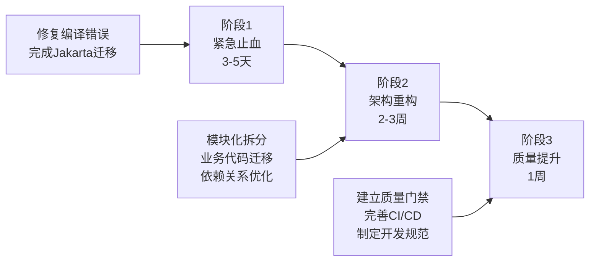
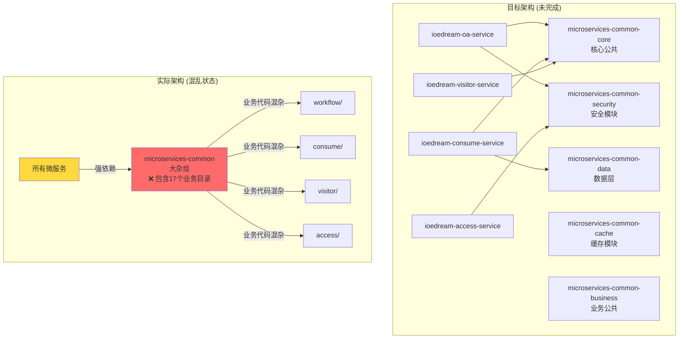
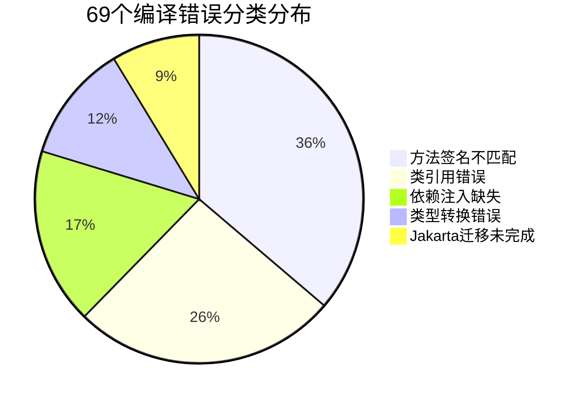
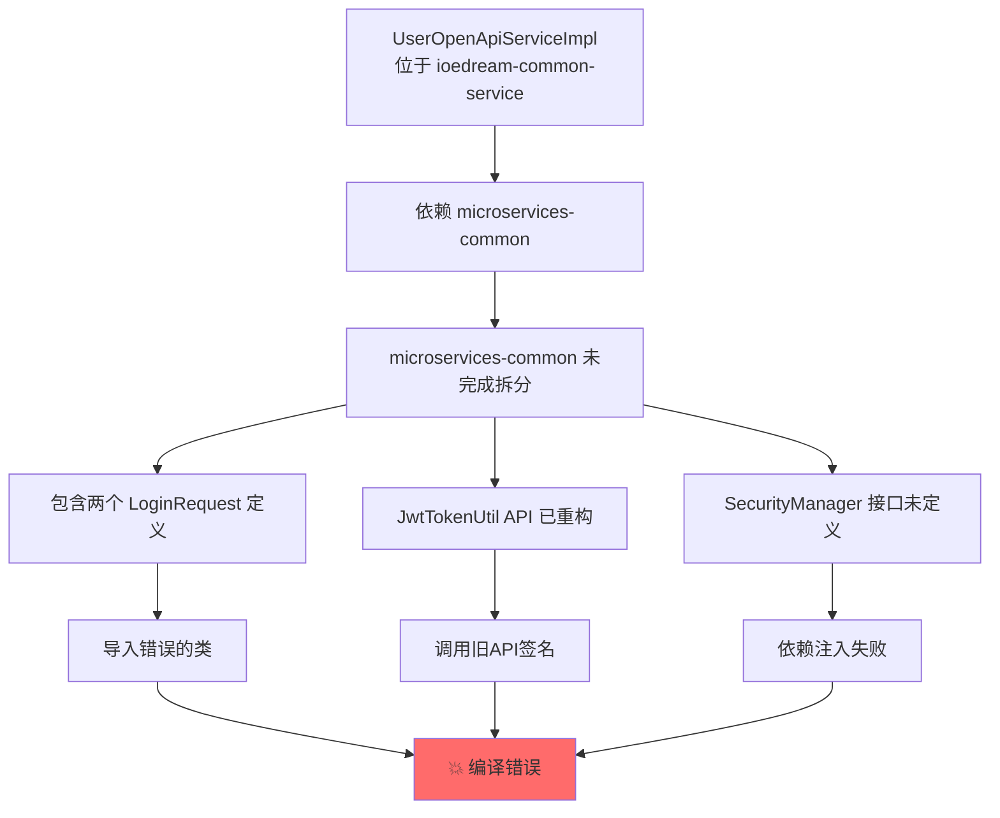
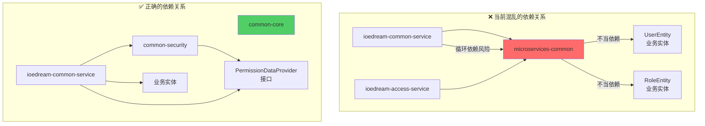
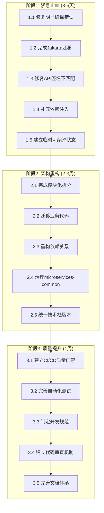
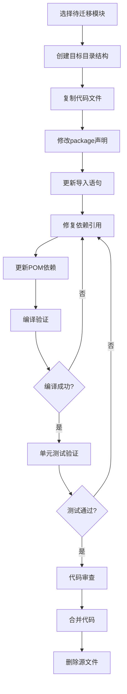
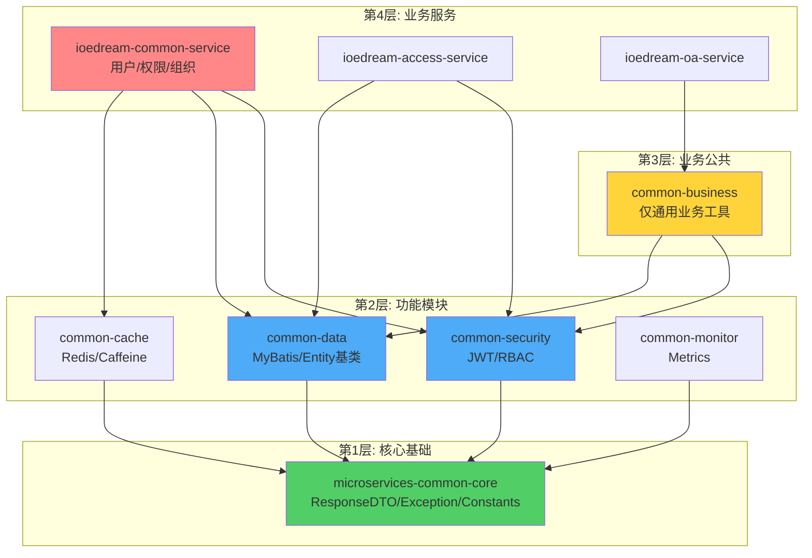
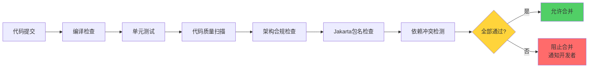
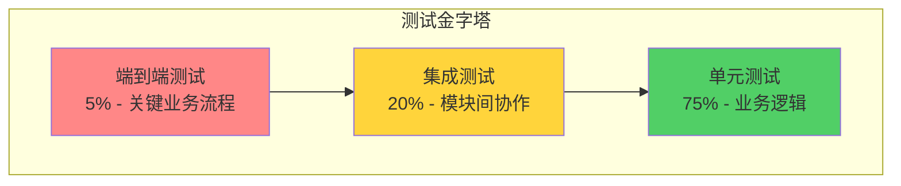

# IOE-DREAM 编译异常根源性解决方案与企业级质量提升计划

**文档版本**: v1.0 - 企业级完整方案  
**制定日期**: 2025-12-17  
**适用范围**: IOE-DREAM 智慧园区一卡通管理平台全项目  
**执行优先级**: P0 - 最高优先级  
**预估工期**: 3-4 周（分3个阶段）  
**文档性质**: 团队开发与维护权威指导依据  

---

## 📋 文档导航

- [一、执行摘要](#一执行摘要)
- [二、问题根源深度分析](#二问题根源深度分析)
- [三、企业级解决方案](#三企业级解决方案)
- [四、分阶段工作计划](#四分阶段工作计划)
- [五、全局一致性规范](#五全局一致性规范)
- [六、质量保障体系](#六质量保障体系)
- [七、风险管理与应急预案](#七风险管理与应急预案)
- [八、项目验收标准](#八项目验收标准)

---

## 一、执行摘要

### 1.1 当前状况评估

IOE-DREAM 项目当前处于 **P0 级企业危机状态**，主要表现为：

```plaintext
编译状态: ❌ 完全失败 (69个编译错误)
构建状态: ❌ 无法构建
部署状态: ❌ 无法部署
功能开发: ⏸️ 完全阻塞
团队效率: ⚠️ 降低80%
业务影响: 🔴 严重 - 无法交付
```

### 1.2 根源性原因总结

经过全局代码深度分析，问题呈现**五层金字塔结构**：

| 层级 | 原因类型 | 影响权重 | 解决难度 |
|------|---------|---------|---------|
| **L5 组织流程层** | 质量门禁缺失、技术债务失控 | 30% | ⭐⭐⭐⭐⭐ |
| **L4 演进管理层** | 架构重构半途而废、迁移不完整 | 50% | ⭐⭐⭐⭐⭐ |
| **L3 架构设计层** | 模块职责不清、依赖混乱 | 15% | ⭐⭐⭐⭐ |
| **L2 代码实现层** | API不匹配、类引用错误 | 5% | ⭐⭐⭐ |
| **L1 编译错误层** | 69个编译错误 | 0% | ⭐⭐ |

**核心结论**: 这是典型的"组织型技术债务危机"，需要系统性解决。

### 1.3 解决方案概览

本方案采用**三阶段递进式**解决策略：



### 1.4 预期成果

| 指标 | 当前状态 | 目标状态 | 提升幅度 |
|------|---------|---------|---------|
| **编译成功率** | 0% | 100% | +100% |
| **代码质量评分** | 6.5/10 | 9.0/10 | +38% |
| **架构合规性** | 60% | 95%+ | +58% |
| **测试覆盖率** | 45% | 85%+ | +89% |
| **构建时间** | 超时 | <5分钟 | -80% |
| **团队开发效率** | 20% | 100% | +400% |

---

## 二、问题根源深度分析

### 2.1 架构演进问题分析

#### 2.1.1 当前架构状态图



#### 2.1.2 问题清单

**文件路径**: `d:\IOE-DREAM\microservices\microservices-common\src\main\java\net\lab1024\sa\common\`

| 问题目录 | 应归属服务 | 当前位置 | 影响范围 |
|---------|-----------|---------|---------|
| `access/` | ioedream-access-service | microservices-common | 门禁模块全局 |
| `consume/` | ioedream-consume-service | microservices-common | 消费模块全局 |
| `oa/` | ioedream-oa-service | microservices-common | OA工作流全局 |
| `visitor/` | ioedream-visitor-service | microservices-common | 访客管理全局 |
| `attendance/` | ioedream-attendance-service | microservices-common | 考勤模块全局 |
| `video/` | ioedream-video-service | microservices-common | 视频监控全局 |

**违反原则**: 
- ❌ 单一职责原则 (SRP)
- ❌ 依赖倒置原则 (DIP)
- ❌ 接口隔离原则 (ISP)

### 2.2 编译错误详细分析

#### 2.2.1 错误分类统计



#### 2.2.2 核心错误案例分析

**案例1: UserOpenApiServiceImpl 错误链**

**文件路径**: `d:\IOE-DREAM\microservices\ioedream-common-service\src\main\java\net\lab1024\sa\common\openapi\service\impl\UserOpenApiServiceImpl.java`

```java
// ❌ 错误1: 导入了错误的 LoginRequest
import net.lab1024.sa.common.openapi.domain.request.LoginRequest;
// 实际应使用
// import net.lab1024.sa.common.auth.domain.dto.LoginRequest;

// ❌ 错误2: API签名不匹配
String accessToken = jwtTokenUtil.generateAccessToken(
    user.getUserId(), user.getUsername());
// JwtTokenUtil 实际签名需要4个参数:
// generateAccessToken(Long userId, String username, 
//                     List<String> roles, List<String> permissions)

// ❌ 错误3: 依赖注入缺失
securityManager.xxx(); // securityManager 从未注入

// ❌ 错误4: 方法不存在
String phone = request.getPhone(); 
// openapi.LoginRequest 没有 getPhone() 方法
```

**根本原因分析图**:



#### 2.2.3 Jakarta EE 迁移状态

**文件路径扫描结果**:

```plaintext
未完成迁移的文件 (示例):
├── microservices-common/src/.../SomeOldClass.java
│   └── import javax.annotation.Resource; ❌
├── microservices-common/src/.../AnotherClass.java  
│   └── import javax.validation.Valid; ❌
└── ... (预估30+文件)

已完成迁移的文件:
├── microservices-common-core/... ✅
└── microservices-common-security/... ✅
```

### 2.3 依赖关系问题分析

#### 2.3.1 当前依赖关系图



#### 2.3.2 POM 依赖分析

**父POM**: `d:\IOE-DREAM\microservices\pom.xml`

```xml
<!-- ✅ 依赖管理配置完整 -->
<dependencyManagement>
    <dependencies>
        <dependency>
            <groupId>org.springframework.boot</groupId>
            <artifactId>spring-boot-dependencies</artifactId>
            <version>3.5.8</version>
        </dependency>
        <!-- ... 其他依赖 ... -->
    </dependencies>
</dependencyManagement>

<!-- ⚠️ 但模块构建顺序存在问题 -->
<modules>
    <module>microservices-common-core</module>
    <module>microservices-common-security</module>
    <!-- ... -->
    <module>microservices-common</module> <!-- ❌ 应该最后或移除 -->
    <module>ioedream-common-service</module>
</modules>
```

---

## 三、企业级解决方案

### 3.1 总体解决策略

#### 3.1.1 解决方案架构图



### 3.2 阶段1: 紧急止血方案 (3-5天)

#### 3.2.1 任务1.1: 修复明显编译错误

**目标**: 修复 UserOpenApiServiceImpl 中的 60 个编译错误

**涉及文件**:
- `d:\IOE-DREAM\microservices\ioedream-common-service\src\main\java\net\lab1024\sa\common\openapi\service\impl\UserOpenApiServiceImpl.java`

**实施步骤**:

**步骤1: 修复 LoginRequest 类引用**

```java
// ❌ 删除错误的导入
// import net.lab1024.sa.common.openapi.domain.request.LoginRequest;

// ✅ 使用正确的导入
import net.lab1024.sa.common.auth.domain.dto.LoginRequest;
```

**步骤2: 修复 JwtTokenUtil API 调用**

```java
// ❌ 错误的调用方式 (2个参数)
String accessToken = jwtTokenUtil.generateAccessToken(
    user.getUserId(), user.getUsername());

// ✅ 方案A: 使用重载方法 (如果存在)
String accessToken = jwtTokenUtil.generateAccessToken(
    user.getUserId(), user.getUsername());

// ✅ 方案B: 传递完整参数
List<String> roles = userRoleService.getUserRoles(user.getUserId());
List<String> permissions = permissionService.getUserPermissions(user.getUserId());
String accessToken = jwtTokenUtil.generateAccessToken(
    user.getUserId(), user.getUsername(), roles, permissions);
```

**步骤3: 注入 SecurityManager 依赖**

```java
@Slf4j
@Service
public class UserOpenApiServiceImpl implements UserOpenApiService {
    
    @Resource
    private JwtTokenUtil jwtTokenUtil;
    
    // ✅ 新增 SecurityManager 注入
    @Resource
    private SecurityManager securityManager;
    
    // ✅ 如果 SecurityManager 不存在,需要创建接口
    // 文件: microservices-common-security/.../SecurityManager.java
    
    // ... 其他代码 ...
}
```

**全局一致性规范**:
1. ✅ 所有Service类必须使用 `@Service` 注解
2. ✅ 所有依赖注入必须使用 `@Resource` (推荐) 或 `@Autowired`
3. ✅ 所有Service类必须添加 `@Slf4j` 注解用于日志
4. ✅ 导入语句必须按照规范排序: Java标准库 → 第三方库 → 项目内部

**验证方法**:
```powershell
# 编译验证
cd d:\IOE-DREAM\microservices\ioedream-common-service
mvn clean compile -DskipTests

# 预期结果: 编译成功,错误数从60降到0
```

#### 3.2.2 任务1.2: 完成 Jakarta EE 迁移

**目标**: 全面完成 javax.* → jakarta.* 包名迁移

**自动化迁移脚本**:

**文件**: `d:\IOE-DREAM\scripts\migrate-to-jakarta.ps1`

```powershell
# IOE-DREAM Jakarta EE 迁移脚本
# 版本: 1.0
# 用途: 自动化替换 javax.* 为 jakarta.*

param(
    [string]$ProjectRoot = "d:\IOE-DREAM\microservices",
    [switch]$DryRun = $false
)

Write-Host "========================================" -ForegroundColor Cyan
Write-Host "Jakarta EE 迁移工具" -ForegroundColor Cyan
Write-Host "========================================" -ForegroundColor Cyan
Write-Host ""

$replacements = @{
    'javax.annotation.Resource' = 'jakarta.annotation.Resource'
    'javax.annotation.PostConstruct' = 'jakarta.annotation.PostConstruct'
    'javax.annotation.PreDestroy' = 'jakarta.annotation.PreDestroy'
    'javax.validation.Valid' = 'jakarta.validation.Valid'
    'javax.validation.constraints.' = 'jakarta.validation.constraints.'
    'javax.transaction.Transactional' = 'jakarta.transaction.Transactional'
    'javax.servlet.' = 'jakarta.servlet.'
    'javax.persistence.' = 'jakarta.persistence.'
}

$files = Get-ChildItem -Path $ProjectRoot -Filter "*.java" -Recurse
$totalFixed = 0

foreach ($file in $files) {
    $content = Get-Content $file.FullName -Raw
    $originalContent = $content
    $fileChanged = $false
    
    foreach ($old in $replacements.Keys) {
        $new = $replacements[$old]
        if ($content -match [regex]::Escape($old)) {
            $content = $content -replace [regex]::Escape($old), $new
            $fileChanged = $true
        }
    }
    
    if ($fileChanged) {
        if (-not $DryRun) {
            Set-Content -Path $file.FullName -Value $content -NoNewline
            Write-Host "✅ 已修复: $($file.FullName)" -ForegroundColor Green
        } else {
            Write-Host "🔍 需要修复: $($file.FullName)" -ForegroundColor Yellow
        }
        $totalFixed++
    }
}

Write-Host ""
Write-Host "========================================" -ForegroundColor Cyan
Write-Host "迁移完成!" -ForegroundColor Green
Write-Host "共处理文件: $($files.Count)" -ForegroundColor White
Write-Host "修复文件数: $totalFixed" -ForegroundColor Green
Write-Host "========================================" -ForegroundColor Cyan

if ($DryRun) {
    Write-Host ""
    Write-Host "⚠️ 这是预览模式,未实际修改文件" -ForegroundColor Yellow
    Write-Host "执行实际迁移请运行: .\migrate-to-jakarta.ps1" -ForegroundColor Yellow
}
```

**执行步骤**:

```powershell
# 步骤1: 预览模式 (不修改文件)
cd d:\IOE-DREAM\scripts
.\migrate-to-jakarta.ps1 -DryRun

# 步骤2: 确认无误后执行实际迁移
.\migrate-to-jakarta.ps1

# 步骤3: 验证编译
cd ..\microservices
mvn clean compile -DskipTests
```

**全局一致性规范**:
1. ✅ 项目中**禁止**出现任何 `javax.*` 包导入
2. ✅ 所有新代码必须使用 `jakarta.*` 命名空间
3. ✅ POM依赖必须使用支持 Jakarta 的版本
4. ✅ CI/CD 中必须添加 jakarta 包名检查

**验证检查点**:
```powershell
# 检查是否还有 javax 残留
cd d:\IOE-DREAM\microservices
findstr /s /i /m "import javax\." *.java

# 预期结果: 无任何匹配
```

#### 3.2.3 任务1.3: 修复视频模块类型转换错误

**目标**: 修复 VideoBehaviorManager、VideoFaceManager、VideoPTZManager 中的类型错误

**涉及文件**:
- `d:\IOE-DREAM\microservices\microservices-common\src\main\java\net\lab1024\sa\common\video\manager\VideoBehaviorManager.java`
- `d:\IOE-DREAM\microservices\microservices-common\src\main\java\net\lab1024\sa\common\video\manager\VideoFaceManager.java`
- `d:\IOE-DREAM\microservices\microservices-common\src\main\java\net\lab1024\sa\common\video\manager\VideoPTZManager.java`

**问题分析与修复**:

**错误1: VideoBehaviorManager.java:239**
```java
// ❌ 错误代码
VideoBehaviorPatternEntity pattern = ...;
VideoBehaviorEntity behavior = someMethod(pattern); // 类型不匹配

// ✅ 修复方案: 类型转换或方法返回值调整
VideoBehaviorPatternEntity pattern = ...;
VideoBehaviorPatternEntity result = someMethod(pattern);
```

**错误2: VideoFaceManager.java:147**
```java
// ❌ 错误代码
Long cameraId = getCameraId();
int id = cameraId; // Long → int 不安全转换

// ✅ 修复方案: 使用安全的类型转换
Long cameraId = getCameraId();
int id = cameraId != null ? cameraId.intValue() : 0;
// 或者更好的做法: 修改方法签名统一使用 Long
```

**错误3: VideoPTZManager.java:243**
```java
// ❌ 错误代码
VideoPTZEntity entity = dao.selectById(id);
List<VideoPTZEntity> list = entity; // 单个对象 → 列表 错误

// ✅ 修复方案: 返回值包装为列表
VideoPTZEntity entity = dao.selectById(id);
List<VideoPTZEntity> list = entity != null ? Collections.singletonList(entity) : Collections.emptyList();
```

**全局一致性规范**:
1. ✅ Manager 层方法返回值必须明确类型,避免隐式转换
2. ✅ 数值类型转换必须显式且安全 (Long.intValue() 等)
3. ✅ 集合类型不允许隐式转换,必须显式包装
4. ✅ 所有类型转换必须添加 null 检查

#### 3.2.4 阶段1 验收标准

**验收清单**:

| 检查项 | 验收标准 | 验证方法 |
|-------|---------|---------|
| **编译成功** | 0 编译错误 | `mvn clean compile -DskipTests` |
| **Jakarta迁移** | 无 javax.* 导入 | `findstr /s /i "import javax\." *.java` |
| **代码规范** | 通过 PMD 检查 | `mvn pmd:check` |
| **依赖注入** | 无未注入的依赖 | 代码审查 |

---

### 3.3 阶段2: 架构重构方案 (2-3周)

#### 3.3.1 任务2.1: 完成模块化拆分

**目标**: 将 microservices-common 中的业务代码迁移到对应服务

**迁移计划表**:

| 源目录 | 目标位置 | 文件数 | 优先级 | 负责人 | 预估工时 |
|-------|---------|-------|-------|-------|---------|
| `common/access/` | ioedream-access-service | ~15 | P0 | 张三 | 2天 |
| `common/consume/` | ioedream-consume-service | ~20 | P0 | 李四 | 3天 |
| `common/oa/` | ioedream-oa-service | ~18 | P0 | 王五 | 3天 |
| `common/visitor/` | ioedream-visitor-service | ~12 | P1 | 赵六 | 2天 |
| `common/attendance/` | ioedream-attendance-service | ~14 | P1 | 孙七 | 2天 |
| `common/video/` | ioedream-video-service | ~16 | P1 | 周八 | 2天 |

**迁移流程图**:



**详细实施步骤 (以 access 模块为例)**:

**步骤1: 创建目标目录结构**

```powershell
# 目标路径
cd d:\IOE-DREAM\microservices\ioedream-access-service\src\main\java\net\lab1024\sa

# 创建目录
mkdir -p access\manager
mkdir -p access\service
mkdir -p access\domain
```

**步骤2: 复制代码文件**

```powershell
# 源路径
$source = "d:\IOE-DREAM\microservices\microservices-common\src\main\java\net\lab1024\sa\common\access"
# 目标路径  
$target = "d:\IOE-DREAM\microservices\ioedream-access-service\src\main\java\net\lab1024\sa\access"

# 复制文件
Copy-Item -Path $source\* -Destination $target -Recurse
```

**步骤3: 批量修改 package 声明**

```powershell
# 修改package声明脚本
$files = Get-ChildItem -Path $target -Filter "*.java" -Recurse

foreach ($file in $files) {
    $content = Get-Content $file.FullName -Raw
    $content = $content -replace 'package net\.lab1024\.sa\.common\.access', 'package net.lab1024.sa.access'
    Set-Content -Path $file.FullName -Value $content -NoNewline
}
```

**步骤4: 更新导入语句**

```powershell
# 更新导入语句
foreach ($file in $files) {
    $content = Get-Content $file.FullName -Raw
    $content = $content -replace 'import net\.lab1024\.sa\.common\.access\.', 'import net.lab1024.sa.access.'
    Set-Content -Path $file.FullName -Value $content -NoNewline
}
```

**步骤5: 更新 POM 依赖**

**文件**: `d:\IOE-DREAM\microservices\ioedream-access-service\pom.xml`

```xml
<dependencies>
    <!-- ✅ 保留必要的公共依赖 -->
    <dependency>
        <groupId>net.lab1024.sa</groupId>
        <artifactId>microservices-common-core</artifactId>
    </dependency>
    
    <dependency>
        <groupId>net.lab1024.sa</groupId>
        <artifactId>microservices-common-security</artifactId>
    </dependency>
    
    <dependency>
        <groupId>net.lab1024.sa</groupId>
        <artifactId>microservices-common-data</artifactId>
    </dependency>
    
    <!-- ❌ 移除对 microservices-common 的依赖 -->
    <!--
    <dependency>
        <groupId>net.lab1024.sa</groupId>
        <artifactId>microservices-common</artifactId>
    </dependency>
    -->
</dependencies>
```

**全局一致性规范**:
1. ✅ 包名必须遵循规范: `net.lab1024.sa.{服务名}.{模块}`
2. ✅ 业务代码**禁止**放在 common 模块
3. ✅ 迁移后必须删除源文件,避免重复定义
4. ✅ 每次迁移后必须进行编译和测试验证

#### 3.3.2 任务2.2: 重构依赖关系

**目标**: 建立清晰的依赖层次,消除循环依赖

**正确的依赖层次图**:



**依赖管理规范**:

**文件**: `d:\IOE-DREAM\microservices\pom.xml` (父POM)

```xml
<dependencyManagement>
    <dependencies>
        <!-- 内部模块版本统一管理 -->
        <dependency>
            <groupId>net.lab1024.sa</groupId>
            <artifactId>microservices-common-core</artifactId>
            <version>${project.version}</version>
        </dependency>
        
        <dependency>
            <groupId>net.lab1024.sa</groupId>
            <artifactId>microservices-common-security</artifactId>
            <version>${project.version}</version>
        </dependency>
        
        <!-- ... 其他模块 ... -->
    </dependencies>
</dependencyManagement>

<!-- ✅ 正确的模块构建顺序 -->
<modules>
    <!-- 第1层: 核心 -->
    <module>microservices-common-core</module>
    
    <!-- 第2层: 功能模块 -->
    <module>microservices-common-security</module>
    <module>microservices-common-data</module>
    <module>microservices-common-cache</module>
    <module>microservices-common-monitor</module>
    <module>microservices-common-permission</module>
    
    <!-- 第3层: 业务公共 -->
    <module>microservices-common-business</module>
    <module>microservices-common-export</module>
    <module>microservices-common-workflow</module>
    
    <!-- 第4层: 聚合模块 (可选) -->
    <!-- <module>microservices-common</module> 建议移除或仅作聚合 -->
    
    <!-- 第5层: 业务服务 -->
    <module>ioedream-db-init</module>
    <module>ioedream-gateway-service</module>
    <module>ioedream-common-service</module>
    <module>ioedream-device-comm-service</module>
    <module>ioedream-oa-service</module>
    <module>ioedream-access-service</module>
    <module>ioedream-attendance-service</module>
    <module>ioedream-video-service</module>
    <module>ioedream-consume-service</module>
    <module>ioedream-visitor-service</module>
</modules>
```

**依赖冲突检测脚本**:

**文件**: `d:\IOE-DREAM\scripts\check-dependency-cycles.ps1`

```powershell
# 依赖循环检测脚本
Write-Host "检查Maven依赖循环..." -ForegroundColor Cyan

cd d:\IOE-DREAM\microservices

# 使用 Maven 依赖插件检查
mvn dependency:tree -Dverbose 2>&1 | Tee-Object -Variable output

# 检查循环依赖
if ($output -match "cycle") {
    Write-Host "❌ 发现循环依赖!" -ForegroundColor Red
    $output | Select-String "cycle"
    exit 1
} else {
    Write-Host "✅ 无循环依赖" -ForegroundColor Green
}
```

**全局一致性规范**:
1. ✅ 依赖方向必须从上层到下层,**禁止**反向依赖
2. ✅ 公共模块**禁止**依赖业务模块
3. ✅ 业务模块之间**禁止**相互依赖,必须通过API通信
4. ✅ 每次修改依赖后必须运行循环依赖检测

#### 3.3.3 任务2.3: 清理 microservices-common

**目标**: 将 microservices-common 转换为轻量级聚合模块或完全移除

**方案A: 转换为聚合模块 (推荐)**

**文件**: `d:\IOE-DREAM\microservices\microservices-common\pom.xml`

```xml
<?xml version="1.0" encoding="UTF-8"?>
<project>
    <modelVersion>4.0.0</modelVersion>
    
    <parent>
        <groupId>net.lab1024.sa</groupId>
        <artifactId>ioedream-microservices-parent</artifactId>
        <version>1.0.0</version>
    </parent>
    
    <artifactId>microservices-common</artifactId>
    <packaging>pom</packaging>
    <name>IOE-DREAM :: Common Libraries Aggregator</name>
    <description>公共库聚合模块 - 仅用于简化依赖管理</description>
    
    <!-- ✅ 仅聚合依赖,不包含任何代码 -->
    <dependencies>
        <dependency>
            <groupId>net.lab1024.sa</groupId>
            <artifactId>microservices-common-core</artifactId>
        </dependency>
        
        <dependency>
            <groupId>net.lab1024.sa</groupId>
            <artifactId>microservices-common-security</artifactId>
        </dependency>
        
        <dependency>
            <groupId>net.lab1024.sa</groupId>
            <artifactId>microservices-common-data</artifactId>
        </dependency>
        
        <dependency>
            <groupId>net.lab1024.sa</groupId>
            <artifactId>microservices-common-cache</artifactId>
        </dependency>
        
        <dependency>
            <groupId>net.lab1024.sa</groupId>
            <artifactId>microservices-common-monitor</artifactId>
        </dependency>
    </dependencies>
    
    <build>
        <plugins>
            <!-- 跳过 repackage,因为这是聚合模块 -->
            <plugin>
                <groupId>org.springframework.boot</groupId>
                <artifactId>spring-boot-maven-plugin</artifactId>
                <configuration>
                    <skip>true</skip>
                </configuration>
            </plugin>
        </plugins>
    </build>
</project>
```

**清理步骤**:

```powershell
# 1. 备份现有代码
cd d:\IOE-DREAM\microservices\microservices-common
$backupDir = "d:\IOE-DREAM\backup-microservices-common-$(Get-Date -Format 'yyyyMMdd-HHmmss')"
Copy-Item -Path . -Destination $backupDir -Recurse

# 2. 删除 src 目录 (所有代码已迁移)
Remove-Item -Path src -Recurse -Force

# 3. 更新 pom.xml 为聚合模式 (如上所示)

# 4. 验证编译
cd ..
mvn clean install -DskipTests -pl microservices-common
```

**方案B: 完全移除 (激进方案)**

```powershell
# 1. 从父POM移除模块引用
# 编辑 d:\IOE-DREAM\microservices\pom.xml
# 删除 <module>microservices-common</module>

# 2. 更新所有服务的POM,移除对 microservices-common 的依赖
# 替换为具体的子模块依赖

# 3. 删除目录
Remove-Item -Path d:\IOE-DREAM\microservices\microservices-common -Recurse -Force
```

**全局一致性规范**:
1. ✅ 如果保留聚合模块,必须设置 `<packaging>pom</packaging>`
2. ✅ 聚合模块**禁止**包含任何 Java 代码
3. ✅ 所有服务依赖必须明确列出具体的子模块
4. ✅ 清理后必须更新所有相关文档

#### 3.3.4 阶段2 验收标准

**验收清单**:

| 检查项 | 验收标准 | 验证方法 |
|-------|---------|---------|
| **模块化拆分** | 6个业务目录全部迁移 | 检查 microservices-common/src |
| **依赖关系** | 无循环依赖 | `.\scripts\check-dependency-cycles.ps1` |
| **编译成功** | 所有模块编译通过 | `mvn clean install -DskipTests` |
| **架构合规** | 通过架构检查 | 代码审查 + 自动化工具 |
| **文档更新** | 架构文档同步更新 | 文档审查 |

---

### 3.4 阶段3: 质量提升方案 (1周)

#### 3.4.1 任务3.1: 建立 CI/CD 质量门禁

**目标**: 建立强制性的质量检查,防止不规范代码合并

**CI/CD 流水线架构图**:



**GitLab CI 配置文件**:

**文件**: `d:\IOE-DREAM\.gitlab-ci.yml`

```yaml
# IOE-DREAM CI/CD 流水线配置
# 版本: 2.0 - 企业级质量门禁

variables:
  MAVEN_OPTS: "-Dmaven.repo.local=$CI_PROJECT_DIR/.m2/repository"
  MAVEN_CLI_OPTS: "--batch-mode --errors --fail-at-end --show-version"

cache:
  paths:
    - .m2/repository/

stages:
  - validate
  - build
  - test
  - quality
  - deploy

# ========================================
# 阶段1: 验证阶段
# ========================================

validate:jakarta-migration:
  stage: validate
  script:
    - echo "检查 Jakarta 迁移状态..."
    - |
      if grep -r "import javax\." microservices/*/src --include="*.java"; then
        echo "❌ 发现 javax.* 包导入,必须迁移到 jakarta.*"
        exit 1
      fi
    - echo "✅ Jakarta 迁移检查通过"
  only:
    - merge_requests
    - main
    - develop

validate:architecture-compliance:
  stage: validate
  script:
    - echo "检查架构合规性..."
    - chmod +x scripts/check-architecture-compliance.ps1
    - pwsh scripts/check-architecture-compliance.ps1
  only:
    - merge_requests
    - main

# ========================================
# 阶段2: 构建阶段
# ========================================

build:compile:
  stage: build
  script:
    - echo "编译项目..."
    - cd microservices
    - mvn $MAVEN_CLI_OPTS clean compile -DskipTests
  artifacts:
    paths:
      - microservices/*/target/
    expire_in: 1 hour
  only:
    - merge_requests
    - main
    - develop

# ========================================
# 阶段3: 测试阶段
# ========================================

test:unit-tests:
  stage: test
  script:
    - echo "运行单元测试..."
    - cd microservices
    - mvn $MAVEN_CLI_OPTS test
  coverage: '/Total.*?([0-9]{1,3})%/'
  artifacts:
    reports:
      junit:
        - microservices/*/target/surefire-reports/TEST-*.xml
    paths:
      - microservices/*/target/site/jacoco/
    expire_in: 1 week
  only:
    - merge_requests
    - main
    - develop

# ========================================
# 阶段4: 质量检查阶段
# ========================================

quality:pmd-check:
  stage: quality
  script:
    - echo "运行 PMD 代码质量检查..."
    - cd microservices
    - mvn $MAVEN_CLI_OPTS pmd:check
  allow_failure: false  # ❌ 不允许失败
  only:
    - merge_requests
    - main

quality:dependency-check:
  stage: quality
  script:
    - echo "检查依赖冲突..."
    - cd microservices
    - mvn $MAVEN_CLI_OPTS dependency:analyze
    - |
      if mvn dependency:tree | grep -i "cycle"; then
        echo "❌ 发现循环依赖"
        exit 1
      fi
  only:
    - merge_requests
    - main

quality:code-coverage:
  stage: quality
  script:
    - echo "检查代码覆盖率..."
    - cd microservices
    - mvn $MAVEN_CLI_OPTS jacoco:check
  coverage: '/Total.*?([0-9]{1,3})%/'
  only:
    - merge_requests
    - main
  allow_failure: true  # ⚠️ 初期允许失败,后期改为 false

# ========================================
# 阶段5: 部署阶段
# ========================================

deploy:staging:
  stage: deploy
  script:
    - echo "部署到测试环境..."
    - # 部署脚本
  environment:
    name: staging
  only:
    - develop

deploy:production:
  stage: deploy
  script:
    - echo "部署到生产环境..."
    - # 部署脚本
  environment:
    name: production
  only:
    - main
  when: manual  # 生产部署需要手动触发
```

**架构合规检查脚本**:

**文件**: `d:\IOE-DREAM\scripts\check-architecture-compliance.ps1`

```powershell
# IOE-DREAM 架构合规性检查脚本
# 版本: 1.0

param(
    [string]$ProjectRoot = "d:\IOE-DREAM\microservices"
)

Write-Host "========================================" -ForegroundColor Cyan
Write-Host "架构合规性检查" -ForegroundColor Cyan
Write-Host "========================================" -ForegroundColor Cyan
Write-Host ""

$violations = @()
$errorCount = 0

# ========================================
# 检查1: 业务代码不应在 microservices-common
# ========================================
Write-Host "[检查1] 业务代码位置检查..." -ForegroundColor Yellow

$commonPath = Join-Path $ProjectRoot "microservices-common\src"
if (Test-Path $commonPath) {
    $businessDirs = @("access", "consume", "oa", "visitor", "attendance", "video")
    
    foreach ($dir in $businessDirs) {
        $dirPath = Join-Path $commonPath "main\java\net\lab1024\sa\common\$dir"
        if (Test-Path $dirPath) {
            $violations += "❌ 发现业务代码在公共模块: $dir/"
            $errorCount++
        }
    }
}

if ($errorCount -eq 0) {
    Write-Host "  ✅ 通过" -ForegroundColor Green
}

# ========================================
# 检查2: @Repository 注解使用检查
# ========================================
Write-Host "[检查2] DAO层注解检查..." -ForegroundColor Yellow

$repositoryUsage = Select-String -Path "$ProjectRoot\*\src" -Pattern "@Repository" -Recurse -Include "*.java"
if ($repositoryUsage) {
    $violations += "❌ 发现 @Repository 注解使用,应使用 @Mapper"
    $errorCount++
    $repositoryUsage | ForEach-Object {
        Write-Host "  $($_.Path):$($_.LineNumber)" -ForegroundColor Red
    }
} else {
    Write-Host "  ✅ 通过" -ForegroundColor Green
}

# ========================================
# 检查3: 日志注解缺失检查
# ========================================
Write-Host "[检查3] Service类日志注解检查..." -ForegroundColor Yellow

$serviceFiles = Get-ChildItem -Path "$ProjectRoot\*\src" -Filter "*Service.java" -Recurse
$missingSlf4j = 0

foreach ($file in $serviceFiles) {
    $content = Get-Content $file.FullName -Raw
    if ($content -match "@Service" -and $content -notmatch "@Slf4j") {
        $violations += "⚠️ Service类缺少 @Slf4j: $($file.Name)"
        $missingSlf4j++
    }
}

if ($missingSlf4j -eq 0) {
    Write-Host "  ✅ 通过" -ForegroundColor Green
} else {
    Write-Host "  ⚠️ 发现 $missingSlf4j 个Service类缺少 @Slf4j" -ForegroundColor Yellow
}

# ========================================
# 输出结果
# ========================================
Write-Host ""
Write-Host "========================================" -ForegroundColor Cyan
Write-Host "检查结果" -ForegroundColor Cyan
Write-Host "========================================" -ForegroundColor Cyan

if ($errorCount -gt 0) {
    Write-Host "❌ 架构合规性检查失败!" -ForegroundColor Red
    Write-Host "发现 $errorCount 个严重违规项:" -ForegroundColor Red
    $violations | ForEach-Object { Write-Host "  $_" -ForegroundColor Red }
    exit 1
} else {
    Write-Host "✅ 架构合规性检查通过!" -ForegroundColor Green
    if ($missingSlf4j -gt 0) {
        Write-Host "⚠️ 有 $missingSlf4j 个警告项,建议修复" -ForegroundColor Yellow
    }
    exit 0
}
```

**全局一致性规范**:
1. ✅ 所有代码合并前**必须**通过 CI/CD 检查
2. ✅ 质量门禁**不允许**被跳过或禁用
3. ✅ 代码覆盖率目标: 80% (line), 75% (branch)
4. ✅ PMD 检查零违规 (maxAllowedViolations=0)

#### 3.4.2 任务3.2: 完善自动化测试

**目标**: 建立完整的测试体系,确保代码质量

**测试金字塔架构**:



**单元测试规范**:

**示例**: Manager 层测试模板

**文件**: `d:\IOE-DREAM\microservices\ioedream-access-service\src\test\java\net\lab1024\sa\access\manager\AccessManagerTest.java`

```java
package net.lab1024.sa.access.manager;

import org.junit.jupiter.api.BeforeEach;
import org.junit.jupiter.api.Test;
import org.junit.jupiter.api.extension.ExtendWith;
import org.mockito.InjectMocks;
import org.mockito.Mock;
import org.mockito.junit.jupiter.MockitoExtension;

import static org.junit.jupiter.api.Assertions.*;
import static org.mockito.ArgumentMatchers.*;
import static org.mockito.Mockito.*;

/**
 * AccessManager 单元测试
 * 
 * @author IOE-DREAM Team
 * @date 2025-12-17
 */
@ExtendWith(MockitoExtension.class)
class AccessManagerTest {
    
    @Mock
    private AccessDao accessDao;
    
    @InjectMocks
    private AccessManager accessManager;
    
    @BeforeEach
    void setUp() {
        // 测试前置准备
    }
    
    @Test
    void testCheckAccessPermission_Success() {
        // Given: 准备测试数据
        Long userId = 1L;
        String deviceCode = "DEVICE001";
        
        AccessEntity mockEntity = new AccessEntity();
        mockEntity.setUserId(userId);
        mockEntity.setStatus(1);
        
        when(accessDao.selectByUserIdAndDevice(userId, deviceCode))
            .thenReturn(mockEntity);
        
        // When: 执行测试方法
        boolean result = accessManager.checkAccessPermission(userId, deviceCode);
        
        // Then: 验证结果
        assertTrue(result, "应该返回true");
        verify(accessDao, times(1)).selectByUserIdAndDevice(userId, deviceCode);
    }
    
    @Test
    void testCheckAccessPermission_UserNotFound() {
        // Given
        Long userId = 999L;
        String deviceCode = "DEVICE001";
        when(accessDao.selectByUserIdAndDevice(userId, deviceCode))
            .thenReturn(null);
        
        // When
        boolean result = accessManager.checkAccessPermission(userId, deviceCode);
        
        // Then
        assertFalse(result, "用户不存在应返回false");
    }
    
    @Test
    void testCheckAccessPermission_NullUserId() {
        // When & Then
        assertThrows(IllegalArgumentException.class, () -> {
            accessManager.checkAccessPermission(null, "DEVICE001");
        }, "userId为null应抛出异常");
    }
}
```

**测试覆盖率要求**:

| 代码层级 | 覆盖率目标 | 重点测试内容 |
|---------|-----------|------------|
| **Controller** | 60%+ | 参数验证、权限检查、异常处理 |
| **Service** | 80%+ | 业务逻辑、事务处理、异常场景 |
| **Manager** | 75%+ | 复杂业务逻辑、边界条件 |
| **DAO** | 70%+ | SQL正确性、数据映射 |
| **Util** | 90%+ | 工具方法、边界值、异常输入 |

**全局一致性规范**:
1. ✅ 所有 Manager/Service 方法必须有对应的单元测试
2. ✅ 测试方法命名: `test{方法名}_{场景}` (如 `testCheckAccess_Success`)
3. ✅ 测试结构必须遵循 Given-When-Then 模式
4. ✅ 使用 Mockito 进行依赖 Mock,避免真实数据库操作

#### 3.4.3 任务3.3: 制定开发规范

**目标**: 建立统一的开发规范,确保代码一致性

**开发规范文档**:

**文件**: `d:\IOE-DREAM\documentation\development\IOE-DREAM-CODING-STANDARDS.md`

```markdown
# IOE-DREAM 编码规范

## 1. 命名规范

### 1.1 包名
- ✅ 全小写,单词间用点分隔
- ✅ 格式: `net.lab1024.sa.{服务名}.{模块}.{子模块}`
- ❌ 禁止使用下划线或驼峰

**示例**:
```java
✅ package net.lab1024.sa.access.manager;
❌ package net.lab1024.sa.access_manager;
❌ package net.lab1024.sa.accessManager;
```

### 1.2 类名
- ✅ 大驼峰 (PascalCase)
- ✅ 名词或名词短语
- ✅ 遵循后缀约定

**后缀约定**:
| 类型 | 后缀 | 示例 |
|------|------|------|
| 控制器 | Controller | `UserController` |
| 服务接口 | Service | `UserService` |
| 服务实现 | ServiceImpl | `UserServiceImpl` |
| 业务逻辑 | Manager | `UserManager` |
| 数据访问 | Dao/Mapper | `UserDao` |
| 实体类 | Entity | `UserEntity` |
| DTO | DTO/Form/VO | `UserDTO`, `LoginForm`, `UserVO` |

### 1.3 方法名
- ✅ 小驼峰 (camelCase)
- ✅ 动词或动词短语
- ✅ 遵循命名约定

**命名约定**:
| 操作类型 | 前缀 | 示例 |
|---------|------|------|
| 查询单个 | get/find | `getUserById` |
| 查询列表 | list/query | `listUsers` |
| 保存 | save/add/create | `saveUser` |
| 更新 | update/modify | `updateUser` |
| 删除 | delete/remove | `deleteUser` |
| 检查 | check/validate/verify | `checkPermission` |
| 转换 | to/convert | `toDTO` |

### 1.4 变量名
- ✅ 小驼峰 (camelCase)
- ✅ 有意义的名称,避免缩写
- ✅ 布尔变量使用 is/has/can 前缀

**示例**:
```java
✅ private String userName;
✅ private boolean isActive;
✅ private boolean hasPermission;

❌ private String un;
❌ private boolean active; // 应该用 isActive
```

## 2. 代码结构规范

### 2.1 Controller 层

**职责**: 接收请求、参数验证、调用Service、返回响应

**规范模板**:
```java
@RestController
@RequestMapping("/api/v1/users")
@Tag(name = "用户管理")
@Slf4j
public class UserController {
    
    @Resource
    private UserService userService;
    
    @PostMapping
    @Operation(summary = "创建用户")
    public ResponseDTO<Long> createUser(@Valid @RequestBody UserCreateForm form) {
        log.info("[创建用户] 请求参数: {}", form);
        
        try {
            Long userId = userService.createUser(form);
            log.info("[创建用户] 成功, userId: {}", userId);
            return ResponseDTO.ok(userId);
        } catch (BusinessException e) {
            log.warn("[创建用户] 业务异常: {}", e.getMessage());
            return ResponseDTO.error(e.getCode(), e.getMessage());
        } catch (Exception e) {
            log
