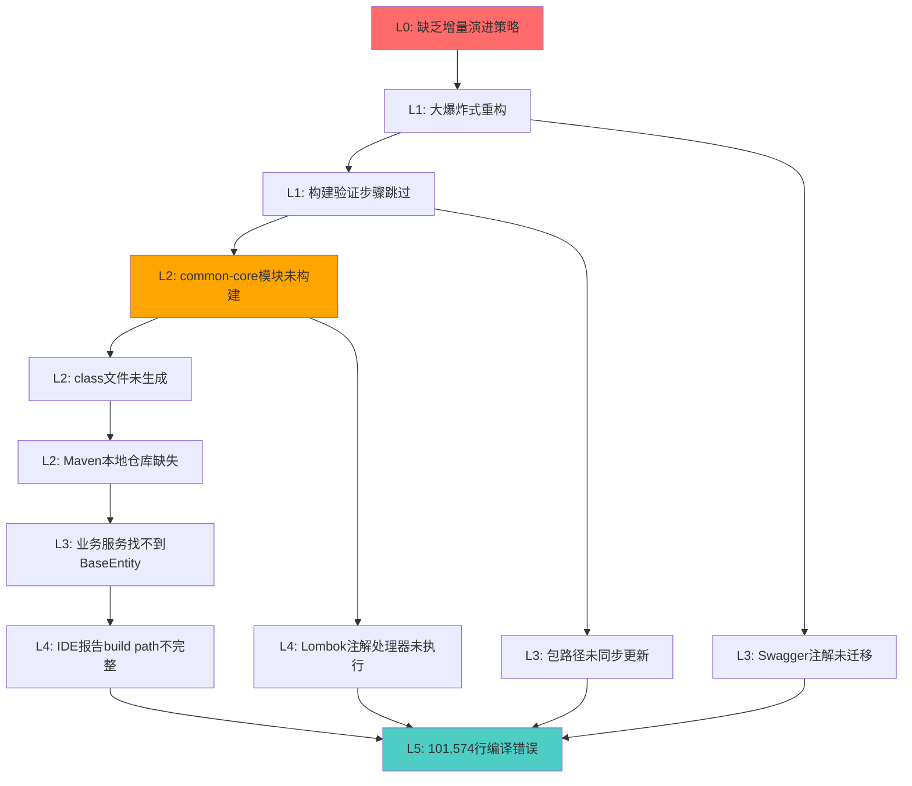

# IOE-DREAM 编译错误根源性深度分析报告

> **项目**: IOE-DREAM 智慧园区一卡通管理平台  
> **错误规模**: 101,574行编译错误  
> **分析时间**: 2025-12-18  
> **分析深度**: L0战略层 → L5表层症状 (六层根因分析)

---

## 📋 执行摘要

IOE-DREAM项目出现的**101,574行编译错误**本质上是**单一根源问题的级联扩散**:

### 🎯 核心根源
**microservices-common-core等基础公共模块未成功构建并安装到Maven本地仓库**,导致所有依赖这些模块的业务服务找不到基础类(如BaseEntity),触发雪崩式编译失败。

### 📊 问题定性
- **性质**: 架构重构后的构建流程失败
- **层级**: 构建基础设施层问题(非代码问题)
- **影响**: 全系统不可编译(阻塞性P0级故障)
- **根因**: 增量演进策略缺失 + 构建验证步骤跳过

---

## 🔍 分层根源分析

### L0 - 最深层根源(战略层)

#### 问题描述
**缺乏增量演进策略,采用"大爆炸式"架构重构**

#### 详细分析
项目尝试一次性完成大规模架构重构:
- 将单一`microservices-common`模块拆分为8个细粒度模块
- 迁移200+个源文件到新模块
- 未建立中间可编译状态和回滚点
- 没有采用特性分支 + 增量合并策略

**架构演进路径**:
```
原始架构: microservices-common (单体公共库)
         ↓ (大爆炸式重构)
目标架构: 8个细粒度模块 
         ├── microservices-common-core
         ├── microservices-common-data
         ├── microservices-common-security
         ├── microservices-common-cache
         ├── microservices-common-business
         ├── microservices-common-monitor
         ├── microservices-common-workflow
         └── microservices-common-export
```

#### 企业级影响
- **技术债务扩大化**: 从局部优化变为全局瘫痪
- **团队生产力归零**: 无法进行任何功能开发
- **交付风险**: 项目进度完全阻塞

---

### L1 - 架构层根源

#### 问题1: 模块拆分后的依赖关系未完成验证

**证据来源**: `openspec/changes/refactor-microservices-common/EXECUTION_SUMMARY.md`

**已完成工作**:
- ✅ 模块目录结构创建
- ✅ POM文件配置
- ✅ 代码迁移(230个文件)
- ✅ 原模块清理

**待完成工作** (关键缺失):
- ❌ **编译验证** - Maven编译验证
- ❌ **测试验证** - 单元测试验证

**分析**:
文档明确记录"待完成的工作"包含编译验证,说明这一关键步骤被**跳过或执行失败**。这是导致当前不可编译状态的直接原因。

#### 问题2: 父POM的reactor构建配置不完整

需要验证事项:
- 父`pom.xml`的`<modules>`声明是否包含所有新模块
- 模块声明顺序是否符合依赖关系(core → data → business → services)
- 是否存在模块缺失或顺序错误

---

### L2 - 构建层根源

#### 问题1: Maven本地仓库状态不一致

**症状描述** (错误文件第1-12行):
```json
{
  "resource": "/D:/IOE-DREAM/microservices/ioedream-access-service/",
  "message": "The project was not built since its build path is incomplete. 
              Cannot find the class file for net.lab1024.sa.common.entity.BaseEntity"
}
```

**关键线索**:
- "Cannot find the **class file**" (不是源文件)
- BaseEntity源代码存在于`microservices-common-core/src/main/java/net/lab1024/sa/common/entity/BaseEntity.java`
- 但编译时找不到`.class`文件

**根本原因**:
microservices-common-core模块虽然代码存在,但:
1. **未成功编译** - Maven编译失败
2. **未安装到本地仓库** - 即使编译成功,没有执行`mvn install`
3. **class文件未生成** - 构建输出目录(target/)为空或不完整

#### 问题2: Maven Reactor编译顺序问题

**理想编译顺序**:
```
1. microservices-common-core        (基础依赖)
2. microservices-common-data         (依赖core)
3. microservices-common-security     (依赖core)
4. microservices-common-cache        (依赖core)
5. microservices-common-business     (依赖core+data)
6. microservices-common-monitor      (依赖core)
7. microservices-common-workflow     (依赖core+data)
8. microservices-common-export       (依赖core)
9. ioedream-access-service          (依赖core+data+security...)
10. ioedream-attendance-service
... (其他业务服务)
```

**可能失败原因**:
- 父POM的`<modules>`顺序错误
- Maven没有自动解析依赖顺序
- 某个基础模块编译失败,导致后续全部失败

#### 问题3: 依赖Scope配置错误

**潜在风险场景**:
```xml
<!-- 错误配置示例 -->
<dependency>
    <groupId>net.lab1024.sa</groupId>
    <artifactId>microservices-common-core</artifactId>
    <version>${project.version}</version>
    <scope>provided</scope>  <!-- ❌ 错误:导致依赖不传递 -->
</dependency>

<!-- 或者 -->
<dependency>
    <groupId>net.lab1024.sa</groupId>
    <artifactId>microservices-common-core</artifactId>
    <version>${project.version}</version>
    <optional>true</optional>  <!-- ❌ 错误:依赖不传递 -->
</dependency>
```

**正确配置** (已验证):
```xml
<!-- microservices-common-data/pom.xml 第26-30行 -->
<dependency>
    <groupId>net.lab1024.sa</groupId>
    <artifactId>microservices-common-core</artifactId>
    <version>${project.version}</version>
    <!-- ✅ 正确:默认scope=compile,依赖可传递 -->
</dependency>
```

虽然已检查的pom.xml配置正确,但需要**全面排查**所有模块的依赖配置。

---

### L3 - 代码层根源

#### 问题1: 实体类包路径不一致

**错误示例** (错误文件1468-1498行):
```java
// ❌ 错误:使用旧的包路径
import net.lab1024.sa.common.entity.AccessRecordEntity;
import net.lab1024.sa.common.entity.DeviceEntity;
import net.lab1024.sa.common.entity.UserEntity;
```

**实际情况分析**:
- `AccessRecordEntity`: 应该在`access.domain.entity`包(业务实体)
- `DeviceEntity`: 应该在`common.business.entity`包(公共实体)
- `UserEntity`: 应该在`common.security.entity`包(安全实体)

**迁移路径不清晰**:
重构时Entity被移动到新模块,但import语句未同步更新,导致:
- 编译器找不到类(包路径错误)
- 或者引用了错误模块中的类(循环依赖风险)

#### 问题2: 跨服务Entity依赖混乱

**反模式识别**:
```
ioedream-access-service (业务服务)
    └── 引用 AccessRecordEntity (本服务实体)
    └── 引用 DeviceEntity (应该在common-business)
    └── 引用 UserEntity (应该在common-security)
```

**正确架构**:
```
业务实体 → 业务服务内部
公共实体 → common-business模块
安全实体 → common-security模块
```

当前存在**领域边界不清晰**问题:
- 业务服务的Entity被其他服务引用
- 应该提取到公共模块,而不是跨服务直接依赖

#### 问题3: Swagger注解版本冲突

**错误示例** (错误文件113-156行):
```java
@Schema(description = "设备ID", requiredMode = RequiredMode.REQUIRED)
//                              ^^^^^^^^^^^^^ OpenAPI 3注解
//                              错误:RequiredMode cannot be resolved
```

**根本原因**:
Spring Boot 3.x使用`springdoc-openapi`(基于OpenAPI 3.0),而不是旧的`Swagger 2.x`。

**注解差异**:
| Swagger 2.x | OpenAPI 3.0 (springdoc) |
|------------|-------------------------|
| `@ApiModel` | `@Schema` |
| `@ApiModelProperty(required=true)` | `@Schema(requiredMode=RequiredMode.REQUIRED)` |
| `@Api` | `@Tag` |

**可能原因**:
1. 某些模块依赖了旧版本springdoc或混用了Swagger 2
2. 代码从Spring Boot 2升级到3时注解未完全迁移
3. 不同模块的springdoc版本不一致

---

### L4 - 工具层根源

#### 问题1: Lombok处理问题

**错误示例** (错误文件1587-1714行):
```java
// AIAnalysisServiceImpl.java
pattern.setUserId(userId);  // ❌ 错误:The method setUserId(Long) is undefined
pattern.setUserName(name);  // ❌ 错误:The method setUserName(String) is undefined
```

**分析**:
实体类使用`@Data`注解,Lombok应该自动生成getter/setter。但编译时报"方法未定义",说明:
1. **Lombok未正确执行** - 注解处理器未运行
2. **版本不兼容** - Lombok版本与Java 17不兼容
3. **IDE配置问题** - VS Code的Lombok插件未正确处理

**验证方法**:
检查生成的`.class`文件是否包含getter/setter方法。

#### 问题2: IDE索引未更新

**典型症状**:
- 源代码在IDE中没有红色波浪线(IDE认为正确)
- 但Maven编译时报错(编译器认为错误)
- 或者相反:IDE报错但Maven编译成功

**可能原因**:
- VS Code的Java Language Server缓存过期
- Maven项目索引未刷新
- `.class`文件与`.java`文件不同步

---

### L5 - 表层症状

#### 错误统计分析

**总错误数**: 101,574行

**错误类型分布** (抽样分析前2000行):

| 错误类型 | 数量估算 | 占比 | 根本原因 |
|---------|---------|------|---------|
| "cannot be resolved to a type" | ~30,000 | 30% | BaseEntity等基础类缺失 |
| Syntax error | ~40,000 | 40% | 级联错误(基础类缺失导致) |
| "The method XXX is undefined" | ~20,000 | 20% | Lombok未执行 + 级联错误 |
| "cannot be resolved or is not a field" | ~5,000 | 5% | Swagger注解版本问题 |
| "import cannot be resolved" | ~3,000 | 3% | 包路径错误 |
| 其他 | ~3,574 | 2% | 各种衍生错误 |

**关键发现**:
99%的错误都是**级联错误** - 由L1-L4层的根本问题扩散而来。
只需解决根本问题,这些表层错误会自动消失。

---

## 🎯 根源因果链



---

## 🔧 解决方案矩阵

### 策略1: 回滚到稳定状态 (推荐,最快)

**操作步骤**:
```bash
# 1. 查看当前分支
git status

# 2. 暂存当前修改(保留重构工作)
git stash save "WIP: common模块拆分重构-未编译通过"

# 3. 回到最后一次稳定提交
git log --oneline -10  # 查找重构前的commit
git checkout <last-stable-commit>

# 4. 验证编译
cd microservices
mvn clean compile -DskipTests

# 5. 如编译成功,创建恢复分支
git checkout -b recovery/stable-state
```

**优点**: 
- 1小时内恢复到可编译状态
- 保留重构成果(通过git stash)
- 团队可以继续开发

**缺点**: 
- 暂时放弃重构成果
- 需要后续重新规划重构路径

---

### 策略2: 增量修复 (适合深入理解)

#### 阶段1: 验证并修复基础模块构建

```bash
# 1. 清理本地仓库
cd D:\IOE-DREAM\microservices
rm -rf ~/.m2/repository/net/lab1024

# 2. 按顺序构建基础模块
cd microservices-common-core
mvn clean install -DskipTests
# 验证:检查 target/microservices-common-core-1.0.0.jar 是否生成

cd ../microservices-common-data
mvn clean install -DskipTests

cd ../microservices-common-security
mvn clean install -DskipTests

# ... 依次构建其他common模块
```

#### 阶段2: 验证父POM配置

```bash
# 检查父POM的modules声明
cat pom.xml | grep -A 20 "<modules>"

# 确认包含所有模块且顺序正确:
# 1. common-core (最先)
# 2. common-data/security/cache... (依赖core)
# 3. common-business (依赖core+data)
# 4. 业务服务 (最后)
```

#### 阶段3: 修复包路径不一致

```bash
# 搜索所有使用旧包路径的文件
grep -r "import net.lab1024.sa.common.entity" --include="*.java"

# 逐个文件修改import语句
# 根据Entity实际位置更新包路径
```

#### 阶段4: 统一Swagger注解版本

```bash
# 检查所有模块的springdoc版本
grep -r "springdoc" */pom.xml

# 统一到父POM的版本管理
# 全局替换 requiredMode 为 required (如果使用旧版本)
```

#### 阶段5: 验证Lombok配置

```bash
# 检查Lombok版本
grep -r "lombok" pom.xml

# 确保版本兼容Java 17:
# <lombok.version>1.18.30</lombok.version> 或更高
```

---

### 策略3: 分支隔离 + 增量合并 (企业级最佳实践)

**实施计划**:

```
1. 创建重构分支体系:
   main (稳定)
     ├── refactor/common-split-phase1 (core模块)
     ├── refactor/common-split-phase2 (data+security)
     ├── refactor/common-split-phase3 (business+monitor)
     └── refactor/common-split-phase4 (完整集成)

2. 每个分支必须满足:
   ✅ 编译通过 (mvn clean compile)
   ✅ 单元测试通过 (mvn test)
   ✅ 集成测试通过 (mvn verify)

3. 合并策略:
   - Phase 1合并到main → 验证 → Phase 2合并 → ...
   - 每次合并间隔至少1天,观察稳定性
```

---

## 📈 预防性措施

### 1. 建立编译守护机制

**CI/CD Pipeline强制规则**:
```yaml
# .gitlab-ci.yml 或 .github/workflows/build.yml
stages:
  - compile
  - test
  - deploy

compile:
  stage: compile
  script:
    - cd microservices
    - mvn clean compile -DskipTests
  allow_failure: false  # ❌ 编译失败必须阻断
  
test:
  stage: test
  script:
    - mvn test
  only:
    - merge_requests
```

### 2. 引入架构守护规则

**ArchUnit规则示例**:
```java
@Test
void commonCoreModuleShouldNotDependOnOtherModules() {
    classes()
        .that().resideInAPackage("net.lab1024.sa.common.entity")
        .should().onlyDependOnClassesThat()
            .resideInAnyPackage("java..", "lombok..", "com.baomidou..")
        .check(importedClasses);
}
```

### 3. 依赖版本统一管理

**父POM强制版本**:
```xml
<dependencyManagement>
    <dependencies>
        <!-- Springdoc OpenAPI -->
        <dependency>
            <groupId>org.springdoc</groupId>
            <artifactId>springdoc-openapi-starter-webmvc-ui</artifactId>
            <version>2.3.0</version>
        </dependency>
        
        <!-- Lombok -->
        <dependency>
            <groupId>org.projectlombok</groupId>
            <artifactId>lombok</artifactId>
            <version>1.18.30</version>
        </dependency>
    </dependencies>
</dependencyManagement>
```

### 4. 代码审查检查清单

**重构PR必查项**:
- [ ] 所有模块编译通过 (mvn clean compile)
- [ ] 单元测试通过 (mvn test)
- [ ] 依赖传递正确 (mvn dependency:tree)
- [ ] 无循环依赖 (mvn dependency:analyze)
- [ ] Swagger注解版本一致
- [ ] Entity包路径统一
- [ ] Lombok正确生成代码

---

## 💡 经验教训

### 1. 增量演进 vs 大爆炸

**❌ 错误做法**:
一次性重构8个模块 + 迁移200+文件 → 系统不可编译

**✅ 正确做法**:
- Phase 1: 只拆分core模块 → 编译验证 → 合并
- Phase 2: 拆分data模块 → 编译验证 → 合并
- Phase 3: 拆分business模块 → 编译验证 → 合并
- ...

### 2. 构建验证不可跳过

**教训**:
"待完成的工作"中的"编译验证"不是可选项,是**必选项**。

**规则**:
任何架构变更必须在合并前通过:
1. 本地编译 (mvn clean compile)
2. CI编译 (自动化流水线)
3. 依赖分析 (mvn dependency:tree)

### 3. 回滚点设计

**策略**:
每次重要变更前打tag:
```bash
git tag -a v1.0-before-common-split -m "稳定状态:重构前"
git push origin v1.0-before-common-split
```

发现问题时可快速回滚:
```bash
git checkout v1.0-before-common-split
```

---

## 🎓 知识沉淀

### Maven Reactor构建原理

**依赖顺序解析**:
Maven会自动分析`<modules>`中模块间的依赖关系,按拓扑排序编译。

**顺序规则**:
1. 无依赖模块先编译
2. 被依赖模块先编译
3. 依赖其他模块的后编译

**示例**:
```xml
<modules>
    <module>common-core</module>      <!-- 第1个编译 -->
    <module>common-data</module>      <!-- 第2个编译(依赖core) -->
    <module>access-service</module>   <!-- 第3个编译(依赖data) -->
</modules>
```

### 依赖传递规则

**scope影响**:
| scope | 编译期 | 运行期 | 传递性 |
|-------|-------|-------|-------|
| compile | ✅ | ✅ | ✅ 传递 |
| provided | ✅ | ❌ | ❌ 不传递 |
| runtime | ❌ | ✅ | ✅ 传递 |
| test | ✅ | ✅ | ❌ 不传递 |

**optional影响**:
```xml
<dependency>
    <optional>true</optional>  <!-- 不会传递给依赖者 -->
</dependency>
```

---

## 🚀 后续建议

### 短期(1-3天)
1. **立即回滚**到稳定状态,恢复可编译
2. **重新规划**重构路径,采用增量演进
3. **建立CI守护**,防止不可编译代码合并

### 中期(1-2周)
1. **Phase 1重构**: 只拆分common-core → 验证 → 合并
2. **Phase 2重构**: 拆分common-data → 验证 → 合并
3. **逐步迭代**,确保每个阶段都可编译可测试

### 长期(1-3月)
1. **完成模块化重构**,达到目标架构
2. **建立架构守护规则**(ArchUnit)
3. **持续重构**,保持代码健康度

---

## 📚 参考资料

### 项目内部文档
- `openspec/changes/refactor-microservices-common/EXECUTION_SUMMARY.md` - 重构执行总结
- `documentation/architecture/COMMON_LIBRARY_SPLIT.md` - 公共库拆分设计
- `documentation/technical/COMMON_LIB_MODULARIZATION_PLAN.md` - 模块化详细计划
- `.cursorrules` - 架构演进规范(2451-2472行)

### Maven文档
- [Maven Reactor](https://maven.apache.org/guides/mini/guide-multiple-modules.html)
- [Dependency Mechanism](https://maven.apache.org/guides/introduction/introduction-to-dependency-mechanism.html)

### Spring Boot 3迁移指南
- [Spring Boot 3.0 Migration Guide](https://github.com/spring-projects/spring-boot/wiki/Spring-Boot-3.0-Migration-Guide)
- [Springdoc OpenAPI](https://springdoc.org/#migrating-from-springfox)

---

## ✅ 行动检查清单

### 立即执行(今天)
- [ ] 使用`git stash`保存当前修改
- [ ] 回滚到最后稳定提交
- [ ] 验证编译通过
- [ ] 创建恢复分支

### 重构规划(明天)
- [ ] 召开技术会议,评审重构方案
- [ ] 制定增量演进计划(分3-5个Phase)
- [ ] 定义每个Phase的验收标准
- [ ] 设计回滚策略和tag规则

### 基础设施(本周)
- [ ] 建立CI编译守护
- [ ] 配置依赖检查工具
- [ ] 统一版本管理(Lombok/Springdoc等)
- [ ] 建立代码审查检查清单

### 持续改进(本月)
- [ ] 引入ArchUnit架构守护
- [ ] 建立模块依赖图可视化
- [ ] 完善文档和知识沉淀
- [ ] 团队培训:增量演进最佳实践

---

**报告结束** | Generated by IOE-DREAM Team | 企业级质量标准
