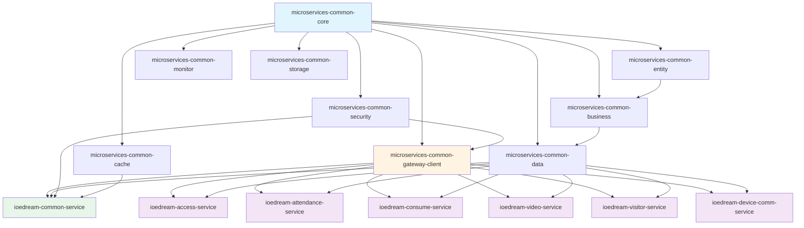

# 模块依赖关系分析报告

**生成时间**: 2025-12-25 14:46:15  
**分析范围**: microservices/  
**工具**: Maven Dependency Plugin  

---

## 📋 执行摘要

本报告通过分析Maven依赖树，生成IOE-DREAM项目微服务模块的依赖关系图。

---

## 📊 模块依赖层次

### 第1层：核心基础模块
- `microservices-common-core` - 最小稳定内核（ResponseDTO、异常、工具类）

### 第2层：细粒度功能模块
- `microservices-common-entity` - 实体层
- `microservices-common-business` - 业务层
- `microservices-common-data` - 数据层
- `microservices-common-security` - 安全层
- `microservices-common-cache` - 缓存层
- `microservices-common-monitor` - 监控层
- `microservices-common-storage` - 存储层
- `microservices-common-gateway-client` - 网关客户端

### 第3层：业务服务层
- `ioedream-common-service` - 公共业务服务
- `ioedream-access-service` - 门禁服务
- `ioedream-attendance-service` - 考勤服务
- `ioedream-consume-service` - 消费服务
- `ioedream-video-service` - 视频服务
- `ioedream-visitor-service` - 访客服务
- `ioedream-device-comm-service` - 设备通讯服务

---

## 🔍 详细依赖分析

### 📦 模块: ioedream-access-service

**描述**: <description>门禁管理服务，提供门禁控制、通行记录等业务API</description>

**打包类型**: `jar`

#### 直接依赖（项目内部模块）

⚠️ Maven依赖分析失败

#### 架构合规性检查

✅ **合规**: 未依赖聚合模块

### 📦 模块: ioedream-attendance-service

**描述**: <description>考勤管理服务，提供考勤打卡、排班管理等业务API</description>

**打包类型**: `jar`

#### 直接依赖（项目内部模块）

⚠️ Maven依赖分析失败

#### 架构合规性检查

✅ **合规**: 未依赖聚合模块

### 📦 模块: ioedream-biometric-service

**描述**: <description>生物模板管理服务，提供模板存储、特征提取、设备下发等功能</description>

**打包类型**: `jar`

#### 直接依赖（项目内部模块）

⚠️ Maven依赖分析失败

#### 架构合规性检查

✅ **合规**: 未依赖聚合模块

### 📦 模块: ioedream-common-service

**描述**: <description>公共业务服务，提供用户、权限、字典等公共业务API</description>

**打包类型**: `jar`

#### 直接依赖（项目内部模块）

⚠️ Maven依赖分析失败

#### 架构合规性检查

❌ **违规**: 依赖了聚合模块 `microservices-common`

### 📦 模块: ioedream-consume-service

**描述**: <description>消费管理微服务，提供消费、账户、报表等业务API</description>

**打包类型**: `jar`

#### 直接依赖（项目内部模块）

⚠️ Maven依赖分析失败

#### 架构合规性检查

✅ **合规**: 未依赖聚合模块

### 📦 模块: ioedream-database-service

**描述**: <description>IOE-DREAM 数据库初始化管理服务 - 统一数据库表结构和初始化数据管理</description>

**打包类型**: `jar`

#### 直接依赖（项目内部模块）

⚠️ Maven依赖分析失败

#### 架构合规性检查

✅ **合规**: 未依赖聚合模块

### 📦 模块: ioedream-db-init

**描述**: <description>IOE-DREAM 数据库初始化与迁移模块（Flyway 统一治理）</description>

**打包类型**: `jar`

#### 直接依赖（项目内部模块）

⚠️ Maven依赖分析失败

#### 架构合规性检查

✅ **合规**: 未依赖聚合模块

### 📦 模块: ioedream-device-comm-service

**描述**: <description>设备通讯服务，提供设备协议、连接管理等功能</description>

**打包类型**: `jar`

#### 直接依赖（项目内部模块）

⚠️ Maven依赖分析失败

#### 架构合规性检查

✅ **合规**: 未依赖聚合模块

### 📦 模块: ioedream-gateway-service

**描述**: <description>API网关服务，提供路由转发、负载均衡、限流熔断等功能</description>

**打包类型**: `jar`

#### 直接依赖（项目内部模块）

⚠️ Maven依赖分析失败

#### 架构合规性检查

❌ **违规**: 依赖了聚合模块 `microservices-common`

### 📦 模块: ioedream-oa-service

**描述**: <description>OA办公服务，提供工作流、审批等业务API</description>

**打包类型**: `jar`

#### 直接依赖（项目内部模块）

⚠️ Maven依赖分析失败

#### 架构合规性检查

✅ **合规**: 未依赖聚合模块

### 📦 模块: ioedream-video-service

**描述**: <description>视频监控服务，提供视频监控、录像回放等业务API</description>

**打包类型**: `jar`

#### 直接依赖（项目内部模块）

⚠️ Maven依赖分析失败

#### 架构合规性检查

✅ **合规**: 未依赖聚合模块

### 📦 模块: ioedream-visitor-service

**描述**: <description>访客管理微服务，提供访客预约、登记、通行等业务API</description>

**打包类型**: `jar`

#### 直接依赖（项目内部模块）

⚠️ Maven依赖分析失败

#### 架构合规性检查

✅ **合规**: 未依赖聚合模块

### 📦 模块: microservices-common

**描述**: <description>公共模块，包含Entity、DAO、Manager等公共组件</description>

**打包类型**: `jar`

#### 直接依赖（项目内部模块）

⚠️ Maven依赖分析失败

#### 架构合规性检查

❌ **违规**: 依赖了聚合模块 `microservices-common`

### 📦 模块: microservices-common-business

**描述**: <description>业务公共组件模块：跨服务共享的业务契约、DTO、工具等（仅限稳定契约，不含领域实现）</description>

**打包类型**: `jar`

#### 直接依赖（项目内部模块）

⚠️ Maven依赖分析失败

#### 架构合规性检查

✅ **合规**: 未依赖聚合模块

### 📦 模块: microservices-common-cache

**描述**: <description>缓存管理模块：Caffeine、Redis、Redisson等缓存横切能力</description>

**打包类型**: `jar`

#### 直接依赖（项目内部模块）

⚠️ Maven依赖分析失败

#### 架构合规性检查

✅ **合规**: 未依赖聚合模块

### 📦 模块: microservices-common-core

**描述**: <description>最小稳定内核：统一响应、异常、常量等</description>

**打包类型**: `jar`

#### 直接依赖（项目内部模块）

⚠️ Maven依赖分析失败

#### 架构合规性检查

✅ **合规**: 未依赖聚合模块

### 📦 模块: microservices-common-data

**描述**: <description>数据访问层模块：MyBatis-Plus、Druid、Flyway等数据层横切能力</description>

**打包类型**: `jar`

#### 直接依赖（项目内部模块）

⚠️ Maven依赖分析失败

#### 架构合规性检查

✅ **合规**: 未依赖聚合模块

### 📦 模块: microservices-common-entity

**描述**: <description>公共实体模块，提供基础实体类和通用数据结构</description>

**打包类型**: `jar`

#### 直接依赖（项目内部模块）

⚠️ Maven依赖分析失败

#### 架构合规性检查

✅ **合规**: 未依赖聚合模块

### 📦 模块: microservices-common-export

**描述**: <description>导出模块：EasyExcel、iText PDF、ZXing等导出横切能力</description>

**打包类型**: `jar`

#### 直接依赖（项目内部模块）

⚠️ Maven依赖分析失败

#### 架构合规性检查

✅ **合规**: 未依赖聚合模块

### 📦 模块: microservices-common-gateway-client

**描述**: <description>网关服务客户端模块，提供统一的微服务间调用接口</description>

**打包类型**: `jar`

#### 直接依赖（项目内部模块）

⚠️ Maven依赖分析失败

#### 架构合规性检查

✅ **合规**: 未依赖聚合模块

### 📦 模块: microservices-common-monitor

**描述**: <description>监控告警模块：Micrometer、Tracing、Prometheus等监控横切能力</description>

**打包类型**: `jar`

#### 直接依赖（项目内部模块）

⚠️ Maven依赖分析失败

#### 架构合规性检查

✅ **合规**: 未依赖聚合模块

### 📦 模块: microservices-common-permission

**描述**: <description>权限验证模块：权限校验、角色管理等权限横切能力</description>

**打包类型**: `jar`

#### 直接依赖（项目内部模块）

⚠️ Maven依赖分析失败

#### 架构合规性检查

✅ **合规**: 未依赖聚合模块

### 📦 模块: microservices-common-security

**描述**: <description>安全认证模块：JWT、Spring Security、加密等安全横切能力</description>

**打包类型**: `jar`

#### 直接依赖（项目内部模块）

⚠️ Maven依赖分析失败

#### 架构合规性检查

✅ **合规**: 未依赖聚合模块

### 📦 模块: microservices-common-storage

**描述**: <description>统一文件存储模块,支持MinIO/本地文件系统/阿里云OSS等多种存储策略</description>

**打包类型**: `jar`

#### 直接依赖（项目内部模块）

⚠️ Maven依赖分析失败

#### 架构合规性检查

✅ **合规**: 未依赖聚合模块

### 📦 模块: microservices-common-workflow

**描述**: <description>工作流模块：Aviator表达式引擎、Quartz任务调度等工作流横切能力（仅限稳定契约/工具，业务实现仍归属ioedream-oa-service）</description>

**打包类型**: `jar`

#### 直接依赖（项目内部模块）

⚠️ Maven依赖分析失败

#### 架构合规性检查

✅ **合规**: 未依赖聚合模块

---

## 📊 依赖关系图

---

## 🎯 关键发现

### 依赖原则

1. **单向依赖**: 所有依赖都是单向的，没有循环依赖
2. **分层清晰**: 严格遵循核心层→功能层→服务层的依赖层次
3. **最小依赖**: 每个服务只依赖真正需要的模块

### 违规检查

- ❌ **禁止**: 业务服务依赖 \`microservices-common\` 聚合模块
- ❌ **禁止**: 服务之间的直接依赖（应通过gateway-client调用）
- ❌ **禁止**: 循环依赖

### 依赖统计

- **核心模块**: 1个（microservices-common-core）
- **功能模块**: 8个（细粒度模块）
- **业务服务**: 7个（微服务）

---

## 📝 建议

### 立即执行（P0）

1. ✅ 确保所有业务服务不依赖 \`microservices-common\` 聚合模块
2. ✅ 确保服务间调用通过 \`gateway-client\`
3. ✅ 验证没有循环依赖

### 持续优化（P1）

1. 定期运行此脚本检查依赖变化
2. 新增模块时验证依赖合规性
3. 维护依赖关系文档同步更新

---

**报告生成**: $(date)  
**脚本版本**: 1.0.0  
**架构团队**: IOE-DREAM Architecture Team

