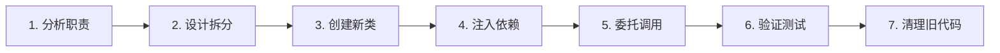

# P2-Batch2 重构执行指南

**文档版本**: v1.0
**适用范围**: P2-Batch2所有重构工作
**目标读者**: 开发团队、重构工程师
**更新日期**: 2025-12-26

---

## 📋 目录

1. [重构原则](#重构原则)
2. [标准重构流程](#标准重构流程)
3. [P0级文件重构指南](#p0级文件重构指南)
4. [代码模板](#代码模板)
5. [检查清单](#检查清单)
6. [验证标准](#验证标准)
7. [常见问题](#常见问题)

---

## 🎯 重构原则

### 核心设计原则

```yaml
单一职责原则 (SRP):
  目标: 每个类只有一个改变的理由
  验证: 类名应该能清晰表达其唯一职责
  示例: "RealtimeEngineCore" 只负责引擎核心逻辑

接口隔离原则 (ISP):
  目标: 使用小而专注的接口
  验证: 接口方法数≤10个
  示例: "EventProcessingManager" 只处理事件相关方法

依赖倒置原则 (DIP):
  目标: 高层模块不依赖低层模块
  验证: 依赖关系单向，无循环依赖
  示例: QueryService依赖ClockInService，而非反向

开闭原则 (OCP):
  目标: 对扩展开放，对修改关闭
  验证: 新增功能通过扩展实现
  示例: 新增算法通过策略模式实现
```

### 重构黄金法则

```java
// ✅ 正确的重构方法（逐步迁移）
// 1. 创建新类，保持原有实现不变
public class NewService {
    // 新的实现
}

// 2. 在原类中添加委托调用
public class OldService {
    @Resource
    private NewService newService;  // 注入新服务

    public Result someMethod() {
        return newService.someMethod();  // 委托
    }
}

// 3. 验证功能正常后，删除原有实现

// ❌ 错误的重构方法（一次性重写）
// 风险：破坏现有功能，难以回滚
public class OldService {
    // 直接删除所有代码，重写
}
```

---

## 📚 标准重构流程

### 7步重构法



### 详细步骤说明

#### 步骤1: 分析职责（1-2小时）

```
目标: 识别类的所有职责

方法:
1. 列出所有公共方法（@Override public）
2. 分析每个方法的功能
3. 按功能聚类方法
4. 识别职责边界

输出:
- 职责清单: {职责1: [方法列表], 职责2: [方法列表]}
- 耦合度分析: {内部依赖, 外部依赖}
- 重构建议: 拆分为N个类

示例:
RealtimeCalculationEngineImpl (1830行, 64个方法)
├── 职责1: 引擎核心 (10个方法) → RealtimeEngineCore
├── 职责2: 事件处理 (15个方法) → EventProcessingManager
├── 职责3: 统计计算 (12个方法) → RealtimeStatisticsCalculator
├── 职责4: 规则管理 (15个方法) → RuleManager
└── 职责5: 性能监控 (12个方法) → PerformanceMonitor
```

#### 步骤2: 设计拆分方案（2-3小时）

```
目标: 设计新类的接口和职责

方法:
1. 定义新类的包路径
2. 设计新类的公共接口
3. 确定类之间的依赖关系
4. 绘制类图和时序图

输出:
- 新类清单: {类名, 包路径, 职责, 依赖}
- 接口定义: {接口名, 方法签名}
- 依赖关系图: 类图

示例:
RealtimeEngineCore (300行)
├── 包路径: net.lab1024.sa.attendance.realtime.core
├── 公共接口: start(), stop(), getStatus()
├── 依赖: EventProcessingManager
└── 依赖方向: RealtimeEngineCore → EventProcessingManager
```

#### 步骤3: 创建新类骨架（1-2小时）

```
目标: 创建新类的基础结构

操作:
1. 创建新类文件
2. 添加类级别注解（@Service, @Slf4j）
3. 定义公共接口方法（空实现）
4. 添加依赖注入（@Resource）
5. 添加JavaDoc注释

模板:
package net.lab1024.sa.attendance.xxx;

import jakarta.annotation.Resource;
import lombok.extern.slf4j.Slf4j;
import org.springframework.stereotype.Service;

/**
 * [类职责描述]
 * <p>
 * [详细说明]
 * </p>
 *
 * @author IOE-DREAM Refactoring Team
 * @since 2025-12-26
 */
@Slf4j
@Service
public class NewService {

    @Resource
    private DependencyService dependencyService;

    /**
     * [方法功能描述]
     *
     * @param param1 [参数说明]
     * @return [返回值说明]
     */
    public Result someMethod(ParamType param1) {
        // TODO: 实现具体逻辑
        log.info("[新服务] 方法调用: param={}", param1);
        return null;
    }
}
```

#### 步骤4: 注入依赖（30分钟）

```
目标: 在原类中注入新服务

操作:
1. 在原类中添加新服务注入
2. 使用@Resource注解
3. 确认Spring容器能正确管理Bean

示例:
@Service
public class OldService {

    // 新增依赖注入
    @Resource
    private NewService newService;

    // 保留原有依赖
    @Resource
    private OtherDependency otherDependency;
}
```

#### 步骤5: 委托调用（1-2小时）

```
目标: 将原方法体替换为委托调用

操作:
1. 逐个方法替换为委托调用
2. 保持方法签名不变
3. 保持返回类型兼容
4. 添加日志记录

示例:
// Before: 原实现（50行代码）
@Override
public ResponseDTO<SomeResult> someMethod(SomeParam param) {
    // ... 50行本地实现
    return ResponseDTO.ok(result);
}

// After: 委托调用（1行代码）
@Override
public ResponseDTO<SomeResult> someMethod(SomeParam param) {
    return newService.someMethod(param);  // 委托
}
```

#### 步骤6: 验证测试（2-3小时）

```
目标: 确保重构后功能正常

验证清单:
├── 编译验证: mvn compile
├── 单元测试: mvn test
├── 集成测试: 启动服务验证
├── API测试: 调用API验证响应
└── 日志验证: 检查日志输出正常

失败处理:
├── 编译失败 → 检查语法错误，修复后重试
├── 测试失败 → 检查逻辑错误，回滚到步骤5
└── API失败 → 检查参数传递，修复后重试
```

#### 步骤7: 清理旧代码（1小时）

```
目标: 删除已迁移的本地实现

操作:
1. 确认所有方法都已委托
2. 删除本地私有方法
3. 删除本地缓存字段
4. 清理无用导入

示例:
// 删除已迁移的私有方法
- private SomeResult localCalculation() { ... }

// 删除本地缓存
- private final Map<String, Object> localCache = new HashMap<>();

// 清理导入
- import xxx.OldDependency;
```

---

## 🔴 P0级文件重构指南

### 1. RealtimeCalculationEngineImpl 重构指南

**文件路径**: `net.lab1024.sa.attendance.realtime.impl.RealtimeCalculationEngineImpl`
**当前规模**: 1,830行, 64个方法
**目标规模**: 拆分为5个类，最大类≤400行

#### 重构方案

```java
// 拆分方案（5个类）
1. RealtimeEngineCore (300行)
   包路径: net.lab1024.sa.attendance.realtime.core
   职责: 引擎核心逻辑（启动、停止、状态管理）
   公共接口:
   - void start()
   - void stop()
   - EngineStatus getStatus()

2. EventProcessingManager (400行)
   包路径: net.lab1024.sa.attendance.realtime.event
   职责: 事件注册、触发、分发
   公共接口:
   - void registerEventHandler(EventHandler)
   - void triggerEvent(Event)
   - void dispatchEvent(Event)

3. RealtimeStatisticsCalculator (300行)
   包路径: net.lab1024.sa.attendance.realtime.statistics
   职责: 统计计算和缓存管理
   公共接口:
   - Statistics calculateStatistics(Long employeeId)
   - void updateCache(Long employeeId, Statistics)

4. RuleManager (250行)
   包路径: net.lab1024.sa.attendance.realtime.rule
   职责: 规则管理和执行
   公共接口:
   - void loadRules()
   - RuleExecutionResult executeRules(Context)

5. PerformanceMonitor (200行)
   包路径: net.lab1024.sa.attendance.realtime.monitor
   职责: 性能监控和指标收集
   公共接口:
   - void recordMetric(String name, double value)
   - PerformanceReport getReport()
```

#### 执行步骤

```yaml
Week1 - Day1: 创建新类骨架
  - 上午: 创建5个新类文件
  - 下午: 定义公共接口和依赖注入
  - 验证: 编译通过

Week1 - Day2-3: 迁移核心逻辑
  - Day2上午: 迁移引擎核心逻辑到RealtimeEngineCore
  - Day2下午: 迁移事件处理逻辑到EventProcessingManager
  - Day3上午: 迁移统计计算逻辑到RealtimeStatisticsCalculator
  - Day3下午: 迁移规则管理逻辑到RuleManager
  - 验证: 每个类编译通过

Week1 - Day4: 迁移监控逻辑
  - 上午: 迁移性能监控逻辑到PerformanceMonitor
  - 下午: 在原类中注入5个新服务
  - 验证: 依赖注入成功

Week1 - Day5: 委托调用和测试
  - 上午: 将原类方法替换为委托调用
  - 下午: 编写单元测试和集成测试
  - 验证: 所有测试通过

验收标准:
  - ✅ 5个新类编译通过
  - ✅ 单元测试覆盖率≥80%
  - ✅ 集成测试通过
  - ✅ API兼容性100%
  - ✅ 代码质量≥90分
```

### 2. AttendanceMobileServiceImpl 剩余部分重构指南

**文件路径**: `net.lab1024.sa.attendance.mobile.impl.AttendanceMobileServiceImpl`
**当前规模**: 1,233行, 18个方法（未委托部分）
**目标规模**: 拆分为5个Manager，每个≤300行

#### 重构方案

```java
// 拆分方案（5个Manager）
1. MobileLeaveManager (200行)
   包路径: net.lab1024.sa.attendance.mobile.leave
   职责: 请假申请、取消
   公共接口:
   - ResponseDTO<LeaveApplicationResult> applyLeave(Request)
   - ResponseDTO<LeaveCancellationResult> cancelLeave(Request)

2. MobileScheduleManager (150行)
   包路径: net.lab1024.sa.attendance.mobile.schedule
   职责: 排班查询
   公共接口:
   - ResponseDTO<ScheduleResult> getSchedule(Param)

3. MobileNotificationManager (300行)
   包路径: net.lab1024.sa.attendance.mobile.notification
   职责: 提醒、通知管理
   公共接口:
   - ResponseDTO<ReminderResult> setReminderSettings(Request)
   - ResponseDTO<RemindersResult> getReminders()
   - ResponseDTO<NotificationsResult> getNotifications()
   - ResponseDTO<NotificationReadResult> markAsRead(String)

4. MobileProfileManager (250行)
   包路径: net.lab1024.sa.attendance.mobile.profile
   职责: 个人资料管理
   公共接口:
   - ResponseDTO<AvatarUploadResult> uploadAvatar(Request)
   - ResponseDTO<ProfileSettingsResult> getSettings()
   - ResponseDTO<SettingsUpdateResult> updateSettings(Request)

5. MobileAnalysisManager (333行)
   包路径: net.lab1024.sa.attendance.mobile.analysis
   职责: 数据分析、日历、图表
   公共接口:
   - ResponseDTO<AnomaliesResult> getAnomalies(Param)
   - ResponseDTO<LeaderboardResult> getLeaderboard(Param)
   - ResponseDTO<ChartsResult> getCharts(Param)
   - ResponseDTO<CalendarResult> getCalendar(Param)
```

#### 执行步骤

```yaml
Week2 - Day1: 创建Manager类
  - 上午: 创建5个Manager类文件
  - 下午: 定义公共接口
  - 验证: 编译通过

Week2 - Day2-3: 迁移业务逻辑
  - Day2上午: 迁移请假逻辑（2个方法）
  - Day2下午: 迁移排班逻辑（1个方法）
  - Day3上午: 迁移通知逻辑（4个方法）
  - Day3下午: 迁移个人资料逻辑（3个方法）
  - 验证: 每个Manager编译通过

Week2 - Day4: 迁移分析逻辑
  - 上午: 迁移数据分析逻辑（4个方法）
  - 下午: 在AttendanceMobileServiceImpl中注入5个Manager
  - 验证: 依赖注入成功

Week2 - Day5: 委托调用和测试
  - 上午: 将18个方法替换为委托调用
  - 下午: 编写测试
  - 验证: 所有测试通过

验收标准:
  - ✅ 5个Manager编译通过
  - ✅ 单元测试覆盖率≥80%
  - ✅ 集成测试通过
  - ✅ API兼容性100%
```

---

## 📝 代码模板

### 新服务类模板

```java
package net.lab1024.sa.attendance.{module};

import java.util.List;
import java.util.Map;

import jakarta.annotation.Resource;
import lombok.extern.slf4j.Slf4j;
import org.springframework.stereotype.Service;

import net.lab1024.sa.attendance.{module}.model.{Type};
import net.lab1024.sa.attendance.dao.{Dao};
import net.lab1024.sa.common.dto.ResponseDTO;

/**
 * {服务职责描述}
 * <p>
 * {详细说明}
 * </p>
 * <p>
 * 从{原类名}中抽取，遵循单一职责原则
 * </p>
 *
 * @author IOE-DREAM Refactoring Team
 * @since 2025-12-26
 */
@Slf4j
@Service
public class {NewServiceName} {

    @Resource
    private {DependencyService} {dependencyService};

    /**
     * {方法功能描述}
     * <p>
     * {详细说明}
     * </p>
     *
     * @param {paramName} {参数说明}
     * @return {返回值说明}
     */
    public ResponseDTO<{ResultType}> {methodName}({ParamType} {paramName}) {
        try {
            log.info("[{模块名}] {操作描述}: paramName={}", {paramName});

            // 1. 参数验证
            if ({paramName} == null) {
                return ResponseDTO.error("PARAM_ERROR", "{参数不能为空}");
            }

            // 2. 业务逻辑处理
            {ResultType} result = {businessLogic};

            log.info("[{模块名}] {操作描述}成功: result={}", result);
            return ResponseDTO.ok(result);

        } catch (Exception e) {
            log.error("[{模块名}] {操作描述}失败: error={}", e.getMessage(), e);
            return ResponseDTO.error("SYSTEM_ERROR", "{操作失败，请重试}");
        }
    }

    /**
     * {私有辅助方法描述}
     *
     * @param {paramName} {参数说明}
     * @return {返回值说明}
     */
    private {ReturnType} {helperMethod}({ParamType} {paramName}) {
        // 辅助逻辑实现
    }
}
```

### 委托调用模板

```java
// 在原类中委托方法

/**
 * {方法功能描述}
 * <p>
 * 委托给{NewServiceName}处理
 * </p>
 */
@Override
public ResponseDTO<{ResultType}> {methodName}({ParamType} {paramName}) {
    return {newServiceName}.{methodName}({paramName});
}
```

---

## ✅ 检查清单

### 重构前检查清单

```markdown
## 文件: {FileName}

### 分析阶段
- [ ] 列出所有公共方法（数量: __）
- [ ] 分析每个方法的职责
- [ ] 按功能聚类方法
- [ ] 识别职责边界（__个职责）
- [ ] 评估耦合度（高/中/低）

### 设计阶段
- [ ] 设计新类结构（__个新类）
- [ ] 定义包路径
- [ ] 设计公共接口
- [ ] 绘制依赖关系图
- [ ] 评估重构风险（高/中/低）

### 准备阶段
- [ ] 确认重构时间窗口（__天）
- [ ] 分配重构人员（__人）
- [ ] 准备测试环境
- [ ] 创建开发分支
- [ ] 设置代码审查流程

### 启动条件
- [ ] 所有分析完成
- [ ] 设计方案已评审
- [ ] 测试环境就绪
- [ ] 团队成员已培训
- [ ] 风险评估已完成
```

### 重构中检查清单

```markdown
## 文件: {FileName}

### Day 1 - 创建新类
- [ ] 创建所有新类文件
- [ ] 添加类级别注解
- [ ] 定义公共接口（空实现）
- [ ] 添加依赖注入
- [ ] 添加JavaDoc注释
- [ ] 编译验证通过

### Day 2 - 迁移核心逻辑
- [ ] 迁移方法1: {methodName}
- [ ] 迁移方法2: {methodName}
- [ ] ...
- [ ] 每个类编译通过
- [ ] 代码格式检查通过
- [ ] 日志输出正常

### Day 3 - 注入依赖
- [ ] 在原类中注入新服务
- [ ] 验证Bean管理正常
- [ ] 检查依赖方向正确
- [ ] 确认无循环依赖

### Day 4 - 委托调用
- [ ] 替换方法为委托调用
- [ ] 保持方法签名不变
- [ ] 验证返回类型兼容
- [ ] 添加日志记录

### Day 5 - 测试验证
- [ ] 编译验证: mvn compile
- [ ] 单元测试: mvn test
- [ ] 集成测试: 启动服务
- [ ] API测试: 调用接口
- [ ] 日志验证: 检查输出
- [ ] 性能测试: 响应时间

### Day 5 - 清理旧代码
- [ ] 确认所有方法已委托
- [ ] 删除本地私有方法
- [ ] 删除本地缓存字段
- [ ] 清理无用导入
- [ ] 代码格式化
- [ ] 最终编译验证
```

### 重构后验收清单

```markdown
## 文件: {FileName}

### 功能验证
- [ ] 所有单元测试通过
- [ ] 所有集成测试通过
- [ ] API兼容性100%
- [ ] 无功能回退
- [ ] 性能无明显下降

### 代码质量
- [ ] 代码质量评分≥90分
- [ ] 单一职责原则达标
- [ ] 无循环依赖
- [ ] 日志规范100%符合
- [ ] 注释完整

### 文档完整性
- [ ] JavaDoc注释完整
- [ ] 重构报告已生成
- [ ] 类图已更新
- [ ] 接口文档已更新
- [ ] 变更日志已记录

### 团队验收
- [ ] 代码审查通过
- [ ] 测试团队确认
- [ ] 产品团队确认
- [ ] 技术负责人批准
```

---

## 🎯 验证标准

### 编译验证标准

```bash
# 编译验证命令
mvn clean compile -pl microservices/ioedream-attendance-service

# 通过标准
✅ 无编译错误
✅ 无编译警告（重构相关）
✅ 编译时间<2分钟

# 失败处理
❌ 编译失败 → 检查语法错误，修复后重试
❌ 编译警告 → 修复警告后重试
❌ 编译超时 → 优化依赖，重新编译
```

### 单元测试标准

```bash
# 单元测试命令
mvn test -pl microservices/ioedream-attendance-service

# 通过标准
✅ 测试覆盖率≥80%
✅ 所有测试用例通过
✅ 无跳过的测试
✅ 测试时间<5分钟

# 失败处理
❌ 测试失败 → 检查逻辑错误，回滚后修复
❌ 覆盖率不足 → 补充测试用例
❌ 测试超时 → 优化测试代码
```

### 集成测试标准

```bash
# 集成测试步骤
1. 启动服务: mvn spring-boot:run
2. 健康检查: curl http://localhost:8091/actuator/health
3. 调用API: 测试所有重构相关接口
4. 验证响应: 检查返回值正确性

# 通过标准
✅ 服务正常启动
✅ 健康检查UP
✅ API响应正常
✅ 响应时间<500ms
✅ 无ERROR日志

# 失败处理
❌ 启动失败 → 检查配置，修复依赖
❌ API异常 → 检查参数，修复逻辑
❌ 响应慢 → 检查性能，优化代码
```

### API兼容性标准

```yaml
兼容性验证:
  方法签名: 100%保持不变
  返回类型: 100%兼容
  参数类型: 100%兼容
  注解保留: 100%保留

客户端验证:
  - 客户端代码无需修改
  - API调用方式不变
  - 响应格式兼容

验证方法:
  1. 对比重构前后API文档
  2. 调用所有API接口
  3. 验证响应格式
  4. 确认无破坏性变更
```

---

## ❓ 常见问题

### Q1: 如何确定何时应该拆分类？

**答**: 使用以下指标判断：

```
拆分信号:
├── ⚠️ 代码行数>500行
├── ⚠️ 公共方法数>20个
├── ⚠️ 私有方法数>30个
├── ⚠️ 职责描述需要"和"、"或"、"以及"
└── ⚠️ 类名无法用一个词汇概括

示例:
// ❌ 需要拆分
class AttendanceManager {  // 1000行，50个方法
    // 打卡管理
    // 请假管理
    // 排班管理
    // ... 混杂职责
}

// ✅ 职责单一
class ClockInManager {  // 200行，10个方法
    // 只管打卡
}
```

### Q2: 如何处理循环依赖？

**答**: 使用以下策略解决：

```java
// ❌ 错误：循环依赖
@Service
public class ServiceA {
    @Resource
    private ServiceB serviceB;
}

@Service
public class ServiceB {
    @Resource
    private ServiceA serviceA;  // 循环依赖！
}

// ✅ 正确：提取公共接口
// 1. 定义接口
public interface CommonService {
    Result commonMethod();
}

// 2. 实现接口
@Service
public class ServiceA implements CommonService {
    // 依赖接口，而非具体实现
    @Resource
    private CommonService serviceB;
}

// 3. 通过依赖倒置打破循环
```

### Q3: 如何保证重构不破坏功能？

**答**: 遵循以下安全流程：

```
安全重构流程:
1. 创建新类，保持原类不变
2. 新类实现相同接口
3. 在原类中注入新类
4. 逐个方法替换为委托调用
5. 每步都运行测试验证
6. 全部完成后删除旧实现
7. 如有问题，立即回滚

回滚策略:
- Git版本控制
- 分支隔离（重构分支）
- 逐步提交（每个类一个提交）
- 测试保护（自动测试）
```

### Q4: 如何测试重构后的代码？

**答**: 分层测试策略：

```yaml
单元测试层:
  目标: 测试单个类的方法
  范围: 新创建的服务类
  工具: JUnit + Mockito
  覆盖率: ≥80%

集成测试层:
  目标: 测试服务间协作
  范围: 多个服务交互场景
  工具: Spring Boot Test
  场景数: ≥5个典型场景

API测试层:
  目标: 测试API接口兼容性
  范围: 所有公共API
  工具: RestAssured / Postman
  覆盖率: 100%

性能测试层:
  目标: 测试响应时间
  范围: 关键API接口
  工具: JMeter
  标准: 响应时间<500ms
```

### Q5: 重构需要多长时间？

**答**: 根据文件复杂度：

```
时间估算:
├── 简单重构（1-2个类）: 2-3天
├── 中等重构（3-5个类）: 5-7天
└── 复杂重构（6-10个类）: 10-14天

P0级文件估算:
├── RealtimeCalculationEngineImpl: 1周（拆分为5个类）
├── AttendanceMobileServiceImpl: 1周（拆分为5个Manager）
├── SchedulePredictorImpl: 3天（拆分为4个类）
└── GeneticAlgorithmImpl: 3天（拆分为4个类）

总计: 约3周完成4个P0文件
```

### Q6: 如何选择重构优先级？

**答**: 使用优先级矩阵：

```
优先级矩阵:
    高影响 │  P0  │  P1  │
    ───────┼─────┼─────┤
    高复杂 │  紧急 │ 高   │
    ───────┼─────┼─────┤
    低影响 │  P2  │  P3  │
    ───────┼─────┼─────┘
          低复杂  高复杂

评估维度:
├── 影响: 文件被依赖的数量、业务重要性
├── 复杂度: 代码行数、方法数、圈复杂度
└── 紧急度: 技术债务、业务需求、维护难度

P0标准:
├── 代码行数>1000行
├── 方法数>30个
├── 被多个核心模块依赖
└── 维护频繁
```

---

## 📞 支持和反馈

### 技术支持

```
遇到问题时的资源:
├── P2-Batch1完成报告: P2_BATCH1_FINAL_SUMMARY.md
├── P2-Batch2准备报告: P2_BATCH2_PREPARATION_REPORT.md
├── 代码规范: CLAUDE.md
└── 架构文档: documentation/architecture/

寻求帮助的渠道:
├── 架构委员会: 架构决策、技术评审
├── 代码审查团队: 代码质量检查
├── 测试团队: 测试策略、测试执行
└── DevOps团队: 环境配置、部署支持
```

### 反馈机制

```
重构反馈:
├── 每日站会: 同步进度、讨论问题
├── 每周评审: 检查质量、调整计划
├── 问题上报: 及时记录和跟踪问题
└── 经验总结: 提炼可复用模式
```

---

## 🚀 快速启动

### 启动P2-Batch2的5个步骤

```
步骤1: 准备环境（1天）
├── 创建重构分支: git checkout -b refactor/p2-batch2
├── 更新代码: git pull
├── 设置IDE: 导入项目、配置检查
└── 验证环境: mvn compile

步骤2: 团队培训（1天）
├── 学习本指南: 阅读10-15分钟
├── 理解原则: 理解SOLID原则
├── 熟悉模板: 代码模板实操
└── 讨论答疑: Q&A环节

步骤3: 选择首个P0文件（1天）
├── 评审候选: 评审4个P0文件
├── 确认优先级: RealtimeCalculationEngineImpl
├── 分配任务: 分配给重构工程师
└── 设定时间: 1周完成

步骤4: 执行重构（5天）
├── Day1-2: 创建新类和迁移逻辑
├── Day3: 注入依赖和委托调用
├── Day4: 测试验证
└── Day5: 清理和文档

步骤5: 验收总结（1天）
├── 代码审查: 检查代码质量
├── 测试确认: 验证所有测试通过
├── 文档完善: 完成重构报告
└── 经验总结: 提炼可复用经验
```

---

**准备好开始P2-Batch2重构了吗？让我们一起创造更优质的代码！** 🚀

---

**文档维护**: 本指南将在P2-Batch2执行过程中持续更新和完善
**版本历史**: v1.0 (2025-12-26 初始版本)
**反馈渠道**: 请将问题和建议反馈给架构委员会
