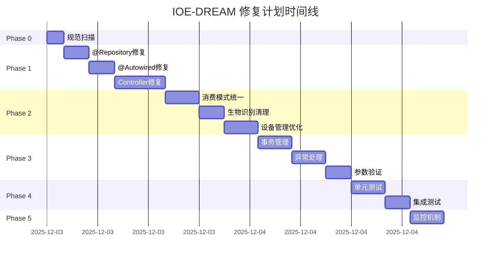

# IOE-DREAM 修复计划总结

**创建日期**: 2025-12-03  
**状态**: ✅ 已完成计划制定，等待执行

---

## 📋 已完成工作

### 1. ✅ 全面修复计划制定

**文档**: `COMPREHENSIVE_REMEDIATION_PLAN_2025-12-03.md`

**内容包括**:
- Phase 0: 规范扫描基线建立
- Phase 1: 架构违规修复（P0）
- Phase 2: 代码冗余清理（P0）
- Phase 3: 业务逻辑严谨性修复（P1）
- Phase 4: 测试验证（P2）
- Phase 5: 持续监控机制（P2）

**特点**:
- 详细的执行步骤
- 明确的预计工作量
- 清晰的验收标准
- 完善的风险管理

### 2. ✅ 自动化扫描工具创建

**位置**: `scripts/compliance-scan/`

**包含脚本**:
- `scan-repository-violations.ps1` - @Repository违规扫描
- `scan-autowired-violations.ps1` - @Autowired违规扫描
- `scan-architecture-violations.ps1` - 架构违规扫描
- `run-all-scans.ps1` - 一键执行所有扫描
- `README.md` - 详细使用说明
- `pre-commit-hook-template.sh` - Git提交前自动检查

**功能特性**:
- ✅ 自动扫描违规代码
- ✅ 生成详细报告
- ✅ 统计违规数量
- ✅ 提供修复建议
- ✅ 支持自动修复命令

---

## 🎯 核心修复目标

### P0优先级（立即执行）

#### 1. 架构违规修复
| 违规类型 | 问题 | 修复方案 | 预计时间 |
|---------|------|---------|---------|
| @Repository注解 | 违反MyBatis-Plus规范 | 替换为@Mapper | 2-3小时 |
| @Autowired注解 | 违反Jakarta EE规范 | 替换为@Resource | 2-3小时 |
| Controller架构 | 跨层调用DAO/Manager | 通过Service层访问 | 4-6小时 |

#### 2. 代码冗余清理
| 冗余类型 | 问题 | 修复方案 | 预计时间 |
|---------|------|---------|---------|
| 消费模式架构 | 两套实现并存 | 保留ConsumptionModeEngine | 3-4小时 |
| 生物识别功能 | access-service残留 | 清理本地实现 | 2-3小时 |
| 设备管理实体 | 实体类冗余 | 接口统一+独立保持 | 3-4小时 |

### P1优先级（第二批）

#### 3. 业务逻辑完善
| 完善项 | 问题 | 修复方案 | 预计时间 |
|--------|------|---------|---------|
| 事务管理 | 注解不规范 | 统一@Transactional配置 | 3-4小时 |
| 异常处理 | 处理不完整 | 完善异常处理机制 | 3-4小时 |
| 参数验证 | 验证不完整 | 补充@Valid和验证注解 | 2-3小时 |

---

## 📊 执行时间线



**总预计时间**: 32-44小时  
**建议周期**: 5-7个工作日

---

## 🚀 快速开始指南

### Step 1: 执行基线扫描（Phase 0）

```powershell
# 进入扫描脚本目录
cd D:\IOE-DREAM\scripts\compliance-scan

# 执行全部扫描
powershell -ExecutionPolicy Bypass -File run-all-scans.ps1

# 查看综合报告
notepad D:\IOE-DREAM\reports\compliance-summary-[timestamp].md
```

**预期输出**:
- 生成4个详细报告
- 显示违规统计数据
- 提供修复建议

### Step 2: 开始Phase 1修复

根据扫描报告的优先级，按顺序修复：

1. **@Repository违规**
   ```powershell
   # 查看详细报告
   notepad D:\IOE-DREAM\reports\repository-violations-[timestamp].txt
   
   # 执行自动修复（谨慎使用）
   # 参考: scripts/compliance-scan/README.md
   ```

2. **@Autowired违规**
   ```powershell
   # 查看详细报告
   notepad D:\IOE-DREAM\reports\autowired-violations-[timestamp].txt
   
   # 执行自动修复（谨慎使用）
   # 参考: scripts/compliance-scan/README.md
   ```

3. **架构违规**
   ```powershell
   # 查看详细报告
   notepad D:\IOE-DREAM\reports\architecture-violations-[timestamp].txt
   
   # 手动修复（需要创建Service层）
   ```

### Step 3: 验证修复效果

```powershell
# 重新运行扫描
cd D:\IOE-DREAM\scripts\compliance-scan
powershell -ExecutionPolicy Bypass -File run-all-scans.ps1

# 编译验证
cd D:\IOE-DREAM
mvn clean compile

# 运行测试
mvn test
```

---

## 📈 修复进度跟踪

### 使用进度看板

在 `COMPREHENSIVE_REMEDIATION_PLAN_2025-12-03.md` 中有详细的进度看板，包括：

- [ ] Phase 0: 规范扫描
- [ ] Phase 1: 架构违规修复
- [ ] Phase 2: 代码冗余清理
- [ ] Phase 3: 业务逻辑完善
- [ ] Phase 4: 测试验证
- [ ] Phase 5: 监控机制

### 里程碑验收

- 🎯 **M1**: 架构违规修复完成（D+2）
- 🎯 **M2**: 代码冗余清理完成（D+4）
- 🎯 **M3**: 业务逻辑完善（D+6）
- 🎯 **M4**: 全面验证通过（D+7）
- 🎯 **M5**: 监控机制建立（D+7）

---

## ✅ 最终验收标准

### 架构合规性
- ✅ 0个@Repository注解残留
- ✅ 0个@Autowired注解残留
- ✅ 0个Repository后缀命名
- ✅ Controller层无DAO/Manager注入
- ✅ 四层架构边界清晰

### 代码质量
- ✅ 无废弃代码残留
- ✅ 无重复功能实现
- ✅ 事务注解正确
- ✅ 异常处理完善
- ✅ 参数验证完整

### 测试覆盖
- ✅ 核心Service测试覆盖率 > 80%
- ✅ 所有单元测试通过
- ✅ 所有集成测试通过

### 文档完整
- ✅ 架构文档更新
- ✅ 开发规范更新
- ✅ API文档完整
- ✅ 变更日志清晰

### 监控机制
- ✅ Git Hook生效
- ✅ CI检查通过
- ✅ 定期检查脚本
- ✅ 合规报告生成

---

## 📚 关键文档索引

### 核心计划文档
- [**完整修复计划**](./COMPREHENSIVE_REMEDIATION_PLAN_2025-12-03.md) - 详细的Phase-by-Phase执行计划
- [**全局深度分析**](./GLOBAL_PROJECT_DEEP_ANALYSIS_2025-12-03.md) - 问题识别和根因分析
- [**架构规范**](./CLAUDE.md) - IOE-DREAM项目唯一架构规范

### 扫描工具文档
- [**扫描工具使用说明**](./scripts/compliance-scan/README.md) - 如何使用扫描脚本
- [**扫描脚本目录**](./scripts/compliance-scan/) - 所有扫描脚本位置

### 迁移完成报告
- [**生物识别迁移报告**](./BIOMETRIC_MIGRATION_COMPLETE.md) - 生物识别功能迁移详情
- [**生物识别API文档**](./BIOMETRIC_API_DOCUMENTATION.md) - 新的API接口文档

### 历史参考
- **Repository迁移报告** - 历史Repository违规修复记录
- **消费模块架构分析** - 消费模式冗余问题分析

---

## 🚨 重要提醒

### 执行前必读

1. **备份代码**: 执行任何批量修改前，确保Git状态干净或已备份
2. **逐步验证**: 不要一次性修改所有文件，建议分批修复并验证
3. **测试优先**: 每次修复后必须运行测试确保功能正常
4. **团队沟通**: 重大修改需要团队知晓，避免冲突

### 自动修复注意事项

**⚠️ 谨慎使用自动修复命令**:
- 自动修复脚本可能影响特殊场景代码
- 建议先在小范围测试
- 修复后必须手动检查关键文件
- 确保测试通过后再大规模应用

### 手动修复场景

以下情况**必须手动修复**:
- ✋ Controller层架构违规（需要创建Service层）
- ✋ 复杂的事务管理调整
- ✋ 异常处理逻辑完善
- ✋ 业务规则验证补充

---

## 📞 支持和反馈

### 遇到问题？

1. **查看文档**: 优先查看相关文档和FAQ
2. **检查报告**: 查看扫描报告的详细建议
3. **参考规范**: 查看CLAUDE.md了解规范细节
4. **寻求支持**: 联系架构团队获取帮助

### 文档位置

- 📋 完整计划: `COMPREHENSIVE_REMEDIATION_PLAN_2025-12-03.md`
- 🔧 扫描工具: `scripts/compliance-scan/README.md`
- 📖 架构规范: `CLAUDE.md`
- 📊 分析报告: `GLOBAL_PROJECT_DEEP_ANALYSIS_2025-12-03.md`

---

## 🎯 下一步行动

### 立即执行

```powershell
# 1. 执行基线扫描
cd D:\IOE-DREAM\scripts\compliance-scan
powershell -ExecutionPolicy Bypass -File run-all-scans.ps1

# 2. 查看报告
cd D:\IOE-DREAM\reports
dir

# 3. 开始Phase 1修复
# 参考: COMPREHENSIVE_REMEDIATION_PLAN_2025-12-03.md
```

### 持续改进

- 📅 每周执行合规性扫描
- 🔄 建立Git Pre-commit Hook
- 📈 集成CI/CD自动检查
- 📚 定期更新文档

---

**计划制定**: AI架构分析助手  
**执行负责**: 开发团队  
**监督审核**: 架构委员会  
**完成目标**: 7个工作日内完成所有P0和P1修复

---

## ✨ 成功标志

当所有以下条件满足时，修复工作宣告成功：

- ✅ 合规性扫描100%通过
- ✅ 所有单元测试和集成测试通过
- ✅ 代码覆盖率达标（>80%）
- ✅ 自动化监控机制运行正常
- ✅ 团队完全理解并遵循新规范

**让我们一起构建高质量、高可用、高性能的IOE-DREAM智能管理系统！** 🚀

